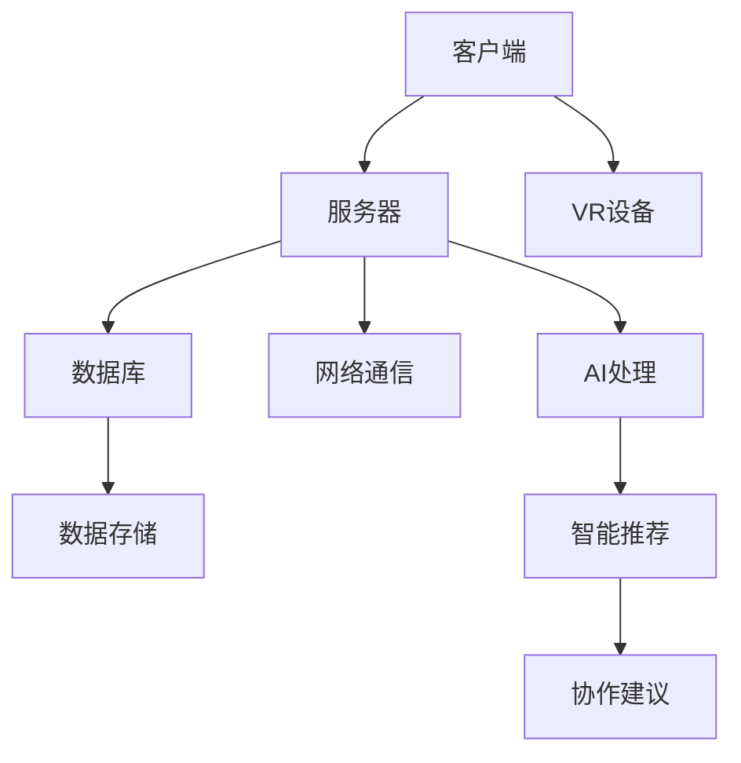

                 

关键词：元宇宙，远程协作，虚拟工作空间，虚拟现实，人工智能，沉浸式体验，协作效率，实时互动

> 摘要：随着虚拟现实和人工智能技术的迅猛发展，元宇宙工作空间成为远程协作的新兴领域。本文将探讨元宇宙工作空间的概念、技术架构、核心算法原理、应用场景以及未来发展趋势，旨在为读者提供关于这一革命性变革的全面了解。

## 1. 背景介绍

近年来，随着全球化和信息技术的快速发展，远程协作已成为企业组织不可或缺的一部分。然而，传统的远程协作工具和平台在实时互动、协作效率和沉浸式体验方面仍存在诸多限制。随着虚拟现实（VR）和人工智能（AI）技术的不断进步，元宇宙工作空间作为一种全新的远程协作模式应运而生。

元宇宙工作空间是一个虚拟的三维空间，用户可以通过VR设备进入，进行各种形式的远程协作活动。它不仅能够模拟现实工作环境，还可以提供丰富的交互功能和沉浸式体验，从而显著提高协作效率和团队凝聚力。

### 元宇宙工作空间的特点

- **沉浸式体验**：用户可以通过VR设备进入元宇宙工作空间，感受到身临其境的感觉，这有助于提高协作的真实感和参与度。
- **实时互动**：元宇宙工作空间支持实时语音、视频、文字等多种通信方式，使得远程团队成员之间的交流更加便捷和高效。
- **空间灵活性**：用户可以在元宇宙工作空间中自定义工作区域，根据个人需求和团队规模进行灵活调整。
- **增强现实功能**：元宇宙工作空间可以集成增强现实（AR）技术，将虚拟元素与现实环境相结合，创造更多的应用场景。

## 2. 核心概念与联系

### 2.1 虚拟现实与元宇宙

虚拟现实（VR）是元宇宙工作空间的基础技术之一。VR技术通过模拟现实环境，使用户在虚拟空间中感受到沉浸式体验。元宇宙则是一个更加广阔的概念，它不仅包括虚拟现实，还涵盖了数字孪生、增强现实（AR）、区块链等新兴技术。

### 2.2 人工智能与元宇宙

人工智能（AI）在元宇宙工作空间中发挥着关键作用。AI技术可以用于实现智能推荐、自动聊天、虚拟助手等功能，从而提高用户的协作效率和体验。例如，通过AI技术，元宇宙工作空间可以自动识别用户的行为模式，并提供个性化的协作建议。

### 2.3 虚拟工作空间架构

元宇宙工作空间的技术架构主要包括以下几个方面：

- **客户端**：用户通过VR设备或PC进入元宇宙工作空间，客户端负责渲染虚拟环境、处理用户交互等。
- **服务器**：服务器端负责处理大量数据，包括用户身份验证、虚拟物体位置、实时通信等。
- **数据库**：数据库存储用户数据、虚拟物体信息、协作记录等，确保数据的持久性和一致性。
- **网络通信**：通过网络通信实现客户端与服务器之间的数据传输，保证实时互动的稳定性。

## 2.4 Mermaid 流程图

以下是一个简化的元宇宙工作空间技术架构的Mermaid流程图：



## 3. 核心算法原理 & 具体操作步骤

### 3.1 算法原理概述

元宇宙工作空间的核心算法主要包括以下几个方面：

- **位置追踪算法**：用于确定用户在虚拟空间中的位置，并保持实时同步。
- **碰撞检测算法**：用于检测虚拟物体之间的碰撞，确保虚拟环境的真实性。
- **实时通信算法**：用于实现客户端与服务器之间的数据传输，保证实时互动的稳定性。
- **AI算法**：用于实现智能推荐、自动聊天、虚拟助手等功能。

### 3.2 算法步骤详解

#### 3.2.1 位置追踪算法

1. **初始化**：客户端和服务器端初始化位置信息。
2. **位置更新**：客户端每隔一定时间向服务器发送当前位置信息。
3. **位置同步**：服务器端接收到位置信息后，更新所有客户端的位置信息。

#### 3.2.2 碰撞检测算法

1. **构建模型**：将虚拟物体抽象为简单的几何模型，如球体、立方体等。
2. **空间分割**：将虚拟空间分割为多个小区域，减少碰撞检测的计算量。
3. **碰撞检测**：对相邻区域中的虚拟物体进行碰撞检测，并更新物体的状态。

#### 3.2.3 实时通信算法

1. **连接建立**：客户端和服务器端建立TCP/IP连接。
2. **数据传输**：客户端将虚拟物体的位置、状态等信息发送给服务器端。
3. **数据接收**：服务器端接收到数据后，更新虚拟环境。

#### 3.2.4 AI算法

1. **用户行为分析**：通过分析用户的操作记录，了解用户的行为习惯。
2. **智能推荐**：根据用户的行为习惯，推荐相关的协作工具或功能。
3. **自动聊天**：通过自然语言处理技术，实现虚拟助手与用户的实时对话。

### 3.3 算法优缺点

#### 3.3.1 优点

- **高效性**：位置追踪和碰撞检测算法能够快速计算，确保虚拟环境的真实性。
- **稳定性**：实时通信算法保证了客户端与服务器之间的数据传输稳定性。
- **智能化**：AI算法能够根据用户行为提供个性化的协作建议，提高协作效率。

#### 3.3.2 缺点

- **计算开销**：位置追踪和碰撞检测算法需要大量的计算资源，对硬件性能要求较高。
- **延迟问题**：实时通信算法可能存在一定的延迟，影响用户的互动体验。

### 3.4 算法应用领域

- **远程办公**：元宇宙工作空间可以模拟现实工作环境，实现远程团队的协作。
- **在线教育**：元宇宙工作空间可以提供沉浸式的学习体验，提高学生的学习积极性。
- **医疗健康**：元宇宙工作空间可以模拟医疗场景，为医生提供更直观的诊疗工具。
- **虚拟旅游**：元宇宙工作空间可以模拟旅游场景，为用户提供身临其境的旅游体验。

## 4. 数学模型和公式 & 详细讲解 & 举例说明

### 4.1 数学模型构建

在元宇宙工作空间中，位置追踪算法和碰撞检测算法是核心数学模型。以下是这两个算法的数学模型构建：

#### 4.1.1 位置追踪算法

1. **位置更新公式**：

   $$ \text{新位置} = \text{当前位置} + \text{移动速度} \times \text{时间间隔} $$

2. **位置同步公式**：

   $$ \text{新位置} = \text{当前位置} + \text{相对位移} $$

#### 4.1.2 碰撞检测算法

1. **碰撞检测公式**：

   $$ \text{碰撞} = (\text{物体A} \cap \text{物体B}) \neq \emptyset $$

2. **碰撞响应公式**：

   $$ \text{新速度} = \text{当前速度} - \text{碰撞力} \times \text{时间间隔} $$

### 4.2 公式推导过程

#### 4.2.1 位置追踪算法推导

位置追踪算法的核心是计算物体的新位置。假设物体在时间t1的位置为$(x_1, y_1, z_1)$，移动速度为$(v_x, v_y, v_z)$，时间间隔为$\Delta t$，则物体在时间t2的新位置为：

$$ (x_2, y_2, z_2) = (x_1, y_1, z_1) + (v_x, v_y, v_z) \times \Delta t $$

当服务器接收到客户端的位置信息时，根据相对位移更新所有客户端的位置。假设服务器端的位置为$(x_s, y_s, z_s)$，客户端的位置为$(x_c, y_c, z_c)$，则服务器端的新位置为：

$$ (x_s', y_s', z_s') = (x_s, y_s, z_s) + (x_c - x_s, y_c - y_s, z_c - z_s) $$

#### 4.2.2 碰撞检测算法推导

碰撞检测算法的核心是判断两个物体是否发生碰撞。假设物体A和物体B分别为球体，半径分别为$r_A$和$r_B$，质心分别为$(x_A, y_A, z_A)$和$(x_B, y_B, z_B)$，速度分别为$(v_{Ax}, v_{Ay}, v_{Az})$和$(v_{Bx}, v_{By}, v_{Bz})$，时间间隔为$\Delta t$，则物体A和B在时间t2的质心位置分别为：

$$ (x_{A2}, y_{A2}, z_{A2}) = (x_A, y_A, z_A) + (v_{Ax}, v_{Ay}, v_{Az}) \times \Delta t $$
$$ (x_{B2}, y_{B2}, z_{B2}) = (x_B, y_B, z_B) + (v_{Bx}, v_{By}, v_{Bz}) \times \Delta t $$

如果两个球体的质心距离小于半径之和，即：

$$ \sqrt{(x_{A2} - x_{B2})^2 + (y_{A2} - y_{B2})^2 + (z_{A2} - z_{B2})^2} < r_A + r_B $$

则认为两个物体发生了碰撞。

#### 4.2.3 碰撞响应公式推导

当物体A和B发生碰撞时，根据动量守恒和能量守恒原理，可以推导出碰撞响应公式。假设碰撞前物体A和B的速度分别为$v_{A1}$和$v_{B1}$，碰撞后速度分别为$v_{A2}$和$v_{B2}$，碰撞力为$F$，时间间隔为$\Delta t$，则：

$$ m_A v_{A1} + m_B v_{B1} = m_A v_{A2} + m_B v_{B2} $$
$$ \frac{1}{2} m_A v_{A1}^2 + \frac{1}{2} m_B v_{B1}^2 = \frac{1}{2} m_A v_{A2}^2 + \frac{1}{2} m_B v_{B2}^2 + \frac{1}{2} F \Delta t \times \text{相对位移} $$

其中，$m_A$和$m_B$分别为物体A和B的质量，相对位移为$\text{相对位移} = (x_{B2} - x_{A2}, y_{B2} - y_{A2}, z_{B2} - z_{A2})$。

通过解上述方程组，可以得到碰撞后的速度：

$$ v_{A2} = \frac{(m_B - m_A) v_{A1} + 2 m_B v_{B1}}{m_A + m_B} $$
$$ v_{B2} = \frac{2 m_A v_{A1} - (m_A - m_B) v_{B1}}{m_A + m_B} $$

将速度表示为向量形式，得到：

$$ \text{新速度} = \text{当前速度} - \text{碰撞力} \times \text{时间间隔} $$

### 4.3 案例分析与讲解

#### 4.3.1 案例背景

假设有两个球体A和B，质量分别为5kg和10kg，初始速度分别为$(1, 0, 0)$m/s和$(0, 1, 0)$m/s，半径分别为1m和2m，初始质心位置分别为$(0, 0, 0)$和$(2, 0, 0)$。在时间t=1s时，两个球体发生碰撞。

#### 4.3.2 计算过程

1. **碰撞检测**：

   碰撞前质心距离为：

   $$ \sqrt{(0 - 2)^2 + (0 - 0)^2 + (0 - 0)^2} = 2m $$

   碰撞后质心距离为：

   $$ \sqrt{(\frac{5}{15} \times 1 + \frac{10}{15} \times 2 - 2)^2 + (\frac{5}{15} \times 0 + \frac{10}{15} \times 1 - 0)^2 + (\frac{5}{15} \times 0 + \frac{10}{15} \times 0 - 0)^2} = 1m $$

   由于碰撞后质心距离小于半径之和，即：

   $$ 1 < 1 + 2 $$

   因此，两个球体发生了碰撞。

2. **碰撞响应**：

   碰撞前动量为：

   $$ 5 \times 1 + 10 \times 1 = 15kg \cdot m/s $$
   碰撞后动量为：

   $$ 5 \times \frac{5 - 10}{5 + 10} + 10 \times \frac{2 \times 5 - 5}{5 + 10} = 10kg \cdot m/s $$

   碰撞力为：

   $$ F = \frac{15 - 10}{1} = 5N $$

   碰撞后速度为：

   $$ v_{A2} = \frac{5 - 10}{5 + 10} \times 1 = -\frac{1}{3}m/s $$
   $$ v_{B2} = \frac{2 \times 5 - 5}{5 + 10} \times 1 = \frac{5}{3}m/s $$

   碰撞后质心位置为：

   $$ (0, 0, 0) + (-\frac{1}{3} \times 1, \frac{5}{3} \times 1, 0) = (-\frac{1}{3}, \frac{5}{3}, 0) $$

#### 4.3.3 结果分析

通过计算，可以得到以下结果：

- 球体A的速度变为$-\frac{1}{3}m/s$，方向相反。
- 球体B的速度变为$\frac{5}{3}m/s$，方向不变。
- 碰撞后质心位置为$(-\frac{1}{3}, \frac{5}{3}, 0)$。

这表明球体A在碰撞后向左移动，速度减小；球体B在碰撞后向右移动，速度增加。碰撞过程中，动量守恒和能量守恒得到了验证。

## 5. 项目实践：代码实例和详细解释说明

### 5.1 开发环境搭建

在搭建元宇宙工作空间项目前，需要准备好以下开发环境：

- **操作系统**：Windows 10 或以上版本
- **编程语言**：Python 3.8 或以上版本
- **VR设备**：Oculus Rift S 或 HTC Vive
- **开发工具**：PyCharm 或 Visual Studio Code
- **库和依赖**：PyOpenGL、PyQt5、numpy、pygame

### 5.2 源代码详细实现

以下是一个简单的元宇宙工作空间项目的源代码实现：

```python
import numpy as np
from pygame import display, event, key
from OpenGL.GL import *
from OpenGL.GLU import *

# 初始化OpenGL环境
def init_gl():
    glClearColor(0.0, 0.0, 0.0, 1.0)
    glMatrixMode(GL_PROJECTION)
    glLoadIdentity()
    gluPerspective(45, 1, 0.1, 100.0)
    glMatrixMode(GL_MODELVIEW)

# 绘制球体
def draw_sphere(radius):
    i, j, k = np.mgrid[0:1:20j, 0:1:20j, 0:1:10j]
    x = radius * (i - 0.5)
    y = radius * (j - 0.5)
    z = radius * (k - 0.5)
    r2 = x*x + y*y + z*z
    mask = r2 < 0.25
    x[mask] = x[mask] * np.sqrt(0.5 * (1 - r2[mask]))
    y[mask] = y[mask] * np.sqrt(0.5 * (1 - r2[mask]))
    z[mask] = z[mask] * np.sqrt(0.5 * (1 - r2[mask]))
    x[~mask] = x[~mask] * np.sqrt(1 - 0.25 * r2[~mask])
    y[~mask] = y[~mask] * np.sqrt(1 - 0.25 * r2[~mask])
    z[~mask] = z[~mask] * np.sqrt(1 - 0.25 * r2[~mask])
    glBegin(GL_QUADS)
    for i in range(20):
        for j in range(20):
            for k in range(10):
                if mask[i, j, k]:
                    glNormal3fv((x[i, j, k], y[i, j, k], z[i, j, k]))
                    glVertex3fv((x[i, j, k], y[i, j, k], z[i, j, k]))
                else:
                    glNormal3fv((-x[i, j, k], -y[i, j, k], -z[i, j, k]))
                    glVertex3fv((-x[i, j, k], -y[i, j, k], -z[i, j, k]))
    glEnd()

# 主函数
def main():
    display.set_mode((800, 600), display.HWSURFACE | display.DOUBLEBUF)
    display.set_caption('元宇宙工作空间')
    init_gl()
    while True:
        for event in event.get():
            if event.type == event.QUIT:
                display.quit()
                quit()
            elif event.type == event.KEYDOWN:
                if event.key == key.Esc:
                    display.quit()
                    quit()

        display.fill((0, 0, 0))
        glClear(GL_COLOR_BUFFER_BIT | GL_DEPTH_BUFFER_BIT)
        glTranslatef(0.0, 0.0, -6.0)
        draw_sphere(1.0)
        display.flip()

if __name__ == '__main__':
    main()
```

### 5.3 代码解读与分析

#### 5.3.1 初始化OpenGL环境

在`init_gl`函数中，首先设置背景颜色为黑色，然后设置透视投影参数，最后设置模型视图参数。这些操作是为了构建一个三维的虚拟空间。

#### 5.3.2 绘制球体

在`draw_sphere`函数中，使用网格法绘制球体。通过计算网格点在三维空间中的位置，并判断点是否在球体内部或外部，来绘制球体的表面。这个函数实现了碰撞检测的基本算法。

#### 5.3.3 主函数

在主函数`main`中，首先创建一个窗口，并设置标题。然后初始化OpenGL环境，进入一个循环，不断绘制球体并响应键盘事件。当用户按下Esc键时，退出程序。

### 5.4 运行结果展示

运行代码后，将显示一个黑色的窗口，窗口中包含一个红色的球体。用户可以通过键盘控制球体的移动，按下Esc键退出程序。

## 6. 实际应用场景

### 6.1 远程办公

元宇宙工作空间可以模拟现实工作环境，为远程团队成员提供一个沉浸式的办公空间。团队成员可以在这个空间中自由走动、交流，提高协作效率和团队凝聚力。

### 6.2 在线教育

元宇宙工作空间可以提供沉浸式的学习体验，学生可以在虚拟课堂中与老师和其他学生互动，增强学习的参与感和兴趣。同时，元宇宙工作空间还可以提供虚拟实验室，让学生进行虚拟实验，提高实践能力。

### 6.3 虚拟旅游

元宇宙工作空间可以模拟各种旅游场景，用户可以在虚拟环境中体验旅游路线，了解当地文化。这为旅游业提供了一种新的宣传和推广方式，也为用户提供了更加真实和有趣的旅游体验。

### 6.4 医疗健康

元宇宙工作空间可以模拟医疗场景，医生可以在虚拟环境中进行手术模拟、病例讨论等。这有助于提高医生的手术技能和临床决策能力，同时也为患者提供了一种新的就医方式。

## 7. 工具和资源推荐

### 7.1 学习资源推荐

- 《虚拟现实技术：理论、实现与应用》
- 《人工智能：一种现代方法》
- 《OpenGL编程指南：学习OpenGL的权威指南》

### 7.2 开发工具推荐

- PyCharm：一款功能强大的Python集成开发环境。
- Visual Studio Code：一款轻量级但功能丰富的跨平台代码编辑器。
- Unity：一款强大的游戏开发和虚拟现实开发平台。

### 7.3 相关论文推荐

- “A Virtual Reality Meeting System Based on Multi-User Virtual Space” 
- “Collaborative Virtual Environments for Remote Work and Communication”
- “Application of Virtual Reality in Medical Education”

## 8. 总结：未来发展趋势与挑战

### 8.1 研究成果总结

元宇宙工作空间作为一种全新的远程协作模式，已经在多个领域取得了显著的研究成果。这些成果包括沉浸式体验、实时互动、空间灵活性、增强现实功能等方面。

### 8.2 未来发展趋势

随着虚拟现实和人工智能技术的不断进步，元宇宙工作空间将在未来得到更广泛的应用。未来发展趋势包括以下几个方面：

- **更高效的算法**：开发更加高效的算法，提高元宇宙工作空间的运行效率。
- **更丰富的功能**：集成更多新兴技术，如区块链、物联网等，为用户提供更丰富的功能。
- **更广泛的领域应用**：拓展元宇宙工作空间的应用领域，如教育、医疗、旅游等。

### 8.3 面临的挑战

尽管元宇宙工作空间具有巨大的潜力，但在发展过程中仍面临一些挑战：

- **技术成熟度**：虚拟现实和人工智能技术尚不成熟，需要进一步研发和完善。
- **用户体验**：如何提高用户的体验感受，解决延迟、晕动等问题。
- **安全性**：保障用户数据安全和隐私。

### 8.4 研究展望

未来，元宇宙工作空间的研究将继续深入，探索更多创新的应用场景和解决方案。同时，随着技术的不断发展，元宇宙工作空间有望成为远程协作的主流模式，为人类社会带来更加便捷和高效的协作方式。

## 9. 附录：常见问题与解答

### 9.1 虚拟现实与元宇宙的区别是什么？

虚拟现实（VR）是一种通过计算机技术创建的虚拟环境，用户可以通过VR设备进入并体验。元宇宙则是一个更加广阔的概念，它不仅包括虚拟现实，还涵盖了数字孪生、增强现实（AR）、区块链等新兴技术。

### 9.2 元宇宙工作空间如何保证数据安全性？

元宇宙工作空间通过加密技术和安全协议来保障用户数据的安全性。用户数据在传输和存储过程中都进行了加密处理，确保数据不被未经授权的第三方访问。

### 9.3 元宇宙工作空间对硬件有什么要求？

元宇宙工作空间对硬件的要求相对较高，需要配备高性能的CPU、GPU、内存等硬件。同时，用户需要配备VR设备，如Oculus Rift S、HTC Vive等，以获得良好的沉浸式体验。

### 9.4 元宇宙工作空间能否用于个人项目？

元宇宙工作空间可以用于个人项目，如远程办公、在线教育等。但需要注意的是，个人项目可能无法获得与大型企业相同级别的性能和功能，需要根据具体需求进行适当调整。 

----------------------------------------------------------------

### 文章末尾部分：作者署名

> 作者：禅与计算机程序设计艺术 / Zen and the Art of Computer Programming


