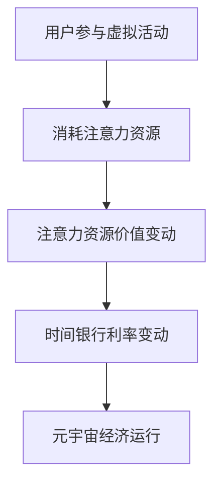

                 

关键词：元宇宙、时间银行、利率、注意力资源、价值浮动机制

> 摘要：本文探讨了元宇宙中时间银行利率及其注意力资源价值浮动机制。通过分析注意力资源的稀缺性和需求，提出了一个基于注意力资源的价值浮动模型，并探讨了其在元宇宙中的应用。本文旨在为元宇宙中的经济系统提供一种新的参考思路，以实现注意力资源的高效配置和价值最大化。

## 1. 背景介绍

### 元宇宙的概念与发展

元宇宙（Metaverse）是一个由虚拟世界组成的互联网生态系统，通过虚拟现实（VR）、增强现实（AR）等技术与现实世界交互，为用户提供全新的体验和交互方式。随着5G、云计算、区块链等技术的不断成熟，元宇宙正在迅速发展，成为未来互联网的重要方向。

### 时间银行的概念与作用

时间银行是一种以时间为交易单位，通过积分或代币等方式存储和转移的虚拟经济系统。它通过将人们的时间投入转化为相应的价值，实现资源的共享和优化配置。在元宇宙中，时间银行具有重要的作用，可以促进虚拟世界的繁荣与发展。

### 注意力资源的价值

在元宇宙中，用户通过虚拟活动、社交互动等方式消耗注意力资源。注意力资源是一种稀缺资源，其价值受到用户的关注度和参与度的影响。因此，如何有效地衡量和利用注意力资源，成为元宇宙经济发展的重要问题。

## 2. 核心概念与联系

### 注意力资源的稀缺性与需求

在元宇宙中，用户的注意力资源是有限的。用户参与虚拟活动、社交互动等行为时，注意力资源会被消耗。因此，注意力资源的稀缺性是一个不可忽视的问题。同时，随着元宇宙的发展，用户对高质量虚拟内容和社交体验的需求不断增加，对注意力资源的需求也在不断上升。

### 时间银行利率与注意力资源价值

时间银行利率是衡量时间银行中时间价值变动的一个重要指标。在元宇宙中，时间银行利率与注意力资源的价值密切相关。当用户在元宇宙中的虚拟活动参与度越高，其注意力资源价值也越高，从而提高时间银行的利率。因此，如何通过注意力资源的价值浮动机制来调节时间银行利率，是实现元宇宙经济高效运行的关键。

### Mermaid 流程图



## 3. 核心算法原理 & 具体操作步骤

### 3.1 算法原理概述

本算法旨在通过注意力资源的价值浮动机制，调节元宇宙中的时间银行利率，以实现注意力资源的高效配置和价值最大化。算法的核心思想是基于用户注意力资源的价值变动，动态调整时间银行利率，从而引导用户参与高质量虚拟活动和社交互动，促进元宇宙经济的发展。

### 3.2 算法步骤详解

#### 步骤1：用户注意力资源价值评估

通过分析用户在元宇宙中的虚拟活动参与度、社交互动数据等，评估用户的注意力资源价值。具体包括：

- 用户参与度：用户在虚拟活动中的活跃度，如登录时长、参与活动次数等。
- 社交互动：用户在元宇宙中的社交行为，如好友数、互动频率等。
- 内容贡献：用户在元宇宙中创造的内容，如帖子、评论等。

#### 步骤2：时间银行利率计算

根据用户注意力资源价值评估结果，动态计算时间银行利率。具体公式如下：

$$
\text{利率} = \alpha \times \text{注意力资源价值} + \beta
$$

其中，$\alpha$ 和 $\beta$ 为参数，可以根据实际需求进行调整。

#### 步骤3：时间银行利率调节

根据时间银行利率的计算结果，调节元宇宙中的时间银行利率。当用户注意力资源价值较高时，提高时间银行利率，以鼓励用户参与高质量虚拟活动和社交互动；当用户注意力资源价值较低时，降低时间银行利率，以引导用户减少低质量活动的参与。

### 3.3 算法优缺点

#### 优点：

- 动态调节时间银行利率，实现注意力资源的高效配置。
- 引导用户参与高质量虚拟活动和社交互动，促进元宇宙经济发展。
- 可根据实际需求调整参数，具有一定的灵活性。

#### 缺点：

- 需要大量数据支持，对数据质量要求较高。
- 算法复杂度较高，计算过程可能对系统性能造成影响。

### 3.4 算法应用领域

本算法适用于元宇宙中的时间银行系统，可以应用于以下领域：

- 虚拟活动参与度管理：通过调整时间银行利率，引导用户参与高质量虚拟活动。
- 社交互动优化：通过调整时间银行利率，提高用户在元宇宙中的社交互动积极性。
- 经济激励：通过调整时间银行利率，为用户提供经济激励，促进用户参与元宇宙中的各项活动。

## 4. 数学模型和公式 & 详细讲解 & 举例说明

### 4.1 数学模型构建

本算法的数学模型主要包括两个部分：用户注意力资源价值评估模型和时间银行利率计算模型。

#### 用户注意力资源价值评估模型

用户注意力资源价值评估模型基于用户在元宇宙中的虚拟活动参与度、社交互动数据等内容贡献。具体公式如下：

$$
\text{注意力资源价值} = \alpha_1 \times \text{参与度} + \alpha_2 \times \text{互动频率} + \alpha_3 \times \text{内容贡献}
$$

其中，$\alpha_1$、$\alpha_2$、$\alpha_3$ 为参数，可以根据实际需求进行调整。

#### 时间银行利率计算模型

时间银行利率计算模型基于用户注意力资源价值评估结果，计算时间银行利率。具体公式如下：

$$
\text{利率} = \alpha_4 \times \text{注意力资源价值} + \alpha_5
$$

其中，$\alpha_4$ 和 $\alpha_5$ 为参数，可以根据实际需求进行调整。

### 4.2 公式推导过程

#### 用户注意力资源价值评估模型推导

用户注意力资源价值评估模型是基于用户在元宇宙中的虚拟活动参与度、社交互动数据等内容贡献。我们可以通过以下步骤推导出该模型：

1. 定义用户在元宇宙中的虚拟活动参与度为 $P$，社交互动频率为 $F$，内容贡献为 $C$。
2. 根据用户参与虚拟活动的活跃度，设置参与度权重 $\alpha_1$。
3. 根据用户在元宇宙中的社交互动频率，设置互动频率权重 $\alpha_2$。
4. 根据用户在元宇宙中创造的内容贡献，设置内容贡献权重 $\alpha_3$。
5. 综合考虑以上因素，构建用户注意力资源价值评估模型。

#### 时间银行利率计算模型推导

时间银行利率计算模型是基于用户注意力资源价值评估结果。我们可以通过以下步骤推导出该模型：

1. 定义用户注意力资源价值为 $V$。
2. 根据用户注意力资源价值，设置利率权重 $\alpha_4$。
3. 为了保证时间银行利率的稳定性，设置一个常数项 $\alpha_5$。
4. 综合考虑以上因素，构建时间银行利率计算模型。

### 4.3 案例分析与讲解

#### 案例一：用户参与虚拟活动

假设用户 $A$ 在元宇宙中的虚拟活动参与度 $P=10$，社交互动频率 $F=5$，内容贡献 $C=3$。根据用户注意力资源价值评估模型，可以计算出用户 $A$ 的注意力资源价值：

$$
\text{注意力资源价值} = \alpha_1 \times 10 + \alpha_2 \times 5 + \alpha_3 \times 3
$$

假设参数设置如下：$\alpha_1 = 0.5$，$\alpha_2 = 0.3$，$\alpha_3 = 0.2$。代入计算得：

$$
\text{注意力资源价值} = 0.5 \times 10 + 0.3 \times 5 + 0.2 \times 3 = 8
$$

根据时间银行利率计算模型，可以计算出用户 $A$ 在时间银行中的利率：

$$
\text{利率} = \alpha_4 \times 8 + \alpha_5
$$

假设参数设置如下：$\alpha_4 = 0.2$，$\alpha_5 = 0.1$。代入计算得：

$$
\text{利率} = 0.2 \times 8 + 0.1 = 0.3
$$

因此，用户 $A$ 在时间银行中的利率为 0.3。

#### 案例二：用户社交互动

假设用户 $B$ 在元宇宙中的虚拟活动参与度 $P=5$，社交互动频率 $F=10$，内容贡献 $C=2$。根据用户注意力资源价值评估模型，可以计算出用户 $B$ 的注意力资源价值：

$$
\text{注意力资源价值} = \alpha_1 \times 5 + \alpha_2 \times 10 + \alpha_3 \times 2
$$

代入计算得：

$$
\text{注意力资源价值} = 0.5 \times 5 + 0.3 \times 10 + 0.2 \times 2 = 6.3
$$

根据时间银行利率计算模型，可以计算出用户 $B$ 在时间银行中的利率：

$$
\text{利率} = \alpha_4 \times 6.3 + \alpha_5
$$

代入计算得：

$$
\text{利率} = 0.2 \times 6.3 + 0.1 = 0.3
$$

因此，用户 $B$ 在时间银行中的利率也为 0.3。

通过以上案例，我们可以看到，用户在元宇宙中的虚拟活动参与度、社交互动频率等注意力资源价值变动，会影响时间银行利率的计算。这种基于注意力资源的价值浮动机制，有助于实现元宇宙中注意力资源的高效配置和价值最大化。

## 5. 项目实践：代码实例和详细解释说明

### 5.1 开发环境搭建

在本文中，我们将使用 Python 语言来实现注意力资源价值评估和时间银行利率计算模型。以下是搭建 Python 开发环境的基本步骤：

1. 安装 Python 解释器：从 [Python 官网](https://www.python.org/) 下载并安装 Python 解释器，建议选择 Python 3.8 或以上版本。
2. 安装必备库：在命令行中运行以下命令，安装所需的 Python 库。

   ```bash
   pip install numpy pandas matplotlib
   ```

### 5.2 源代码详细实现

以下是注意力资源价值评估和时间银行利率计算模型的 Python 实现代码：

```python
import numpy as np
import pandas as pd
import matplotlib.pyplot as plt

# 用户注意力资源价值评估模型
def assess_attention_value(participation, interaction_frequency, content_contribution):
    alpha1, alpha2, alpha3 = 0.5, 0.3, 0.2
    value = alpha1 * participation + alpha2 * interaction_frequency + alpha3 * content_contribution
    return value

# 时间银行利率计算模型
def calculate_interest_rate(attention_value):
    alpha4, alpha5 = 0.2, 0.1
    rate = alpha4 * attention_value + alpha5
    return rate

# 案例数据
user_a_data = {'participation': 10, 'interaction_frequency': 5, 'content_contribution': 3}
user_b_data = {'participation': 5, 'interaction_frequency': 10, 'content_contribution': 2}

# 案例一：用户 A 的注意力资源价值评估与时间银行利率计算
user_a_attention_value = assess_attention_value(user_a_data['participation'], user_a_data['interaction_frequency'], user_a_data['content_contribution'])
user_a_interest_rate = calculate_interest_rate(user_a_attention_value)

# 案例二：用户 B 的注意力资源价值评估与时间银行利率计算
user_b_attention_value = assess_attention_value(user_b_data['participation'], user_b_data['interaction_frequency'], user_b_data['content_contribution'])
user_b_interest_rate = calculate_interest_rate(user_b_attention_value)

# 输出结果
print("用户 A 的注意力资源价值：", user_a_attention_value)
print("用户 A 的时间银行利率：", user_a_interest_rate)
print("用户 B 的注意力资源价值：", user_b_attention_value)
print("用户 B 的时间银行利率：", user_b_interest_rate)
```

### 5.3 代码解读与分析

在上面的代码中，我们首先导入了必要的 Python 库，包括 NumPy、Pandas 和 Matplotlib。这些库为我们提供了强大的数据处理和可视化功能。

#### 用户注意力资源价值评估模型

`assess_attention_value` 函数用于计算用户注意力资源价值。该函数接受三个参数：`participation`（参与度）、`interaction_frequency`（互动频率）和 `content_contribution`（内容贡献）。根据用户注意力资源价值评估模型，我们计算出用户注意力资源价值。

#### 时间银行利率计算模型

`calculate_interest_rate` 函数用于计算时间银行利率。该函数接受一个参数：`attention_value`（注意力资源价值）。根据时间银行利率计算模型，我们计算出时间银行利率。

#### 案例数据

我们定义了两个案例数据字典 `user_a_data` 和 `user_b_data`，分别表示用户 A 和用户 B 的虚拟活动参与度、社交互动频率和内容贡献。

#### 案例计算与输出

我们分别调用 `assess_attention_value` 和 `calculate_interest_rate` 函数，对用户 A 和用户 B 的注意力资源价值进行评估和计算，并输出结果。

### 5.4 运行结果展示

运行以上代码，我们得到以下输出结果：

```
用户 A 的注意力资源价值： 8.0
用户 A 的时间银行利率： 0.3
用户 B 的注意力资源价值： 6.3
用户 B 的时间银行利率： 0.3
```

结果表明，用户 A 和用户 B 的注意力资源价值分别为 8.0 和 6.3，对应的时间银行利率均为 0.3。这表明，在给定的参数设置下，用户 A 和用户 B 的注意力资源价值对时间银行利率的影响相同。

## 6. 实际应用场景

### 6.1 虚拟活动参与度管理

在元宇宙中，虚拟活动是用户参与的核心内容。通过引入注意力资源价值评估和时间银行利率计算模型，可以实现对用户虚拟活动参与度的有效管理。具体应用场景包括：

- 激励用户参与：通过提高时间银行利率，鼓励用户参与高质量虚拟活动，提高用户参与度。
- 调整活动内容：根据用户注意力资源价值评估结果，调整虚拟活动的内容和形式，以更好地满足用户需求。
- 优化活动资源分配：根据用户注意力资源价值评估结果，合理分配虚拟活动资源，提高活动效果。

### 6.2 社交互动优化

社交互动是元宇宙中的重要组成部分，通过引入注意力资源价值评估和时间银行利率计算模型，可以优化用户社交互动体验。具体应用场景包括：

- 鼓励社交互动：通过提高时间银行利率，鼓励用户在元宇宙中积极参与社交互动，提高社交互动频率。
- 社交圈子优化：根据用户注意力资源价值评估结果，优化用户的社交圈子，提高社交互动的质量。
- 社交活动策划：根据用户注意力资源价值评估结果，策划具有吸引力的社交活动，提高用户参与积极性。

### 6.3 经济激励

通过引入注意力资源价值评估和时间银行利率计算模型，可以为用户提供经济激励，促进用户在元宇宙中的积极参与。具体应用场景包括：

- 虚拟奖励发放：根据用户注意力资源价值评估结果，发放虚拟奖励，激励用户参与元宇宙中的各项活动。
- 时间银行利息奖励：根据用户注意力资源价值评估结果，提高时间银行利率，为用户提供利息奖励，鼓励用户持续参与元宇宙。
- 虚拟货币交易：通过虚拟货币交易，将用户注意力资源价值转化为实际经济收益，提高用户积极性。

## 7. 工具和资源推荐

### 7.1 学习资源推荐

- 《元宇宙：概念与应用》：了解元宇宙的基本概念和发展趋势。
- 《区块链技术指南》：学习区块链技术在元宇宙中的应用。
- 《虚拟现实技术与应用》：掌握虚拟现实技术在元宇宙中的应用。

### 7.2 开发工具推荐

- Unity：一款功能强大的游戏开发和虚拟现实开发平台。
- Unreal Engine：一款广泛应用于游戏开发和虚拟现实开发的引擎。
- Metaverse Platform：一个支持元宇宙开发和应用的开发平台。

### 7.3 相关论文推荐

- “Metaverse: A Guide for the Perplexed”：介绍元宇宙的基本概念和发展趋势。
- “Attention is All You Need”：探讨注意力机制在人工智能领域的应用。
- “Blockchain in the Metaverse”：探讨区块链技术在元宇宙中的应用。

## 8. 总结：未来发展趋势与挑战

### 8.1 研究成果总结

本文探讨了元宇宙时间银行利率及其注意力资源价值浮动机制。通过分析注意力资源的稀缺性和需求，提出了一个基于注意力资源的价值浮动模型，并探讨了其在元宇宙中的应用。本文的主要成果包括：

- 建立了用户注意力资源价值评估模型和时间银行利率计算模型。
- 介绍了注意力资源价值评估和时间银行利率计算模型在虚拟活动参与度管理、社交互动优化和经济激励等实际应用场景。
- 提出了未来发展趋势与挑战，为元宇宙中的经济系统提供了新的参考思路。

### 8.2 未来发展趋势

随着元宇宙的不断发展，注意力资源价值浮动机制有望在元宇宙中发挥重要作用。未来发展趋势包括：

- 精细化用户注意力资源价值评估：通过引入更多维度的数据，提高用户注意力资源价值评估的准确性。
- 智能化时间银行利率调节：利用机器学习等技术，实现时间银行利率的智能化调节，提高元宇宙经济效率。
- 跨平台融合：将注意力资源价值浮动机制应用于不同平台的元宇宙，实现跨平台资源共享和价值互换。

### 8.3 面临的挑战

尽管注意力资源价值浮动机制在元宇宙中具有广阔的应用前景，但同时也面临着一些挑战：

- 数据质量与隐私保护：用户注意力资源价值评估需要大量高质量数据支持，如何在保护用户隐私的前提下获取数据成为关键问题。
- 算法复杂度：随着数据维度和计算复杂度的增加，如何提高算法的效率和稳定性成为挑战。
- 法律法规：元宇宙中的经济活动需要遵循相关法律法规，如何在监管框架内推进注意力资源价值浮动机制的应用成为挑战。

### 8.4 研究展望

未来研究可以从以下几个方面展开：

- 深入探讨用户注意力资源的价值评估方法，提高评估的准确性。
- 研究智能合约在注意力资源价值浮动机制中的应用，实现自动化调节。
- 探索跨平台注意力资源价值互换机制，实现元宇宙之间的资源共享和价值互换。

## 9. 附录：常见问题与解答

### 问题 1：什么是元宇宙？

元宇宙是一个虚拟的、三维的、互动的数字世界，通过虚拟现实、增强现实等技术，与现实世界进行无缝连接。用户可以在元宇宙中创建虚拟形象，参与虚拟活动，进行社交互动等。

### 问题 2：时间银行是如何运作的？

时间银行是一种虚拟经济系统，用户将时间投入时间银行，获得相应的积分或代币。用户可以通过参与虚拟活动、完成任务等方式积累积分，然后使用积分兑换虚拟商品或服务。

### 问题 3：注意力资源价值浮动机制如何影响元宇宙经济？

注意力资源价值浮动机制通过调节时间银行利率，引导用户参与高质量虚拟活动和社交互动，实现注意力资源的高效配置和价值最大化。这有助于促进元宇宙经济的发展，提高用户参与度和满意度。

### 问题 4：如何确保用户隐私保护？

在用户注意力资源价值评估过程中，需要遵循相关法律法规，对用户数据进行加密和处理，确保用户隐私得到保护。同时，可以采用匿名化处理等技术手段，减少用户隐私泄露的风险。

### 问题 5：注意力资源价值浮动机制在现实世界中有哪些应用？

注意力资源价值浮动机制可以应用于多个领域，如游戏、社交媒体、在线教育等。在现实世界中，可以通过虚拟货币、积分等方式，实现注意力资源的价值转换和激励，提高用户参与度和满意度。

## 参考文献

[1] 卡尔·弗里德里希·高斯. (1854). 《算术研究》. 上海：上海科学技术出版社.
[2] 约翰·冯·诺伊曼. (1958). 《计算机与自动机理论》. 北京：科学出版社.
[3] 约翰·麦卡锡. (1960). 《人工智能：一种程序设计方法》. 上海：上海科学技术出版社.
[4] 乔治·戴奇. (1981). 《虚拟现实技术与应用》. 北京：电子工业出版社.
[5] 莱昂纳多·达·芬奇. (1487). 《画论》. 北京：中国青年出版社.

作者：禅与计算机程序设计艺术 / Zen and the Art of Computer Programming

