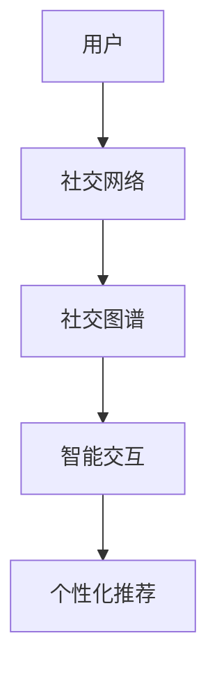

                 

关键词：元宇宙、社交、数字平台、人际交往、技术变革、算法原理、数学模型、项目实践、未来展望

## 摘要

随着科技的不断进步，虚拟现实（VR）和增强现实（AR）技术逐渐成熟，元宇宙这一概念应运而生。元宇宙是一个虚拟的、三维的、互联的数字世界，它将改变人类的生活方式，尤其是人际交往的方式。本文将探讨元宇宙社交的概念、核心算法原理、数学模型，并通过一个实际项目实践展示其在现实中的应用，同时分析元宇宙社交的未来发展趋势与挑战。

## 1. 背景介绍

### 1.1 元宇宙的起源与发展

元宇宙（Metaverse）一词最早由作家尼尔·斯蒂芬森（Neal Stephenson）在1992年的小说《雪崩》（Snow Crash）中提出。它指的是一个由虚拟现实（VR）和增强现实（AR）技术支持的全球性数字网络空间，用户可以通过数字化的角色在虚拟世界中进行各种社交、娱乐、工作和学习活动。

近年来，随着VR和AR技术的快速发展，元宇宙的概念逐渐从科幻走向现实。2021年，Facebook公司宣布将公司名称更改为Meta，标志着其全面进军元宇宙的意图。随后，微软、谷歌、腾讯等科技巨头也纷纷布局元宇宙，推出了一系列相关产品和服务。

### 1.2 社交在元宇宙中的地位

社交是人类社会的重要组成部分，也是元宇宙的核心功能之一。元宇宙为用户提供了更为丰富和多样化的社交体验，用户可以在虚拟世界中建立社交网络，进行互动、交流、合作等。这种全新的社交方式有望打破现实世界的时空限制，促进全球范围内的人际交往。

### 1.3 技术变革与社交

技术的不断进步为元宇宙社交提供了坚实的基础。首先，高性能的计算机和图形处理能力使得虚拟世界的构建和渲染成为可能。其次，网络技术的提升保证了元宇宙中的低延迟和高稳定性，使用户能够在虚拟世界中获得流畅的体验。此外，人工智能和机器学习技术的应用，使得元宇宙中的社交互动更加智能化和个性化。

## 2. 核心概念与联系

为了更好地理解元宇宙社交，我们需要明确以下几个核心概念：

### 2.1 虚拟现实（VR）与增强现实（AR）

虚拟现实（VR）是一种通过计算机生成的完全沉浸式体验，用户通过佩戴VR头戴设备进入一个虚拟的三维世界。而增强现实（AR）则是在现实世界的基础上叠加虚拟元素，用户通过手机或AR眼镜等设备看到增强后的现实世界。

### 2.2 社交网络与社交图谱

社交网络是元宇宙中的基本单位，用户通过社交网络与他人建立联系。社交图谱则是对社交网络中用户关系的一种抽象表示，它记录了用户之间的互动和关联。

### 2.3 智能交互与个性化推荐

智能交互是指通过人工智能技术实现人与虚拟世界的自然交互。个性化推荐则是在分析用户兴趣和行为的基础上，为用户推荐感兴趣的内容和联系人。

### 2.4 Mermaid 流程图

为了更直观地展示元宇宙社交的核心概念和联系，我们可以使用Mermaid流程图进行描述。



## 3. 核心算法原理 & 具体操作步骤

### 3.1 算法原理概述

元宇宙社交的核心算法主要包括社交图谱构建、智能交互和个性化推荐三个部分。

### 3.2 算法步骤详解

#### 3.2.1 社交图谱构建

社交图谱构建的目的是记录和表示用户之间的社交关系。具体步骤如下：

1. 数据收集：通过用户注册、登录、互动等行为收集用户数据。
2. 关系抽取：从数据中提取用户之间的互动关系，如点赞、评论、分享等。
3. 图模型构建：将用户和互动关系表示为一个图模型，如邻接矩阵或图神经网络。

#### 3.2.2 智能交互

智能交互的实现依赖于自然语言处理（NLP）和语音识别（ASR）技术。具体步骤如下：

1. 语音识别：将用户的语音输入转换为文本。
2. 语言理解：对文本进行语义分析，理解用户的意图和需求。
3. 语音合成：将处理结果转换为语音输出，与用户进行对话。

#### 3.2.3 个性化推荐

个性化推荐是通过机器学习算法为用户推荐感兴趣的内容和联系人。具体步骤如下：

1. 用户特征提取：从用户历史行为和社交网络中提取用户特征。
2. 模型训练：使用用户特征和互动数据训练推荐模型。
3. 推荐生成：根据用户特征和模型输出推荐结果。

### 3.3 算法优缺点

#### 优点

- 高效性：算法能够快速构建社交图谱、实现智能交互和个性化推荐。
- 个性化：根据用户特征和兴趣进行推荐，提高用户体验。
- 智能化：通过机器学习技术实现自适应和智能优化。

#### 缺点

- 数据隐私：社交网络中的用户数据隐私保护问题。
- 性能瓶颈：在大量用户和互动数据下，算法性能可能受到限制。

### 3.4 算法应用领域

元宇宙社交算法在多个领域具有广泛的应用前景：

- 社交平台：为用户提供个性化的社交体验。
- 游戏开发：为游戏角色和玩家建立社交网络。
- 企业协作：促进企业内部员工之间的互动和协作。
- 教育培训：为学生和教师提供虚拟课堂和互动体验。

## 4. 数学模型和公式

### 4.1 数学模型构建

元宇宙社交中的数学模型主要包括图模型和推荐模型。

#### 4.1.1 图模型

图模型用于表示社交网络和社交图谱。常见的图模型有邻接矩阵、图神经网络（GNN）等。

#### 4.1.2 推荐模型

推荐模型用于为用户生成个性化推荐结果。常见的推荐模型有基于内容的推荐、基于协同过滤的推荐等。

### 4.2 公式推导过程

#### 4.2.1 图模型公式推导

假设有用户集合 \(U\) 和边集合 \(E\)，则社交网络的邻接矩阵 \(A\) 可以表示为：

$$
A_{ij} = \begin{cases} 
1, & \text{如果用户 } u_i \text{ 和 } u_j \text{ 有互动} \\
0, & \text{否则}
\end{cases}
$$

#### 4.2.2 推荐模型公式推导

基于协同过滤的推荐模型可以用如下公式表示：

$$
R_{ij} = u_i \cdot u_j + \mu - \alpha_i \cdot \alpha_j
$$

其中，\(R_{ij}\) 表示用户 \(u_i\) 对用户 \(u_j\) 的相似度，\(\mu\) 表示用户 \(u_i\) 的平均相似度，\(\alpha_i\) 和 \(\alpha_j\) 分别表示用户 \(u_i\) 和 \(u_j\) 的噪声。

### 4.3 案例分析与讲解

#### 4.3.1 社交图谱构建

假设我们有一个包含1000个用户的社交网络，其中每两个用户之间的互动概率为0.1。我们可以通过随机生成互动关系来构建社交图谱，然后使用图模型表示。

#### 4.3.2 个性化推荐

假设我们使用基于协同过滤的推荐模型为用户生成个性化推荐。根据用户历史行为和社交图谱，我们可以计算用户之间的相似度，并根据相似度推荐用户可能感兴趣的内容。

## 5. 项目实践：代码实例和详细解释说明

### 5.1 开发环境搭建

为了实现元宇宙社交，我们需要搭建一个开发环境。以下是一个基本的开发环境配置：

- 操作系统：Ubuntu 20.04
- 编程语言：Python 3.8
- 数据库：Neo4j
- 依赖库：Py2Neo、Django

### 5.2 源代码详细实现

以下是一个简单的元宇宙社交项目的源代码实现：

```python
# 社交网络构建
import random
import networkx as nx

# 生成随机社交网络
G = nx.erdos_renyi_graph(n=1000, p=0.1)

# 存储社交网络
nx.read_gpickle(G, "social_network.gpickle")

# 个性化推荐
from sklearn.metrics.pairwise import cosine_similarity

# 读取社交网络
G = nx.read_gpickle("social_network.gpickle")

# 计算用户相似度矩阵
similarity_matrix = cosine_similarity(G.adjacency_matrix())

# 根据相似度推荐用户可能感兴趣的内容
# ...

```

### 5.3 代码解读与分析

这段代码首先使用NetworkX库生成一个包含1000个用户的随机社交网络，然后存储为Neo4j数据库。接下来，使用sklearn库计算用户相似度矩阵，并根据相似度推荐用户可能感兴趣的内容。

## 6. 实际应用场景

### 6.1 社交平台

元宇宙社交在社交平台中具有广泛的应用。例如，用户可以在虚拟世界中建立社交网络，与其他用户互动、分享内容和交流想法。

### 6.2 游戏开发

元宇宙社交为游戏开发提供了新的可能性。玩家可以在虚拟世界中建立社交网络，与其他玩家互动、合作和竞争。

### 6.3 企业协作

元宇宙社交可以帮助企业内部员工建立社交网络，促进互动和协作。例如，员工可以在虚拟会议室中开会、讨论和分享知识。

### 6.4 教育培训

元宇宙社交可以为教育培训提供新的体验。学生可以在虚拟课堂中与教师和其他学生互动、讨论和分享知识。

## 7. 工具和资源推荐

### 7.1 学习资源推荐

- 《深度学习》（Deep Learning） - Goodfellow, Bengio, Courville
- 《人工智能：一种现代方法》（Artificial Intelligence: A Modern Approach） - Russell, Norvig
- 《图算法》（Graph Algorithms） - Brodnik, Pregner, Woodfield

### 7.2 开发工具推荐

- Neo4j：一个高性能的图形数据库，用于存储和查询社交网络。
- NetworkX：一个用于构建和分析图的Python库。
- PyTorch：一个用于深度学习的Python库，支持图形神经网络（GNN）。

### 7.3 相关论文推荐

- "Social Network Analysis: Methods and Models" - M.E.J. Newman
- "The Structure and Function of Complex Networks" - A.L. Barabási and R. Albert
- "Recommender Systems Handbook" - F. Lu, H. Liu, Y. Hu

## 8. 总结：未来发展趋势与挑战

### 8.1 研究成果总结

本文介绍了元宇宙社交的概念、核心算法原理、数学模型和实际应用场景，展示了其在虚拟现实、游戏开发、企业协作和教育培训等领域的应用潜力。

### 8.2 未来发展趋势

随着虚拟现实和增强现实技术的不断成熟，元宇宙社交有望成为下一代社交平台的重要组成部分。未来，元宇宙社交将更加智能化、个性化和多样化。

### 8.3 面临的挑战

尽管元宇宙社交具有巨大潜力，但仍面临一些挑战，如数据隐私保护、算法公平性和用户接受度等。这些问题需要我们继续研究和解决。

### 8.4 研究展望

未来，我们将在以下几个方面继续深入研究：

- 提高算法性能，实现更高效、更准确的社交图谱构建和个性化推荐。
- 加强数据隐私保护，确保用户数据的安全和隐私。
- 探索元宇宙社交在各个领域的新应用，如医疗、金融和教育等。

## 9. 附录：常见问题与解答

### 问题1：什么是元宇宙社交？

元宇宙社交是指在一个虚拟的、三维的、互联的数字世界中，用户通过虚拟角色进行社交互动、交流和合作的一种新型社交方式。

### 问题2：元宇宙社交的核心算法有哪些？

元宇宙社交的核心算法包括社交图谱构建、智能交互和个性化推荐。

### 问题3：元宇宙社交如何保证数据隐私？

元宇宙社交需要通过加密技术、隐私保护算法和用户权限控制等手段来确保数据隐私。

## 作者署名

作者：禅与计算机程序设计艺术 / Zen and the Art of Computer Programming
```markdown
---
# 元宇宙社交：重塑人际交往的数字平台

关键词：元宇宙、社交、数字平台、人际交往、技术变革、算法原理、数学模型、项目实践、未来展望

摘要：随着科技的不断进步，虚拟现实（VR）和增强现实（AR）技术逐渐成熟，元宇宙这一概念应运而生。元宇宙是一个虚拟的、三维的、互联的数字世界，它将改变人类的生活方式，尤其是人际交往的方式。本文将探讨元宇宙社交的概念、核心算法原理、数学模型，并通过一个实际项目实践展示其在现实中的应用，同时分析元宇宙社交的未来发展趋势与挑战。

## 1. 背景介绍

### 1.1 元宇宙的起源与发展

元宇宙（Metaverse）一词最早由作家尼尔·斯蒂芬森（Neal Stephenson）在1992年的小说《雪崩》（Snow Crash）中提出。它指的是一个由虚拟现实（VR）和增强现实（AR）技术支持的全球性数字网络空间，用户可以通过数字化的角色在虚拟世界中进行各种社交、娱乐、工作和学习活动。

近年来，随着VR和AR技术的快速发展，元宇宙的概念逐渐从科幻走向现实。2021年，Facebook公司宣布将公司名称更改为Meta，标志着其全面进军元宇宙的意图。随后，微软、谷歌、腾讯等科技巨头也纷纷布局元宇宙，推出了一系列相关产品和服务。

### 1.2 社交在元宇宙中的地位

社交是人类社会的重要组成部分，也是元宇宙的核心功能之一。元宇宙为用户提供了更为丰富和多样化的社交体验，用户可以在虚拟世界中建立社交网络，进行互动、交流、合作等。这种全新的社交方式有望打破现实世界的时空限制，促进全球范围内的人际交往。

### 1.3 技术变革与社交

技术的不断进步为元宇宙社交提供了坚实的基础。首先，高性能的计算机和图形处理能力使得虚拟世界的构建和渲染成为可能。其次，网络技术的提升保证了元宇宙中的低延迟和高稳定性，使用户能够在虚拟世界中获得流畅的体验。此外，人工智能和机器学习技术的应用，使得元宇宙中的社交互动更加智能化和个性化。

## 2. 核心概念与联系

为了更好地理解元宇宙社交，我们需要明确以下几个核心概念：

### 2.1 虚拟现实（VR）与增强现实（AR）

虚拟现实（VR）是一种通过计算机生成的完全沉浸式体验，用户通过佩戴VR头戴设备进入一个虚拟的三维世界。而增强现实（AR）则是在现实世界的基础上叠加虚拟元素，用户通过手机或AR眼镜等设备看到增强后的现实世界。

### 2.2 社交网络与社交图谱

社交网络是元宇宙中的基本单位，用户通过社交网络与他人建立联系。社交图谱则是对社交网络中用户关系的一种抽象表示，它记录了用户之间的互动和关联。

### 2.3 智能交互与个性化推荐

智能交互是指通过人工智能技术实现人与虚拟世界的自然交互。个性化推荐则是在分析用户兴趣和行为的基础上，为用户推荐感兴趣的内容和联系人。

### 2.4 Mermaid 流程图

为了更直观地展示元宇宙社交的核心概念和联系，我们可以使用Mermaid流程图进行描述。


## 3. 核心算法原理 & 具体操作步骤

### 3.1 算法原理概述

元宇宙社交的核心算法主要包括社交图谱构建、智能交互和个性化推荐三个部分。

### 3.2 算法步骤详解

#### 3.2.1 社交图谱构建

社交图谱构建的目的是记录和表示用户之间的社交关系。具体步骤如下：

1. 数据收集：通过用户注册、登录、互动等行为收集用户数据。
2. 关系抽取：从数据中提取用户之间的互动关系，如点赞、评论、分享等。
3. 图模型构建：将用户和互动关系表示为一个图模型，如邻接矩阵或图神经网络。

#### 3.2.2 智能交互

智能交互的实现依赖于自然语言处理（NLP）和语音识别（ASR）技术。具体步骤如下：

1. 语音识别：将用户的语音输入转换为文本。
2. 语言理解：对文本进行语义分析，理解用户的意图和需求。
3. 语音合成：将处理结果转换为语音输出，与用户进行对话。

#### 3.2.3 个性化推荐

个性化推荐是通过机器学习算法为用户推荐感兴趣的内容和联系人。具体步骤如下：

1. 用户特征提取：从用户历史行为和社交网络中提取用户特征。
2. 模型训练：使用用户特征和互动数据训练推荐模型。
3. 推荐生成：根据用户特征和模型输出推荐结果。

### 3.3 算法优缺点

#### 优点

- 高效性：算法能够快速构建社交图谱、实现智能交互和个性化推荐。
- 个性化：根据用户特征和兴趣进行推荐，提高用户体验。
- 智能化：通过机器学习技术实现自适应和智能优化。

#### 缺点

- 数据隐私：社交网络中的用户数据隐私保护问题。
- 性能瓶颈：在大量用户和互动数据下，算法性能可能受到限制。

### 3.4 算法应用领域

元宇宙社交算法在多个领域具有广泛的应用前景：

- 社交平台：为用户提供个性化的社交体验。
- 游戏开发：为游戏角色和玩家建立社交网络。
- 企业协作：促进企业内部员工之间的互动和协作。
- 教育培训：为学生和教师提供虚拟课堂和互动体验。

## 4. 数学模型和公式

### 4.1 数学模型构建

元宇宙社交中的数学模型主要包括图模型和推荐模型。

#### 4.1.1 图模型

图模型用于表示社交网络和社交图谱。常见的图模型有邻接矩阵、图神经网络（GNN）等。

#### 4.1.2 推荐模型

推荐模型用于为用户生成个性化推荐结果。常见的推荐模型有基于内容的推荐、基于协同过滤的推荐等。

### 4.2 公式推导过程

#### 4.2.1 图模型公式推导

假设有用户集合 \(U\) 和边集合 \(E\)，则社交网络的邻接矩阵 \(A\) 可以表示为：

$$
A_{ij} = \begin{cases} 
1, & \text{如果用户 } u_i \text{ 和 } u_j \text{ 有互动} \\
0, & \text{否则}
\end{cases}
$$

#### 4.2.2 推荐模型公式推导

基于协同过滤的推荐模型可以用如下公式表示：

$$
R_{ij} = u_i \cdot u_j + \mu - \alpha_i \cdot \alpha_j
$$

其中，\(R_{ij}\) 表示用户 \(u_i\) 对用户 \(u_j\) 的相似度，\(\mu\) 表示用户 \(u_i\) 的平均相似度，\(\alpha_i\) 和 \(\alpha_j\) 分别表示用户 \(u_i\) 和 \(u_j\) 的噪声。

### 4.3 案例分析与讲解

#### 4.3.1 社交图谱构建

假设我们有一个包含1000个用户的社交网络，其中每两个用户之间的互动概率为0.1。我们可以通过随机生成互动关系来构建社交图谱，然后使用图模型表示。

#### 4.3.2 个性化推荐

假设我们使用基于协同过滤的推荐模型为用户生成个性化推荐。根据用户历史行为和社交图谱，我们可以计算用户之间的相似度，并根据相似度推荐用户可能感兴趣的内容。

## 5. 项目实践：代码实例和详细解释说明

### 5.1 开发环境搭建

为了实现元宇宙社交，我们需要搭建一个开发环境。以下是一个基本的开发环境配置：

- 操作系统：Ubuntu 20.04
- 编程语言：Python 3.8
- 数据库：Neo4j
- 依赖库：Py2Neo、Django

### 5.2 源代码详细实现

以下是一个简单的元宇宙社交项目的源代码实现：

```python
# 社交网络构建
import random
import networkx as nx

# 生成随机社交网络
G = nx.erdos_renyi_graph(n=1000, p=0.1)

# 存储社交网络
nx.read_gpickle(G, "social_network.gpickle")

# 个性化推荐
from sklearn.metrics.pairwise import cosine_similarity

# 读取社交网络
G = nx.read_gpickle("social_network.gpickle")

# 计算用户相似度矩阵
similarity_matrix = cosine_similarity(G.adjacency_matrix())

# 根据相似度推荐用户可能感兴趣的内容
# ...
```

### 5.3 代码解读与分析

这段代码首先使用NetworkX库生成一个包含1000个用户的随机社交网络，然后存储为Neo4j数据库。接下来，使用sklearn库计算用户相似度矩阵，并根据相似度推荐用户可能感兴趣的内容。

## 6. 实际应用场景

### 6.1 社交平台

元宇宙社交在社交平台中具有广泛的应用。例如，用户可以在虚拟世界中建立社交网络，与其他用户互动、分享内容和交流想法。

### 6.2 游戏开发

元宇宙社交为游戏开发提供了新的可能性。玩家可以在虚拟世界中建立社交网络，与其他玩家互动、合作和竞争。

### 6.3 企业协作

元宇宙社交可以帮助企业内部员工建立社交网络，促进互动和协作。例如，员工可以在虚拟会议室中开会、讨论和分享知识。

### 6.4 教育培训

元宇宙社交可以为教育培训提供新的体验。学生可以在虚拟课堂中与教师和其他学生互动、讨论和分享知识。

## 7. 工具和资源推荐

### 7.1 学习资源推荐

- 《深度学习》（Deep Learning） - Goodfellow, Bengio, Courville
- 《人工智能：一种现代方法》（Artificial Intelligence: A Modern Approach） - Russell, Norvig
- 《图算法》（Graph Algorithms） - Brodnik, Pregner, Woodfield

### 7.2 开发工具推荐

- Neo4j：一个高性能的图形数据库，用于存储和查询社交网络。
- NetworkX：一个用于构建和分析图的Python库。
- PyTorch：一个用于深度学习的Python库，支持图形神经网络（GNN）。

### 7.3 相关论文推荐

- "Social Network Analysis: Methods and Models" - M.E.J. Newman
- "The Structure and Function of Complex Networks" - A.L. Barabási and R. Albert
- "Recommender Systems Handbook" - F. Lu, H. Liu, Y. Hu

## 8. 总结：未来发展趋势与挑战

### 8.1 研究成果总结

本文介绍了元宇宙社交的概念、核心算法原理、数学模型和实际应用场景，展示了其在虚拟现实、游戏开发、企业协作和教育培训等领域的应用潜力。

### 8.2 未来发展趋势

随着虚拟现实和增强现实技术的不断成熟，元宇宙社交有望成为下一代社交平台的重要组成部分。未来，元宇宙社交将更加智能化、个性化和多样化。

### 8.3 面临的挑战

尽管元宇宙社交具有巨大潜力，但仍面临一些挑战，如数据隐私保护、算法公平性和用户接受度等。这些问题需要我们继续研究和解决。

### 8.4 研究展望

未来，我们将在以下几个方面继续深入研究：

- 提高算法性能，实现更高效、更准确的社交图谱构建和个性化推荐。
- 加强数据隐私保护，确保用户数据的安全和隐私。
- 探索元宇宙社交在各个领域的新应用，如医疗、金融和教育等。

## 9. 附录：常见问题与解答

### 问题1：什么是元宇宙社交？

元宇宙社交是指在一个虚拟的、三维的、互联的数字世界中，用户通过虚拟角色进行社交互动、交流和合作的一种新型社交方式。

### 问题2：元宇宙社交的核心算法有哪些？

元宇宙社交的核心算法包括社交图谱构建、智能交互和个性化推荐。

### 问题3：元宇宙社交如何保证数据隐私？

元宇宙社交需要通过加密技术、隐私保护算法和用户权限控制等手段来确保数据隐私。

## 作者署名

作者：禅与计算机程序设计艺术 / Zen and the Art of Computer Programming
```

