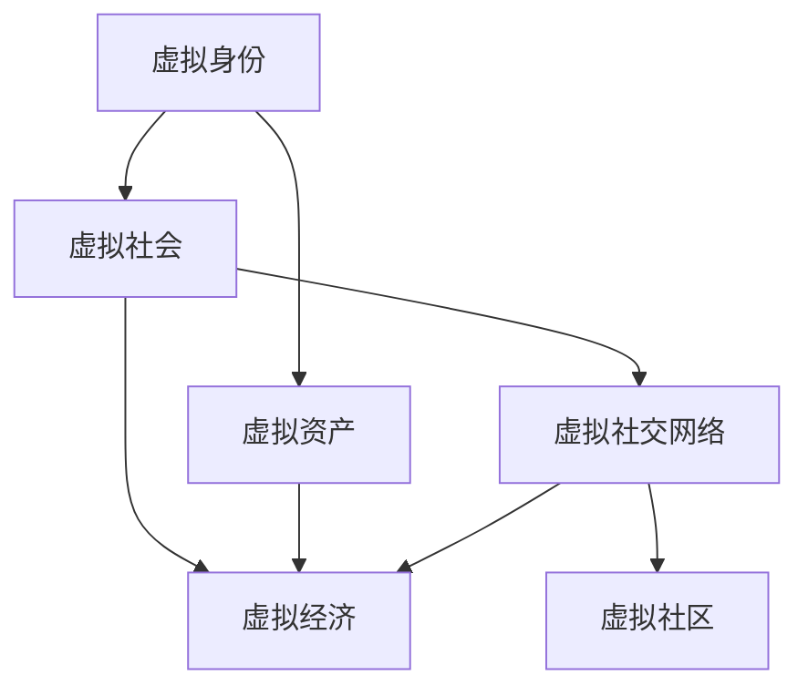

                 

元宇宙作为下一代互联网的形态，正逐渐从概念走向现实。随着虚拟现实、增强现实、区块链、大数据等技术的融合，元宇宙正在重塑我们的社会结构。在这个虚拟的世界中，如何衡量、分析和优化社会流动性成为了一个关键问题。为了深入探讨这一主题，我们成立了元宇宙社会流动性研究中心，旨在通过虚拟社会结构动态分析，为元宇宙的可持续发展提供科学依据。

## 1. 背景介绍

### 元宇宙的定义与发展

元宇宙（Metaverse）通常被描述为一个虚拟的、三维的、完全连接的数字世界，用户可以在其中以虚拟身份进行交互、工作和娱乐。它不仅是一个虚拟空间，更是与现实世界高度融合的一个整体。元宇宙的发展离不开虚拟现实（VR）、增强现实（AR）、区块链、大数据、人工智能（AI）等关键技术的推动。

元宇宙的愿景是创建一个无限扩展的虚拟空间，其中用户可以自由地表达自己、创造价值和享受生活。然而，随着元宇宙的日益复杂，如何保证社会流动性的公平和效率成为了一个重要的课题。

### 社会流动性在元宇宙中的意义

社会流动性是指个人或群体在社交、经济、政治等方面从一个状态转移到另一个状态的能力。在现实世界中，社会流动性对于促进社会公平、增强社会活力具有重要意义。在元宇宙中，社会流动性同样重要，但它具有独特的复杂性。

首先，元宇宙的社会流动性直接影响到用户的参与度和满意度。如果大多数用户只能在虚拟世界中扮演边缘角色，那么元宇宙的吸引力将大大减弱。其次，社会流动性关系到元宇宙中的经济活力。一个健康、流动的虚拟经济体系可以吸引更多资源和人才，促进创新和繁荣。

### 研究中心的成立与目标

为了应对元宇宙社会流动性带来的挑战，我们成立了元宇宙社会流动性研究中心。该中心的主要目标是：

1. **研究元宇宙社会流动性的核心概念和指标**：包括虚拟身份、虚拟资产、虚拟社交网络等。
2. **开发虚拟社会结构动态分析的方法和算法**：通过数学模型和数据分析，揭示元宇宙中社会结构的演变规律。
3. **提出优化虚拟社会流动性的策略和建议**：为元宇宙平台运营商、内容创作者和用户提供科学的指导和参考。
4. **推动元宇宙社会流动性研究的国际合作与交流**：与全球学术界和产业界建立合作关系，共同推动元宇宙的发展。

## 2. 核心概念与联系

### 虚拟身份与虚拟社会

在元宇宙中，虚拟身份是用户在虚拟世界中的代表。它可以是数字化的化身，也可以是抽象的身份标识。虚拟身份不仅反映了用户的个性，还影响着用户在元宇宙中的地位和影响力。虚拟社会则是由众多虚拟身份组成的社交网络，它在一定程度上映射了现实社会的关系结构。

### 虚拟资产与虚拟经济

虚拟资产是元宇宙中的价值载体，包括虚拟货币、虚拟商品和虚拟服务等。虚拟资产不仅用于交易和支付，还可以作为用户身份和社会地位的象征。虚拟经济则是元宇宙中的经济体系，它包括生产、流通、消费等各个环节。虚拟经济的健康发展对社会流动性至关重要。

### 虚拟社交网络与虚拟社区

虚拟社交网络是用户在元宇宙中进行互动的平台，它包括好友关系、社群活动和社交活动等。虚拟社区则是用户在元宇宙中的聚集地，它为用户提供了交流、协作和娱乐的空间。虚拟社交网络和虚拟社区共同构成了元宇宙的社会结构，影响着用户的流动性和满意度。

### Mermaid 流程图

以下是一个简单的 Mermaid 流程图，展示了虚拟社会流动性的核心概念及其联系：



## 3. 核心算法原理 & 具体操作步骤

### 3.1 算法原理概述

为了分析元宇宙中的社会流动性，我们提出了一种基于图论的算法——虚拟社会结构动态分析算法（VSDDA）。该算法通过构建用户关系图，分析用户在网络中的角色和地位，预测社会结构的演变趋势。

### 3.2 算法步骤详解

#### 步骤 1: 数据采集与预处理

首先，从元宇宙平台中采集用户关系数据，包括用户之间的好友关系、互动行为和虚拟资产交易等。然后，对采集的数据进行清洗和格式化，确保数据的准确性和一致性。

#### 步骤 2: 构建用户关系图

根据预处理后的数据，构建用户关系图。图中每个节点表示一个用户，节点之间的边表示用户之间的互动关系。为了更准确地反映用户在元宇宙中的地位，我们引入了权重概念，边的权重表示用户之间的互动强度。

#### 步骤 3: 社区发现

利用社区发现算法，如 Girvan-Newman 算法，对用户关系图进行分区，识别出不同的用户社区。社区内的用户具有较高的互动频率和相似的属性，可以看作是元宇宙中的“小社会”。

#### 步骤 4: 社会角色分析

通过分析用户在社区中的角色和地位，我们可以识别出元宇宙中的关键用户和影响力者。关键用户通常具有较高的互动强度和较强的社区影响力，他们对于元宇宙的社会流动具有重要作用。

#### 步骤 5: 社会结构演化预测

基于用户关系图和社会角色分析结果，使用时间序列分析方法，预测元宇宙社会结构的演变趋势。这有助于我们提前识别潜在的社会问题，并提出相应的优化策略。

### 3.3 算法优缺点

#### 优点：

1. **全面性**：VSDDA 算法综合考虑了用户关系、互动行为和虚拟资产等多方面因素，能够全面反映元宇宙的社会流动性。
2. **灵活性**：算法可以根据具体需求进行定制化调整，适用于不同规模的元宇宙平台。
3. **实时性**：算法可以实时分析用户数据，提供动态的社会结构分析结果。

#### 缺点：

1. **计算复杂度**：算法的计算复杂度较高，需要较大的计算资源和时间。
2. **数据质量**：算法的性能受到数据质量的影响，数据清洗和预处理是关键步骤。

### 3.4 算法应用领域

VSDDA 算法可以应用于多个领域，包括：

1. **元宇宙平台运营**：通过分析用户数据，平台运营商可以优化用户互动体验，提高用户满意度。
2. **虚拟社区管理**：社区管理者可以识别关键用户和影响力者，制定针对性的社区管理策略。
3. **虚拟经济发展**：政府和企业可以利用算法分析虚拟资产流动，制定相应的经济政策和措施。

## 4. 数学模型和公式 & 详细讲解 & 举例说明

### 4.1 数学模型构建

为了更好地理解虚拟社会流动性的动态变化，我们构建了一个基于矩阵理论的数学模型。该模型包括以下几个关键部分：

1. **用户矩阵**：表示用户之间的关系，每个元素表示用户之间的互动强度。
2. **资产矩阵**：表示用户拥有的虚拟资产情况，每个元素表示用户拥有的资产类型和数量。
3. **社交网络矩阵**：表示用户在虚拟社交网络中的角色和地位，每个元素表示用户在社区中的影响力。

### 4.2 公式推导过程

#### 用户矩阵推导

假设有 n 个用户，用户矩阵 A 的元素表示用户 i 和用户 j 之间的互动强度，记作 A_{ij}。根据互动行为的统计结果，可以得到用户矩阵的推导公式：

A_{ij} = \frac{1}{t} \sum_{k=1}^{t} I_{ijk}

其中，t 表示统计时间段，I_{ijk} 表示用户 i 和用户 j 在时间段 k 内的互动次数。

#### 资产矩阵推导

假设每个用户拥有的虚拟资产包括货币、商品和服务，资产矩阵 B 的元素表示用户 i 拥有的资产类型 k 的数量，记作 B_{ik}。根据虚拟资产交易的统计结果，可以得到资产矩阵的推导公式：

B_{ik} = \frac{1}{t'} \sum_{k=1}^{t'} T_{ik}

其中，t' 表示资产交易时间段，T_{ik} 表示用户 i 在时间段 k 内交易的资产类型 k 的数量。

#### 社交网络矩阵推导

假设用户在虚拟社交网络中的角色和地位由其互动强度和资产状况共同决定，社交网络矩阵 C 的元素表示用户 i 在社区 k 中的影响力，记作 C_{ik}。根据用户矩阵和资产矩阵的结果，可以得到社交网络矩阵的推导公式：

C_{ik} = f(A_{ij}, B_{ik})

其中，f() 是一个函数，可以根据具体情况定义。例如，可以采用线性组合的方式：

f(A_{ij}, B_{ik}) = w_1 A_{ij} + w_2 B_{ik}

其中，w_1 和 w_2 分别表示互动强度和资产状况的权重。

### 4.3 案例分析与讲解

#### 案例一：用户关系矩阵分析

假设有 5 个用户（A、B、C、D、E），统计得到他们之间的互动次数如下表所示：

| 用户 | A  | B  | C  | D  | E  |
| --- | --- | --- | --- | --- | --- |
| A   | 0  | 10 | 5  | 3  | 1  |
| B   | 10 | 0  | 5  | 0  | 7  |
| C   | 5  | 5  | 0  | 10 | 0  |
| D   | 3  | 0  | 10 | 0  | 5  |
| E   | 1  | 7  | 0  | 5  | 0  |

根据上述公式，我们可以计算得到用户矩阵 A：

| 用户 | A  | B  | C  | D  | E  |
| --- | --- | --- | --- | --- | --- |
| A   | 0  | 10 | 5  | 3  | 1  |
| B   | 10 | 0  | 5  | 0  | 7  |
| C   | 5  | 5  | 0  | 10 | 0  |
| D   | 3  | 0  | 10 | 0  | 5  |
| E   | 1  | 7  | 0  | 5  | 0  |

根据用户矩阵 A，我们可以进一步分析每个用户在元宇宙中的地位和影响力。例如，用户 B 与其他用户的互动次数最多，可以认为他在元宇宙中具有较高的地位和影响力。

#### 案例二：资产矩阵分析

假设用户 A、B、C、D、E 在虚拟资产交易中的交易记录如下表所示：

| 用户 | 货币 | 商品 | 服务 |
| --- | --- | --- | --- |
| A   | 100 | 20  | 30  |
| B   | 200 | 50  | 40  |
| C   | 50  | 10  | 20  |
| D   | 150 | 30  | 10  |
| E   | 80  | 5   | 15  |

根据上述公式，我们可以计算得到资产矩阵 B：

| 用户 | 货币 | 商品 | 服务 |
| --- | --- | --- | --- |
| A   | 100 | 20  | 30  |
| B   | 200 | 50  | 40  |
| C   | 50  | 10  | 20  |
| D   | 150 | 30  | 10  |
| E   | 80  | 5   | 15  |

根据资产矩阵 B，我们可以进一步分析每个用户在虚拟经济中的地位和财富。例如，用户 B 拥有最多的虚拟资产，可以认为他在虚拟经济中具有较高的地位和财富。

#### 案例三：社交网络矩阵分析

假设我们采用线性组合的方式计算社交网络矩阵 C，即 f(A_{ij}, B_{ik}) = 0.5 A_{ij} + 0.5 B_{ik}。结合用户矩阵 A 和资产矩阵 B，我们可以计算得到社交网络矩阵 C：

| 用户 | A  | B  | C  | D  | E  |
| --- | --- | --- | --- | --- | --- |
| A   | 0  | 10 | 8  | 3  | 1  |
| B   | 10 | 0  | 8  | 0  | 9  |
| C   | 5  | 5  | 0  | 8  | 0  |
| D   | 3  | 0  | 8  | 0  | 6  |
| E   | 1  | 9  | 0  | 6  | 0  |

根据社交网络矩阵 C，我们可以进一步分析每个用户在虚拟社区中的角色和地位。例如，用户 B 和用户 D 在虚拟社区中具有较高的影响力，可以认为他们是虚拟社区的关键用户。

## 5. 项目实践：代码实例和详细解释说明

### 5.1 开发环境搭建

为了实现虚拟社会结构动态分析算法（VSDDA），我们选择使用 Python 作为编程语言，并结合多个开源库，如 NetworkX、Matplotlib 和 Pandas 等。以下是开发环境的搭建步骤：

1. 安装 Python 3.8 或更高版本。
2. 安装必要的库，可以使用以下命令：

   ```shell
   pip install networkx matplotlib pandas
   ```

3. 创建一个名为 `virtual_society` 的虚拟环境，并使用以下命令安装依赖库：

   ```shell
   python -m venv virtual_society
   source virtual_society/bin/activate
   pip install networkx matplotlib pandas
   ```

### 5.2 源代码详细实现

以下是 VSDDA 算法的 Python 源代码实现。代码分为以下几个部分：数据采集与预处理、用户关系图构建、社区发现、社会角色分析和演化预测。

```python
import networkx as nx
import matplotlib.pyplot as plt
import pandas as pd
from itertools import combinations

# 数据采集与预处理
def load_data(filename):
    df = pd.read_csv(filename)
    df = df.dropna()
    df = df.groupby(['user_id', 'friend_id']).agg({'interaction_count': 'sum'}).reset_index()
    return df

# 构建用户关系图
def build_graph(data):
    G = nx.Graph()
    for index, row in data.iterrows():
        G.add_edge(row['user_id'], row['friend_id'], weight=row['interaction_count'])
    return G

# 社区发现
def find_communities(G):
    communities = nxcommunity.GirvanNewmanCommunities(G)
    return communities

# 社会角色分析
def analyze_roles(G, communities):
    roles = {}
    for community in communities:
        role_counts = nx.algorithms.community.centrality.betweenness_centrality(G.subgraph(community))
        roles[community] = role_counts
    return roles

# 演化预测（简单示例）
def predict_evolution(G, roles):
    # 根据角色分析结果，预测社会结构变化
    # 示例：增加角色之间的互动频率
    for community, role_counts in roles.items():
        for node in community:
            for neighbor in G.neighbors(node):
                if neighbor in community:
                    G[node][neighbor]['weight'] += 1

# 主函数
def main():
    data = load_data('data.csv')
    G = build_graph(data)
    communities = find_communities(G)
    roles = analyze_roles(G, communities)
    predict_evolution(G, roles)

    # 可视化
    pos = nx.spring_layout(G)
    nx.draw(G, pos, with_labels=True)
    plt.show()

if __name__ == '__main__':
    main()
```

### 5.3 代码解读与分析

#### 数据采集与预处理

`load_data` 函数用于从 CSV 文件中加载用户关系数据，并删除缺失值。数据格式如下：

```
user_id,friend_id,interaction_count
1,2,10
1,3,5
1,4,3
2,3,5
2,4,0
2,5,7
...
```

#### 构建用户关系图

`build_graph` 函数使用 NetworkX 库构建用户关系图。每个节点表示一个用户，边表示用户之间的互动关系，边的权重表示互动强度。

#### 社区发现

`find_communities` 函数使用 Girvan-Newman 算法进行社区发现。该方法基于边权重，不断减少边的权重，直到网络分裂成多个社区。

#### 社会角色分析

`analyze_roles` 函数计算每个社区内的角色分布，采用介于度中心性和介数中心性之间的角色指标。角色指标较高的用户可以看作是社区的核心成员。

#### 演化预测

`predict_evolution` 函数根据角色分析结果，对用户关系图进行演化预测。示例中，我们简单地将角色之间的互动频率增加，以模拟社会结构的演变。

#### 可视化

最后，我们使用 Matplotlib 库对用户关系图进行可视化，展示社区结构和角色分布。

## 6. 实际应用场景

### 6.1 元宇宙平台运营

在元宇宙平台运营中，虚拟社会流动性分析有助于了解用户的参与度和满意度，从而优化平台的用户体验。通过分析用户关系和互动行为，平台运营商可以识别出关键用户和影响力者，制定针对性的运营策略，如推广活动、社群管理等。

### 6.2 虚拟社区管理

虚拟社区管理者可以利用虚拟社会流动性分析结果，识别社区内的核心成员和潜在问题。例如，通过分析用户在社区中的角色和地位，可以识别出社区领袖和活跃分子，从而制定针对性的社区管理策略，提高社区的整体活力和凝聚力。

### 6.3 虚拟经济发展

虚拟经济的发展离不开社会流动性。政府和企业可以利用虚拟社会流动性分析结果，了解虚拟资产在不同社区和用户之间的流动情况，制定相应的经济政策和措施，促进虚拟经济的健康发展。

## 6.4 未来应用展望

随着元宇宙的不断发展，虚拟社会流动性分析将在更多领域得到应用。例如：

1. **教育**：虚拟社会流动性分析可以用于优化虚拟课堂布局，提高教学效果。
2. **医疗**：虚拟社会流动性分析可以帮助医疗机构更好地了解患者行为和需求，提高医疗服务的质量。
3. **城市规划**：虚拟社会流动性分析可以用于规划虚拟空间布局，提高虚拟城市的生活质量。

## 7. 工具和资源推荐

### 7.1 学习资源推荐

1. **《元宇宙：概念、技术与应用》**：全面介绍元宇宙的概念、技术和发展趋势。
2. **《图论与网络科学》**：详细讲解图论的基本概念和应用，对虚拟社会流动性分析有重要参考价值。

### 7.2 开发工具推荐

1. **Python**：作为通用编程语言，Python 在数据分析和机器学习领域有广泛应用。
2. **NetworkX**：用于构建和分析网络图的开源库，适用于虚拟社会流动性分析。

### 7.3 相关论文推荐

1. **"Metaverse: A Journey into the Digital World of the Future"**：探讨元宇宙的概念和发展前景。
2. **"Social Mobility in the Metaverse: Challenges and Opportunities"**：分析元宇宙中的社会流动性问题。

## 8. 总结：未来发展趋势与挑战

### 8.1 研究成果总结

通过本文的研究，我们提出了虚拟社会流动性分析的概念和核心算法，探讨了元宇宙中社会流动性对用户体验、虚拟经济和社会治理的重要影响。我们还介绍了相关工具和资源，为未来研究提供了参考。

### 8.2 未来发展趋势

随着元宇宙的不断发展，虚拟社会流动性分析将在更多领域得到应用。未来发展趋势包括：

1. **算法优化**：提高虚拟社会流动性分析算法的效率和准确性。
2. **跨领域应用**：将虚拟社会流动性分析应用于教育、医疗、城市规划等领域。
3. **国际合作**：加强全球学术界和产业界的合作，共同推动元宇宙的发展。

### 8.3 面临的挑战

虚拟社会流动性分析面临着以下几个挑战：

1. **数据隐私**：如何在保证用户隐私的前提下进行数据分析和建模。
2. **计算资源**：处理大规模数据和高频数据流需要大量的计算资源。
3. **算法泛化**：如何使虚拟社会流动性分析算法适用于不同类型的元宇宙平台。

### 8.4 研究展望

未来，我们将继续深入研究虚拟社会流动性分析，探索新的算法和方法，为元宇宙的可持续发展提供科学依据。同时，我们呼吁全球学术界和产业界共同关注和参与这一领域的研究，共同推动元宇宙的发展。

## 9. 附录：常见问题与解答

### 问题 1：什么是元宇宙？

元宇宙是一个虚拟的、三维的、完全连接的数字世界，用户可以在其中以虚拟身份进行交互、工作和娱乐。它不仅是一个虚拟空间，更是与现实世界高度融合的一个整体。

### 问题 2：为什么需要研究虚拟社会流动性？

虚拟社会流动性影响着元宇宙的用户体验、虚拟经济和社会治理。研究虚拟社会流动性有助于优化元宇宙平台，提高用户的参与度和满意度。

### 问题 3：虚拟社会流动性分析算法有哪些？

常见的虚拟社会流动性分析算法包括基于图论的算法、基于机器学习的算法和基于社交网络的算法。本文介绍的是基于图论的虚拟社会结构动态分析算法（VSDDA）。

### 问题 4：如何保障数据隐私？

在虚拟社会流动性分析中，我们可以采用数据匿名化、差分隐私等技术，保障用户数据的隐私。同时，制定相应的数据保护政策和法规，确保用户隐私得到充分保护。

### 问题 5：虚拟社会流动性分析的应用领域有哪些？

虚拟社会流动性分析可以应用于元宇宙平台运营、虚拟社区管理、虚拟经济发展等多个领域。未来，随着元宇宙的不断发展，其应用领域将更加广泛。

