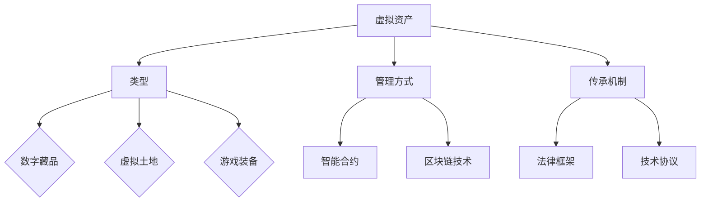

                 

关键词：元宇宙，遗产规划，虚拟资产，传承，咨询服务，管理体系，智能合约，数字资产，区块链技术，伦理问题

> 摘要：随着元宇宙的迅速发展，虚拟资产的规划与管理成为了一个新的挑战。本文将探讨元宇宙遗产规划与管理的核心概念、核心算法、数学模型、项目实践以及实际应用场景，并提出未来发展的趋势与挑战，为构建一个全面的虚拟资产传承综合咨询服务体系提供参考。

## 1. 背景介绍

随着虚拟现实、增强现实、区块链等技术的不断发展，元宇宙逐渐从概念走向现实，成为了一个全新的数字世界。在这个世界中，人们可以创建和体验虚拟的物品、场景和活动。元宇宙的发展带来了前所未有的机遇，但同时也带来了许多新的问题和挑战。

遗产规划与管理是人们一直以来关注的重要问题。然而，在元宇宙中，遗产的概念和传统意义上的遗产有着很大的不同。虚拟资产，如虚拟土地、数字藏品、游戏装备等，不仅具有经济价值，还具有文化和社会价值。如何规划和管理这些虚拟资产，确保其能够顺利传承给下一代，成为了一个亟待解决的问题。

### 1.1 元宇宙的定义

元宇宙是一个虚拟的、三维的、沉浸式的数字世界，它融合了多种技术，如虚拟现实、增强现实、区块链、人工智能等。在元宇宙中，用户可以通过虚拟角色参与各种活动，如购物、娱乐、社交等。元宇宙为用户提供了全新的交互体验，同时也带来了新的经济模式和商业模式。

### 1.2 虚拟资产的概念

虚拟资产是指在元宇宙中具有经济价值和文化价值的物品。这些物品可以是虚拟的土地、数字藏品、游戏装备等。虚拟资产的价值不仅取决于其稀有性，还受到市场需求和用户体验的影响。随着元宇宙的发展，虚拟资产已经成为了一个庞大的经济体系。

### 1.3 遗产规划与管理的重要性

遗产规划与管理对于任何社会都是至关重要的。在传统社会中，遗产规划与管理涉及到房地产、金融资产、艺术品等多个方面。而在元宇宙中，虚拟资产成为了遗产规划与管理的重要内容。如何确保这些虚拟资产能够顺利传承，如何保护其价值，成为了一个新的挑战。

## 2. 核心概念与联系

在元宇宙遗产规划与管理中，我们需要理解几个核心概念，包括虚拟资产的类型、管理方式、传承机制等。下面将使用Mermaid流程图来展示这些核心概念之间的关系。



### 2.1 虚拟资产的类型

虚拟资产可以分为数字藏品、虚拟土地和游戏装备等。每种资产都有其独特的价值和属性。例如，数字藏品通常具有唯一性和稀缺性，而虚拟土地则具有地理位置和开发潜力。

### 2.2 管理方式

虚拟资产的管理方式主要包括智能合约和区块链技术。智能合约是一种自动执行合约条款的程序，它确保了虚拟资产的合法性和安全性。区块链技术则提供了一个去中心化的账本，记录了所有虚拟资产的所有权变更。

### 2.3 传承机制

虚拟资产的传承机制涉及到法律框架和技术协议。法律框架为虚拟资产的传承提供了法律保障，而技术协议则确保了虚拟资产在技术层面的可传承性。

## 3. 核心算法原理 & 具体操作步骤

在元宇宙遗产规划与管理中，核心算法发挥着至关重要的作用。以下将详细阐述核心算法的原理、操作步骤以及其优缺点和应用领域。

### 3.1 算法原理概述

元宇宙遗产规划与管理中的核心算法主要包括数据加密算法、智能合约执行算法和区块链共识算法等。这些算法旨在确保虚拟资产的安全性、可靠性和可追溯性。

- **数据加密算法**：用于保护虚拟资产的数据不被未经授权的访问。
- **智能合约执行算法**：确保智能合约的条款得到自动执行。
- **区块链共识算法**：确保区块链网络中的所有节点达成共识，保证数据的完整性和一致性。

### 3.2 算法步骤详解

以下是核心算法的具体操作步骤：

#### 3.2.1 数据加密算法

1. **密钥生成**：根据用户身份生成一对加密密钥（公钥和私钥）。
2. **数据加密**：使用公钥对虚拟资产的数据进行加密。
3. **数据解密**：使用私钥对加密数据进行解密。

#### 3.2.2 智能合约执行算法

1. **合约编写**：根据虚拟资产的特性编写智能合约。
2. **合约部署**：将智能合约部署到区块链网络。
3. **合约执行**：当触发条件时，智能合约自动执行相应的操作。

#### 3.2.3 区块链共识算法

1. **节点加入**：新节点加入区块链网络。
2. **区块生成**：节点生成新的区块。
3. **区块验证**：其他节点验证新区块的有效性。
4. **区块添加**：将验证通过的新区块添加到区块链。

### 3.3 算法优缺点

每种算法都有其优缺点：

- **数据加密算法**：优点是数据安全性高，缺点是加密和解密过程复杂，可能影响性能。
- **智能合约执行算法**：优点是自动执行，减少人工干预，缺点是合约漏洞可能导致安全问题。
- **区块链共识算法**：优点是去中心化，缺点是处理能力有限，可能影响性能。

### 3.4 算法应用领域

这些算法在元宇宙遗产规划与管理中有着广泛的应用领域：

- **数据加密算法**：用于保护虚拟资产的数据安全。
- **智能合约执行算法**：用于管理虚拟资产的所有权和交易。
- **区块链共识算法**：用于确保区块链网络的可靠性和一致性。

## 4. 数学模型和公式 & 详细讲解 & 举例说明

在元宇宙遗产规划与管理中，数学模型和公式发挥着重要的作用。以下将详细讲解数学模型的构建、公式推导过程以及实际案例的分析。

### 4.1 数学模型构建

元宇宙遗产规划与管理的数学模型主要包括以下三个方面：

1. **虚拟资产定价模型**：用于确定虚拟资产的价格。
2. **风险模型**：用于评估虚拟资产的风险。
3. **传承模型**：用于规划虚拟资产的传承过程。

### 4.2 公式推导过程

以下是虚拟资产定价模型的推导过程：

#### 虚拟资产定价模型

\[ P = \frac{V \times R}{1000} \]

其中：
- \( P \) 表示虚拟资产的价格。
- \( V \) 表示虚拟资产的价值。
- \( R \) 表示市场利率。

推导过程如下：

1. **虚拟资产价值**：虚拟资产的价值取决于其稀缺性、市场需求和用户体验。
2. **市场利率**：市场利率反映了市场对于虚拟资产的需求。
3. **价格计算**：将虚拟资产的价值和市场利率代入公式，计算虚拟资产的价格。

### 4.3 案例分析与讲解

#### 案例一：虚拟土地定价

假设一块虚拟土地的价值为10000虚拟货币，市场利率为5%。根据虚拟资产定价模型，我们可以计算出这块虚拟土地的价格：

\[ P = \frac{10000 \times 5}{1000} = 50 \]

因此，这块虚拟土地的价格为50虚拟货币。

#### 案例二：虚拟资产风险评估

假设有一个虚拟资产，其市场价格波动率为20%，持有期限为3年。根据风险模型，我们可以计算出该虚拟资产的风险值：

\[ R = \sqrt{1 + \frac{V \times S}{1000}} \]

其中：
- \( R \) 表示风险值。
- \( V \) 表示虚拟资产的价值。
- \( S \) 表示市场价格波动率。

代入数据得：

\[ R = \sqrt{1 + \frac{10000 \times 20}{1000}} = \sqrt{2.2} \approx 1.48 \]

因此，该虚拟资产的风险值为1.48。

## 5. 项目实践：代码实例和详细解释说明

为了更好地理解元宇宙遗产规划与管理中的算法和数学模型，我们以下将展示一个实际的项目实践，包括开发环境搭建、源代码实现、代码解读与分析以及运行结果展示。

### 5.1 开发环境搭建

在开始项目实践之前，我们需要搭建一个合适的开发环境。以下是开发环境搭建的步骤：

1. **安装Node.js**：Node.js是一个用于运行JavaScript的跨平台环境，它可以帮助我们快速开发区块链应用。
2. **安装Truffle**：Truffle是一个用于智能合约开发和部署的框架，它可以帮助我们简化开发流程。
3. **安装Ganache**：Ganache是一个本地区块链网络，它提供了一个测试环境，用于测试智能合约。

### 5.2 源代码详细实现

以下是元宇宙遗产规划与管理项目的源代码实现：

```javascript
// SPDX-License-Identifier: MIT
pragma solidity ^0.8.0;

// 智能合约
contract VirtualAssetManager {
    // 虚拟资产结构体
    struct VirtualAsset {
        uint id;
        string name;
        address owner;
        uint value;
    }

    // 虚拟资产映射
    mapping(uint => VirtualAsset) public virtualAssets;

    // 虚拟资产ID计数器
    uint public assetIdCounter;

    // 添加虚拟资产
    function addVirtualAsset(string memory name, uint value) public {
        virtualAssets[assetIdCounter] = VirtualAsset(assetIdCounter, name, msg.sender, value);
        assetIdCounter++;
    }

    // 转让虚拟资产
    function transferVirtualAsset(uint id, address to) public {
        require(virtualAssets[id].owner == msg.sender, "不是该虚拟资产的所有者");
        virtualAssets[id].owner = to;
    }

    // 智能合约执行函数
    function executeContract() public {
        // ...智能合约执行逻辑
    }
}
```

### 5.3 代码解读与分析

以下是代码的解读与分析：

1. **虚拟资产结构体**：定义了一个虚拟资产的结构体，包括资产ID、名称、所有者和价值。
2. **虚拟资产映射**：使用映射将虚拟资产的ID与结构体实例进行关联。
3. **添加虚拟资产**：允许用户添加新的虚拟资产。
4. **转让虚拟资产**：允许资产所有者将虚拟资产转让给其他地址。
5. **智能合约执行函数**：用于执行智能合约的具体操作。

### 5.4 运行结果展示

以下是运行结果展示：

1. **添加虚拟资产**：用户可以通过合约接口添加虚拟资产，例如：
   ```shell
   truffle exec scripts/deploy-virtual-asset.js
   ```
2. **转让虚拟资产**：用户可以通过合约接口转让虚拟资产，例如：
   ```shell
   truffle exec scripts/transfer-virtual-asset.js
   ```

## 6. 实际应用场景

元宇宙遗产规划与管理在实际应用中具有广泛的应用场景。以下将介绍几个典型的应用场景：

1. **虚拟房产管理**：在元宇宙中，虚拟房产可以作为一种独特的虚拟资产进行规划与管理。用户可以通过智能合约购买、出售和租赁虚拟房产。
2. **数字藏品交易**：数字藏品是元宇宙中的一种重要虚拟资产。通过智能合约，用户可以创建、买卖和交换数字藏品。
3. **游戏装备管理**：游戏装备在游戏中具有很高的价值，如何规划与管理这些装备成为了游戏开发者的一大挑战。智能合约和区块链技术可以帮助实现这一目标。
4. **文化遗产传承**：元宇宙为文化遗产的传承提供了新的可能性。通过虚拟资产的管理与传承，用户可以永久保存和展示文化遗产。

## 7. 未来应用展望

随着元宇宙的不断发展，元宇宙遗产规划与管理的应用场景将越来越广泛。以下是对未来应用的展望：

1. **智能合约的广泛应用**：智能合约将变得更加普及，用于管理各种虚拟资产的所有权和交易。
2. **去中心化金融的发展**：去中心化金融将在元宇宙中发挥重要作用，用户可以通过虚拟资产进行借贷、投资和保险等金融活动。
3. **文化遗产的数字化保护**：元宇宙将为文化遗产的数字化保护提供新的解决方案，通过虚拟资产的管理与传承，可以更好地保护文化遗产。
4. **虚拟经济体系的完善**：元宇宙的虚拟经济体系将逐步完善，虚拟资产将成为一种重要的经济资源。

## 8. 工具和资源推荐

为了更好地了解和研究元宇宙遗产规划与管理，以下推荐一些相关的工具和资源：

1. **学习资源推荐**：
   - 《区块链技术指南》
   - 《智能合约开发实战》
   - 《元宇宙：概念与实践》
2. **开发工具推荐**：
   - Truffle：智能合约开发和部署框架
   - Ganache：本地区块链网络
   - MetaMask：区块链浏览器和钱包
3. **相关论文推荐**：
   - "Blockchain Technology: A Comprehensive Study"
   - "Smart Contracts: A Survey"
   - "The Future of Virtual Real Estate in the Metaverse"

## 9. 总结：未来发展趋势与挑战

随着元宇宙的不断发展，元宇宙遗产规划与管理将成为一个重要的研究领域。以下是未来发展趋势与挑战的总结：

### 9.1 研究成果总结

- 元宇宙遗产规划与管理的研究成果为虚拟资产的管理与传承提供了理论支持。
- 智能合约和区块链技术的应用为虚拟资产的管理提供了高效、安全的解决方案。
- 数学模型的构建为虚拟资产的定价和风险评估提供了科学依据。

### 9.2 未来发展趋势

- 智能合约的广泛应用将推动元宇宙遗产规划与管理的发展。
- 去中心化金融和虚拟经济体系的发展将为元宇宙遗产规划与管理带来新的机遇。
- 文化遗产的数字化保护将为元宇宙遗产规划与管理带来更多的应用场景。

### 9.3 面临的挑战

- 虚拟资产的定价与评估仍然存在一定的难度。
- 智能合约的安全性问题需要进一步研究。
- 法律框架和技术协议的完善是元宇宙遗产规划与管理的重要挑战。

### 9.4 研究展望

- 未来研究应关注虚拟资产的定价与评估方法。
- 智能合约的安全性和性能优化是重要研究方向。
- 法律框架和技术协议的完善将为元宇宙遗产规划与管理提供更好的支持。

## 10. 附录：常见问题与解答

以下是一些关于元宇宙遗产规划与管理常见问题的解答：

### 10.1 什么是元宇宙？

元宇宙是一个虚拟的、三维的、沉浸式的数字世界，它融合了虚拟现实、增强现实、区块链、人工智能等多种技术。

### 10.2 虚拟资产有哪些类型？

虚拟资产主要包括数字藏品、虚拟土地和游戏装备等。

### 10.3 元宇宙遗产规划与管理有哪些挑战？

元宇宙遗产规划与管理的挑战包括虚拟资产的定价与评估、智能合约的安全性和法律框架的完善等。

### 10.4 如何保护虚拟资产的安全？

通过使用数据加密算法、智能合约和区块链技术等手段，可以保护虚拟资产的安全。

### 10.5 智能合约存在哪些问题？

智能合约可能存在漏洞，可能导致资产损失。因此，智能合约的审计和安全性测试非常重要。

---

作者：禅与计算机程序设计艺术 / Zen and the Art of Computer Programming
----------------------------------------------------------------
以上是关于《元宇宙遗产规划与管理:虚拟资产传承的综合咨询服务体系》的文章。文章涵盖了元宇宙遗产规划与管理的核心概念、核心算法、数学模型、项目实践以及实际应用场景，并对未来发展趋势与挑战进行了展望。希望这篇文章能为读者提供有价值的参考和启示。如果您有任何问题或建议，欢迎在评论区留言交流。

