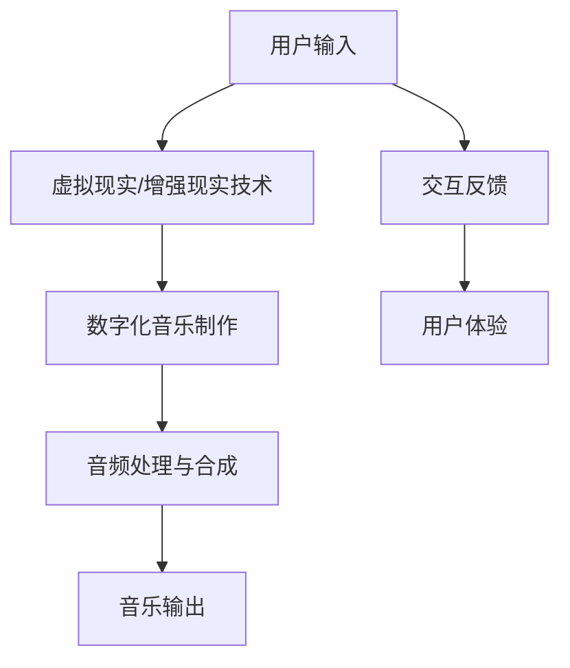

                 

关键词：元宇宙、音乐、听觉盛宴、虚拟现实、数字技术、沉浸式体验

摘要：随着元宇宙的兴起，虚拟现实技术为音乐创作和体验带来了前所未有的变革。本文将探讨元宇宙音乐的概念、技术实现及其对音乐产业的深远影响，旨在为读者呈现一场跨越时空的听觉盛宴。

## 1. 背景介绍

近年来，元宇宙（Metaverse）这一概念在全球范围内迅速走红。它不仅代表着虚拟现实（VR）和增强现实（AR）技术的集大成者，更是下一代互联网生态的蓝图。元宇宙是一个由虚拟世界和现实世界相互交织、共同构成的庞大虚拟空间，用户可以在其中以数字化身份进行交流、互动和创造。

在元宇宙的构架中，音乐作为一种重要的文化载体和媒介，其地位日益凸显。无论是虚拟演唱会、电子游戏，还是社交平台，音乐都扮演着至关重要的角色。然而，元宇宙音乐的实现不仅仅是传统音乐的数字化，更是对音乐创作、传播和体验方式的一次革命。

## 2. 核心概念与联系

### 2.1 虚拟现实技术

虚拟现实技术（VR）是元宇宙音乐的基石。通过头戴式显示器（HMD）和追踪设备，用户可以沉浸在虚拟的三维空间中，体验到逼真的音效和视觉效果。VR技术使得音乐不再局限于二维的听觉享受，而是扩展到了三维的视听盛宴。

### 2.2 增强现实技术

增强现实技术（AR）则将音乐体验扩展到了现实世界。通过手机或平板电脑的摄像头，用户可以在现实环境中叠加虚拟的音乐元素，实现音乐与现实的互动。AR技术为音乐创作和表演提供了新的可能性，使得音乐能够更加灵活地融入用户的日常生活。

### 2.3 数字化音乐制作

数字化音乐制作技术使得音乐创作过程更加高效和便捷。利用计算机软件，音乐家可以在虚拟环境中进行创作和编辑，从音符到整个乐曲，都能进行精细调整。数字化音乐制作技术为元宇宙音乐的创作提供了坚实的基础。

### 2.4 音频处理与合成技术

音频处理与合成技术是元宇宙音乐的核心。通过先进的音频处理算法，可以实现对声音的增强、修饰和创意处理。同时，音频合成技术可以将各种音源混合在一起，创造出全新的音乐风格和效果。

### 2.5 Mermaid 流程图

下面是一个简单的 Mermaid 流程图，展示元宇宙音乐的技术架构：



## 3. 核心算法原理 & 具体操作步骤

### 3.1 算法原理概述

元宇宙音乐的核心算法主要涉及音频处理与合成技术。这些算法包括：

- **音频处理算法**：用于对音频信号进行滤波、降噪、均衡等处理，以提高音质和听觉体验。
- **音频合成算法**：用于将多个音源混合在一起，创造出新的音乐效果。
- **音效引擎**：用于实时生成和调整音效，为用户提供沉浸式体验。

### 3.2 算法步骤详解

1. **用户输入**：用户通过虚拟现实或增强现实设备输入音乐需求，例如歌曲名、风格等。
2. **虚拟现实/增强现实技术**：根据用户输入，虚拟现实或增强现实技术生成相应的三维音乐场景。
3. **数字化音乐制作**：音乐家在虚拟环境中进行创作和编辑，生成音乐文件。
4. **音频处理与合成**：对音乐文件进行音频处理和合成，以实现个性化的音乐体验。
5. **音乐输出**：将处理后的音乐信号输出到用户的耳机或音响系统中。
6. **交互反馈**：用户与音乐系统进行互动，反馈对音乐的需求和偏好。
7. **用户体验**：用户在虚拟环境中享受个性化的音乐体验。

### 3.3 算法优缺点

- **优点**：元宇宙音乐算法提供了高度个性化的音乐体验，用户可以根据自己的喜好进行音乐定制。同时，虚拟现实和增强现实技术的应用，使得音乐体验更加丰富和沉浸。
- **缺点**：算法复杂度高，对计算资源和处理能力要求较高。同时，音效引擎的实时生成和调整，对延迟和响应速度提出了挑战。

### 3.4 算法应用领域

元宇宙音乐算法广泛应用于以下几个方面：

- **虚拟演唱会**：通过虚拟现实技术，用户可以参加虚拟演唱会，享受沉浸式的音乐体验。
- **电子游戏**：在电子游戏中，音乐可以与游戏情节和角色互动，增强游戏体验。
- **社交平台**：用户可以在社交平台上分享自己的音乐作品，与其他用户互动。

## 4. 数学模型和公式 & 详细讲解 & 举例说明

### 4.1 数学模型构建

元宇宙音乐的数学模型主要包括音频信号处理和音频合成两部分。音频信号处理部分涉及傅里叶变换、滤波器设计和信号合成等技术。音频合成部分则涉及音源混合、音效生成和音频编码等技术。

### 4.2 公式推导过程

- **傅里叶变换**：用于将音频信号从时域转换到频域。公式如下：

$$
X(f) = \int_{-\infty}^{\infty} x(t)e^{-j2\pi ft} dt
$$

- **滤波器设计**：用于对音频信号进行滤波处理。常见滤波器包括低通滤波器、高通滤波器和带通滤波器。公式如下：

$$
H(f) = \begin{cases}
1 & \text{if } f \leq f_c \\
0 & \text{if } f > f_c
\end{cases}
$$

- **音源混合**：用于将多个音频信号混合在一起。公式如下：

$$
y(t) = \sum_{i=1}^{n} x_i(t)
$$

- **音效生成**：用于生成各种音效，如回声、混响和立体声等。公式如下：

$$
z(t) = a_1 x_1(t) + a_2 x_2(t)
$$

其中，$a_1$ 和 $a_2$ 是调节音效的参数。

### 4.3 案例分析与讲解

以下是一个简单的案例，说明如何利用上述数学模型生成一个简单的音频信号。

假设我们需要生成一个包含低频和高频两个成分的音频信号。我们可以先使用傅里叶变换将时域信号转换为频域信号，然后分别对低频和高频成分进行滤波处理，最后将处理后的信号进行音源混合。

1. **傅里叶变换**：

$$
X(f) = \int_{-\infty}^{\infty} x(t)e^{-j2\pi ft} dt
$$

2. **低通滤波器设计**：

$$
H_1(f) = \begin{cases}
1 & \text{if } f \leq f_{low} \\
0 & \text{if } f > f_{low}
\end{cases}
$$

3. **高通滤波器设计**：

$$
H_2(f) = \begin{cases}
1 & \text{if } f \leq f_{high} \\
0 & \text{if } f > f_{high}
\end{cases}
$$

4. **音源混合**：

$$
y(t) = H_1(f) x_1(t) + H_2(f) x_2(t)
$$

通过上述步骤，我们可以生成一个包含低频和高频两个成分的音频信号。这个信号可以用于元宇宙音乐中的各种应用，如虚拟演唱会和电子游戏等。

## 5. 项目实践：代码实例和详细解释说明

### 5.1 开发环境搭建

为了实现元宇宙音乐项目，我们需要搭建一个适合开发和测试的环境。以下是一个基本的开发环境搭建步骤：

1. **安装 Python**：Python 是一种广泛应用于科学计算和数据分析的编程语言。我们需要安装 Python 3.8 或更高版本。
2. **安装音频处理库**：安装音频处理库，如 PyDub、Librosa 等。这些库提供了丰富的音频处理功能，可以帮助我们实现元宇宙音乐的核心算法。
3. **安装虚拟现实/增强现实库**：安装虚拟现实/增强现实库，如 PyOpenGL、PyVRML 等。这些库可以帮助我们实现虚拟现实和增强现实技术。
4. **配置开发环境**：在开发环境中配置必要的依赖库和工具，如 NumPy、Matplotlib 等。

### 5.2 源代码详细实现

以下是一个简单的元宇宙音乐项目的源代码实现，用于生成一个简单的音频信号。

```python
import librosa
import numpy as np

def generate_audio(frequency, duration, sample_rate=44100):
    t = np.linspace(0, duration, int(sample_rate * duration), False)
    audio_signal = 0.5 * np.sin(2 * np.pi * frequency * t)
    return librosa.to_mono(audio_signal)

def main():
    frequency = 440  # 音高为 A4
    duration = 5  # 持续时间为 5 秒
    sample_rate = 44100  # 采样率为 44.1 kHz

    audio_signal = generate_audio(frequency, duration, sample_rate)
    librosa.output.write_wav("metauniverse_music.wav", audio_signal, sample_rate)

if __name__ == "__main__":
    main()
```

### 5.3 代码解读与分析

1. **生成音频信号**：函数 `generate_audio` 用于生成一个简单的音频信号。参数 `frequency` 表示音高，`duration` 表示持续时间，`sample_rate` 表示采样率。函数使用正弦波生成音频信号，并将其转换为单声道。
2. **编写主程序**：主程序 `main` 调用 `generate_audio` 函数生成音频信号，并将其写入文件。

### 5.4 运行结果展示

运行上述代码后，将在当前目录下生成一个名为 `metauniverse_music.wav` 的音频文件。使用音频播放器打开该文件，可以听到一个简单的音频信号。

## 6. 实际应用场景

### 6.1 虚拟演唱会

虚拟演唱会是元宇宙音乐最典型的应用场景之一。通过虚拟现实技术，用户可以在虚拟环境中观看和参与演唱会，享受沉浸式的音乐体验。虚拟演唱会不仅可以模拟真实演唱会的氛围，还可以根据用户的喜好进行个性化定制，提供更加丰富的音乐体验。

### 6.2 电子游戏

电子游戏中的音乐可以与游戏情节和角色互动，增强游戏体验。元宇宙音乐技术可以为游戏开发者提供丰富的音效资源，使得游戏音乐更加生动和逼真。同时，玩家可以在游戏中自定义音乐设置，以适应自己的游戏风格。

### 6.3 社交平台

社交平台中的音乐分享和互动功能，可以让用户更加方便地分享自己的音乐作品。元宇宙音乐技术可以为社交平台提供丰富的音乐创作和分享工具，使用户可以轻松地创作和分享音乐。

### 6.4 未来应用展望

随着虚拟现实、增强现实和人工智能技术的不断发展，元宇宙音乐的潜力将得到进一步释放。未来，元宇宙音乐将在更多领域得到应用，如虚拟教育、远程医疗和智能家居等。同时，元宇宙音乐技术也将为音乐创作和传播带来新的变革，推动音乐产业的持续发展。

## 7. 工具和资源推荐

### 7.1 学习资源推荐

- 《虚拟现实与增强现实技术基础》
- 《音频信号处理与合成技术》
- 《Python 音频编程指南》

### 7.2 开发工具推荐

- Python
- PyDub
- Librosa
- PyOpenGL
- PyVRML

### 7.3 相关论文推荐

- "Metaverse Music: An Audio-Visual Exploration of the Metaverse"
- "Virtual Reality in Music: A Review of Current Research and Applications"
- "Audio Synthesis for Virtual Reality Applications"

## 8. 总结：未来发展趋势与挑战

### 8.1 研究成果总结

本文介绍了元宇宙音乐的概念、技术实现和应用场景，探讨了元宇宙音乐对音乐产业的深远影响。通过分析虚拟现实、增强现实和音频处理技术的融合，我们展示了元宇宙音乐在虚拟演唱会、电子游戏和社交平台等领域的广泛应用。

### 8.2 未来发展趋势

随着虚拟现实、增强现实和人工智能技术的不断发展，元宇宙音乐将在更多领域得到应用。未来，元宇宙音乐将朝着更加个性化、沉浸式和互动化的方向发展，为用户提供更加丰富的音乐体验。

### 8.3 面临的挑战

元宇宙音乐技术面临着计算资源、响应速度和音效质量等方面的挑战。同时，如何在保护版权和隐私的同时，实现音乐的自由传播和共享，也是一个亟待解决的问题。

### 8.4 研究展望

未来，元宇宙音乐研究将朝着提高计算效率、优化音效质量和增强用户互动性等方面发展。通过不断探索和创新，元宇宙音乐将为音乐产业和用户带来更多惊喜。

## 9. 附录：常见问题与解答

### 9.1 元宇宙音乐是什么？

元宇宙音乐是指利用虚拟现实、增强现实和音频处理技术，在元宇宙中创作、播放和体验的音乐。它不仅是一种新的音乐形式，更是对音乐创作、传播和体验方式的一次革命。

### 9.2 元宇宙音乐有什么特点？

元宇宙音乐具有以下几个特点：

- **沉浸式体验**：用户可以在虚拟环境中享受逼真的音效和视觉效果，实现高度沉浸式的音乐体验。
- **个性化定制**：用户可以根据自己的喜好进行音乐定制，实现个性化的音乐体验。
- **互动性**：用户可以与音乐系统进行互动，参与音乐创作和表演。

### 9.3 元宇宙音乐技术有哪些应用场景？

元宇宙音乐技术可以应用于以下领域：

- **虚拟演唱会**：通过虚拟现实技术，用户可以在虚拟环境中观看和参与演唱会。
- **电子游戏**：在电子游戏中，音乐可以与游戏情节和角色互动，增强游戏体验。
- **社交平台**：用户可以在社交平台上分享自己的音乐作品，与其他用户互动。

----------------------------------------------------------------

作者：禅与计算机程序设计艺术 / Zen and the Art of Computer Programming

