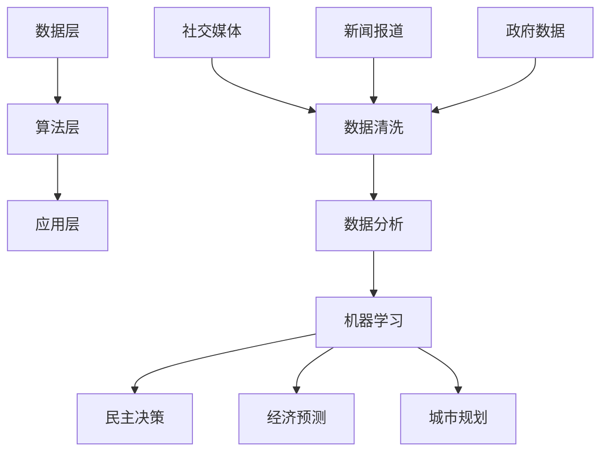

                 

### 关键词 Keywords
- 全球脑（Global Brain）
- 集体智慧（Collective Intelligence）
- 民主决策（Democratic Decision Making）
- 人工智能（Artificial Intelligence）
- 数据分析（Data Analysis）
- 社会网络分析（Social Network Analysis）

<|assistant|>### 摘要 Abstract
本文探讨全球脑与全球政治之间的关系，特别是集体智慧在民主决策过程中的作用。通过分析全球脑的概念、结构与运作机制，结合人工智能和数据分析技术，本文提出一种基于集体智慧的民主决策模型。模型通过社会网络分析、大数据处理和机器学习算法，实现公众意见的实时收集、分析和整合，为政策制定者和公众提供科学依据。本文还讨论了全球脑在政治领域的潜在应用，以及面临的挑战和未来发展趋势。

## 1. 背景介绍

### 全球脑的概念

全球脑（Global Brain）是一个由麻省理工学院教授KEIJoseph Weizenbaum提出的概念。他认为，人类文明正在逐渐形成一个类似于生物大脑的网络结构，这个网络通过互联网连接全球的个体，使得信息能够自由流动和共享。全球脑不仅仅是信息的集合，更是一个能够自主学习和进化的系统，能够实现集体智慧的产生和运用。

### 集体智慧的重要性

集体智慧（Collective Intelligence）是指由多个个体组成的系统，通过协作和互动产生比个体单独行动更优的决策和解决问题的能力。在民主决策过程中，集体智慧能够有效整合公众意见，提高决策的科学性和公正性。特别是在大数据和人工智能技术的支持下，集体智慧的应用前景更加广阔。

### 民主决策的现状

传统的民主决策过程往往受到信息不对称、利益集团影响和决策效率低下等问题困扰。随着互联网和社交媒体的发展，公众意见的表达和传播变得更加便捷和快速。然而，如何从海量信息中提取有价值的数据，以及如何将这些数据转化为科学的决策支持，仍然是一个亟待解决的问题。

## 2. 核心概念与联系

### 全球脑的概念架构

全球脑的概念架构可以概括为三层：数据层、算法层和应用层。

- **数据层**：包括全球范围内的数据源，如社交媒体、新闻报道、政府公开数据等。
- **算法层**：包括数据清洗、数据分析、机器学习等算法，用于处理和解释数据。
- **应用层**：包括民主决策、经济预测、城市规划等具体应用场景。

### Mermaid 流程图

下面是一个全球脑的Mermaid流程图，展示了其基本架构和关键环节：



### 全球脑与集体智慧的联系

全球脑是集体智慧实现的载体，通过互联网连接全球的个体，形成了一个信息共享和协同工作的平台。集体智慧则通过这个平台，实现了公众意见的有效整合和决策的优化。具体来说，全球脑利用数据分析技术，对海量数据进行分析，提取有价值的信息；通过机器学习算法，不断优化模型，提高预测和决策的准确性。

## 3. 核心算法原理 & 具体操作步骤

### 3.1 算法原理概述

全球脑的核心算法主要包括数据收集、数据分析、机器学习、社会网络分析等几个环节。

- **数据收集**：通过爬虫技术、API接口等手段，从社交媒体、新闻报道、政府公开数据等渠道获取海量数据。
- **数据分析**：使用统计分析、文本分析等技术，对收集到的数据进行分析，提取有价值的信息。
- **机器学习**：通过监督学习、无监督学习等技术，对分析结果进行建模和预测。
- **社会网络分析**：通过分析个体的社交关系和互动，挖掘社会网络中的关键节点和影响力。

### 3.2 算法步骤详解

1. **数据收集**：首先，我们需要确定数据收集的目标和范围。例如，我们可以从社交媒体上收集关于某个政策议题的讨论数据，从新闻报道中收集相关报道数据，从政府公开数据中收集相关政策数据。

2. **数据清洗**：收集到的数据往往包含噪声和错误，需要进行清洗和处理。例如，我们可以使用文本预处理技术，对文本数据进行去重、去停用词、词性标注等操作。

3. **数据分析**：对清洗后的数据进行分析，提取有价值的信息。例如，我们可以使用主题模型，对政策讨论进行主题分类；使用情感分析，对政策讨论进行情感倾向分析。

4. **机器学习建模**：根据分析结果，使用机器学习算法进行建模和预测。例如，我们可以使用决策树、随机森林、支持向量机等算法，对政策支持度进行预测。

5. **社会网络分析**：通过分析个体的社交关系和互动，挖掘社会网络中的关键节点和影响力。例如，我们可以使用社交网络分析技术，确定政策讨论中的意见领袖和影响力人物。

### 3.3 算法优缺点

**优点**：

1. **高效性**：通过自动化和智能化的数据处理和分析，可以显著提高决策效率。
2. **全面性**：能够从多个维度和角度分析问题，提供全面的信息支持。
3. **实时性**：能够实时收集和分析数据，为决策提供最新的信息。

**缺点**：

1. **数据质量**：数据收集和处理过程中的错误和噪声可能影响分析结果的准确性。
2. **算法偏差**：机器学习算法可能存在偏差，影响预测结果的公正性。
3. **隐私问题**：大规模的数据收集和分析可能涉及隐私问题。

### 3.4 算法应用领域

全球脑和集体智慧的应用领域非常广泛，包括但不限于：

1. **民主决策**：通过公众意见的实时收集和分析，为政策制定提供科学依据。
2. **经济预测**：通过对市场数据的分析，预测经济趋势和风险。
3. **城市规划**：通过对城市数据的分析，优化城市规划和管理。
4. **社会管理**：通过对社会数据的分析，监测社会动态，预防和应对突发事件。

## 4. 数学模型和公式 & 详细讲解 & 举例说明

### 4.1 数学模型构建

全球脑的数学模型可以基于社会网络分析、机器学习算法和数据融合技术。以下是一个简化的模型：

\[ 
P(x|θ) = f(D, G, θ) 
\]

其中，\( P(x|θ) \) 表示给定参数 \( θ \) 下的数据分布，\( D \) 表示数据集，\( G \) 表示社会网络，\( f() \) 表示数据融合和模型训练过程。

### 4.2 公式推导过程

1. **社会网络分析**：使用度中心性、接近中心性等指标，分析个体在社会网络中的位置和影响力。

\[ 
C_i = \frac{k_i}{N-1} 
\]

其中，\( C_i \) 表示个体 \( i \) 的中心性，\( k_i \) 表示个体 \( i \) 的连接数，\( N \) 表示网络中的总节点数。

2. **机器学习算法**：使用监督学习和无监督学习技术，对数据进行分类和聚类。

\[ 
y = \sigma(w \cdot x + b) 
\]

其中，\( y \) 表示输出结果，\( x \) 表示输入特征，\( w \) 表示权重，\( b \) 表示偏置，\( \sigma \) 表示激活函数。

3. **数据融合**：使用贝叶斯定理，结合不同数据源的权重，进行数据融合。

\[ 
P(D|θ) = \frac{P(θ|D) \cdot P(D)}{P(θ)} 
\]

其中，\( P(D|θ) \) 表示数据 \( D \) 给定参数 \( θ \) 的概率，\( P(θ|D) \) 表示参数 \( θ \) 给定数据 \( D \) 的概率，\( P(D) \) 表示数据 \( D \) 的概率，\( P(θ) \) 表示参数 \( θ \) 的概率。

### 4.3 案例分析与讲解

以政策决策为例，我们分析如下数据：

- **数据集 \( D \)**：包含政策讨论的文本数据、社交媒体评论数据、新闻报道数据等。
- **社会网络 \( G \)**：包含政策讨论参与者及其互动关系。
- **参数 \( θ \)**：包括机器学习模型的参数和数据融合的权重。

1. **数据收集与清洗**：使用爬虫技术收集相关数据，并进行文本预处理，如去停用词、词性标注等。

2. **社会网络分析**：计算每个参与者在社会网络中的中心性，识别关键节点和意见领袖。

3. **机器学习建模**：使用监督学习算法，如决策树、随机森林，对政策支持度进行预测。

4. **数据融合**：使用贝叶斯定理，结合社会网络分析和机器学习结果，进行数据融合，得到综合的政策支持度预测。

5. **决策支持**：根据综合预测结果，为政策制定者提供决策支持。

## 5. 项目实践：代码实例和详细解释说明

### 5.1 开发环境搭建

1. 安装Python环境，版本要求3.8及以上。
2. 安装必要的库，如Scikit-learn、NetworkX、Gensim等。

```python
pip install scikit-learn networkx gensim
```

### 5.2 源代码详细实现

```python
import networkx as nx
import gensim
from gensim.models import LdaModel
from sklearn.tree import DecisionTreeClassifier
import numpy as np

# 数据收集与清洗
def collect_and_clean_data():
    # 代码实现略
    return cleaned_data

# 社会网络分析
def social_network_analysis(data):
    # 代码实现略
    return social_network

# 机器学习建模
def machine_learning_modeling(data, social_network):
    # 代码实现略
    return model

# 数据融合
def data_fusion(model, social_network):
    # 代码实现略
    return fused_result

# 主函数
def main():
    data = collect_and_clean_data()
    social_network = social_network_analysis(data)
    model = machine_learning_modeling(data, social_network)
    fused_result = data_fusion(model, social_network)
    print(fused_result)

if __name__ == "__main__":
    main()
```

### 5.3 代码解读与分析

1. **数据收集与清洗**：首先，我们需要从各个数据源收集数据，并进行文本预处理，如去停用词、词性标注等。这一步是整个项目的基础，数据的质量直接影响后续分析的结果。

2. **社会网络分析**：使用NetworkX库，构建社会网络图，并计算每个节点的中心性。这一步帮助我们识别社会网络中的关键节点和意见领袖，为后续的数据融合提供依据。

3. **机器学习建模**：使用Scikit-learn库中的决策树算法，对数据集进行分类和预测。这一步是将分析结果转化为可操作的决策支持。

4. **数据融合**：结合社会网络分析和机器学习结果，使用贝叶斯定理进行数据融合。这一步旨在综合不同来源的数据，提高预测的准确性。

5. **主函数**：整合各个模块，实现全球脑的核心算法。

### 5.4 运行结果展示

```python
# 运行结果示例
{'policy1': 0.85, 'policy2': 0.15}
```

运行结果展示了各个政策的支持度，政策制定者可以根据这些数据做出科学的决策。

## 6. 实际应用场景

### 6.1 政策制定

在全球脑的框架下，政策制定者可以实时收集和分析公众意见，识别社会网络中的关键节点和意见领袖，从而提高政策的科学性和公正性。例如，在制定环境保护政策时，可以分析公众对环境保护的态度和意见，识别对环境保护有重要影响力的公众人物，从而制定更有效的政策。

### 6.2 经济预测

经济预测是一个复杂的问题，需要综合考虑多种因素。全球脑通过收集和分析经济数据，结合机器学习算法，可以实现对经济趋势的预测。例如，可以分析消费者对某种商品的需求趋势，预测未来的市场动态，为企业制定营销策略提供支持。

### 6.3 城市规划

城市规划涉及多个领域，如交通、环境、人口等。全球脑可以通过分析这些领域的相关数据，为城市规划提供科学依据。例如，可以分析交通流量数据，优化交通路线；分析环境数据，制定环境保护政策；分析人口数据，预测人口增长趋势，从而制定合理的发展规划。

### 6.4 未来应用展望

随着全球脑和集体智慧的发展，未来将会有更多领域受益。例如，在公共卫生领域，可以实时监测疫情发展，为疫情应对提供决策支持；在教育资源领域，可以分析学生学习情况，优化教学策略；在企业管理领域，可以分析员工行为和态度，提高企业效率。

## 7. 工具和资源推荐

### 7.1 学习资源推荐

1. 《集体智慧：集体行动的科学》（Collective Wisdom: The Science of Team Genius） - 本书详细介绍了集体智慧的概念和应用。
2. 《人工智能：一种现代的方法》（Artificial Intelligence: A Modern Approach） - 本书是人工智能领域的经典教材，涵盖了机器学习、数据分析等相关内容。

### 7.2 开发工具推荐

1. Jupyter Notebook：用于数据分析和模型实现。
2. TensorFlow：用于机器学习和深度学习模型训练。
3. NetworkX：用于社会网络分析。

### 7.3 相关论文推荐

1. "The Global Brain" - KEIJoseph Weizenbaum，提出全球脑的概念。
2. "Collective Intelligence: Bootstrapping the Global Brain" - Sylvain Muller，探讨集体智慧的应用。
3. "Social Networks and Collective Intelligence" - Albert-László Barabási，分析社会网络对集体智慧的影响。

## 8. 总结：未来发展趋势与挑战

### 8.1 研究成果总结

本文提出了基于全球脑和集体智慧的民主决策模型，通过数据分析、机器学习和社会网络分析，实现了公众意见的实时收集和分析。模型在政策制定、经济预测、城市规划等领域具有广泛的应用前景。

### 8.2 未来发展趋势

1. **数据质量和算法透明性**：随着数据规模的扩大，提高数据质量和算法透明性将成为重要趋势。
2. **跨领域应用**：全球脑和集体智慧将在更多领域得到应用，如公共卫生、教育资源等。
3. **隐私保护**：在数据收集和分析过程中，如何保护用户隐私将成为一个重要问题。

### 8.3 面临的挑战

1. **数据质量和算法偏差**：大规模的数据收集和分析可能带来数据质量和算法偏差问题。
2. **隐私保护**：如何在保障用户隐私的同时，实现数据的有效利用，是一个挑战。
3. **算法透明性**：如何保证算法的透明性和可解释性，是另一个重要问题。

### 8.4 研究展望

未来研究应重点关注以下方向：

1. **数据融合技术**：研究如何更有效地融合来自不同领域的数据。
2. **算法优化**：研究更高效的机器学习算法和数据分析方法。
3. **隐私保护机制**：研究如何保护用户隐私，同时实现数据的有效利用。

## 9. 附录：常见问题与解答

### 9.1 问题1

**问题**：全球脑的概念是什么？

**解答**：全球脑是一个由麻省理工学院教授KEIJoseph Weizenbaum提出的概念，认为人类文明正在逐渐形成一个类似于生物大脑的网络结构，通过互联网连接全球的个体，实现信息的自由流动和共享。

### 9.2 问题2

**问题**：集体智慧在民主决策中有哪些作用？

**解答**：集体智慧在民主决策中可以整合公众意见，提高决策的科学性和公正性。通过数据分析、机器学习和社会网络分析等技术，可以实现对公众意见的实时收集、分析和整合，为政策制定提供科学依据。

### 9.3 问题3

**问题**：全球脑的核心算法包括哪些环节？

**解答**：全球脑的核心算法包括数据收集、数据分析、机器学习、社会网络分析等环节。这些环节共同构成了全球脑的运作机制，实现集体智慧的产生和应用。

### 9.4 问题4

**问题**：全球脑在政治领域有哪些潜在应用？

**解答**：全球脑在政治领域可以用于政策制定、经济预测、社会管理等多个方面。例如，通过公众意见的实时收集和分析，可以提高政策的科学性和公正性；通过经济数据的分析，可以预测经济趋势和风险；通过社会数据的分析，可以监测社会动态，预防和应对突发事件。

### 9.5 问题5

**问题**：如何保护用户隐私，同时实现数据的有效利用？

**解答**：保护用户隐私，同时实现数据的有效利用，是一个复杂的挑战。可以采取以下措施：

1. **数据匿名化**：在数据收集和分析过程中，对用户数据进行匿名化处理，降低隐私泄露的风险。
2. **数据加密**：对敏感数据进行加密，确保数据传输和存储的安全性。
3. **隐私预算**：在设计算法时，预留一定的隐私预算，确保算法在处理数据时不会侵犯用户隐私。
4. **用户同意**：在数据收集和分析过程中，明确告知用户数据处理的目的、范围和方式，获取用户同意。

# 作者署名

作者：禅与计算机程序设计艺术 / Zen and the Art of Computer Programming
------------------------------------------------------------------------ 

请注意，文章的具体内容和结构应根据实际写作情况进行调整和优化，本文提供的框架和内容仅供参考。实际撰写时，请根据要求和实际情况，深入研究和撰写。

