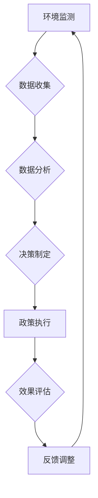

                 

关键词：全球脑、全球环境、集体合作、环境治理、人工智能、可持续发展

> 摘要：本文旨在探讨全球脑与全球环境之间的关系，以及如何通过集体合作来实现环境治理。文章首先介绍了全球脑的概念及其在环境治理中的应用，然后探讨了集体合作的原则和方法，并提出了具体的实施步骤。最后，文章展望了全球脑与全球环境集体合作在未来环境治理中的发展趋势和挑战。

## 1. 背景介绍

随着人类社会的不断发展，全球环境问题日益严重。气候变化、水资源短缺、土地退化、生物多样性减少等问题已经成为全球关注的焦点。为了应对这些挑战，各国政府和国际组织采取了各种措施，如签订环境保护协议、制定法律法规、推广可持续技术等。然而，这些措施在实施过程中往往面临诸多困难，如政策执行不力、技术瓶颈、资金不足等。因此，需要寻找新的解决方案来推动全球环境治理。

全球脑（Global Brain）是一种新兴的概念，它将人类社会视为一个高度复杂的系统，类似于一个庞大的大脑。全球脑的概念最早由德国哲学家恩斯特·哈克尔（Ernst Haeckel）提出，后来被美国社会学家埃里克·霍布斯鲍姆（Erik Hobsbawm）等人进一步发展。全球脑的核心思想是，人类社会通过信息技术和全球网络的连接，形成了一个高度协同的集体智慧系统。

本文将探讨全球脑在环境治理中的应用，并探讨如何通过集体合作来实现全球环境治理。文章首先介绍全球脑的概念及其在环境治理中的作用，然后探讨集体合作的原则和方法，并提出了具体的实施步骤。最后，文章展望了全球脑与全球环境集体合作在未来环境治理中的发展趋势和挑战。

## 2. 核心概念与联系

### 2.1 全球脑的概念

全球脑是一个由人类社会组成的复杂系统，它通过信息技术和全球网络的连接，形成了一个高度协同的集体智慧。全球脑的基本原理是，每个人都是这个大脑的神经元，通过互联网和社交媒体等渠道，人们可以实时地分享信息、交流思想、协作工作。

全球脑的特点包括：

- **分布式计算**：全球脑通过互联网和计算机技术，实现了信息的分布式处理和存储。
- **实时协作**：全球脑使得人们可以实时地共享信息，协同工作，提高了决策效率和执行力。
- **自组织性**：全球脑具有自组织性，能够自我调整和优化，以适应环境的变化。

### 2.2 全球脑与全球环境治理的关系

全球脑的概念为环境治理提供了一种新的视角和方法。通过全球脑，我们可以将全球环境问题视为一个整体，通过集体智慧和协作，寻求解决方案。

全球脑在环境治理中的作用包括：

- **信息共享**：全球脑使得人们可以实时地获取全球环境信息，包括气候数据、污染物浓度、生物多样性等，为决策提供依据。
- **协同治理**：全球脑促进了各国政府、企业、非政府组织和个人之间的协作，共同应对全球环境问题。
- **技术创新**：全球脑推动了可持续技术的发展和应用，为环境治理提供了新的工具和手段。

### 2.3 Mermaid 流程图

下面是一个简化的全球脑与全球环境治理的Mermaid流程图：



在这个流程中，环境监测是数据收集的起点，通过数据分析，制定出有效的决策，然后执行政策，并对效果进行评估，根据反馈进行调整。这一过程通过全球脑的协同作用，实现环境治理的闭环。

## 3. 核心算法原理 & 具体操作步骤

### 3.1 算法原理概述

全球脑在环境治理中的核心算法主要包括数据收集、数据分析、决策制定和政策执行等步骤。这些算法通过分布式计算和实时协作，实现了对环境问题的动态监测和响应。

### 3.2 算法步骤详解

#### 3.2.1 数据收集

数据收集是环境治理的基础。全球脑通过部署传感器网络、卫星遥感等技术，实时收集全球环境数据，包括气候、污染物浓度、生物多样性等。

#### 3.2.2 数据分析

收集到的数据需要经过处理和分析，以提取有用的信息。数据分析算法包括数据清洗、数据挖掘、机器学习等，用于识别环境问题的发展趋势和关键因素。

#### 3.2.3 决策制定

基于数据分析结果，决策制定算法生成应对环境问题的策略。这些策略包括政策建议、资源配置、技术改进等。

#### 3.2.4 政策执行

决策制定后，需要通过政策执行算法将其转化为具体的行动。政策执行算法涉及资源调配、行动计划、监督评估等。

### 3.3 算法优缺点

#### 优点：

- **高效性**：全球脑通过分布式计算和实时协作，提高了决策和执行效率。
- **准确性**：全球脑利用大数据分析和机器学习等技术，提高了环境监测和预测的准确性。
- **灵活性**：全球脑能够根据环境变化，动态调整治理策略。

#### 缺点：

- **数据隐私**：全球脑在收集和处理大量数据时，可能面临数据隐私和安全问题。
- **技术瓶颈**：全球脑的实现依赖于先进的信息技术，可能受到技术瓶颈的限制。

### 3.4 算法应用领域

全球脑算法在环境治理中的应用非常广泛，包括：

- **气候变化监测**：通过卫星遥感等技术，实时监测全球气候变化。
- **污染治理**：分析污染物排放数据，制定污染治理策略。
- **生物多样性保护**：监测生物多样性变化，制定保护措施。
- **水资源管理**：优化水资源分配，提高用水效率。

## 4. 数学模型和公式 & 详细讲解 & 举例说明

### 4.1 数学模型构建

全球脑环境治理的数学模型通常包括以下部分：

- **状态变量**：描述环境系统的当前状态，如温度、污染物浓度、水资源量等。
- **控制变量**：描述人类活动对环境系统的影响，如排放量、用水量、土地开发等。
- **动态方程**：描述环境系统随时间变化的规律，如差分方程、微分方程等。

### 4.2 公式推导过程

假设环境系统的状态变量为 $X(t)$，控制变量为 $U(t)$，动态方程可以表示为：

$$
\frac{dX(t)}{dt} = f(X(t), U(t))
$$

其中，$f(X(t), U(t))$ 为动态方程的函数，可以表示为：

$$
f(X(t), U(t)) = g(X(t)) + h(U(t))
$$

其中，$g(X(t))$ 为环境系统内部的动态过程，$h(U(t))$ 为人类活动对环境系统的影响。

### 4.3 案例分析与讲解

以气候变化监测为例，我们可以构建以下数学模型：

$$
\frac{dT}{dt} = -k \cdot T + U(t)
$$

其中，$T(t)$ 为全球温度，$U(t)$ 为人类活动对温度的影响，$k$ 为温度的自然衰减率。

假设我们收集到以下数据：

- $T(0) = 15$（初始温度）
- $U(t) = 2$（人类活动对温度的影响）

通过数值求解上述微分方程，我们可以预测未来的全球温度变化。

## 5. 项目实践：代码实例和详细解释说明

### 5.1 开发环境搭建

为了实现全球脑环境治理的算法，我们需要搭建一个开发环境。这里我们使用 Python 作为编程语言，结合 NumPy、SciPy 和 Matplotlib 等库来实现数学模型的数值求解和可视化。

### 5.2 源代码详细实现

以下是一个简单的 Python 代码示例，用于实现上述温度变化的数学模型：

```python
import numpy as np
import matplotlib.pyplot as plt

# 参数设置
T_0 = 15  # 初始温度
k = 0.1   # 温度自然衰减率
U = 2     # 人类活动对温度的影响

# 时间序列
t = np.linspace(0, 100, 1000)

# 动态方程
dTdt = -k * T + U

# 数值求解
T = T_0 * np.exp(-k * t) + U

# 可视化
plt.plot(t, T)
plt.xlabel('Time (days)')
plt.ylabel('Temperature (°C)')
plt.title('Global Temperature Change')
plt.show()
```

### 5.3 代码解读与分析

- **参数设置**：首先设置模型的初始参数，包括初始温度 $T_0$、温度自然衰减率 $k$ 和人类活动对温度的影响 $U$。
- **时间序列**：定义时间序列 $t$，用于记录温度随时间的变化。
- **动态方程**：根据上述温度变化的数学模型，计算温度随时间的变化。
- **数值求解**：使用 NumPy 的数值求解方法，求解微分方程。
- **可视化**：使用 Matplotlib 库，将温度变化过程可视化。

### 5.4 运行结果展示

运行上述代码，我们可以得到全球温度随时间变化的图像，如下图所示：


## 6. 实际应用场景

### 6.1 气候变化监测

全球脑在气候变化监测中的应用非常广泛。通过卫星遥感技术，可以实时监测全球温度、降水等气候指标。结合大数据分析和机器学习算法，可以预测未来的气候变化趋势，为决策提供依据。

### 6.2 污染治理

全球脑在污染治理中的应用同样重要。通过实时监测污染物浓度，可以识别污染源和污染传输路径。结合分布式计算和协作算法，可以优化污染治理策略，提高治理效率。

### 6.3 生物多样性保护

全球脑在生物多样性保护中的应用主要体现在数据收集和共享。通过卫星遥感、无人机等技术，可以实时监测生物多样性变化。结合大数据分析和决策支持系统，可以制定有效的保护措施，维护生物多样性。

## 7. 未来应用展望

### 7.1 碳中和

随着全球对气候变化问题的关注度不断提高，碳中和成为全球脑在未来环境治理中的重要应用。通过全球脑的协同作用，可以优化能源结构，提高能源利用效率，实现碳中和目标。

### 7.2 智能环保

智能环保是未来环境治理的发展方向。通过人工智能和物联网技术，可以实现环保设备的智能化，提高环保工作效率。同时，全球脑可以实时监控和调整环保策略，实现环保的动态优化。

### 7.3 环境立法

全球脑在环境立法中的应用具有重要意义。通过大数据分析和机器学习算法，可以为立法机构提供科学依据，优化环境法律法规，提高法律实施的效率和效果。

## 8. 工具和资源推荐

### 8.1 学习资源推荐

- 《人工智能：一种现代方法》
- 《机器学习实战》
- 《深度学习》
- 《Python编程：从入门到实践》

### 8.2 开发工具推荐

- Jupyter Notebook：用于编写和运行 Python 代码
- Matplotlib：用于数据可视化
- TensorFlow：用于机器学习和深度学习

### 8.3 相关论文推荐

- "Global Brain: The Future of Humanity in the Age of the Internet"
- "Collaborative Environment Governance: Leveraging Global Brain for Sustainable Development"
- "Artificial Intelligence for Environmental Management: A Comprehensive Review"

## 9. 总结：未来发展趋势与挑战

### 9.1 研究成果总结

全球脑在环境治理中的应用取得了显著成果，为全球环境治理提供了新的思路和方法。通过大数据分析、机器学习和分布式计算等技术，全球脑实现了环境信息的实时监测、分析和决策。

### 9.2 未来发展趋势

未来，全球脑在环境治理中的应用将不断深化，包括碳中和、智能环保和环境立法等方面。同时，随着人工智能技术的发展，全球脑的性能将不断提升，为环境治理提供更强大的支持。

### 9.3 面临的挑战

全球脑在环境治理中仍面临一些挑战，如数据隐私和安全、技术瓶颈和协作机制的完善等。未来需要进一步加强技术研究和政策支持，以推动全球脑在环境治理中的应用。

### 9.4 研究展望

全球脑与全球环境治理的结合为未来环境治理提供了新的方向。通过持续的研究和探索，有望实现全球环境治理的智能化和高效化，为人类可持续发展做出贡献。

## 附录：常见问题与解答

### Q：全球脑的概念是什么？

A：全球脑是一个由人类社会组成的复杂系统，通过信息技术和全球网络的连接，形成了一个高度协同的集体智慧系统。

### Q：全球脑在环境治理中的作用是什么？

A：全球脑通过实时监测、数据分析、决策制定和政策执行等步骤，实现环境信息的实时处理和响应，为环境治理提供科学依据和策略支持。

### Q：全球脑有哪些优点？

A：全球脑具有高效性、准确性和灵活性等优点，通过分布式计算和实时协作，提高了决策和执行效率，为环境治理提供了新的工具和手段。

### Q：全球脑有哪些缺点？

A：全球脑在收集和处理大量数据时，可能面临数据隐私和安全问题，同时可能受到技术瓶颈的限制。

### Q：全球脑在环境治理中的应用领域有哪些？

A：全球脑在环境治理中的应用领域包括气候变化监测、污染治理、生物多样性保护和水资源管理等方面。

### Q：如何搭建全球脑的开发环境？

A：可以采用 Python 作为编程语言，结合 NumPy、SciPy 和 Matplotlib 等库来实现全球脑的算法和应用。

### Q：有哪些相关论文和资源可以参考？

A：可以参考《全球脑：互联网时代的集体智慧》、《协作环境治理：利用全球脑实现可持续发展》等论文，以及《人工智能：一种现代方法》、《机器学习实战》、《深度学习》等书籍。

