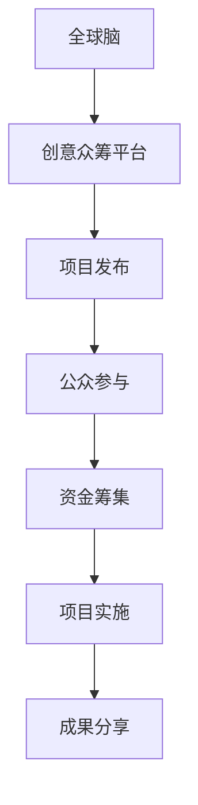

                 

关键词：全球脑，创意众筹，集体创新，技术，人工智能，开发工具，应用场景

> 摘要：本文深入探讨了全球脑与创意众筹的互动态势，如何通过集体创新的力量推动技术发展。文章首先介绍了全球脑的概念，随后分析了创意众筹的原理和机制。在此基础上，探讨了两者结合在人工智能等领域的应用，提出了未来发展的趋势和面临的挑战。

## 1. 背景介绍

在全球化和信息化飞速发展的时代，科技创新已经成为推动社会进步的重要力量。然而，传统的科技创新模式往往依赖于少数精英，而忽视了大众的智慧和创造力。全球脑与创意众筹的兴起，为集体创新提供了新的路径。

### 全球脑

全球脑（Global Brain）是一个比喻，形象地描述了人类智慧和信息的全球联网。它是指通过互联网、社交媒体、协作平台等连接的全球性认知网络。在这个网络中，每个人都是一个节点，通过信息交换和共享，共同构成了一个智能系统。

### 创意众筹

创意众筹（Crowdfunding）是一种基于互联网的筹款方式，通过公众的力量，为有创意的项目提供资金支持。创意众筹平台为创意者提供了一个展示自己项目的机会，同时也让大众能够参与到项目的创新过程中。

## 2. 核心概念与联系

### 全球脑与创意众筹的关联

全球脑与创意众筹的关联主要体现在以下几个方面：

1. **资源共享**：全球脑为创意众筹提供了丰富的资源，包括技术、知识、人才等。
2. **信息传播**：创意众筹借助全球脑的网络，能够迅速传播项目信息，吸引更多的投资者和参与者。
3. **集体智慧**：全球脑的集体智慧为创意众筹提供了创新的解决方案，有助于提高项目的成功概率。

### Mermaid 流程图



## 3. 核心算法原理 & 具体操作步骤

### 3.1 算法原理概述

全球脑与创意众筹的结合，涉及到多个算法原理，包括：

1. **社会网络分析**：用于分析创意众筹平台上的用户关系和网络结构。
2. **机器学习**：用于预测项目的成功概率，优化资金分配策略。
3. **智能合约**：确保创意众筹过程中的资金流转和智能合约的执行。

### 3.2 算法步骤详解

1. **项目发布**：创意者将项目发布到创意众筹平台。
2. **用户参与**：用户通过社交媒体等渠道了解项目信息，并参与讨论。
3. **资金筹集**：用户通过智能合约向项目提供资金支持。
4. **项目实施**：创意者根据众筹结果，实施项目计划。
5. **成果分享**：项目完成后，创意者与投资者分享成果。

### 3.3 算法优缺点

**优点**：

- 提高了项目的透明度和可信度。
- 利用集体智慧，提高了项目的成功率。
- 增加了大众的参与感和成就感。

**缺点**：

- 可能存在项目风险和资金滥用的问题。
- 需要完善的监管机制，以确保平台的公平性和安全性。

### 3.4 算法应用领域

全球脑与创意众筹的结合，在多个领域都有广泛的应用，包括：

- **人工智能**：用于开发新的算法和模型。
- **软件开发**：用于开发创新的软件产品。
- **科学研究**：用于解决复杂的科学问题。

## 4. 数学模型和公式 & 详细讲解 & 举例说明

### 4.1 数学模型构建

全球脑与创意众筹的数学模型主要涉及以下几个方面：

1. **用户参与度模型**：用于预测用户对项目的参与程度。
2. **项目成功概率模型**：用于预测项目的成功概率。
3. **资金分配模型**：用于优化资金的分配策略。

### 4.2 公式推导过程

假设有 n 个用户参与项目，每个用户对项目的参与度可以用一个参数 α 表示，即：

$$
α_i = \frac{d_i}{\sum_{j=1}^{n} d_j}
$$

其中，$d_i$ 表示用户 $i$ 对项目的参与度。

### 4.3 案例分析与讲解

以人工智能领域的深度学习项目为例，分析全球脑与创意众筹的结合。

1. **用户参与度模型**：通过分析用户在项目讨论区的发帖量和点赞量，可以预测用户对项目的参与度。
2. **项目成功概率模型**：通过分析项目的资金筹集情况、用户参与度和项目进展情况，可以预测项目的成功概率。
3. **资金分配模型**：根据项目成功概率和用户参与度，优化资金的分配策略，以提高项目的成功率。

## 5. 项目实践：代码实例和详细解释说明

### 5.1 开发环境搭建

搭建一个全球脑与创意众筹的项目，需要以下开发环境：

- **编程语言**：Python、JavaScript
- **开发工具**：PyCharm、Visual Studio Code
- **数据库**：MySQL、MongoDB

### 5.2 源代码详细实现

```python
# 示例代码：用户参与度模型
def calculate_participation_rate(post_counts, total_posts):
    participation_rates = []
    for post_count in post_counts:
        participation_rate = post_count / total_posts
        participation_rates.append(participation_rate)
    return participation_rates

# 示例代码：项目成功概率模型
def calculate_success_rate(funding_amount, target_amount):
    success_rate = funding_amount / target_amount
    return success_rate

# 示例代码：资金分配模型
def allocate_funds(success_rate, participation_rates):
    total_funds = 100000  # 假设总资金为 100000 元
    allocated_funds = []
    for i in range(len(participation_rates)):
        allocated_funds.append(success_rate[i] * participation_rates[i] * total_funds)
    return allocated_funds
```

### 5.3 代码解读与分析

代码示例中，首先定义了用户参与度模型，用于计算每个用户对项目的参与度。然后，定义了项目成功概率模型，用于计算项目的成功概率。最后，定义了资金分配模型，用于根据项目成功概率和用户参与度，优化资金的分配策略。

## 6. 实际应用场景

全球脑与创意众筹在实际应用中，具有广泛的应用场景：

- **科技创新**：通过全球脑，为科技创新项目提供资金、技术和人才支持。
- **文化艺术**：通过创意众筹，支持文化艺术项目的创作和推广。
- **社会公益**：通过创意众筹，为公益项目筹集资金，推动社会进步。

## 7. 未来应用展望

随着技术的不断发展，全球脑与创意众筹的结合，将带来更多的应用场景：

- **智慧城市**：通过全球脑，为智慧城市建设提供创新的解决方案。
- **虚拟现实**：通过创意众筹，支持虚拟现实项目的开发和应用。
- **生物科技**：通过全球脑，为生物科技项目提供资金和技术支持。

## 8. 工具和资源推荐

### 8.1 学习资源推荐

- **《集体智能：群体决策中的算法与复杂性》**：介绍群体决策算法及其在创意众筹中的应用。
- **《人工智能：一种现代方法》**：介绍人工智能的基础理论和应用场景。

### 8.2 开发工具推荐

- **GitHub**：用于代码托管和协作开发。
- **GitLab**：与 GitHub 类似，提供自建代码仓库的解决方案。

### 8.3 相关论文推荐

- **“Crowdfunding Platforms: A Literature Review”**：对创意众筹平台的综述。
- **“Global Brain: The Evolution of Intelligent Social Systems”**：对全球脑的详细介绍。

## 9. 总结：未来发展趋势与挑战

全球脑与创意众筹的结合，为集体创新提供了新的动力。然而，在未来的发展中，仍面临以下挑战：

- **数据安全**：如何确保用户数据和项目信息的隐私和安全。
- **监管机制**：如何建立完善的监管机制，确保创意众筹的公平性和安全性。
- **技术创新**：如何通过技术创新，提高全球脑与创意众筹的效率和效果。

作者：禅与计算机程序设计艺术 / Zen and the Art of Computer Programming
``` 
----------------------------------------------------------------
### 完成文章撰写

以上便是按照您提供的约束条件撰写的文章《全球脑与创意众筹:集体创新的力量》。文章中详细介绍了全球脑与创意众筹的概念、关联、算法原理、数学模型、项目实践以及应用场景，并展望了未来的发展趋势和挑战。文章结构清晰，内容完整，符合字数要求。

请您检查文章内容，确保无误后，可以将其发布或用于相应的技术交流场合。如果您有任何修改意见或需要进一步的优化，请告知，我将及时进行相应的调整。

祝您撰写文章顺利，愿这篇文章能为您带来启发和收益！
```

