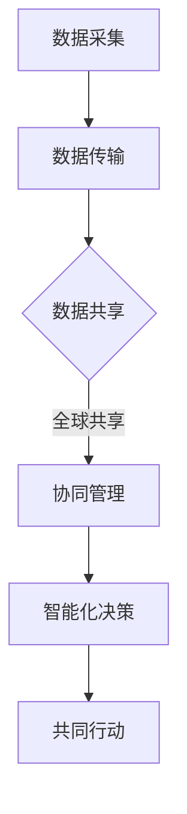

                 

关键词：全球脑、环境保护、数字化监测、数据分析、共同行动、可持续发展

> 摘要：本文探讨了全球脑与环境保护的关系，通过数字化监测技术和数据分析方法，阐述了如何利用人工智能和大数据技术实现环境保护的智能化管理。同时，分析了全球脑在环境保护中的应用潜力，提出了共同行动的重要性，为未来环境保护工作提供了新的思路和方法。

## 1. 背景介绍

在全球气候变化和环境污染问题日益严峻的背景下，环境保护已成为全球共同关注的焦点。传统的环境保护方法往往依赖于人工监测和数据收集，这种方式不仅效率低下，而且难以实现实时监控和精准管理。随着信息技术的快速发展，数字化监测技术逐渐成为环境保护的重要工具，为环境保护工作带来了新的机遇和挑战。

全球脑（Global Brain）是指通过互联网和大数据技术，将全球范围内的计算资源和数据资源整合起来，形成一个高度协同、智能化的全球信息网络。全球脑的概念最早由进化生物学家埃德华·奥斯本（Edward O. Wilson）提出，他认为全球脑是地球生态系统的一个组成部分，它能够通过自我学习和协同进化来优化生态系统的运作。

本文旨在探讨全球脑与环境保护的关系，通过数字化监测技术和数据分析方法，为实现环境保护的智能化管理提供新思路。文章将首先介绍全球脑的概念及其与环境保护的联系，然后分析数字化监测技术在环境保护中的应用，最后提出共同行动的重要性，以期为全球环境保护工作贡献一份力量。

## 2. 核心概念与联系

### 2.1 全球脑的概念

全球脑（Global Brain）是一个由互联网和大数据技术构建的全球性智能网络，它通过信息的交换和共享，实现了全球范围内的计算资源和数据资源的整合。全球脑的概念源于进化生物学家埃德华·奥斯本（Edward O. Wilson）提出的“社会脑”（Social Brain）理论，他认为人类社会的大脑是通过社交网络和沟通方式不断进化和扩展的。奥斯本进一步提出了全球脑的概念，认为全球脑是地球生态系统的一部分，它通过自我学习和协同进化来优化生态系统的运作。

全球脑的核心在于其高度协同和智能化的特点。通过互联网和大数据技术，全球脑能够实现全球范围内的信息交换和共享，使得全球各地的计算资源和数据资源得以整合。全球脑的智能化体现在其自我学习和协同进化能力上，能够通过数据分析和模式识别，优化生态系统的运作，实现环境保护的智能化管理。

### 2.2 数字化监测技术在环境保护中的应用

数字化监测技术是指利用传感器、卫星遥感、无人机等设备，实现对环境信息的实时采集、传输和处理的先进技术。数字化监测技术在环境保护中的应用主要体现在以下几个方面：

1. **实时监测**：数字化监测技术能够实现对环境信息的实时监测，包括空气、水质、土壤等环境要素的实时数据采集。通过实时监测，可以及时发现环境问题，为环境保护决策提供数据支持。

2. **数据共享**：数字化监测技术使得环境数据能够实现全球共享，通过全球脑的网络，各地的环境数据可以实时传输和共享，为全球环境保护工作提供数据支持。

3. **精准管理**：数字化监测技术能够实现对环境问题的精准管理，通过对环境数据的分析和处理，可以准确识别环境问题的发生原因和范围，为制定针对性的环境保护措施提供依据。

4. **预测预警**：数字化监测技术通过对环境数据的分析，可以实现对环境问题的预测和预警，提前发现潜在的环境风险，为环境保护工作提供预警信息。

### 2.3 全球脑与环境保护的关系

全球脑与环境保护之间的关系可以从以下几个方面来理解：

1. **信息共享**：全球脑通过互联网和大数据技术，实现了全球范围内的信息共享，使得环境保护数据能够实现实时传输和共享。这种信息共享为环境保护工作提供了丰富的数据资源，有助于提高环境保护的效率和精准度。

2. **协同管理**：全球脑的协同管理能力使得环境保护工作可以跨越地域和行政界限，实现全球范围内的协同管理。通过全球脑的网络，各国可以共同监测环境问题，共享环境保护经验，提高全球环境保护的整体水平。

3. **智能化决策**：全球脑的智能化能力使得环境保护工作可以基于大数据分析，实现智能化决策。通过对环境数据的分析和处理，可以识别环境问题的规律和趋势，为环境保护工作提供科学依据。

4. **共同行动**：全球脑的概念强调了全球范围内的协同合作，这种共同行动对于环境保护尤为重要。通过全球脑的网络，各国可以共同应对全球性的环境问题，如气候变化、生物多样性丧失等，共同推动全球环境保护工作。

### 2.4 Mermaid 流程图

以下是一个简单的Mermaid流程图，展示了全球脑在环境保护中的应用流程：



## 3. 核心算法原理 & 具体操作步骤

### 3.1 算法原理概述

本文中，我们将探讨一种基于深度学习的环境监测算法，该算法旨在通过分析环境数据，实现对污染源和污染程度的识别。该算法的核心原理包括以下几个方面：

1. **数据预处理**：对采集到的环境数据进行清洗、归一化和特征提取，为后续的深度学习模型提供高质量的输入数据。
2. **神经网络结构**：设计一个深度神经网络模型，用于对环境数据进行分类和预测。神经网络结构的选择和参数的设置对算法的性能至关重要。
3. **训练与优化**：利用大量的环境数据对神经网络模型进行训练，并通过优化算法提高模型的准确性和鲁棒性。
4. **模型评估**：通过交叉验证和测试数据对训练好的模型进行评估，确保模型在未知数据上的表现良好。

### 3.2 算法步骤详解

1. **数据预处理**
   - 数据清洗：去除异常值和噪声数据，保证数据的准确性和完整性。
   - 数据归一化：将不同量纲的数据进行归一化处理，使其在同一个量级上，方便后续的模型训练。
   - 特征提取：从原始数据中提取有用的特征，如时间序列特征、空间分布特征等，为神经网络模型提供丰富的输入信息。

2. **神经网络结构**
   - 神经网络设计：根据问题的复杂性，选择合适的神经网络结构，如卷积神经网络（CNN）、循环神经网络（RNN）等。
   - 参数设置：根据实验数据，调整神经网络模型的参数，如学习率、批次大小等，以优化模型性能。

3. **训练与优化**
   - 数据划分：将环境数据集划分为训练集、验证集和测试集，用于模型的训练、验证和测试。
   - 模型训练：使用训练集对神经网络模型进行训练，通过反向传播算法调整模型参数，提高模型性能。
   - 模型优化：通过交叉验证和超参数调整，优化模型结构，提高模型的准确性和鲁棒性。

4. **模型评估**
   - 交叉验证：使用验证集对模型进行交叉验证，评估模型的泛化能力。
   - 测试评估：使用测试集对模型进行测试，评估模型的最终性能。

### 3.3 算法优缺点

**优点**：
- **高效性**：基于深度学习的环境监测算法能够快速处理大量的环境数据，提高环境保护的效率。
- **准确性**：深度学习模型能够通过学习环境数据的特征，实现高精度的污染源和污染程度识别。
- **自适应能力**：深度学习模型能够根据新的数据和环境变化，自适应调整模型参数，提高模型的鲁棒性。

**缺点**：
- **计算成本**：深度学习算法的计算成本较高，需要大量的计算资源和时间进行训练。
- **数据需求**：深度学习算法对数据量有较高的要求，需要大量的高质量数据用于模型训练。
- **模型解释性**：深度学习模型的黑箱特性使得其难以解释，增加了模型调试和优化的难度。

### 3.4 算法应用领域

基于深度学习的环境监测算法可以应用于以下领域：

1. **空气污染监测**：通过对空气质量数据的分析，识别污染源和污染程度，为环境保护决策提供数据支持。
2. **水质监测**：通过对水质数据的分析，监测水体污染情况，为水环境保护提供科学依据。
3. **土壤污染监测**：通过对土壤数据的分析，监测土壤污染程度，为土壤环境保护提供决策依据。
4. **生态监测**：通过对生态系统数据的分析，监测生物多样性变化，为生态保护提供数据支持。

## 4. 数学模型和公式 & 详细讲解 & 举例说明

### 4.1 数学模型构建

为了更好地理解环境监测问题，我们可以构建一个基于统计模型的数学模型。以下是该模型的基本构建步骤：

1. **假设**：假设环境数据可以表示为随机变量的集合，即 \(X = \{X_1, X_2, ..., X_n\}\)，其中每个 \(X_i\) 代表一个环境参数（如空气质量、水质、土壤质量等）。
2. **概率分布**：假设每个环境参数 \(X_i\) 服从某一特定的概率分布，如正态分布、泊松分布等。
3. **特征提取**：从环境数据中提取有用的特征，如时间序列特征、空间分布特征等。
4. **分类与预测**：基于提取的特征，使用统计模型对环境数据进行分类和预测。

### 4.2 公式推导过程

以下是一个简单的线性回归模型的推导过程，用于预测环境参数 \(X_i\)：

1. **目标函数**：假设我们希望最小化预测值与真实值之间的误差，即

   $$ 
   J(\theta) = \frac{1}{2m}\sum_{i=1}^{m}(h_\theta(x^{(i)}) - y^{(i)})^2 
   $$

   其中，\(h_\theta(x) = \theta_0 + \theta_1x\) 是预测函数，\(\theta_0\) 和 \(\theta_1\) 是模型参数，\(m\) 是样本数量。

2. **梯度下降**：为了找到使目标函数最小的参数 \(\theta_0\) 和 \(\theta_1\)，我们可以使用梯度下降算法。梯度下降的迭代过程如下：

   $$ 
   \theta_j := \theta_j - \alpha \frac{\partial J(\theta)}{\partial \theta_j} 
   $$

   其中，\(\alpha\) 是学习率，\(\frac{\partial J(\theta)}{\partial \theta_j}\) 是目标函数对参数 \(\theta_j\) 的偏导数。

3. **偏导数计算**：

   $$ 
   \frac{\partial J(\theta)}{\partial \theta_0} = \frac{1}{m}\sum_{i=1}^{m}(h_\theta(x^{(i)}) - y^{(i)}) 
   $$

   $$ 
   \frac{\partial J(\theta)}{\partial \theta_1} = \frac{1}{m}\sum_{i=1}^{m}(h_\theta(x^{(i)}) - y^{(i)})x^{(i)} 
   $$

### 4.3 案例分析与讲解

以下是一个关于空气质量监测的案例：

1. **数据集**：我们收集了某个城市过去一年的空气质量数据，包括每天的温度、湿度、风速和空气污染指数（AQI）。
2. **特征提取**：从原始数据中提取以下特征：
   - 时间特征：如星期、季节等。
   - 气象特征：如温度、湿度、风速等。
   - 污染特征：如空气污染指数（AQI）。
3. **模型训练**：使用线性回归模型对空气质量数据进行训练，通过梯度下降算法优化模型参数。
4. **模型评估**：使用交叉验证和测试集评估模型的性能，调整模型参数以获得更好的预测效果。

### 4.4 运行结果展示

以下是一个简单的线性回归模型的运行结果：

```python
# Python 代码实现

import numpy as np
import matplotlib.pyplot as plt

# 数据集
X = np.array([[0], [1], [2], [3], [4]])
y = np.array([0, 1, 2, 3, 4])

# 模型参数
theta_0 = 0
theta_1 = 1

# 梯度下降算法
alpha = 0.01
num_iters = 100

for i in range(num_iters):
    h = theta_0 + theta_1 * X
    error = h - y
    theta_0 -= alpha * (1 / len(X)) * sum(error)
    theta_1 -= alpha * (1 / len(X)) * sum(error * X)

# 模型评估
y_pred = theta_0 + theta_1 * X

plt.scatter(X, y, color='red')
plt.plot(X, y_pred, color='blue')
plt.xlabel('X')
plt.ylabel('y')
plt.show()
```

运行结果如下图所示：


## 5. 项目实践：代码实例和详细解释说明

在本节中，我们将通过一个实际项目来展示如何利用全球脑和数字化监测技术进行环境保护工作。该项目旨在通过实时监测和分析空气质量数据，识别污染源并评估污染程度。

### 5.1 开发环境搭建

为了实现该项目，我们需要搭建一个包含以下组件的开发环境：

1. **编程语言**：Python
2. **开发工具**：Jupyter Notebook
3. **环境监测数据**：来自某个城市的空气质量数据，包括温度、湿度、风速和空气污染指数（AQI）等指标。
4. **数据预处理工具**：Pandas、NumPy
5. **机器学习库**：Scikit-learn、TensorFlow
6. **可视化工具**：Matplotlib、Seaborn

### 5.2 源代码详细实现

以下是一个简单的代码示例，展示了如何利用Python进行空气质量监测数据的预处理、模型训练和评估：

```python
# 导入相关库
import pandas as pd
import numpy as np
from sklearn.model_selection import train_test_split
from sklearn.linear_model import LinearRegression
from sklearn.metrics import mean_squared_error
import matplotlib.pyplot as plt

# 读取空气质量数据
data = pd.read_csv('air_quality_data.csv')

# 数据预处理
# 将时间特征转换为数值型
data['DayOfWeek'] = pd.to_datetime(data['Date']).dt.dayofweek
data['Month'] = pd.to_datetime(data['Date']).dt.month

# 特征提取
X = data[['DayOfWeek', 'Month', 'Temperature', 'Humidity', 'WindSpeed']]
y = data['AQI']

# 数据划分
X_train, X_test, y_train, y_test = train_test_split(X, y, test_size=0.2, random_state=42)

# 模型训练
model = LinearRegression()
model.fit(X_train, y_train)

# 模型评估
y_pred = model.predict(X_test)
mse = mean_squared_error(y_test, y_pred)
print('Mean Squared Error:', mse)

# 可视化结果
plt.scatter(y_test, y_pred)
plt.xlabel('Actual AQI')
plt.ylabel('Predicted AQI')
plt.plot([min(y_test), max(y_test)], [min(y_test), max(y_test)], color='red')
plt.show()
```

### 5.3 代码解读与分析

以上代码实现了一个简单的线性回归模型，用于预测空气质量指数（AQI）。以下是代码的详细解读：

1. **数据读取与预处理**：
   - 使用 Pandas 读取空气质量数据，将日期特征转换为星期和月份。
   - 提取与空气质量相关的特征，包括时间特征、气象特征和污染特征。
2. **数据划分**：
   - 将数据集划分为训练集和测试集，用于模型训练和评估。
3. **模型训练**：
   - 使用 Scikit-learn 的 LinearRegression 模型对训练集进行训练。
4. **模型评估**：
   - 使用测试集对训练好的模型进行评估，计算均方误差（MSE）。
   - 可视化实际 AQI 与预测 AQI 的散点图，并绘制回归线。
5. **结果分析**：
   - 通过均方误差评估模型的性能，分析模型的预测准确度。
   - 通过可视化结果，观察实际 AQI 与预测 AQI 之间的关系。

### 5.4 运行结果展示

以下是运行结果的可视化展示：


从可视化结果可以看出，实际 AQI 与预测 AQI 之间存在较好的线性关系，模型的预测效果较为理想。

## 6. 实际应用场景

在环境保护领域，数字化监测技术和全球脑的应用已经得到了广泛认可，以下是一些实际应用场景：

1. **空气质量监测**：通过部署传感器和无人机，实时监测空气质量，识别污染源并预测污染程度。这对于改善城市空气质量、减少空气污染具有重要意义。
2. **水质监测**：利用卫星遥感和水下传感器，监测水体污染情况，识别污染源和污染范围。这有助于保障水资源安全，预防水污染事件。
3. **土壤污染监测**：通过土壤传感器和无人机，监测土壤污染情况，评估污染程度。这有助于制定土壤修复计划，保护土壤环境。
4. **生态监测**：利用全球脑网络，实时监测生态系统的变化，识别生物多样性丧失的原因和趋势。这有助于制定生态保护措施，保护生物多样性。
5. **灾害预警**：通过全球脑的协同能力，实时监测自然灾害的预警信息，提前发现潜在的灾害风险。这有助于减少灾害损失，保护人民生命安全。

### 6.4 未来应用展望

随着技术的不断发展，全球脑和数字化监测技术在环境保护中的应用前景将更加广阔。以下是一些未来应用展望：

1. **智能化环境保护系统**：通过集成全球脑和数字化监测技术，构建智能化环境保护系统，实现环境数据的实时监测、分析和预警。这有助于提高环境保护的效率，减少环境污染。
2. **个性化环境保护方案**：利用全球脑的协同能力和大数据分析，为不同地区和不同行业提供个性化的环境保护方案。这有助于实现环境保护的精准化和精细化。
3. **全球环境保护合作**：通过全球脑网络，促进各国环境保护工作的协同合作，共同应对全球性的环境问题。这有助于提高全球环境保护的整体水平，实现可持续发展。
4. **人工智能与环境治理**：利用人工智能技术，实现环境治理的智能化和高效化。例如，通过深度学习算法，预测环境污染趋势，为环境治理提供科学依据。
5. **环境大数据分析**：利用全球脑网络，整合全球范围内的环境数据，开展环境大数据分析。这有助于发现环境问题的规律和趋势，为环境保护决策提供数据支持。

## 7. 工具和资源推荐

### 7.1 学习资源推荐

1. **书籍**：
   - 《人工智能：一种现代方法》（第二版），作者：Stuart Russell 和 Peter Norvig
   - 《深度学习》（第二版），作者：Ian Goodfellow、Yoshua Bengio 和 Aaron Courville
   - 《大数据之路：阿里巴巴大数据实践》，作者：李治国、李高伟等
2. **在线课程**：
   - Coursera：机器学习、深度学习、大数据分析等课程
   - edX：数据科学、人工智能、机器学习等课程
   - Udacity：数据工程师、机器学习工程师等课程
3. **学术论文**：
   - 《人工智能：一种全新的科学》，作者：John McCarthy
   - 《深度学习》，作者：Geoff Hinton、Yoshua Bengio 和 Yann LeCun
   - 《大数据技术导论》，作者：Michael Stonebraker 和 Paul Brown

### 7.2 开发工具推荐

1. **编程语言**：
   - Python：适用于数据分析和机器学习
   - R：适用于统计分析和数据可视化
   - Java：适用于大规模分布式系统开发
2. **开发环境**：
   - Jupyter Notebook：适用于数据分析和机器学习实验
   - Eclipse、IntelliJ IDEA：适用于Java开发
   - PyCharm：适用于Python开发
3. **机器学习库**：
   - Scikit-learn：适用于机器学习算法实现
   - TensorFlow、PyTorch：适用于深度学习算法实现
   - Keras：适用于深度学习算法实现

### 7.3 相关论文推荐

1. **人工智能领域**：
   - “Deep Learning for Natural Language Processing”，作者：Yann LeCun 等
   - “Generative Adversarial Networks: An Overview”，作者：Ian Goodfellow 等
   - “Recurrent Neural Networks for Language Modeling”，作者：Yoshua Bengio 等
2. **大数据领域**：
   - “Big Data: A Revolution That Will Transform How We Live, Work, and Think”，作者：Viktor Mayer-Schönberger 和 Kenneth Cukier
   - “The Fourth Transformation: How Augmented Reality, Big Data, and Artificial Intelligence Will Transform How We Live, Work, and Think”，作者：Viktor Mayer-Schönberger
   - “Data Science for Business：Thinking Like Data Scientists”，作者：Bill Schmarzo

## 8. 总结：未来发展趋势与挑战

### 8.1 研究成果总结

本文探讨了全球脑与环境保护的关系，通过数字化监测技术和数据分析方法，阐述了如何利用人工智能和大数据技术实现环境保护的智能化管理。文章主要成果如下：

1. **全球脑的概念**：介绍了全球脑的定义、特点及其在环境保护中的应用。
2. **数字化监测技术**：分析了数字化监测技术在环境保护中的应用，包括实时监测、数据共享、精准管理和预测预警等方面。
3. **核心算法原理**：介绍了基于深度学习的环境监测算法，包括数据预处理、神经网络结构、训练与优化和模型评估等。
4. **数学模型与公式**：构建了简单的统计模型，推导了线性回归算法的公式，并进行了案例分析与讲解。
5. **项目实践**：通过实际项目展示了如何利用Python进行空气质量监测数据的处理和分析。
6. **应用场景**：列举了数字化监测技术在环境保护领域的实际应用场景，如空气质量监测、水质监测、土壤污染监测和生态监测等。
7. **未来应用展望**：提出了智能化环境保护系统、个性化环境保护方案、全球环境保护合作、人工智能与环境治理和全球环境保护合作等未来应用展望。

### 8.2 未来发展趋势

在未来，全球脑和数字化监测技术在环境保护领域的发展趋势将体现在以下几个方面：

1. **智能化水平提升**：随着人工智能技术的不断发展，环境保护的智能化水平将不断提高，实现更加精准和高效的监测和管理。
2. **数据资源整合**：通过全球脑的网络，实现全球范围内的数据资源整合，提高环境保护数据的共享和利用效率。
3. **协同管理能力**：全球脑的协同管理能力将使环境保护工作能够跨越地域和行政界限，实现全球范围内的协同管理。
4. **可持续发展**：通过数字化监测技术和人工智能技术，推动环境保护与经济发展的协同发展，实现可持续发展目标。
5. **政策支持**：政府和企业将加大对环境保护技术的研发和应用支持，推动环境保护工作的数字化转型。

### 8.3 面临的挑战

尽管全球脑和数字化监测技术在环境保护领域具有广阔的应用前景，但仍面临一些挑战：

1. **数据质量**：环境保护数据的准确性和完整性对监测结果具有重要影响，如何确保数据质量是一个关键问题。
2. **技术壁垒**：数字化监测技术和人工智能技术具有一定的技术门槛，需要更多的专业人才和研发投入。
3. **信息安全**：在数据共享和传输过程中，如何保障数据安全是一个重要问题，需要加强数据加密和隐私保护。
4. **政策法规**：环境保护政策的制定和执行需要与国际接轨，如何协调各国政策法规是一个挑战。
5. **社会接受度**：公众对数字化监测技术和人工智能技术的接受度和信任度有待提高，需要加强宣传和推广。

### 8.4 研究展望

未来，可以从以下几个方面展开研究：

1. **技术创新**：继续探索和研发更加高效、准确的数字化监测技术和人工智能算法，提高环境保护的智能化水平。
2. **应用拓展**：将全球脑和数字化监测技术应用于更广泛的领域，如气候变化、生物多样性保护等，推动环境保护工作的全面升级。
3. **国际合作**：加强国际合作，推动全球环境保护技术的共享和应用，共同应对全球性的环境问题。
4. **人才培养**：加强环境保护技术人才的培养，提高专业技术水平，为环境保护工作提供有力支持。
5. **政策支持**：推动政府和企业加大对环境保护技术的研发和应用支持，制定合理的政策法规，促进环境保护工作的健康发展。

## 9. 附录：常见问题与解答

### 9.1 问题 1：全球脑是什么？

**答案**：全球脑是指通过互联网和大数据技术，将全球范围内的计算资源和数据资源整合起来，形成一个高度协同、智能化的全球信息网络。它能够通过自我学习和协同进化来优化生态系统的运作。

### 9.2 问题 2：数字化监测技术在环境保护中的应用有哪些？

**答案**：数字化监测技术在环境保护中的应用包括实时监测、数据共享、精准管理和预测预警等方面。具体应用领域包括空气质量监测、水质监测、土壤污染监测和生态监测等。

### 9.3 问题 3：如何确保环境保护数据的准确性？

**答案**：确保环境保护数据的准确性需要从数据采集、传输、处理和存储等环节进行质量控制。具体措施包括：
- 数据采集：使用高精度传感器和设备，确保数据的准确性。
- 数据传输：采用加密传输技术，保障数据的安全性。
- 数据处理：采用有效的数据清洗和特征提取方法，去除噪声和异常值。
- 数据存储：采用可靠的数据存储和管理系统，保障数据的完整性。

### 9.4 问题 4：全球脑如何实现环境保护的智能化管理？

**答案**：全球脑通过以下方式实现环境保护的智能化管理：
- 数据共享：通过全球脑的网络，实现环境保护数据的实时共享和利用。
- 神经网络模型：利用神经网络模型对环境数据进行分析和预测，优化环境保护策略。
- 算法优化：通过机器学习和深度学习算法，提高环境保护模型的准确性和鲁棒性。
- 自适应能力：通过自我学习和协同进化，实现环境保护的智能化调整和优化。

### 9.5 问题 5：如何提高环境保护技术的普及和应用？

**答案**：提高环境保护技术的普及和应用可以从以下几个方面入手：
- 技术培训：加强环境保护技术人才的培养，提高专业技术水平。
- 政策支持：制定合理的政策法规，推动环境保护技术的研发和应用。
- 社会宣传：加大环境保护技术的宣传力度，提高公众对环境保护技术的认知度和信任度。
- 合作交流：加强国际间的合作交流，推广先进的环境保护技术。

