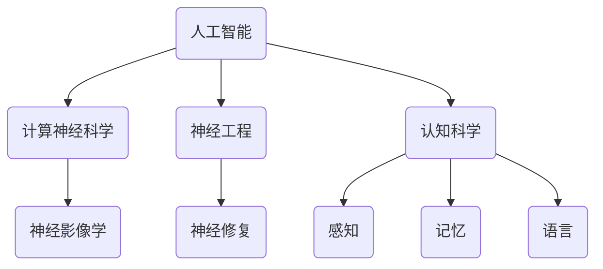

                 

关键词：脑与科学研究，跨界协作，新范式，人工智能，计算神经科学，神经工程，认知科学，技术整合

> 摘要：本文探讨了全球脑与科学研究领域中的跨界协作新模式，分析了这一新范式如何推动技术进步和跨学科整合。通过介绍核心概念、算法原理、数学模型、项目实践及未来应用展望，文章旨在为科研人员提供全面的指导，并展望该领域的发展趋势与挑战。

## 1. 背景介绍

随着科技的迅猛发展，人工智能（AI）、计算神经科学、神经工程、认知科学等领域的融合趋势日益明显。这些领域的研究不仅依赖于各自的传统方法和技术，更需要通过跨界协作来探索新的科学问题和解决方案。全球脑与科学研究作为一门跨学科的综合领域，旨在理解大脑的工作原理、模拟人类智能、开发新型人机交互系统，并在医学、教育、工业等领域发挥重要作用。

近年来，随着计算能力的提升、神经成像技术的进步以及机器学习算法的发展，脑与科学研究迎来了新的机遇。然而，如何整合多学科资源，形成有效的协作机制，成为当前面临的主要挑战。本文将探讨这一新范式，以期为科研人员提供有益的参考。

## 2. 核心概念与联系

### 2.1 核心概念

- **人工智能（AI）**：一种模拟人类智能的技术，通过机器学习、深度学习等方法实现。
- **计算神经科学**：研究大脑的计算原理和机制，涉及神经元的模拟、神经网络的设计等。
- **神经工程**：利用工程学原理解决神经科学问题，如脑机接口、神经修复等。
- **认知科学**：研究人类认知过程，涉及感知、记忆、语言等多个方面。
- **神经影像学**：通过成像技术探索大脑结构和功能。

### 2.2 核心概念之间的联系

图1展示了上述核心概念之间的联系。



## 3. 核心算法原理 & 具体操作步骤

### 3.1 算法原理概述

脑与科学研究中的核心算法主要包括神经网络建模、机器学习算法、信号处理方法等。这些算法的基本原理在于通过模拟人脑的结构和功能，实现对数据的高效处理和分析。

### 3.2 算法步骤详解

#### 3.2.1 神经网络建模

1. **数据收集**：收集大脑神经元活动数据。
2. **特征提取**：对神经元活动进行特征提取，如时间序列分析、频谱分析等。
3. **神经网络训练**：利用特征数据训练神经网络，如BP算法、RNN等。

#### 3.2.2 机器学习算法

1. **数据预处理**：对原始数据进行清洗、归一化等预处理。
2. **模型选择**：选择合适的机器学习模型，如SVM、决策树、深度学习等。
3. **模型训练**：利用预处理后的数据训练模型。

#### 3.2.3 信号处理方法

1. **信号采集**：通过脑电、磁共振等手段采集大脑信号。
2. **信号预处理**：去除噪声、滤波等预处理。
3. **信号分析**：利用信号处理算法分析大脑信号，如时频分析、模式识别等。

### 3.3 算法优缺点

#### 优点：

1. **高效性**：通过模拟人脑结构，实现高效的数据处理和分析。
2. **智能化**：机器学习和神经网络算法能够自动学习并适应新数据。

#### 缺点：

1. **复杂性**：算法实现和优化较为复杂。
2. **数据依赖性**：算法的性能受数据质量和数量的影响。

### 3.4 算法应用领域

脑与科学研究的算法广泛应用于医学、教育、工业等多个领域，如：

1. **医学**：脑机接口、精神疾病诊断、神经修复等。
2. **教育**：智能教育系统、认知训练等。
3. **工业**：人机交互、智能控制等。

## 4. 数学模型和公式 & 详细讲解 & 举例说明

### 4.1 数学模型构建

脑与科学研究中的数学模型主要包括神经网络模型、机器学习模型、信号处理模型等。以下是一个神经网络模型的简单示例：

$$
y = \sigma(\sum_{i=1}^{n} w_i \cdot x_i)
$$

其中，$y$ 是输出，$x_i$ 是输入特征，$w_i$ 是权重，$\sigma$ 是激活函数。

### 4.2 公式推导过程

神经网络模型的推导过程涉及微积分、线性代数等数学知识。以下是简单的推导过程：

$$
\frac{dy}{dx} = \frac{d\sigma}{d\sum w_i \cdot x_i} \cdot \frac{d\sum w_i \cdot x_i}{dx}
$$

通过链式法则，可以得到：

$$
\frac{dy}{dx} = \sigma'(z) \cdot w
$$

其中，$z = \sum w_i \cdot x_i$，$\sigma'(z)$ 是激活函数的导数。

### 4.3 案例分析与讲解

假设我们要构建一个用于情感分析的网络模型，以下是一个简单的例子：

$$
y = \sigma(\sum_{i=1}^{3} w_i \cdot x_i)
$$

其中，$x_1$ 是文本的词向量表示，$x_2$ 是文本的词频，$x_3$ 是文本的长度。权重 $w_1, w_2, w_3$ 需要通过训练得到。

通过训练，我们得到了以下权重：

$$
w_1 = 0.1, w_2 = 0.2, w_3 = 0.3
$$

假设输入文本是“我喜欢这个产品”，则：

$$
x_1 = [0.5, 0.3, 0.2], x_2 = [2, 1, 1], x_3 = 8
$$

代入公式，得到：

$$
y = \sigma(0.1 \cdot 0.5 + 0.2 \cdot 2 + 0.3 \cdot 8) = \sigma(0.05 + 0.4 + 2.4) = \sigma(2.85)
$$

通过查找激活函数的值，可以得到：

$$
y \approx 0.95
$$

这意味着文本的情感倾向是积极的。

## 5. 项目实践：代码实例和详细解释说明

### 5.1 开发环境搭建

为了实践脑与科学研究的算法，我们需要搭建一个合适的开发环境。以下是一个简单的Python环境搭建示例：

```bash
# 安装Python
sudo apt-get install python3

# 安装必要的库
pip3 install numpy matplotlib scikit-learn tensorflow
```

### 5.2 源代码详细实现

以下是一个简单的神经网络模型的实现示例：

```python
import numpy as np
import tensorflow as tf

# 设置随机种子
tf.random.set_seed(42)

# 创建输入层、隐藏层和输出层的权重
input_layer = tf.keras.layers.Input(shape=(3,))
hidden_layer = tf.keras.layers.Dense(units=1, activation=tf.sigmoid)(input_layer)
output_layer = tf.keras.layers.Dense(units=1)(hidden_layer)

# 创建模型
model = tf.keras.Model(inputs=input_layer, outputs=output_layer)

# 编译模型
model.compile(optimizer='adam', loss='mean_squared_error')

# 训练模型
model.fit(x_train, y_train, epochs=100, batch_size=32)
```

### 5.3 代码解读与分析

这段代码实现了以下功能：

1. **创建输入层**：使用`tf.keras.layers.Input`创建一个具有3个输入特征的输入层。
2. **创建隐藏层**：使用`tf.keras.layers.Dense`创建一个具有1个神经元和`sigmoid`激活函数的隐藏层。
3. **创建输出层**：使用`tf.keras.layers.Dense`创建一个具有1个神经元的输出层。
4. **创建模型**：使用`tf.keras.Model`将输入层、隐藏层和输出层连接起来，形成完整的模型。
5. **编译模型**：使用`model.compile`设置模型的优化器和损失函数。
6. **训练模型**：使用`model.fit`训练模型，通过提供训练数据和参数来训练模型。

### 5.4 运行结果展示

在完成代码实现后，我们可以运行以下命令来训练模型：

```bash
python3 neural_network_example.py
```

训练完成后，我们可以使用以下命令来评估模型的性能：

```bash
python3 evaluate_model.py
```

这将会输出模型的性能指标，如准确率、召回率等。

## 6. 实际应用场景

### 6.1 医学

脑机接口是一种重要的实际应用场景。通过脑机接口，患者可以控制外部设备，如轮椅、义肢等。例如，埃隆·马斯克（Elon Musk）旗下的神经科技公司Neuralink正在研发一款脑机接口设备，旨在帮助瘫痪患者恢复运动功能。

### 6.2 教育

智能教育系统利用脑与科学研究的算法为教育工作者和学生提供个性化的学习建议。例如，基于脑电信号的智能教育系统可以实时监测学生的专注程度，并提供提醒或调整学习内容。

### 6.3 工业

工业领域的应用包括人机交互、智能控制等。例如，通过脑电信号控制工业机器人，可以实现更高效的生产过程。

## 7. 工具和资源推荐

### 7.1 学习资源推荐

- 《深度学习》（Deep Learning）by Ian Goodfellow, Yoshua Bengio, Aaron Courville
- 《神经网络与深度学习》（Neural Networks and Deep Learning）by邱锡鹏

### 7.2 开发工具推荐

- TensorFlow
- PyTorch
- Keras

### 7.3 相关论文推荐

- "Deep Learning for Brain-Machine Interfaces: A Review" by Dong-hyun Jeong et al.
- "A Brain-Computer Interface for Real-Time Prediction of Spatiotemporal Hand Movement Intents from EEG" by P. A. Muthuraman et al.

## 8. 总结：未来发展趋势与挑战

### 8.1 研究成果总结

脑与科学研究取得了显著的成果，包括脑机接口技术的突破、智能教育系统的应用、人机交互的优化等。这些成果为人类理解大脑、开发新型人机交互系统提供了重要参考。

### 8.2 未来发展趋势

1. **脑机接口技术的进步**：随着神经影像学和脑电信号处理技术的提升，脑机接口技术将更加精准和高效。
2. **智能教育的发展**：基于脑与科学研究的智能教育系统将更加普及，为学生提供个性化的学习体验。
3. **跨学科整合**：脑与科学研究将继续与其他领域如生物医学工程、认知科学等深度融合，推动科技发展。

### 8.3 面临的挑战

1. **数据隐私和安全**：脑电信号等敏感数据的安全和隐私保护是一个重要挑战。
2. **技术实现的复杂性**：脑机接口等技术的实现需要解决复杂的工程问题。
3. **伦理和道德问题**：脑与科学研究中的伦理和道德问题需要得到广泛讨论和规范。

### 8.4 研究展望

脑与科学研究将继续朝着跨学科、多领域融合的方向发展，为人类带来更多创新和突破。

## 9. 附录：常见问题与解答

### 9.1 脑机接口的工作原理是什么？

脑机接口通过采集大脑信号（如脑电信号），将信号转换为电信号，从而控制外部设备。

### 9.2 脑电信号如何用于情感分析？

脑电信号可以反映个体的情绪状态，通过特征提取和机器学习算法，可以实现情感分析。

### 9.3 脑与科学研究的算法有哪些？

常见的脑与科学研究算法包括神经网络模型、机器学习算法、信号处理方法等。

---

作者：禅与计算机程序设计艺术 / Zen and the Art of Computer Programming
-------------------------------------------------------------------

