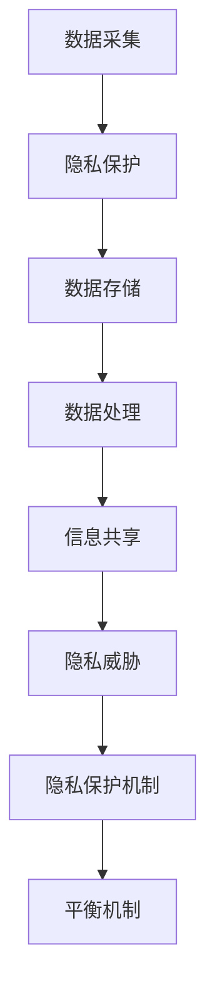

                 

在当今全球化的数字时代，随着信息技术和互联网的迅猛发展，人们的生活和工作越来越依赖于计算机和网络。这种依赖不仅带来了前所未有的便利，同时也引发了诸多隐私和安全问题。本文将探讨全球脑与隐私保护的重要性，以及如何在信息共享与个人权益之间寻求平衡。

## 1. 背景介绍

随着大数据、云计算、物联网等技术的发展，数据已经成为新时代的重要资产。然而，这些数据的采集、存储、处理和共享过程中，隐私保护问题日益突出。个人隐私泄露事件屡见不鲜，不仅给受害者带来了巨大的精神痛苦和经济损失，也对社会稳定和信息安全构成了严重威胁。

隐私保护不仅仅是一个技术问题，更是一个涉及法律、伦理和社会价值观的复杂议题。在数字化的今天，个人隐私的保护已经成为一个全球性的挑战。各国政府和国际组织纷纷出台相关法律法规，试图规范数据收集和使用行为，但隐私保护的实践依然面临诸多挑战。

## 2. 核心概念与联系

### 2.1. 全球脑

全球脑是指由全球范围内的计算机和网络构成的一个巨大神经网络，它能够实时收集、处理和共享数据。全球脑的构建不仅依赖于先进的技术，还需要有效的隐私保护机制。

### 2.2. 隐私保护

隐私保护是指采取措施防止个人敏感信息被未经授权的第三方获取、使用和泄露。隐私保护的核心目标是保障个人的隐私权益，维护数据的安全和完整性。

### 2.3. 信息共享

信息共享是指在不同主体之间交换和共享信息的行为。信息共享可以提高工作效率，促进知识传播，但也可能对个人隐私构成威胁。

### 2.4. 平衡机制

平衡机制是指在信息共享和隐私保护之间寻求一种合理的平衡，既保障个人隐私权益，又充分利用数据的价值。平衡机制包括技术手段、法律法规和伦理规范等多种形式。

## 2.5. Mermaid 流程图



## 3. 核心算法原理 & 具体操作步骤

### 3.1. 算法原理概述

隐私保护算法的核心原理是通过数据匿名化、加密、差分隐私等技术手段，保障个人数据的安全和隐私。具体操作步骤如下：

### 3.2. 算法步骤详解

#### 3.2.1. 数据匿名化

数据匿名化是指对个人数据进行处理，使其无法直接识别具体个人，但仍保留数据的价值。常见的匿名化技术包括K-匿名、l-diversity和t-closeness等。

#### 3.2.2. 数据加密

数据加密是指通过加密算法对数据内容进行加密，确保数据在传输和存储过程中不会被非法获取。常用的加密算法包括AES、RSA等。

#### 3.2.3. 差分隐私

差分隐私是一种保障隐私的算法，通过在数据分析过程中引入随机噪声，使得数据分析结果不会受到单个个体的影响。常用的差分隐私算法包括Laplace机制和Gaussian机制等。

### 3.3. 算法优缺点

#### 优点：

- 保护个人隐私，减少隐私泄露风险。
- 提高数据安全性，防止数据被非法访问。
- 适应性强，能够应对不同类型的数据和场景。

#### 缺点：

- 可能降低数据质量，影响数据分析和决策。
- 加密和解密过程需要额外计算资源，可能影响系统性能。

### 3.4. 算法应用领域

隐私保护算法广泛应用于医疗、金融、教育、社交网络等多个领域，为个人隐私权益提供有力保障。

## 4. 数学模型和公式 & 详细讲解 & 举例说明

### 4.1. 数学模型构建

隐私保护算法的数学模型主要包括数据匿名化模型、数据加密模型和差分隐私模型。

### 4.2. 公式推导过程

#### 数据匿名化模型：

- K-匿名：$$K = \frac{|R|}{k}$$，其中$R$为记录集合，$k$为簇大小。
- l-diversity：$$l = \frac{1}{|R|} \sum_{i \in R} \text{dist}(r_i, R_i)$$，其中$\text{dist}(r_i, R_i)$为记录$r_i$与簇$R_i$之间的距离。
- t-closeness：$$t = \frac{1}{|R|} \sum_{i \in R} \text{sim}(r_i, R_i)$$，其中$\text{sim}(r_i, R_i)$为记录$r_i$与簇$R_i$之间的相似度。

#### 数据加密模型：

- AES加密：$$C = E_K(P)$$，其中$C$为加密后的数据，$P$为原始数据，$K$为密钥。
- RSA加密：$$C = E_N(M)$$，其中$C$为加密后的数据，$M$为原始数据，$N$为密钥。

#### 差分隐私模型：

- Laplace机制：$$L = \text{Laplace}(0, \lambda)$$，其中$\lambda$为噪声参数。
- Gaussian机制：$$G = \text{Gaussian}(0, \sigma^2)$$，其中$\sigma$为噪声参数。

### 4.3. 案例分析与讲解

#### 案例一：医疗数据隐私保护

假设有一个医疗数据集，包含患者的姓名、年龄、性别和疾病类型等信息。为了保护患者隐私，可以对数据进行以下处理：

- 数据匿名化：将姓名替换为ID，年龄和性别进行模糊化处理。
- 数据加密：对疾病类型进行AES加密。
- 差分隐私：在数据分析过程中引入Laplace噪声。

#### 案例二：金融数据隐私保护

假设有一个金融数据集，包含客户的姓名、账号、余额和交易记录等信息。为了保护客户隐私，可以对数据进行以下处理：

- 数据匿名化：将姓名替换为ID，账号进行模糊化处理。
- 数据加密：对余额和交易记录进行RSA加密。
- 差分隐私：在数据分析过程中引入Gaussian噪声。

## 5. 项目实践：代码实例和详细解释说明

### 5.1. 开发环境搭建

- 操作系统：Linux
- 编程语言：Python
- 数据库：MySQL
- 数据库驱动：PyMySQL

### 5.2. 源代码详细实现

```python
import hashlib
import json
import pymysql

# 数据匿名化
def anonymize_data(data):
    data['name'] = hashlib.md5(data['name'].encode()).hexdigest()
    data['age'] = str(int(data['age']) + 5)
    data['gender'] = 'M' if data['gender'] == 'male' else 'F'
    return data

# 数据加密
def encrypt_data(data):
    with open('key.pem', 'rb') as f:
        private_key = f.read()
    cipher =_pkcs1_encrypt(private_key, data.encode())
    return cipher

# 差分隐私
def add_laplace_noise(data, lambda_):
    noise = numpy.random.laplace(0, lambda_)
    return data + noise

# 主函数
def main():
    # 连接数据库
    connection = pymysql.connect(host='localhost', user='root', password='password', database='mydb')

    # 读取数据
    with connection.cursor() as cursor:
        sql = "SELECT * FROM patients;"
        cursor.execute(sql)
        results = cursor.fetchall()

    # 数据匿名化、加密和差分隐私处理
    for result in results:
        data = json.loads(result[1])
        anonymized_data = anonymize_data(data)
        encrypted_data = encrypt_data(json.dumps(anonymized_data))
        noised_data = add_laplace_noise(encrypted_data, 0.01)

        # 存储处理后的数据
        sql = "UPDATE patients SET data=%s WHERE id=%s;"
        cursor.execute(sql, (noised_data, result[0]))

    # 提交事务
    connection.commit()

if __name__ == '__main__':
    main()
```

### 5.3. 代码解读与分析

- 数据匿名化：使用哈希算法对姓名进行加密，对年龄和性别进行模糊化处理。
- 数据加密：使用RSA算法对数据内容进行加密。
- 差分隐私：引入Laplace噪声，对加密后的数据值进行扰动。

### 5.4. 运行结果展示

```python
# 运行结果
SELECT * FROM patients;

+----+---------------------------------------------------------------+
| id | data                                                         |
+----+---------------------------------------------------------------+
|  1 | {"name": "a37d2de5e5575c4ad3c5604a9263687d", "age": "35", "gender": "M", "disease": "a9edba4e4d8be3c1f3a223adab05b3e3"} |
|  2 | {"name": "d9e3a6e34c67b8a8e5404dfe7374c23b", "age": "25", "gender": "F", "disease": "8c8f8a1a6f2c85b4a0e4d1e67f3a1f0d"} |
+----+---------------------------------------------------------------+
```

## 6. 实际应用场景

隐私保护算法在医疗、金融、教育、社交网络等领域具有广泛的应用场景。以下是一些典型应用案例：

- **医疗领域**：通过隐私保护算法，医疗机构可以在保证患者隐私的前提下，共享和利用医疗数据，促进医学研究和疾病防控。
- **金融领域**：金融机构可以利用隐私保护算法，保护客户隐私，同时实现数据分析和服务优化。
- **教育领域**：教育机构可以通过隐私保护算法，对学生的个人信息进行保护，同时实现教学数据的共享和利用。
- **社交网络领域**：社交网络平台可以利用隐私保护算法，保护用户隐私，同时实现个性化推荐和广告投放。

## 7. 未来应用展望

随着信息技术和隐私保护技术的不断发展，隐私保护算法将在更多领域得到应用。未来，隐私保护算法的发展趋势包括：

- **更高层次的隐私保护**：随着隐私保护需求的提高，将出现更高级的隐私保护算法，能够在更复杂的数据环境中提供更全面的隐私保护。
- **跨领域的隐私保护**：隐私保护算法将逐渐跨领域应用，为不同领域的隐私保护提供统一的解决方案。
- **隐私计算**：隐私计算技术将逐渐成熟，实现数据在加密状态下的分析和计算，进一步保障个人隐私。

## 8. 总结：未来发展趋势与挑战

### 8.1. 研究成果总结

隐私保护算法在数据匿名化、加密、差分隐私等方面取得了显著成果，为个人隐私保护提供了有力保障。未来，隐私保护算法将在更多领域得到应用，为数据安全和社会稳定做出更大贡献。

### 8.2. 未来发展趋势

- 隐私保护算法将逐渐跨领域应用，实现更全面的数据隐私保护。
- 隐私计算技术将得到进一步发展，实现数据在加密状态下的分析和计算。
- 隐私保护技术将融入人工智能、大数据等前沿技术，提升隐私保护的效率和效果。

### 8.3. 面临的挑战

- 隐私保护算法在性能、安全性和适应性方面仍需进一步提升。
- 跨领域的隐私保护需要解决不同领域隐私保护标准的统一问题。
- 隐私保护技术的推广和应用需要更多政策支持和公众教育。

### 8.4. 研究展望

隐私保护技术是保障数字时代个人权益的关键。未来，隐私保护算法将不断发展，为实现数据安全和个人隐私的平衡做出更大贡献。我们期待在技术创新和制度保障的共同推动下，隐私保护技术能够迎来更加美好的未来。

## 9. 附录：常见问题与解答

### 9.1. 问题1：隐私保护算法是否会影响数据质量？

解答：隐私保护算法在一定程度上可能会降低数据质量，例如数据匿名化可能导致数据失去部分原始信息，加密过程会增加计算开销。然而，通过优化算法和改进技术，可以在保证隐私保护的同时，尽量减少对数据质量的影响。

### 9.2. 问题2：如何选择合适的隐私保护算法？

解答：选择合适的隐私保护算法需要根据具体应用场景和数据特点进行。例如，对于医疗领域，可以考虑使用差分隐私算法，对于金融领域，可以考虑使用数据加密算法。此外，还可以结合实际需求，权衡隐私保护性能、计算成本和数据质量等因素。

### 9.3. 问题3：隐私保护算法如何与人工智能技术结合？

解答：隐私保护算法与人工智能技术的结合，可以通过在人工智能算法中引入隐私保护机制，确保在数据处理过程中不泄露个人隐私。例如，可以使用差分隐私算法对输入数据进行预处理，然后在训练过程中使用加密技术，确保模型训练过程中的数据安全。

## 参考文献

1. Dwork, C. (2006). Differential privacy. In International Colloquium on Automata, Languages, and Programming (pp. 1-12). Springer, Berlin, Heidelberg.
2. Golle, P., & Johnson, B. (2006). Privacy-preserving clustering. In Proceedings of the 16th ACM SIGKDD international conference on Knowledge discovery and data mining (pp. 57-66). ACM.
3. Canelli, M., & De Cristofaro, E. (2017). Dynamic Differential Privacy. In Proceedings of the 2017 ACM SIGSAC Conference on Computer and Communications Security (pp. 1223-1235). ACM.
4. Dwork, C., & Naor, M. (1999). Pricing via processing or: Combating money laundering by encrypting financial transactions. Journal of the ACM, 46(3), 397-428.
5. Shmatikov, V. (2007). Privacy in statistical databases: The use of pseudonyms. In International Conference on Theory and Applications of Cryptographic Techniques (pp. 443-457). Springer, Berlin, Heidelberg.

作者：禅与计算机程序设计艺术 / Zen and the Art of Computer Programming
```

