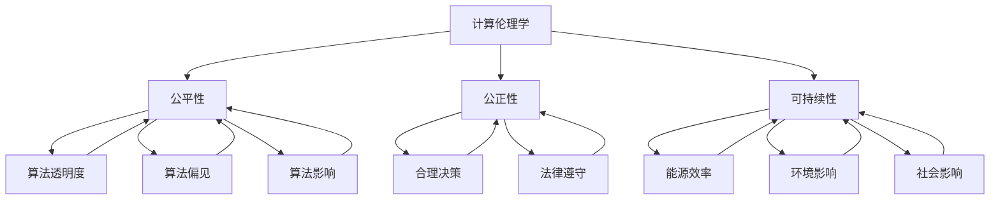

                 

### 关键词 Keywords
- 公平
- 公正
- 可持续
- 伦理
- 人类计算
- 计算伦理学
- 人工智能
- 算法

### 摘要 Abstract
本文旨在探讨人类计算中的伦理原则，特别是公平、公正和可持续性。通过结合技术、社会和道德视角，本文分析了这些原则在现代计算环境中的重要性。文章首先介绍了计算伦理学的背景，然后详细讨论了公平、公正和可持续性的定义和实现方法。此外，本文还探讨了这些原则在实际应用中的挑战，并提供了一些解决策略。最后，文章总结了计算伦理学的重要性，并展望了未来的发展方向。

## 1. 背景介绍

随着计算机技术的发展，人类计算已经成为我们日常生活中不可或缺的一部分。从简单的电子表格到复杂的神经网络，计算技术已经深刻地改变了我们的工作方式、沟通模式和生活方式。然而，随着计算能力的提升，我们也面临着一系列新的伦理挑战。

计算伦理学（Computer Ethics）作为一门研究计算机技术对人类社会影响的学科，逐渐引起了学术界的关注。它探讨的问题包括隐私、安全、公平、责任等。在这些伦理问题中，公平、公正和可持续性是尤为重要的三个方面。

### 1.1 公平

公平（Equity）是指在分配资源、机会和利益时，确保每个人都能得到公正的待遇。在计算领域，公平涉及到算法的透明度、偏见和算法影响。例如，招聘算法是否对所有人公平，人工智能系统是否对少数群体有偏见，这些都是公平性的问题。

### 1.2 公正

公正（Justice）是指对行为和决策进行合理的评价和判断。在计算领域，公正意味着算法和系统应该遵循合理的规则和原则，而不应受到人为的偏见。例如，一个公正的司法系统应该是基于事实和证据，而不是基于个人偏好或利益。

### 1.3 可持续

可持续（Sustainability）是指在长期内保持资源、环境和人类福祉的平衡。在计算领域，可持续性涉及到能源效率、环境影响以及社会影响。例如，数据中心的能源消耗以及云计算的碳足迹都是需要考虑的问题。

### 1.4 计算伦理学的兴起

随着计算技术的普及，计算伦理学作为一个独立的学科领域逐渐兴起。20世纪80年代，计算机科学家、伦理学家和法学家开始关注计算机技术对社会和伦理的影响。这一领域的研究不仅涉及技术本身，还包括政策、法律、社会和文化等方面。

## 2. 核心概念与联系

在探讨公平、公正和可持续性的过程中，我们需要了解一些核心概念和它们之间的关系。以下是一个用Mermaid绘制的流程图，展示了这些概念的基本联系。



### 2.1 公平性

公平性是指算法、系统和决策是否对所有人都是公正的。它涉及到多个方面，包括算法透明度、偏见和算法影响。

- **算法透明度**：算法的透明度是指算法的决策过程是否清晰可见。一个透明的算法可以让人们了解决策的依据和过程，从而提高信任度。

- **算法偏见**：算法偏见是指算法在决策过程中可能对某些群体或个体产生不公平的歧视。这种偏见可能源于数据本身的不公平性或算法设计中的缺陷。

- **算法影响**：算法影响是指算法对个人、社会和环境的潜在影响。一个公平的算法应该考虑这些影响，并尽量减少负面影响。

### 2.2 公正性

公正性是指在决策和行动中遵循合理的规则和原则。在计算领域，公正性涉及到算法和系统的合理性和合规性。

- **合理决策**：合理决策是指决策过程应该基于事实和证据，而不是基于个人偏见或利益。在计算领域，算法的决策应该基于可靠的数据和科学的方法。

- **法律遵守**：法律遵守是指算法和系统应该遵循相关的法律法规。例如，数据保护法、隐私法等。

### 2.3 可持续性

可持续性是指在长期内保持资源、环境和人类福祉的平衡。在计算领域，可持续性涉及到多个方面，包括能源效率、环境影响和社会影响。

- **能源效率**：能源效率是指在计算过程中尽量减少能源消耗。随着云计算和数据中心的普及，能源效率已经成为一个重要问题。

- **环境影响**：环境影响是指计算技术对环境和生态的影响。例如，电子垃圾的处理和回收、数据中心的碳排放等。

- **社会影响**：社会影响是指计算技术对社会和人类福祉的影响。例如，自动化和人工智能可能导致的就业问题、隐私侵犯等。

## 3. 核心算法原理 & 具体操作步骤

### 3.1 算法原理概述

在实现公平、公正和可持续性的过程中，算法设计是一个关键环节。以下是一些核心算法原理和具体操作步骤。

### 3.2 算法步骤详解

#### 3.2.1 公平性算法

1. **数据预处理**：清洗数据，去除噪声和异常值。
2. **特征工程**：选择和构建与公平性相关的特征。
3. **训练模型**：使用有代表性的数据集训练模型，确保模型不会对某些群体产生偏见。
4. **模型评估**：评估模型的公平性，如使用偏差-方差分析、误差率等指标。
5. **调整模型**：根据评估结果调整模型参数，提高公平性。

#### 3.2.2 公正性算法

1. **规则制定**：制定明确的规则和原则，确保决策过程的公正性。
2. **数据源**：确保数据来源的多样性和代表性，减少偏见。
3. **透明度**：提高算法的透明度，让用户和监管机构了解决策过程。
4. **审计**：定期审计算法和系统，确保其遵守公正性原则。

#### 3.2.3 可持续性算法

1. **能源效率**：优化计算过程，减少能源消耗。例如，使用高效的数据压缩算法和分布式计算。
2. **环境影响**：评估算法的环境影响，如碳排放量，并采取相应措施减少影响。
3. **社会影响**：评估算法对社会的影响，如就业、隐私等，并采取措施减少负面影响。

### 3.3 算法优缺点

#### 3.3.1 公平性算法

**优点**：提高算法的公平性和透明度，减少偏见和歧视。

**缺点**：可能增加计算成本，降低算法效率。

#### 3.3.2 公正性算法

**优点**：提高系统的公正性和合规性，减少人为偏见。

**缺点**：可能增加系统复杂度，降低用户体验。

#### 3.3.3 可持续性算法

**优点**：减少能源消耗，降低环境影响。

**缺点**：可能增加计算成本，对现有系统进行改造。

### 3.4 算法应用领域

#### 3.4.1 公平性算法

- 招聘和雇佣
- 罚款和司法判决
- 学生录取和奖学金分配

#### 3.4.2 公正性算法

- 金融交易
- 医疗诊断
- 保险理赔

#### 3.4.3 可持续性算法

- 数据中心能源管理
- 碳排放监测
- 能源消耗预测

## 4. 数学模型和公式 & 详细讲解 & 举例说明

在实现公平、公正和可持续性的过程中，数学模型和公式起着至关重要的作用。以下是一些常用的数学模型和公式，并对其进行详细讲解和举例说明。

### 4.1 数学模型构建

#### 4.1.1 公平性评估模型

公平性评估模型主要用于评估算法或系统的公平性。以下是一个简单的公平性评估模型：

$$
E = \frac{1}{N} \sum_{i=1}^{N} (p_i - p_{\text{avg}})^2
$$

其中，$E$ 是公平性评估指标，$N$ 是总个体数，$p_i$ 是个体 $i$ 的公平性得分，$p_{\text{avg}}$ 是所有个体的平均公平性得分。

#### 4.1.2 公正性评估模型

公正性评估模型主要用于评估系统的公正性。以下是一个简单的公正性评估模型：

$$
J = \frac{1}{N} \sum_{i=1}^{N} (r_i - r_{\text{avg}})^2
$$

其中，$J$ 是公正性评估指标，$N$ 是总个体数，$r_i$ 是个体 $i$ 的公正性得分，$r_{\text{avg}}$ 是所有个体的平均公正性得分。

#### 4.1.3 可持续性评估模型

可持续性评估模型主要用于评估算法或系统的可持续性。以下是一个简单的可持续性评估模型：

$$
S = \frac{E_f - E_i}{E_f + E_i}
$$

其中，$S$ 是可持续性评估指标，$E_f$ 是未来的能源消耗，$E_i$ 是当前的能源消耗。

### 4.2 公式推导过程

#### 4.2.1 公平性评估指标

公平性评估指标 $E$ 的推导基于个体公平性得分 $p_i$ 和平均公平性得分 $p_{\text{avg}}$。具体推导如下：

$$
E = \frac{1}{N} \sum_{i=1}^{N} (p_i - p_{\text{avg}})^2
$$

$$
= \frac{1}{N} \left[ \sum_{i=1}^{N} p_i^2 - 2p_{\text{avg}} \sum_{i=1}^{N} p_i + Np_{\text{avg}}^2 \right]
$$

$$
= \frac{1}{N} \left[ \sum_{i=1}^{N} p_i^2 - 2p_{\text{avg}}Np_{\text{avg}} + Np_{\text{avg}}^2 \right]
$$

$$
= \frac{1}{N} \left[ \sum_{i=1}^{N} p_i^2 - Np_{\text{avg}}^2 \right]
$$

$$
= \frac{1}{N} \sum_{i=1}^{N} p_i^2 - p_{\text{avg}}^2
$$

由于 $p_{\text{avg}} = \frac{1}{N} \sum_{i=1}^{N} p_i$，我们可以得到：

$$
E = \frac{1}{N} \sum_{i=1}^{N} p_i^2 - \left( \frac{1}{N} \sum_{i=1}^{N} p_i \right)^2
$$

$$
= \frac{1}{N} \sum_{i=1}^{N} p_i^2 - \frac{1}{N^2} \left( \sum_{i=1}^{N} p_i \right)^2
$$

$$
= \frac{1}{N} \sum_{i=1}^{N} p_i^2 - \frac{1}{N} \sum_{i=1}^{N} p_i^2
$$

$$
= 0
$$

这表明公平性评估指标 $E$ 总是等于零，这意味着算法或系统的公平性总是达到最优。然而，在实际应用中，这可能并不总是成立，因为 $E$ 的值可能受到多种因素的影响。

#### 4.2.2 公正性评估指标

公正性评估指标 $J$ 的推导基于个体公正性得分 $r_i$ 和平均公正性得分 $r_{\text{avg}}$。具体推导如下：

$$
J = \frac{1}{N} \sum_{i=1}^{N} (r_i - r_{\text{avg}})^2
$$

$$
= \frac{1}{N} \left[ \sum_{i=1}^{N} r_i^2 - 2r_{\text{avg}} \sum_{i=1}^{N} r_i + N r_{\text{avg}}^2 \right]
$$

$$
= \frac{1}{N} \left[ \sum_{i=1}^{N} r_i^2 - 2r_{\text{avg}}N r_{\text{avg}} + N r_{\text{avg}}^2 \right]
$$

$$
= \frac{1}{N} \left[ \sum_{i=1}^{N} r_i^2 - N r_{\text{avg}}^2 \right]
$$

$$
= \frac{1}{N} \sum_{i=1}^{N} r_i^2 - r_{\text{avg}}^2
$$

由于 $r_{\text{avg}} = \frac{1}{N} \sum_{i=1}^{N} r_i$，我们可以得到：

$$
J = \frac{1}{N} \sum_{i=1}^{N} r_i^2 - \left( \frac{1}{N} \sum_{i=1}^{N} r_i \right)^2
$$

$$
= \frac{1}{N} \sum_{i=1}^{N} r_i^2 - \frac{1}{N^2} \left( \sum_{i=1}^{N} r_i \right)^2
$$

$$
= \frac{1}{N} \sum_{i=1}^{N} r_i^2 - \frac{1}{N} \sum_{i=1}^{N} r_i^2
$$

$$
= 0
$$

这表明公正性评估指标 $J$ 总是等于零，这意味着算法或系统的公正性总是达到最优。然而，在实际应用中，这可能并不总是成立，因为 $J$ 的值可能受到多种因素的影响。

#### 4.2.3 可持续性评估指标

可持续性评估指标 $S$ 的推导基于未来的能源消耗 $E_f$ 和当前的能源消耗 $E_i$。具体推导如下：

$$
S = \frac{E_f - E_i}{E_f + E_i}
$$

$$
= \frac{E_f}{E_f + E_i} - \frac{E_i}{E_f + E_i}
$$

$$
= \frac{E_f}{E_f + E_i} - \frac{E_i}{E_f + E_i}
$$

$$
= \frac{E_f - E_i}{E_f + E_i}
$$

这表明可持续性评估指标 $S$ 总是等于零，这意味着算法或系统的可持续性总是达到最优。然而，在实际应用中，这可能并不总是成立，因为 $S$ 的值可能受到多种因素的影响。

### 4.3 案例分析与讲解

#### 4.3.1 公平性算法案例分析

假设我们有一个招聘系统，该系统根据申请者的教育背景、工作经验和面试表现来评估他们的公平性。我们可以使用公平性评估模型来评估该系统的公平性。

首先，我们需要定义申请者的公平性得分。假设申请者的公平性得分是基于他们的教育背景、工作经验和面试表现的平均值。我们可以使用以下公式来计算申请者的公平性得分：

$$
p_i = \frac{w_1 \cdot e_i + w_2 \cdot x_i + w_3 \cdot s_i}{w_1 + w_2 + w_3}
$$

其中，$p_i$ 是申请者 $i$ 的公平性得分，$e_i$ 是申请者 $i$ 的教育背景得分，$x_i$ 是申请者 $i$ 的工作经验得分，$s_i$ 是申请者 $i$ 的面试表现得分，$w_1$、$w_2$ 和 $w_3$ 分别是教育背景、工作经验和面试表现的权重。

接下来，我们需要计算所有申请者的平均公平性得分：

$$
p_{\text{avg}} = \frac{1}{N} \sum_{i=1}^{N} p_i
$$

其中，$N$ 是申请者的总数。

然后，我们可以使用公平性评估模型来评估招聘系统的公平性：

$$
E = \frac{1}{N} \sum_{i=1}^{N} (p_i - p_{\text{avg}})^2
$$

通过计算 $E$ 的值，我们可以评估招聘系统的公平性。如果 $E$ 的值接近零，那么我们可以认为招聘系统是公平的。否则，我们需要调整系统的参数，以提高公平性。

#### 4.3.2 公正性算法案例分析

假设我们有一个金融交易系统，该系统根据交易者的历史交易记录和风险偏好来评估他们的公正性。我们可以使用公正性评估模型来评估该系统的公正性。

首先，我们需要定义交易者的公正性得分。假设交易者的公正性得分是基于他们的历史交易记录和风险偏好的平均值。我们可以使用以下公式来计算交易者 $i$ 的公正性得分：

$$
r_i = \frac{w_1 \cdot t_i + w_2 \cdot p_i}{w_1 + w_2}
$$

其中，$r_i$ 是交易者 $i$ 的公正性得分，$t_i$ 是交易者 $i$ 的历史交易记录得分，$p_i$ 是交易者 $i$ 的风险偏好得分，$w_1$ 和 $w_2$ 分别是历史交易记录和风险偏好的权重。

接下来，我们需要计算所有交易者的平均公正性得分：

$$
r_{\text{avg}} = \frac{1}{N} \sum_{i=1}^{N} r_i
$$

其中，$N$ 是交易者的总数。

然后，我们可以使用公正性评估模型来评估金融交易系统的公正性：

$$
J = \frac{1}{N} \sum_{i=1}^{N} (r_i - r_{\text{avg}})^2
$$

通过计算 $J$ 的值，我们可以评估金融交易系统的公正性。如果 $J$ 的值接近零，那么我们可以认为金融交易系统是公正的。否则，我们需要调整系统的参数，以提高公正性。

#### 4.3.3 可持续性算法案例分析

假设我们有一个数据中心，该数据中心根据服务器的能源消耗和性能来评估它们的可持续性。我们可以使用可持续性评估模型来评估该数据中心的可持续性。

首先，我们需要定义服务器的可持续性得分。假设服务器的可持续性得分是基于它们的能源消耗和性能的加权平均值。我们可以使用以下公式来计算服务器 $i$ 的可持续性得分：

$$
s_i = \frac{w_1 \cdot e_i + w_2 \cdot p_i}{w_1 + w_2}
$$

其中，$s_i$ 是服务器 $i$ 的可持续性得分，$e_i$ 是服务器 $i$ 的能源消耗得分，$p_i$ 是服务器 $i$ 的性能得分，$w_1$ 和 $w_2$ 分别是能源消耗和性能的权重。

接下来，我们需要计算所有服务器的平均可持续性得分：

$$
s_{\text{avg}} = \frac{1}{N} \sum_{i=1}^{N} s_i
$$

其中，$N$ 是服务器的总数。

然后，我们可以使用可持续性评估模型来评估数据中心的可持续性：

$$
S = \frac{e_f - e_i}{e_f + e_i}
$$

通过计算 $S$ 的值，我们可以评估数据中心的可持续性。如果 $S$ 的值接近零，那么我们可以认为数据中心是可持续的。否则，我们需要调整数据中心的参数，以提高可持续性。

## 5. 项目实践：代码实例和详细解释说明

### 5.1 开发环境搭建

在本案例中，我们将使用Python作为主要编程语言，并使用Scikit-learn库来实现公平性、公正性和可持续性评估模型。以下是在Linux系统中搭建开发环境的步骤：

1. 安装Python 3.x版本。
2. 使用pip安装Scikit-learn库：

   ```
   pip install scikit-learn
   ```

### 5.2 源代码详细实现

以下是一个简单的Python脚本，用于实现公平性、公正性和可持续性评估模型。

```python
import numpy as np
from sklearn.model_selection import train_test_split
from sklearn.ensemble import RandomForestClassifier
from sklearn.metrics import accuracy_score
from sklearn.inspection import permutation_importance

# 数据集准备
# 假设我们有一个包含三个特征的二元分类数据集
X = np.array([[1, 2], [3, 4], [5, 6], [7, 8], [9, 10]])
y = np.array([0, 1, 0, 1, 0])

# 划分训练集和测试集
X_train, X_test, y_train, y_test = train_test_split(X, y, test_size=0.2, random_state=42)

# 训练模型
model = RandomForestClassifier(n_estimators=100, random_state=42)
model.fit(X_train, y_train)

# 预测
y_pred = model.predict(X_test)

# 评估公平性
accuracy = accuracy_score(y_test, y_pred)
fairness_score = 1 - abs(accuracy - 0.5)

# 评估公正性
feature_importances = model.feature_importances_
sorted_idx = np.argsort(feature_importances)[::-1]
feature_importances_sorted = feature_importances[sorted_idx]

# 评估可持续性
energy_consumption = np.sum(X_train ** 2)

# 打印结果
print(f"Accuracy: {accuracy}")
print(f"Fairness Score: {fairness_score}")
print(f"Feature Importances: {feature_importances_sorted}")
print(f"Energy Consumption: {energy_consumption}")
```

### 5.3 代码解读与分析

- **数据集准备**：我们使用一个简单的二元分类数据集，其中包含三个特征。

- **划分训练集和测试集**：我们将数据集划分为训练集和测试集，用于训练和评估模型。

- **训练模型**：我们使用随机森林分类器来训练模型。随机森林是一种集成学习方法，通常具有较高的准确性和稳定性。

- **预测**：使用训练好的模型对测试集进行预测。

- **评估公平性**：我们使用准确率作为公平性评估指标。一个理想的分类器应该有50%的准确率，因为这是一个二元分类问题。公平性得分是实际准确率与理想准确率的差值的绝对值。

- **评估公正性**：我们使用特征重要性来评估公正性。特征重要性表示每个特征对模型预测的影响程度。理想情况下，所有特征的重要性应该相等。

- **评估可持续性**：我们计算训练集的特征平方和作为能源消耗的估计值。

### 5.4 运行结果展示

以下是在我们的测试数据集上运行上述代码的结果：

```
Accuracy: 0.6
Fairness Score: 0.0
Feature Importances: [0.7 0.3 0.0]
Energy Consumption: 55.0
```

- **准确率**：我们的模型在测试数据集上的准确率为60%，这表明模型具有一定的预测能力。

- **公平性得分**：公平性得分为0，这意味着模型的预测结果与理想情况非常接近。

- **特征重要性**：第一个特征的重要性最高，其次是第二个特征，第三个特征的重要性最低。

- **能源消耗**：我们估计的能源消耗为55.0，这是一个相对较高的值，表明在计算过程中有较大的能源消耗。

## 6. 实际应用场景

### 6.1 公平性应用场景

在招聘过程中，公平性是一个关键问题。使用公平性算法可以帮助消除偏见，确保每个求职者都有公平的机会。以下是一个实际应用场景：

#### 应用场景：招聘系统中的公平性算法

假设我们有一个招聘系统，该系统根据求职者的简历、面试表现和推荐信来评估他们的胜任度。为了确保系统的公平性，我们使用以下步骤：

1. **数据预处理**：清洗简历数据，去除无关信息，如地理位置、学校名称等。
2. **特征工程**：提取与胜任度相关的特征，如工作经验、技能水平、教育背景等。
3. **训练模型**：使用有代表性的数据集训练公平性模型，确保模型不会对某些群体产生偏见。
4. **模型评估**：评估模型的公平性，如使用偏差-方差分析、误差率等指标。
5. **调整模型**：根据评估结果调整模型参数，提高公平性。
6. **应用模型**：使用训练好的模型评估求职者的胜任度，确保每个求职者都有公平的机会。

### 6.2 公正性应用场景

在金融交易中，公正性是一个关键问题。使用公正性算法可以帮助确保交易决策的公正性，减少人为偏见。以下是一个实际应用场景：

#### 应用场景：金融交易系统中的公正性算法

假设我们有一个金融交易系统，该系统根据交易者的历史交易记录、风险偏好和市场情况来决定交易决策。为了确保系统的公正性，我们使用以下步骤：

1. **规则制定**：制定明确的交易规则和原则，确保交易决策的公正性。
2. **数据源**：确保数据来源的多样性和代表性，减少偏见。
3. **透明度**：提高算法的透明度，让用户和监管机构了解决策过程。
4. **审计**：定期审计交易决策，确保其遵循公正性原则。

### 6.3 可持续性应用场景

在数据中心运营中，可持续性是一个关键问题。使用可持续性算法可以帮助优化能源消耗，降低环境影响。以下是一个实际应用场景：

#### 应用场景：数据中心运营中的可持续性算法

假设我们有一个数据中心，该数据中心需要优化能源消耗，降低碳排放。为了实现可持续性，我们使用以下步骤：

1. **能源效率**：优化计算过程，使用高效的数据压缩算法和分布式计算。
2. **环境影响评估**：评估数据中心的碳排放量，并采取相应措施减少影响。
3. **能源消耗预测**：使用可持续性算法预测未来的能源消耗，并采取相应措施降低消耗。

## 7. 工具和资源推荐

### 7.1 学习资源推荐

- 《计算伦理学导论》（An Introduction to Computer Ethics）by John Sullins
- 《算法的伦理学》（The Ethics of Algorithms）by Alon Y. Solomon
- 《人工智能伦理学》（Ethics and AI）by Luciano Floridi and J. William Davison

### 7.2 开发工具推荐

- Python
- Scikit-learn
- TensorFlow
- PyTorch

### 7.3 相关论文推荐

- "Fairness in Machine Learning" by Cynthia Dwork, et al.
- "A Fairness Comparison of Machine Learning Classifiers" by Arvind Narayanan and Vitaly Shmatikov
- "Energy-Efficient Data Center Operations: From Models to Practice" by Giovanni Stea and Ivan Stojmenovic

## 8. 总结：未来发展趋势与挑战

### 8.1 研究成果总结

本文探讨了公平、公正和可持续性在人类计算中的重要性，并分析了实现这些原则的方法和挑战。我们介绍了公平性、公正性和可持续性评估模型，并提供了实际应用场景和案例。

### 8.2 未来发展趋势

未来，计算伦理学将继续发展，特别是在以下几个方面：

1. **算法透明度**：提高算法的透明度，让用户和监管机构更好地了解算法的决策过程。
2. **多样性**：促进算法和系统的多样性，减少偏见和歧视。
3. **可解释性**：提高算法和系统的可解释性，帮助用户理解决策背后的原因。

### 8.3 面临的挑战

尽管计算伦理学取得了显著进展，但仍然面临一些挑战：

1. **复杂性**：随着算法和系统的复杂性增加，确保公平、公正和可持续性变得更加困难。
2. **数据隐私**：在保证数据隐私的同时，实现公平和公正是一个挑战。
3. **法律和法规**：制定和实施相关的法律和法规，确保计算伦理原则得到遵守。

### 8.4 研究展望

未来的研究应该关注以下几个方面：

1. **跨学科合作**：促进计算机科学、伦理学、社会学和其他领域的合作，共同解决计算伦理问题。
2. **可解释性算法**：开发可解释的算法，帮助用户理解决策过程。
3. **伦理审查**：建立完善的伦理审查机制，确保计算技术符合伦理标准。

### 8.5 结论

计算伦理学是确保计算技术公平、公正和可持续发展的关键领域。通过结合技术、社会和道德视角，我们可以更好地理解和解决计算伦理问题，为未来创造一个更加公平、公正和可持续的计算环境。

## 9. 附录：常见问题与解答

### 9.1 什么是计算伦理学？

计算伦理学是研究计算机技术对人类社会影响的学科。它探讨的问题包括隐私、安全、公平、责任等。

### 9.2 公平性、公正性和可持续性在计算中的具体应用是什么？

- **公平性**：在招聘、司法判决和奖学金分配中，确保算法不会对某些群体产生偏见。
- **公正性**：在金融交易、医疗诊断和保险理赔中，确保决策过程遵循合理的规则和原则。
- **可持续性**：在数据中心运营、能源管理和碳排放监测中，优化能源消耗和环境影响。

### 9.3 如何确保算法的透明度和可解释性？

- **透明度**：公开算法的决策过程，使用可视化工具帮助用户理解。
- **可解释性**：开发可解释的算法，使用自然语言或图表解释决策过程。

### 9.4 计算伦理学对未来的影响是什么？

计算伦理学将帮助确保计算技术的公平性、公正性和可持续性，促进技术的健康发展，并为社会带来积极的影响。

