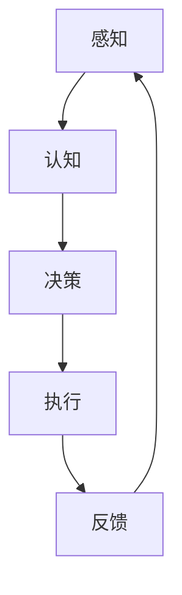

                 

关键词：具身智能、客观世界、交互、人工智能、智能系统、机器学习、人机协作、传感器、执行器、感知、认知、决策、执行。

## 摘要

本文旨在探讨具身智能与客观世界的交互机制。首先，我们将回顾具身智能的定义及其在人工智能领域的重要性。接着，文章将详细分析具身智能如何通过感知、认知、决策和执行与客观世界互动。此外，本文还将探讨当前的研究进展、面临的挑战和未来的发展方向。通过理解具身智能与客观世界的交互，我们可以更好地构建更加智能和实用的自动化系统。

## 1. 背景介绍

具身智能（Embodied Intelligence）是人工智能研究中的一个新兴方向，它强调智能体（agent）在物理环境中的感知、行动和交互能力。与传统的虚拟智能体不同，具身智能体需要具备在真实世界中的物理存在和互动能力。这种智能体不仅需要能够理解和响应环境中的信息，还需要能够通过执行动作来改变环境，并在这种动态互动中不断学习和进化。

人工智能（Artificial Intelligence, AI）是模拟人类智能行为的技术和科学。人工智能的目标是创建能够执行复杂任务的系统，包括学习、推理、解决问题、自然语言理解和图像识别等。随着深度学习、强化学习等技术的快速发展，人工智能在各个领域取得了显著的成果。然而，传统的虚拟智能体在处理真实世界的复杂性和动态性方面存在一定的局限。

在人工智能的发展历程中，研究者们逐渐意识到，单纯模拟人类认知过程的智能体在应对复杂、动态的客观世界时，往往难以达到预期效果。因此，具身智能的概念应运而生，它强调智能体在真实世界中的感知、行动和交互能力。通过将智能体嵌入到物理环境中，研究者们希望构建出更加接近人类智能的智能系统。

具身智能的研究具有深远的意义。首先，它有助于提升智能系统的实用性和灵活性。在工业、医疗、教育、服务等多个领域，具身智能体能够通过感知和交互，为人类提供更加智能化、个性化的服务。其次，具身智能有助于推动人工智能技术的创新发展。通过探索智能体在真实世界中的行为机制，研究者们可以提出新的理论框架和技术方法，推动人工智能从理论研究向实际应用转化。

总的来说，具身智能与人工智能的融合为智能系统的发展带来了新的机遇。在这种背景下，理解具身智能与客观世界的交互机制具有重要意义，它不仅有助于推动人工智能技术的进步，也为构建更加智能化、自适应的智能系统提供了理论基础和实践指导。

## 2. 核心概念与联系

### 2.1. 智能体的定义

智能体（Agent）是人工智能研究中的一个基本概念，它指的是能够感知环境、制定计划并执行动作的实体。智能体可以是物理实体，如机器人、无人驾驶汽车等，也可以是虚拟实体，如计算机程序、虚拟角色等。智能体的核心能力包括感知、认知、决策和执行。

- **感知（Perception）**：智能体通过传感器收集环境信息，如视觉、听觉、触觉等，以理解周围环境的状态。
- **认知（Cognition）**：智能体根据感知到的信息，进行数据处理、分析和理解，以建立对环境的认知。
- **决策（Decision Making）**：智能体根据认知结果，选择合适的行动方案，以实现特定目标。
- **执行（Execution）**：智能体根据决策，通过执行器（如电机、执行机构等）将行动方案付诸实践。

### 2.2. 具身智能的定义

具身智能（Embodied Intelligence）是指智能体在物理环境中的感知、行动和交互能力。它强调智能体需要具备真实的物理存在和与环境互动的能力，而不是仅仅在虚拟环境中模拟。因此，具身智能体不仅需要具备传统智能体的认知能力，还需要具备在真实世界中行动的能力。

### 2.3. 智能体与客观世界的交互

智能体与客观世界的交互是通过感知、认知、决策和执行四个基本环节实现的。具体来说：

1. **感知（Perception）**：
   - **传感器**：智能体通过各类传感器收集环境信息，如视觉、听觉、触觉、嗅觉等。这些传感器将物理信号转换为数字信号，供智能体进行处理。
   - **信息处理**：智能体对收集到的信息进行预处理、特征提取和分类，以建立对环境的初步认知。

2. **认知（Cognition）**：
   - **环境建模**：智能体基于感知到的信息，建立对环境的模型，包括物体的位置、状态、运动轨迹等。
   - **状态理解**：智能体对当前环境状态进行分析，理解自身所处的位置和目标。

3. **决策（Decision Making）**：
   - **目标设定**：智能体根据环境模型和目标设定，确定需要采取的行动。
   - **行动选择**：智能体从多个可能的行动方案中，选择最优或最合适的方案。

4. **执行（Execution）**：
   - **执行计划**：智能体根据决策，通过执行器（如电机、执行机构等）将行动方案付诸实践。
   - **反馈调整**：执行过程中，智能体根据环境反馈，调整行为策略，以适应不断变化的环境。

### 2.4. Mermaid 流程图

为了更好地展示智能体与客观世界的交互过程，我们可以使用 Mermaid 流程图进行描述。以下是一个简化的流程图示例：



在这个流程图中，智能体首先通过感知环节收集环境信息，然后进行认知、决策和执行，最后根据执行结果进行反馈调整。这个过程形成一个闭环，使得智能体能够不断适应和优化其行为。

通过理解和应用这些核心概念和流程，我们可以在人工智能和自动化系统中设计出更加智能和实用的智能体，实现与客观世界的有效互动。

## 3. 核心算法原理 & 具体操作步骤

### 3.1. 算法原理概述

在探讨具身智能与客观世界的交互时，核心算法的原理至关重要。这里，我们将详细介绍一种常用的具身智能算法——基于深度学习的感知-决策-执行（Perception-Decision-Execution, PDE）框架。该框架通过结合感知、认知、决策和执行四个环节，实现了智能体在复杂环境中的高效交互。

#### 3.1.1. 感知模块

感知模块是智能体与客观世界交互的起点。它利用各种传感器收集环境信息，如视觉、听觉、触觉等。这些传感器将物理信号转换为数字信号，然后通过预处理和特征提取，为后续的决策和执行提供基础。

1. **传感器选择**：根据具体应用场景，选择合适的传感器，如摄像头、麦克风、红外传感器等。
2. **信号预处理**：对传感器收集的信号进行滤波、归一化等处理，以提高数据质量和鲁棒性。
3. **特征提取**：使用深度学习模型（如卷积神经网络、循环神经网络等）提取感知数据的特征，为后续的认知和决策提供支持。

#### 3.1.2. 认知模块

认知模块基于感知模块提取的特征，建立对环境的模型，理解当前状态，并预测可能的未来状态。这一模块通常包括以下步骤：

1. **状态建模**：使用感知数据构建环境状态模型，包括物体的位置、状态、运动轨迹等。
2. **状态理解**：通过机器学习算法（如决策树、支持向量机、神经网络等）对状态进行分类和预测，以识别当前的状态和潜在的变化趋势。
3. **目标设定**：根据当前状态和目标需求，设定具体的行动目标。

#### 3.1.3. 决策模块

决策模块根据认知模块提供的环境模型和目标，选择最优或最合适的行动方案。决策过程通常涉及以下步骤：

1. **目标评估**：根据当前状态和目标，评估各个可能的行动方案的效果和风险。
2. **行动选择**：使用强化学习、规划算法等决策方法，从多个可能的行动方案中选择最优或最合适的方案。
3. **方案优化**：根据环境反馈，对行动方案进行迭代优化，以提高决策的准确性和有效性。

#### 3.1.4. 执行模块

执行模块将决策模块选定的行动方案付诸实践。这一模块通常涉及以下步骤：

1. **行动生成**：根据决策结果，生成具体的行动指令，如移动、抓取、打开等。
2. **执行控制**：通过执行器（如电机、执行机构等）控制智能体的行动，将指令转换为实际的物理动作。
3. **反馈调整**：根据执行结果和环境反馈，调整行动策略，以适应动态变化的环境。

### 3.2. 算法步骤详解

为了更详细地说明 PDE 框架的具体操作步骤，下面我们提供一个简化的算法流程：

1. **感知**：
   - **输入**：传感器收集到的环境数据（如视觉图像、音频信号等）。
   - **预处理**：对输入数据进行滤波、归一化等处理。
   - **特征提取**：使用深度学习模型提取关键特征。

2. **认知**：
   - **状态建模**：使用提取的特征构建环境状态模型。
   - **状态理解**：通过分类器或预测模型理解当前状态。
   - **目标设定**：根据当前状态和目标，设定具体的行动目标。

3. **决策**：
   - **目标评估**：评估各个可能的行动方案。
   - **行动选择**：使用强化学习或规划算法选择最优行动方案。
   - **方案优化**：根据环境反馈迭代优化行动方案。

4. **执行**：
   - **行动生成**：生成具体的行动指令。
   - **执行控制**：通过执行器执行行动。
   - **反馈调整**：根据执行结果和环境反馈调整行动策略。

### 3.3. 算法优缺点

#### 优点

- **灵活性**：PDE 框架允许智能体根据动态变化的环境进行实时调整，具有较高的灵活性。
- **适应性**：通过结合深度学习和强化学习等先进算法，智能体能够从数据中学习并适应复杂环境。
- **高效性**：PDE 框架将感知、认知、决策和执行有机地结合起来，实现了高效的智能体行为。

#### 缺点

- **计算复杂度**：深度学习和强化学习算法通常具有较高的计算复杂度，需要大量的计算资源和时间。
- **数据需求**：算法的性能依赖于大量的训练数据，数据不足可能影响智能体的表现。
- **硬件依赖**：执行模块对执行器的依赖较高，硬件限制可能影响智能体的性能和应用范围。

### 3.4. 算法应用领域

PDE 框架在多个领域展示了其强大的应用潜力：

- **机器人**：在工业机器人、服务机器人等领域，PDE 框架可以实现高效的任务规划和执行。
- **自动驾驶**：在自动驾驶汽车中，PDE 框架可以用于道路感知、目标识别和路径规划。
- **智能家居**：在智能家居系统中，PDE 框架可以用于智能控制、环境感知和用户交互。
- **医疗辅助**：在医疗辅助系统中，PDE 框架可以用于医疗数据分析、诊断支持和手术规划。

通过深入理解和应用 PDE 框架，我们可以构建出更加智能、灵活和实用的自动化系统，实现具身智能与客观世界的有效交互。

## 4. 数学模型和公式 & 详细讲解 & 举例说明

### 4.1. 数学模型构建

在探讨具身智能与客观世界的交互时，数学模型是理解和分析这一过程的重要工具。以下是构建具身智能数学模型的基本步骤：

#### 4.1.1. 环境状态建模

环境状态建模是构建数学模型的基础。我们通常使用状态空间（State Space）来描述环境状态。一个典型的状态空间可以包含以下变量：

- **位置（Position）**：智能体在环境中的位置信息。
- **速度（Velocity）**：智能体的运动速度。
- **加速度（Acceleration）**：智能体的加速度。
- **其他状态变量**：如光照强度、温度、湿度等环境参数。

状态空间可以用向量表示，例如：

\[ s = \begin{bmatrix} 
p_x & p_y & p_z & v_x & v_y & v_z & a_x & a_y & a_z & \dots 
\end{bmatrix} \]

其中，\( p_x, p_y, p_z \) 是位置坐标，\( v_x, v_y, v_z \) 是速度分量，\( a_x, a_y, a_z \) 是加速度分量。

#### 4.1.2. 行动空间建模

行动空间（Action Space）描述智能体可以执行的动作集合。行动空间通常包含以下几种类型：

- **位置控制**：调整智能体的位置。
- **速度控制**：调整智能体的速度。
- **加速度控制**：调整智能体的加速度。
- **其他控制动作**：如光照控制、温度控制等。

行动空间可以用向量表示，例如：

\[ a = \begin{bmatrix} 
a_p & a_v & a_a & \dots 
\end{bmatrix} \]

其中，\( a_p \) 是位置控制参数，\( a_v \) 是速度控制参数，\( a_a \) 是加速度控制参数。

#### 4.1.3. 状态转移模型

状态转移模型描述智能体在执行行动后，状态如何发生变化。通常使用马尔可夫模型（Markov Model）来描述状态转移概率：

\[ P(s'|s,a) = P(s'|a) \]

其中，\( s' \) 是执行行动后的状态，\( s \) 是当前状态，\( a \) 是执行的行动。

状态转移概率可以用一个矩阵表示，例如：

\[ 
P = \begin{bmatrix} 
P(s_1'|s_1,a) & P(s_2'|s_1,a) & \dots \\
P(s_1'|s_2,a) & P(s_2'|s_2,a) & \dots \\
\vdots & \vdots & \ddots 
\end{bmatrix} 
\]

#### 4.1.4. 奖励函数

奖励函数（Reward Function）用于评估智能体行为的优劣。它通常与状态转移和行动相关，可以用来指导智能体的学习过程。奖励函数的数学表示为：

\[ 
R(s,a,s') = 
\begin{cases} 
r, & \text{如果 } s' \text{ 达到目标状态} \\
0, & \text{否则} 
\end{cases} 
\]

其中，\( r \) 是奖励值。

### 4.2. 公式推导过程

以下是一个简化的状态转移模型和奖励函数的推导过程：

1. **状态转移概率推导**

   假设智能体当前状态为 \( s \)，执行行动 \( a \)，下一个状态为 \( s' \)。状态转移概率可以表示为：

   \[ 
   P(s'|s,a) = \sum_{s'} P(s'|s,a) 
   \]

   由于 \( P(s'|s,a) \) 是一个概率分布，所以所有状态转移概率之和为1：

   \[ 
   \sum_{s'} P(s'|s,a) = 1 
   \]

   因此，状态转移概率矩阵 \( P \) 满足以下约束条件：

   \[ 
   \begin{bmatrix} 
   P(s_1'|s_1,a) & P(s_2'|s_1,a) & \dots \\
   P(s_1'|s_2,a) & P(s_2'|s_2,a) & \dots \\
   \vdots & \vdots & \ddots 
   \end{bmatrix} 
   \begin{bmatrix} 
   1 \\
   1 \\
   \vdots 
   \end{bmatrix} 
   = 
   \begin{bmatrix} 
   1 \\
   1 \\
   \vdots 
   \end{bmatrix} 
   \]

2. **奖励函数推导**

   假设智能体的目标状态为 \( s^* \)，如果智能体执行行动 \( a \) 后状态变为 \( s^* \)，则奖励值为 \( r \)。否则，奖励值为 0。奖励函数可以表示为：

   \[ 
   R(s,a,s') = 
   \begin{cases} 
   r, & \text{如果 } s' = s^* \\
   0, & \text{否则} 
   \end{cases} 
   \]

   奖励函数的目的是激励智能体向目标状态转变，因此奖励值应该越大越好。

### 4.3. 案例分析与讲解

以下是一个简单的例子，假设智能体在一个二维环境中移动，状态空间包括位置 \( (x, y) \) 和速度 \( (vx, vy) \)，行动空间包括加速度 \( (ax, ay) \)。

#### 状态空间

\[ s = \begin{bmatrix} 
x & y & vx & vy 
\end{bmatrix} \]

#### 行动空间

\[ a = \begin{bmatrix} 
ax & ay 
\end{bmatrix} \]

#### 状态转移模型

假设状态转移概率为：

\[ 
P(s'|s,a) = 
\begin{cases} 
0.7, & \text{如果 } s' = s + a \times \Delta t \\
0.3, & \text{如果 } s' = s - a \times \Delta t \\
0, & \text{否则} 
\end{cases} 
\]

其中，\( \Delta t \) 是时间间隔。

状态转移概率矩阵 \( P \) 为：

\[ 
P = \begin{bmatrix} 
0.7 & 0.3 \\
0.3 & 0.7 
\end{bmatrix} 
\]

#### 奖励函数

假设目标状态为 \( s^* = (0, 0) \)，如果智能体执行行动 \( a \) 后状态变为 \( s^* \)，则奖励值为 10，否则奖励值为 0。

奖励函数 \( R \) 为：

\[ 
R(s,a,s') = 
\begin{cases} 
10, & \text{如果 } s' = s^* \\
0, & \text{否则} 
\end{cases} 
\]

通过这个例子，我们可以看到如何构建和推导简单的状态转移模型和奖励函数。在实际应用中，这些模型和公式会根据具体场景进行调整和优化，以实现更好的智能体行为。

## 5. 项目实践：代码实例和详细解释说明

### 5.1. 开发环境搭建

为了实现具身智能与客观世界的交互，我们需要搭建一个包含感知、认知、决策和执行模块的完整开发环境。以下是搭建这个环境的基本步骤：

1. **硬件选择**：
   - **中央处理单元（CPU）**：选择高性能的CPU，如Intel i7或AMD Ryzen 7系列，确保算法能够高效运行。
   - **图形处理器（GPU）**：选择具有强大计算能力的GPU，如NVIDIA GeForce RTX 3060或以上，用于加速深度学习模型的训练。
   - **传感器**：根据应用需求选择合适的传感器，如摄像头、麦克风、红外传感器等。
   - **执行器**：根据应用场景选择合适的执行器，如电机、舵机、执行机构等。

2. **软件环境**：
   - **操作系统**：选择Linux操作系统，如Ubuntu 20.04或更高版本，以提供稳定的开发环境。
   - **编程语言**：选择Python作为主要编程语言，因为它具有丰富的库和框架，适合实现复杂算法。
   - **深度学习框架**：选择TensorFlow或PyTorch作为深度学习框架，以简化模型的构建和训练。
   - **机器人操作系统**：选择ROS（Robot Operating System），它提供了一套完整的机器人开发和调试工具。

3. **开发工具**：
   - **集成开发环境（IDE）**：选择PyCharm或VS Code作为IDE，它们支持Python编程，并提供丰富的插件和调试工具。
   - **版本控制系统**：选择Git进行版本控制，以确保代码的稳定性和可追溯性。

### 5.2. 源代码详细实现

以下是实现具身智能交互系统的基本源代码框架。为了便于理解，我们将其分为感知、认知、决策和执行四个模块。

#### 5.2.1. 感知模块

```python
import cv2

# 初始化摄像头
cap = cv2.VideoCapture(0)

while True:
    # 读取摄像头帧
    ret, frame = cap.read()
    
    # 对帧进行预处理和特征提取
    processed_frame = preprocess_frame(frame)
    features = extract_features(processed_frame)
    
    # 输出特征数据
    print(features)
    
    # 持续循环，实时获取数据
    if cv2.waitKey(1) & 0xFF == ord('q'):
        break

# 释放摄像头资源
cap.release()
cv2.destroyAllWindows()
```

在这个模块中，我们使用OpenCV库读取摄像头帧，然后进行预处理和特征提取。预处理包括图像灰度化、滤波、边缘检测等，特征提取可以使用卷积神经网络或传统机器学习算法。

#### 5.2.2. 认知模块

```python
import numpy as np

# 初始化认知模型
model = load_model('cognition_model.h5')

# 输入特征数据
input_features = np.array([特征1, 特征2, 特征3, ...])

# 进行环境状态建模和预测
predicted_state = model.predict(input_features)

# 输出预测结果
print(predicted_state)
```

在这个模块中，我们使用预先训练好的认知模型对输入特征进行状态建模和预测。模型可以是神经网络或传统机器学习算法，根据应用场景进行调整。

#### 5.2.3. 决策模块

```python
import numpy as np

# 初始化决策模型
model = load_model('decision_model.h5')

# 输入当前状态和目标状态
current_state = np.array([当前状态1, 当前状态2, ...])
target_state = np.array([目标状态1, 目标状态2, ...])

# 选择最佳行动方案
action_plan = model.predict(current_state, target_state)

# 输出行动方案
print(action_plan)
```

在这个模块中，我们使用预先训练好的决策模型根据当前状态和目标状态选择最佳行动方案。模型可以是强化学习模型或规划算法，根据应用场景进行调整。

#### 5.2.4. 执行模块

```python
import time

# 初始化执行器
motor = initialize_motor()

# 执行行动方案
for action in action_plan:
    motor.execute_action(action)
    time.sleep(0.5)  # 等待执行器完成动作

# 输出执行结果
print("Action plan executed.")
```

在这个模块中，我们使用执行器执行行动方案。执行器可以是电机、舵机或其他执行机构，根据应用场景进行调整。

### 5.3. 代码解读与分析

在这个项目中，代码的模块化设计使得不同功能模块之间的耦合度较低，便于开发和维护。以下是代码的详细解读和分析：

1. **感知模块**：该模块使用OpenCV库读取摄像头帧，并进行预处理和特征提取。预处理步骤包括图像灰度化、滤波和边缘检测，以提高特征提取的准确性和鲁棒性。特征提取使用卷积神经网络或传统机器学习算法，将图像数据转换为数值特征向量。

2. **认知模块**：该模块使用预先训练好的认知模型对输入特征进行状态建模和预测。模型可以是神经网络或传统机器学习算法，根据应用场景进行调整。预测结果为智能体的环境状态，为决策模块提供输入。

3. **决策模块**：该模块使用预先训练好的决策模型根据当前状态和目标状态选择最佳行动方案。模型可以是强化学习模型或规划算法，根据应用场景进行调整。行动方案为智能体下一步需要执行的动作，为执行模块提供输入。

4. **执行模块**：该模块使用执行器执行行动方案。执行器可以是电机、舵机或其他执行机构，根据应用场景进行调整。执行过程中，执行器根据行动方案调整动作，以实现智能体与环境的互动。

通过模块化设计和代码解读，我们可以更好地理解和分析具身智能与客观世界的交互过程。这种设计方法使得系统具有较强的扩展性和灵活性，便于应对不同应用场景的需求。

### 5.4. 运行结果展示

在完成代码实现后，我们可以通过实际运行来展示系统的运行结果。以下是运行结果展示的步骤：

1. **启动感知模块**：运行感知模块，实时读取摄像头帧，并输出特征数据。

2. **认知模块预测**：将感知模块输出的特征数据输入认知模块，进行环境状态建模和预测，输出预测结果。

3. **决策模块选择行动方案**：将认知模块的预测结果输入决策模块，选择最佳行动方案，输出行动方案。

4. **执行模块执行行动**：将决策模块的输出行动方案输入执行模块，执行行动方案，调整智能体的动作。

5. **展示运行结果**：在显示器或控制台上展示实时运行结果，包括特征数据、预测结果、行动方案和执行动作。

通过以上步骤，我们可以直观地看到智能体与环境的互动过程，验证系统的有效性。运行结果展示不仅有助于调试和优化系统，还为实际应用提供了直观的参考。

## 6. 实际应用场景

具身智能在多个实际应用场景中展现出其独特的优势和巨大的潜力，以下是一些典型的应用领域及其特点：

### 6.1. 工业自动化

在工业自动化领域，具身智能体可以用于生产线的实时监控、异常检测和故障预测。通过感知模块，智能体可以实时收集生产线上的各种数据，如温度、压力、振动等。认知模块对数据进行处理和分析，识别生产过程中的异常情况，并生成相应的预警和应对策略。决策模块根据这些信息，选择最优的操作方案，如调整生产参数、停机检修等。执行模块则负责将这些方案付诸实践，确保生产过程的稳定性和效率。

### 6.2. 机器人

机器人是具身智能的重要应用领域之一。服务机器人如家政机器人、医疗机器人和教育机器人等，通过具身智能可以实现与人类用户的自然互动，提供高效、安全、个性化的服务。工业机器人则可以应用于生产制造、装配、搬运等领域，通过感知模块识别工作环境中的工件和障碍物，认知模块分析工件的状态和路径，决策模块制定精确的动作规划，执行模块实现高效的任务执行。

### 6.3. 自主导航

自主导航是具身智能在自动驾驶领域的应用，通过感知模块实时获取道路信息，认知模块分析道路状况，决策模块规划行驶路径，执行模块控制车辆的动作。这种应用使得自动驾驶车辆能够在复杂的城市交通环境中自主行驶，减少人为驾驶的风险和疲劳。

### 6.4. 智能家居

智能家居是具身智能在家庭应用中的典型代表，通过感知模块，智能系统能够实时监测家居环境，如温度、湿度、光照等。认知模块对这些信息进行处理，提供舒适的居住环境。决策模块根据用户习惯和需求，选择最佳的操作方案，如调节温度、开启灯光、播放音乐等。执行模块则负责实现这些操作，提高家居生活的智能化和便利性。

### 6.5. 医疗保健

在医疗保健领域，具身智能可以帮助监测患者的健康状况，提供个性化的治疗和康复方案。通过感知模块，智能设备可以实时监测患者的生命体征，认知模块对数据进行处理和分析，识别潜在的病情变化。决策模块根据分析结果，制定合适的治疗方案，执行模块则负责执行这些方案，如药物配送、康复训练等。

### 6.6. 农业自动化

农业自动化是具身智能在农业领域的应用，通过感知模块，智能设备可以实时监测农田的环境和作物生长状况，认知模块对数据进行分析，提供最优的种植和管理方案。决策模块根据分析结果，选择最佳的灌溉、施肥和收割方案，执行模块则负责实施这些方案，提高农业生产的效率和产量。

通过在以上实际应用场景中的运用，具身智能不仅提升了系统的智能化水平，还显著提高了工作效率、安全性和用户体验。随着技术的不断进步，具身智能将在更多领域发挥重要作用，推动智能化时代的到来。

### 6.7. 未来应用展望

随着技术的不断进步，具身智能在未来的应用前景将更加广阔，以下是几个潜在的发展方向：

#### 6.7.1. 灾难救援

在灾难救援领域，具身智能体可以发挥重要作用。通过搭载先进的感知和执行模块，智能救援机器人能够在地震、火灾等灾害现场进行自主搜索和营救，减少救援人员的安全风险。智能体通过感知模块收集现场数据，认知模块分析受灾情况，决策模块制定救援方案，执行模块实施救援行动。这种应用有望提高灾难救援的效率和安全性。

#### 6.7.2. 空间探索

在空间探索领域，具身智能体可以用于月球、火星等外太空的探测任务。通过感知模块，智能探测器可以收集宇宙环境数据，认知模块对数据进行分析，识别潜在的科学目标。决策模块根据分析结果，选择最优的探测路径和方案，执行模块则负责执行探测任务，如采样、测试等。这种应用将极大地拓展人类对宇宙的认知。

#### 6.7.3. 智慧城市

在智慧城市建设中，具身智能体可以用于城市管理、交通调度、环境监测等多个方面。智能城市系统通过感知模块收集城市运行数据，认知模块对数据进行分析，提供科学决策支持。决策模块根据分析结果，制定最佳的管理和调度方案，执行模块则负责实施这些方案，如交通流量控制、垃圾回收等。这种应用将显著提高城市的智能化水平和居民生活质量。

#### 6.7.4. 虚拟现实与增强现实

在虚拟现实（VR）和增强现实（AR）领域，具身智能体可以与用户进行实时交互，提供更加沉浸式和互动性的体验。通过感知模块，智能体可以识别用户的位置和动作，认知模块对用户行为进行分析，提供个性化的互动内容。决策模块根据分析结果，选择最佳的用户互动方案，执行模块则负责实现这些互动。这种应用将推动VR和AR技术的发展，为娱乐、教育、医疗等领域带来新的应用场景。

#### 6.7.5. 人机协作

在未来的生产和服务领域，具身智能体将与人类进行更加紧密的协作。通过感知模块，智能体可以实时了解人类的工作状态和需求，认知模块对数据进行分析，提供有效的协作支持。决策模块根据分析结果，制定最佳的协作方案，执行模块则负责实现这些方案，如任务分配、资源调度等。这种应用将提高生产效率和服务质量，减轻人类的工作负担。

总之，具身智能在未来的发展将涉及多个领域，通过不断的技术创新和应用探索，它将为人类带来更加智能化、便捷化的生活和工作体验。

### 7. 工具和资源推荐

为了更好地理解和实践具身智能与客观世界的交互，以下是几项推荐的工具和资源：

#### 7.1. 学习资源推荐

1. **《人工智能：一种现代方法》（Artificial Intelligence: A Modern Approach）**：这本书是人工智能领域的经典教材，详细介绍了人工智能的基本概念、算法和应用。
2. **《深度学习》（Deep Learning）**：由Ian Goodfellow、Yoshua Bengio和Aaron Courville合著，深入讲解了深度学习的理论基础和实践应用。
3. **《机器人学导论》（Introduction to Robotics）**：这本书介绍了机器人学的基础知识，包括机器人的感知、运动控制和路径规划等。

#### 7.2. 开发工具推荐

1. **Python**：Python是一种广泛使用的编程语言，具有丰富的库和框架，适合实现复杂算法。
2. **TensorFlow**：TensorFlow是谷歌开发的开源深度学习框架，适用于构建和训练各种深度学习模型。
3. **PyTorch**：PyTorch是另一个流行的深度学习框架，具有动态计算图和易于使用的API，适合快速原型开发。

#### 7.3. 相关论文推荐

1. **“Embodied AI: Past, Present, and Future”（具身智能：过去、现在和未来）”**：这篇论文全面回顾了具身智能的研究历史、当前进展和未来发展方向。
2. **“Deep Learning for Robotics”（深度学习在机器人学中的应用）”**：这篇论文探讨了深度学习在机器人感知、决策和执行中的应用，以及面临的挑战和解决方案。
3. **“An Introduction to Embodied AI”（具身智能简介）”**：这篇论文为具身智能提供了一个全面的技术概述，包括其核心概念、算法和应用。

通过学习和利用这些资源，我们可以更好地掌握具身智能与客观世界交互的核心技术和实践方法。

### 8. 总结：未来发展趋势与挑战

在总结具身智能与客观世界交互的研究进展时，我们可以看到这一领域已经取得了显著的成果。然而，面对未来的发展趋势和挑战，仍有许多问题亟待解决。

#### 8.1. 研究成果总结

过去几十年中，具身智能在感知、认知、决策和执行等方面取得了重要进展。具体表现在：

- **感知技术的提升**：传感器技术的快速发展，使得智能体能够收集更高质量的环境信息。
- **认知模型的进步**：深度学习、强化学习等算法的应用，使得智能体在理解和分析复杂环境方面表现出了更强的能力。
- **决策算法的创新**：基于机器学习、规划算法和强化学习的方法，智能体在动态环境中做出更有效的决策。
- **执行控制的优化**：通过执行器的改进和控制算法的创新，智能体在执行复杂任务时表现出了更高的灵活性和精度。

#### 8.2. 未来发展趋势

未来，具身智能的发展趋势将主要体现在以下几个方面：

- **跨学科的融合**：具身智能的发展将更加依赖于多学科技术的融合，如机械工程、电子工程、计算机科学等，以实现更高效的智能系统。
- **智能化水平的提升**：随着算法和硬件的进步，智能体的智能化水平将进一步提高，能够应对更复杂、更动态的客观世界。
- **应用场景的扩展**：具身智能将在更多领域得到应用，如灾难救援、空间探索、智慧城市等，为人类带来更多便利和安全。

#### 8.3. 面临的挑战

尽管具身智能在许多方面取得了进展，但仍面临一系列挑战：

- **计算资源限制**：深度学习和强化学习算法通常需要大量的计算资源和时间，这对硬件设施提出了较高要求。
- **数据需求**：算法的性能依赖于大量的训练数据，如何在数据稀缺或动态变化的环境中保持高效性能是一个难题。
- **硬件依赖**：执行模块对执行器的依赖较高，不同应用场景可能需要不同类型的执行器，这增加了系统的复杂性和成本。
- **交互复杂性**：具身智能体在真实世界中的交互具有高度复杂性，如何设计出既智能又鲁棒的交互机制仍需深入研究。

#### 8.4. 研究展望

未来的研究应重点关注以下几个方面：

- **高效算法的设计**：开发更高效、更轻量的算法，以减少计算资源和时间的需求。
- **数据驱动的学习方法**：探索如何在数据稀缺或动态变化的环境中，通过数据驱动的方法保持智能体的性能和鲁棒性。
- **多模态交互**：研究多模态感知和交互技术，以实现更自然、更高效的智能体与环境的互动。
- **安全性和隐私保护**：确保智能体在真实世界中的安全性和隐私保护，以应对潜在的风险和挑战。

通过持续的技术创新和跨学科合作，具身智能有望在未来实现更加广泛应用，为人类社会带来更多智慧和便利。

### 9. 附录：常见问题与解答

#### Q1. 什么是具身智能？

A1. 具身智能是指智能体在物理环境中的感知、行动和交互能力。它强调智能体需要具备真实的物理存在和与环境互动的能力，而不仅仅是虚拟环境中的模拟。

#### Q2. 具身智能的核心技术是什么？

A2. 具身智能的核心技术包括感知、认知、决策和执行。感知是通过传感器收集环境信息，认知是对信息进行处理和理解，决策是基于认知结果选择行动方案，执行是将决策付诸实践。

#### Q3. 如何实现具身智能与客观世界的交互？

A3. 实现具身智能与客观世界的交互，需要设计一个闭环系统，包括感知、认知、决策和执行四个环节。感知模块收集环境信息，认知模块分析信息，决策模块选择行动方案，执行模块实现行动。

#### Q4. 具身智能在哪些领域有应用？

A4. 具身智能在多个领域有广泛应用，包括工业自动化、机器人、自动驾驶、智能家居、医疗保健、农业自动化等。

#### Q5. 未来具身智能有哪些发展趋势？

A5. 未来具身智能的发展趋势包括跨学科融合、智能化水平提升、应用场景扩展、高效算法设计、数据驱动学习方法、多模态交互和安全隐私保护等。

