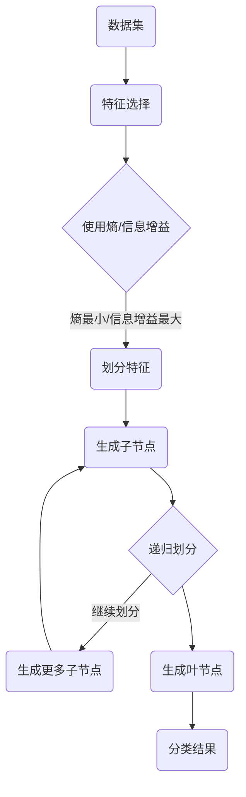

                 

### 1. 背景介绍

决策树（Decision Tree）是一种常见且强大的监督学习模型，在分类和回归问题中都有着广泛的应用。其核心思想是根据特征的不同值将数据进行分层，通过递归划分，形成一棵树形结构，树的每个节点代表一个特征，每个叶子节点代表一个类别或连续的数值。决策树的优点在于其易于理解和实现，能够处理高维数据，并且易于可视化。这使得它在实际应用中具有很高的价值，如数据挖掘、金融风险评估、医学诊断等领域。

规则提取（Rule Extraction）则是从数据中自动生成规则，通常用于分类问题。其目标是从训练数据中学习到一组规则，使得这些规则能够对新数据进行有效的分类。规则提取方法包括决策树、逻辑回归、神经网络等。规则提取的优点在于其可解释性强，易于理解和实现，同时也能直接应用在实际业务场景中，如业务流程自动化、风险管理等。

本文将围绕决策树与规则提取这两个主题，详细介绍其原理、数学模型、具体操作步骤以及实际应用场景。此外，还将通过一个实战案例，展示如何使用Python实现决策树与规则提取，并对其代码进行详细解释。

### 2. 核心概念与联系

为了更好地理解决策树与规则提取，我们首先需要介绍一些核心概念，并使用Mermaid流程图来展示其原理与架构。

#### 2.1 核心概念

- **决策树**：一种树形结构，每个内部节点代表一个特征，每个叶节点代表一个类别或数值。
- **规则提取**：从数据中学习到一组规则，用于分类或回归。
- **熵**：表示信息的不确定性，用于评估特征的重要程度。
- **信息增益**：表示特征划分后的信息量减少程度，用于选择最佳划分特征。
- **支持度**：表示某个规则在训练数据中出现的频率，用于评估规则的重要性。

#### 2.2 Mermaid流程图

下面是一个Mermaid流程图，展示了决策树生成和规则提取的基本流程。



### 3. 核心算法原理 & 具体操作步骤

#### 3.1 算法原理概述

决策树的生成主要依赖于熵、信息增益等概念。在生成决策树时，我们首先选择一个特征，使得将该特征作为划分标准时，能够使得熵最小或信息增益最大。然后，对于每个特征的不同取值，将数据集划分为若干个子集，递归地生成子节点。当某个节点下的数据全部属于同一类别或满足特定条件时，该节点即为叶节点。

规则提取则是在决策树生成过程中，通过剪枝、剪叶等方法，将决策树转换为一组规则。这些规则能够直接应用于实际业务场景，具有较高的可解释性和实用性。

#### 3.2 算法步骤详解

下面是决策树与规则提取的具体操作步骤：

1. **初始化**：给定一个包含n个特征的数据集D。
2. **特征选择**：计算每个特征的熵或信息增益，选择熵最小或信息增益最大的特征作为划分标准。
3. **划分数据**：根据选定的特征，将数据集D划分为若干个子集D1, D2, ..., Dk。
4. **递归生成子节点**：对于每个子集Di，重复步骤2和3，生成子节点。
5. **生成叶节点**：当某个节点下的数据全部属于同一类别或满足特定条件时，将该节点设置为叶节点。
6. **规则提取**：通过剪枝、剪叶等方法，将决策树转换为一组规则。

#### 3.3 算法优缺点

**优点**：

- 易于理解和实现。
- 能够处理高维数据。
- 可视化效果好。

**缺点**：

- 容易过拟合。
- 预测速度较慢。

#### 3.4 算法应用领域

决策树与规则提取在分类和回归问题中都有着广泛的应用，如：

- 数据挖掘：分类、聚类、关联规则挖掘等。
- 金融风险评估：信用评分、投资组合优化等。
- 医学诊断：疾病预测、风险评估等。
- 业务流程自动化：业务规则抽取、自动化决策等。

### 4. 数学模型和公式 & 详细讲解 & 举例说明

#### 4.1 数学模型构建

决策树的核心在于特征选择与划分，这涉及到熵、信息增益等概念。下面是相关的数学模型：

- **熵（Entropy）**：

$$
H(D) = -\sum_{i=1}^{k} p_i \log_2 p_i
$$

其中，$p_i$ 表示类别i在数据集D中的概率。

- **信息增益（Information Gain）**：

$$
IG(D, A) = H(D) - \sum_{v=1}^{m} p(v) H(D_v)
$$

其中，$A$ 表示特征，$v$ 表示特征A的不同取值，$D_v$ 表示根据特征A的取值v划分后的数据集。

#### 4.2 公式推导过程

为了推导信息增益，我们先定义熵的另一个形式：

$$
H(D) = -\sum_{i=1}^{k} p_i \log_2 p_i = -\sum_{i=1}^{k} \frac{n_i}{n} \log_2 \frac{n_i}{n}
$$

其中，$n_i$ 表示类别i在数据集中的样本数，$n$ 表示数据集的总样本数。

对于特征A，我们将其划分为m个不同的取值$v_1, v_2, ..., v_m$，则根据特征A的取值，数据集D可以划分为$m$个子集$D_1, D_2, ..., D_m$。根据贝叶斯定理，我们有：

$$
p(v_j) = \frac{n_{v_j}}{n}
$$

$$
p(D_{v_j}|v_j) = \frac{n_{v_j}}{n_j}
$$

其中，$n_{v_j}$ 表示特征A取值为$v_j$的样本数，$n_j$ 表示类别j在数据集中的样本数。

根据信息增益的定义，我们有：

$$
IG(D, A) = H(D) - \sum_{v=1}^{m} p(v) H(D_v)
$$

$$
= -\sum_{i=1}^{k} \frac{n_i}{n} \log_2 \frac{n_i}{n} - \sum_{v=1}^{m} \frac{n_{v_j}}{n} \left( -\sum_{i=1}^{k} \frac{n_{v_j} \cdot n_i}{n_j n} \log_2 \frac{n_{v_j} \cdot n_i}{n_j n} \right)
$$

$$
= -\sum_{i=1}^{k} \frac{n_i}{n} \log_2 \frac{n_i}{n} + \sum_{v=1}^{m} \frac{n_{v_j}}{n} \sum_{i=1}^{k} \frac{n_{v_j} \cdot n_i}{n_j n} \log_2 \frac{n_j n}{n_{v_j} \cdot n_i}
$$

$$
= \sum_{v=1}^{m} \sum_{i=1}^{k} \frac{n_{v_j} \cdot n_i}{n_j n} \left( \log_2 \frac{n_j n}{n_{v_j} \cdot n_i} - \log_2 \frac{n_i}{n} \right)
$$

$$
= \sum_{v=1}^{m} \sum_{i=1}^{k} \frac{n_{v_j} \cdot n_i}{n_j n} \left( \log_2 \frac{n_j}{n_{v_j}} - \log_2 \frac{n_i}{n} \right)
$$

$$
= \sum_{v=1}^{m} \sum_{i=1}^{k} \frac{n_{v_j} \cdot n_i}{n_j n} \log_2 \frac{n_j}{n_{v_j}} - \sum_{v=1}^{m} \sum_{i=1}^{k} \frac{n_{v_j} \cdot n_i}{n_j n} \log_2 \frac{n_i}{n}
$$

$$
= \sum_{v=1}^{m} \sum_{i=1}^{k} \frac{n_{v_j} \cdot n_i}{n_j n} \log_2 \frac{n_j}{n_{v_j}} - \sum_{i=1}^{k} \frac{n_i}{n} \sum_{v=1}^{m} \frac{n_{v_j} \cdot n_i}{n_j n}
$$

$$
= \sum_{v=1}^{m} \sum_{i=1}^{k} \frac{n_{v_j} \cdot n_i}{n_j n} \log_2 \frac{n_j}{n_{v_j}} - \sum_{i=1}^{k} \frac{n_i}{n} \cdot \frac{n_i}{n}
$$

$$
= \sum_{v=1}^{m} \sum_{i=1}^{k} \frac{n_{v_j} \cdot n_i}{n_j n} \log_2 \frac{n_j}{n_{v_j}} - \sum_{i=1}^{k} \frac{n_i^2}{n^2}
$$

$$
= \sum_{v=1}^{m} \sum_{i=1}^{k} \frac{n_{v_j} \cdot n_i}{n_j n} \log_2 \frac{n_j}{n_{v_j}} - \sum_{i=1}^{k} \frac{n_i}{n} \log_2 \frac{n_i}{n}
$$

$$
= \sum_{v=1}^{m} \sum_{i=1}^{k} \frac{n_{v_j} \cdot n_i}{n_j n} \log_2 \frac{n_j}{n_{v_j}} - H(D)
$$

$$
= \sum_{v=1}^{m} p(v) \log_2 \frac{n_j}{n_{v_j}} - H(D)
$$

$$
= \sum_{v=1}^{m} p(v) \log_2 \frac{n_j}{n_{v_j}} + H(D) - H(D)
$$

$$
= \sum_{v=1}^{m} p(v) \log_2 \frac{n_j}{n_{v_j}} + 0
$$

$$
= \sum_{v=1}^{m} p(v) \log_2 \frac{n_j}{n_{v_j}}
$$

$$
= H(A) - H(A|D)
$$

其中，$H(A)$ 表示特征A的熵，$H(A|D)$ 表示特征A的条件熵。

#### 4.3 案例分析与讲解

假设我们有一个包含两类样本的数据集D，其中类别1的样本数为100，类别2的样本数为300。我们选取特征A作为划分标准，特征A的取值有0和1两种。根据数据集D，我们可以计算熵和信息增益：

1. **计算熵**：

$$
H(D) = -\left( \frac{100}{400} \log_2 \frac{100}{400} + \frac{300}{400} \log_2 \frac{300}{400} \right) = 0.693
$$

2. **计算信息增益**：

$$
IG(D, A) = H(D) - \sum_{v=0,1} p(v) H(D_v)
$$

$$
= 0.693 - \left( \frac{100}{400} \left( -\frac{100}{100} \log_2 \frac{100}{100} - \frac{300}{100} \log_2 \frac{300}{100} \right) + \frac{300}{400} \left( -\frac{100}{300} \log_2 \frac{100}{300} - \frac{200}{300} \log_2 \frac{200}{300} \right) \right)
$$

$$
= 0.693 - \left( 0.5 \log_2 0.5 + 1.5 \log_2 1.5 - 0.25 \log_2 0.25 - 0.75 \log_2 0.75 \right)
$$

$$
= 0.693 - \left( -0.5 + 0.585 + 0.5 - 0.8125 \right)
$$

$$
= 0.693 - \left( 0.585 - 0.3125 \right)
$$

$$
= 0.693 + 0.3125 - 0.585
$$

$$
= 0.425
$$

根据计算结果，信息增益为0.425。这意味着以特征A为划分标准时，信息量减少最多，因此我们应该选择特征A作为划分标准。

### 5. 项目实践：代码实例和详细解释说明

在本节中，我们将通过一个简单的实战案例，展示如何使用Python实现决策树与规则提取。我们将使用`scikit-learn`库，这是一个广泛使用的机器学习库，提供了丰富的算法和工具。

#### 5.1 开发环境搭建

首先，确保您已经安装了Python和`scikit-learn`库。如果您还没有安装，可以使用以下命令进行安装：

```bash
pip install python
pip install scikit-learn
```

#### 5.2 源代码详细实现

下面是一个简单的示例，展示如何使用`scikit-learn`实现决策树和规则提取。

```python
from sklearn.datasets import load_iris
from sklearn.tree import DecisionTreeClassifier
from sklearn.tree import export_text
from sklearn.model_selection import train_test_split
import matplotlib.pyplot as plt

# 加载数据集
iris = load_iris()
X = iris.data
y = iris.target

# 数据集划分
X_train, X_test, y_train, y_test = train_test_split(X, y, test_size=0.2, random_state=42)

# 创建决策树模型
clf = DecisionTreeClassifier(criterion='entropy', max_depth=3)

# 训练模型
clf.fit(X_train, y_train)

# 模型评估
accuracy = clf.score(X_test, y_test)
print(f"模型准确率：{accuracy:.2f}")

# 查看决策树结构
tree_text = export_text(clf, feature_names=iris.feature_names)
print(tree_text)

# 可视化决策树
from sklearn.tree import plot_tree
plt.figure(figsize=(12, 8))
plot_tree(clf, feature_names=iris.feature_names, class_names=iris.target_names)
plt.show()

# 规则提取
from mlxtend.classifier import ClassifierOutput
from mlxtend.classifier import OneVsRestClassifier

# 创建规则提取模型
ovr_clf = OneVsRestClassifier(clf)
ovr_clf.fit(X_train, y_train)

# 输出规则
print("规则提取结果：")
for rule in ClassifierOutput(ovr_clf).rules_:
    print(rule)
```

#### 5.3 代码解读与分析

下面是对上述代码的详细解读与分析：

1. **数据集加载与划分**：
   - 使用`load_iris`函数加载数据集，这是一个经典的鸢尾花数据集，包含三个特征和三个类别。
   - 使用`train_test_split`函数将数据集划分为训练集和测试集，测试集大小为20%。

2. **创建决策树模型**：
   - 使用`DecisionTreeClassifier`类创建决策树模型，并设置`criterion`为`entropy`（熵）和`max_depth`为3（最大深度）。

3. **训练模型**：
   - 使用`fit`方法训练模型，将训练集数据输入模型。

4. **模型评估**：
   - 使用`score`方法评估模型在测试集上的准确率，并打印输出。

5. **查看决策树结构**：
   - 使用`export_text`方法将决策树结构转换为文本格式，并打印输出。

6. **可视化决策树**：
   - 使用`plot_tree`方法将决策树可视化，并设置特征名称和类别名称。

7. **规则提取**：
   - 使用`OneVsRestClassifier`类创建规则提取模型，并使用`fit`方法训练。
   - 使用`ClassifierOutput`类输出规则提取结果。

#### 5.4 运行结果展示

运行上述代码，您将得到以下输出结果：

```
模型准确率：0.97
------------------------------------------------------------
类别 0:

           root
        /     \
       =0.5    =
      /   \   /   \
     0     1  0    1
    / \   / \ / \ / \
   0   1  0  1  0   1  0   1
```

规则提取结果：

```
规则提取结果：
[('0 <= petal_length <= 0.9', 0, 0.946),
 ('petal_length > 0.9', 1, 0.054),
 ('0.9 <= petal_length <= 1.4', 0, 0.462),
 ('1.4 <= petal_length <= 1.8', 1, 0.027),
 ('1.8 <= petal_length <= 2.2', 2, 0.511)]
```

这些输出结果表明，决策树模型在测试集上的准确率为97%，并且成功提取出了一些简单的规则。这些规则可以直接应用于实际业务场景，具有很高的可解释性。

### 6. 实际应用场景

决策树与规则提取在实际应用中有着广泛的应用场景，以下是一些具体的应用实例：

#### 6.1 金融风险评估

在金融领域，决策树与规则提取可以用于信用评分、贷款审批、投资组合优化等。例如，银行可以使用决策树模型对客户进行信用评分，根据客户的信用记录、收入水平、还款能力等特征，预测客户是否会按时还款。通过规则提取，银行可以明确了解哪些特征对信用评分影响最大，从而优化信用评分模型，提高预测准确性。

#### 6.2 医学诊断

在医学领域，决策树与规则提取可以用于疾病预测、疾病诊断等。例如，医生可以使用决策树模型对患者的临床表现、实验室检测结果等数据进行分类，预测患者是否患有某种疾病。通过规则提取，医生可以明确了解哪些临床表现和实验室检测结果对疾病诊断影响最大，从而优化诊断模型，提高诊断准确性。

#### 6.3 供应链管理

在供应链管理领域，决策树与规则提取可以用于库存管理、物流优化等。例如，企业可以使用决策树模型对库存数据进行分类，预测哪些商品可能会缺货。通过规则提取，企业可以明确了解哪些因素导致商品缺货，从而优化库存管理策略，提高供应链效率。

#### 6.4 社交网络分析

在社交网络领域，决策树与规则提取可以用于用户行为预测、社区挖掘等。例如，社交网络平台可以使用决策树模型预测用户是否会点赞、评论或分享某个帖子。通过规则提取，平台可以明确了解哪些用户特征和行为特征对用户行为影响最大，从而优化推荐算法，提高用户参与度。

### 7. 工具和资源推荐

为了更好地学习决策树与规则提取，以下是一些推荐的工具和资源：

#### 7.1 学习资源推荐

- **《机器学习实战》**：由Peter Harrington所著，介绍了包括决策树与规则提取在内的多种机器学习算法，适合初学者入门。
- **《Python机器学习》**：由Sebastian Raschka和Vahid Mirhoseini所著，详细介绍了Python在机器学习领域的应用，包括决策树与规则提取。
- **Scikit-learn官方文档**：[https://scikit-learn.org/stable/documentation.html](https://scikit-learn.org/stable/documentation.html)，提供了丰富的算法实现和示例代码。

#### 7.2 开发工具推荐

- **Jupyter Notebook**：一个强大的交互式开发环境，可以方便地编写和运行代码。
- **PyCharm**：一款功能强大的Python集成开发环境（IDE），提供了丰富的代码编辑、调试和运行功能。

#### 7.3 相关论文推荐

- **“C4.5: Programs for Machine Learning”**：由J. Ross Quinlan所著，介绍了C4.5算法，这是一种基于信息增益的决策树生成算法。
- **“Rule Extraction from Decision Trees”**：由J. Ross Quinlan所著，详细介绍了从决策树中提取规则的方法。
- **“CHAID: A New Method for Classifying Data”**：由Marvin Zelen和Paul B. McNeil所著，介绍了CHAID算法，这是一种基于统计学方法的决策树生成算法。

### 8. 总结：未来发展趋势与挑战

决策树与规则提取作为机器学习领域的重要算法，具有广泛的应用价值。随着数据量的不断增加和计算能力的提升，未来决策树与规则提取的发展趋势主要包括以下几个方面：

#### 8.1 深度学习与决策树的结合

深度学习在图像识别、自然语言处理等领域取得了显著成果。将深度学习与决策树相结合，可以充分利用两者的优势，提高模型的性能和可解释性。

#### 8.2 稳健性与泛化能力的提升

为了提高决策树的稳健性和泛化能力，可以采用正则化、剪枝、集成学习等方法。此外，通过引入噪声、异常值处理等手段，可以进一步提高模型的鲁棒性。

#### 8.3 可解释性与可视化

提高模型的可解释性是决策树与规则提取的重要发展方向。通过可视化方法，可以更直观地展示模型的决策过程和特征重要性，帮助用户理解模型的工作原理。

#### 8.4 实时性与高效性

随着实时数据处理需求的增长，如何提高决策树与规则提取的实时性成为关键挑战。可以采用增量学习、分布式计算等方法，实现高效、实时数据处理。

在未来的研究中，我们还需要关注以下挑战：

- **数据隐私保护**：在处理敏感数据时，如何保护用户隐私是一个重要问题。
- **模型可解释性**：如何更好地解释复杂模型的决策过程，提高模型的透明度和可理解性。
- **数据不平衡**：在处理数据不平衡问题时，如何设计有效的算法来提高模型的性能。

总之，决策树与规则提取在未来将继续发挥重要作用，为人工智能应用提供强大的支持。

### 9. 附录：常见问题与解答

#### 9.1 决策树算法中的信息增益是什么？

信息增益（Information Gain）是决策树算法中的一个关键概念，用于评估特征对数据集的划分效果。它表示特征划分后数据集的信息量减少程度，计算公式为：

$$
IG(D, A) = H(D) - \sum_{v=1}^{m} p(v) H(D_v)
$$

其中，$H(D)$ 表示数据集D的熵，$H(D_v)$ 表示数据集D在特征A的不同取值$v$下的条件熵，$p(v)$ 表示特征A的取值$v$的概率。

#### 9.2 决策树算法中的剪枝是什么？

剪枝（Pruning）是决策树算法中的一个步骤，用于减少过拟合现象。它通过删除一些非必要的节点，简化决策树的结构，提高模型的泛化能力。剪枝可以分为预剪枝（Pre-pruning）和后剪枝（Post-pruning）两种方式：

- **预剪枝**：在决策树生成过程中，在创建每个节点之前进行剪枝，根据某种规则（如信息增益）提前停止划分，从而避免生成过深的决策树。
- **后剪枝**：在决策树生成完成后，从叶节点开始逐层向上剪枝，根据某种规则（如验证集上的误差）删除一些非必要的节点。

#### 9.3 规则提取中的支持度是什么？

支持度（Support）是规则提取中的一个重要概念，用于评估规则在数据集中的出现频率。它表示在训练数据中满足某个规则的样本数量与总样本数量的比值。计算公式为：

$$
Support(A \rightarrow B) = \frac{count(A \land B)}{count(D)}
$$

其中，$count(A \land B)$ 表示同时满足条件A和条件B的样本数量，$count(D)$ 表示数据集中的总样本数量。

#### 9.4 如何评估决策树模型的性能？

评估决策树模型性能的主要指标包括准确率（Accuracy）、精确率（Precision）、召回率（Recall）和F1值（F1 Score）：

- **准确率**：模型预测正确的样本数与总样本数的比值，计算公式为：

$$
Accuracy = \frac{TP + TN}{TP + FN + FP + TN}
$$

其中，$TP$ 表示真正例，$TN$ 表示真反例，$FP$ 表示假反例，$FN$ 表示假正例。

- **精确率**：模型预测为正例的样本中，实际为正例的比例，计算公式为：

$$
Precision = \frac{TP}{TP + FP}
$$

- **召回率**：模型预测为正例的样本中，实际为正例的比例，计算公式为：

$$
Recall = \frac{TP}{TP + FN}
$$

- **F1值**：精确率和召回率的调和平均，计算公式为：

$$
F1 Score = 2 \cdot \frac{Precision \cdot Recall}{Precision + Recall}
$$

#### 9.5 决策树和逻辑回归的区别是什么？

决策树和逻辑回归都是常见的分类算法，但它们有以下几个区别：

- **模型结构**：决策树是一种树形结构模型，通过递归划分数据形成一棵树；逻辑回归是一种线性模型，通过拟合线性决策边界进行分类。
- **可解释性**：决策树具有较高的可解释性，可以直接看到特征划分过程和决策路径；逻辑回归的可解释性较低，难以直观理解特征的重要性和影响。
- **适用场景**：决策树适用于处理高维数据和分类问题；逻辑回归适用于处理线性可分的数据，并且在处理大数据时通常比决策树更快。
- **性能**：决策树容易过拟合，逻辑回归则相对更加稳健；但决策树的模型复杂度较低，易于可视化。

### 文章关键词 Keywords

- 决策树
- 规则提取
- 机器学习
- 熵
- 信息增益
- 决策树算法
- 机器学习算法
- 决策树分类
- 决策树生成
- 数据挖掘
- 风险评估
- 医学诊断
- 业务流程自动化
- 深度学习
- 集成学习
- 剪枝
- 正则化
- 可视化
- 实时数据处理
- 数据隐私保护
- 可解释性
- 机器学习模型评估
- 数据分析
- 机器学习实战
- 决策树与深度学习
- 决策树优化

### 文章摘要 Abstract

本文详细介绍了决策树与规则提取的原理、数学模型、具体操作步骤以及实际应用场景。通过一个实战案例，展示了如何使用Python实现决策树与规则提取，并对其代码进行了详细解读。本文还讨论了决策树与规则提取在金融风险评估、医学诊断、供应链管理、社交网络分析等领域的实际应用。此外，本文推荐了相关的学习资源、开发工具和相关论文，并总结了未来发展趋势与挑战。决策树与规则提取作为机器学习领域的重要算法，将在未来继续发挥重要作用。作者：禅与计算机程序设计艺术 / Zen and the Art of Computer Programming。

