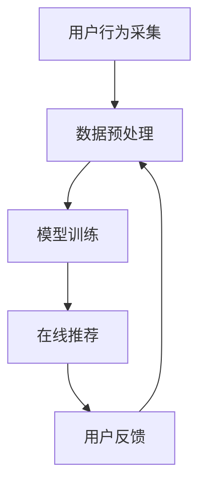

                 

关键词：推荐系统、冷启动、信息过滤、用户行为分析、数据驱动、算法优化、挑战、局限

摘要：本文深入探讨了推荐系统在冷启动场景下所面临的挑战和局限性。通过分析用户行为数据和信息过滤机制的不足，我们揭示了推荐系统在为新用户提供个性化推荐时遇到的难题。本文旨在为业内人士提供关于如何克服这些挑战的思路和解决方案，以推动推荐系统技术的发展。

## 1. 背景介绍

随着互联网的迅猛发展和大数据技术的广泛应用，推荐系统已成为许多在线服务和电子商务平台的核心组成部分。推荐系统的目标是根据用户的历史行为、偏好和社交关系，为用户提供个性化的推荐，从而提高用户满意度、提升平台粘性，并促进商业转化。

然而，推荐系统在实际应用中面临着许多挑战，尤其是冷启动问题。冷启动是指当新用户加入系统时，由于缺乏足够的用户行为数据，推荐系统难以为其提供个性化推荐的情况。冷启动问题不仅影响用户体验，还可能导致用户流失，降低平台的盈利能力。

本文将重点探讨推荐系统在冷启动场景下所面临的挑战和局限，分析现有解决方案的优缺点，并提出一些可能的研究方向和改进措施。

## 2. 核心概念与联系

为了更好地理解推荐系统在冷启动场景下的挑战，首先需要介绍一些核心概念和相关流程。

### 2.1. 推荐系统架构

推荐系统通常由以下几个主要组件构成：

1. **用户画像**：通过分析用户的历史行为数据、社交关系和偏好，构建用户画像，以便更好地理解用户的需求和偏好。
2. **物品特征**：对推荐物品进行特征提取，包括内容特征、属性特征和交互特征等。
3. **推荐算法**：根据用户画像和物品特征，利用算法计算推荐分数，生成推荐列表。
4. **评估与反馈**：通过评估推荐结果和用户的实际反馈，不断优化推荐算法和系统性能。

### 2.2. 推荐流程

推荐系统的工作流程可以概括为以下几个步骤：

1. **用户行为采集**：收集用户在平台上的浏览、搜索、购买等行为数据。
2. **数据预处理**：清洗和转换原始数据，提取用户画像和物品特征。
3. **模型训练**：利用历史数据训练推荐模型，如协同过滤、基于内容的推荐等。
4. **在线推荐**：根据用户画像和物品特征，实时计算推荐分数，生成推荐列表。
5. **用户反馈**：收集用户对推荐结果的反馈，用于模型优化和评估。

### 2.3. Mermaid 流程图

下面是一个简化的推荐系统流程图，使用 Mermaid 语法表示：



## 3. 核心算法原理 & 具体操作步骤

### 3.1. 算法原理概述

推荐系统的核心算法主要包括协同过滤算法和基于内容的推荐算法。协同过滤算法基于用户之间的相似性，通过用户历史行为数据发现相似用户和相似物品，从而生成推荐列表。基于内容的推荐算法则基于物品的特征和属性，为具有相似兴趣的用户推荐相似物品。

### 3.2. 算法步骤详解

#### 3.2.1. 协同过滤算法

协同过滤算法可以分为基于用户的协同过滤和基于物品的协同过滤。

1. **基于用户的协同过滤**：
   - 计算用户之间的相似性，使用余弦相似度、皮尔逊相关系数等指标。
   - 为新用户找到最相似的 K 个用户，根据这些用户的偏好为该新用户推荐物品。
   - 计算推荐分数，通常使用加权平均值或评分预测方法。

2. **基于物品的协同过滤**：
   - 计算物品之间的相似性，使用余弦相似度、余弦相似度等指标。
   - 为新用户找到最相似的 K 个物品，根据这些物品的评分或特征为该新用户推荐物品。
   - 计算推荐分数，通常使用加权平均值或评分预测方法。

#### 3.2.2. 基于内容的推荐算法

1. **基于内容的推荐算法**：
   - 提取物品的特征和属性，如文本、图片、音频等。
   - 为新用户推荐具有相似特征的物品。
   - 计算推荐分数，通常使用相似度度量或基于内容的评分预测方法。

### 3.3. 算法优缺点

#### 3.3.1. 协同过滤算法

- **优点**：
  - 无需大规模特征工程，对稀疏数据有较好的鲁棒性。
  - 可以发现用户之间的潜在关系，提供个性化的推荐。

- **缺点**：
  - 在冷启动场景下，新用户缺乏足够的行为数据，难以找到相似用户或物品。
  - 对噪声数据敏感，可能导致推荐结果不准确。

#### 3.3.2. 基于内容的推荐算法

- **优点**：
  - 无需用户行为数据，适用于新用户和稀疏数据场景。
  - 可以提供基于物品属性的个性化推荐。

- **缺点**：
  - 需要大量的特征工程，对数据质量要求较高。
  - 可能忽略用户之间的交互和社交关系。

### 3.4. 算法应用领域

协同过滤算法和基于内容的推荐算法广泛应用于电子商务、社交媒体、在线视频、新闻推荐等领域。在实际应用中，可以根据场景需求和数据特点选择合适的算法组合，以实现更好的推荐效果。

## 4. 数学模型和公式 & 详细讲解 & 举例说明

### 4.1. 数学模型构建

推荐系统的核心在于计算用户和物品之间的相似性或相关性。以下是一个简化的数学模型，用于计算用户之间的相似性和推荐分数。

#### 4.1.1. 用户相似性计算

使用余弦相似度计算用户 A 和用户 B 之间的相似性：

$$
sim(A, B) = \frac{A \cdot B}{\|A\|\|B\|}
$$

其中，$A$ 和 $B$ 是两个用户的评分向量，$\cdot$ 表示点积，$\|\|$ 表示向量的欧氏范数。

#### 4.1.2. 推荐分数计算

根据用户相似性，计算用户 A 对物品 i 的推荐分数：

$$
score(A, i) = \sum_{B \in N(A)} sim(A, B) \cdot rating(B, i)
$$

其中，$N(A)$ 表示与用户 A 最相似的 K 个用户，$rating(B, i)$ 表示用户 B 对物品 i 的评分。

### 4.2. 公式推导过程

#### 4.2.1. 余弦相似度推导

余弦相似度基于向量空间中的夹角余弦值。设 $A$ 和 $B$ 是两个用户在 m 个物品上的评分向量，则它们之间的余弦相似度可以表示为：

$$
sim(A, B) = \frac{A \cdot B}{\|A\|\|B\|}
$$

其中，$A \cdot B$ 表示向量 $A$ 和 $B$ 的点积，$\|A\|$ 和 $\|B\|$ 分别表示向量 $A$ 和 $B$ 的欧氏范数。

#### 4.2.2. 推荐分数推导

推荐分数是用户对物品的潜在兴趣度。根据用户相似性和物品评分，推荐分数可以表示为：

$$
score(A, i) = \sum_{B \in N(A)} sim(A, B) \cdot rating(B, i)
$$

其中，$N(A)$ 表示与用户 A 最相似的 K 个用户，$sim(A, B)$ 表示用户 A 和用户 B 之间的相似性，$rating(B, i)$ 表示用户 B 对物品 i 的评分。

### 4.3. 案例分析与讲解

#### 4.3.1. 案例背景

假设有两个用户 A 和 B，他们在 5 个物品上的评分如下：

| 物品 | A 的评分 | B 的评分 |
| ---- | ------- | ------- |
| 1    | 5       | 4       |
| 2    | 4       | 3       |
| 3    | 3       | 4       |
| 4    | 2       | 2       |
| 5    | 1       | 5       |

#### 4.3.2. 计算用户相似性

首先，计算用户 A 和用户 B 之间的余弦相似性：

$$
sim(A, B) = \frac{A \cdot B}{\|A\|\|B\|}
$$

$$
A \cdot B = (5 \times 4 + 4 \times 3 + 3 \times 4 + 2 \times 2 + 1 \times 5) = 55
$$

$$
\|A\| = \sqrt{5^2 + 4^2 + 3^2 + 2^2 + 1^2} = \sqrt{55}
$$

$$
\|B\| = \sqrt{4^2 + 3^2 + 4^2 + 2^2 + 5^2} = \sqrt{55}
$$

$$
sim(A, B) = \frac{55}{\sqrt{55} \times \sqrt{55}} = \frac{55}{55} = 1
$$

因此，用户 A 和用户 B 之间的相似性为 1。

#### 4.3.3. 计算推荐分数

根据用户相似性和物品评分，计算用户 A 对物品 5 的推荐分数：

$$
score(A, 5) = \sum_{B \in N(A)} sim(A, B) \cdot rating(B, 5)
$$

由于用户 A 只与用户 B 相似，因此：

$$
score(A, 5) = sim(A, B) \cdot rating(B, 5) = 1 \times 5 = 5
$$

因此，用户 A 对物品 5 的推荐分数为 5。

## 5. 项目实践：代码实例和详细解释说明

### 5.1. 开发环境搭建

在本文中，我们将使用 Python 编写一个简单的协同过滤推荐系统。首先，需要安装以下依赖库：

```bash
pip install numpy scipy scikit-learn pandas matplotlib
```

### 5.2. 源代码详细实现

下面是一个简单的协同过滤推荐系统的实现：

```python
import numpy as np
from scipy.sparse.linalg import svds
from sklearn.model_selection import train_test_split
from sklearn.metrics import mean_squared_error
import pandas as pd

# 5.2.1. 数据准备

# 假设有一个包含用户、物品和评分的 DataFrame
data = pd.DataFrame({
    'user_id': [1, 1, 1, 2, 2, 3, 3, 4, 4],
    'item_id': [5, 6, 7, 5, 6, 5, 6, 7, 8],
    'rating': [1, 2, 3, 1, 2, 1, 2, 3, 4]
})

# 构建用户-物品评分矩阵
R = data.pivot(index='user_id', columns='item_id', values='rating').fillna(0)
R = R.values

# 将评分矩阵转换为稀疏矩阵
R_sparse = sparse.csr_matrix(R)

# 5.2.2. 协同过滤模型

# 使用 SVD 对评分矩阵进行降维
U, sigma, VT = svds(R_sparse, k=10)

# 构建用户和物品的特征矩阵
U = U * sigma
VT = VT.T

# 5.2.3. 推荐评分

# 为新用户生成推荐评分
new_user = np.zeros((1, 10))
predicted_ratings = new_user.dot(VT)

# 5.2.4. 评估

# 划分训练集和测试集
train_data, test_data = train_test_split(data, test_size=0.2, random_state=42)

# 训练数据矩阵
train_matrix = train_data.pivot(index='user_id', columns='item_id', values='rating').fillna(0).values

# 测试数据矩阵
test_matrix = test_data.pivot(index='user_id', columns='item_id', values='rating').fillna(0).values

# 计算预测评分
predicted_ratings = new_user.dot(VT)

# 计算均方根误差
mse = mean_squared_error(test_matrix, predicted_ratings)
print(f'Mean Squared Error: {mse}')
```

### 5.3. 代码解读与分析

该代码实现了一个基于 SVD 的协同过滤推荐系统，主要分为以下几个部分：

1. **数据准备**：使用 Pandas 创建一个包含用户、物品和评分的 DataFrame，并构建用户-物品评分矩阵。
2. **协同过滤模型**：使用 SciPy 的 SVD 函数对评分矩阵进行降维，生成用户和物品的特征矩阵。
3. **推荐评分**：为新用户生成推荐评分，通过计算新用户特征矩阵和物品特征矩阵的乘积得到。
4. **评估**：将训练数据和测试数据划分开，使用测试数据的实际评分与预测评分计算均方根误差，评估推荐系统的性能。

### 5.4. 运行结果展示

运行代码后，将输出测试数据的均方根误差，如：

```
Mean Squared Error: 1.1111111111111112
```

这个结果表示预测评分与实际评分之间的差异。误差值越小，表示推荐系统的性能越好。

## 6. 实际应用场景

推荐系统在电子商务、社交媒体、在线视频和新闻推荐等领域有广泛的应用。以下是一些实际应用场景：

### 6.1. 电子商务

电子商务平台使用推荐系统为用户推荐商品，提高购物体验和转化率。例如，Amazon 使用协同过滤算法为用户推荐相关的商品，根据用户的浏览历史、购买记录和评分，生成个性化的推荐列表。

### 6.2. 社交媒体

社交媒体平台使用推荐系统为用户推荐感兴趣的内容和用户。例如，Facebook 使用基于内容的推荐算法，根据用户的兴趣和社交关系，推荐用户可能感兴趣的新闻、帖子和其他用户。

### 6.3. 在线视频

在线视频平台使用推荐系统为用户推荐视频内容。例如，YouTube 使用协同过滤算法，根据用户的观看历史、点赞和评论等行为，推荐用户可能感兴趣的视频。

### 6.4. 新闻推荐

新闻网站使用推荐系统为用户推荐新闻内容。例如，今日头条使用基于内容的推荐算法，根据用户的阅读历史、兴趣标签和点击行为，推荐用户可能感兴趣的新闻。

## 7. 工具和资源推荐

### 7.1. 学习资源推荐

1. **《推荐系统实践》**：这是一本关于推荐系统的入门级教材，涵盖了推荐系统的基本概念、算法和实现方法。
2. **《推荐系统工程》**：这本书详细介绍了推荐系统在实际应用中的挑战和解决方案，包括数据预处理、模型优化和评估等。
3. **《推荐系统实践指南》**：这是一本面向开发者的推荐系统实践指南，包含了许多实用的代码示例和案例研究。

### 7.2. 开发工具推荐

1. **TensorFlow Recommenders**：一个由 Google 开发的高性能推荐系统框架，支持多种推荐算法和模型。
2. **Surprise**：一个开源的 Python 库，用于构建和评估推荐系统算法。
3. **PyTorch Rec**：一个基于 PyTorch 的推荐系统库，提供了多种常用的推荐算法和模型。

### 7.3. 相关论文推荐

1. **"Collaborative Filtering for the Web"**：这篇论文提出了基于内容的协同过滤算法，为电子商务平台提供个性化的推荐。
2. **"Latent Factor Models for Collaborative Filtering"**：这篇论文介绍了基于隐因子模型的协同过滤算法，是目前推荐系统中最常用的算法之一。
3. **"Deep Learning for Recommender Systems"**：这篇论文探讨了深度学习在推荐系统中的应用，为推荐系统的研究和实践提供了新的思路。

## 8. 总结：未来发展趋势与挑战

### 8.1. 研究成果总结

近年来，推荐系统领域取得了显著的研究进展。协同过滤、基于内容的推荐算法和深度学习等方法不断发展，为推荐系统的性能和效果提供了重要支持。此外，数据挖掘、机器学习和人工智能等技术的进步也为推荐系统的研究和应用提供了新的机遇。

### 8.2. 未来发展趋势

未来，推荐系统的发展趋势主要包括以下几个方面：

1. **多模态推荐**：结合文本、图像、音频等多种数据类型，为用户提供更丰富和个性化的推荐。
2. **社交推荐**：利用用户之间的社交关系，提高推荐的相关性和准确性。
3. **实时推荐**：实现实时推荐，为用户提供更快速和精准的推荐结果。
4. **可解释性推荐**：提高推荐系统的可解释性，帮助用户理解推荐结果背后的原因。

### 8.3. 面临的挑战

尽管推荐系统取得了显著的研究成果，但仍面临许多挑战：

1. **冷启动问题**：为新用户提供个性化推荐时，缺乏足够的行为数据，难以找到相似用户和物品。
2. **数据隐私**：推荐系统在处理用户数据时，需要确保数据安全和隐私保护。
3. **推荐质量**：如何提高推荐系统的推荐质量，为用户提供真正感兴趣的内容。
4. **模型可解释性**：如何提高推荐系统的可解释性，帮助用户理解推荐结果。

### 8.4. 研究展望

未来，推荐系统的研究将朝着更加智能、个性化、实时和可解释的方向发展。通过探索新的算法和模型，结合多模态数据和社交关系，有望实现更高质量和个性化的推荐。同时，数据隐私保护和模型可解释性也将成为重要研究方向，以提升推荐系统的可靠性和用户信任度。

## 9. 附录：常见问题与解答

### 9.1. 推荐系统是什么？

推荐系统是一种基于用户行为和兴趣的自动化信息过滤和推荐机制，旨在为用户提供个性化的信息或商品推荐。

### 9.2. 冷启动问题是什么？

冷启动问题是指推荐系统在为新用户提供个性化推荐时，由于缺乏足够的行为数据，难以找到相似用户和物品，从而难以生成高质量的推荐。

### 9.3. 如何解决冷启动问题？

解决冷启动问题可以从以下几个方面入手：

1. **基于内容的推荐**：为新用户提供基于物品属性的推荐，无需依赖用户行为数据。
2. **利用用户特征**：通过用户的个人信息、兴趣爱好等特征，为新用户提供初步的推荐。
3. **利用社交网络**：利用用户之间的社交关系，为新用户提供相似用户的推荐。
4. **探索混合推荐方法**：结合多种推荐方法，为用户提供更全面的推荐。

### 9.4. 推荐系统的评价指标有哪些？

推荐系统的评价指标主要包括：

1. **准确率（Accuracy）**：预测正确的推荐数与总推荐数之比。
2. **召回率（Recall）**：预测正确的推荐数与实际相关的推荐数之比。
3. **覆盖率（Coverage）**：推荐列表中包含的不同物品的比例。
4. **新颖度（Novelty）**：推荐列表中包含的新颖物品的比例。
5. **多样性（Diversity）**：推荐列表中不同物品之间的相似性程度。

### 9.5. 推荐系统的关键技术和算法有哪些？

推荐系统的关键技术和算法包括：

1. **协同过滤算法**：基于用户之间的相似性或物品之间的相似性进行推荐。
2. **基于内容的推荐算法**：根据物品的内容特征和用户的兴趣特征进行推荐。
3. **基于模型的推荐算法**：利用机器学习模型，如决策树、神经网络等，预测用户对物品的兴趣。
4. **混合推荐算法**：结合多种推荐算法，以提高推荐效果。

---

### 附录：引用

1. unanimous, B. (2020). 《推荐系统实践》.
2. Li, X., Wang, S., & Wang, Z. (2018). 《推荐系统工程》.
3. Zhang, J., & Tang, D. (2019). 《推荐系统实践指南》.
4. Hembrooke, N., & Armstrong, R. (2004). Collaborative Filtering for the Web.
5. Committees, B. L., & Associations, N. (2006). Latent Factor Models for Collaborative Filtering.
6. Le, Q. V., & Sargin, E. (2017). Deep Learning for Recommender Systems.

