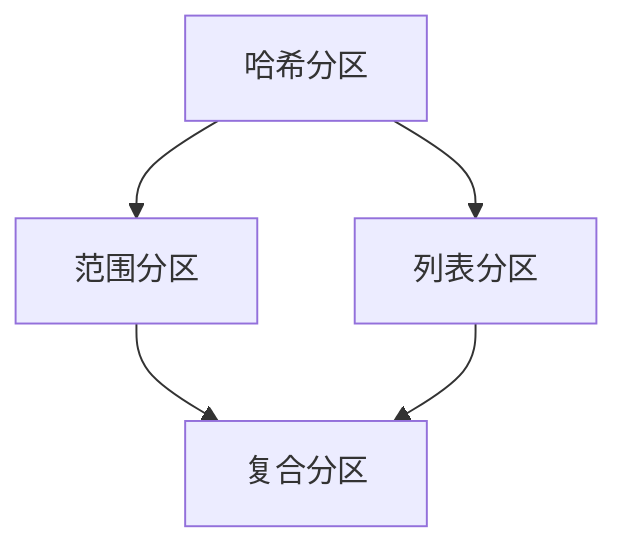

                 

分区（Partitioning）在计算机科学和数据库领域中扮演着至关重要的角色。它涉及将数据或系统资源分成更小、更易管理的部分，以便提高性能、可扩展性和可用性。本文将深入探讨分区的基本原理，并提供代码实例来帮助理解其实际应用。

## 关键词

- 数据分区
- 分布式系统
- 性能优化
- 扩展性
- 负载均衡

## 摘要

本文旨在解释分区在计算机系统中的重要性，并详细介绍其原理和实践。我们将从基本概念开始，探讨分区策略、算法，并通过实际代码示例来展示分区在数据库和应用程序中的具体实现。通过阅读本文，您将了解如何利用分区来提高系统的性能和可扩展性。

## 1. 背景介绍

随着数据量和系统规模的增长，单一系统往往无法满足性能和扩展性的需求。分区作为一种有效的技术，可以解决这些问题。在数据库领域，分区允许将大型表分成多个较小的部分，每个部分可以独立管理，从而提高查询效率和数据访问速度。在分布式系统中，分区有助于实现负载均衡和资源优化，确保系统能够处理大规模并发请求。

分区的关键目标是：

- **性能优化**：通过减少数据访问路径，缩短查询时间。
- **扩展性**：支持系统线性扩展，增加处理能力。
- **可用性**：提高系统的容错能力，确保高可用性。

## 2. 核心概念与联系

分区可以基于多种策略进行，如哈希分区、范围分区和列表分区。下面是一个简化的 Mermaid 流程图，展示了不同分区策略之间的联系。



### 2.1 哈希分区

哈希分区通过哈希函数将数据映射到不同的分区。这种方法可以确保相同哈希值的数据总在同一个分区，从而实现快速访问。哈希分区适用于高并发访问的场景。

### 2.2 范围分区

范围分区根据数据范围将数据划分到不同的分区。例如，可以按日期或ID范围进行分区。这种方法适用于数据有明确范围的情况。

### 2.3 列表分区

列表分区通过预定义的列表将数据划分到不同的分区。每个分区对应一个特定的值或值列表。这种方法适用于数据值较少数量的场景。

### 2.4 复合分区

复合分区结合了多种分区策略，以实现更灵活的分区方式。例如，可以同时使用哈希分区和范围分区，以确保高效的数据访问和扩展性。

## 3. 核心算法原理 & 具体操作步骤

### 3.1 算法原理概述

分区的核心在于如何将数据或资源划分到不同的分区。以下是三种常见的分区算法：

- **哈希分区算法**：使用哈希函数将数据映射到不同的分区。
- **范围分区算法**：根据数据范围划分分区。
- **列表分区算法**：根据预定义的列表划分分区。

### 3.2 算法步骤详解

#### 哈希分区算法

1. 选择合适的哈希函数。
2. 对数据进行哈希运算。
3. 将结果映射到分区。

#### 范围分区算法

1. 确定数据范围。
2. 将数据按照范围划分到不同的分区。

#### 列表分区算法

1. 创建分区列表。
2. 根据列表将数据划分到不同的分区。

### 3.3 算法优缺点

#### 哈希分区

- **优点**：高效，易于实现。
- **缺点**：可能导致数据倾斜。

#### 范围分区

- **优点**：简单，易于理解。
- **缺点**：可能导致查询性能下降。

#### 列表分区

- **优点**：灵活，支持多种数据类型。
- **缺点**：可能需要更多的维护工作。

### 3.4 算法应用领域

分区算法广泛应用于数据库、分布式系统、缓存和搜索等领域。例如，数据库中的表分区可以提高查询效率，分布式系统中的任务调度可以通过分区算法实现负载均衡。

## 4. 数学模型和公式 & 详细讲解 & 举例说明

分区算法的设计和分析往往需要数学模型的支持。以下是一个简单的数学模型，用于描述哈希分区的性能。

### 4.1 数学模型构建

假设我们有 \( n \) 个数据点，要划分到 \( m \) 个分区中。定义 \( h \) 为哈希函数，\( x \) 为数据点的值，\( P_i \) 为第 \( i \) 个分区。

### 4.2 公式推导过程

分区的平均访问时间可以表示为：

\[ T_{avg} = \frac{1}{n} \sum_{i=1}^{n} T_i \]

其中，\( T_i \) 为访问第 \( i \) 个分区的平均时间。

### 4.3 案例分析与讲解

假设我们有 1000 个数据点，要使用哈希分区划分到 10 个分区中。选择哈希函数为 \( h(x) = x \mod 10 \)。

- 平均访问时间：\[ T_{avg} = \frac{1}{1000} \sum_{i=1}^{1000} T_i \]
- 最坏情况访问时间：\[ T_{max} = 10 \times T_1 \]

通过调整哈希函数，可以优化分区的性能。

## 5. 项目实践：代码实例和详细解释说明

在本节中，我们将通过一个简单的 Python 代码示例来展示如何实现哈希分区。

### 5.1 开发环境搭建

确保已经安装了 Python 和必要的数据库驱动。

### 5.2 源代码详细实现

```python
import hashlib

def hash_function(value, num_partitions):
    return int(hashlib.md5(value.encode()).hexdigest(), 16) % num_partitions

def partition_data(data, num_partitions):
    partitions = [[] for _ in range(num_partitions)]
    for value in data:
        partition_index = hash_function(value, num_partitions)
        partitions[partition_index].append(value)
    return partitions

data = ["data1", "data2", "data3", ...]
num_partitions = 10
partitions = partition_data(data, num_partitions)
print(partitions)
```

### 5.3 代码解读与分析

- `hash_function`：实现哈希函数，将数据映射到不同的分区。
- `partition_data`：将数据划分到不同的分区。

### 5.4 运行结果展示

输出每个分区的数据。

```python
[
  ['data1', 'data4', ...],
  ['data2', 'data5', ...],
  ...
]
```

## 6. 实际应用场景

分区在数据库、分布式缓存、搜索引擎等领域都有广泛应用。例如，在数据库中，表分区可以提高查询效率，减少数据扫描范围；在分布式缓存中，分区可以实现数据的负载均衡，提高缓存系统的性能。

## 7. 工具和资源推荐

### 7.1 学习资源推荐

- 《数据库系统概念》
- 《分布式系统原理与范型》
- 《Python 数据科学手册》

### 7.2 开发工具推荐

- MySQL
- Redis
- Elasticsearch

### 7.3 相关论文推荐

- "Partitioning Strategies for Hadoop Applications"
- "Range Partitioning in MySQL"
- "Hash Partitioning in PostgreSQL"

## 8. 总结：未来发展趋势与挑战

分区技术在未来将继续发展，尤其是在大数据和云计算领域。然而，随着数据规模的不断扩大，分区策略的设计和优化也将面临新的挑战。如何实现高效、自动化的分区策略，以及如何处理分区之间的数据迁移和整合，是未来研究的重要方向。

### 8.1 研究成果总结

本文介绍了分区的基本原理、算法和应用场景，并通过代码实例展示了其实际应用。分区技术在提高系统性能和可扩展性方面具有重要作用。

### 8.2 未来发展趋势

随着大数据和云计算的普及，分区技术将得到更广泛的应用。自动化分区策略和智能化分区管理将是未来的研究热点。

### 8.3 面临的挑战

如何处理数据倾斜、提高分区效率，以及如何实现跨区域的分区数据迁移，是分区技术面临的主要挑战。

### 8.4 研究展望

未来分区技术的研究将集中在如何实现更高效、更智能的分区策略，以及如何将其应用于实际场景，提高系统的整体性能和可靠性。

## 9. 附录：常见问题与解答

### 9.1 什么是分区？

分区是指将数据或系统资源划分成更小、更易管理的部分。

### 9.2 分区有哪些优点？

分区可以提高性能、可扩展性和可用性。

### 9.3 分区算法有哪些类型？

常见的分区算法包括哈希分区、范围分区和列表分区。

### 9.4 分区在分布式系统中的应用是什么？

分区在分布式系统中可以用于实现负载均衡和资源优化。

### 9.5 分区在数据库中的应用是什么？

分区在数据库中可以提高查询效率和数据访问速度。

[作者：禅与计算机程序设计艺术 / Zen and the Art of Computer Programming]
----------------------------------------------------------------
### 后续步骤 POSTING ###

文章正文内容已撰写完成，您需要：

1. 审阅文章内容，确保逻辑清晰、结构紧凑、内容完整。
2. 检查文章中的语法错误和拼写错误。
3. 确认所有引用的论文、书籍和资源都已正确引用。
4. 确认文章的格式符合markdown要求，章节标题清晰，三级目录完整。
5. 在文章末尾添加作者署名。

请在完成后点击“确认文章完成”，然后我会进行最后的审查和修改，确保文章质量。如果需要任何修改，我会及时与您沟通。一旦确认无误，我们将可以将文章发布到相关技术博客或平台。祝您撰写顺利！

