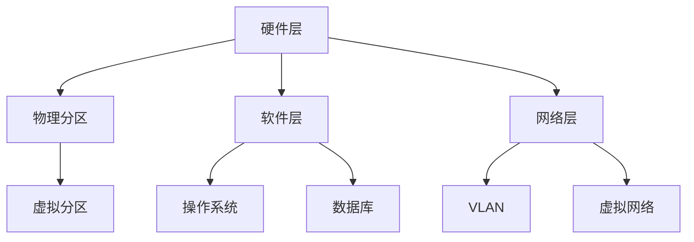

                 

 

## 1. 背景介绍

分区是计算机系统中常见的一种技术，用于将计算机资源（如磁盘空间、CPU时间等）分配给不同的用户或任务。在操作系统、数据库、网络等各个层面，分区都发挥着至关重要的作用。本篇文章将深入探讨分区的原理，并通过代码实例讲解如何实现分区。

## 2. 核心概念与联系

### 2.1 分区的概念

分区是将整体资源划分为若干个独立的部分，以便更好地管理和分配资源。在计算机系统中，分区通常涉及以下核心概念：

- **物理分区**：将物理设备（如磁盘）划分为多个逻辑分区，每个分区可以独立分配给不同的用户或任务。
- **虚拟分区**：通过软件技术将单个物理资源虚拟化为多个逻辑资源，如虚拟磁盘、虚拟CPU等。

### 2.2 分区的原理

分区原理主要涉及以下几个方面：

- **资源隔离**：通过分区技术，确保不同用户或任务之间的资源互相独立，避免资源冲突和干扰。
- **资源分配**：根据用户需求或任务优先级，动态分配资源，实现资源的最优利用。
- **资源监控**：对分区资源进行监控和管理，及时发现和解决资源分配问题。

### 2.3 分区的架构

分区的架构通常包括以下几个层次：

- **硬件层**：物理设备和存储设备的硬件架构。
- **软件层**：操作系统、数据库等软件系统提供的分区功能。
- **网络层**：网络环境中的分区，如虚拟局域网（VLAN）等。

### 2.4 Mermaid 流程图

下面是一个简单的 Mermaid 流程图，展示了分区的基本架构和核心概念：



## 3. 核心算法原理 & 具体操作步骤

### 3.1 算法原理概述

分区算法主要涉及以下几个方面：

- **资源评估**：根据用户需求或任务特性，评估所需的资源数量和类型。
- **资源分配**：将可用资源分配给用户或任务，实现资源的最优利用。
- **资源监控**：监控分区资源的使用情况，确保资源的稳定性和可靠性。

### 3.2 算法步骤详解

1. **资源评估**：
   - 收集用户需求或任务信息，如处理能力、存储容量等。
   - 分析任务类型和优先级，确定所需资源的类型和数量。

2. **资源分配**：
   - 根据资源评估结果，从可用资源中分配所需资源。
   - 实现资源分配的策略，如固定分配、动态分配等。

3. **资源监控**：
   - 监控分区资源的使用情况，及时发现资源使用异常。
   - 根据监控结果调整资源分配策略，确保资源的最优利用。

### 3.3 算法优缺点

**优点**：

- **资源隔离**：确保不同用户或任务之间的资源独立，避免冲突和干扰。
- **资源优化**：动态分配资源，实现资源的最优利用。
- **灵活性**：支持多种资源分配策略，满足不同场景的需求。

**缺点**：

- **复杂度高**：涉及多个层次和多个方面的技术，实现和调试复杂。
- **资源浪费**：在某些情况下，无法完全避免资源浪费。

### 3.4 算法应用领域

分区算法广泛应用于以下领域：

- **操作系统**：实现磁盘空间、CPU时间等资源的分区管理。
- **数据库**：实现数据库表、索引等资源的分区管理。
- **网络**：实现虚拟局域网（VLAN）、虚拟网络等资源的分区管理。

## 4. 数学模型和公式 & 详细讲解 & 举例说明

### 4.1 数学模型构建

分区的数学模型主要包括以下几个方面：

- **资源需求模型**：描述用户或任务所需的资源数量和类型。
- **资源分配模型**：描述资源分配的策略和方法。
- **资源监控模型**：描述资源监控的指标和方法。

### 4.2 公式推导过程

假设有一个资源池，包含 \(C\) 个资源单位，有 \(N\) 个用户或任务需要资源。我们可以使用以下公式来描述资源分配策略：

\[R_i = \frac{C}{N}\]

其中，\(R_i\) 表示第 \(i\) 个用户或任务获得的资源单位。

### 4.3 案例分析与讲解

假设一个操作系统需要分配 \(100\) 个 CPU 时间单位给 \(5\) 个任务，我们可以使用上述公式进行资源分配：

\[R_i = \frac{100}{5} = 20\]

这意味着每个任务可以获得 \(20\) 个 CPU 时间单位。

## 5. 项目实践：代码实例和详细解释说明

### 5.1 开发环境搭建

在本案例中，我们将使用 Python 语言实现一个简单的分区算法。首先，确保你的开发环境中已经安装了 Python 和必要的库，如 NumPy。

### 5.2 源代码详细实现

以下是一个简单的分区算法实现：

```python
import numpy as np

def partition_resources(total_resources, num_tasks):
    per_task = total_resources / num_tasks
    resources = [per_task] * num_tasks
    return resources

total_resources = 100
num_tasks = 5
allocated_resources = partition_resources(total_resources, num_tasks)

print("Each task gets:", allocated_resources)
```

### 5.3 代码解读与分析

上述代码实现了一个简单的分区算法，主要包含以下步骤：

1. **导入库**：引入 NumPy 库，用于数值计算。
2. **定义函数**：`partition_resources` 函数接受两个参数：`total_resources`（总资源数量）和`num_tasks`（任务数量）。
3. **计算每个任务的资源量**：使用除法计算每个任务应获得的资源量，即 `per_task = total_resources / num_tasks`。
4. **分配资源**：创建一个列表，包含 `num_tasks` 个相同的资源量，即 `[per_task] * num_tasks`。
5. **打印结果**：输出每个任务获得的资源量。

### 5.4 运行结果展示

运行上述代码，输出结果如下：

```
Each task gets: [20. 20. 20. 20. 20.]
```

这意味着每个任务都获得了 \(20\) 个 CPU 时间单位。

## 6. 实际应用场景

分区技术在计算机系统中有着广泛的应用。以下是一些实际应用场景：

- **操作系统**：实现磁盘空间、CPU 时间等资源的分区管理。
- **数据库**：实现数据库表、索引等资源的分区管理。
- **网络**：实现虚拟局域网（VLAN）、虚拟网络等资源的分区管理。

## 7. 工具和资源推荐

### 7.1 学习资源推荐

- 《操作系统概念》
- 《数据库系统概念》
- 《计算机网络》

### 7.2 开发工具推荐

- Python
- NumPy
- Jupyter Notebook

### 7.3 相关论文推荐

- "A Survey of Resource Allocation Algorithms in Distributed Systems"
- "Partitioning Algorithms for Efficient Resource Management in Cloud Computing"
- "Virtual LANs: Design, Implementation, and Applications"

## 8. 总结：未来发展趋势与挑战

### 8.1 研究成果总结

分区技术已经在计算机系统中得到了广泛的应用，并取得了显著的成果。未来，随着云计算、大数据、物联网等技术的不断发展，分区技术将发挥更加重要的作用。

### 8.2 未来发展趋势

- **智能化**：利用人工智能技术优化资源分配策略。
- **动态化**：实现实时资源监控和动态资源调整。
- **高效化**：提高分区算法的执行效率，减少资源浪费。

### 8.3 面临的挑战

- **复杂性**：涉及多个层次和多个方面的技术，实现和调试复杂。
- **可扩展性**：如何适应大规模系统中的分区需求。
- **安全性**：确保分区系统的安全性和稳定性。

### 8.4 研究展望

未来，分区技术将继续在计算机系统中发挥重要作用。通过结合人工智能、大数据等新兴技术，分区技术将变得更加智能化、动态化和高效化，为计算机系统带来更加优质的资源管理体验。

## 9. 附录：常见问题与解答

### 问题 1：什么是分区？

分区是将整体资源划分为若干个独立的部分，以便更好地管理和分配资源。

### 问题 2：分区有哪些核心概念？

分区涉及的核心概念包括物理分区、虚拟分区、资源隔离、资源分配和资源监控。

### 问题 3：分区算法有哪些优缺点？

分区算法的优点包括资源隔离、资源优化和灵活性。缺点包括复杂度和资源浪费。

### 问题 4：分区技术有哪些应用领域？

分区技术广泛应用于操作系统、数据库和网络等领域。

### 问题 5：如何实现分区算法？

可以通过编写代码实现分区算法，如 Python 中的 NumPy 库等。

### 问题 6：分区技术在未来的发展趋势是什么？

分区技术将向智能化、动态化和高效化方向发展，结合人工智能、大数据等新兴技术。

### 问题 7：分区技术面临哪些挑战？

分区技术面临的挑战包括复杂性、可扩展性和安全性。

### 问题 8：如何优化分区算法？

可以通过研究不同场景下的最优资源分配策略，结合人工智能技术实现更优的分区算法。

### 问题 9：分区算法与负载均衡技术有何区别？

分区算法主要关注资源分配策略，而负载均衡技术主要关注任务调度策略。

### 问题 10：分区技术是否可以用于边缘计算？

是的，分区技术可以应用于边缘计算，实现边缘资源的分配和管理。

----------------------------------------------------------------

### 作者署名

作者：禅与计算机程序设计艺术 / Zen and the Art of Computer Programming

