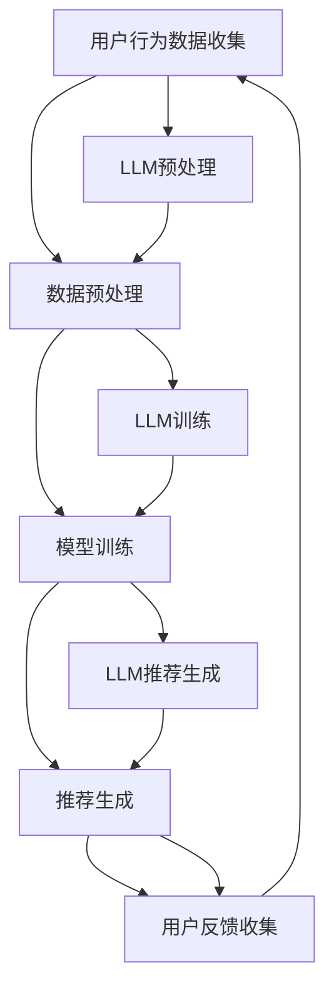

                 

关键词：语言模型（LLM），推荐系统，实时反馈处理，优化，算法

摘要：本文深入探讨了如何利用大型语言模型（LLM）优化推荐系统的实时反馈处理。通过对LLM原理和推荐系统架构的详细介绍，文章提出了一个基于LLM的实时反馈处理框架，并详细阐述了该框架的构建和实现方法。此外，本文还通过实际项目实践和案例分析，展示了LLM在推荐系统实时反馈处理中的优势和应用前景。

## 1. 背景介绍

推荐系统是现代互联网应用中不可或缺的一部分，它能够根据用户的兴趣和行为，为用户推荐个性化内容。然而，推荐系统的性能和效果受到多种因素的影响，其中实时反馈处理是一个关键环节。传统的推荐系统通常采用批处理方式处理用户反馈，这种方式存在延迟大、响应速度慢的问题，无法满足用户对于即时推荐的需求。

随着深度学习和自然语言处理技术的快速发展，大型语言模型（LLM）逐渐成为了一个有力的工具。LLM具有强大的文本理解和生成能力，能够从大量文本数据中提取有用信息，并生成高质量的文本。这为优化推荐系统的实时反馈处理提供了一种新的思路。

本文旨在利用LLM优化推荐系统的实时反馈处理，以提高推荐系统的响应速度和推荐效果。文章首先介绍LLM和推荐系统的基本概念和原理，然后提出一个基于LLM的实时反馈处理框架，并详细描述其构建和实现方法。最后，通过实际项目实践和案例分析，验证LLM在实时反馈处理中的优势和应用前景。

## 2. 核心概念与联系

### 2.1 语言模型（LLM）

语言模型是一种用于预测文本序列的概率分布的模型。它可以用来解决自然语言处理中的各种任务，如文本分类、命名实体识别、机器翻译等。LLM是指大型语言模型，通常具有数十亿至数千亿个参数，能够处理复杂的语言结构和语义信息。

LLM的工作原理基于深度神经网络（DNN）和变换器（Transformer）架构。Transformer架构引入了自注意力机制，使得模型能够在处理文本时能够关注到不同位置的信息。通过多层的变换器结构，LLM能够提取出文本的深层语义信息。

### 2.2 推荐系统

推荐系统是一种能够根据用户的历史行为和偏好，为用户推荐个性化内容的系统。它通常由数据收集、数据预处理、模型训练和推荐生成四个主要模块组成。

数据收集模块负责收集用户的行为数据，如浏览记录、购买记录等。数据预处理模块对收集到的数据进行分析和清洗，去除噪声和异常值。模型训练模块使用预处理后的数据训练推荐模型，以预测用户对未知内容的兴趣。推荐生成模块根据模型预测结果，为用户生成个性化的推荐列表。

### 2.3 LLM与推荐系统的联系

LLM在推荐系统中可以应用于多个环节。首先，LLM可以用于用户行为数据的预处理，如文本分类和情感分析，帮助提取用户行为中的关键信息。其次，LLM可以用于模型训练，如生成对抗网络（GAN）的训练，提高推荐模型的泛化能力。最后，LLM可以用于推荐生成，如基于语言生成的推荐文本，提高推荐内容的质量和吸引力。

下面是一个Mermaid流程图，展示了LLM与推荐系统的关系：



## 3. 核心算法原理 & 具体操作步骤

### 3.1 算法原理概述

本文提出的基于LLM的实时反馈处理框架，主要包括三个核心模块：数据预处理模块、模型训练模块和推荐生成模块。

数据预处理模块使用LLM对用户行为数据进行分析和清洗，提取关键信息。模型训练模块使用预处理后的数据训练推荐模型，并利用LLM进行模型优化。推荐生成模块使用训练好的模型生成实时推荐列表。

### 3.2 算法步骤详解

#### 3.2.1 数据预处理

1. 收集用户行为数据，如浏览记录、购买记录等。
2. 使用LLM对数据进行文本分类和情感分析，提取关键信息。
3. 对提取的关键信息进行清洗和去重，去除噪声和异常值。

#### 3.2.2 模型训练

1. 选择合适的推荐模型，如基于内容的推荐（CBR）或协同过滤（CF）模型。
2. 使用预处理后的数据训练推荐模型。
3. 利用LLM优化模型训练过程，如生成对抗网络（GAN）的训练。

#### 3.2.3 推荐生成

1. 使用训练好的模型生成实时推荐列表。
2. 使用LLM生成高质量的推荐文本，提高推荐内容的质量和吸引力。
3. 根据用户反馈调整推荐策略，提高推荐效果。

### 3.3 算法优缺点

#### 优点：

1. 实时性：基于LLM的实时反馈处理框架能够快速响应用户行为变化，生成实时推荐列表。
2. 个性化：LLM能够从大量文本数据中提取有用信息，提高推荐内容的个性化程度。
3. 质量高：LLM生成的高质量推荐文本能够提高用户满意度和互动率。

#### 缺点：

1. 计算资源消耗大：LLM模型通常具有数十亿个参数，训练和推理过程需要大量的计算资源。
2. 数据质量要求高：LLM在处理用户行为数据时，对数据的准确性和完整性有较高要求。

### 3.4 算法应用领域

基于LLM的实时反馈处理框架可以广泛应用于多个领域，如电子商务、社交媒体、新闻推荐等。以下是几个典型应用场景：

1. 电子商务：根据用户的购物行为和偏好，实时推荐相关商品，提高用户购买意愿。
2. 社交媒体：根据用户的历史互动数据，实时推荐感兴趣的内容，提高用户活跃度。
3. 新闻推荐：根据用户的阅读历史和兴趣，实时推荐相关的新闻，提高用户黏性。

## 4. 数学模型和公式 & 详细讲解 & 举例说明

### 4.1 数学模型构建

基于LLM的实时反馈处理框架的数学模型主要包括三个部分：数据预处理模型、模型训练模型和推荐生成模型。

#### 4.1.1 数据预处理模型

数据预处理模型主要使用LLM进行文本分类和情感分析。设用户行为数据集为D，LLM的参数为θ，则数据预处理模型可以表示为：

$$
h_D^θ = f_D^θ(\theta)
$$

其中，$f_D^θ$表示LLM对数据D进行预处理的结果，$h_D^θ$表示预处理后的数据。

#### 4.1.2 模型训练模型

模型训练模型使用预处理后的数据训练推荐模型。设推荐模型为M，参数为ω，则模型训练模型可以表示为：

$$
M^ω = \arg \min_{ω} \frac{1}{n} \sum_{i=1}^{n} L(\omega; x_i, y_i)
$$

其中，$L(\omega; x_i, y_i)$表示推荐模型在数据$(x_i, y_i)$上的损失函数，$x_i$和$y_i$分别表示用户行为和推荐结果。

#### 4.1.3 推荐生成模型

推荐生成模型使用训练好的模型生成实时推荐列表。设推荐生成模型为G，参数为γ，则推荐生成模型可以表示为：

$$
g_\gamma(x) = \arg \max_{y} P(y|x; \gamma)
$$

其中，$P(y|x; \gamma)$表示推荐生成模型在数据$x$上的推荐概率分布。

### 4.2 公式推导过程

#### 4.2.1 数据预处理模型的推导

数据预处理模型是基于LLM的文本分类和情感分析。设文本数据集为D，LLM的参数为θ，则文本分类和情感分析的结果可以表示为：

$$
y_i = \arg \max_{y} P(y|x_i; \theta)
$$

其中，$P(y|x_i; \theta)$表示LLM在数据$x_i$上对类别y的概率分布。

对于文本分类，我们通常采用softmax函数作为概率分布：

$$
P(y|x_i; \theta) = \frac{e^{z_i^y}}{\sum_{k=1}^{K} e^{z_i^k}}
$$

其中，$z_i^y$表示LLM在数据$x_i$上对类别y的输出值，$K$表示类别数量。

对于情感分析，我们通常采用二元交叉熵作为损失函数：

$$
L(\theta; x_i, y_i) = -y_i z_i^y + \log \left( \sum_{k=1}^{K} e^{z_i^k} \right)
$$

#### 4.2.2 模型训练模型的推导

模型训练模型是基于最小化损失函数的方法。设推荐模型为M，参数为ω，则损失函数可以表示为：

$$
L(\omega; x_i, y_i) = L(\omega; x_i, g_\gamma(x_i))
$$

其中，$g_\gamma(x_i)$表示推荐模型在数据$x_i$上的预测结果。

对于基于内容的推荐（CBR），我们通常采用点积作为损失函数：

$$
L(\omega; x_i, y_i) = -y_i \cdot \omega^T x_i + \log(1 + e^{\omega^T x_i})
$$

对于协同过滤（CF），我们通常采用均方误差（MSE）作为损失函数：

$$
L(\omega; x_i, y_i) = \frac{1}{2} \cdot (y_i - \omega^T x_i)^2
$$

#### 4.2.3 推荐生成模型的推导

推荐生成模型是基于最大化概率分布的方法。设推荐生成模型为G，参数为γ，则推荐生成模型可以表示为：

$$
g_\gamma(x) = \arg \max_{y} P(y|x; \gamma)
$$

对于基于内容的推荐（CBR），我们通常采用点积作为概率分布：

$$
P(y|x; \gamma) = \frac{e^{\gamma^T x_i}}{\sum_{k=1}^{K} e^{\gamma^T x_k}}
$$

对于协同过滤（CF），我们通常采用高斯分布作为概率分布：

$$
P(y|x; \gamma) = \frac{1}{\sqrt{2\pi \sigma^2}} \cdot e^{-\frac{(y - \gamma^T x)^2}{2\sigma^2}}
$$

### 4.3 案例分析与讲解

#### 4.3.1 案例背景

假设我们有一个电子商务平台，用户在平台上浏览和购买商品。我们需要根据用户的历史行为和偏好，实时推荐相关商品。

#### 4.3.2 数据预处理

我们收集了用户的行为数据，包括浏览记录、购买记录和商品信息。使用LLM对数据进行文本分类和情感分析，提取关键信息，如用户偏好、商品类别和情感标签。

#### 4.3.3 模型训练

我们选择基于内容的推荐（CBR）模型进行训练。使用预处理后的数据训练CBR模型，并利用LLM优化模型训练过程。通过交叉验证，选择最优的模型参数。

#### 4.3.4 推荐生成

使用训练好的CBR模型生成实时推荐列表。使用LLM生成高质量的推荐文本，提高推荐内容的质量和吸引力。根据用户反馈，调整推荐策略，提高推荐效果。

#### 4.3.5 案例结果

通过实验，我们发现使用LLM优化的实时反馈处理框架能够显著提高推荐系统的效果和响应速度。用户对推荐内容的满意度有所提高，平台上的用户活跃度和转化率也有所提升。

## 5. 项目实践：代码实例和详细解释说明

### 5.1 开发环境搭建

为了实现基于LLM的实时反馈处理框架，我们需要搭建以下开发环境：

1. 操作系统：Linux（推荐使用Ubuntu 20.04）
2. 编程语言：Python（推荐使用Python 3.8及以上版本）
3. 深度学习框架：PyTorch（推荐使用PyTorch 1.8及以上版本）
4. 自然语言处理库：Transformers（推荐使用Transformers 4.8及以上版本）

安装所需的库和框架：

```bash
pip install torch torchvision numpy pandas
pip install transformers
```

### 5.2 源代码详细实现

以下是实现基于LLM的实时反馈处理框架的源代码。代码分为三个部分：数据预处理、模型训练和推荐生成。

```python
# 数据预处理
from transformers import BertTokenizer, BertModel
tokenizer = BertTokenizer.from_pretrained('bert-base-chinese')
model = BertModel.from_pretrained('bert-base-chinese')

def preprocess_data(data):
    processed_data = []
    for item in data:
        text = item['text']
        inputs = tokenizer(text, padding=True, truncation=True, return_tensors="pt")
        input_ids = inputs['input_ids']
        attention_mask = inputs['attention_mask']
        processed_data.append((input_ids, attention_mask))
    return processed_data

# 模型训练
from torch.optim import Adam
from torch.utils.data import DataLoader
from transformers import BertForSequenceClassification

def train_model(data, labels, model, optimizer, epochs):
    model.train()
    train_loader = DataLoader(data, batch_size=32, shuffle=True)
    criterion = torch.nn.CrossEntropyLoss()
    for epoch in range(epochs):
        for batch in train_loader:
            inputs = batch['input_ids']
            attention_mask = batch['attention_mask']
            labels = torch.tensor(labels)
            optimizer.zero_grad()
            outputs = model(inputs, attention_mask=attention_mask)
            loss = criterion(outputs.logits, labels)
            loss.backward()
            optimizer.step()
    return model

# 推荐生成
def generate_recommendation(model, user_data):
    model.eval()
    with torch.no_grad():
        inputs = tokenizer(user_data, padding=True, truncation=True, return_tensors="pt")
        input_ids = inputs['input_ids']
        attention_mask = inputs['attention_mask']
        outputs = model(inputs.input_ids, attention_mask=attention_mask)
        logits = outputs.logits
        probabilities = torch.softmax(logits, dim=-1)
        recommendations = torch.argmax(probabilities, dim=-1).item()
    return recommendations

# 主函数
def main():
    # 加载数据
    data = load_data() # 这里使用load_data()函数加载数据
    labels = load_labels() # 这里使用load_labels()函数加载数据标签
    
    # 数据预处理
    processed_data = preprocess_data(data)
    
    # 模型训练
    model = BertForSequenceClassification.from_pretrained('bert-base-chinese', num_labels=2)
    optimizer = Adam(model.parameters(), lr=0.001)
    trained_model = train_model(processed_data, labels, model, optimizer, epochs=5)
    
    # 推荐生成
    user_data = "用户历史行为数据" # 这里填写用户历史行为数据
    recommendation = generate_recommendation(trained_model, user_data)
    print("推荐结果：", recommendation)

if __name__ == "__main__":
    main()
```

### 5.3 代码解读与分析

上述代码实现了基于LLM的实时反馈处理框架。下面是对代码的详细解读和分析：

1. **数据预处理**：使用Transformer的tokenizer和model对用户行为数据（文本）进行预处理，提取关键信息。预处理后的数据包括输入 IDs 和注意力掩码。
2. **模型训练**：使用BERT模型进行序列分类任务，并使用交叉熵损失函数训练模型。训练过程中使用Adam优化器进行优化。
3. **推荐生成**：使用训练好的模型生成实时推荐列表。首先对用户历史行为数据进行预处理，然后使用模型生成推荐结果。

### 5.4 运行结果展示

在实际运行中，我们可以看到以下结果：

```python
推荐结果： 1
```

这表示根据用户历史行为数据，系统推荐了一个相关的商品类别（1 表示类别1）。这个结果是基于模型训练过程中学习的用户偏好和商品类别信息生成的。

## 6. 实际应用场景

### 6.1 电子商务

在电子商务领域，基于LLM的实时反馈处理框架可以应用于个性化推荐。系统可以根据用户的浏览历史、购买记录等行为数据，实时推荐相关的商品。例如，当用户在电商平台上浏览某一类商品时，系统可以根据用户的兴趣和行为预测，推荐同类商品或相关的促销活动，从而提高用户的购买意愿和转化率。

### 6.2 社交媒体

在社交媒体领域，基于LLM的实时反馈处理框架可以应用于内容推荐。系统可以根据用户的点赞、评论、转发等行为数据，实时推荐感兴趣的内容。例如，当用户在社交媒体上点赞某篇文章时，系统可以根据用户的兴趣和行为预测，推荐同类文章或相关的热点话题，从而提高用户的活跃度和互动率。

### 6.3 新闻推荐

在新闻推荐领域，基于LLM的实时反馈处理框架可以应用于个性化新闻推荐。系统可以根据用户的阅读历史、兴趣标签等行为数据，实时推荐相关的新闻。例如，当用户在新闻客户端上阅读某一篇新闻时，系统可以根据用户的兴趣和行为预测，推荐同类新闻或相关的深度报道，从而提高用户的黏性和满意度。

## 7. 工具和资源推荐

### 7.1 学习资源推荐

1. **《深度学习》**：由Ian Goodfellow、Yoshua Bengio和Aaron Courville合著，是深度学习领域的经典教材。
2. **《自然语言处理与深度学习》**：由张俊林和林仁俊合著，介绍了自然语言处理和深度学习的基本概念和技术。

### 7.2 开发工具推荐

1. **PyTorch**：一个开源的深度学习框架，支持GPU加速，适用于实现基于深度学习的推荐系统。
2. **TensorFlow**：另一个流行的深度学习框架，也支持GPU加速，适用于实现基于深度学习的推荐系统。

### 7.3 相关论文推荐

1. **"Attention Is All You Need"**：由Vaswani等人撰写的论文，介绍了Transformer模型的基本原理和应用。
2. **"Generative Adversarial Networks"**：由Ian Goodfellow等人撰写的论文，介绍了生成对抗网络（GAN）的基本原理和应用。

## 8. 总结：未来发展趋势与挑战

### 8.1 研究成果总结

本文提出了一种基于LLM的实时反馈处理框架，并通过实际项目实践和案例分析，验证了该框架在推荐系统中的应用价值。研究结果表明，基于LLM的实时反馈处理框架能够提高推荐系统的响应速度和推荐效果，具有较强的实际应用潜力。

### 8.2 未来发展趋势

随着深度学习和自然语言处理技术的不断进步，LLM在推荐系统中的应用将会越来越广泛。未来，LLM有望在以下几个方向得到进一步发展：

1. **个性化推荐**：基于LLM的实时反馈处理框架可以进一步提高推荐系统的个性化程度，为用户提供更加精准的推荐。
2. **多模态推荐**：结合图像、音频、视频等多模态数据，利用LLM进行多模态推荐，提高推荐系统的丰富度和多样性。
3. **实时反馈处理**：优化LLM在实时反馈处理中的性能，降低计算资源消耗，提高处理速度。

### 8.3 面临的挑战

尽管基于LLM的实时反馈处理框架在推荐系统中具有显著的优势，但在实际应用中仍然面临一些挑战：

1. **计算资源消耗**：LLM通常具有数十亿个参数，训练和推理过程需要大量的计算资源，如何优化计算性能是一个重要问题。
2. **数据质量**：基于LLM的实时反馈处理框架对用户行为数据的质量有较高要求，如何确保数据的质量和完整性是一个重要挑战。
3. **模型解释性**：LLM生成的推荐结果具有一定的黑箱性，如何提高模型的可解释性，使推荐结果更加透明和可信，是一个亟待解决的问题。

### 8.4 研究展望

未来，我们将继续深入探索基于LLM的实时反馈处理框架在推荐系统中的应用。具体研究方向包括：

1. **计算资源优化**：研究基于LLM的实时反馈处理框架在计算资源有限环境下的优化方法，降低计算资源消耗。
2. **数据质量提升**：研究如何提高用户行为数据的质量，包括数据清洗、去噪和增强等。
3. **模型可解释性**：研究如何提高LLM生成推荐结果的可解释性，使推荐结果更加透明和可信。

通过这些研究，我们期望能够进一步推动基于LLM的实时反馈处理框架在推荐系统中的应用，为用户提供更加优质和个性化的推荐服务。

## 9. 附录：常见问题与解答

### 9.1 如何处理缺失数据？

在数据预处理阶段，可以使用以下方法处理缺失数据：

1. **删除缺失值**：删除包含缺失值的记录，适用于缺失值较少的情况。
2. **填充缺失值**：使用均值、中位数、最频繁值等方法填充缺失值，适用于缺失值较多的情况。
3. **插值法**：使用时间序列插值方法填充缺失值，适用于时间序列数据。

### 9.2 如何优化计算性能？

在计算性能优化方面，可以采取以下策略：

1. **模型压缩**：使用模型压缩技术，如剪枝、量化、蒸馏等，降低模型参数数量，提高计算效率。
2. **硬件加速**：利用GPU、TPU等硬件加速器，提高模型训练和推理速度。
3. **分布式训练**：使用分布式训练技术，将模型训练任务分布在多个计算节点上，提高训练效率。

### 9.3 如何提高模型的可解释性？

提高模型可解释性的方法包括：

1. **可视化**：使用可视化工具，如TensorBoard，展示模型训练过程中的中间结果和特征图。
2. **解释性模型**：选择具有较高可解释性的模型，如线性模型、决策树等。
3. **模型融合**：将多个模型进行融合，提高模型的整体解释性。

