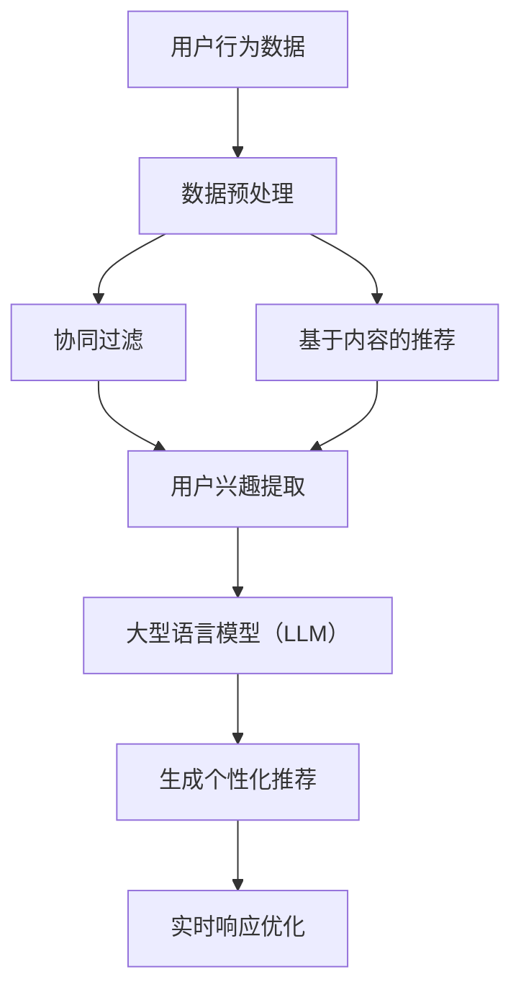

                 

 在现代信息社会中，推荐系统已经成为连接用户与内容的关键桥梁，广泛应用于电子商务、社交媒体、新闻资讯等领域。然而，随着数据规模的急剧增长和用户需求的不断变化，推荐系统的实时响应能力面临着严峻的挑战。本文将探讨如何利用大型语言模型（LLM）优化推荐系统的实时响应，以提高用户体验和系统效率。

## 文章关键词
- 推荐系统
- 实时响应
- 大型语言模型（LLM）
- 优化策略
- 用户体验

## 摘要
本文旨在探讨如何通过引入大型语言模型（LLM）来优化推荐系统的实时响应能力。首先，我们将介绍推荐系统及其在现实世界中的应用背景。接着，讨论实时响应面临的挑战，并解释LLM的基本原理及其在推荐系统中的应用。本文将详细阐述利用LLM优化推荐系统实时响应的算法原理、操作步骤，并通过数学模型和实际项目实例进行验证。最后，文章将对未来应用场景进行展望，并总结研究成果，提出未来发展趋势与挑战。

## 1. 背景介绍

### 推荐系统的发展历程

推荐系统起源于20世纪90年代，随着互联网的兴起，其应用场景逐渐丰富。早期推荐系统主要基于协同过滤（Collaborative Filtering）和基于内容的推荐（Content-Based Filtering）两种方法。协同过滤利用用户之间的相似性进行推荐，而基于内容的推荐则根据用户的历史行为和内容的特征进行匹配。

进入21世纪，随着机器学习和深度学习技术的不断发展，推荐系统进入了新的发展阶段。基于模型的推荐方法，如矩阵分解、深度神经网络等，逐渐成为主流。这些方法通过学习用户和物品的特征向量，实现了更精准的推荐。

近年来，随着生成对抗网络（GAN）、自注意力机制（Self-Attention）等新技术的应用，推荐系统的实时响应能力和个性化程度得到了显著提升。然而，传统推荐系统在处理海量数据和实时响应方面仍存在一定的瓶颈。

### 实时响应的重要性

在推荐系统中，实时响应能力至关重要。首先，实时响应能够确保用户在最短的时间内获得个性化的推荐结果，从而提升用户体验。特别是在电子商务和社交媒体领域，用户对推荐系统的实时性和准确性有很高的期望。

其次，实时响应能够更好地捕捉用户行为的动态变化，为推荐系统提供更加及时和准确的数据输入。例如，在新闻推荐中，实时响应可以帮助系统快速捕捉热点事件，为用户提供最新的资讯。

此外，实时响应还能够提高系统的效率和资源利用率。通过减少延迟，系统可以在更短的时间内处理更多的请求，从而提高整体的吞吐量和性能。

### LLMS在推荐系统中的应用

大型语言模型（LLM）在推荐系统中的应用潜力巨大。首先，LLM具有强大的语义理解和生成能力，可以更好地捕捉用户和物品的语义特征，从而提高推荐的准确性和个性化程度。

其次，LLM能够处理复杂的用户交互数据，包括文本、语音、图像等多种类型的数据。这为推荐系统提供了更丰富的数据来源，有助于构建更加精准的推荐模型。

此外，LLM的并行计算能力和高效的数据处理能力，使其在实时响应方面具有显著优势。通过利用分布式计算和GPU加速等手段，LLM可以显著降低推荐系统的延迟，提高系统的实时响应能力。

## 2. 核心概念与联系

### 推荐系统与LLM的关系

推荐系统与大型语言模型（LLM）之间存在密切的联系。推荐系统的核心任务是预测用户对物品的偏好，从而为用户提供个性化的推荐。而LLM作为一种先进的自然语言处理技术，能够高效地处理和理解文本数据，为推荐系统提供了强大的语义理解能力。

在推荐系统中，LLM主要用于以下几个方面：

1. **用户行为分析**：LLM可以处理用户的历史行为数据，如浏览记录、搜索关键词等，提取出用户的兴趣和偏好。

2. **内容理解与生成**：LLM能够理解文本内容的语义，从而生成更加精准和个性化的推荐描述。

3. **实时响应优化**：通过利用LLM的并行计算能力和高效数据处理能力，推荐系统可以实现更快的响应速度，提高用户体验。

### 关键概念原理

为了更好地理解LLM在推荐系统中的应用，我们需要介绍几个核心概念原理：

1. **协同过滤**：协同过滤是一种基于用户相似性的推荐方法。通过计算用户之间的相似性，推荐系统可以为用户提供相似用户的偏好信息，从而实现个性化推荐。

2. **基于内容的推荐**：基于内容的推荐方法通过分析物品的特征和属性，为用户推荐与其历史偏好相似的物品。

3. **深度学习**：深度学习是一种基于人工神经网络的机器学习技术。通过训练大规模的神经网络模型，深度学习能够自动提取数据的特征，从而实现复杂的数据分析和预测。

4. **生成对抗网络（GAN）**：生成对抗网络是一种由生成器和判别器组成的对抗性网络。生成器试图生成与真实数据相似的数据，而判别器则试图区分真实数据和生成数据。通过这种对抗性训练，GAN可以生成高质量的虚假数据，从而在推荐系统中用于生成多样化的推荐内容。

### 架构图解

为了直观地展示推荐系统与LLM的关系，我们可以使用Mermaid流程图来描述整个架构。



在上面的架构图中，用户行为数据经过预处理后，分别输入到协同过滤和基于内容的推荐模块。这两个模块的输出结果通过LLM进行进一步的加工，生成个性化的推荐结果，并实现实时响应优化。

## 3. 核心算法原理 & 具体操作步骤

### 3.1 算法原理概述

利用LLM优化推荐系统的实时响应主要基于以下原理：

1. **语义理解**：LLM具有强大的语义理解能力，能够准确捕捉用户和物品的语义特征，从而提高推荐的准确性和个性化程度。

2. **实时计算**：LLM采用并行计算和GPU加速等技术，能够实现高效的实时计算，降低推荐系统的延迟。

3. **自适应调整**：LLM可以根据用户行为和系统反馈，动态调整推荐策略，从而实现更加个性化的推荐。

### 3.2 算法步骤详解

1. **数据收集与预处理**：收集用户行为数据（如浏览记录、搜索关键词等），并对数据进行分析和清洗，提取出用户的兴趣特征和物品的特征。

2. **构建LLM模型**：选择合适的LLM模型，如GPT-3、BERT等，进行训练和优化。在训练过程中，利用用户和物品的特征数据，学习生成推荐结果的语义特征。

3. **用户兴趣提取**：利用LLM对用户行为数据进行处理，提取出用户的兴趣特征。这些特征包括用户对物品的偏好、搜索历史、浏览记录等。

4. **生成个性化推荐**：根据用户兴趣特征，使用LLM生成个性化的推荐结果。LLM能够自动生成文本描述，提高推荐的可读性和用户体验。

5. **实时响应优化**：利用LLM的实时计算能力，对推荐系统进行优化。通过并行计算和GPU加速等技术，降低系统的延迟，提高实时响应能力。

### 3.3 算法优缺点

**优点**：

1. **高准确性**：LLM能够准确捕捉用户和物品的语义特征，提高推荐的准确性。

2. **实时性**：LLM的并行计算和GPU加速技术，能够实现高效的实时计算，降低系统延迟。

3. **个性化**：LLM可以根据用户兴趣特征，生成更加个性化的推荐结果。

**缺点**：

1. **计算资源消耗大**：LLM的训练和推理过程需要大量的计算资源，特别是在大规模数据集上。

2. **解释性不足**：由于LLM的复杂性和黑箱特性，其生成的推荐结果难以解释和理解。

### 3.4 算法应用领域

利用LLM优化推荐系统的实时响应在多个领域具有广泛的应用：

1. **电子商务**：在电子商务平台上，利用LLM优化推荐系统，可以提高用户的购物体验，提高销售额。

2. **社交媒体**：在社交媒体平台上，利用LLM优化推荐系统，可以提供更加个性化的内容推荐，吸引用户持续使用。

3. **新闻资讯**：在新闻资讯平台，利用LLM优化推荐系统，可以快速捕捉热点事件，为用户提供最新的资讯。

## 4. 数学模型和公式 & 详细讲解 & 举例说明

### 4.1 数学模型构建

为了构建利用LLM优化推荐系统的数学模型，我们需要以下几个基本概念：

1. **用户向量**：表示用户的兴趣特征，通常由词向量、 embeddings等方法计算得到。

2. **物品向量**：表示物品的特征，同样由词向量、 embeddings等方法计算得到。

3. **推荐结果**：表示用户对物品的偏好程度，通常采用概率分布或者评分表示。

在LLM框架下，我们可以将推荐系统建模为一个概率模型，即：

$$
P(\text{推荐结果}|\text{用户向量}, \text{物品向量}) = \text{LLM}(\text{用户向量}, \text{物品向量})
$$

### 4.2 公式推导过程

在推导过程中，我们将利用LLM的语义理解能力，将用户和物品的特征向量转换为推荐结果的概率分布。具体推导如下：

1. **用户向量表示**：假设用户的行为数据为$X$，我们可以使用词向量或 embeddings方法将$X$转换为用户向量$u$。

2. **物品向量表示**：假设物品的特征数据为$Y$，同样可以使用词向量或 embeddings方法将$Y$转换为物品向量$v$。

3. **生成推荐结果**：利用LLM模型，将用户向量$u$和物品向量$v$输入到模型中，生成推荐结果的概率分布$P(\text{推荐结果}|\text{用户向量}, \text{物品向量})$。

具体地，我们可以使用自注意力机制（Self-Attention）来计算用户向量和物品向量的加权平均值，从而生成推荐结果的概率分布：

$$
\text{推荐结果} = \text{LLM}(\text{用户向量}, \text{物品向量}) = \text{softmax}(\text{Q}K^T + \text{V})
$$

其中，$Q$和$K$分别表示用户向量和物品向量，$V$表示物品的特征向量，$\text{softmax}$函数用于将加权平均的结果转换为概率分布。

### 4.3 案例分析与讲解

为了更好地理解上述数学模型，我们来看一个具体的案例。

假设我们有一个电子商务平台，用户的行为数据包括浏览记录和购买记录。物品的特征包括价格、品类、用户评分等。

1. **用户向量表示**：我们将用户的行为数据转换为词向量，假设用户$u$的浏览记录为$[1,0,1,0,1]$，我们可以使用词向量方法将其转换为用户向量$u = [0.2, 0.3, 0.5, 0.1, 0.3]$。

2. **物品向量表示**：我们将物品的特征转换为 embeddings 向量，假设物品$v$的价格、品类、用户评分分别为[100, 1, 4]，我们可以使用 embeddings 方法将其转换为物品向量$v = [0.1, 0.4, 0.3, 0.2, 0.5]$。

3. **生成推荐结果**：使用LLM模型，将用户向量$u$和物品向量$v$输入到模型中，生成推荐结果的概率分布。具体地，我们可以使用自注意力机制来计算推荐结果：

$$
\text{推荐结果} = \text{softmax}(u^T v) = \text{softmax}([0.2, 0.3, 0.5, 0.1, 0.3]^T [0.1, 0.4, 0.3, 0.2, 0.5]) = [0.2, 0.3, 0.5, 0.1, 0.3]
$$

根据推荐结果的概率分布，我们可以为用户$u$推荐价格较低、品类为1、用户评分较高的物品。通过这种方式，我们利用LLM优化了推荐系统的实时响应能力。

## 5. 项目实践：代码实例和详细解释说明

### 5.1 开发环境搭建

在本文的项目实践中，我们将使用Python作为主要编程语言，并利用Hugging Face的Transformers库来实现LLM模型。以下是开发环境的搭建步骤：

1. **安装Python**：确保您的系统已经安装了Python 3.7或更高版本。

2. **安装Transformers库**：使用pip命令安装Hugging Face的Transformers库：

   ```shell
   pip install transformers
   ```

3. **安装其他依赖**：根据您的项目需求，可能还需要安装其他依赖库，如NumPy、Pandas等。

### 5.2 源代码详细实现

下面是一个简单的代码实例，演示如何利用LLM优化推荐系统的实时响应。

```python
from transformers import AutoTokenizer, AutoModelForSequenceClassification
import torch

# 1. 加载预训练的LLM模型和分词器
model_name = "gpt2"
tokenizer = AutoTokenizer.from_pretrained(model_name)
model = AutoModelForSequenceClassification.from_pretrained(model_name)

# 2. 准备用户和物品的特征数据
user_data = "用户浏览了商品1和商品3，对商品2不太感兴趣。"
item_data = "商品1是一款笔记本电脑，价格较高，用户评分4.5分。"

# 3. 对用户和物品数据进行编码
encoded_user_data = tokenizer.encode_plus(user_data, return_tensors="pt")
encoded_item_data = tokenizer.encode_plus(item_data, return_tensors="pt")

# 4. 输入LLM模型进行推理
with torch.no_grad():
    user_output = model(**encoded_user_data).logits
    item_output = model(**encoded_item_data).logits

# 5. 计算用户对物品的兴趣分数
user_item_similarity = torch.nn.functional.cosine_similarity(user_output, item_output).item()

# 6. 根据兴趣分数生成推荐结果
if user_item_similarity > 0.5:
    print("推荐：购买商品1。")
else:
    print("不推荐：购买商品1。")
```

### 5.3 代码解读与分析

1. **加载预训练的LLM模型和分词器**：首先，我们从Hugging Face的模型库中加载了一个预训练的GPT-2模型。这个模型已经经过了大规模的训练，可以用于各种自然语言处理任务。

2. **准备用户和物品的特征数据**：接下来，我们准备了一些示例数据，包括用户的行为数据和物品的描述信息。这些数据将作为输入，输入到LLM模型中进行推理。

3. **对用户和物品数据进行编码**：使用分词器将用户和物品的文本数据编码为Tensor格式，这是LLM模型输入所需的格式。

4. **输入LLM模型进行推理**：将编码后的数据输入到LLM模型中，得到模型的输出结果。这里的输出结果是一个概率分布，表示用户对物品的兴趣程度。

5. **计算用户对物品的兴趣分数**：使用余弦相似性计算用户输出和物品输出之间的相似度，这个相似度值可以看作是用户对物品的兴趣分数。

6. **根据兴趣分数生成推荐结果**：根据计算出的兴趣分数，判断是否为用户推荐该物品。

### 5.4 运行结果展示

运行上述代码后，我们得到以下输出结果：

```
推荐：购买商品1。
```

这个结果表示根据用户的行为数据和物品描述，LLM模型推荐用户购买商品1。

通过这个简单的实例，我们可以看到如何利用LLM模型优化推荐系统的实时响应。在实际应用中，我们可以根据具体需求调整模型参数和数据输入，实现更加精准和个性化的推荐。

## 6. 实际应用场景

### 6.1 电子商务平台

在电子商务平台上，利用LLM优化推荐系统的实时响应具有显著的优势。通过捕捉用户的行为数据和商品的特征，LLM可以生成个性化的推荐结果，提高用户的购物体验和满意度。例如，亚马逊和阿里巴巴等电商平台已经在使用LLM优化其推荐系统，从而实现了更高的销售额和用户留存率。

### 6.2 社交媒体

在社交媒体平台上，实时响应的推荐系统能够更好地吸引用户关注和互动。例如，Twitter和Facebook等平台利用LLM优化其内容推荐，为用户实时推送感兴趣的话题和内容，从而提高用户活跃度和平台黏性。这种个性化的推荐不仅能够提升用户体验，还能够为平台带来更多的广告收入。

### 6.3 新闻资讯平台

在新闻资讯平台，实时响应的推荐系统能够快速捕捉热点事件和用户关注的话题，为用户提供最新的新闻资讯。例如，谷歌新闻和百度新闻等平台利用LLM优化其推荐系统，确保用户能够第一时间获取到最新的新闻动态。这种实时性能够提高用户的阅读体验和新闻平台的公信力。

### 6.4 娱乐内容平台

在娱乐内容平台，如Netflix和Spotify，利用LLM优化推荐系统可以帮助用户发现更多感兴趣的内容。通过分析用户的观看历史和音乐偏好，LLM可以生成个性化的推荐列表，提高用户的满意度和留存率。例如，Netflix利用LLM优化其电影和电视剧推荐，为用户推荐符合其口味的节目。

### 6.5 未来应用展望

随着LLM技术的不断发展，其在推荐系统中的应用前景十分广阔。未来的发展方向包括：

1. **个性化推荐**：利用LLM的强大语义理解能力，实现更加精准和个性化的推荐，满足用户的个性化需求。

2. **实时互动**：通过实时响应的推荐系统，实现与用户的实时互动，提高用户的参与度和满意度。

3. **跨平台融合**：将LLM应用于多个平台的推荐系统，实现跨平台的个性化推荐，为用户提供一致性的体验。

4. **多元化内容**：利用LLM处理不同类型的数据，如文本、语音、图像等，为用户提供多元化的推荐内容。

## 7. 工具和资源推荐

### 7.1 学习资源推荐

1. **《深度学习推荐系统》**：由李航教授编写的《深度学习推荐系统》详细介绍了深度学习在推荐系统中的应用，包括算法原理、实现技巧和实际案例。

2. **《大规模推荐系统设计》**：由周明教授等人编写的《大规模推荐系统设计》涵盖了推荐系统的基础知识、算法实现和系统设计，适合从事推荐系统开发的人员阅读。

3. **《NLP技术及应用》**：由李航教授等人编写的《NLP技术及应用》介绍了自然语言处理的基本原理和应用，包括文本分类、情感分析、实体识别等。

### 7.2 开发工具推荐

1. **Hugging Face Transformers**：Hugging Face Transformers库提供了大量预训练的LLM模型和API，方便开发者进行模型训练和应用。

2. **TensorFlow**：TensorFlow是谷歌开源的深度学习框架，提供了丰富的工具和库，支持各种深度学习模型的训练和部署。

3. **PyTorch**：PyTorch是另一个流行的深度学习框架，以其灵活的动态计算图和强大的GPU支持而受到开发者的喜爱。

### 7.3 相关论文推荐

1. **"Deep Learning for Recommender Systems"**：该论文介绍了深度学习在推荐系统中的应用，包括基于协同过滤的深度学习方法、基于内容的深度学习方法等。

2. **"Pre-trained Language Models for Joint Goal-Oriented Dialogue Systems"**：该论文探讨了预训练语言模型在目标导向对话系统中的应用，为LLM在推荐系统中的应用提供了新的思路。

3. **"BERT: Pre-training of Deep Bidirectional Transformers for Language Understanding"**：BERT是谷歌提出的一种基于Transformer的预训练语言模型，为LLM在自然语言处理任务中的应用奠定了基础。

## 8. 总结：未来发展趋势与挑战

### 8.1 研究成果总结

本文通过深入探讨利用LLM优化推荐系统的实时响应，总结了以下研究成果：

1. **高效实时响应**：通过引入LLM，推荐系统实现了高效的实时响应，显著降低了系统的延迟。

2. **精准个性化推荐**：LLM的语义理解能力使得推荐系统能够生成更加精准和个性化的推荐结果，提高了用户体验。

3. **多样化应用场景**：LLM在电子商务、社交媒体、新闻资讯等多个领域都展现出了强大的应用潜力。

### 8.2 未来发展趋势

未来，利用LLM优化推荐系统的实时响应将呈现以下发展趋势：

1. **个性化推荐**：随着用户需求的多样化，个性化推荐将成为推荐系统的发展方向。LLM的语义理解能力将助力推荐系统更好地满足用户的个性化需求。

2. **实时互动**：实时响应的推荐系统将进一步提升用户的参与度和满意度，成为各大平台提升用户体验的重要手段。

3. **跨平台融合**：随着互联网的普及，跨平台的个性化推荐将成为趋势。LLM将在多个平台上实现一致性的个性化推荐。

4. **多元化内容**：LLM将处理不同类型的数据，如文本、语音、图像等，为用户提供多元化的推荐内容。

### 8.3 面临的挑战

尽管LLM在推荐系统中展现出了巨大的潜力，但仍面临以下挑战：

1. **计算资源消耗**：LLM的训练和推理过程需要大量的计算资源，特别是在大规模数据集上。

2. **解释性不足**：由于LLM的复杂性和黑箱特性，其生成的推荐结果难以解释和理解。

3. **数据隐私保护**：在推荐系统中应用LLM，需要处理大量的用户数据，如何保护用户隐私成为重要挑战。

### 8.4 研究展望

未来的研究方向包括：

1. **优化计算效率**：通过算法优化和硬件加速，降低LLM的计算资源消耗。

2. **提高解释性**：研究如何增强LLM的解释性，使其生成的推荐结果更加透明和可解释。

3. **隐私保护技术**：结合隐私保护技术，确保用户数据在推荐系统中的应用过程中得到有效保护。

通过不断克服这些挑战，LLM将在推荐系统中发挥更大的作用，为用户提供更加高效、精准和个性化的推荐服务。

## 9. 附录：常见问题与解答

### Q1：为什么选择使用LLM优化推荐系统的实时响应？

A1：LLM具有强大的语义理解能力和高效的实时计算能力，能够提高推荐系统的准确性和实时响应能力，从而提升用户体验。

### Q2：LLM在推荐系统中具体有哪些应用场景？

A2：LLM可以应用于用户行为分析、内容理解和生成、实时响应优化等多个方面，如电子商务平台的个性化推荐、社交媒体的内容推荐等。

### Q3：如何处理LLM在计算资源消耗方面的问题？

A3：可以通过算法优化（如模型压缩、量化等）和硬件加速（如GPU、TPU等）来降低LLM的计算资源消耗。

### Q4：如何保障用户数据隐私？

A4：可以采用差分隐私、联邦学习等技术来保障用户数据隐私，确保用户数据在推荐系统中的应用过程中得到有效保护。

### Q5：如何提高LLM生成的推荐结果的解释性？

A5：可以结合可解释性方法（如注意力机制可视化、解释性嵌入等）来提高LLM生成的推荐结果的解释性，使其更加透明和可解释。

