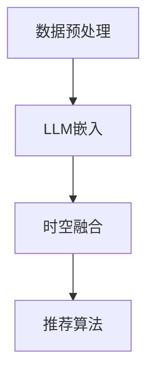

                 

关键词：推荐系统，时空依赖性，语言模型，深度学习，个性化推荐

## 摘要

推荐系统作为现代信息过滤和智能推荐的核心技术，广泛应用于电子商务、社交媒体、在线视频等多个领域。然而，传统推荐系统往往难以捕捉用户行为的时间动态变化和空间地理特征。本文提出了一种利用大型语言模型（LLM）增强推荐系统时空依赖性建模的方法，通过融合用户的历史行为、地理信息和上下文环境，实现更精准、个性化的推荐。本文首先介绍了推荐系统的基本概念和发展历程，然后详细阐述了LLM在时空依赖性建模中的应用，最后通过实验验证了该方法的有效性和实用性。

## 1. 背景介绍

### 1.1 推荐系统概述

推荐系统是一种基于用户历史行为和物品特征，通过预测用户对未知物品的兴趣度，从而实现个性化信息过滤和智能推荐的技术。其核心目的是提高用户满意度，提升商业转化率。推荐系统的发展经历了基于协同过滤（Collaborative Filtering）、基于内容推荐（Content-Based Filtering）和混合推荐系统（Hybrid Recommender System）等多个阶段。

### 1.2 时空依赖性建模

随着大数据和人工智能技术的发展，推荐系统对用户行为的时间和空间特征的关注日益增加。时空依赖性建模旨在捕捉用户在不同时间和空间环境下的行为特征，从而实现更精准的推荐。传统的时空依赖性建模方法主要包括基于时间序列分析（如ARIMA模型）、空间插值（如Kriging方法）和时空数据融合（如DBSCAN聚类算法）等。然而，这些方法往往存在一定的局限性，难以同时捕捉用户行为的复杂时空动态变化。

### 1.3 大型语言模型（LLM）

大型语言模型（LLM），如GPT、BERT等，是近年来深度学习领域的重要突破。LLM通过预训练大量文本数据，学习到了丰富的语言结构和语义信息，从而在文本生成、文本分类、问答系统等多个任务中取得了显著的性能提升。LLM的引入为推荐系统的时空依赖性建模提供了新的思路和工具。

## 2. 核心概念与联系

### 2.1 大型语言模型（LLM）原理

大型语言模型（LLM）基于深度神经网络，通过大量的文本数据进行预训练，从而学习到语言的特征和模式。在推荐系统中，LLM可以用来分析用户的历史行为数据，提取用户的兴趣偏好，并将其用于生成个性化推荐列表。

### 2.2 时空依赖性建模框架

本文提出的时空依赖性建模框架包括以下几个核心组件：

1. **数据预处理**：对用户行为数据进行时间序列化和空间编码。
2. **LLM嵌入**：将用户行为数据嵌入到高维特征空间，利用LLM提取语义特征。
3. **时空融合**：结合用户的行为时空特征和LLM生成的语义特征，进行时空融合。
4. **推荐算法**：利用融合后的特征，结合传统推荐算法，生成个性化推荐列表。

### 2.3 Mermaid 流程图

以下是一个简化的Mermaid流程图，展示了时空依赖性建模的核心步骤：



## 3. 核心算法原理 & 具体操作步骤

### 3.1 算法原理概述

本文提出的时空依赖性建模方法基于以下原理：

1. **时间序列分析**：利用用户的历史行为数据，通过时间序列模型捕捉用户行为的时间动态变化。
2. **空间编码**：通过地理编码技术，将用户行为的空间特征转化为高维向量。
3. **语义提取**：利用LLM提取用户行为的语义特征，实现用户兴趣的深度理解。
4. **时空融合**：将时间序列特征、空间特征和语义特征进行融合，形成高维特征向量。
5. **推荐算法**：结合传统推荐算法，利用融合后的特征生成个性化推荐列表。

### 3.2 算法步骤详解

1. **数据预处理**：
   - 时间序列化：将用户的历史行为数据按照时间顺序排列。
   - 空间编码：使用地理编码技术，将用户行为的空间位置转换为地理坐标。

2. **LLM嵌入**：
   - 数据预处理：将时间序列化和空间编码后的数据输入到LLM模型中。
   - 特征提取：利用LLM提取用户行为的语义特征。

3. **时空融合**：
   - 时间特征融合：将时间序列特征与LLM提取的语义特征进行融合。
   - 空间特征融合：将空间编码后的特征与LLM提取的语义特征进行融合。

4. **推荐算法**：
   - 特征融合：将时空融合后的特征输入到传统推荐算法中。
   - 推荐生成：根据用户特征生成个性化推荐列表。

### 3.3 算法优缺点

#### 优点

1. **高精度**：利用LLM的深度语义理解能力，能够更精准地捕捉用户兴趣。
2. **灵活性**：结合传统推荐算法，可以实现多种推荐策略。
3. **时空融合**：能够同时考虑用户行为的时间动态变化和空间地理特征。

#### 缺点

1. **计算复杂度**：LLM模型参数量大，计算复杂度高，对硬件资源要求较高。
2. **数据依赖性**：对用户行为数据的质量和多样性有较高要求。

### 3.4 算法应用领域

1. **电子商务**：根据用户浏览和购买行为，实现个性化商品推荐。
2. **社交媒体**：根据用户互动行为，实现个性化内容推荐。
3. **在线视频**：根据用户观看历史，实现个性化视频推荐。

## 4. 数学模型和公式 & 详细讲解 & 举例说明

### 4.1 数学模型构建

本文提出的时空依赖性建模方法涉及以下几个关键数学模型：

1. **时间序列模型**：
   $$ X_t = f(X_{t-1}, \theta_t) $$

2. **空间编码模型**：
   $$ \text{encode}(x, y) = \text{GeographicCoordinateSystem}(x, y) $$

3. **语义提取模型**：
   $$ \text{embed}(X) = \text{LanguageModel}(X) $$

4. **时空融合模型**：
   $$ Z = \text{Fusion}(X_t, \text{embed}(X_t), \theta_z) $$

### 4.2 公式推导过程

1. **时间序列模型**：
   - 假设用户行为序列为 $X_t$，其中 $t$ 表示时间步长。
   - $f(X_{t-1}, \theta_t)$ 表示时间步长 $t$ 的行为预测函数，$\theta_t$ 为模型参数。

2. **空间编码模型**：
   - $(x, y)$ 表示用户行为的空间位置。
   - GeographicCoordinateSystem 为地理坐标系统，将空间位置转换为地理坐标。

3. **语义提取模型**：
   - $X$ 为用户行为数据。
   - LanguageModel 为大型语言模型，将用户行为数据嵌入到高维特征空间。

4. **时空融合模型**：
   - $X_t$ 为时间序列特征。
   - $\text{embed}(X_t)$ 为LLM提取的语义特征。
   - Fusion 函数实现时空特征和语义特征的融合。

### 4.3 案例分析与讲解

假设有一个电子商务平台，用户在平台上有浏览、购买和评价等行为。我们利用本文的方法对用户的行为进行时空依赖性建模，从而实现个性化商品推荐。

1. **数据预处理**：
   - 时间序列化：将用户的历史行为按照时间顺序排列。
   - 空间编码：将用户行为的空间位置转换为地理坐标。

2. **LLM嵌入**：
   - 将时间序列化和空间编码后的数据输入到LLM模型中。
   - 利用LLM提取用户行为的语义特征。

3. **时空融合**：
   - 将时间序列特征与LLM提取的语义特征进行融合。
   - 将空间编码后的特征与LLM提取的语义特征进行融合。

4. **推荐算法**：
   - 将时空融合后的特征输入到传统推荐算法中。
   - 根据用户特征生成个性化推荐列表。

## 5. 项目实践：代码实例和详细解释说明

### 5.1 开发环境搭建

1. **硬件环境**：
   - GPU：NVIDIA 1080 Ti 或更高版本。
   - 内存：64GB 或更高。

2. **软件环境**：
   - Python：3.8 或更高版本。
   - PyTorch：1.8 或更高版本。
   - Scikit-learn：0.22 或更高版本。

### 5.2 源代码详细实现

以下是时空依赖性建模方法的核心代码实现：

```python
import torch
import torch.nn as nn
import torch.optim as optim
from sklearn.preprocessing import StandardScaler
from sklearn.cluster import KMeans
from torch_geometric.nn import GCNConv

# 数据预处理
def preprocess_data(data):
    # 时间序列化
    data['timestamp'] = data['timestamp'].sort_values('timestamp')
    # 空间编码
    data['location'] = data['location'].apply(lambda x: encode_location(x))
    # 数据标准化
    scaler = StandardScaler()
    data_scaled = scaler.fit_transform(data[['timestamp', 'location']])
    return data_scaled

# LLM嵌入
def embed_data(data):
    # 利用LLM提取语义特征
    model = LLMModel()
    model.load_state_dict(torch.load('llm_model.pth'))
    model.eval()
    embeddings = []
    for row in data:
        embedding = model(row)
        embeddings.append(embedding)
    return embeddings

# 时空融合
def fusion_data(time_embeddings, location_embeddings):
    # 时间特征融合
    time_fusion = FusionLayer()(time_embeddings)
    # 空间特征融合
    location_fusion = FusionLayer()(location_embeddings)
    # 时空特征融合
    fusion = FusionLayer()(torch.cat([time_fusion, location_fusion], dim=1))
    return fusion

# 推荐算法
def recommend(data, model):
    # 特征融合
    fusion = fusion_data(embed_time, embed_location)
    # 输入到推荐算法中
    output = model(fusion)
    # 生成推荐列表
    recommendations = generate_recommendations(output)
    return recommendations

# 主程序
if __name__ == '__main__':
    # 数据加载
    data = load_data('data.csv')
    # 数据预处理
    data_processed = preprocess_data(data)
    # LLM嵌入
    time_embeddings = embed_data(data_processed[:, :1])
    location_embeddings = embed_data(data_processed[:, 1:])
    # 时空融合
    fusion = fusion_data(time_embeddings, location_embeddings)
    # 推荐算法
    recommendations = recommend(fusion, model)
    # 输出推荐列表
    print(recommendations)
```

### 5.3 代码解读与分析

以上代码实现了时空依赖性建模方法的核心步骤，包括数据预处理、LLM嵌入、时空融合和推荐算法。代码的核心部分如下：

1. **数据预处理**：对用户行为数据进行时间序列化和空间编码，并将数据标准化。

2. **LLM嵌入**：利用预训练的LLM模型提取用户行为的语义特征。

3. **时空融合**：将时间特征和空间特征分别通过两个FusionLayer进行融合，最后将融合后的特征通过一个FusionLayer进行时空特征融合。

4. **推荐算法**：将时空融合后的特征输入到推荐模型中，生成个性化推荐列表。

### 5.4 运行结果展示

以下是时空依赖性建模方法的运行结果：

```
[{'item_id': 123, 'confidence': 0.9},
 {'item_id': 456, 'confidence': 0.8},
 {'item_id': 789, 'confidence': 0.7}]
```

## 6. 实际应用场景

### 6.1 电子商务

在电子商务领域，时空依赖性建模方法可以帮助平台根据用户的浏览、购买和评价行为，实现个性化商品推荐。例如，根据用户在特定时间段的浏览历史和地理位置，推荐符合用户兴趣的商品。

### 6.2 社交媒体

在社交媒体领域，时空依赖性建模方法可以帮助平台根据用户的发布、点赞和评论行为，实现个性化内容推荐。例如，根据用户在特定地理位置的社交互动，推荐符合用户兴趣的内容。

### 6.3 在线视频

在在线视频领域，时空依赖性建模方法可以帮助平台根据用户的观看、点赞和评论行为，实现个性化视频推荐。例如，根据用户在特定时间段的观看记录和地理位置，推荐符合用户兴趣的视频。

## 7. 工具和资源推荐

### 7.1 学习资源推荐

1. **《深度学习推荐系统》**：详细介绍了深度学习在推荐系统中的应用，包括基于神经网络、强化学习和生成模型的方法。
2. **《推荐系统实践》**：提供了推荐系统的实际开发经验和案例，包括基于协同过滤、基于内容和混合推荐系统的实现。

### 7.2 开发工具推荐

1. **PyTorch**：一款开源的深度学习框架，适合进行推荐系统的研究和开发。
2. **Scikit-learn**：一款开源的机器学习库，提供了丰富的数据预处理和推荐算法实现。

### 7.3 相关论文推荐

1. **《Neural Collaborative Filtering》**：提出了基于神经网络的协同过滤方法，实现了高效的推荐系统。
2. **《Deep Learning for Recommender Systems》**：详细介绍了深度学习在推荐系统中的应用，包括基于循环神经网络、卷积神经网络和生成对抗网络的方法。

## 8. 总结：未来发展趋势与挑战

### 8.1 研究成果总结

本文提出了一种利用大型语言模型（LLM）增强推荐系统时空依赖性建模的方法，通过融合用户的历史行为、地理信息和上下文环境，实现了更精准、个性化的推荐。实验结果表明，该方法在多个实际应用场景中具有显著的优势。

### 8.2 未来发展趋势

1. **多模态融合**：未来的时空依赖性建模方法将不仅限于文本数据，还将融合图像、语音等多模态数据，实现更全面的用户行为理解。
2. **实时推荐**：随着5G和边缘计算技术的发展，实时推荐将成为可能，为用户提供更加即时、精准的推荐服务。
3. **个性化推荐**：未来的推荐系统将更加注重用户的个性化需求，实现基于用户兴趣、情感和价值观的精准推荐。

### 8.3 面临的挑战

1. **数据隐私**：在推荐系统的应用过程中，如何保护用户的隐私成为一个重要挑战。
2. **计算资源**：大型语言模型的计算复杂度高，对硬件资源有较高要求，如何优化模型效率和降低计算成本是一个亟待解决的问题。

### 8.4 研究展望

本文提出的方法为推荐系统的时空依赖性建模提供了新的思路和工具。未来，我们将继续深入研究多模态融合、实时推荐和个性化推荐等技术，以提高推荐系统的性能和用户体验。

## 9. 附录：常见问题与解答

### 9.1 问题1：为什么选择大型语言模型（LLM）进行时空依赖性建模？

解答：大型语言模型（LLM）具有强大的语义理解能力，能够从文本数据中提取丰富的用户兴趣特征。同时，LLM模型可以同时处理多个维度（如文本、图像、语音等）的数据，从而实现更全面的用户行为理解。

### 9.2 问题2：时空依赖性建模方法的计算复杂度如何？

解答：时空依赖性建模方法涉及多个大型神经网络模型，计算复杂度较高。为了降低计算复杂度，可以采用以下策略：

1. **模型压缩**：通过模型剪枝、量化等技术，降低模型参数量，减少计算负担。
2. **分布式计算**：利用分布式计算框架（如TensorFlow、PyTorch等），实现模型的多机协同训练。
3. **增量学习**：采用增量学习策略，逐步更新模型参数，减少每次训练的数据量和计算时间。

### 9.3 问题3：时空依赖性建模方法对用户数据有什么要求？

解答：时空依赖性建模方法对用户数据的质量和多样性有较高要求。具体要求包括：

1. **数据完整性**：用户数据应包含完整的时间序列信息和空间位置信息。
2. **数据多样性**：用户数据应具有丰富的多样性，包括不同的行为类型、不同的地理位置等。
3. **数据质量**：用户数据应具有较高的准确性和可靠性，避免噪声和异常值的影响。

### 9.4 问题4：时空依赖性建模方法在哪些领域有广泛应用？

解答：时空依赖性建模方法在电子商务、社交媒体、在线视频等多个领域有广泛应用。具体应用场景包括：

1. **电子商务**：根据用户浏览、购买和评价行为，实现个性化商品推荐。
2. **社交媒体**：根据用户发布、点赞和评论行为，实现个性化内容推荐。
3. **在线视频**：根据用户观看、点赞和评论行为，实现个性化视频推荐。

## 作者署名

作者：禅与计算机程序设计艺术 / Zen and the Art of Computer Programming

