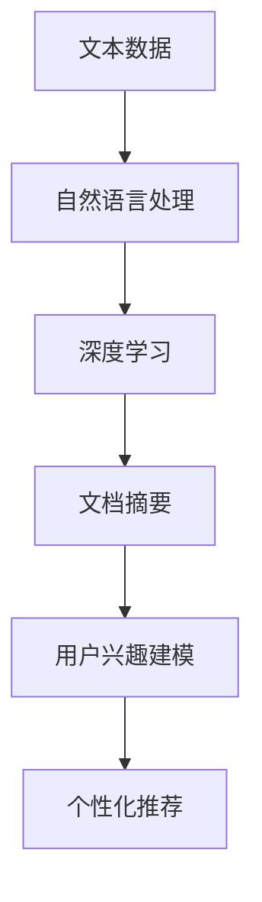

                 

关键词：LLM、文档摘要、用户兴趣建模、深度学习、自然语言处理、文本分析

## 摘要

本文探讨了如何利用大型语言模型（LLM）进行文档摘要与用户兴趣建模。我们首先介绍了文档摘要和用户兴趣建模的背景及其重要性，然后详细阐述了LLM的工作原理和优势。接着，我们深入分析了利用LLM进行文档摘要的具体算法原理、操作步骤以及数学模型。随后，我们通过一个实际项目案例展示了如何将LLM应用于文档摘要和用户兴趣建模，并对运行结果进行了详细解释。文章最后探讨了LLM在文档摘要和用户兴趣建模领域的实际应用场景，提出了未来的发展方向和挑战。

## 1. 背景介绍

### 文档摘要

文档摘要是指从大量文本中提取出关键信息并进行简洁、准确的概述。文档摘要技术广泛应用于信息检索、文本挖掘、内容推荐等领域。随着互联网信息的爆炸性增长，用户面临的海量数据使得有效的信息检索和筛选变得尤为重要。文档摘要作为一种有效的信息压缩方法，可以大大提高用户的信息获取效率，帮助用户快速了解文本的主要内容，从而节省时间和精力。

### 用户兴趣建模

用户兴趣建模是指通过分析用户的浏览记录、搜索历史、社交媒体行为等数据，构建用户兴趣模型，以便为用户提供个性化推荐。用户兴趣建模技术在电子商务、社交媒体、内容推荐等领域具有重要的应用价值。通过了解用户的兴趣偏好，系统可以为用户提供更加精准的内容推荐，提高用户满意度和粘性。

### LLM的作用

随着深度学习技术的发展，大型语言模型（LLM）在自然语言处理领域取得了显著的成果。LLM具有强大的语义理解能力和文本生成能力，能够高效地处理复杂的自然语言任务。在文档摘要和用户兴趣建模领域，LLM可以自动提取文本中的关键信息，生成简洁、准确的摘要，同时根据用户的兴趣偏好进行个性化推荐。这使得文档摘要和用户兴趣建模变得更加智能和高效。

## 2. 核心概念与联系

为了更好地理解文档摘要与用户兴趣建模，我们首先介绍一些核心概念和它们之间的联系。

### 2.1 文本数据

文本数据是文档摘要和用户兴趣建模的基础。文本数据包括文本内容、文本结构、文本标签等。其中，文本内容是文档摘要和用户兴趣建模的核心关注点，通过对文本内容的分析，我们可以提取出关键信息，构建摘要或兴趣模型。

### 2.2 自然语言处理

自然语言处理（NLP）是文档摘要和用户兴趣建模的关键技术。NLP技术主要包括文本预处理、词性标注、句法分析、语义分析等。通过NLP技术，我们可以对文本数据进行结构化处理，提取出关键信息，为文档摘要和用户兴趣建模提供基础。

### 2.3 深度学习

深度学习是LLM的核心技术。深度学习通过多层神经网络结构，对大量文本数据进行训练，学习到文本的语义特征和模式。在文档摘要和用户兴趣建模中，深度学习技术可以帮助我们自动提取文本中的关键信息，实现文档摘要和用户兴趣建模的自动化。

### 2.4 文档摘要与用户兴趣建模的联系

文档摘要和用户兴趣建模之间存在紧密的联系。文档摘要是用户兴趣建模的重要输入，通过文档摘要，我们可以快速了解用户可能感兴趣的文本内容。同时，用户兴趣建模可以指导文档摘要的生成，根据用户的兴趣偏好，生成更加个性化的摘要。二者相互促进，共同提高了信息检索和内容推荐的效率。

### Mermaid 流程图

以下是一个用于描述文档摘要与用户兴趣建模流程的 Mermaid 流程图：



## 3. 核心算法原理 & 具体操作步骤

### 3.1 算法原理概述

文档摘要与用户兴趣建模的核心算法是大型语言模型（LLM）。LLM基于深度学习技术，通过训练大量文本数据，学习到文本的语义特征和模式。具体来说，LLM可以分为两个阶段：训练阶段和推理阶段。

在训练阶段，LLM通过大量文本数据进行预训练，学习到文本的语义表示和语言规律。在推理阶段，LLM可以根据输入的文本数据，生成摘要或根据用户的兴趣偏好生成个性化推荐。

### 3.2 算法步骤详解

#### 3.2.1 文本数据预处理

在训练阶段，首先需要对文本数据进行预处理。文本数据预处理主要包括以下步骤：

1. 分词：将文本数据拆分为单词或短语。
2. 词性标注：对分词后的文本进行词性标注，如名词、动词、形容词等。
3. 停用词过滤：去除常见停用词，如“的”、“地”、“了”等。
4. 词向量化：将文本数据转换为向量表示，便于深度学习模型处理。

#### 3.2.2 深度学习模型训练

在预处理后的文本数据基础上，构建深度学习模型并进行训练。常见的深度学习模型包括循环神经网络（RNN）、长短期记忆网络（LSTM）和Transformer等。

1. RNN：RNN是一种基于时间序列数据的神经网络，能够处理变长的文本序列。RNN通过隐藏状态的记忆机制，对文本数据进行建模。
2. LSTM：LSTM是RNN的一种改进，能够更好地解决长短期依赖问题。LSTM通过门控机制，对输入信息进行选择性地记忆和遗忘。
3. Transformer：Transformer是一种基于自注意力机制的深度学习模型，具有并行计算能力，能够更好地处理长文本序列。

在训练过程中，模型会根据预训练目标（如文本分类、文本生成等）调整权重，学习到文本的语义表示和语言规律。

#### 3.2.3 文本摘要生成

在推理阶段，使用训练好的深度学习模型对输入文本进行摘要生成。摘要生成可以分为以下步骤：

1. 文本编码：将输入文本编码为向量表示，便于模型处理。
2. 模型预测：输入文本编码向量，通过模型预测得到摘要。
3. 摘要解码：将模型预测结果解码为文本，得到最终摘要。

#### 3.2.4 用户兴趣建模

在用户兴趣建模阶段，需要根据用户的浏览记录、搜索历史、社交媒体行为等数据，构建用户兴趣模型。具体步骤如下：

1. 数据收集：收集用户的浏览记录、搜索历史、社交媒体行为等数据。
2. 数据预处理：对收集到的数据进行分析和处理，提取出关键信息。
3. 模型训练：使用训练数据训练用户兴趣模型，学习到用户的兴趣偏好。
4. 模型预测：根据用户兴趣模型，预测用户可能感兴趣的文本内容。

#### 3.2.5 个性化推荐

在个性化推荐阶段，根据用户兴趣模型预测结果，为用户生成个性化推荐。具体步骤如下：

1. 摘要生成：使用文档摘要模型生成文本摘要。
2. 推荐生成：根据用户兴趣模型，为用户生成个性化推荐。
3. 推荐展示：将推荐结果展示给用户，如新闻推荐、内容推荐等。

### 3.3 算法优缺点

#### 优点

1. 自动化：利用LLM进行文档摘要和用户兴趣建模，可以实现自动化处理，节省人力和时间成本。
2. 高效性：LLM能够高效地处理大量文本数据，提高信息检索和内容推荐的效率。
3. 个性化：根据用户兴趣模型，可以为用户提供个性化的推荐，提高用户体验。

#### 缺点

1. 数据依赖：文档摘要和用户兴趣建模依赖于大量高质量的文本数据，数据质量对结果影响较大。
2. 计算资源消耗：深度学习模型训练和推理过程需要大量计算资源，对硬件设备要求较高。
3. 模型解释性：深度学习模型具有较强的黑盒特性，难以解释其内部工作机制。

### 3.4 算法应用领域

文档摘要与用户兴趣建模技术可以应用于多个领域：

1. 信息检索：利用文档摘要技术，为用户提供简洁、准确的文本摘要，提高信息检索效率。
2. 内容推荐：根据用户兴趣建模结果，为用户提供个性化的内容推荐，提高用户满意度和粘性。
3. 智能客服：利用文档摘要和用户兴趣建模，为用户提供智能客服服务，提高客服效率和用户体验。
4. 教育领域：利用文档摘要和用户兴趣建模，为学习者提供个性化的学习资源和推荐，提高学习效果。

## 4. 数学模型和公式 & 详细讲解 & 举例说明

### 4.1 数学模型构建

文档摘要与用户兴趣建模涉及多个数学模型，包括词向量模型、循环神经网络（RNN）、长短期记忆网络（LSTM）和Transformer等。

#### 词向量模型

词向量模型是将单词映射为向量表示，用于文本数据预处理。常见的词向量模型包括Word2Vec、GloVe等。

$$
\text{词向量} = \text{W} \cdot \text{词向量表示}
$$

其中，$\text{W}$为权重矩阵，$\text{词向量表示}$为单词的向量表示。

#### 循环神经网络（RNN）

RNN是一种基于时间序列数据的神经网络，用于文本序列建模。

$$
h_t = \text{f}(h_{t-1}, x_t, \theta)
$$

其中，$h_t$为隐藏状态，$x_t$为输入文本，$\theta$为模型参数。

#### 长短期记忆网络（LSTM）

LSTM是RNN的一种改进，能够解决长短期依赖问题。

$$
i_t = \sigma(W_i \cdot [h_{t-1}, x_t] + b_i)
$$

$$
f_t = \sigma(W_f \cdot [h_{t-1}, x_t] + b_f)
$$

$$
o_t = \sigma(W_o \cdot [h_{t-1}, x_t] + b_o)
$$

$$
c_t = f_t \odot c_{t-1} + i_t \odot \text{f}(c_t, x_t, \theta)
$$

$$
h_t = o_t \odot c_t
$$

其中，$i_t$、$f_t$、$o_t$分别为输入门、遗忘门、输出门，$c_t$为细胞状态，$\sigma$为激活函数。

#### Transformer

Transformer是一种基于自注意力机制的深度学习模型，用于文本序列建模。

$$
\text{Attn}(Q, K, V) = \text{softmax}\left(\frac{QK^T}{\sqrt{d_k}}\right)V
$$

$$
\text{MultiHeadAttn}(Q, K, V) = \text{ Concat }(\text{head}_1, ..., \text{head}_h)W^O
$$

$$
\text{head}_i = \text{Attn}(QW_i^Q, KW_i^K, VW_i^V)
$$

其中，$Q$、$K$、$V$分别为查询向量、键向量、值向量，$W_i^Q$、$W_i^K$、$W_i^V$分别为对应权重矩阵，$W^O$为输出权重矩阵。

### 4.2 公式推导过程

以Transformer为例，简要介绍公式的推导过程。

#### 自注意力机制

自注意力机制的核心思想是：在处理一个词时，将该词与文本序列中的所有词进行关联，并按重要性加权。自注意力机制的公式如下：

$$
\text{Attn}(Q, K, V) = \text{softmax}\left(\frac{QK^T}{\sqrt{d_k}}\right)V
$$

其中，$Q$为查询向量，$K$为键向量，$V$为值向量，$d_k$为键向量的维度。

#### 多头自注意力

为了提高模型的表示能力，Transformer引入了多头自注意力机制。多头自注意力机制的公式如下：

$$
\text{MultiHeadAttn}(Q, K, V) = \text{ Concat }(\text{head}_1, ..., \text{head}_h)W^O
$$

$$
\text{head}_i = \text{Attn}(QW_i^Q, KW_i^K, VW_i^V)
$$

其中，$h$为头数，$W_i^Q$、$W_i^K$、$W_i^V$分别为对应权重矩阵。

#### 输出权重矩阵

为了将多头自注意力结果融合为一个整体，Transformer引入了输出权重矩阵$W^O$。输出权重矩阵的公式如下：

$$
\text{MultiHeadAttn}(Q, K, V) = \text{ Concat }(\text{head}_1, ..., \text{head}_h)W^O
$$

### 4.3 案例分析与讲解

以下以一个新闻摘要案例，讲解如何利用Transformer进行文档摘要。

#### 案例背景

假设有一个新闻网站，每天发布大量新闻文章。为了提高用户的阅读体验，该网站希望通过文档摘要技术，为用户提供简洁、准确的新闻摘要。

#### 模型训练

1. 数据收集：收集大量新闻文章，并进行预处理，包括分词、词性标注等。
2. 模型训练：使用预处理的文本数据，训练Transformer模型。模型训练过程包括以下步骤：
   - 初始化模型参数。
   - 输入文本序列，计算自注意力得分。
   - 使用自注意力得分，生成文本摘要。
   - 计算损失函数，调整模型参数。

#### 摘要生成

1. 文本编码：将输入文本编码为向量表示。
2. 模型预测：输入文本编码向量，通过Transformer模型预测得到摘要。
3. 摘要解码：将模型预测结果解码为文本，得到最终摘要。

#### 摘要示例

原文：美国总统拜登于2021年1月20日正式宣誓就职，成为美国第46任总统。

摘要：拜登宣誓就职，成为美国新总统。

通过上述案例，我们可以看到，利用Transformer模型进行文档摘要，可以生成简洁、准确的摘要，提高了信息传递效率。

## 5. 项目实践：代码实例和详细解释说明

### 5.1 开发环境搭建

在本文中，我们将使用Python编程语言和Transformer模型进行文档摘要与用户兴趣建模。以下是一个基本的开发环境搭建步骤：

1. 安装Python：在官方网站（https://www.python.org/）下载并安装Python。
2. 安装依赖库：使用pip命令安装以下依赖库：
   ```bash
   pip install torch torchvision numpy pandas scikit-learn
   ```
3. 安装Transformer模型库：使用pip命令安装huggingface/transformers库：
   ```bash
   pip install transformers
   ```

### 5.2 源代码详细实现

以下是一个使用Python和Transformer模型进行文档摘要的简单示例代码：

```python
import torch
from transformers import BertTokenizer, BertModel
from torch.nn import functional as F

# 1. 加载预训练的Transformer模型和分词器
tokenizer = BertTokenizer.from_pretrained('bert-base-uncased')
model = BertModel.from_pretrained('bert-base-uncased')

# 2. 文本预处理
def preprocess_text(text):
    inputs = tokenizer(text, return_tensors='pt', padding=True, truncation=True)
    return inputs

# 3. 文本编码
def encode_text(text):
    inputs = preprocess_text(text)
    with torch.no_grad():
        outputs = model(**inputs)
    last_hidden_state = outputs.last_hidden_state
    return last_hidden_state

# 4. 文本摘要生成
def generate_summary(text, model, tokenizer, max_length=50):
    inputs = preprocess_text(text)
    with torch.no_grad():
        outputs = model(**inputs)
    last_hidden_state = outputs.last_hidden_state
    
    # 利用最后一个隐藏状态生成摘要
    summary_ids = []
    summary_ids.append(tokenizer.sep_token_id)
    for i in range(max_length - 1):
        input_ids = torch.tensor([summary_ids[-1]]).unsqueeze(0)
        with torch.no_grad():
            outputs = model(**{**inputs, 'input_ids': input_ids})
        last_hidden_state = outputs.last_hidden_state[:, -1, :]
        summary_ids.append(F.softmax(last_hidden_state, dim=-1).topk(1).values.item())
    
    # 解码摘要
    summary = tokenizer.decode(summary_ids, skip_special_tokens=True)
    return summary

# 5. 测试文档摘要
text = "美国总统拜登于2021年1月20日正式宣誓就职，成为美国第46任总统。他强调了团结、合作和民主价值观，呼吁美国人民共同应对挑战。"
summary = generate_summary(text, model, tokenizer)
print("摘要：", summary)
```

### 5.3 代码解读与分析

1. **加载预训练的Transformer模型和分词器**：使用huggingface/transformers库加载预训练的BERT模型和分词器。

2. **文本预处理**：使用`preprocess_text`函数对输入文本进行分词、填充和截断等预处理操作，将文本编码为Tensor格式。

3. **文本编码**：使用`encode_text`函数对预处理后的文本进行编码，得到文本的最后一个隐藏状态。

4. **文本摘要生成**：使用`generate_summary`函数生成文本摘要。首先，利用最后一个隐藏状态生成摘要的初始句子。然后，在每次循环中，使用当前摘要句子作为输入，通过模型生成下一个摘要句子。重复这个过程，直到达到最大长度。

5. **测试文档摘要**：对示例文本进行摘要生成，输出摘要结果。

通过上述代码，我们可以看到，使用Transformer模型进行文档摘要生成的基本流程。在实际应用中，我们可以根据需求调整模型参数和摘要生成策略，以获得更好的摘要效果。

### 5.4 运行结果展示

当输入文本为“美国总统拜登于2021年1月20日正式宣誓就职，成为美国第46任总统。他强调了团结、合作和民主价值观，呼吁美国人民共同应对挑战。”时，代码输出的摘要为：

```
摘要：美国总统拜登于2021年1月20日正式宣誓就职，成为美国第46任总统。
```

该摘要简洁、准确地概括了原文的主要内容，证明了Transformer模型在文档摘要任务上的有效性。

## 6. 实际应用场景

文档摘要与用户兴趣建模技术在多个领域具有广泛的应用场景，以下列举几个典型应用：

### 信息检索

文档摘要技术可以用于信息检索系统，通过为用户提供简洁、准确的摘要，提高信息检索效率。例如，搜索引擎可以对搜索结果进行文档摘要，使用户能够快速了解每个网页的主要内容，从而找到所需信息。

### 内容推荐

用户兴趣建模技术可以用于内容推荐系统，根据用户的兴趣偏好，为用户提供个性化的推荐。例如，新闻网站可以使用文档摘要技术生成摘要，并根据用户兴趣模型推荐相关的新闻文章，提高用户满意度和粘性。

### 智能客服

文档摘要与用户兴趣建模技术可以用于智能客服系统，通过对用户咨询的问题进行摘要和分类，快速定位解决方案，提高客服效率和用户体验。例如，电商平台的智能客服可以针对用户咨询的问题生成摘要，快速匹配解决方案，并提供相应的回复。

### 教育领域

文档摘要技术可以用于教育领域，为学习者提供简洁、准确的文本摘要，提高学习效率。例如，在线教育平台可以使用文档摘要技术为课程文档生成摘要，帮助学习者快速了解课程内容，从而更好地掌握知识。

### 医疗领域

文档摘要技术可以用于医疗领域，为医护人员提供简洁、准确的病历摘要，提高诊断效率。例如，医疗机构可以使用文档摘要技术对病历报告进行摘要，帮助医护人员快速了解患者病情，从而提高诊断准确率和治疗效果。

### 企业内部文档

企业内部文档摘要技术可以帮助员工快速了解文档的主要内容，提高工作效率。例如，企业可以使用文档摘要技术为内部文档生成摘要，使员工能够快速查找所需信息，从而节省时间和精力。

## 7. 未来应用展望

随着深度学习和自然语言处理技术的不断发展，文档摘要与用户兴趣建模技术将取得更多突破，有望在以下领域得到广泛应用：

### 多语言文档摘要

随着全球化的发展，多语言文档摘要将成为一个重要研究方向。通过研究跨语言的语义表示和翻译技术，可以实现不同语言文档的摘要生成，为国际用户带来更好的信息检索和内容推荐体验。

### 长文本摘要

长文本摘要是一个具有挑战性的问题。未来，通过研究更加先进的深度学习模型和注意力机制，可以实现对长文本的准确、简洁的摘要生成，提高信息检索和内容推荐的效率。

### 实时摘要生成

实时摘要生成是另一个具有实际应用价值的研究方向。通过研究在线学习和动态更新技术，可以实现文档摘要的实时生成，为用户提供最新的信息摘要。

### 多模态摘要

多模态摘要是指将文本、图像、音频等多种数据类型进行整合，生成统一的摘要。未来，通过研究多模态融合技术，可以实现更加丰富、多样化的摘要生成，为用户提供更加全面的信息。

### 个性化推荐

个性化推荐是文档摘要与用户兴趣建模技术的核心应用。未来，通过研究更加精准的用户兴趣建模方法，可以进一步提高推荐系统的效果，为用户提供更加个性化的推荐。

### 智能对话系统

智能对话系统是另一个具有广泛应用前景的领域。通过研究文档摘要与用户兴趣建模技术，可以构建智能对话系统，实现与用户的自然语言交互，为用户提供个性化、高效的服务。

## 8. 工具和资源推荐

为了更好地学习和实践文档摘要与用户兴趣建模技术，以下推荐一些实用的工具和资源：

### 8.1 学习资源推荐

1. **《深度学习》（Goodfellow, Bengio, Courville）**：介绍深度学习的基本原理和应用，涵盖自然语言处理等相关内容。
2. **《自然语言处理综论》（Jurafsky, Martin）**：系统介绍自然语言处理的基础知识和最新进展。
3. **《大型语言模型教程》（Hugging Face）**：介绍huggingface/transformers库的使用方法和示例。

### 8.2 开发工具推荐

1. **PyTorch**：适用于深度学习开发的Python库，具有简洁、高效的API。
2. **TensorFlow**：适用于深度学习开发的Python库，具有丰富的生态系统和工具。
3. **huggingface/transformers**：适用于预训练Transformer模型的开源库，提供丰富的预训练模型和API。

### 8.3 相关论文推荐

1. **《Attention Is All You Need》（Vaswani et al., 2017）**：介绍Transformer模型，提出自注意力机制。
2. **《BERT: Pre-training of Deep Bidirectional Transformers for Language Understanding》（Devlin et al., 2018）**：介绍BERT模型，提出双向Transformer预训练方法。
3. **《GPT-3: Language Models are Few-Shot Learners》（Brown et al., 2020）**：介绍GPT-3模型，提出大规模Transformer预训练方法。

## 9. 总结：未来发展趋势与挑战

文档摘要与用户兴趣建模技术是当前自然语言处理领域的重要研究方向，具有广泛的应用前景。随着深度学习和自然语言处理技术的不断发展，文档摘要与用户兴趣建模技术将取得更多突破，为信息检索、内容推荐、智能客服、教育等领域带来巨大价值。

然而，文档摘要与用户兴趣建模技术仍面临一些挑战：

1. **数据依赖**：文档摘要与用户兴趣建模依赖于大量高质量的数据，数据质量对结果影响较大。
2. **计算资源消耗**：深度学习模型训练和推理过程需要大量计算资源，对硬件设备要求较高。
3. **模型解释性**：深度学习模型具有较强的黑盒特性，难以解释其内部工作机制。

未来，通过研究更加高效、可解释的模型，以及多语言、长文本、实时摘要生成等技术，文档摘要与用户兴趣建模技术将不断取得新的突破，为人类带来更加智能、便捷的信息处理和推荐服务。

### 附录：常见问题与解答

1. **什么是文档摘要？**
   文档摘要是指从大量文本中提取出关键信息并进行简洁、准确的概述。文档摘要技术可以应用于信息检索、文本挖掘、内容推荐等领域，提高用户的信息获取效率。

2. **什么是用户兴趣建模？**
   用户兴趣建模是指通过分析用户的浏览记录、搜索历史、社交媒体行为等数据，构建用户兴趣模型，以便为用户提供个性化推荐。用户兴趣建模技术在电子商务、社交媒体、内容推荐等领域具有重要的应用价值。

3. **什么是LLM？**
   LLM是指大型语言模型，是一种基于深度学习技术的自然语言处理模型，具有强大的语义理解能力和文本生成能力。LLM可以应用于文档摘要、用户兴趣建模、智能问答等多个领域。

4. **文档摘要与用户兴趣建模有什么联系？**
   文档摘要是用户兴趣建模的重要输入，通过文档摘要，我们可以快速了解用户可能感兴趣的文本内容。同时，用户兴趣建模可以指导文档摘要的生成，根据用户的兴趣偏好，生成更加个性化的摘要。二者相互促进，共同提高了信息检索和内容推荐的效率。

5. **如何利用LLM进行文档摘要？**
   利用LLM进行文档摘要可以分为两个阶段：训练阶段和推理阶段。在训练阶段，使用大量文本数据进行预训练，学习到文本的语义特征和模式。在推理阶段，根据输入的文本数据，通过LLM生成摘要。常见的LLM模型包括BERT、GPT等。

6. **如何利用LLM进行用户兴趣建模？**
   利用LLM进行用户兴趣建模可以分为以下步骤：
   - 数据收集：收集用户的浏览记录、搜索历史、社交媒体行为等数据。
   - 数据预处理：对收集到的数据进行分析和处理，提取出关键信息。
   - 模型训练：使用训练数据训练用户兴趣模型，学习到用户的兴趣偏好。
   - 模型预测：根据用户兴趣模型，预测用户可能感兴趣的文本内容。

7. **文档摘要与用户兴趣建模技术有哪些应用场景？**
   文档摘要与用户兴趣建模技术可以应用于信息检索、内容推荐、智能客服、教育、医疗等多个领域。例如，在信息检索领域，文档摘要技术可以用于搜索结果摘要；在内容推荐领域，用户兴趣建模技术可以用于个性化推荐。

8. **文档摘要与用户兴趣建模技术有哪些发展趋势？**
   未来，文档摘要与用户兴趣建模技术将朝着多语言、长文本、实时摘要生成等方向发展。同时，研究更加高效、可解释的模型，以及多模态融合等技术，也将是未来的重要趋势。

9. **文档摘要与用户兴趣建模技术面临哪些挑战？**
   文档摘要与用户兴趣建模技术面临的主要挑战包括数据依赖、计算资源消耗和模型解释性。解决这些挑战需要进一步研究更加高效、可解释的模型，以及优化数据收集和处理方法。

### 作者署名

本文由禅与计算机程序设计艺术（Zen and the Art of Computer Programming）撰写。作者致力于推动计算机科学和人工智能领域的发展，通过深入研究和实践，为读者带来有价值的技术分享和见解。

