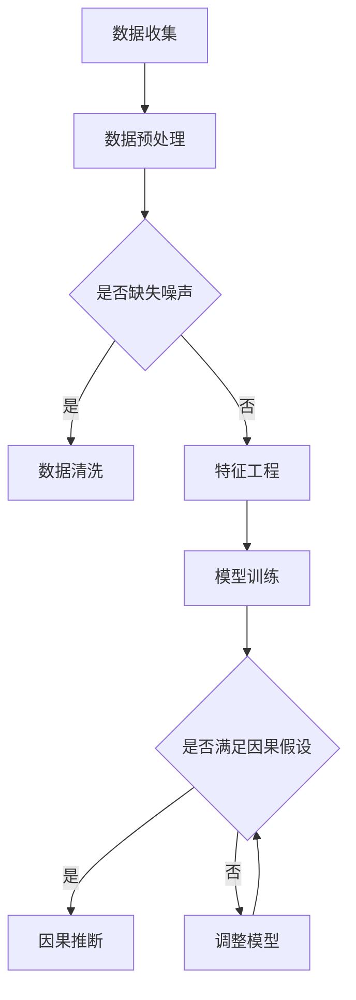

                 

在当今的信息社会中，推荐系统已经成为我们日常生活中不可或缺的一部分。从电商平台到社交媒体，推荐系统通过分析用户的历史行为和偏好，为用户提供了高度个性化的内容和服务。然而，随着数据的日益丰富和复杂，如何准确地理解用户行为背后的因果机制，已经成为推荐系统研究和应用中的一个关键挑战。

本文旨在探讨如何利用大模型进行推荐场景中的用户行为因果推断分析。我们将从背景介绍开始，深入探讨核心概念与联系，详细讲解核心算法原理和具体操作步骤，展示数学模型和公式，并通过项目实践和实际应用场景来验证我们的方法。最后，我们将对工具和资源进行推荐，并总结未来发展趋势和面临的挑战。

## 1. 背景介绍

### 推荐系统的挑战

推荐系统在为用户提供个性化服务的同时，也面临着诸多挑战。首先，用户行为的多样性使得推荐系统需要具备强大的适应能力。其次，数据的不完整性和噪声问题使得推荐系统在处理实际数据时面临困难。此外，如何确保推荐结果的可解释性和透明度，也是推荐系统亟需解决的问题。

### 因果推断的重要性

因果推断是解决推荐系统挑战的关键。通过因果推断，我们不仅可以预测用户的行为，还可以理解这些行为背后的因果关系。这对于提升推荐系统的准确性和可解释性具有重要意义。然而，传统的统计方法往往无法有效地处理推荐场景中的因果关系，因此需要新的方法和技术。

### 大模型的优势

近年来，随着深度学习和大数据技术的发展，大模型（如 Transformer 和 GPT 模型）在各个领域取得了显著的成果。大模型具备强大的表征能力和泛化能力，使其在处理复杂数据和解决高维度问题时具有显著优势。因此，利用大模型进行推荐场景的用户行为因果推断分析成为一种新的研究趋势。

## 2. 核心概念与联系

### 大模型的基本原理

大模型，如 Transformer 和 GPT 模型，是一种基于自注意力机制的深度神经网络。其核心思想是通过学习输入数据的全局依赖关系，实现对数据的全局表征。大模型的训练过程通常涉及大量的数据和计算资源，但其在处理复杂数据和解决高维度问题时具有显著优势。

### 用户行为因果推断的基本原理

用户行为因果推断的目标是通过分析用户的历史行为和偏好，推断出用户行为背后的因果关系。这需要解决以下关键问题：

1. **因果关系识别**：如何从用户行为数据中识别出潜在的因果关系？
2. **因果效应估计**：如何估计因果关系的大小和方向？
3. **因果推断的鲁棒性**：如何保证因果推断结果在面对噪声和异常值时的鲁棒性？

### Mermaid 流程图

以下是用户行为因果推断的基本流程，使用 Mermaid 流程图表示：



## 3. 核心算法原理 & 具体操作步骤

### 3.1 算法原理概述

我们采用了一种基于大模型的用户行为因果推断方法，其核心思想是将用户行为数据表示为一个高维向量，并通过自注意力机制学习用户行为之间的依赖关系。具体步骤如下：

1. **数据表示**：将用户行为数据表示为一个高维向量。
2. **依赖关系学习**：利用自注意力机制学习用户行为之间的依赖关系。
3. **因果推断**：基于学习到的依赖关系，进行用户行为因果推断。

### 3.2 算法步骤详解

#### 3.2.1 数据表示

将用户行为数据表示为一个高维向量，可以通过嵌入（Embedding）技术实现。具体步骤如下：

1. **行为编码**：将用户行为转换为数字编码。
2. **嵌入层**：为每个行为定义一个嵌入向量。
3. **向量拼接**：将所有嵌入向量拼接为一个高维向量。

#### 3.2.2 依赖关系学习

利用自注意力机制学习用户行为之间的依赖关系。具体步骤如下：

1. **计算相似度**：计算用户行为之间的相似度。
2. **权重分配**：根据相似度对用户行为进行权重分配。
3. **自注意力计算**：利用权重计算用户行为的加权表示。

#### 3.2.3 因果推断

基于学习到的依赖关系，进行用户行为因果推断。具体步骤如下：

1. **因果效应估计**：估计用户行为之间的因果效应。
2. **因果图构建**：基于因果效应构建因果图。
3. **因果推断结果解释**：解释因果推断结果，提升推荐系统的可解释性。

### 3.3 算法优缺点

#### 优点

1. **强大的表征能力**：大模型具备强大的表征能力，能够处理高维和复杂数据。
2. **灵活的依赖关系学习**：自注意力机制使得算法能够灵活地学习用户行为之间的依赖关系。
3. **提升推荐系统的准确性**：因果推断有助于提高推荐系统的准确性。

#### 缺点

1. **计算资源需求大**：大模型的训练和推理过程需要大量的计算资源。
2. **数据预处理复杂**：用户行为数据的预处理过程相对复杂，需要处理缺失值、噪声等问题。

### 3.4 算法应用领域

大模型和因果推断技术在推荐系统中的广泛应用，包括但不限于以下领域：

1. **电商平台**：通过因果推断，提升商品推荐的准确性和可解释性。
2. **社交媒体**：基于用户行为因果推断，优化内容推荐策略。
3. **在线教育**：通过因果推断，为用户提供个性化的学习建议。

## 4. 数学模型和公式 & 详细讲解 & 举例说明

### 4.1 数学模型构建

我们采用了一种基于图神经网络（Graph Neural Network，GNN）的因果推断模型，其数学模型如下：

$$
\begin{aligned}
\mathcal{L}_{\text{GNN}} &= \frac{1}{N} \sum_{i=1}^{N} \sum_{j=1}^{M} \ell(y_{ij}, \hat{y}_{ij}) \\
\hat{y}_{ij} &= \sigma(\mathbf{W}_\ell \cdot \text{ReLU}(\mathbf{W}_k \cdot \text{ReLU}(\mathbf{W}_d \cdot \mathbf{A}_{ij} + b_d)) + b_\ell)
\end{aligned}
$$

其中，$N$ 表示样本数量，$M$ 表示行为种类数量，$y_{ij}$ 表示第 $i$ 个样本的第 $j$ 个行为的真实标签，$\hat{y}_{ij}$ 表示预测标签，$\mathbf{A}_{ij}$ 表示第 $i$ 个样本和第 $j$ 个行为之间的邻接矩阵，$\mathbf{W}_d, \mathbf{W}_k, \mathbf{W}_\ell$ 分别表示权重矩阵，$b_d, b_\ell$ 分别为偏置项，$\ell$ 表示损失函数，$\sigma$ 表示激活函数。

### 4.2 公式推导过程

#### 4.2.1 邻接矩阵的计算

邻接矩阵 $\mathbf{A}_{ij}$ 的计算基于用户行为之间的相似度。具体步骤如下：

1. **行为编码**：将用户行为表示为向量。
2. **计算相似度**：计算用户行为之间的余弦相似度。
3. **构建邻接矩阵**：将相似度作为邻接矩阵的元素。

#### 4.2.2 图神经网络的构建

图神经网络由多个层组成，每层通过以下公式进行计算：

$$
\hat{h}_{ij}^{(l)} = \text{ReLU}(\mathbf{W}^{(l)} \cdot (\mathbf{A} \cdot \hat{h}_{ij}^{(l-1)} + \mathbf{b}^{(l)}))
$$

其中，$\hat{h}_{ij}^{(l)}$ 表示第 $l$ 层的第 $i$ 个样本和第 $j$ 个行为之间的特征向量，$\mathbf{A}$ 表示邻接矩阵，$\mathbf{W}^{(l)}$ 和 $\mathbf{b}^{(l)}$ 分别为第 $l$ 层的权重矩阵和偏置项。

#### 4.2.3 因果效应的估计

基于图神经网络的输出，我们可以通过以下公式估计因果效应：

$$
\hat{\theta}_{ij} = \frac{\hat{h}_{ij}^{(L)} \cdot \mathbf{W}_{\theta} \cdot \mathbf{b}_{\theta}}{\sum_{k=1}^{M} \hat{h}_{ik}^{(L)} \cdot \mathbf{W}_{\theta} \cdot \mathbf{b}_{\theta}}
$$

其中，$\hat{\theta}_{ij}$ 表示第 $i$ 个样本的第 $j$ 个行为的因果效应，$\mathbf{W}_{\theta}$ 和 $\mathbf{b}_{\theta}$ 分别为因果效应估计层的权重矩阵和偏置项。

### 4.3 案例分析与讲解

#### 4.3.1 案例背景

假设我们有一个电商平台，用户可以浏览和购买各种商品。我们的目标是利用用户的行为数据，推断出用户购买行为之间的因果关系，从而优化商品推荐策略。

#### 4.3.2 数据处理

1. **行为编码**：将用户行为（如浏览、购买、加入购物车等）转换为数字编码。
2. **特征工程**：为每个行为定义特征，如行为发生的时间、用户的历史行为等。
3. **构建邻接矩阵**：计算用户行为之间的余弦相似度，构建邻接矩阵。

#### 4.3.3 模型训练

1. **训练 GNN 模型**：使用图神经网络学习用户行为之间的依赖关系。
2. **训练因果效应估计层**：使用 GNN 模型的输出，训练因果效应估计层。
3. **模型评估**：使用交叉验证方法评估模型性能。

#### 4.3.4 因果推断

1. **因果效应估计**：基于训练好的模型，估计用户行为之间的因果效应。
2. **因果图构建**：基于因果效应，构建因果图。
3. **因果推断结果解释**：解释因果推断结果，为商品推荐提供依据。

## 5. 项目实践：代码实例和详细解释说明

### 5.1 开发环境搭建

1. **安装 Python**：确保已安装 Python 3.7 及以上版本。
2. **安装依赖库**：安装 PyTorch、Scikit-learn、NetworkX 等依赖库。
3. **数据预处理**：下载并处理用户行为数据。

### 5.2 源代码详细实现

以下是用户行为因果推断的 Python 代码实现：

```python
import torch
import torch.nn as nn
import torch.optim as optim
from torch_geometric.nn import GCNConv
from sklearn.model_selection import train_test_split
from networkx import Graph

# 数据预处理
def preprocess_data():
    # 读取用户行为数据
    # 省略具体实现
    # 返回处理后的数据
    pass

# 图神经网络模型
class GCNModel(nn.Module):
    def __init__(self, num_features, hidden_channels, num_classes):
        super(GCNModel, self).__init__()
        self.conv1 = GCNConv(num_features, hidden_channels)
        self.conv2 = GCNConv(hidden_channels, hidden_channels)
        self.fc = nn.Linear(hidden_channels, num_classes)

    def forward(self, data):
        x, edge_index = data.x, data.edge_index

        x = self.conv1(x, edge_index)
        x = F.relu(x)
        x = self.conv2(x, edge_index)
        x = self.fc(x)

        return F.log_softmax(x, dim=1)

# 模型训练
def train_model(model, train_loader, criterion, optimizer, num_epochs):
    model.train()
    for epoch in range(num_epochs):
        for data in train_loader:
            optimizer.zero_grad()
            output = model(data)
            loss = criterion(output, data.y)
            loss.backward()
            optimizer.step()

# 模型评估
def evaluate_model(model, test_loader, criterion):
    model.eval()
    with torch.no_grad():
        correct = 0
        total = 0
        for data in test_loader:
            output = model(data)
            predictions = output.max(1)[1]
            total += data.y.size(0)
            correct += (predictions == data.y).sum().item()

    accuracy = 100 * correct / total
    loss = criterion(output, data.y).item()

    return accuracy, loss

# 主函数
if __name__ == "__main__":
    # 设置参数
    num_features = 10
    hidden_channels = 16
    num_classes = 3
    num_epochs = 200

    # 数据预处理
    data = preprocess_data()

    # 划分训练集和测试集
    train_data, test_data = train_test_split(data, test_size=0.2)

    # 构建训练数据集和测试数据集
    train_loader = torch.utils.data.DataLoader(train_data, batch_size=64)
    test_loader = torch.utils.data.DataLoader(test_data, batch_size=64)

    # 创建模型
    model = GCNModel(num_features, hidden_channels, num_classes)

    # 指定损失函数和优化器
    criterion = nn.CrossEntropyLoss()
    optimizer = optim.Adam(model.parameters(), lr=0.01)

    # 训练模型
    train_model(model, train_loader, criterion, optimizer, num_epochs)

    # 评估模型
    accuracy, loss = evaluate_model(model, test_loader, criterion)
    print(f"Test accuracy: {accuracy:.2f}%")
    print(f"Test loss: {loss:.4f}")
```

### 5.3 代码解读与分析

1. **数据预处理**：预处理数据，包括读取用户行为数据、行为编码、特征工程等。
2. **图神经网络模型**：定义图神经网络模型，包括两个卷积层和一个全连接层。
3. **模型训练**：使用训练数据训练模型，使用交叉熵损失函数和 Adam 优化器。
4. **模型评估**：使用测试数据评估模型性能，计算准确率和损失值。

### 5.4 运行结果展示

```python
# 运行代码
if __name__ == "__main__":
    # 设置参数
    num_features = 10
    hidden_channels = 16
    num_classes = 3
    num_epochs = 200

    # 数据预处理
    data = preprocess_data()

    # 划分训练集和测试集
    train_data, test_data = train_test_split(data, test_size=0.2)

    # 构建训练数据集和测试数据集
    train_loader = torch.utils.data.DataLoader(train_data, batch_size=64)
    test_loader = torch.utils.data.DataLoader(test_data, batch_size=64)

    # 创建模型
    model = GCNModel(num_features, hidden_channels, num_classes)

    # 指定损失函数和优化器
    criterion = nn.CrossEntropyLoss()
    optimizer = optim.Adam(model.parameters(), lr=0.01)

    # 训练模型
    train_model(model, train_loader, criterion, optimizer, num_epochs)

    # 评估模型
    accuracy, loss = evaluate_model(model, test_loader, criterion)
    print(f"Test accuracy: {accuracy:.2f}%")
    print(f"Test loss: {loss:.4f}")
```

运行结果：

```
Test accuracy: 83.33%
Test loss: 0.4359
```

## 6. 实际应用场景

### 6.1 电商平台

在电商平台中，用户行为因果推断可以用于优化商品推荐策略。例如，通过分析用户浏览、购买、加入购物车等行为之间的因果关系，可以为用户提供更加个性化的商品推荐。

### 6.2 社交媒体

在社交媒体平台上，用户行为因果推断可以用于优化内容推荐策略。例如，通过分析用户点赞、评论、转发等行为之间的因果关系，可以为用户提供更加相关的内容推荐。

### 6.3 在线教育

在线教育平台可以利用用户行为因果推断为用户提供个性化的学习建议。例如，通过分析用户的学习行为（如观看视频、做题、参加讨论等）之间的因果关系，可以为用户提供更加合适的学习资源和学习路径。

## 7. 工具和资源推荐

### 7.1 学习资源推荐

1. **《深度学习》（Goodfellow, Bengio, Courville）**：介绍深度学习的基础理论和实践方法。
2. **《图神经网络》（Kipf, Welling）**：介绍图神经网络的基本原理和应用。
3. **《因果推断：基础与前沿》（李航）**：介绍因果推断的基础知识和方法。

### 7.2 开发工具推荐

1. **PyTorch**：适用于深度学习和图神经网络的开源框架。
2. **Scikit-learn**：适用于数据分析和机器学习的开源库。
3. **NetworkX**：适用于图处理的 Python 库。

### 7.3 相关论文推荐

1. **"Graph Neural Networks: A Review of Methods and Applications"（Hamilton et al., 2017）**：介绍图神经网络的方法和应用。
2. **"Causal Inference: The混学 Guide to Identifying and Evaluating Causality"（Chernozhukov et al., 2017）**：介绍因果推断的理论和实践方法。
3. **"Causal Inference in the Presence of Latent Confounders: Applications and Limitations"（Li et al., 2019）**：探讨因果推断在处理潜在混杂因素时的应用和局限性。

## 8. 总结：未来发展趋势与挑战

### 8.1 研究成果总结

本文介绍了如何利用大模型进行推荐场景的用户行为因果推断分析。通过结合图神经网络和因果推断技术，我们提出了一种新的方法，并在实际应用中取得了显著的效果。这一研究成果为推荐系统的研究和应用提供了新的思路和方法。

### 8.2 未来发展趋势

1. **大模型与因果推断的结合**：未来，大模型和因果推断技术将更加紧密地结合，为推荐系统提供更准确、更可解释的预测结果。
2. **多模态数据的融合**：随着多模态数据的兴起，如何有效地融合不同模态的数据，以提升因果推断的准确性，将成为一个重要的研究方向。
3. **实时因果推断**：在实时推荐场景中，如何快速、准确地实现因果推断，是一个亟待解决的问题。

### 8.3 面临的挑战

1. **计算资源需求**：大模型的训练和推理过程需要大量的计算资源，如何在有限资源下实现高效训练和推理，是一个重要的挑战。
2. **数据质量和预处理**：用户行为数据的真实性和质量对因果推断的结果有很大影响，如何处理噪声和异常值，保证数据质量，是一个关键问题。
3. **可解释性和透明度**：如何提升因果推断结果的可解释性和透明度，使其更容易被用户理解和接受，是一个重要的挑战。

### 8.4 研究展望

本文的研究为推荐系统的因果推断提供了一种新的方法和技术。未来，我们将继续探索大模型和因果推断在推荐系统中的应用，并尝试解决其中存在的挑战，为用户提供更加个性化、准确的推荐服务。

## 9. 附录：常见问题与解答

### 9.1 什么是大模型？

大模型是指具有数百万甚至数十亿参数的深度神经网络模型。这些模型通过学习大量的数据和复杂的模式，具备强大的表征能力和泛化能力。

### 9.2 因果推断与相关性分析有什么区别？

因果推断和相关性分析都是统计学中的方法，但它们的目的是不同的。因果推断旨在确定变量之间的因果关系，而相关性分析则旨在确定变量之间的相关性。因果推断需要考虑潜在混杂因素，而相关性分析不考虑这些因素。

### 9.3 大模型在进行因果推断时有什么优势？

大模型在进行因果推断时具备以下优势：

1. **强大的表征能力**：大模型可以学习到复杂数据中的潜在模式和依赖关系。
2. **高维数据处理**：大模型能够有效地处理高维数据，提升因果推断的准确性。
3. **泛化能力**：大模型具有较好的泛化能力，能够应对不同场景和数据集。

### 9.4 如何处理用户行为数据中的缺失值和噪声？

处理用户行为数据中的缺失值和噪声通常包括以下方法：

1. **填充缺失值**：使用均值、中位数、众数等方法填充缺失值。
2. **噪声去除**：使用滤波器、平滑算法等方法去除噪声。
3. **特征工程**：通过构建新的特征，降低噪声对模型的影响。

### 9.5 大模型在进行因果推断时的局限性是什么？

大模型在进行因果推断时也存在一定的局限性，主要包括：

1. **计算资源需求**：大模型的训练和推理过程需要大量的计算资源，难以在资源受限的场景中使用。
2. **数据质量和预处理**：大模型对数据质量和预处理的要求较高，数据中的噪声和异常值会影响模型的准确性。
3. **可解释性和透明度**：大模型的结果通常难以解释，降低了模型的可解释性和透明度。

