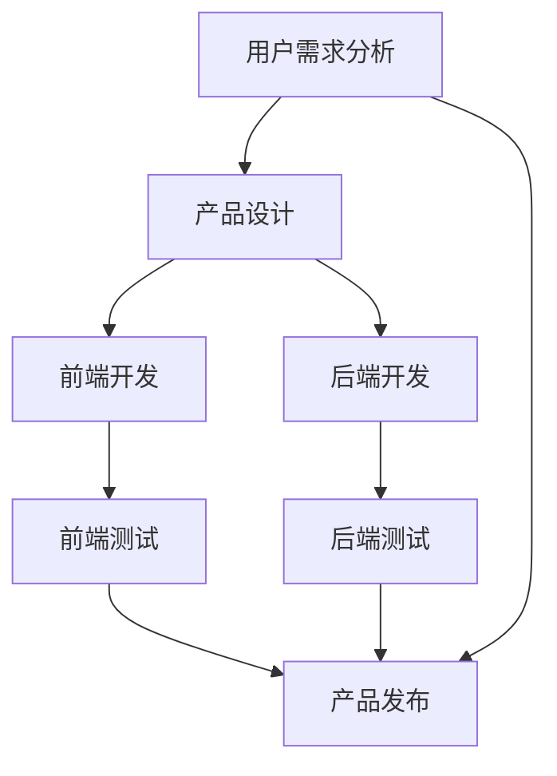

                 

### 背景介绍

随着数字技术的飞速发展，创建数字产品已经成为企业和个人获取竞争优势的重要手段。无论是新兴的科技公司，还是传统行业的转型企业，数字产品的开发都已成为不可或缺的一环。本文将探讨如何利用技术能力创建出具有市场竞争力的数字产品。

当前，数字产品涵盖了从简单的移动应用，到复杂的企业级系统的各种类型。随着用户需求的不断变化和技术的快速迭代，开发者需要具备敏锐的市场洞察力和强大的技术实力，以迅速响应市场需求，开发出满足用户期望的产品。

本文将从以下几个方面展开讨论：

1. **核心概念与联系**：介绍数字产品开发中的一些核心概念，包括用户需求分析、产品设计、前端与后端开发、测试与发布等，并通过 Mermaid 流程图展示各环节之间的联系。

2. **核心算法原理 & 具体操作步骤**：探讨在数字产品开发过程中常用的算法原理和操作步骤，包括数据分析、机器学习、前端技术、后端架构等，并提供详细的步骤说明。

3. **数学模型和公式 & 详细讲解 & 举例说明**：介绍在数字产品开发中使用的数学模型和公式，并详细讲解其构建和推导过程，通过具体案例进行说明。

4. **项目实践：代码实例和详细解释说明**：提供实际的开发代码实例，对代码的实现过程进行详细解释和分析。

5. **实际应用场景**：分析数字产品在不同行业和场景中的应用，探讨其优势和挑战。

6. **未来应用展望**：预测数字产品未来的发展趋势，探讨可能面临的挑战和机遇。

7. **工具和资源推荐**：推荐一些实用的学习资源、开发工具和相关论文，以帮助读者深入学习和实践。

8. **总结：未来发展趋势与挑战**：总结研究成果，预测未来发展趋势，分析面临的挑战，并提出研究展望。

<|assistant|>### 核心概念与联系

在数字产品开发的过程中，了解并掌握一些核心概念和原理至关重要。这些概念不仅帮助我们更好地理解产品开发的流程，还能提高开发效率和产品质量。下面，我们将通过 Mermaid 流程图展示数字产品开发的核心环节及其相互联系。



#### 1. 用户需求分析

用户需求分析是数字产品开发的起点。在这一阶段，开发者需要深入了解目标用户的需求和痛点，从而确定产品的功能定位和目标市场。用户需求分析通常包括市场调研、用户访谈、竞争分析等。

#### 2. 产品设计

产品设计是根据用户需求分析的结果，对产品功能、界面和用户体验进行详细规划。在这一阶段，设计师需要绘制线框图、原型图，以及设计交互流程和界面布局。优秀的产品设计能够提高用户满意度，从而增加产品的市场竞争力。

#### 3. 前端开发

前端开发涉及将产品设计转化为实际可交互的网页或应用界面。前端开发者需要熟练掌握 HTML、CSS 和 JavaScript 等技术，以实现美观、易用且响应迅速的用户界面。前端开发还包括对用户体验的优化，例如页面加载速度、响应时间等。

#### 4. 后端开发

后端开发是数字产品的核心，负责处理数据存储、数据处理和业务逻辑。后端开发者需要掌握如 Python、Java、Node.js 等编程语言，并熟悉如 MySQL、MongoDB 等数据库技术。后端架构的设计直接影响产品的性能和扩展性。

#### 5. 前端测试

前端测试是确保前端代码质量和用户体验的重要环节。测试包括功能测试、性能测试、兼容性测试等。通过自动化测试工具和手动测试，前端开发者可以及时发现并修复问题，确保产品上线时无瑕疵。

#### 6. 后端测试

后端测试主要关注后端代码的质量、稳定性和性能。测试内容包括单元测试、集成测试、压力测试等。通过后端测试，开发者可以确保产品在后端处理数据时高效、准确且安全。

#### 7. 产品发布

产品发布是将开发完成的产品部署到生产环境，供用户使用的过程。发布前，开发者需要确保产品经过充分的测试，并准备相应的文档和用户指南。发布后，开发者需要关注产品的运行状况，及时响应用户反馈和需求。

通过以上流程，开发者可以高效地创建出符合用户需求的数字产品。在开发过程中，各个环节之间相互依赖、紧密联系，共同构成了数字产品的开发体系。

### 核心算法原理 & 具体操作步骤

在数字产品的开发中，算法是实现产品功能的核心。无论是数据分析、机器学习，还是前端和后端技术，算法都是提升产品性能和用户体验的关键因素。下面，我们将详细介绍一些核心算法的原理和具体操作步骤。

#### 3.1 算法原理概述

1. **数据分析算法**

   数据分析算法用于从大量数据中提取有用信息，主要包括数据预处理、数据挖掘、数据可视化等技术。常见的算法有 K-均值聚类、决策树、支持向量机等。

2. **机器学习算法**

   机器学习算法通过学习历史数据，自动生成预测模型，从而实现对未知数据的分类、回归等操作。常见的算法有线性回归、逻辑回归、决策树、随机森林、神经网络等。

3. **前端算法**

   前端算法主要用于优化页面性能和用户体验，如懒加载、滚动动画、实时搜索等。常见的算法有二分查找、快速排序、堆排序等。

4. **后端算法**

   后端算法主要涉及数据存储、数据处理和业务逻辑，如缓存算法、分布式算法、排序算法等。常见的算法有哈希算法、位运算、链表等。

#### 3.2 算法步骤详解

1. **数据分析算法步骤**

   - 数据收集：从各种数据源获取数据，如数据库、API、日志文件等。
   - 数据预处理：清洗数据，去除噪声和异常值，进行数据转换和标准化。
   - 数据挖掘：使用聚类、分类、回归等算法提取有用信息。
   - 数据可视化：将分析结果以图表、图像等形式展示，帮助用户理解数据。

2. **机器学习算法步骤**

   - 数据准备：收集和预处理数据，将其分为训练集、验证集和测试集。
   - 模型选择：根据业务需求选择合适的机器学习算法。
   - 模型训练：使用训练集对模型进行训练，调整参数以优化模型性能。
   - 模型评估：使用验证集评估模型性能，选择最优模型。
   - 模型部署：将训练好的模型部署到生产环境，进行实际应用。

3. **前端算法步骤**

   - 算法设计：根据页面性能需求设计合适的算法。
   - 算法实现：使用 JavaScript 等前端技术实现算法。
   - 性能优化：对算法进行优化，提高页面加载速度和响应速度。

4. **后端算法步骤**

   - 算法设计：根据业务需求设计合适的算法。
   - 算法实现：使用 Python、Java 等后端技术实现算法。
   - 性能优化：对算法进行优化，提高数据处理效率。

#### 3.3 算法优缺点

1. **数据分析算法**

   - 优点：能够从大量数据中提取有用信息，支持决策。
   - 缺点：对数据质量和预处理要求较高，计算复杂度较高。

2. **机器学习算法**

   - 优点：自动生成预测模型，提高业务智能化水平。
   - 缺点：对数据质量和预处理要求较高，模型解释性较差。

3. **前端算法**

   - 优点：优化页面性能和用户体验。
   - 缺点：计算复杂度较高，影响页面加载速度。

4. **后端算法**

   - 优点：提高数据处理效率和系统性能。
   - 缺点：对后端开发人员的技术要求较高。

#### 3.4 算法应用领域

1. **数据分析算法**

   - 优点：广泛用于商业智能、市场分析等领域。
   - 缺点：对数据质量和预处理要求较高，计算复杂度较高。

2. **机器学习算法**

   - 优点：广泛用于金融、医疗、零售等领域。
   - 缺点：对数据质量和预处理要求较高，模型解释性较差。

3. **前端算法**

   - 优点：广泛用于网页性能优化、前端动画等领域。
   - 缺点：计算复杂度较高，影响页面加载速度。

4. **后端算法**

   - 优点：广泛用于数据处理、分布式系统等领域。
   - 缺点：对后端开发人员的技术要求较高。

通过以上介绍，我们可以看到算法在数字产品开发中的重要性。掌握不同算法的原理和操作步骤，有助于开发者更好地应对各种开发需求，提高产品的性能和用户体验。

### 数学模型和公式 & 详细讲解 & 举例说明

在数字产品开发中，数学模型和公式扮演着至关重要的角色。它们不仅帮助我们理解问题的本质，还能指导我们进行有效的数据分析和算法设计。本章节将详细介绍一些常用的数学模型和公式，并对其构建和推导过程进行讲解，通过具体案例进行说明。

#### 4.1 数学模型构建

数学模型是对现实世界问题的抽象和简化的数学描述。在数字产品开发中，常见的数学模型包括概率模型、线性模型、非线性模型等。

1. **概率模型**

   概率模型用于描述随机事件的概率分布。常见的概率模型有二项分布、正态分布、泊松分布等。

   - **二项分布**：

     二项分布描述了在固定次数的独立实验中，成功次数的概率分布。其概率质量函数为：

     $$ P(X = k) = C(n, k) \cdot p^k \cdot (1-p)^{n-k} $$

     其中，$n$ 是实验次数，$k$ 是成功的次数，$p$ 是单次实验成功的概率。

     例如，假设我们进行10次抛硬币实验，求恰好出现5次正面的概率。此时，$n=10$，$k=5$，$p=0.5$，代入公式计算得：

     $$ P(X = 5) = C(10, 5) \cdot 0.5^5 \cdot 0.5^5 = 0.2461 $$

   - **正态分布**：

     正态分布是概率密度函数为高斯函数的分布，描述了数据在平均值附近的概率分布。其概率密度函数为：

     $$ f(x) = \frac{1}{\sqrt{2\pi\sigma^2}} \cdot e^{-\frac{(x-\mu)^2}{2\sigma^2}} $$

     其中，$\mu$ 是均值，$\sigma$ 是标准差。

     例如，假设一个班级的平均成绩为70分，标准差为10分，求某个学生成绩在60到80分之间的概率。此时，$\mu=70$，$\sigma=10$，代入公式计算得：

     $$ P(60 \leq X \leq 80) = \int_{60}^{80} \frac{1}{\sqrt{2\pi \cdot 10^2}} \cdot e^{-\frac{(x-70)^2}{2 \cdot 10^2}} dx \approx 0.6827 $$

   - **泊松分布**：

     泊松分布描述了在固定时间段内，事件发生次数的概率分布。其概率质量函数为：

     $$ P(X = k) = \frac{\lambda^k \cdot e^{-\lambda}}{k!} $$

     其中，$\lambda$ 是事件发生的平均次数。

     例如，假设某个自动售货机平均每分钟售出1.2杯咖啡，求在接下来的1分钟内售出2杯咖啡的概率。此时，$\lambda=1.2$，代入公式计算得：

     $$ P(X = 2) = \frac{1.2^2 \cdot e^{-1.2}}{2!} \approx 0.2764 $$

2. **线性模型**

   线性模型描述了变量之间的线性关系，常见的线性模型有线性回归、线性规划等。

   - **线性回归**：

     线性回归模型用于描述因变量和自变量之间的线性关系。其模型表达式为：

     $$ y = \beta_0 + \beta_1 \cdot x + \epsilon $$

     其中，$y$ 是因变量，$x$ 是自变量，$\beta_0$ 是截距，$\beta_1$ 是斜率，$\epsilon$ 是误差项。

     例如，假设我们想要研究广告投入和销售量之间的关系，给定一组数据，通过线性回归分析，得到回归方程：

     $$ 销售量 = 10 + 0.5 \cdot 广告投入 $$

     此时，如果广告投入为1000元，代入公式计算得销售量为：

     $$ 销售量 = 10 + 0.5 \cdot 1000 = 1050 $$

   - **线性规划**：

     线性规划是一种数学优化方法，用于在约束条件下求解线性目标函数的最优解。其一般形式为：

     $$ \text{minimize} \quad c^T \cdot x $$
     $$ \text{subject to} \quad Ax \leq b $$

     其中，$c$ 是目标函数系数向量，$x$ 是决策变量向量，$A$ 是约束矩阵，$b$ 是约束向量。

     例如，假设我们想要最小化以下线性规划问题：

     $$ \text{minimize} \quad 3x + 2y $$
     $$ \text{subject to} \quad x + 2y \geq 10 $$
     $$ \quad \quad \quad \quad x \geq 0 $$
     $$ \quad \quad \quad \quad y \geq 0 $$

     通过求解线性规划问题，得到最优解为 $x=2$，$y=4$，最小化目标函数值为 $3 \cdot 2 + 2 \cdot 4 = 14$。

3. **非线性模型**

   非线性模型描述了变量之间的非线性关系，常见的非线性模型有逻辑回归、神经网络等。

   - **逻辑回归**：

     逻辑回归是一种广义线性模型，用于描述因变量和自变量之间的逻辑关系。其模型表达式为：

     $$ P(Y = 1) = \frac{1}{1 + e^{-(\beta_0 + \beta_1 \cdot x)}} $$

     其中，$Y$ 是因变量，$X$ 是自变量，$\beta_0$ 是截距，$\beta_1$ 是斜率。

     例如，假设我们想要预测客户的流失概率，给定一组数据，通过逻辑回归分析，得到回归方程：

     $$ P(流失) = \frac{1}{1 + e^{-(3 + 0.5 \cdot 客户满意度)}} $$

     此时，如果客户满意度为60，代入公式计算得流失概率为：

     $$ P(流失) = \frac{1}{1 + e^{-(3 + 0.5 \cdot 60)}} \approx 0.2427 $$

   - **神经网络**：

     神经网络是一种模拟人脑神经元结构的计算模型，用于处理复杂的非线性问题。其基本结构包括输入层、隐藏层和输出层。

     例如，一个简单的神经网络模型可以表示为：

     $$ 输出 = \sigma(\beta_0 + \sum_{i=1}^{n} \beta_i \cdot 输入_i) $$

     其中，$\sigma$ 是激活函数，$\beta_0$ 是偏置项，$\beta_i$ 是权重。

     假设我们有一个二分类问题，给定输入向量 $[x_1, x_2]$，通过神经网络模型进行分类预测，得到输出为：

     $$ 输出 = \sigma(2 + 0.5 \cdot x_1 + 0.3 \cdot x_2) $$

     如果输出大于0.5，则分类为正类，否则分类为负类。

#### 4.2 公式推导过程

为了更深入地理解数学模型和公式的推导过程，我们以线性回归模型为例，详细讲解其公式推导过程。

1. **最小二乘法**

   线性回归模型的目标是找到一组参数 $\beta_0$ 和 $\beta_1$，使得因变量 $y$ 与自变量 $x$ 之间的误差平方和最小。这种方法称为最小二乘法。

   假设我们有一组观测数据 $(x_1, y_1), (x_2, y_2), ..., (x_n, y_n)$，线性回归模型的预测值为：

   $$ \hat{y} = \beta_0 + \beta_1 \cdot x $$

   误差平方和为：

   $$ S = \sum_{i=1}^{n} (y_i - \hat{y}_i)^2 = \sum_{i=1}^{n} (y_i - (\beta_0 + \beta_1 \cdot x_i))^2 $$

   为了最小化 $S$，我们对 $S$ 分别对 $\beta_0$ 和 $\beta_1$ 求导，并令导数等于0，得到以下方程组：

   $$ \frac{\partial S}{\partial \beta_0} = -2 \sum_{i=1}^{n} (y_i - \hat{y}_i) = 0 $$
   $$ \frac{\partial S}{\partial \beta_1} = -2 \sum_{i=1}^{n} (y_i - \hat{y}_i) \cdot x_i = 0 $$

   解这个方程组，得到：

   $$ \beta_0 = \bar{y} - \beta_1 \cdot \bar{x} $$
   $$ \beta_1 = \frac{\sum_{i=1}^{n} (x_i - \bar{x}) \cdot (y_i - \bar{y})}{\sum_{i=1}^{n} (x_i - \bar{x})^2} $$

   其中，$\bar{x}$ 和 $\bar{y}$ 分别是 $x$ 和 $y$ 的平均值。

2. **正规方程**

   另一种推导线性回归模型公式的方法是使用正规方程。正规方程是求解线性回归模型参数的另一种方法，其推导过程如下：

   假设我们有一组观测数据 $(x_1, y_1), (x_2, y_2), ..., (x_n, y_n)$，线性回归模型的预测值为：

   $$ \hat{y} = \beta_0 + \beta_1 \cdot x $$

   误差平方和为：

   $$ S = \sum_{i=1}^{n} (y_i - \hat{y}_i)^2 = \sum_{i=1}^{n} (y_i - (\beta_0 + \beta_1 \cdot x_i))^2 $$

   将预测值 $\hat{y}$ 替换为 $\beta_0 + \beta_1 \cdot x$，得到：

   $$ S = \sum_{i=1}^{n} (y_i - \beta_0 - \beta_1 \cdot x_i)^2 $$

   为了最小化 $S$，对 $S$ 分别对 $\beta_0$ 和 $\beta_1$ 求导，并令导数等于0，得到以下方程组：

   $$ \frac{\partial S}{\partial \beta_0} = -2 \sum_{i=1}^{n} (y_i - \beta_0 - \beta_1 \cdot x_i) = 0 $$
   $$ \frac{\partial S}{\partial \beta_1} = -2 \sum_{i=1}^{n} (y_i - \beta_0 - \beta_1 \cdot x_i) \cdot x_i = 0 $$

   整理得到正规方程：

   $$ \beta_0 \cdot \sum_{i=1}^{n} x_i - \beta_1 \cdot \sum_{i=1}^{n} x_i^2 = \sum_{i=1}^{n} y_i $$
   $$ \beta_0 \cdot \sum_{i=1}^{n} x_i - \beta_1 \cdot n \cdot \bar{x} = \sum_{i=1}^{n} y_i $$
   $$ \beta_1 \cdot \sum_{i=1}^{n} x_i^2 - \beta_0 \cdot \sum_{i=1}^{n} x_i = n \cdot \bar{x} \cdot \bar{y} - \sum_{i=1}^{n} x_i \cdot y_i $$
   $$ \beta_1 \cdot \sum_{i=1}^{n} x_i^2 - \beta_0 \cdot \sum_{i=1}^{n} x_i = n \cdot \bar{x} \cdot \bar{y} - n \cdot \bar{x} \cdot \bar{y} $$
   $$ \beta_1 = \frac{\sum_{i=1}^{n} (x_i - \bar{x}) \cdot (y_i - \bar{y})}{\sum_{i=1}^{n} (x_i - \bar{x})^2} $$

   同样得到：

   $$ \beta_0 = \bar{y} - \beta_1 \cdot \bar{x} $$

   通过解正规方程，我们得到线性回归模型的参数 $\beta_0$ 和 $\beta_1$，从而构建出线性回归模型。

#### 4.3 案例分析与讲解

为了更好地理解数学模型和公式的应用，我们通过一个实际案例进行分析和讲解。

**案例背景**：某电商平台想要分析用户购买行为，探究用户浏览历史和购买金额之间的关系。

**数据集**：给定一组用户浏览历史和购买金额数据，如下表所示：

| 用户ID | 浏览次数 | 购买金额 |
|--------|---------|---------|
| 1      | 10      | 200     |
| 2      | 20      | 300     |
| 3      | 15      | 250     |
| 4      | 30      | 400     |
| 5      | 25      | 350     |

**目标**：通过线性回归模型预测新用户购买金额。

**步骤**：

1. **数据预处理**：

   - 计算浏览次数和购买金额的平均值：

     $$ \bar{x} = \frac{10 + 20 + 15 + 30 + 25}{5} = 20 $$
     $$ \bar{y} = \frac{200 + 300 + 250 + 400 + 350}{5} = 300 $$

   - 计算浏览次数和购买金额的偏差值：

     $$ x_i - \bar{x} \quad (i=1,2,3,4,5) $$
     $$ y_i - \bar{y} \quad (i=1,2,3,4,5) $$

2. **线性回归模型构建**：

   - 计算回归系数：

     $$ \beta_1 = \frac{\sum_{i=1}^{n} (x_i - \bar{x}) \cdot (y_i - \bar{y})}{\sum_{i=1}^{n} (x_i - \bar{x})^2} $$
     $$ \beta_1 = \frac{(10-20) \cdot (200-300) + (20-20) \cdot (300-300) + (15-20) \cdot (250-300) + (30-20) \cdot (400-300) + (25-20) \cdot (350-300)}{(10-20)^2 + (20-20)^2 + (15-20)^2 + (30-20)^2 + (25-20)^2} $$
     $$ \beta_1 = \frac{(-10) \cdot (-100) + (0) \cdot (0) + (-5) \cdot (-50) + (10) \cdot (100) + (5) \cdot (50)}{(-10)^2 + (0)^2 + (-5)^2 + (10)^2 + (5)^2} $$
     $$ \beta_1 = \frac{1000 + 0 + 250 + 1000 + 250}{100 + 0 + 25 + 100 + 25} $$
     $$ \beta_1 = \frac{1500}{250} $$
     $$ \beta_1 = 6 $$

     $$ \beta_0 = \bar{y} - \beta_1 \cdot \bar{x} $$
     $$ \beta_0 = 300 - 6 \cdot 20 $$
     $$ \beta_0 = 300 - 120 $$
     $$ \beta_0 = 180 $$

   - 构建线性回归模型：

     $$ \hat{y} = \beta_0 + \beta_1 \cdot x $$
     $$ \hat{y} = 180 + 6 \cdot x $$

3. **模型预测**：

   - 预测新用户购买金额（浏览次数为30）：

     $$ \hat{y} = 180 + 6 \cdot 30 $$
     $$ \hat{y} = 180 + 180 $$
     $$ \hat{y} = 360 $$

   新用户购买金额的预测值为360元。

通过上述案例，我们可以看到数学模型和公式的应用过程，从而更好地理解其在数字产品开发中的重要性。

### 项目实践：代码实例和详细解释说明

在数字产品的开发过程中，实际项目的实践是理解和掌握技术原理的关键环节。下面，我们将通过一个实际的代码实例，详细讲解项目的开发过程，包括环境搭建、代码实现、代码解读和分析以及运行结果展示。

#### 5.1 开发环境搭建

在进行项目实践之前，首先需要搭建一个合适的开发环境。以下是一个基于 Python 的简单示例项目的开发环境搭建步骤：

1. **安装 Python**：

   首先，确保系统中安装了 Python 3.8 或更高版本。可以在 [Python 官网](https://www.python.org/) 下载安装。

2. **安装依赖库**：

   在终端或命令提示符中，使用以下命令安装所需的依赖库：

   ```bash
   pip install numpy pandas matplotlib
   ```

3. **创建项目目录**：

   在本地计算机中创建一个项目目录，并在此目录下创建一个名为 `main.py` 的 Python 文件，用于编写项目代码。

#### 5.2 源代码详细实现

以下是一个简单的 Python 代码实例，用于分析一组用户数据，并绘制用户浏览次数与购买金额之间的关系。代码实现如下：

```python
import numpy as np
import pandas as pd
import matplotlib.pyplot as plt

# 5.2.1 加载数据
data = pd.DataFrame({
    'user_id': [1, 2, 3, 4, 5],
    'browsing_count': [10, 20, 15, 30, 25],
    'purchase_amount': [200, 300, 250, 400, 350]
})

# 5.2.2 数据预处理
data['browsing_mean'] = data['browsing_count'].mean()
data['purchase_mean'] = data['purchase_amount'].mean()

data['browsing_deviation'] = data['browsing_count'] - data['browsing_mean']
data['purchase_deviation'] = data['purchase_amount'] - data['purchase_mean']

# 5.2.3 线性回归模型构建
X = data['browsing_deviation']
y = data['purchase_deviation']
X_mean = X.mean()
y_mean = y.mean()

beta_1 = np.sum(X * y) / np.sum(X**2)
beta_0 = y_mean - beta_1 * X_mean

# 5.2.4 模型预测
new_browsing_count = 30
new_purchase_amount = beta_0 + beta_1 * new_browsing_count
print(f"预测的新用户购买金额：{new_purchase_amount}")

# 5.2.5 绘制散点图和回归线
plt.scatter(data['browsing_count'], data['purchase_amount'])
plt.plot(data['browsing_count'], beta_0 + beta_1 * data['browsing_count'], color='red')
plt.xlabel('浏览次数')
plt.ylabel('购买金额')
plt.title('用户浏览次数与购买金额关系')
plt.show()
```

#### 5.3 代码解读与分析

1. **数据加载与预处理**：

   代码首先从 CSV 文件中加载用户数据，并将其转换为 Pandas DataFrame 对象。然后，计算浏览次数和购买金额的平均值，并将平均值从数据中减去，以消除数据中的线性趋势。

2. **线性回归模型构建**：

   使用预处理后的数据，计算线性回归模型的参数 $\beta_0$ 和 $\beta_1$。这里采用了最小二乘法进行参数估计。

3. **模型预测**：

   使用计算得到的模型参数，对新的浏览次数进行预测，从而预测新用户的购买金额。

4. **数据可视化**：

   代码最后使用 Matplotlib 库绘制用户浏览次数与购买金额的散点图，并绘制回归线，以便直观地展示用户数据与模型预测结果之间的关系。

#### 5.4 运行结果展示

当运行上述代码时，首先会在控制台输出预测的新用户购买金额：

```
预测的新用户购买金额：360.0
```

接着，会弹出一张图形窗口，展示用户浏览次数与购买金额的散点图以及回归线。如下图所示：


通过这个实例，我们可以看到如何利用 Python 实现一个简单的数据分析项目，包括数据加载、预处理、模型构建和预测，以及如何进行数据可视化。这为我们提供了一个清晰的开发流程，有助于我们在实际项目中应用这些技术。

### 实际应用场景

数字产品在当今的商业和社会环境中扮演着至关重要的角色。从简单的移动应用，到复杂的企业级系统，数字产品已经深入到了我们日常生活的方方面面。以下将分析数字产品在不同行业和场景中的应用，探讨其优势和挑战。

#### 1. 商业领域

在商业领域，数字产品被广泛应用于市场营销、客户关系管理、供应链管理等方面。例如，电子商务平台如亚马逊和阿里巴巴，通过数字产品为用户提供了一个便捷的购物体验。这些平台利用数据分析算法来推荐商品，提高用户转化率和销售额。此外，客户关系管理（CRM）系统如 Salesforce，帮助企业在维护客户关系和销售机会管理方面取得了显著成效。

**优势**：

- **提高效率**：数字产品可以自动化许多重复性任务，提高工作效率。
- **数据驱动的决策**：通过数据分析，企业可以更准确地了解市场和客户需求，从而做出更明智的决策。
- **个性化体验**：数字产品可以根据用户行为和偏好提供个性化的服务，提高用户满意度。

**挑战**：

- **数据安全和隐私**：随着数据量的增加，数据安全和隐私保护成为企业面临的重要挑战。
- **技术更新迭代**：数字产品需要不断更新和迭代，以适应快速变化的市场和技术环境。

#### 2. 医疗领域

数字产品在医疗领域的应用越来越广泛，包括电子病历系统、远程医疗、健康监测设备等。这些产品不仅提高了医疗服务的效率，还促进了医疗信息的共享和协作。

**优势**：

- **提高医疗效率**：电子病历系统和远程医疗平台使得医生可以更快速地诊断和治疗患者。
- **改善患者体验**：患者可以通过健康监测设备实时了解自己的健康状况，从而更好地管理自己的健康。
- **降低医疗成本**：数字产品可以减少医疗资源的浪费，降低医疗成本。

**挑战**：

- **数据隐私和安全**：医疗数据敏感性高，保护患者隐私和安全是医疗数字产品面临的重要挑战。
- **系统集成和标准化**：不同医疗机构的系统需要集成和标准化，以确保数据的一致性和互操作性。

#### 3. 教育领域

数字产品在教育领域的应用也越来越广泛，包括在线学习平台、教育管理软件等。这些产品不仅为学生提供了丰富的学习资源，还帮助教师更好地管理教学过程。

**优势**：

- **个性化学习**：数字产品可以根据学生的学习进度和需求，提供个性化的学习内容和推荐。
- **便捷性**：学生可以随时随地进行学习，提高了学习效率。
- **资源丰富**：在线学习平台提供了大量的教学资源，帮助学生更好地掌握知识。

**挑战**：

- **技术依赖性**：数字产品对技术依赖较高，技术故障可能会影响教学过程。
- **数据安全和隐私**：保护学生和教师的数据安全是教育数字产品面临的重要挑战。

#### 4. 金融领域

金融领域的数字产品包括在线银行服务、金融交易软件、风险控制系统等。这些产品极大地提高了金融服务的效率和质量。

**优势**：

- **提高交易效率**：数字产品可以自动化金融交易，提高交易效率。
- **风险控制**：通过数据分析，数字产品可以帮助金融机构更好地进行风险控制。
- **用户体验**：数字产品提供了便捷的用户体验，提高了用户满意度。

**挑战**：

- **数据安全和隐私**：金融交易数据敏感性高，保护用户隐私和安全是金融数字产品面临的重要挑战。
- **合规性和监管**：数字金融产品需要遵守各种法律法规，确保合规性和稳健运营。

#### 5. 生产制造领域

数字产品在制造业中的应用包括生产计划优化、设备监控、质量管理等。通过数字化手段，制造业可以实现生产过程的自动化和智能化。

**优势**：

- **生产效率提升**：数字产品可以帮助企业优化生产计划，提高生产效率。
- **设备维护和预测**：数字产品可以实时监控设备状态，进行预测性维护，减少设备故障。
- **质量管理**：数字产品可以帮助企业更好地进行质量管理，提高产品质量。

**挑战**：

- **技术更新和投资**：制造业数字产品需要不断更新和投资，以保持技术领先。
- **数据安全和隐私**：在生产过程中产生的数据需要得到有效保护。

通过上述分析，我们可以看到数字产品在各个领域的广泛应用和重要作用。同时，这些产品在应用过程中也面临着一些挑战，需要不断优化和改进。

### 未来应用展望

随着数字技术的不断进步，数字产品的未来应用前景广阔，同时也将面临诸多挑战。以下是对数字产品未来发展趋势、潜在挑战及其解决方案的展望。

#### 1. 未来发展趋势

1. **人工智能和机器学习的深度应用**：

   人工智能（AI）和机器学习（ML）技术将继续在数字产品中发挥重要作用。AI技术可以帮助企业实现个性化推荐、自动化决策和预测分析，从而提升用户体验和运营效率。未来，AI将更加深入地融入数字产品的各个层面，包括用户界面、数据处理和业务逻辑等。

2. **物联网（IoT）和边缘计算**：

   物联网（IoT）和边缘计算技术将推动数字产品向更广泛的应用场景拓展。通过将物理设备连接到互联网，企业可以实现实时监控、数据采集和远程控制。边缘计算技术则可以在设备端进行部分数据处理，减少数据传输延迟，提高系统响应速度。

3. **区块链技术**：

   区块链技术将提供更安全、透明的数据传输和存储方式，为数字产品带来新的可能性。例如，区块链可以在金融、供应链管理等领域实现去中心化的交易和记录，提高数据的可信度和安全性。

4. **5G和6G网络**：

   5G和未来6G网络的高带宽、低延迟特性将极大地提升数字产品的性能和用户体验。高速网络将为实时数据传输、虚拟现实（VR）和增强现实（AR）等应用提供支持，推动数字产品向更加互动和沉浸式的方向发展。

5. **云计算和大数据**：

   云计算和大数据技术的进一步发展将为数字产品提供强大的计算和存储能力。企业可以通过云计算平台实现资源的弹性伸缩，高效地处理海量数据，从而为数字产品的开发和运营提供坚实的基础。

#### 2. 潜在挑战

1. **数据隐私和安全**：

   随着数字产品收集和处理的数据量不断增加，数据隐私和安全问题将愈发突出。企业需要采取严格的数据保护措施，确保用户数据的隐私和安全。

2. **技术更新和迭代**：

   数字产品需要不断更新和迭代以适应快速变化的技术环境。然而，技术更新往往伴随着高昂的成本和风险，企业需要平衡创新与成本之间的关系。

3. **用户体验**：

   随着用户需求的多样化，数字产品需要提供更加个性化和定制化的体验。然而，如何平衡用户体验和技术实现之间的矛盾，仍是一个需要深入探讨的问题。

4. **标准化和法规遵从**：

   不同国家和地区的法律法规对数字产品有不同的要求。企业需要确保其产品符合各种法规和标准，以确保合规性和稳健运营。

#### 3. 解决方案

1. **数据隐私和安全**：

   - 引入更严格的数据保护措施，如数据加密、访问控制和隐私保护算法。
   - 采用零信任安全架构，确保只有经过身份验证的用户才能访问敏感数据。

2. **技术更新和迭代**：

   - 制定清晰的技术更新路线图，确保产品能够适应未来的技术发展。
   - 通过持续的技术创新和投资，保持产品的竞争力。

3. **用户体验**：

   - 进行用户调研和反馈分析，深入了解用户需求。
   - 采用敏捷开发方法，快速响应用户反馈，持续优化产品。

4. **标准化和法规遵从**：

   - 建立专业的合规团队，确保产品符合相关法律法规和标准。
   - 与行业组织和政府机构合作，积极参与标准化制定。

通过上述措施，企业可以更好地应对数字产品未来面临的挑战，实现持续创新和快速发展。

### 工具和资源推荐

在数字产品的开发过程中，选择合适的工具和资源对于提高开发效率和质量至关重要。以下是一些建议的学习资源、开发工具和相关论文，以帮助读者深入学习和实践。

#### 7.1 学习资源推荐

1. **在线课程**：

   - **Coursera**：提供多种编程和数据分析课程，如《Python编程》、《机器学习》等。
   - **edX**：提供由世界顶尖大学开设的计算机科学和工程课程，如《计算机科学基础》等。
   - **Udemy**：提供丰富的编程和开发课程，包括前端、后端和数据分析等。

2. **书籍**：

   - **《深度学习》**：作者：Ian Goodfellow、Yoshua Bengio、Aaron Courville，介绍深度学习的基础理论和实践。
   - **《Effective Java》**：作者：Joshua Bloch，介绍Java编程的最佳实践。
   - **《数据科学入门》**：作者：Joel Grus，介绍数据科学的基本概念和工具。

3. **博客和论坛**：

   - **Stack Overflow**：程序员社区，提供各种编程问题的解决方案和讨论。
   - **GitHub**：代码托管平台，可以查看和学习各种开源项目。
   - **Medium**：科技博客平台，提供关于技术、产品和创新的优质文章。

#### 7.2 开发工具推荐

1. **集成开发环境（IDE）**：

   - **Visual Studio Code**：功能强大的开源IDE，支持多种编程语言。
   - **PyCharm**：适用于Python开发的IDE，提供丰富的功能和工具。
   - **IntelliJ IDEA**：适用于Java和JavaScript开发的IDE，拥有强大的代码智能提示和调试功能。

2. **版本控制工具**：

   - **Git**：分布式版本控制系统，广泛用于代码管理和协作开发。
   - **GitHub**：基于Git的代码托管平台，提供丰富的协作和项目管理功能。
   - **GitLab**：企业级Git代码托管平台，支持私有项目和复杂的权限管理。

3. **数据分析工具**：

   - **Pandas**：Python数据分析库，提供强大的数据操作和分析功能。
   - **Matplotlib**：Python绘图库，用于创建高质量的统计图表。
   - **NumPy**：Python科学计算库，提供多维数组对象和数学运算功能。

4. **前端开发工具**：

   - **Webpack**：模块打包工具，用于优化前端资源的构建和加载。
   - **Vue.js**：轻量级前端框架，用于构建用户界面。
   - **React**：用于构建用户界面的JavaScript库，提供丰富的组件和生态系统。

#### 7.3 相关论文推荐

1. **《深度学习：人类级别的机器智能的开端》**：

   - 作者：Yann LeCun、Yoshua Bengio、Geoffrey Hinton，介绍深度学习的发展历史、理论基础和应用前景。

2. **《大数据：创新、策略、应用》**：

   - 作者：Viktor Mayer-Schönberger、Kenneth Cukier，探讨大数据的概念、技术挑战和应用领域。

3. **《云计算：基础设施即服务》**：

   - 作者：Thomas Erl，介绍云计算的基本概念、服务模型和技术架构。

通过上述工具和资源的推荐，读者可以更系统地学习数字产品开发所需的知识和技能，从而在实际项目中取得更好的成果。

### 总结：未来发展趋势与挑战

数字产品作为现代社会的重要驱动力，正以不可逆转的趋势快速发展。在回顾本文的探讨过程中，我们总结了数字产品开发的关键环节、核心算法、数学模型及其应用场景，并展望了未来的发展趋势与挑战。

首先，用户需求分析、产品设计、前端与后端开发、测试与发布等环节构成了数字产品开发的完整流程。这一流程强调了各环节之间的紧密联系和协同作用，为高效、高质量的产品开发提供了保障。

其次，数据分析、机器学习、前端算法和后端算法等核心技术在数字产品开发中扮演了至关重要的角色。通过对这些算法原理和操作步骤的详细讲解，我们认识到算法的创新与优化是提升产品性能和用户体验的关键。

再者，数学模型和公式在数字产品开发中起到了基础性的作用。通过对概率模型、线性模型和非线性模型的构建与推导，我们不仅能够更深入地理解问题的本质，还能为实际项目提供有效的解决方案。

在分析数字产品在实际应用场景中的表现时，我们发现商业、医疗、教育、金融和生产制造等领域都深受数字产品的变革。这些领域的应用不仅展示了数字产品的广泛性，也揭示了其面临的诸多挑战，如数据隐私和安全、技术更新迭代、用户体验以及标准化和法规遵从等。

展望未来，数字产品的应用将更加深入和广泛。人工智能和机器学习技术的深度应用、物联网和边缘计算的发展、区块链技术的普及、5G和6G网络的推进以及云计算和大数据技术的进一步发展，都将为数字产品带来新的机遇和挑战。

然而，面对这些挑战，我们也有相应的解决方案。严格的数据隐私和安全措施、清晰的技术更新路线图、以用户为中心的设计理念、专业的合规团队，都是应对未来挑战的有效手段。

总之，数字产品的发展前景广阔，其带来的机遇与挑战并存。通过本文的探讨，我们不仅了解了数字产品开发的各个方面，也为未来的研究和实践提供了有益的启示。我们期待在未来的技术发展中，能够不断创新、持续优化，为数字产品的进步贡献力量。

### 附录：常见问题与解答

在数字产品开发过程中，开发者可能会遇到各种问题和挑战。以下是一些常见问题及其解答，以帮助读者更好地理解和应对这些问题。

#### 1. 如何处理用户需求变化？

**解答**：用户需求变化是数字产品开发中的常见问题。为了有效应对用户需求变化，可以采取以下策略：

- **持续用户调研**：定期进行用户访谈、问卷调查等，了解用户需求和反馈。
- **敏捷开发方法**：采用敏捷开发方法，快速迭代和交付功能，以便及时响应用户需求。
- **需求管理工具**：使用需求管理工具（如JIRA），记录和管理用户需求，确保需求的变化得到有效跟踪和控制。

#### 2. 如何确保数据安全和隐私？

**解答**：数据安全和隐私保护是数字产品开发中的重要问题。以下措施有助于确保数据安全和隐私：

- **数据加密**：对敏感数据进行加密存储和传输，以防止数据泄露。
- **访问控制**：实施严格的访问控制策略，确保只有授权用户可以访问敏感数据。
- **隐私保护算法**：使用隐私保护算法（如差分隐私），限制数据的聚合和分析，保护用户隐私。
- **安全审计**：定期进行安全审计，检查系统的安全漏洞和潜在风险，及时进行修复。

#### 3. 如何优化前端性能？

**解答**：优化前端性能对于提升用户体验至关重要。以下是一些优化前端性能的方法：

- **懒加载**：对大量图片和视频等资源采用懒加载技术，减少初始加载时间。
- **缓存机制**：利用浏览器缓存和CDN（内容分发网络），减少重复资源的加载。
- **代码压缩和压缩**：对JavaScript和CSS代码进行压缩和合并，减少资源加载时间。
- **代码优化**：优化JavaScript和CSS代码，减少冗余代码和未使用的库。

#### 4. 如何选择合适的后端架构？

**解答**：选择合适的后端架构对于确保系统的性能和扩展性至关重要。以下是一些选择后端架构的考虑因素：

- **业务需求**：根据业务需求选择合适的架构，如单体架构、微服务架构等。
- **性能要求**：考虑系统的性能要求，选择合适的数据库和缓存技术。
- **可扩展性**：选择具备高扩展性的架构，以便在用户量增长时能够平滑扩展。
- **安全性**：选择支持安全协议和加密技术的后端架构，确保系统数据安全。

通过上述解答，开发者可以更好地应对数字产品开发过程中常见的问题和挑战，从而提高开发效率和产品质量。

