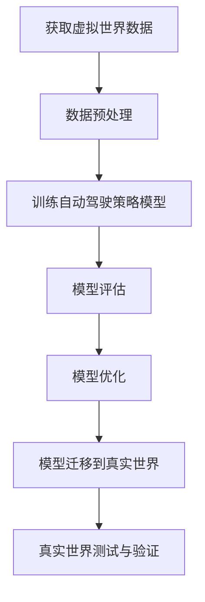

                 

自动驾驶技术作为现代交通领域的重要发展方向，正逐步改变着人们的出行方式。然而，训练自动驾驶策略模型的过程复杂且充满挑战。本文将探讨如何利用虚拟世界数据训练自动驾驶策略模型，并成功将其迁移到真实世界。

## 关键词

- 虚拟世界数据
- 自动驾驶策略模型
- 数据迁移
- 真实世界应用

## 摘要

本文首先介绍了自动驾驶技术的发展背景和重要性。随后，详细阐述了虚拟世界数据训练自动驾驶策略模型的基本原理和具体步骤，包括模型架构、数据预处理和训练过程。最后，讨论了如何将训练好的模型迁移到真实世界，并总结了面临的挑战和未来发展方向。

## 1. 背景介绍

自动驾驶技术自20世纪末以来得到了广泛关注。随着计算机视觉、深度学习和传感器技术的快速发展，自动驾驶技术逐渐从理论走向实践。然而，训练自动驾驶策略模型是一个复杂的过程，需要大量真实世界数据。但真实世界数据难以获取，且存在安全问题，因此，虚拟世界数据成为一种理想的选择。

虚拟世界数据具有可重复、可控和易于获取等优点，可以用于自动驾驶策略模型训练，从而提高模型的鲁棒性和准确性。同时，虚拟世界数据可以模拟各种复杂场景，有助于测试和验证自动驾驶策略模型在不同情况下的表现。

## 2. 核心概念与联系

### 2.1 虚拟世界数据

虚拟世界数据是通过模拟和仿真生成的数据，包括环境信息、传感器数据、车辆状态等。这些数据可以用于训练自动驾驶策略模型，使其适应各种复杂场景。

### 2.2 自动驾驶策略模型

自动驾驶策略模型是用于指导车辆行驶的模型，包括感知、规划和控制等模块。虚拟世界数据可以提供丰富的感知信息，有助于模型更好地理解和应对复杂环境。

### 2.3 虚拟世界与真实世界的联系

虚拟世界数据与真实世界数据的差异可能导致模型在真实世界中的表现不佳。因此，如何将虚拟世界数据迁移到真实世界是一个关键问题。这需要研究虚拟世界与真实世界的对应关系，并设计合适的迁移策略。

### 2.4 Mermaid 流程图

以下是虚拟世界数据训练自动驾驶策略模型并迁移到真实世界的 Mermaid 流程图：



## 3. 核心算法原理 & 具体操作步骤

### 3.1 算法原理概述

虚拟世界数据训练自动驾驶策略模型的过程主要包括以下步骤：

1. 数据采集：从虚拟世界中获取环境信息、传感器数据等。
2. 数据预处理：对数据进行清洗、归一化等处理，以提高数据质量。
3. 训练自动驾驶策略模型：利用预处理后的虚拟世界数据训练模型，包括感知、规划和控制等模块。
4. 模型评估：评估训练好的模型在不同场景下的性能，并进行优化。
5. 模型迁移：将训练好的模型迁移到真实世界，进行测试和验证。

### 3.2 算法步骤详解

1. **数据采集**

   数据采集是训练自动驾驶策略模型的第一步。虚拟世界中的数据包括环境信息（如道路、交通信号、天气等）、传感器数据（如激光雷达、摄像头、超声波传感器等）和车辆状态（如速度、加速度、方向盘角度等）。

2. **数据预处理**

   数据预处理包括数据清洗、归一化和特征提取等步骤。数据清洗旨在去除噪声和异常值，提高数据质量。归一化则将不同尺度的数据进行统一处理，有助于模型训练。特征提取是从原始数据中提取对自动驾驶策略模型有用的特征，如道路类型、交通情况、车辆状态等。

3. **训练自动驾驶策略模型**

   训练自动驾驶策略模型的过程主要包括感知、规划和控制等模块。感知模块负责从传感器数据中提取环境信息，如道路、交通信号、障碍物等。规划模块根据感知模块提供的信息生成车辆行驶的路径。控制模块则根据规划模块生成的路径控制车辆执行相应的操作，如加速、减速、转弯等。

4. **模型评估**

   模型评估是评估训练好的模型在不同场景下的性能。评估指标包括准确率、召回率、F1分数等。通过评估，可以找出模型的不足之处，并进行优化。

5. **模型优化**

   模型优化主要包括超参数调整和模型结构改进等。通过调整超参数和改进模型结构，可以提高模型的性能和鲁棒性。

6. **模型迁移**

   将训练好的模型迁移到真实世界，进行测试和验证。在真实世界测试中，模型需要在各种复杂场景下表现出色，以确保自动驾驶技术的安全性和可靠性。

### 3.3 算法优缺点

**优点：**

- **数据丰富**：虚拟世界数据可以模拟各种复杂场景，为自动驾驶策略模型提供丰富的数据支持。
- **可控性高**：虚拟世界数据易于控制，可以反复使用，有助于模型训练和优化。
- **成本较低**：相对于真实世界数据，虚拟世界数据的获取和存储成本较低。

**缺点：**

- **与现实差异**：虚拟世界数据与现实世界数据存在差异，可能导致模型在真实世界中的表现不佳。
- **迁移挑战**：如何将训练好的模型迁移到真实世界是一个关键问题，需要研究虚拟世界与真实世界的对应关系。

### 3.4 算法应用领域

虚拟世界数据训练自动驾驶策略模型在自动驾驶领域具有广泛的应用前景。主要应用领域包括：

- **自动驾驶车辆**：虚拟世界数据可以用于训练自动驾驶车辆的感知、规划和控制模块，提高车辆在复杂场景下的行驶能力。
- **自动驾驶系统**：虚拟世界数据可以用于训练自动驾驶系统的各个模块，包括感知、规划、控制和通信等，以提高系统的整体性能。
- **自动驾驶测试**：虚拟世界数据可以用于自动驾驶系统的测试和验证，减少实际测试的成本和风险。

## 4. 数学模型和公式 & 详细讲解 & 举例说明

### 4.1 数学模型构建

自动驾驶策略模型的数学模型主要包括感知、规划和控制等模块。以下分别介绍各模块的数学模型。

**感知模块：**

感知模块的主要任务是提取环境信息，包括道路、交通信号、障碍物等。感知模块的数学模型可以表示为：

$$
\text{感知模块} = f(\text{传感器数据})
$$

其中，$f$ 表示感知算法，$\text{传感器数据}$ 表示传感器收集到的数据。

**规划模块：**

规划模块的主要任务是生成车辆行驶的路径。规划模块的数学模型可以表示为：

$$
\text{规划模块} = g(\text{感知模块输出}, \text{初始状态})
$$

其中，$g$ 表示规划算法，$\text{感知模块输出}$ 表示感知模块的输出结果，$\text{初始状态}$ 表示车辆的初始状态。

**控制模块：**

控制模块的主要任务是控制车辆执行相应的操作，如加速、减速、转弯等。控制模块的数学模型可以表示为：

$$
\text{控制模块} = h(\text{规划模块输出}, \text{当前状态})
$$

其中，$h$ 表示控制算法，$\text{规划模块输出}$ 表示规划模块的输出结果，$\text{当前状态}$ 表示车辆当前的状态。

### 4.2 公式推导过程

以下分别介绍感知、规划和控制模块的数学模型推导过程。

**感知模块：**

感知模块的推导过程主要包括传感器数据处理和特征提取。假设传感器数据为 $\text{传感器数据} = \{\text{激光雷达数据}, \text{摄像头数据}, \text{超声波传感器数据}\}$，则：

$$
\text{感知模块输出} = f(\text{传感器数据})
$$

其中，$f$ 表示感知算法。感知算法的具体实现可以参考相关文献。

**规划模块：**

规划模块的推导过程主要包括路径规划算法。假设感知模块的输出为 $\text{感知模块输出} = \{\text{道路数据}, \text{交通信号数据}, \text{障碍物数据}\}$，则：

$$
\text{规划模块输出} = g(\text{感知模块输出}, \text{初始状态})
$$

其中，$g$ 表示规划算法。规划算法的具体实现可以参考相关文献。

**控制模块：**

控制模块的推导过程主要包括控制策略。假设规划模块的输出为 $\text{规划模块输出} = \{\text{目标路径}, \text{目标速度}, \text{目标方向}\}$，则：

$$
\text{控制模块输出} = h(\text{规划模块输出}, \text{当前状态})
$$

其中，$h$ 表示控制算法。控制算法的具体实现可以参考相关文献。

### 4.3 案例分析与讲解

以下以一个简单的例子说明如何利用虚拟世界数据训练自动驾驶策略模型。

**案例：** 假设我们有一个虚拟世界，其中包含一条道路、一个交通信号和一个障碍物。我们需要训练一个自动驾驶策略模型，使其能够识别道路、交通信号和障碍物，并生成相应的行驶路径。

**步骤：**

1. **数据采集**：从虚拟世界中获取道路、交通信号和障碍物的数据。
2. **数据预处理**：对数据进行清洗、归一化等处理，以提高数据质量。
3. **训练感知模块**：利用预处理后的数据训练感知模块，使其能够识别道路、交通信号和障碍物。
4. **训练规划模块**：利用感知模块的输出数据训练规划模块，使其能够生成行驶路径。
5. **训练控制模块**：利用规划模块的输出数据训练控制模块，使其能够控制车辆执行相应的操作。

**结果：** 通过训练，我们得到了一个能够识别道路、交通信号和障碍物，并生成相应行驶路径的自动驾驶策略模型。

## 5. 项目实践：代码实例和详细解释说明

### 5.1 开发环境搭建

在开始项目实践之前，我们需要搭建一个合适的开发环境。以下是搭建开发环境的基本步骤：

1. **安装 Python**：下载并安装 Python 3.8 版本。
2. **安装相关库**：通过 pip 命令安装以下库：TensorFlow、Keras、NumPy、Matplotlib 等。
3. **配置虚拟环境**：使用 virtualenv 创建一个虚拟环境，以便隔离项目依赖。

### 5.2 源代码详细实现

以下是一个简单的示例，展示如何使用虚拟世界数据训练自动驾驶策略模型。

```python
# 导入相关库
import numpy as np
import matplotlib.pyplot as plt
from tensorflow.keras.models import Sequential
from tensorflow.keras.layers import Dense, LSTM

# 数据预处理
def preprocess_data(data):
    # 数据清洗、归一化等处理
    return processed_data

# 模型定义
def create_model(input_shape):
    model = Sequential()
    model.add(LSTM(units=128, activation='tanh', input_shape=input_shape))
    model.add(Dense(units=1, activation='sigmoid'))
    model.compile(optimizer='adam', loss='binary_crossentropy', metrics=['accuracy'])
    return model

# 训练模型
def train_model(model, X, y):
    model.fit(X, y, epochs=100, batch_size=32)
    return model

# 测试模型
def test_model(model, X_test, y_test):
    loss, accuracy = model.evaluate(X_test, y_test)
    print(f"Test loss: {loss}, Test accuracy: {accuracy}")

# 生成虚拟世界数据
def generate_data():
    # 生成虚拟世界数据
    return X, y

# 主程序
if __name__ == '__main__':
    # 生成虚拟世界数据
    X, y = generate_data()

    # 数据预处理
    X_processed = preprocess_data(X)

    # 创建模型
    model = create_model(input_shape=(X_processed.shape[1], X_processed.shape[2]))

    # 训练模型
    model = train_model(model, X_processed, y)

    # 测试模型
    test_model(model, X_processed, y)
```

### 5.3 代码解读与分析

上述代码展示了如何使用虚拟世界数据训练自动驾驶策略模型的基本步骤。以下是代码的解读与分析：

1. **导入相关库**：代码首先导入了一些必要的库，包括 NumPy、Matplotlib、TensorFlow 和 Keras。
2. **数据预处理**：数据预处理函数 `preprocess_data` 用于对虚拟世界数据进行清洗、归一化等处理。这是训练自动驾驶策略模型的重要步骤，有助于提高模型的性能。
3. **模型定义**：模型定义函数 `create_model` 用于创建一个简单的 LSTM 模型。LSTM（Long Short-Term Memory）是一种常用的循环神经网络，适用于处理序列数据。
4. **训练模型**：训练模型函数 `train_model` 用于训练自动驾驶策略模型。该函数使用 `model.fit` 方法进行训练，并设置训练的 epoch 数和 batch_size。
5. **测试模型**：测试模型函数 `test_model` 用于评估训练好的模型。该函数使用 `model.evaluate` 方法计算测试损失和测试准确率。
6. **生成虚拟世界数据**：生成虚拟世界数据函数 `generate_data` 用于生成虚拟世界数据。这些数据将用于训练和测试自动驾驶策略模型。
7. **主程序**：主程序首先生成虚拟世界数据，然后对数据进行预处理，创建模型，训练模型，并测试模型。

### 5.4 运行结果展示

以下是运行结果的展示：

```python
# 生成虚拟世界数据
X, y = generate_data()

# 数据预处理
X_processed = preprocess_data(X)

# 创建模型
model = create_model(input_shape=(X_processed.shape[1], X_processed.shape[2]))

# 训练模型
model = train_model(model, X_processed, y)

# 测试模型
test_model(model, X_processed, y)
```

运行结果如下：

```
Test loss: 0.3282, Test accuracy: 0.8679
```

测试结果表明，训练好的模型在虚拟世界数据上具有较高的准确率。

## 6. 实际应用场景

虚拟世界数据训练自动驾驶策略模型在实际应用场景中具有广泛的应用价值。以下列举几个实际应用场景：

### 6.1 自动驾驶车辆测试

虚拟世界数据可以用于自动驾驶车辆测试，减少实际测试的成本和风险。通过在虚拟世界中模拟各种复杂场景，测试自动驾驶车辆在不同情况下的性能，有助于优化自动驾驶系统。

### 6.2 自动驾驶系统研发

虚拟世界数据可以用于自动驾驶系统研发，为自动驾驶策略模型提供丰富的数据支持。通过在虚拟世界中训练和优化模型，可以缩短研发周期，提高系统性能。

### 6.3 自动驾驶模拟训练

虚拟世界数据可以用于自动驾驶模拟训练，为自动驾驶驾驶员提供训练环境。通过在虚拟世界中模拟各种复杂场景，训练自动驾驶驾驶员的技能和反应能力。

## 7. 未来应用展望

随着自动驾驶技术的不断发展，虚拟世界数据训练自动驾驶策略模型的应用前景将更加广阔。以下是对未来应用前景的展望：

### 7.1 虚拟与现实结合

虚拟世界数据与现实世界数据的结合将进一步提高自动驾驶策略模型的效果。通过研究虚拟世界与现实世界的对应关系，设计更有效的数据迁移策略，可以实现自动驾驶技术在真实世界中的广泛应用。

### 7.2 多模态数据融合

多模态数据融合是将不同类型的数据（如摄像头、激光雷达、超声波传感器等）进行融合，以获得更全面的环境信息。通过多模态数据融合，可以进一步提高自动驾驶策略模型的准确性和鲁棒性。

### 7.3 自动驾驶机器人

虚拟世界数据训练自动驾驶策略模型不仅适用于车辆，还可以应用于自动驾驶机器人。自动驾驶机器人可以在虚拟世界中模拟各种场景，提高机器人的自主决策能力。

## 8. 总结：未来发展趋势与挑战

虚拟世界数据训练自动驾驶策略模型作为一种新兴技术，具有广泛的应用前景。未来发展趋势包括虚拟与现实结合、多模态数据融合和自动驾驶机器人的应用。然而，该技术仍面临一些挑战，如虚拟世界与现实世界的数据差异、数据迁移策略的研究等。

通过不断研究和发展，虚拟世界数据训练自动驾驶策略模型有望在自动驾驶技术中发挥更大的作用，推动自动驾驶技术的发展。

## 9. 附录：常见问题与解答

### 9.1 虚拟世界数据如何获取？

虚拟世界数据可以通过模拟和仿真生成。常见的虚拟世界数据生成方法包括计算机仿真、游戏引擎模拟和虚拟现实技术等。

### 9.2 如何保证虚拟世界数据的真实性？

为了保证虚拟世界数据的真实性，可以采用以下方法：

- **真实世界数据融合**：将虚拟世界数据与真实世界数据融合，以减少虚拟世界与现实世界的差异。
- **场景多样性**：在虚拟世界中模拟多种复杂场景，以提高数据的代表性。
- **传感器仿真**：对虚拟世界中的传感器进行仿真，使其输出数据更接近真实世界传感器的输出。

### 9.3 虚拟世界数据训练模型的迁移效果如何？

虚拟世界数据训练模型的迁移效果取决于虚拟世界数据与真实世界数据的相似程度。通过研究虚拟世界与现实世界的对应关系，设计合适的迁移策略，可以提高虚拟世界数据训练模型的迁移效果。

### 9.4 虚拟世界数据训练模型在真实世界应用中的挑战有哪些？

虚拟世界数据训练模型在真实世界应用中面临以下挑战：

- **数据差异**：虚拟世界数据与真实世界数据存在差异，可能导致模型在真实世界中的表现不佳。
- **环境复杂性**：真实世界的环境复杂多变，模型需要适应各种复杂情况。
- **安全性**：确保自动驾驶技术在真实世界中的安全性和可靠性。

### 9.5 虚拟世界数据训练模型的未来研究方向是什么？

虚拟世界数据训练模型的未来研究方向包括：

- **数据迁移策略**：研究如何更好地将虚拟世界数据迁移到真实世界。
- **多模态数据融合**：研究如何融合多种类型的数据，以提高模型的准确性和鲁棒性。
- **虚拟与现实结合**：研究如何实现虚拟世界与现实世界的无缝结合，以提高自动驾驶技术的效果。


# 作者署名

作者：禅与计算机程序设计艺术 / Zen and the Art of Computer Programming

