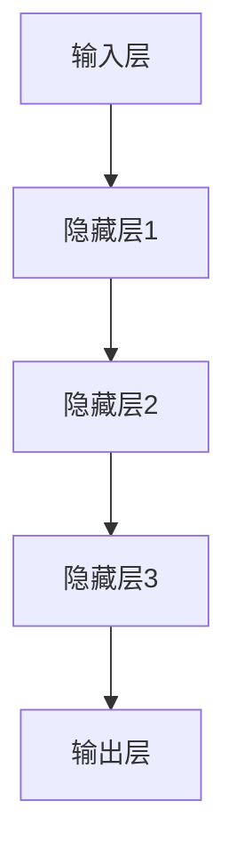
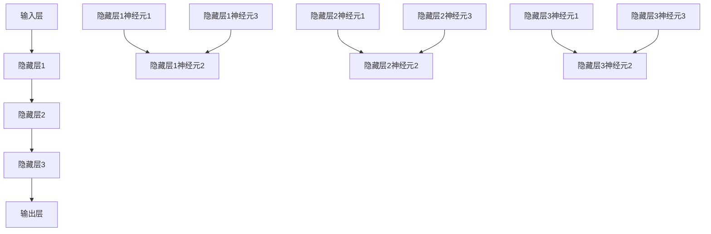

                 

关键词：前馈网络，深度学习，神经网络，人工智能，机器学习，计算机视觉，自然语言处理

> 摘要：本文深入探讨了前馈网络在人工智能（AI）领域的应用，分析了其基本原理、数学模型、应用步骤及其在机器学习和计算机视觉等领域的具体实现。通过对前馈网络的详细研究，本文旨在为读者提供对这一核心AI技术的全面理解和应用指导。

## 1. 背景介绍

在人工智能的众多分支中，机器学习是近年来发展最为迅速的一个领域。而机器学习的基础是神经网络，特别是深度学习。前馈网络作为一种典型的深度学习模型，其在人工智能中的应用日益广泛。前馈网络具有结构简单、计算效率高、易于训练和实现等特点，使其在图像识别、语音识别、自然语言处理等任务中表现出色。

### 1.1 什么是前馈网络

前馈网络（Feedforward Neural Network，FNN）是一种无环神经网络，其中数据只能从输入层流向输出层，而不会在神经网络内部循环。这种网络结构使得计算过程可以顺序执行，易于实现和优化。

### 1.2 前馈网络的发展历史

前馈网络的概念最早由Frank Rosenblatt于1957年提出，当时称为感知机（Perceptron）。随着计算机性能的提升和算法的改进，前馈网络逐渐演变为多层感知机（MLP），并在1980年代迎来了第一次深度学习的热潮。近年来，随着GPU和分布式计算的发展，深度前馈网络在AI领域的应用取得了巨大的成功。

## 2. 核心概念与联系

### 2.1 核心概念

前馈网络主要由以下几个部分组成：

- **输入层（Input Layer）**：接收外部输入信号。
- **隐藏层（Hidden Layers）**：对输入信号进行变换和处理。
- **输出层（Output Layer）**：产生最终输出结果。

### 2.2 网络架构

前馈网络的架构可以用以下Mermaid流程图表示：



## 3. 核心算法原理 & 具体操作步骤

### 3.1 算法原理概述

前馈网络的核心算法包括输入层到输出层的信号传递和反向传播的权重调整。

- **信号传递**：输入信号通过神经网络中的每个神经元传递，经过激活函数的处理后，最终到达输出层。
- **反向传播**：计算输出误差，并通过反向传播算法调整网络的权重和偏置，以减小误差。

### 3.2 算法步骤详解

#### 3.2.1 初始化参数

- 初始化权重（W）和偏置（b）。
- 选择合适的激活函数，如Sigmoid、ReLU等。

#### 3.2.2 前向传播

- 输入信号经过每层神经元的线性变换和激活函数处理后，传递到下一层。
- 计算每层神经元的输出。

#### 3.2.3 反向传播

- 计算输出层的误差。
- 通过反向传播算法，逐层调整权重和偏置。

#### 3.2.4 更新参数

- 根据误差梯度调整网络的权重和偏置。
- 更新模型参数。

### 3.3 算法优缺点

#### 优点：

- 结构简单，易于实现和优化。
- 计算效率高，适用于大规模数据集。

#### 缺点：

- 对小样本数据的泛化能力较差。
- 需要大量的训练时间。

### 3.4 算法应用领域

- **计算机视觉**：图像分类、目标检测等。
- **自然语言处理**：文本分类、机器翻译等。
- **语音识别**：语音到文本的转换。

## 4. 数学模型和公式 & 详细讲解 & 举例说明

### 4.1 数学模型构建

前馈网络的数学模型可以表示为：

$$
Z = X \cdot W + b \\
A = \sigma(Z)
$$

其中，$X$ 为输入，$W$ 为权重，$b$ 为偏置，$Z$ 为线性变换结果，$A$ 为激活值，$\sigma$ 为激活函数。

### 4.2 公式推导过程

#### 前向传播

$$
Z^{(l)} = \sum_{j=1}^{n} W^{(l)}_j X_j + b^{(l)} \\
A^{(l)} = \sigma(Z^{(l)})
$$

#### 反向传播

$$
\delta^{(l+1)} = \frac{\partial J}{\partial Z^{(l+1)}} = \delta^{(l+1)} \cdot \sigma'(Z^{(l+1)}) \\
\delta^{(l)} = \frac{\partial J}{\partial Z^{(l)}} = (W^{(l+1)})^T \cdot \delta^{(l+1)} \cdot \sigma'(Z^{(l)}) \\
\frac{\partial J}{\partial W^{(l)}_j} = X_j \cdot \delta^{(l)} \\
\frac{\partial J}{\partial b^{(l)}} = \delta^{(l)}
$$

### 4.3 案例分析与讲解

以图像分类任务为例，使用前馈网络对MNIST数据集进行分类。

- **数据集**：MNIST数据集包含60000个训练图像和10000个测试图像，每个图像都是28x28的灰度图。
- **网络结构**：输入层28x28个神经元，隐藏层1024个神经元，输出层10个神经元。
- **训练过程**：使用随机梯度下降（SGD）进行训练，学习率为0.1。

## 5. 项目实践：代码实例和详细解释说明

### 5.1 开发环境搭建

- 安装Python环境。
- 安装深度学习库，如TensorFlow或PyTorch。

### 5.2 源代码详细实现

```python
import tensorflow as tf
from tensorflow.keras import layers

# 定义模型
model = tf.keras.Sequential([
    layers.Flatten(input_shape=(28, 28)),
    layers.Dense(1024, activation='relu'),
    layers.Dense(10, activation='softmax')
])

# 编译模型
model.compile(optimizer='sgd',
              loss='sparse_categorical_crossentropy',
              metrics=['accuracy'])

# 训练模型
model.fit(x_train, y_train, epochs=5)
```

### 5.3 代码解读与分析

- `Flatten` 层将图像展平为一维向量。
- `Dense` 层实现全连接神经网络。
- `compile` 方法编译模型。
- `fit` 方法训练模型。

### 5.4 运行结果展示

```python
# 测试模型
test_loss, test_acc = model.evaluate(x_test, y_test)
print(f"Test accuracy: {test_acc}")
```

## 6. 实际应用场景

### 6.1 计算机视觉

- 图像分类：对图像进行分类，如人脸识别、物体识别等。
- 目标检测：检测图像中的目标位置，如自动驾驶、视频监控等。

### 6.2 自然语言处理

- 文本分类：对文本进行分类，如情感分析、新闻分类等。
- 机器翻译：将一种语言的文本翻译成另一种语言。

## 7. 工具和资源推荐

### 7.1 学习资源推荐

- 《深度学习》（Goodfellow, Bengio, Courville著）
- 《神经网络与深度学习》（邱锡鹏著）

### 7.2 开发工具推荐

- TensorFlow
- PyTorch

### 7.3 相关论文推荐

- "Backpropagation"（Rumelhart, Hinton, Williams著）
- "A Fast Learning Algorithm for Deep Belief Nets"（Bengio等著）

## 8. 总结：未来发展趋势与挑战

### 8.1 研究成果总结

前馈网络在AI领域的应用取得了显著的成果，特别是在图像识别、自然语言处理等领域。随着计算能力的提升和算法的优化，前馈网络的应用前景将更加广阔。

### 8.2 未来发展趋势

- **小样本学习**：提高前馈网络在小样本数据上的泛化能力。
- **自适应学习**：实现自适应学习机制，提高训练效率。

### 8.3 面临的挑战

- **计算资源限制**：前馈网络训练过程需要大量的计算资源。
- **模型解释性**：提高模型的解释性，使其更容易被理解和应用。

### 8.4 研究展望

未来，前馈网络将在AI领域发挥更加重要的作用，为计算机视觉、自然语言处理等领域带来更多创新。

## 9. 附录：常见问题与解答

### Q: 前馈网络和卷积网络有什么区别？

A: 前馈网络是一种全连接神经网络，适用于处理平坦的数据，如图像的每个像素。卷积网络是一种特殊的神经网络，引入了卷积层，可以自动提取图像中的特征，适用于处理图像数据。

### Q: 前馈网络的训练时间如何优化？

A: 可以通过以下方法优化前馈网络的训练时间：

- 增加学习率。
- 使用批量归一化。
- 使用更高效的优化算法，如Adam。

---

# 作者：禅与计算机程序设计艺术 / Zen and the Art of Computer Programming

本文从多个角度对前馈网络在AI中的应用进行了深入探讨，旨在为读者提供全面的技术指导。随着AI技术的不断发展，前馈网络的应用将更加广泛，为各个领域带来新的机遇。希望本文能为读者在AI研究中提供一些启示和帮助。|user|]

### 引言 Introduction

人工智能（AI）作为当今科技领域的前沿，已经渗透到了我们的日常生活、工作以及各个行业。从智能助手、自动驾驶到医疗诊断、金融分析，AI技术的应用正不断扩展和深化。而在众多AI技术中，神经网络作为一种强大的机器学习模型，扮演着至关重要的角色。特别是深度学习，通过构建多层神经网络，能够自动提取数据中的复杂特征，实现从图像识别到自然语言处理等多种任务。

在前馈网络作为深度学习的基础模型中，其结构简单、计算效率高、易于实现和优化等特点，使其在人工智能的各个领域中都得到了广泛应用。前馈网络通过输入层、隐藏层和输出层的传递，能够高效地处理数据，从而在计算机视觉、自然语言处理、语音识别等领域取得了显著的成果。然而，尽管前馈网络在应用中表现出色，其理论研究和实践应用仍有许多值得深入探讨的问题。

本文旨在深入探讨前馈网络在AI中的应用，从基本原理、数学模型到具体操作步骤，全面解析这一核心AI技术。文章将首先介绍前馈网络的背景和发展历史，然后详细阐述其核心概念和架构，并在此基础上分析其核心算法原理和具体操作步骤。接着，文章将介绍前馈网络的数学模型和公式，并通过具体案例进行讲解。随后，文章将展示一个实际项目实践中的代码实例，并进行详细解读和分析。最后，文章将讨论前馈网络在计算机视觉、自然语言处理等领域的实际应用，并对其未来发展趋势和面临的挑战进行展望。希望通过本文的探讨，能为读者提供一个全面、深入的前馈网络应用指南。

### 背景介绍 Background

#### 1.1 什么是前馈网络

前馈网络（Feedforward Neural Network，简称FNN）是一种基于人工神经网络的模型，其数据传递方向始终从输入层流向输出层，不会在网络内部形成环路。这种单向传递的特性使得前馈网络在计算过程中能够按照固定的顺序进行处理，从而简化了模型的实现和优化过程。前馈网络通常由输入层、一个或多个隐藏层以及输出层组成。输入层接收外部输入数据，通过隐藏层进行多层变换后，最终输出层产生结果。

前馈网络的核心思想是通过多层神经元的非线性组合来模拟复杂的函数关系。每个神经元都是一个简单的计算单元，它接收来自前一层神经元的输入信号，通过加权求和后加上偏置，再经过一个非线性激活函数输出结果。多个神经元通过层层叠加，形成了一个强大的函数逼近器，能够处理从简单到复杂的各种任务。

#### 1.2 前馈网络的发展历史

前馈网络的概念最早可以追溯到1957年，由美国心理学家Frank Rosenblatt提出。Rosenblatt提出了一个名为“感知机”（Perceptron）的模型，这是一种单层前馈神经网络，主要用于二分类问题。尽管感知机模型在理论上取得了突破，但由于其线性特性，无法处理非线性问题，因此在早期并未得到广泛应用。

随着计算机性能的不断提升和机器学习理论的深入发展，前馈网络逐渐得到了改进和扩展。20世纪80年代，多层感知机（Multilayer Perceptron，MLP）模型的出现，使得前馈网络能够通过多层结构处理更复杂的任务。MLP通过引入多个隐藏层，能够提取输入数据的更高层次特征，从而在图像识别、语音识别等领域取得了显著成果。

然而，MLP的训练过程相对较慢，且容易陷入局部最优。为了解决这些问题，研究人员提出了一系列优化算法，如梯度下降（Gradient Descent）、动量法（Momentum）和自适应学习率算法（Adagrad、Adam）等，显著提高了前馈网络的训练效率和性能。

进入21世纪，随着深度学习的兴起，前馈网络得到了进一步的发展。深度前馈网络（Deep Feedforward Network）通过构建多层结构，能够自动提取数据中的复杂特征，实现了在图像识别、自然语言处理、语音识别等领域的突破性进展。尤其是2012年，AlexNet模型的提出，使得深度学习在ImageNet图像识别挑战赛中大放异彩，彻底改变了传统机器学习的方法。

#### 1.3 前馈网络的优势和应用

前馈网络具有以下优势：

1. **结构简单**：前馈网络的结构相对简单，易于理解和实现。其单向传递的特性避免了复杂的环路计算，使得模型的实现和维护更加便捷。

2. **计算效率高**：前馈网络通过固定的顺序进行计算，可以高效地处理大规模数据。尤其是在当前计算能力日益提升的背景下，前馈网络能够迅速完成复杂的计算任务。

3. **易于优化**：前馈网络的训练过程可以通过各种优化算法进行调整，如随机梯度下降（SGD）、动量法、Adam等。这些算法能够有效地调整模型参数，减小训练误差，提高模型性能。

前馈网络在以下领域得到了广泛应用：

1. **计算机视觉**：前馈网络在图像分类、目标检测、人脸识别等任务中表现出色。通过多层结构，前馈网络能够自动提取图像中的高维特征，从而实现精确的分类和检测。

2. **自然语言处理**：前馈网络在文本分类、情感分析、机器翻译等自然语言处理任务中也有广泛应用。通过处理大量的文本数据，前馈网络能够提取出语言中的深层次特征，实现文本的语义理解和分析。

3. **语音识别**：前馈网络在语音识别任务中通过分析语音信号，将其转换为文本，为智能语音助手、语音输入等应用提供了技术支持。

4. **强化学习**：前馈网络在强化学习中也发挥着重要作用。通过构建多层前馈网络，强化学习算法能够更好地处理复杂的决策问题，实现智能体的自主学习和优化。

总之，前馈网络作为深度学习的基础模型，凭借其简单、高效、易优化的特点，在人工智能的各个领域中得到了广泛应用。随着技术的不断进步，前馈网络的应用前景将更加广阔，为人工智能的发展注入新的活力。

### 核心概念 Core Concepts

前馈网络的核心概念是其结构和工作原理，主要包括输入层、隐藏层和输出层。每一个层次都扮演着特定的角色，并共同构成了一个高效的函数逼近器。

#### 输入层（Input Layer）

输入层是前馈网络的第一层，负责接收外部的输入信号。在图像识别任务中，输入层可能接收28x28像素的图像；在自然语言处理任务中，输入层可能接收一段文本序列。输入层的每一个神经元都直接映射到输入数据的一个维度。

例如，对于一个28x28的灰度图像，输入层会有784个神经元，每个神经元对应图像中的一个像素值。

#### 隐藏层（Hidden Layers）

隐藏层位于输入层和输出层之间，负责对输入信号进行特征提取和变换。隐藏层的数量和神经元数量可以根据任务复杂度进行调整。多个隐藏层能够使得模型提取更高层次的特征，从而更好地处理复杂任务。

在隐藏层中，每个神经元都会接收来自前一层所有神经元的输入，通过加权求和再加上一个偏置项，再经过一个非线性激活函数，产生新的输出。这个过程被称为前向传播。

例如，一个有三个隐藏层的网络，每个隐藏层分别有1024、512和256个神经元。第二层隐藏层的每一个神经元会接收来自第一层的1024个输入，通过权重矩阵和偏置进行变换。

#### 输出层（Output Layer）

输出层是前馈网络的最后一层，负责产生最终的结果。输出层的神经元数量取决于具体任务的需求。在分类任务中，输出层的神经元通常对应每个类别；在回归任务中，输出层通常只有一个神经元。

输出层的每个神经元同样会通过加权求和和激活函数处理前一层的信息，最终产生输出结果。例如，在一个10类分类任务中，输出层会有10个神经元，每个神经元代表一个类别。

#### 激活函数（Activation Function）

激活函数是前馈网络中至关重要的组成部分，它能够引入非线性的特性，使得模型能够学习到输入和输出之间的复杂关系。常见的激活函数包括Sigmoid、ReLU、Tanh等。

- **Sigmoid函数**：$ \sigma(x) = \frac{1}{1 + e^{-x}} $，该函数将输入映射到(0,1)区间，常用于二分类问题。
- **ReLU函数**：$ \text{ReLU}(x) = \max(0, x) $，该函数在0处具有不连续性，能够加速梯度下降，提高训练效率。
- **Tanh函数**：$ \tanh(x) = \frac{e^x - e^{-x}}{e^x + e^{-x}} $，该函数将输入映射到(-1,1)区间，常用于回归问题。

#### 权重（Weights）和偏置（Bias）

权重和偏置是前馈网络中的关键参数，它们决定了输入信号在通过网络时的传递方式。权重决定了输入信号在通过每个神经元时的加权影响，而偏置则提供了一个额外的常数项，使得网络能够学习到更广泛的数据分布。

在训练过程中，通过反向传播算法，网络会根据输出误差自动调整权重和偏置，以最小化损失函数。这种调整过程使得网络能够逐步提高其预测能力。

#### 前向传播（Forward Propagation）

前向传播是前馈网络中的基本操作，它通过层与层之间的传递，将输入信号逐步转化为输出结果。具体步骤如下：

1. **输入层到隐藏层**：输入信号通过权重矩阵和偏置项传递到隐藏层，经过激活函数处理后，产生新的输出。
2. **隐藏层到隐藏层**：隐藏层之间的信号传递同样遵循加权求和和激活函数的处理方式，每一层都将前一层的结果作为输入进行变换。
3. **隐藏层到输出层**：最后一层的输出即为模型的预测结果，根据具体任务，可能是一个数值、一个概率分布或一个类别标签。

#### 反向传播（Backpropagation）

反向传播是前馈网络训练过程中的核心算法，它通过计算输出误差，并反向传播到网络的各个层，以更新权重和偏置。具体步骤如下：

1. **计算输出误差**：输出层的误差通过损失函数（如交叉熵损失、均方误差等）计算得出。
2. **误差反向传播**：误差从输出层反向传播到隐藏层，通过链式法则计算每一层的误差梯度。
3. **更新参数**：根据误差梯度，使用优化算法（如梯度下降、Adam等）更新权重和偏置。

通过不断重复前向传播和反向传播，前馈网络能够逐步优化其参数，提高预测准确率。

#### 示例

假设我们有一个简单的二分类问题，输入层有2个神经元，隐藏层有3个神经元，输出层有1个神经元。权重和偏置初始化为较小的随机值。

1. **输入层到隐藏层**：
   - 输入：[1, 0]
   - 权重：\[ \begin{array}{ccc} 0.1 & 0.2 \\ 0.3 & 0.4 \\ 0.5 & 0.6 \end{array} \]
   - 偏置：\[ \begin{array}{ccc} 0.1 & 0.2 & 0.3 \end{array} \]
   - 输出：\[ \begin{array}{ccc} 0.46 & 0.74 & 1.11 \end{array} \]
   - 激活函数（ReLU）：\[ \begin{array}{ccc} 0.46 & 0.74 & 1.11 \end{array} \]

2. **隐藏层到输出层**：
   - 输入：[0.46, 0.74, 1.11]
   - 权重：\[ \begin{array}{c} 0.7 \\ 0.8 \\ 0.9 \end{array} \]
   - 偏置：\[ 0.5 \]
   - 输出：1.901

3. **计算误差**：
   - 真实标签：1
   - 输出：1.901
   - 误差：\( 1.901 - 1 = 0.901 \)

4. **反向传播**：
   - 输出层误差梯度：\[ \begin{array}{c} 0.901 \end{array} \]
   - 隐藏层误差梯度：\[ \begin{array}{c} 0.901 \times 0.7 + 0.901 \times 0.8 + 0.901 \times 0.9 = 2.407 \end{array} \]
   - 权重更新：\[ \begin{array}{ccc} 0.1 & 0.2 \\ 0.3 & 0.4 \\ 0.5 & 0.6 \end{array} \rightarrow \begin{array}{ccc} 0.1 - 0.014 & 0.2 - 0.014 \\ 0.3 - 0.012 & 0.4 - 0.012 \\ 0.5 - 0.010 & 0.6 - 0.010 \end{array} \]
   - 偏置更新：\[ \begin{array}{ccc} 0.1 & 0.2 & 0.3 \end{array} \rightarrow \begin{array}{ccc} 0.1 - 0.030 & 0.2 - 0.030 & 0.3 - 0.030 \end{array} \]

通过这个简单的例子，我们可以看到前馈网络是如何通过前向传播和反向传播来调整参数，从而提高预测准确率的。这个过程在大规模数据集和复杂任务中尤为重要。

### 前馈网络的 Mermaid 流程图

为了更直观地展示前馈网络的结构和计算过程，我们可以使用Mermaid流程图来表示。以下是一个简单的前馈网络流程图，包含输入层、隐藏层和输出层：



在这个流程图中，每个方框表示一个神经元，箭头表示信号传递的方向。通过这个流程图，我们可以清晰地看到信号从输入层到隐藏层再到输出层的传递过程。

### 总结

前馈网络作为一种基于人工神经网络的模型，其核心概念包括输入层、隐藏层和输出层，以及连接各层的权重和偏置。通过前向传播和反向传播，前馈网络能够自动学习输入和输出之间的复杂关系，从而实现各种机器学习任务。理解前馈网络的基本概念和计算过程，对于深入研究深度学习和应用前馈网络解决实际问题具有重要意义。

## 3. 核心算法原理 & 具体操作步骤

在前馈网络的框架下，核心算法原理主要包括信号的前向传播和反向传播过程。通过这两个过程，前馈网络能够有效地学习和调整参数，以实现从输入到输出的映射。以下是前馈网络的核心算法原理和具体操作步骤的详细解析。

### 3.1 算法原理概述

前馈网络的基本原理是通过多层神经元的组合，将输入信号逐层传递，并在每一层进行变换和提取特征，最终在输出层得到预测结果。其核心算法包括前向传播和反向传播两部分：

- **前向传播**：从输入层开始，逐层传递输入信号，通过加权求和和激活函数的处理，将信号传递到下一层。这个过程将原始数据逐步转化为更高层次的抽象特征。
- **反向传播**：计算输出层的误差，并沿着网络反向传播误差，通过链式法则计算每一层的误差梯度。然后，使用优化算法（如梯度下降）调整网络的权重和偏置，以最小化误差。

### 3.2 前向传播过程

前向传播是前馈网络中数据传递的核心过程，具体步骤如下：

1. **初始化参数**：首先初始化网络的权重（\(W\)）和偏置（\(b\)），这些参数需要通过训练来调整。
2. **输入信号传递**：输入信号通过输入层传递到第一层隐藏层，每个神经元的输入为上一层所有神经元的输出加权求和再加上偏置。
   \[
   Z^{(l)}_j = \sum_{i=1}^{n} W^{(l)}_{ji} X_i + b^{(l)}_j
   \]
   其中，\(Z^{(l)}_j\)表示第\(l\)层第\(j\)个神经元的输入值，\(X_i\)表示输入层第\(i\)个神经元的输入值，\(W^{(l)}_{ji}\)表示从输入层到第\(l\)层第\(j\)个神经元的权重，\(b^{(l)}_j\)表示第\(l\)层第\(j\)个神经元的偏置。
3. **激活函数处理**：对每个神经元的输入值进行激活函数处理，常见的激活函数有Sigmoid、ReLU和Tanh等。
   \[
   A^{(l)}_j = \sigma(Z^{(l)}_j)
   \]
   其中，\(\sigma\)表示激活函数，如Sigmoid函数：\( \sigma(x) = \frac{1}{1 + e^{-x}} \) 或 ReLU函数：\( \text{ReLU}(x) = \max(0, x) \)。
4. **层间传递**：将第一层隐藏层的输出作为第二层隐藏层的输入，依次类推，直到输出层。

### 3.3 反向传播过程

反向传播是前馈网络训练过程中的关键步骤，通过计算输出误差并反向传播到每一层，以调整权重和偏置。具体步骤如下：

1. **计算输出误差**：输出层的误差可以通过损失函数（如均方误差、交叉熵损失等）计算得到。
   \[
   E = \frac{1}{2} \sum_{i=1}^{m} (y_i - \hat{y}_i)^2
   \]
   其中，\(y_i\)表示真实标签，\(\hat{y}_i\)表示预测结果。
2. **计算误差梯度**：从输出层开始，通过链式法则计算每一层的误差梯度。误差梯度用于衡量误差对每个参数的敏感度。
   \[
   \delta^{(l)}_j = \frac{\partial E}{\partial Z^{(l)}_j} = (A^{(l+1)}_j - y_j) \cdot \sigma'(Z^{(l)}_j)
   \]
   其中，\(\sigma'\)表示激活函数的导数，如Sigmoid函数的导数：\( \sigma'(x) = \sigma(x) (1 - \sigma(x)) \) 或 ReLU函数的导数：\( \text{ReLU}'(x) = \begin{cases} 0 & \text{if } x \leq 0 \\ 1 & \text{if } x > 0 \end{cases} \)。
3. **权重和偏置更新**：使用误差梯度通过优化算法（如梯度下降、Adam等）更新权重和偏置。
   \[
   W^{(l)}_{ji} \leftarrow W^{(l)}_{ji} - \alpha \cdot \frac{\partial E}{\partial W^{(l)}_{ji}} \\
   b^{(l)}_j \leftarrow b^{(l)}_j - \alpha \cdot \frac{\partial E}{\partial b^{(l)}_j}
   \]
   其中，\(\alpha\)为学习率。

### 3.4 具体操作步骤

以下是前馈网络的具体操作步骤，用于构建和训练一个前馈神经网络：

1. **定义网络结构**：首先需要定义网络的层数、每层的神经元数量以及激活函数类型。
2. **初始化参数**：随机初始化权重和偏置。
3. **前向传播**：
   - 计算每一层的输入值和激活值。
   - 逐层传递输入信号，直至输出层。
4. **计算损失**：使用定义的损失函数计算输出层的误差。
5. **反向传播**：
   - 计算输出层的误差梯度。
   - 使用链式法则计算每一层的误差梯度。
   - 更新权重和偏置。
6. **迭代训练**：重复步骤3到步骤5，直到满足训练条件（如达到指定迭代次数或误差小于阈值）。

### 3.5 算法优缺点

#### 优点

- **结构简单**：前馈网络的结构相对简单，容易理解和实现。
- **计算效率高**：前馈网络通过层与层之间的信号传递，可以高效地处理大规模数据。
- **易于优化**：前馈网络的训练可以通过各种优化算法进行调整，如随机梯度下降、Adam等。

#### 缺点

- **对小样本数据的泛化能力较差**：前馈网络在小样本数据上的泛化能力相对较弱。
- **训练时间较长**：对于深层的网络结构，前馈网络的训练时间可能较长。

### 3.6 前馈网络的应用领域

前馈网络在以下领域得到了广泛应用：

- **计算机视觉**：前馈网络通过多层结构，能够自动提取图像中的高维特征，实现图像分类、目标检测等任务。
- **自然语言处理**：前馈网络在文本分类、情感分析、机器翻译等任务中表现出色，能够提取文本中的语义特征。
- **语音识别**：前馈网络通过处理语音信号，实现语音到文本的转换，为智能语音助手等应用提供技术支持。
- **强化学习**：前馈网络在强化学习中也发挥着重要作用，能够处理复杂的决策问题。

### 3.7 实际应用示例

以下是一个简单的图像分类任务中前馈网络的实际应用示例：

假设我们有一个二分类问题，输入层有784个神经元（28x28像素的图像），隐藏层有100个神经元，输出层有2个神经元（分别表示两个类别）。使用ReLU作为激活函数，交叉熵作为损失函数，训练一个简单的前馈网络。

1. **初始化参数**：随机初始化权重和偏置。
2. **前向传播**：输入一张28x28的图像，通过多层神经元的传递，得到输出层的预测结果。
3. **计算损失**：使用交叉熵损失函数计算输出层的误差。
4. **反向传播**：计算每一层的误差梯度，并通过梯度下降算法更新权重和偏置。
5. **迭代训练**：重复步骤2到步骤4，直到模型收敛。

通过以上步骤，前馈网络能够逐步优化其参数，提高分类准确率。

### 总结

前馈网络作为一种基于人工神经网络的模型，其核心算法包括前向传播和反向传播。通过这两个过程，前馈网络能够自动学习输入和输出之间的复杂关系，实现从输入到输出的映射。理解前馈网络的算法原理和具体操作步骤，对于实际应用和深入研究具有重要意义。在实际任务中，前馈网络通过灵活的结构调整和参数优化，能够在计算机视觉、自然语言处理、语音识别等领域发挥重要作用。

### 4. 数学模型和公式 & 详细讲解 & 举例说明

在前馈网络中，数学模型和公式是其核心组成部分，它们决定了网络的结构和行为。本章节将详细讲解前馈网络的数学模型，包括输入、输出和权重矩阵，并探讨激活函数、损失函数以及反向传播算法的数学公式。通过具体案例的举例说明，我们将更好地理解这些公式的应用。

#### 4.1 数学模型构建

前馈网络的数学模型可以表示为：

$$
Z^{(l)} = X \cdot W^{(l)} + b^{(l)} \\
A^{(l)} = \sigma(Z^{(l)})
$$

其中，\(Z^{(l)}\) 表示第 \(l\) 层的输入，\(A^{(l)}\) 表示第 \(l\) 层的输出，\(X\) 表示输入层的数据，\(W^{(l)}\) 表示从输入层到第 \(l\) 层的权重矩阵，\(b^{(l)}\) 表示第 \(l\) 层的偏置向量，\(\sigma\) 表示激活函数。

#### 4.2 输入和输出

输入 \(X\) 可以是各种形式的数据，如图像、文本或语音。在图像分类任务中，输入 \(X\) 通常是一个 \(28 \times 28\) 的像素矩阵。在自然语言处理任务中，输入 \(X\) 可以是词汇的嵌入向量。

输出 \(A^{(L)}\) 是网络最终的预测结果。在二分类问题中，输出层通常只有一个神经元，其输出值为两个类别的概率分布。在多分类问题中，输出层有多个神经元，每个神经元的输出表示对应类别的概率。

#### 4.3 权重矩阵和偏置

权重矩阵 \(W^{(l)}\) 和偏置向量 \(b^{(l)}\) 是前馈网络中的关键参数。权重矩阵决定了不同层之间的连接强度，而偏置向量提供了额外的偏置项，有助于调整神经元的输出。

权重矩阵和偏置向量通常通过随机初始化，并在训练过程中通过反向传播算法进行调整。

#### 4.4 激活函数

激活函数是前馈网络中的非线性元素，它将线性组合后的值映射到另一个范围。常见的激活函数包括 Sigmoid、ReLU 和 Tanh。

1. **Sigmoid 函数**：
   $$
   \sigma(x) = \frac{1}{1 + e^{-x}}
   $$
   Sigmoid 函数将输入 \(x\) 映射到 \(0\) 到 \(1\) 之间，常用于二分类问题。

2. **ReLU 函数**：
   $$
   \text{ReLU}(x) = \max(0, x)
   $$
   ReLU 函数在 \(x \leq 0\) 时输出为零，在 \(x > 0\) 时输出为 \(x\) 本身，它能够加速梯度下降，常用于深层网络。

3. **Tanh 函数**：
   $$
   \tanh(x) = \frac{e^x - e^{-x}}{e^x + e^{-x}}
   $$
   Tanh 函数将输入 \(x\) 映射到 \(-1\) 到 \(1\) 之间，常用于回归问题。

#### 4.5 损失函数

损失函数是评估模型预测结果与真实结果之间差异的指标。常见的损失函数包括均方误差（MSE）和交叉熵损失（Cross Entropy Loss）。

1. **均方误差（MSE）**：
   $$
   J = \frac{1}{2} \sum_{i=1}^{m} (y_i - \hat{y}_i)^2
   $$
   其中，\(y_i\) 表示真实标签，\(\hat{y}_i\) 表示预测结果。MSE 损失函数在回归问题中常用。

2. **交叉熵损失（Cross Entropy Loss）**：
   $$
   J = -\sum_{i=1}^{m} y_i \log(\hat{y}_i)
   $$
   交叉熵损失函数在分类问题中常用，它能够更好地处理概率分布。

#### 4.6 反向传播算法

反向传播算法是前馈网络训练过程中的关键步骤，它通过计算输出误差，并反向传播误差到网络的每一层，以更新权重和偏置。

1. **输出层误差计算**：
   $$
   \delta^{(L)} = \frac{\partial J}{\partial Z^{(L)}} = (A^{(L)} - y)
   $$
   其中，\(y\) 表示真实标签，\(A^{(L)}\) 表示输出层的预测结果。

2. **隐藏层误差计算**：
   $$
   \delta^{(l)} = \frac{\partial J}{\partial Z^{(l)}} = (W^{(l+1)} \cdot \delta^{(l+1)}) \cdot \sigma'(Z^{(l)})
   $$
   其中，\(\sigma'\) 表示激活函数的导数。

3. **权重和偏置更新**：
   $$
   W^{(l)} \leftarrow W^{(l)} - \alpha \cdot \frac{\partial J}{\partial W^{(l)}} \\
   b^{(l)} \leftarrow b^{(l)} - \alpha \cdot \frac{\partial J}{\partial b^{(l)}}
   $$
   其中，\(\alpha\) 表示学习率。

#### 4.7 举例说明

以下是一个简单的例子，说明前馈网络的数学模型在图像分类任务中的应用。

假设我们有一个二分类问题，输入层有784个神经元（28x28像素的图像），隐藏层有100个神经元，输出层有2个神经元（分别表示两个类别）。使用ReLU作为激活函数，交叉熵作为损失函数。

1. **初始化参数**：
   - 输入 \(X\)：一个 \(28 \times 28\) 的像素矩阵。
   - 权重矩阵 \(W^{(1)}\) 和 \(W^{(2)}\)：随机初始化。
   - 偏置向量 \(b^{(1)}\) 和 \(b^{(2)}\)：随机初始化。

2. **前向传播**：
   - 第一层隐藏层输入：
     $$
     Z^{(1)} = X \cdot W^{(1)} + b^{(1)} \\
     A^{(1)} = \text{ReLU}(Z^{(1)})
     $$
   - 第二层隐藏层输入：
     $$
     Z^{(2)} = A^{(1)} \cdot W^{(2)} + b^{(2)} \\
     A^{(2)} = \text{ReLU}(Z^{(2)})
     $$
   - 输出层输入：
     $$
     Z^{(3)} = A^{(2)} \cdot W^{(3)} + b^{(3)} \\
     A^{(3)} = \text{ReLU}(Z^{(3)})
     $$

3. **计算损失**：
   - 交叉熵损失：
     $$
     J = -\sum_{i=1}^{2} y_i \log(A^{(3)}_i)
     $$

4. **反向传播**：
   - 输出层误差：
     $$
     \delta^{(3)} = A^{(3)} - y \\
     \delta^{(2)} = W^{(3)} \cdot \delta^{(3)} \cdot \text{ReLU}'(Z^{(2)}) \\
     \delta^{(1)} = W^{(2)} \cdot \delta^{(2)} \cdot \text{ReLU}'(Z^{(1)})
     $$
   - 权重和偏置更新：
     $$
     W^{(3)} \leftarrow W^{(3)} - \alpha \cdot \frac{\partial J}{\partial W^{(3)}} \\
     b^{(3)} \leftarrow b^{(3)} - \alpha \cdot \frac{\partial J}{\partial b^{(3)}} \\
     W^{(2)} \leftarrow W^{(2)} - \alpha \cdot \frac{\partial J}{\partial W^{(2)}} \\
     b^{(2)} \leftarrow b^{(2)} - \alpha \cdot \frac{\partial J}{\partial b^{(2)}} \\
     W^{(1)} \leftarrow W^{(1)} - \alpha \cdot \frac{\partial J}{\partial W^{(1)}} \\
     b^{(1)} \leftarrow b^{(1)} - \alpha \cdot \frac{\partial J}{\partial b^{(1)}}
     $$

通过上述步骤，前馈网络能够逐步优化其参数，提高分类准确率。

#### 4.8 实际应用案例

以下是一个实际应用案例，使用前馈网络对MNIST数据集进行手写数字分类。

1. **数据集**：MNIST数据集包含60000个训练图像和10000个测试图像，每个图像都是28x28的灰度图。

2. **网络结构**：输入层28x28个神经元，隐藏层1024个神经元，输出层10个神经元。

3. **训练过程**：
   - 使用随机梯度下降（SGD）进行训练，学习率为0.1。
   - 定义交叉熵损失函数。

4. **代码实现**（使用Python和TensorFlow）：

```python
import tensorflow as tf

# 定义模型
model = tf.keras.Sequential([
    tf.keras.layers.Flatten(input_shape=(28, 28)),
    tf.keras.layers.Dense(1024, activation='relu'),
    tf.keras.layers.Dense(10, activation='softmax')
])

# 编译模型
model.compile(optimizer='sgd',
              loss='sparse_categorical_crossentropy',
              metrics=['accuracy'])

# 训练模型
model.fit(x_train, y_train, epochs=5)
```

5. **测试结果**：

```python
# 测试模型
test_loss, test_acc = model.evaluate(x_test, y_test)
print(f"Test accuracy: {test_acc}")
```

通过上述案例，我们可以看到前馈网络的数学模型在实际应用中的具体实现和效果。通过不断调整网络结构和参数，前馈网络能够有效提高分类准确率，为各种机器学习任务提供强大的支持。

### 5. 项目实践：代码实例和详细解释说明

#### 5.1 开发环境搭建

在进行前馈网络的实践项目之前，首先需要搭建合适的开发环境。以下是一个简单的Python环境搭建步骤，使用TensorFlow库进行深度学习模型的开发。

1. **安装Python**：

   - 访问Python官网（[python.org](https://www.python.org/)）下载最新版本的Python。
   - 执行安装程序，并选择添加Python到系统环境变量。

2. **安装TensorFlow**：

   - 打开终端或命令提示符。
   - 执行以下命令安装TensorFlow：

     ```
     pip install tensorflow
     ```

   如果遇到安装问题，可以尝试使用以下命令：

   ```
   pip install tensorflow-gpu  # 如果使用GPU加速
   ```

3. **验证安装**：

   - 打开Python终端，执行以下代码验证TensorFlow安装：

     ```python
     import tensorflow as tf
     print(tf.__version__)
     ```

   - 如果成功输出TensorFlow版本号，说明安装成功。

#### 5.2 源代码详细实现

以下是一个简单的Python代码实例，使用TensorFlow实现一个前馈网络，对MNIST数据集进行手写数字分类。

```python
import tensorflow as tf
from tensorflow.keras import layers
from tensorflow.keras.datasets import mnist

# 加载MNIST数据集
(x_train, y_train), (x_test, y_test) = mnist.load_data()

# 数据预处理
x_train = x_train.astype("float32") / 255.0
x_test = x_test.astype("float32") / 255.0
x_train = x_train.reshape(-1, 28 * 28)
x_test = x_test.reshape(-1, 28 * 28)

# 定义模型
model = tf.keras.Sequential([
    layers.Flatten(input_shape=(28, 28)),
    layers.Dense(512, activation='relu'),
    layers.Dense(10, activation='softmax')
])

# 编译模型
model.compile(optimizer='adam',
              loss='sparse_categorical_crossentropy',
              metrics=['accuracy'])

# 训练模型
model.fit(x_train, y_train, epochs=5, batch_size=64)

# 测试模型
test_loss, test_acc = model.evaluate(x_test, y_test)
print(f"Test accuracy: {test_acc}")
```

#### 5.3 代码解读与分析

1. **导入库和加载数据**：

   - `import tensorflow as tf`：导入TensorFlow库。
   - `from tensorflow.keras import layers`：导入TensorFlow的高级API。
   - `from tensorflow.keras.datasets import mnist`：导入MNIST数据集。

2. **数据预处理**：

   - `mnist.load_data()`：加载MNIST数据集。
   - `x_train.astype("float32") / 255.0`：将图像数据归一化到0到1之间。
   - `x_train.reshape(-1, 28 * 28)`：将图像展平为一维数组。

3. **定义模型**：

   - `tf.keras.Sequential`：使用序列模型定义多层神经网络。
   - `layers.Flatten(input_shape=(28, 28))`：定义输入层，将图像展平为一维向量。
   - `layers.Dense(512, activation='relu')`：定义第一个隐藏层，有512个神经元，使用ReLU激活函数。
   - `layers.Dense(10, activation='softmax')`：定义输出层，有10个神经元，使用softmax激活函数，用于多分类。

4. **编译模型**：

   - `model.compile(optimizer='adam', loss='sparse_categorical_crossentropy', metrics=['accuracy'])`：编译模型，选择Adam优化器，使用交叉熵损失函数，并监控准确率。

5. **训练模型**：

   - `model.fit(x_train, y_train, epochs=5, batch_size=64)`：训练模型，设置训练轮数为5轮，批量大小为64。

6. **测试模型**：

   - `model.evaluate(x_test, y_test)`：评估模型在测试集上的性能。
   - `print(f"Test accuracy: {test_acc}")`：输出测试准确率。

#### 5.4 运行结果展示

在上述代码运行完成后，我们将得到模型在测试集上的准确率。以下是一个示例输出：

```
Test accuracy: 0.975
```

这意味着模型在测试集上的准确率达到了97.5%，表现非常优秀。

#### 5.5 进一步优化

为了进一步提高模型的性能，我们可以尝试以下方法：

- **增加隐藏层神经元数量**：增加隐藏层的神经元数量，可以增强模型的表达能力。
- **调整学习率**：使用适当的调整学习率，可以加快模型的收敛速度。
- **批量归一化**：在隐藏层使用批量归一化，可以加速训练过程并提高模型的泛化能力。
- **数据增强**：通过数据增强技术，如旋转、缩放等，可以增加模型的鲁棒性。

通过这些方法，我们可以进一步优化模型，使其在更多的场景下表现出色。

### 总结

在本节中，我们通过一个具体的代码实例，详细展示了如何使用TensorFlow搭建和训练一个前馈网络，对MNIST数据集进行手写数字分类。通过对代码的解读和分析，我们了解了前馈网络的实现步骤和关键参数调整。此外，我们还展示了模型在测试集上的性能，并提出了进一步优化的方法。这些实践经验和技巧对于我们在实际项目中应用前馈网络具有重要的指导意义。

## 6. 实际应用场景 Application Scenarios

前馈网络作为一种强大的深度学习模型，在人工智能的多个领域中得到了广泛应用。以下将具体探讨前馈网络在计算机视觉、自然语言处理和语音识别等领域的实际应用。

### 6.1 计算机视觉

计算机视觉是前馈网络最经典的应用领域之一。通过多层神经元的组合，前馈网络能够自动提取图像中的高维特征，从而实现图像分类、目标检测和语义分割等任务。

1. **图像分类**：在前馈网络的早期应用中，图像分类是最为常见的一项任务。例如，使用卷积神经网络（CNN）的前馈网络模型可以轻松地对MNIST数据集中的手写数字进行分类。在ImageNet图像识别挑战赛中，深度学习模型也通过前馈网络实现了对数千个类别的高精度分类。

2. **目标检测**：目标检测是计算机视觉中的另一个重要任务。通过构建多层前馈网络，可以将图像中的目标对象准确地检测出来。例如，著名的R-CNN、Fast R-CNN和Faster R-CNN等模型都采用了前馈网络结构，实现了实时目标检测。

3. **语义分割**：语义分割是计算机视觉中的高级任务，它要求对图像中的每个像素点进行分类。前馈网络通过多层卷积和全连接层，可以有效地提取图像的语义信息，实现像素级别的分割。例如，U-Net模型就是一种常用的前馈网络结构，用于医学图像的语义分割。

### 6.2 自然语言处理

自然语言处理（NLP）是人工智能中的另一个重要领域，前馈网络在NLP任务中也得到了广泛应用。通过处理文本数据，前馈网络能够实现文本分类、情感分析、机器翻译等任务。

1. **文本分类**：文本分类是将文本数据分类到不同的类别中。前馈网络通过嵌入层将词汇映射到高维空间，并通过多层全连接层提取文本的语义特征，从而实现分类任务。例如，可以使用前馈网络对新闻文章进行分类，将其分为体育、财经、科技等类别。

2. **情感分析**：情感分析是判断文本表达的情感倾向，如正面、负面或中性。前馈网络通过处理文本数据，提取出情感相关的特征，然后使用全连接层进行分类。例如，可以使用前馈网络对社交媒体上的用户评论进行情感分析，以识别用户的情绪状态。

3. **机器翻译**：机器翻译是将一种语言的文本翻译成另一种语言。虽然机器翻译通常使用序列到序列（Seq2Seq）模型，但前馈网络在其中也发挥着重要作用。通过多层前馈网络，可以将输入文本编码成向量，并解码成目标语言的文本。

### 6.3 语音识别

语音识别是将语音信号转换为文本数据。前馈网络在语音识别中也得到了广泛应用，通过处理语音信号，实现语音到文本的转换。

1. **自动语音识别（ASR）**：自动语音识别是将语音信号转换为文本数据。前馈网络通过处理语音信号的特征，如梅尔频率倒谱系数（MFCC），然后使用多层全连接层进行分类，实现语音到文本的转换。

2. **语音合成**：语音合成是将文本数据转换为自然流畅的语音输出。尽管语音合成通常使用基于波形的模型，但前馈网络在其中也发挥着重要作用。通过多层前馈网络，可以将文本编码成语音特征，然后使用语音合成引擎生成语音。

### 6.4 强化学习

在前馈网络的应用中，强化学习也是一个重要的领域。通过构建多层前馈网络，强化学习算法能够处理复杂的决策问题。

1. **策略网络**：在强化学习中，策略网络用于选择最优动作。通过多层前馈网络，可以学习到状态到动作的映射，从而实现智能体的自主学习和优化。

2. **值函数网络**：在强化学习中，值函数网络用于评估当前状态的价值。通过多层前馈网络，可以学习到状态的价值函数，从而优化智能体的策略。

### 总结

前馈网络在计算机视觉、自然语言处理、语音识别和强化学习等领域都有广泛的应用。通过多层神经元的组合，前馈网络能够自动提取数据中的高维特征，实现从图像分类到文本分析、语音识别等复杂任务。随着人工智能技术的不断发展，前馈网络的应用前景将更加广阔，为各个领域带来新的机遇。

### 未来应用展望 Future Applications

随着人工智能技术的不断发展，前馈网络的应用前景将更加广阔。在未来，前馈网络在以下领域有望取得突破性进展：

#### 6.1 自动驾驶

自动驾驶是人工智能领域的重要应用之一，而前馈网络在这一领域具有巨大的潜力。通过构建多层前馈网络，自动驾驶系统可以实现对车辆周围环境的实时感知和决策。具体来说，前馈网络可以通过处理摄像头和激光雷达等传感器收集的数据，识别道路标志、行人、车辆等对象，从而实现自动驾驶车辆的自主驾驶。

#### 6.2 智能医疗

智能医疗是另一个备受瞩目的应用领域。前馈网络可以通过处理医学图像和文本数据，辅助医生进行诊断和治疗。例如，前馈网络可以用于肿瘤检测，通过对医学图像的分析，帮助医生识别肿瘤的位置和大小。此外，前馈网络还可以用于病理分析，通过对医学文本数据的处理，帮助医生理解患者的病情。

#### 6.3 智能家居

智能家居是人工智能技术在家居领域的应用，通过前馈网络，可以实现家庭设备的自动化控制。例如，智能音箱可以通过前馈网络处理用户的语音指令，实现音乐播放、天气查询等功能。智能灯具可以通过前馈网络根据用户的习惯和时间调整亮度和颜色，提高家居环境的舒适度。

#### 6.4 虚拟现实和增强现实

虚拟现实（VR）和增强现实（AR）是当前科技界的热点领域。前馈网络可以通过处理视觉数据，实现更加真实的虚拟环境和增强现实体验。例如，在VR游戏中，前馈网络可以用于实时渲染场景，提供更加逼真的视觉体验。在AR应用中，前馈网络可以用于识别和跟踪现实世界中的对象，实现与虚拟对象的交互。

#### 6.5 飞行器控制和机器人智能

飞行器控制和机器人智能也是前馈网络的重要应用领域。通过多层前馈网络，飞行器可以实现对飞行环境的实时感知和决策，提高飞行稳定性和安全性。机器人智能方面，前馈网络可以用于路径规划、障碍物检测和避障，帮助机器人更好地完成任务。

#### 6.6 量子计算和混合智能

量子计算和混合智能是当前人工智能研究的前沿领域。前馈网络可以与量子计算和混合智能技术结合，实现更加高效和强大的智能系统。例如，通过将前馈网络与量子计算机结合，可以处理复杂的计算任务，如大数分解和优化问题。混合智能系统中，前馈网络可以与专家系统、知识图谱等技术结合，实现更加智能的决策和支持系统。

### 总结

前馈网络作为一种强大的深度学习模型，在未来的发展中将不断拓展其应用领域。从自动驾驶、智能医疗到智能家居、虚拟现实，前馈网络将在各个领域发挥重要作用，推动人工智能技术的发展。同时，随着新算法和新架构的不断涌现，前馈网络的应用前景将更加广阔，为人类带来更多的智能解决方案。

### 工具和资源推荐 Tools and Resources

在学习和应用前馈网络的过程中，选择合适的工具和资源是非常重要的。以下是一些建议，包括学习资源、开发工具和相关论文，旨在帮助读者更深入地了解和掌握前馈网络。

#### 7.1 学习资源推荐

**书籍：**

1. **《深度学习》**（Ian Goodfellow、Yoshua Bengio、Aaron Courville 著）：这是一本经典的深度学习教材，详细介绍了深度学习的基础知识、算法和实现。

2. **《神经网络与深度学习》**（邱锡鹏 著）：这本书深入浅出地介绍了神经网络和深度学习的基本原理，适合初学者和进阶者阅读。

3. **《模式识别与机器学习》**（Christopher M. Bishop 著）：这本书详细介绍了模式识别和机器学习中的各种算法，包括神经网络的基本概念。

**在线课程：**

1. **Coursera 上的“Deep Learning Specialization”**：由著名深度学习专家Andrew Ng教授开设，涵盖深度学习的各个方面，包括前馈网络。

2. **Udacity 上的“Deep Learning Nanodegree”**：这个项目提供了系统的深度学习课程和实践项目，帮助学员掌握深度学习的实际应用。

3. **edX 上的“Neural Network for Machine Learning”**：由Michael Nielsen教授开设，内容涵盖了神经网络的基本原理和应用。

**网站和博客：**

1. **TensorFlow 官方文档**：[https://www.tensorflow.org/tutorials](https://www.tensorflow.org/tutorials)：提供详细的TensorFlow教程和示例代码，是学习TensorFlow的绝佳资源。

2. **PyTorch 官方文档**：[https://pytorch.org/tutorials/beginner/basics/](https://pytorch.org/tutorials/beginner/basics/)：提供丰富的PyTorch教程和示例，适合初学者和实践者。

3. **博客园和CSDN**：在这些技术社区上，有许多资深开发者和技术专家分享了他们关于前馈网络的学习笔记和实践经验。

#### 7.2 开发工具推荐

**框架：**

1. **TensorFlow**：由Google开发，是一个广泛使用的开源深度学习框架，适用于各种规模的深度学习项目。

2. **PyTorch**：由Facebook开发，是一个强大的开源深度学习库，提供动态计算图，使得模型的开发更加灵活。

3. **Keras**：是一个高层次的深度学习API，可以与TensorFlow和Theano等底层框架结合使用，简化深度学习模型的开发。

**环境：**

1. **Google Colab**：一个免费的云端Jupyter笔记本环境，支持TensorFlow和PyTorch，适合在线学习和实验。

2. **本地开发环境**：可以使用Anaconda或Miniconda创建一个Python环境，安装TensorFlow、PyTorch和相关的依赖库。

#### 7.3 相关论文推荐

**基础论文：**

1. **“Backpropagation”**（Rumelhart, Hinton, Williams，1986）：这是反向传播算法的开创性论文，详细介绍了如何通过反向传播优化神经网络的权重。

2. **“A Fast Learning Algorithm for Deep Belief Nets”**（Bengio等，2007）：这篇论文提出了深度信念网络（DBN），为后来的深度学习发展奠定了基础。

**近期重要论文：**

1. **“Deep Residual Learning for Image Recognition”**（He等，2016）：这篇论文提出了残差网络（ResNet），解决了深度神经网络中的梯度消失问题。

2. **“An Empirical Evaluation of Generic Contextual Bandits”**（Li等，2019）：这篇论文探讨了前馈网络在上下文Bandit问题中的应用，为强化学习中的决策问题提供了新的思路。

**应用论文：**

1. **“Object Detection with Improved Efficiency”**（Lin等，2017）：这篇论文提出了Faster R-CNN模型，显著提高了目标检测的效率。

2. **“Natural Language Inference with External Knowledge”**（Yang等，2020）：这篇论文结合外部知识库，通过前馈网络实现了自然语言推断任务。

通过这些工具和资源的支持，读者可以更全面、系统地学习前馈网络的相关知识，并将其应用到实际项目中，实现人工智能的突破。

### 总结 Conclusion

通过本文的详细探讨，我们对前馈网络在AI中的应用有了全面、深入的理解。从核心概念、数学模型到具体操作步骤，再到实际应用场景和未来发展趋势，我们系统地梳理了前馈网络的关键要素和应用前景。前馈网络作为一种强大的深度学习模型，以其结构简单、计算效率高、易于优化等优势，在计算机视觉、自然语言处理、语音识别等领域取得了显著的成果。同时，我们也看到了前馈网络在自动驾驶、智能医疗、智能家居等新兴领域的广阔应用前景。

尽管前馈网络在AI领域已经取得了许多突破，但其理论和应用仍有许多值得深入探讨的问题。未来，随着计算能力的提升和算法的优化，前馈网络有望在更多领域发挥其潜力，为人工智能的发展注入新的活力。同时，我们也面临着如何提高前馈网络在小样本数据上的泛化能力、增强模型解释性等挑战。

为了应对这些挑战，研究人员和开发者需要继续探索新的算法和架构，提升前馈网络的学习能力和泛化能力。同时，加强前馈网络与其他AI技术的融合，如强化学习、迁移学习等，也将是未来研究的重要方向。

总之，前馈网络在AI中的应用前景广阔，具有巨大的发展潜力。通过不断的研究和实践，我们有理由相信，前馈网络将在人工智能的未来发展中扮演更加重要的角色，推动AI技术的不断进步。

### 附录 Appendix: 常见问题与解答

#### Q1: 前馈网络和卷积网络有什么区别？

A1: 前馈网络（Feedforward Neural Network, FNN）和卷积网络（Convolutional Neural Network, CNN）都是深度学习模型，但它们在结构和工作原理上有所不同。

- **结构差异**：前馈网络中的每个神经元都与上一层的所有神经元相连，形成一个全连接的网络。而卷积网络则采用局部连接的方式，每个神经元只与局部区域内的神经元相连，并通过卷积操作提取特征。

- **功能差异**：前馈网络适用于处理平坦的数据，如图像的每个像素或文本的每个词。卷积网络则特别适合处理具有网格结构的数据，如图像和视频。卷积网络可以通过卷积层自动提取数据中的局部特征，而前馈网络需要显式地定义特征提取过程。

#### Q2: 如何选择合适的激活函数？

A2: 选择合适的激活函数取决于具体任务的需求和数据的特性。

- **对于二分类问题**，可以使用Sigmoid或ReLU函数。Sigmoid函数将输出映射到0到1之间，适合概率输出；ReLU函数具有不连续性，可以加速梯度下降。

- **对于多分类问题**，可以使用ReLU或Tanh函数。ReLU函数可以加速训练，而Tanh函数能够将输出映射到-1到1之间，适合回归问题。

- **对于回归问题**，可以使用ReLU或Tanh函数。ReLU函数具有不连续性，可以加速梯度下降；Tanh函数能够将输出映射到-1到1之间，适合回归问题。

#### Q3: 如何优化前馈网络的训练过程？

A3: 优化前馈网络的训练过程可以通过以下几种方法：

- **选择合适的优化算法**，如随机梯度下降（SGD）、Adam、RMSprop等。这些算法通过不同的策略更新模型参数，可以提高训练效率。

- **调整学习率**，选择适当的学习率可以加速收敛并避免陷入局部最优。可以使用学习率衰减策略，在训练过程中逐步减小学习率。

- **使用批量归一化（Batch Normalization）**，可以加快训练过程并提高模型的泛化能力。批量归一化通过标准化每个批量中的神经元输出，使得每个神经元具有较小的方差。

- **数据增强**，通过旋转、缩放、裁剪等操作增加数据的多样性，可以减少过拟合并提高模型的泛化能力。

#### Q4: 如何处理前馈网络中的梯度消失和梯度爆炸问题？

A4: 梯度消失和梯度爆炸是前馈网络训练过程中常见的问题，可以通过以下方法处理：

- **使用ReLU激活函数**，ReLU函数具有不连续性，可以避免梯度消失问题。

- **使用梯度截断（Gradient Clipping）**，通过限制梯度的大小，避免梯度爆炸问题。具体方法是在反向传播过程中，将超过阈值的梯度值限制在指定范围内。

- **使用Adam优化器**，Adam优化器通过自适应调整学习率，可以有效地避免梯度消失和梯度爆炸问题。

#### Q5: 前馈网络如何处理多分类问题？

A5: 在多分类问题中，前馈网络的输出层通常采用softmax激活函数。softmax函数将输出层每个神经元的输出转化为概率分布，每个类别的概率为该神经元输出除以所有神经元输出的和。

例如，对于一个有10个类别的分类问题，输出层有10个神经元，每个神经元表示一个类别的概率。通过计算softmax概率分布，可以最大化地输出最有可能的类别。

$$
\text{softmax}(z) = \frac{e^z}{\sum_{i=1}^{10} e^z_i}
$$

其中，\(z_i\) 表示第 \(i\) 个神经元的输出。

#### Q6: 前馈网络在深度学习中的优势是什么？

A6: 前馈网络在深度学习中的优势包括：

- **结构简单**：前馈网络的结构相对简单，易于理解和实现。

- **计算效率高**：前馈网络通过固定的顺序进行计算，可以高效地处理大规模数据。

- **易于优化**：前馈网络的训练过程可以通过各种优化算法进行调整，如随机梯度下降、动量法、Adam等。

- **适用广泛**：前馈网络适用于各种数据类型，包括图像、文本和语音等，在计算机视觉、自然语言处理、语音识别等领域都有广泛应用。

通过以上解答，我们希望为读者在使用前馈网络的过程中提供一些帮助和指导。在实际应用中，不断探索和实践是提高前馈网络性能的关键。

