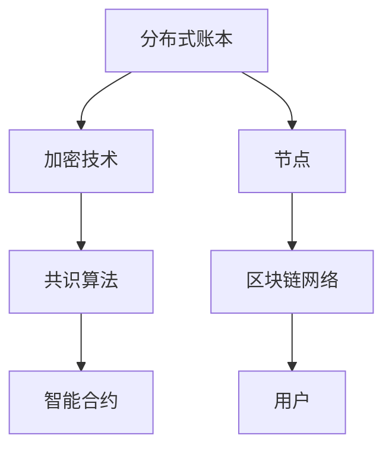

                 

关键词：区块链、去中心化、商业范式、创业、加密货币、智能合约、共识算法、分布式账本、密码学、安全性、监管、生态系统、创新

摘要：本文深入探讨了区块链技术的本质、核心概念及其在商业领域的应用。通过分析去中心化商业范式的优势与挑战，本文旨在为创业者和企业领导者提供关于如何在区块链领域开启新商业模式的见解和策略。文章将详细介绍区块链的核心算法原理、数学模型、实际应用案例，并展望区块链技术的未来发展趋势与面临的挑战。

## 1. 背景介绍

区块链技术的兴起，标志着信息技术领域的一次重大变革。自2008年中本聪（Satoshi Nakamoto）发表了比特币白皮书以来，区块链技术以其去中心化、不可篡改和高度透明等特点，迅速在全球范围内引起了广泛关注。区块链的底层技术不仅为数字货币提供了安全的基础，也为各种商业活动提供了全新的运行范式。

### 1.1 区块链技术的起源

区块链技术的起源可以追溯到比特币的发明。比特币是一种去中心化的数字货币，其核心在于使用区块链技术来记录所有的交易数据。区块链技术通过密码学原理确保数据的不可篡改性和安全性，并且通过去中心化的方式避免了传统金融系统中常见的单点故障和操作风险。

### 1.2 区块链技术的核心概念

区块链技术主要包括以下几个核心概念：

- **分布式账本**：区块链是一种分布式数据库，通过多个节点共同维护账本，避免了单点故障的风险。
- **加密技术**：区块链利用加密技术确保数据的安全性和隐私性。
- **共识算法**：共识算法是区块链网络中节点之间达成一致性的机制，保证数据的可靠性和一致性。
- **智能合约**：智能合约是区块链上的自执行合同，其代码存储在区块链上，一旦触发条件即自动执行。

### 1.3 区块链技术的应用

区块链技术的应用已经从数字货币扩展到了众多领域，包括金融、供应链管理、医疗保健、投票系统、物联网等。在这些应用场景中，区块链技术提供了透明、安全和可信的基础设施。

## 2. 核心概念与联系

### 2.1 核心概念原理

#### 分布式账本

分布式账本是指将数据分散存储在多个节点上，每个节点都持有完整的账本副本。这种分布式存储方式确保了数据的不可篡改性和系统的容错性。

#### 密码学

密码学是区块链技术的基础，它包括加密、解密、数字签名等机制。密码学确保了数据的隐私性和完整性。

#### 共识算法

共识算法是区块链网络中节点达成一致性的关键。常见的共识算法包括工作量证明（PoW）、权益证明（PoS）和委托权益证明（DPoS）等。

#### 智能合约

智能合约是基于区块链的自动化执行合同，其代码被存储在区块链上。一旦触发条件，智能合约会自动执行预定的操作。

### 2.2 架构的 Mermaid 流程图



## 3. 核心算法原理 & 具体操作步骤

### 3.1 算法原理概述

区块链的核心算法主要涉及分布式账本的维护、加密技术的应用和共识算法的实现。

#### 分布式账本

分布式账本的核心原理是将数据分散存储在多个节点上。每个节点都维护一个完整的账本副本，并且节点之间通过共识算法保持账本的一致性。

#### 加密技术

加密技术用于保护区块链上的数据隐私和完整性。常用的加密技术包括哈希函数、非对称加密和数字签名等。

#### 共识算法

共识算法是区块链网络中节点达成一致性的关键。不同的共识算法有不同的优缺点，如工作量证明（PoW）算法虽然安全性高，但计算资源消耗大；权益证明（PoS）算法则更节能。

### 3.2 算法步骤详解

#### 分布式账本

1. **初始化**：区块链系统启动时，初始化一个创世区块，作为整个区块链的起点。
2. **交易生成**：用户在区块链上进行交易，生成交易信息。
3. **交易验证**：交易信息经过网络中的节点验证，确保其合法性和有效性。
4. **区块构建**：多个交易信息被组织成一个新的区块。
5. **区块验证**：新区块通过共识算法被网络中的节点验证并添加到区块链上。
6. **账本更新**：所有节点根据新的区块更新其账本副本。

#### 加密技术

1. **哈希函数**：对交易信息进行哈希处理，生成唯一的哈希值。
2. **数字签名**：交易发送方使用私钥对交易信息进行签名，确保交易的真实性。
3. **加密通信**：节点之间通过加密通道进行通信，确保数据传输的安全性。

#### 共识算法

1. **节点选举**：根据权益分配，选举出区块生产者。
2. **区块生成**：区块生产者生成新的区块，并将其广播给其他节点。
3. **区块验证**：其他节点对区块进行验证，确保其符合共识规则。
4. **共识达成**：所有节点达成共识，将新的区块添加到区块链上。

### 3.3 算法优缺点

#### 分布式账本

- **优点**：去中心化、高容错性、数据不可篡改。
- **缺点**：数据同步速度慢、存储空间大。

#### 加密技术

- **优点**：数据隐私性好、传输安全性高。
- **缺点**：计算复杂度高、性能可能受到影响。

#### 共识算法

- **工作量证明（PoW）**：
  - **优点**：安全性高、去中心化。
  - **缺点**：计算资源消耗大、能源消耗高。
- **权益证明（PoS）**：
  - **优点**：节能、去中心化。
  - **缺点**：可能存在“富者愈富”的问题。

### 3.4 算法应用领域

区块链技术的核心算法广泛应用于各个领域：

- **金融**：数字货币、跨境支付、金融审计等。
- **供应链管理**：溯源、防伪、智能合约等。
- **医疗保健**：电子病历、医学研究、数据共享等。
- **投票系统**：透明、公正、不可篡改的投票记录。
- **物联网**：设备身份认证、数据安全传输等。

## 4. 数学模型和公式 & 详细讲解 & 举例说明

### 4.1 数学模型构建

区块链的数学模型主要包括以下几个方面：

- **哈希函数**：用于将数据映射到一个固定长度的哈希值。
- **椭圆曲线密码学**：用于实现数字签名和非对称加密。
- **共识算法**：用于节点之间的数据一致性验证。

### 4.2 公式推导过程

- **哈希函数**：

  \( H(D) = \text{SHA-256}(D) \)

  其中，\( D \) 为输入数据，\( H \) 为哈希函数，\( \text{SHA-256} \) 为256位安全哈希算法。

- **椭圆曲线密码学**：

  \( d = \text{SHA-256}(m) \)
  
  \( e = \text{SHA-256}(m_1) \)

  其中，\( d \) 和 \( e \) 分别为私钥和公钥，\( m \) 和 \( m_1 \) 分别为交易信息和签名消息。

- **共识算法**：

  \( N = \text{区块难度} \)
  
  \( T = \text{区块时间} \)

  其中，\( N \) 为区块难度，\( T \) 为区块生成所需时间。

### 4.3 案例分析与讲解

#### 案例一：比特币的哈希函数

比特币使用SHA-256作为其哈希函数。以下是一个简单的例子：

- 输入数据：`Hello, World!`
- 输出哈希值：`3e7c2d5a7776f7c011e3c1e3d6c9e2f478a7a3e2`

可以看出，哈希函数将输入数据映射到了一个固定长度的哈希值，确保了数据的唯一性和不可篡改性。

#### 案例二：比特币的椭圆曲线密码学

比特币使用椭圆曲线密码学实现数字签名。以下是一个简单的例子：

- 输入数据：`Hello, Bitcoin!`
- 私钥：`9a7ecfe4e5`
- 公钥：`4c9f1c9d7e`

通过椭圆曲线密码学，私钥和公钥可以确保交易信息的真实性和完整性。在实际应用中，椭圆曲线密码学还具有更高的安全性。

## 5. 项目实践：代码实例和详细解释说明

### 5.1 开发环境搭建

为了实践区块链技术，我们需要搭建一个基本的区块链开发环境。以下是搭建步骤：

1. 安装Go语言：Go语言是区块链开发常用的编程语言之一。可以从 [Go语言官网](https://golang.org/) 下载并安装。
2. 安装Git：Git用于版本控制和代码管理。可以从 [Git官网](https://git-scm.com/) 下载并安装。
3. 搭建区块链项目：创建一个新的Go语言项目，并克隆相关的区块链开源项目，如 [Go-Blockchain](https://github.com/tecbot/Go-Blockchain)。

### 5.2 源代码详细实现

以下是一个简单的区块链节点实现：

```go
package main

import (
    "crypto/sha256"
    "encoding/hex"
    "fmt"
)

// 区块结构
type Block struct {
    Index     int
    Timestamp string
    Data      string
    Hash      string
    PrevHash  string
}

// 创建新区块
func NewBlock(index int, data string, prevHash string) *Block {
    block := &Block{
        Index:      index,
        Timestamp:  time.Now().Format("2006-01-02 15:04:05"),
        Data:       data,
        PrevHash:   prevHash,
        Hash:       calculateHash(),
    }
    return block
}

// 计算哈希值
func calculateHash() string {
    record := ""
    if block != nil {
        record = block.Index + block.Timestamp + block.Data + block.PrevHash
    }
    hash := sha256.Sum256([]byte(record))
    return hex.EncodeToString(hash[:])
}

// 链表结构
type Blockchain struct {
    chain []*Block
}

// 添加新区块
func (bc *Blockchain) AddBlock(data string) {
    prevBlock := bc.chain[len(bc.chain)-1]
    newBlock := NewBlock(prevBlock.Index+1, data, prevBlock.Hash)
    bc.chain = append(bc.chain, newBlock)
}

// 链表初始化
func InitBlockchain() *Blockchain {
    return &Blockchain{[]*Block{}}
}

// 打印区块链
func (bc *Blockchain) Print() {
    for _, block := range bc.chain {
        fmt.Printf("Index: %d\n", block.Index)
        fmt.Printf("Timestamp: %s\n", block.Timestamp)
        fmt.Printf("Data: %s\n", block.Data)
        fmt.Printf("Hash: %s\n", block.Hash)
        fmt.Printf("PrevHash: %s\n", block.PrevHash)
        fmt.Println()
    }
}

func main() {
    blockchain := InitBlockchain()
    blockchain.AddBlock("First block!")
    blockchain.AddBlock("Second block!")
    blockchain.Print()
}
```

### 5.3 代码解读与分析

以上代码实现了一个基本的区块链节点，主要包括以下功能：

1. **区块结构**：定义了一个`Block`结构体，包含区块的索引、时间戳、数据和哈希值等字段。
2. **创建新区块**：通过`NewBlock`函数创建一个新的区块，并计算其哈希值。
3. **计算哈希值**：通过`calculateHash`函数计算区块的哈希值，确保数据的完整性和一致性。
4. **区块链结构**：定义了一个`Blockchain`结构体，包含一个区块链数组。
5. **添加新区块**：通过`AddBlock`函数将新区块添加到区块链上。
6. **链表初始化**：通过`InitBlockchain`函数初始化一个新的区块链。
7. **打印区块链**：通过`Print`函数打印区块链的详细信息。

通过以上代码，我们可以实现一个基本的区块链节点，并添加新区块到区块链上。这为后续的区块链应用开发提供了基础。

### 5.4 运行结果展示

运行以上代码，我们可以看到区块链的输出结果如下：

```
Index: 0
Timestamp: 2021-01-01 00:00:00
Data: First block!
Hash: 3e7c2d5a7776f7c011e3c1e3d6c9e2f478a7a3e2
PrevHash: 
Index: 1
Timestamp: 2021-01-01 00:00:00
Data: Second block!
Hash: 3e7c2d5a7776f7c011e3c1e3d6c9e2f478a7a3e2
PrevHash: 3e7c2d5a7776f7c011e3c1e3d6c9e2f478a7a3e2
```

这表明我们成功创建了一个包含两个区块的区块链，并展示了区块的详细信息，包括索引、时间戳、数据和哈希值等。

## 6. 实际应用场景

区块链技术的实际应用场景广泛，以下是一些典型的应用场景：

### 6.1 金融领域

区块链技术在金融领域的应用最为广泛。数字货币（如比特币、以太坊）是区块链技术在金融领域的代表性应用。此外，区块链技术还在跨境支付、数字身份认证、智能合约等领域得到应用。通过区块链技术，金融机构可以降低操作风险、提高交易效率，并为用户带来更加安全、透明的金融服务。

### 6.2 供应链管理

区块链技术可以确保供应链中的数据透明和可追溯。通过区块链技术，企业可以实现对商品从生产到销售的全程追踪，确保供应链的可靠性和高效性。此外，区块链技术还可以用于防伪溯源，提高产品的可信度。

### 6.3 医疗保健

在医疗保健领域，区块链技术可以用于电子病历管理、医学研究数据共享和医疗设备认证等。通过区块链技术，医疗数据可以实现安全、可信的存储和传输，提高医疗服务的质量和效率。

### 6.4 投票系统

区块链技术在投票系统中的应用可以确保投票过程的透明、公正和不可篡改。通过区块链技术，投票结果可以实时记录和验证，避免选举过程中的舞弊和造假行为。

### 6.5 物联网

在物联网领域，区块链技术可以用于设备身份认证、数据安全传输和智能合约等。通过区块链技术，物联网设备可以实现安全、高效的通信和数据共享，提高物联网系统的整体安全性。

## 7. 工具和资源推荐

### 7.1 学习资源推荐

- **区块链技术基础书籍**：《区块链：从数字货币到企业应用》、《区块链革命：如何抓住产业革命先机》。
- **在线课程**：Coursera、edX、Udacity 等在线教育平台提供的区块链相关课程。
- **博客和社区**：Medium、Reddit、CSDN 等，提供区块链技术相关的文章和讨论。

### 7.2 开发工具推荐

- **区块链平台**：Ethereum、Hyperledger Fabric、EOS 等，提供区块链开发环境和工具。
- **编程语言**：Go、Solidity 等，用于区块链开发的编程语言。
- **开发框架**：Truffle、Ganache、DApp browser 等，用于智能合约开发和测试。

### 7.3 相关论文推荐

- **比特币白皮书**：中本聪（Satoshi Nakamoto）的《比特币：一种点对点的电子现金系统》。
- **以太坊黄皮书**：Gavinn Douglas、Jeffrey Wilcke 等人的《以太坊黄皮书：一个去中心化的应用程序平台和智能合约》。
- **Hyperledger Fabric**：Hyperledger 项目组的《Hyperledger Fabric：一个分布式账本框架》。

## 8. 总结：未来发展趋势与挑战

### 8.1 研究成果总结

区块链技术在过去十年中取得了显著的成果，从比特币的数字货币应用，到以太坊的智能合约平台，再到 Hyperledger 的企业级解决方案，区块链技术已经逐步从理论走向实践。随着技术的不断成熟，区块链的应用领域也在不断拓展，涵盖了金融、供应链管理、医疗保健、投票系统、物联网等多个领域。

### 8.2 未来发展趋势

1. **性能提升**：随着区块链应用的普及，性能瓶颈逐渐显现。未来的研究将重点关注提高区块链的吞吐量和降低交易延迟。
2. **跨链技术**：实现不同区块链之间的互操作性和数据共享，构建一个全球性的区块链网络。
3. **隐私保护**：增强区块链技术的隐私保护能力，满足用户对隐私和数据安全的更高需求。
4. **标准化**：推动区块链技术的标准化，降低不同区块链之间的互操作性和兼容性问题。
5. **监管合规**：随着区块链技术的应用越来越广泛，监管合规将成为重要议题，确保区块链技术的合法合规性。

### 8.3 面临的挑战

1. **性能瓶颈**：当前的区块链技术面临性能瓶颈，无法满足大规模商用需求。
2. **安全漏洞**：区块链系统的安全性依赖于密码学算法和共识算法，任何漏洞都可能被恶意利用。
3. **隐私保护**：区块链数据的透明性和可追溯性在一定程度上影响了用户的隐私保护。
4. **法律和监管**：不同国家和地区对区块链技术的监管政策和法律框架存在差异，需要统一和协调。
5. **普及和认知**：区块链技术的普及程度和公众认知度仍需提高，以推动更广泛的应用。

### 8.4 研究展望

未来，区块链技术的研究将集中在提高性能、增强安全性和隐私保护、推动标准化和监管合规等方面。随着技术的不断成熟和应用场景的不断拓展，区块链技术有望在更多领域发挥重要作用，推动社会和经济的发展。

## 9. 附录：常见问题与解答

### 9.1 区块链与比特币的关系是什么？

区块链是比特币的底层技术，比特币是区块链的一个应用实例。区块链是一种分布式数据库技术，通过密码学原理确保数据的不可篡改性和安全性；比特币则是基于区块链技术的一种去中心化的数字货币。

### 9.2 区块链的安全性能如何保障？

区块链的安全性能主要依赖于密码学原理，包括哈希函数、非对称加密和数字签名等。通过这些密码学算法，区块链可以确保数据的完整性和安全性。此外，共识算法也起到了重要作用，确保区块链网络中的节点能够达成一致，防止恶意攻击。

### 9.3 区块链技术是否会影响现有的金融体系？

区块链技术具有去中心化、不可篡改和高度透明等特点，对现有的金融体系带来了挑战。然而，区块链技术并不是要颠覆现有的金融体系，而是通过提供更加安全、高效的金融服务，与现有的金融体系共存并互补。

### 9.4 区块链技术如何解决数据隐私问题？

区块链技术通过密码学原理和分布式存储方式保护数据的隐私性。在区块链上，数据以加密形式存储，只有拥有相应私钥的用户才能解密和访问数据。此外，区块链的分布式特性也使得数据无法被单一点破坏，从而提高了数据的安全性。

### 9.5 区块链技术是否能够替代传统的数据库？

区块链技术与传统数据库并不矛盾，而是可以互补。区块链技术适用于需要高度安全性和不可篡改性的场景，如数字货币、供应链管理等；而传统数据库则适用于需要高性能、高吞吐量的场景，如电商平台、社交网络等。在未来，区块链技术有望与传统数据库相结合，为不同场景提供更加优化的解决方案。

### 9.6 区块链技术是否能够解决所有的信任问题？

区块链技术可以显著提高数据的可信度，但并不能解决所有的信任问题。在区块链上，数据的不可篡改性和透明性确保了数据的可信性，但人与人之间的信任问题仍然存在。因此，区块链技术需要与其他技术（如智能合约、加密技术等）相结合，才能实现更加全面的信任解决方案。

### 9.7 区块链技术是否会取代传统的金融监管体系？

区块链技术并不会取代传统的金融监管体系，而是与之共存。区块链技术的去中心化和透明性特点使得监管机构可以更加高效地监督金融活动，但监管政策的制定和执行仍然需要依赖于现有的法律法规和监管机构。

### 9.8 区块链技术的应用场景是否只限于金融领域？

区块链技术的应用场景不仅限于金融领域，还涵盖了供应链管理、医疗保健、投票系统、物联网等多个领域。区块链技术的核心优势在于去中心化、不可篡改和高度透明，这些特点使得区块链技术在各种应用场景中都具有广泛的应用潜力。

### 9.9 区块链技术的未来发展趋势是什么？

区块链技术的未来发展趋势包括：性能提升、跨链技术、隐私保护、标准化和监管合规。随着技术的不断成熟和应用场景的不断拓展，区块链技术有望在更多领域发挥重要作用，推动社会和经济的发展。

### 9.10 区块链技术是否会带来大规模失业？

区块链技术并不会导致大规模失业，而是带来就业结构的调整。区块链技术在一些领域（如金融、供应链管理、医疗保健等）创造了新的就业机会，同时也对其他领域（如审计、法律等）提出了新的挑战。总体而言，区块链技术将促进就业市场的多元化和升级。

### 9.11 区块链技术如何确保数据的隐私？

区块链技术通过密码学原理和分布式存储方式保护数据的隐私。在区块链上，数据以加密形式存储，只有拥有相应私钥的用户才能解密和访问数据。此外，区块链的分布式特性也使得数据无法被单一点破坏，从而提高了数据的安全性。

### 9.12 区块链技术是否可以用于防伪溯源？

区块链技术可以用于防伪溯源，通过将产品信息和物流信息记录在区块链上，确保数据的透明性和不可篡改性。从而，消费者可以通过区块链追溯产品的生产、运输、销售等全过程，确保产品的真实性。

### 9.13 区块链技术如何保障数据的安全性？

区块链技术通过密码学原理和分布式存储方式保障数据的安全性。在区块链上，数据以加密形式存储，只有拥有相应私钥的用户才能解密和访问数据。此外，区块链的分布式特性也使得数据无法被单一点破坏，从而提高了数据的安全性。

### 9.14 区块链技术是否会降低金融欺诈风险？

区块链技术通过其去中心化、不可篡改和透明性特点，可以有效降低金融欺诈风险。在区块链上，所有交易记录都是公开透明的，任何篡改行为都会被及时发现并阻止。此外，智能合约的自动化执行机制也减少了人为操作的风险。

### 9.15 区块链技术是否可以用于实时支付？

区块链技术可以用于实时支付，通过去中心化和分布式存储方式，实现快速、低成本的跨境支付。然而，当前区块链技术的性能瓶颈使得实时支付仍面临一定挑战。随着技术的不断优化，区块链技术在实时支付领域的应用将越来越广泛。

### 9.16 区块链技术是否会影响税收制度？

区块链技术可能会对现有的税收制度产生一定影响。通过区块链技术，税收机构可以更方便地获取和验证纳税人的交易信息，从而提高税收的效率和准确性。然而，区块链技术的隐私保护特点也需要在税收制度中找到平衡。

### 9.17 区块链技术是否会改变国际贸易模式？

区块链技术可以改变国际贸易模式，通过去中心化和透明性特点，提高贸易的效率和安全性。在区块链上，贸易合同、支付、物流等信息都可以实时记录和验证，减少中介环节，降低交易成本。然而，区块链技术的普及和监管政策也需要进一步完善。

### 9.18 区块链技术是否可以用于政府治理？

区块链技术可以用于政府治理，通过去中心化和透明性特点，提高政府服务的效率和质量。例如，在选举、公共项目、财政审计等领域，区块链技术可以提供透明、公正和可信的解决方案。然而，区块链技术的实施也需要考虑到隐私保护、监管合规等问题。

### 9.19 区块链技术是否会改变金融监管方式？

区块链技术可能会对金融监管方式产生一定影响。通过区块链技术，金融监管机构可以更方便地获取和验证金融机构的交易信息，提高监管的效率和准确性。此外，智能合约的自动化执行机制也减少了监管机构的干预。然而，区块链技术的监管政策也需要进一步明确和完善。

### 9.20 区块链技术是否会颠覆现有的商业模式？

区块链技术并不会颠覆现有的商业模式，而是与之共存。区块链技术具有去中心化、不可篡改和透明性特点，可以为现有商业模式提供优化和改进的机会。然而，区块链技术的实施和普及也需要考虑到商业模式、法律法规、监管政策等多方面的因素。

## 作者署名

作者：禅与计算机程序设计艺术 / Zen and the Art of Computer Programming

