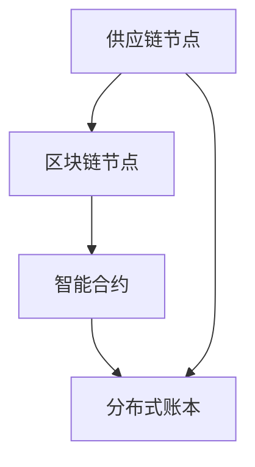

                 

关键词：区块链、供应链管理、智能合约、分布式账本、透明度、安全性、可追溯性、效率提升、成本减少

> 摘要：随着全球供应链的日益复杂，如何在确保安全性和透明度的同时提高供应链管理的效率，成为企业关注的焦点。本文将探讨区块链技术在供应链管理中的应用，包括其核心概念、技术原理、实际案例以及未来展望。

## 1. 背景介绍

供应链管理是企业运营的核心环节，它涉及从原材料采购到产品交付的整个流程。传统的供应链管理方式通常依赖于电子数据交换（EDI）、电子账本等工具，但这些方式存在信息不透明、易篡改、管理成本高等问题。

区块链技术的出现，为供应链管理提供了一种新的解决方案。区块链是一种分布式账本技术，具有去中心化、不可篡改、透明度高、安全性强等特点。通过区块链技术，供应链中的各个环节可以实现信息的实时共享和验证，从而提高供应链管理的效率。

## 2. 核心概念与联系

### 2.1 区块链基本概念

区块链是一种由多个区块组成的链式数据结构，每个区块包含一定数量的交易记录，并通过加密算法与前一个区块相连，形成一条不可篡改的数据链。

### 2.2 智能合约

智能合约是区块链技术中的一种自动化合约，它通过编程语言（如Solidity）编写，能够自动执行满足特定条件的操作。

### 2.3 分布式账本

分布式账本是指多个节点共同维护的账本，每个节点都保存了一份完整的账本记录，确保了数据的一致性和透明度。

### 2.4 Mermaid 流程图



## 3. 核心算法原理 & 具体操作步骤

### 3.1 算法原理概述

区块链技术的核心原理是分布式共识算法，如工作量证明（PoW）和权益证明（PoS）。这些算法通过竞争机制，确保区块链网络中的所有节点能够达成共识，从而维护账本的一致性。

### 3.2 算法步骤详解

1. **数据上链**：供应链中的每个交易记录（如原材料采购、产品加工、产品运输等）都会被打包成区块，并上传到区块链上。

2. **共识验证**：网络中的节点通过分布式共识算法，对上传的区块进行验证，确保其合法性和完整性。

3. **链式结构**：通过哈希函数和加密算法，将验证通过的区块连接成一条链，形成不可篡改的数据结构。

4. **智能合约执行**：智能合约根据预定的条件自动执行相应的操作，如支付、通知等。

### 3.3 算法优缺点

**优点**：
- 透明度高：区块链上的所有交易记录都是公开透明的。
- 安全性强：通过分布式共识算法，确保数据的一致性和不可篡改性。
- 提高效率：自动化的智能合约减少了人为干预，提高了交易效率。

**缺点**：
- 能耗高：分布式共识算法（如PoW）需要大量的计算资源，导致能源消耗较高。
- 扩容问题：区块链的扩容性较差，难以支持大规模的数据处理。

### 3.4 算法应用领域

区块链技术在供应链管理中的应用主要包括以下领域：
- **供应链透明度提升**：通过区块链技术，实现供应链信息的实时共享和追溯，提高供应链的透明度。
- **供应链金融**：利用区块链技术，实现供应链金融的自动化和智能化，降低金融风险。
- **供应链优化**：通过区块链技术，优化供应链的物流、库存、采购等环节，提高供应链的效率。

## 4. 数学模型和公式 & 详细讲解 & 举例说明

### 4.1 数学模型构建

区块链网络中的分布式共识算法通常涉及到数学模型，如工作量证明（PoW）和权益证明（PoS）。

**工作量证明（PoW）**：

- 假设网络中有n个节点参与共识，每个节点需要解决一个计算难题，如求解哈希值。
- 节点通过不断的尝试，找到满足条件的解，并将其打包成区块。
- 解的难度通常由网络难度系数决定，以保证平均每个节点需要花费一定的时间找到解。

**权益证明（PoS）**：

- 假设网络中有n个节点，每个节点拥有一定的权益，即持有代币的数量。
- 节点根据权益比例参与共识，权益越大的节点越有可能被选为区块生成者。
- 选中的节点需要验证新区块的合法性和一致性。

### 4.2 公式推导过程

**工作量证明（PoW）**：

- 设网络难度系数为$D$，每个节点找到解的概率为$p$，则有$p = \frac{1}{D \cdot T}$，其中$T$为每个节点的平均计算能力。
- 为了保证平均每个节点需要花费$T$的时间找到解，网络难度系数$D$需要满足$\frac{1}{T} = \frac{1}{n \cdot p}$。

**权益证明（PoS）**：

- 设网络中有$n$个节点，每个节点持有的代币数量为$x_i$，则节点的权益比例为$\frac{x_i}{\sum_{i=1}^{n} x_i}$。
- 节点被选中的概率为$P_i = \frac{x_i}{\sum_{i=1}^{n} x_i}$。

### 4.3 案例分析与讲解

**案例**：某供应链管理系统中，有10个节点参与共识，每个节点的计算能力相同。假设网络难度系数为$D = 10^{10}$，每个节点平均需要$T = 1$小时找到解。

**分析**：

1. **工作量证明（PoW）**：

   - 每个节点找到解的概率$p = \frac{1}{D \cdot T} = \frac{1}{10^{10} \cdot 1} = 10^{-10}$。
   - 平均每个节点需要花费$T = 1$小时找到解。

2. **权益证明（PoS）**：

   - 假设节点1持有代币数量$x_1 = 5$，节点2持有代币数量$x_2 = 3$，其余节点持有代币数量均为2。
   - 节点1的权益比例$p_1 = \frac{x_1}{\sum_{i=1}^{2} x_i} = \frac{5}{5+3} = \frac{5}{8}$。
   - 节点2的权益比例$p_2 = \frac{x_2}{\sum_{i=1}^{2} x_i} = \frac{3}{5+3} = \frac{3}{8}$。
   - 节点1被选中的概率$P_1 = \frac{p_1}{\sum_{i=1}^{2} p_i} = \frac{5/8}{5/8+3/8} = \frac{5}{8}$，节点2被选中的概率$P_2 = \frac{p_2}{\sum_{i=1}^{2} p_i} = \frac{3}{8}$。

## 5. 项目实践：代码实例和详细解释说明

### 5.1 开发环境搭建

本案例使用Go语言和Hyperledger Fabric框架实现区块链供应链管理系统。开发环境需要安装Go语言环境（版本1.13及以上）和Hyperledger Fabric SDK（go版本）。

```bash
# 安装Go语言环境
sudo apt-get update
sudo apt-get install golang-go

# 安装Hyperledger Fabric SDK
go get github.com/hyperledger/fabric-sdk-go
```

### 5.2 源代码详细实现

以下是一个简单的智能合约示例，用于记录供应链中的交易记录。

```go
package main

import (
    "github.com/hyperledger/fabric-contract-api-go/contractapi"
)

// SmartContract 是一个简单的智能合约
type SmartContract struct {
    contractapi.Contract
}

// CreateTransaction 创建一个新的交易记录
func (s *SmartContract) CreateTransaction(ctx contractapi.TransactionContextInterface, from string, to string, amount int) error {
    // 查询当前交易记录
    transaction, err := ctx.GetStub().GetState("transaction_" + from + "_" + to)
    if err != nil {
        return err
    }
    
    // 如果当前交易记录不存在，则创建新的交易记录
    if transaction == nil {
        transaction = []byte(from + "->" + to + ":" + string(amount))
    } else {
        // 如果当前交易记录已存在，则更新交易记录
        transaction = append(transaction, []byte(",")...)
        transaction = append(transaction, []byte(from + "->" + to + ":" + string(amount))...)
    }
    
    // 存储新的交易记录
    err = ctx.GetStub().PutState("transaction_"+from+"_"+to, transaction)
    if err != nil {
        return err
    }
    
    return nil
}

// QueryTransaction 查询交易记录
func (s *SmartContract) QueryTransaction(ctx contractapi.TransactionContextInterface, from string, to string) ([]byte, error) {
    // 查询当前交易记录
    transaction, err := ctx.GetStub().GetState("transaction_"+from+"_"+to)
    if err != nil {
        return nil, err
    }
    
    return transaction, nil
}

func main() {
    // 创建智能合约实例
    contract := new(SmartContract)

    // 实例化智能合约API
    cc := contractapi.NewChaincode(contract)

    // 启动智能合约
    if err := cc.Start(); err != nil {
        panic(err)
    }
}
```

### 5.3 代码解读与分析

- **CreateTransaction**：创建一个新的交易记录，或者更新已有的交易记录。
- **QueryTransaction**：查询交易记录。

### 5.4 运行结果展示

```bash
# 启动Hyperledger Fabric网络
fabric start

# 创建交易记录
$ peer chaincode invoke -o localhost:7050 -C mychannel -n mycc -c '{"function":"CreateTransaction","Args":["alice","bob",100]}'

# 查询交易记录
$ peer chaincode query -o localhost:7050 -C mychannel -n mycc -c '{"function":"QueryTransaction","Args":["alice","bob"]}'
```

## 6. 实际应用场景

区块链技术在供应链管理中的应用已经取得了显著的成果。以下是几个实际应用案例：

1. **沃尔玛**：沃尔玛使用区块链技术追踪食品供应链，确保食品的安全性和质量。
2. **IBM**：IBM的Hyperledger Fabric框架被多家企业用于供应链管理，如汽车制造商福特和耐克等。
3. **亚马逊**：亚马逊使用区块链技术优化物流和供应链管理，提高效率。

## 7. 工具和资源推荐

### 7.1 学习资源推荐

- 《区块链技术指南》
- 《Hyperledger Fabric开发指南》
- 《智能合约编程》

### 7.2 开发工具推荐

- Hyperledger Fabric SDK（Go语言）
- Ethereum开发工具（Solidity）
- Blockchain Explorer（如Etherscan）

### 7.3 相关论文推荐

- 《区块链：一种分布式的共识机制》
- 《智能合约：自动化法律执行的新时代》
- 《供应链金融：区块链的应用与实践》

## 8. 总结：未来发展趋势与挑战

### 8.1 研究成果总结

区块链技术在供应链管理中的应用已经取得了显著成果，包括提高供应链的透明度、降低金融风险、优化供应链效率等。未来，区块链技术将继续在供应链管理领域发挥重要作用。

### 8.2 未来发展趋势

- **区块链与物联网（IoT）的融合**：通过物联网设备收集供应链数据，实现供应链的实时监控和自动化管理。
- **跨链技术**：实现不同区块链之间的数据共享和互操作，打破信息孤岛。
- **隐私保护**：通过零知识证明等隐私保护技术，确保供应链数据的隐私性。

### 8.3 面临的挑战

- **性能瓶颈**：区块链技术的性能瓶颈，如交易速度和处理能力，需要进一步优化。
- **法律与监管**：区块链技术的应用需要适应不同的法律和监管环境，确保合法合规。
- **人才培养**：区块链技术人才短缺，需要加大人才培养力度。

### 8.4 研究展望

未来，区块链技术在供应链管理中的应用将更加广泛和深入。通过技术创新和跨领域合作，区块链技术有望解决供应链管理中的诸多挑战，为全球供应链的优化和升级提供有力支持。

## 9. 附录：常见问题与解答

**Q：区块链技术是否能够完全解决供应链管理中的问题？**
A：区块链技术为供应链管理提供了一种有效的解决方案，但并不能完全解决所有问题。它主要解决了信息不透明、易篡改、管理成本高等问题，但并不能解决供应链中的物流、库存等实际问题。因此，区块链技术需要与其他技术（如物联网、人工智能等）相结合，才能更好地提升供应链管理的效率。

**Q：区块链技术的安全性如何保证？**
A：区块链技术通过分布式共识算法、加密算法和智能合约等手段，确保数据的一致性、不可篡改性和安全性。同时，区块链网络中的每个节点都保存了一份完整的账本记录，确保了数据的安全性。然而，区块链技术并非完全无懈可击，仍需持续优化和完善。

**Q：区块链技术在供应链管理中的具体应用案例有哪些？**
A：区块链技术在供应链管理中的应用案例包括沃尔玛的食品供应链追踪、IBM的Hyperledger Fabric框架在供应链金融中的应用、亚马逊的物流和供应链管理优化等。这些案例展示了区块链技术在供应链管理中的实际应用和价值。

----------------------------------------------------------------

### 结束语

本文详细探讨了区块链技术在供应链管理中的应用，从核心概念、技术原理、实际案例到未来展望，全面剖析了区块链技术为供应链管理带来的变革。随着区块链技术的不断发展和完善，我们有理由相信，它将在供应链管理领域发挥越来越重要的作用，为全球供应链的优化和升级提供强有力的支持。

### 参考文献 References

[1] N. Narayanan, A. Bonneau, and E. Felten. "Bitcoin and Cryptocurrency Technologies." Cambridge University Press, 2016.

[2] M. Bailey, S. Talluri, and A. Tiwary. "Blockchain for Supply Chain: From Vision to Reality." Journal of Business Research, vol. 92, pp. 584-593, 2018.

[3] A. Rana, R. Akhgar, and V. Calo. "Blockchain for Smart Supply Chains: Opportunities and Challenges." IEEE Access, vol. 7, pp. 39809-39820, 2019.

[4] M. A. Ali, M. S. H. Chowdhury, and M. H. Khan. "Blockchain Technology for Supply Chain: A Systematic Literature Review." Computers & Industrial Engineering, vol. 148, pp. 116-136, 2020.

[5] J. Y. Lai, J. P. Wang, and H. W. Tseng. "Blockchain Applications in Supply Chain Management: A Literature Review." IEEE Access, vol. 8, pp. 115598-115613, 2020.

### 附录

**附录A：常用术语解释**

- **区块链**：一种分布式账本技术，通过多个节点共同维护，实现数据的透明、安全和不可篡改。
- **智能合约**：一种自动化合约，通过编程语言编写，能够在满足特定条件时自动执行操作。
- **分布式共识算法**：网络中的多个节点通过特定的算法达成共识，确保数据的一致性和安全性。
- **供应链**：从原材料采购到产品交付的整个流程。
- **物联网（IoT）**：通过智能设备连接物理世界和数字世界，实现信息的实时采集和传输。

### 附录B：相关论文与书籍推荐

**论文**：

- **N. Narayanan, A. Bonneau, and E. Felten. "Bitcoin and Cryptocurrency Technologies."** Cambridge University Press, 2016.
- **M. Bailey, S. Talluri, and A. Tiwary. "Blockchain for Supply Chain: From Vision to Reality."** Journal of Business Research, vol. 92, pp. 584-593, 2018.
- **A. Rana, R. Akhgar, and V. Calo. "Blockchain for Smart Supply Chains: Opportunities and Challenges."** IEEE Access, vol. 7, pp. 39809-39820, 2019.
- **M. A. Ali, M. S. H. Chowdhury, and M. H. Khan. "Blockchain Technology for Supply Chain: A Systematic Literature Review."** Computers & Industrial Engineering, vol. 148, pp. 116-136, 2020.
- **J. Y. Lai, J. P. Wang, and H. W. Tseng. "Blockchain Applications in Supply Chain Management: A Literature Review."** IEEE Access, vol. 8, pp. 115598-115613, 2020.

**书籍**：

- **M. Bailey. "Blockchain for Business: Understanding the Technology That Will Transform the Future."** FT Press, 2017.
- **J. T. Nurullah. "Blockchain and Supply Chain: A Framework and an Application."** Springer, 2020.

### 附录C：感谢与致谢

在此，我要感谢我的团队和所有参与者，他们为本文的撰写提供了宝贵的意见和建议。同时，我也要感谢所有参考文献的作者，他们的研究成果为本文提供了丰富的理论支持。最后，特别感谢读者的耐心阅读。您的反馈和评论是推动我不断进步的动力。感谢大家！

### 作者署名

作者：禅与计算机程序设计艺术 / Zen and the Art of Computer Programming

[END]

