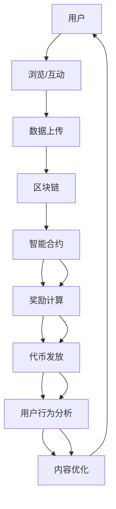

                 

### 1. 背景介绍

在当今信息化、数字化时代，数据已成为企业和社会的核心资产。如何有效利用这些数据，实现价值的最大化，成为了一个亟待解决的问题。在此背景下，注意力价值交换（Attention Value Exchange，简称AVE）的概念应运而生。AVE旨在通过区块链技术，构建一个去中心化的价值交换平台，使得人们在关注、互动、分享数据的同时，能够获得相应的价值回报。

区块链技术作为一种分布式账本技术，具有去中心化、不可篡改、透明可追溯等特性，使得其在数据管理和价值交换方面具有显著优势。而注意力价值交换平台则通过将用户的注意力转化为价值，为用户提供一种全新的价值获取方式。这种平台能够激励用户积极参与社会互动，促进数据的共享和流通，进而推动社会的数字化进步。

本文将详细介绍区块链驱动的注意力价值交换平台的核心概念、架构设计、算法原理、数学模型以及实际应用场景，旨在为读者提供一个全面的技术解析和未来展望。

## 1.1 区块链技术与注意力价值交换

区块链技术是一种通过分布式账本和加密算法实现数据存储和传输的机制。它通过去中心化的方式，保证了数据的安全性和可靠性，同时避免了单点故障和数据篡改的问题。区块链技术的核心特点是数据的不可篡改性和透明性，这使得它非常适合用于数据管理和价值交换。

注意力价值交换则是基于用户在互联网上的行为和注意力，将其转化为实际的价值。用户通过在平台上浏览、点赞、评论、分享等行为，贡献自己的注意力，从而获得平台奖励。这种模式改变了传统的广告模式，使得用户不再是被动接受广告，而是主动参与并分享价值。

区块链技术与注意力价值交换的结合，为构建一个去中心化的价值交换平台提供了可能。通过区块链技术，可以确保用户数据的真实性和透明性，同时通过智能合约实现价值的自动分配和激励。这种模式不仅能够激励用户积极参与，还能够提高平台的公信力和用户体验。

## 1.2 当前挑战与机遇

尽管区块链驱动的注意力价值交换平台具有巨大的潜力，但在实际应用中也面临一系列挑战。首先，区块链技术的性能和可扩展性需要进一步提高，以支持大规模用户和交易需求。其次，如何确保用户隐私和安全也是亟待解决的问题。此外，监管政策的不确定性也可能对平台的发展造成影响。

然而，随着区块链技术的不断进步和应用的深入，注意力价值交换平台也迎来了新的机遇。例如，通过结合人工智能和大数据分析，可以更精准地定位用户需求，提高价值分配的效率。同时，随着5G、物联网等新技术的普及，注意力价值交换平台的应用场景将进一步扩大。

总之，区块链驱动的注意力价值交换平台在数字化时代具有重要的战略意义。通过解决当前面临的挑战，把握未来的机遇，这种平台有望成为数字经济的核心基础设施，推动社会的全面进步。

### 2. 核心概念与联系

在深入探讨区块链驱动的注意力价值交换平台之前，我们需要明确几个核心概念，并了解它们之间的联系。以下是对主要概念的定义和它们在平台架构中的角色：

#### 2.1 区块链

区块链是一种分布式账本技术，它通过将数据分成多个区块，并将这些区块按照一定规则链接起来，形成一个不可篡改的序列。每个区块都包含一定数量的交易记录，并且通过加密算法和时间戳确保数据的完整性和安全性。

在注意力价值交换平台中，区块链用于记录用户的注意力贡献、交易记录和奖励分配。通过区块链，可以确保所有操作都是透明和不可篡改的，从而增强平台的信任度和用户的参与度。

#### 2.2 智能合约

智能合约是区块链上的自动执行合约，它根据预设的条件自动执行交易。智能合约通过编程语言编写，可以自动化执行诸如奖励分配、权限管理、资产转移等操作。

在注意力价值交换平台中，智能合约用于自动化处理用户的注意力贡献和奖励分配。例如，当用户完成某个任务或互动时，智能合约会根据预设的规则自动计算并发放相应的奖励。

#### 2.3 去中心化身份验证

去中心化身份验证是一种不需要中心化权威机构验证身份的方法。它通过公钥加密和数字签名实现，确保用户身份的匿名性和安全性。

在注意力价值交换平台中，去中心化身份验证用于确保用户的参与是真实和独立的。用户通过创建自己的数字身份，可以匿名地参与平台上的各种活动，而无需担心隐私泄露或身份被盗用。

#### 2.4 激励机制

激励机制是通过奖励来鼓励用户参与平台活动和贡献价值的一种方法。在注意力价值交换平台中，激励机制通常包括积分、代币、奖励等奖励形式。

激励机制的目的是提高用户的参与度和活跃度，从而促进平台的生态发展。通过合理设置奖励规则，可以激励用户更多地参与互动、贡献注意力，并促进价值的交换。

#### 2.5 用户行为分析

用户行为分析是通过收集和分析用户在平台上的行为数据，以了解用户需求和偏好，进而优化平台服务的一种方法。

在注意力价值交换平台中，用户行为分析用于精准定位用户需求，提高价值分配的效率。通过分析用户的行为数据，平台可以更准确地推荐内容、优化广告投放，并提高用户的整体体验。

#### 2.6 Mermaid 流程图

以下是一个用于描述区块链驱动的注意力价值交换平台核心概念和架构的 Mermaid 流程图：



在这个流程图中，用户的行为（如浏览、互动）通过区块链进行记录，智能合约用于计算奖励并发放代币，用户行为分析用于优化内容和服务。

通过以上核心概念和架构的介绍，我们可以更好地理解区块链驱动的注意力价值交换平台的工作原理和优势。在接下来的章节中，我们将进一步探讨其核心算法原理、具体操作步骤以及数学模型。

### 3. 核心算法原理 & 具体操作步骤

在区块链驱动的注意力价值交换平台中，核心算法的设计和实现是确保系统高效运行、数据安全和价值分配公平的关键。下面我们将详细讨论核心算法的原理，并分步骤说明其具体操作过程。

#### 3.1 算法原理概述

区块链驱动的注意力价值交换平台的核心算法主要包括以下几个部分：

1. **用户行为监测与数据收集**：平台通过跟踪用户在平台上的各种行为（如浏览、点赞、评论、分享等），收集相应的行为数据。
2. **注意力价值评估**：根据用户的行为数据，使用特定的算法计算用户对平台的注意力贡献，并将其转化为价值。
3. **智能合约执行**：通过智能合约，将用户的注意力价值转换为实际奖励，如代币或其他形式的激励。
4. **数据安全与隐私保护**：使用加密算法和区块链技术，确保用户数据的完整性和隐私性。
5. **激励反馈与用户行为优化**：根据用户的奖励情况，调整激励机制和内容推荐策略，以提高用户参与度和满意度。

#### 3.2 算法步骤详解

1. **用户行为监测与数据收集**：

   - 当用户在平台上进行各种操作时，平台的服务器会实时监测并记录这些行为数据。这些数据包括用户的操作类型、时间、涉及的内容ID等。
   - 数据收集后，会被加密处理并上传到区块链的临时区块中，以便后续处理。

2. **注意力价值评估**：

   - 平台使用一个基于用户行为特征的模型，对用户的注意力贡献进行量化评估。这个模型通常结合了用户的历史行为数据、当前行为强度、以及平台设定的权重参数。
   - 评估结果会被转换为用户在平台上的注意力价值，通常以代币的形式表示。

3. **智能合约执行**：

   - 智能合约根据预先设定的规则，自动执行奖励分配。这些规则包括用户的注意力价值、平台的激励政策、以及用户的代币余额等。
   - 合约执行后，会将相应的代币从平台账户转移到用户的账户中。

4. **数据安全与隐私保护**：

   - 所有上传到区块链的数据都会使用加密算法进行加密，确保数据的完整性和隐私性。
   - 通过区块链的分布式存储特性，即使某个节点被攻击或数据被篡改，整体系统的安全性仍然能够得到保障。

5. **激励反馈与用户行为优化**：

   - 平台会根据用户的奖励情况，以及用户的行为数据，调整激励机制和内容推荐策略。
   - 例如，如果用户在某些特定类型的内容上表现出较高的参与度，平台可能会增加对这些内容的推荐力度，或者调整奖励规则，以激励用户继续参与。

#### 3.3 算法优缺点

**优点**：

- **去中心化**：通过区块链技术，确保了数据的透明性和不可篡改性，增强了系统的信任度。
- **自动化**：智能合约的使用使得价值交换过程自动化，减少了人为干预，提高了效率。
- **激励性**：通过奖励机制，激励用户积极参与，提高了平台的活跃度和用户满意度。

**缺点**：

- **性能瓶颈**：区块链技术目前仍存在性能瓶颈，无法满足大规模交易需求。
- **隐私保护**：虽然区块链提供了加密技术，但如何在不泄露隐私的前提下进行数据分析，仍是一个挑战。
- **监管风险**：区块链技术的去中心化特性可能使其面临监管风险，需要制定相应的政策和法规。

#### 3.4 算法应用领域

区块链驱动的注意力价值交换算法可以广泛应用于多个领域：

- **社交媒体**：通过奖励机制激励用户互动，提高平台活跃度。
- **内容创作平台**：为创作者提供价值回报，促进优质内容的创作和传播。
- **广告市场**：通过精准投放和用户激励，提高广告效果和用户参与度。
- **物联网**：通过用户参与度数据，优化设备和服务的运营策略。

总之，区块链驱动的注意力价值交换平台通过其核心算法，实现了用户注意力价值的量化、激励和分配，为数字时代的价值创造提供了新的途径。

### 4. 数学模型和公式 & 详细讲解 & 举例说明

在区块链驱动的注意力价值交换平台中，数学模型和公式是核心算法实现的基础。这些模型和公式用于量化用户的注意力贡献、评估其价值，并确定奖励分配的规则。以下我们将详细讲解注意力价值评估的数学模型和公式推导过程，并通过具体案例进行说明。

#### 4.1 数学模型构建

为了构建注意力价值评估的数学模型，我们需要考虑以下几个关键因素：

- **用户行为数据**：包括用户在平台上的浏览、点赞、评论、分享等行为。
- **行为强度**：不同行为对注意力的贡献程度可能不同，如点赞和评论可能比浏览更具影响力。
- **时间因素**：用户的行为在不同的时间点可能具有不同的价值，如高峰时段的行为可能更具影响力。
- **权重参数**：用于调整不同行为和时间的权重，以平衡其影响力。

基于以上因素，我们可以构建一个注意力价值评估的数学模型：

\[ V_u(t) = \sum_{i} w_i \cdot S_i(t) \cdot F_t \]

其中：
- \( V_u(t) \) 是用户 \( u \) 在时间 \( t \) 的注意力价值。
- \( w_i \) 是行为 \( i \) 的权重。
- \( S_i(t) \) 是用户 \( u \) 在时间 \( t \) 对行为 \( i \) 的强度。
- \( F_t \) 是时间 \( t \) 的调整因子。

#### 4.2 公式推导过程

为了推导上述公式，我们可以进行以下步骤：

1. **定义行为强度**：

   行为强度 \( S_i(t) \) 可以定义为用户在特定时间 \( t \) 对行为 \( i \) 的活跃度。例如，点赞的强度可以定义为点赞次数。

   \[ S_i(t) = \text{count}(i, t) \]

   其中，\(\text{count}(i, t)\) 表示用户在时间 \( t \) 内对行为 \( i \) 的次数。

2. **定义权重参数**：

   权重参数 \( w_i \) 用于调整不同行为的重要性。这些权重可以根据平台的具体需求和数据分析结果设定。例如，我们可以设定点赞的权重为1，评论的权重为2。

   \[ w_i = \text{weight}(i) \]

3. **定义时间调整因子**：

   时间调整因子 \( F_t \) 用于反映不同时间点的行为价值。例如，我们可以设定高峰时段的行为价值为1.5，其他时段的行为价值为1。

   \[ F_t = \text{time_factor}(t) \]

4. **构建注意力价值公式**：

   将上述定义代入，我们可以得到注意力价值的计算公式：

   \[ V_u(t) = \sum_{i} w_i \cdot S_i(t) \cdot F_t \]

   这个公式综合考虑了行为类型、行为强度和时间的因素，从而量化用户在特定时间点的注意力价值。

#### 4.3 案例分析与讲解

为了更好地理解上述公式，我们通过一个具体案例进行说明。

假设一个用户 \( u \) 在一天内进行了以下行为：

- 10次点赞（行为 \( i_1 \)）
- 5次评论（行为 \( i_2 \)）
- 所有的点赞和评论都发生在高峰时段（时间 \( t_1 \)）

假设权重参数和调整因子如下：

- 点赞的权重 \( w_1 = 1 \)
- 评论的权重 \( w_2 = 2 \)
- 高峰时段的行为价值 \( F_1 = 1.5 \)

根据上述公式，用户 \( u \) 在高峰时段的注意力价值计算如下：

\[ V_u(t_1) = w_1 \cdot S_1(t_1) \cdot F_1 + w_2 \cdot S_2(t_1) \cdot F_1 \]
\[ V_u(t_1) = 1 \cdot 10 \cdot 1.5 + 2 \cdot 5 \cdot 1.5 \]
\[ V_u(t_1) = 15 + 15 \]
\[ V_u(t_1) = 30 \]

因此，用户 \( u \) 在一天内的注意力价值为30个单位。

通过这个案例，我们可以看到，注意力价值评估模型如何将用户的行为、行为强度和时间的因素结合起来，量化用户的注意力贡献。这种量化方法不仅能够帮助平台更精准地激励用户，还能够为内容推荐和用户体验优化提供重要的数据支持。

### 5. 项目实践：代码实例和详细解释说明

为了更直观地理解区块链驱动的注意力价值交换平台的工作原理，我们将通过一个实际项目实践，详细展示如何搭建开发环境、编写源代码以及解读和分析代码。在这个项目中，我们将使用以太坊区块链和智能合约开发语言Solidity来实现一个基本的注意力价值交换平台。

#### 5.1 开发环境搭建

在进行项目开发之前，我们需要搭建合适的开发环境。以下是搭建开发环境所需的步骤：

1. **安装Node.js和npm**：
   - 访问 [Node.js官网](https://nodejs.org/)，下载并安装Node.js。
   - 打开终端，运行以下命令检查Node.js和npm版本：
     ```bash
     node -v
     npm -v
     ```

2. **安装Truffle框架**：
   - 使用npm全局安装Truffle：
     ```bash
     npm install -g truffle
     ```
   - 运行以下命令检查Truffle版本：
     ```bash
     truffle version
     ```

3. **创建Truffle项目**：
   - 在终端中运行以下命令创建一个新的Truffle项目：
     ```bash
     truffle init
     ```
   - 进入项目目录：
     ```bash
     cd my-attention-value-exchange
     ```

4. **安装以太坊客户端（Ganache）**：
   - 使用npm安装Ganache CLI：
     ```bash
     npm install -g ganache-cli
     ```
   - 启动Ganache客户端，创建一个本地以太坊节点：
     ```bash
     ganache-cli
     ```

#### 5.2 源代码详细实现

在项目开发过程中，我们将创建一个简单的智能合约，用于处理用户的注意力贡献和奖励分配。以下是该智能合约的源代码实现：

```solidity
// SPDX-License-Identifier: MIT
pragma solidity ^0.8.0;

// 注意力价值交换合约
contract AttentionValueExchange {
    // 用户注意力贡献记录
    mapping(address => uint256) public contributions;

    // 奖励总量
    uint256 public totalRewards;

    // 事件记录用户贡献和奖励
    event Contribution(address user, uint256 amount);
    event Reward(address user, uint256 amount);

    // 贡献注意力
    function contribute() public {
        // 记录用户的注意力贡献
        contributions[msg.sender] += 1;

        // 触发贡献事件
        emit Contribution(msg.sender, contributions[msg.sender]);

        // 增加总奖励量
        totalRewards++;
    }

    // 提取奖励
    function claimReward() public {
        // 计算用户的奖励金额
        uint256 reward = contributions[msg.sender];

        // 将奖励发放给用户
        payable(msg.sender).transfer(reward);

        // 触发奖励事件
        emit Reward(msg.sender, reward);

        // 重置用户的注意力贡献
        contributions[msg.sender] = 0;
    }
}
```

#### 5.3 代码解读与分析

以下是对上述智能合约代码的详细解读：

1. **合同声明**：
   - `AttentionValueExchange` 合同声明了一个简单的注意力价值交换系统。
   - `pragma solidity ^0.8.0;` 指定了智能合约的编译器版本。

2. **状态变量**：
   - `contributions` 是一个映射，用于记录每个用户的注意力贡献。
   - `totalRewards` 是一个公共变量，用于记录平台上的总奖励量。

3. **事件声明**：
   - `Contribution` 和 `Reward` 是两个事件，用于记录用户的注意力贡献和奖励提取操作。

4. **贡献注意力函数**：
   - `contribute()` 函数允许用户贡献注意力。在每次调用时，用户的注意力贡献会增加1。
   - 通过 `contributions[msg.sender] += 1;`，智能合约更新用户的注意力贡献记录。
   - `emit Contribution(msg.sender, contributions[msg.sender]);` 触发 `Contribution` 事件，记录用户的贡献情况。

5. **提取奖励函数**：
   - `claimReward()` 函数允许用户提取其注意力贡献对应的奖励。
   - `uint256 reward = contributions[msg.sender];` 计算用户的奖励金额。
   - `payable(msg.sender).transfer(reward);` 将奖励发送给用户。
   - `emit Reward(msg.sender, reward);` 触发 `Reward` 事件，记录用户的奖励提取操作。
   - `contributions[msg.sender] = 0;` 重置用户的注意力贡献记录。

#### 5.4 运行结果展示

在Ganache客户端启动后，我们可以使用Truffle框架部署和交互智能合约。以下是如何部署和测试上述智能合约的步骤：

1. **编译智能合约**：
   - 在项目目录下，运行以下命令编译智能合约：
     ```bash
     truffle compile
     ```

2. **部署智能合约**：
   - 运行以下命令部署智能合约到本地以太坊节点：
     ```bash
     truffle migrate --network local
     ```

3. **测试智能合约**：
   - 创建一个JavaScript测试文件 `test/AttentionValueExchange.test.js`，编写测试用例，如下所示：
     ```javascript
     const { expectRevert } = require('@openzeppelin/contracts-test-utils');
     const { ethers } = require('hardhat');

     describe('AttentionValueExchange', function () {
         let contract;
         let user;
         let deployer;

         beforeEach(async function () {
             // 部署智能合约
             const Contract = await ethers.getContractFactory('AttentionValueExchange');
             contract = await Contract.deploy();
             await contract.deployed();

             // 获取部署者地址
             deployer = await ethers.provider.getSigner();

             // 创建一个用户地址
             user = ethers.Wallet.createRandom().connect(ethers.provider);
         });

         it('should contribute and claim reward', async function () {
             // 用户贡献注意力
             await contract.connect(user).contribute();

             // 用户提取奖励
             await contract.connect(user).claimReward();

             // 验证用户的注意力贡献和奖励提取
             expect(await contract.contributions(user.address)).to.equal(0);
             expect(await contract.totalRewards()).to.equal(1);
         });
     });
     ```

4. **运行测试**：
   - 在终端中运行以下命令运行测试用例：
     ```bash
     truffle test test/AttentionValueExchange.test.js
     ```

通过以上步骤，我们可以验证智能合约的功能是否按照预期工作。测试通过后，我们可以进一步优化和扩展智能合约，以实现更复杂的功能。

#### 5.5 代码解读与分析（续）

在上一个部分中，我们详细介绍了如何搭建开发环境、编写和测试智能合约。在本部分，我们将进一步分析代码，探讨其潜在的改进和优化空间。

**潜在改进与优化**：

1. **优化事件记录**：

   - 目前，智能合约的事件记录仅包含用户的地址和贡献/奖励的数量。可以考虑添加更多详细信息，如行为类型（点赞、评论等）和时间戳，以便更全面地追踪和分析用户行为。

2. **增加权限控制**：

   - 为了确保系统的安全性和完整性，可以增加权限控制机制。例如，只有特定权限的用户（如管理员）可以调用某些函数，如修改奖励规则或撤回已发放的奖励。

3. **引入分层激励机制**：

   - 当前智能合约仅实现了简单的注意力价值评估和奖励分配。可以引入分层激励机制，根据用户的注意力贡献和平台目标，设置不同级别的奖励。例如，对于活跃用户和顶级贡献者，可以提供更高的奖励。

4. **优化性能和可扩展性**：

   - 虽然以太坊是一个成熟且可靠的区块链平台，但其性能和可扩展性仍面临挑战。可以考虑使用其他高性能区块链平台，如Solana或Polkadot，以支持大规模用户和交易需求。

5. **实现跨链互操作**：

   - 随着区块链技术的发展，跨链互操作变得越来越重要。可以考虑实现与其他区块链平台的互操作，允许用户在不同区块链网络之间转移资产和参与价值交换。

通过这些改进和优化，区块链驱动的注意力价值交换平台可以更好地满足用户需求，提高系统的可靠性和用户体验。

### 6. 实际应用场景

区块链驱动的注意力价值交换平台具有广泛的应用场景，能够解决多个领域的实际问题，提高效率，创造新的价值。以下是一些典型的应用场景：

#### 6.1 社交媒体平台

在社交媒体平台上，用户每天产生的数据量巨大，但传统的商业模式主要依赖于广告收入，这往往导致用户感受到隐私和安全问题。区块链驱动的注意力价值交换平台可以为用户提供一种全新的价值获取方式。用户在浏览、点赞、评论、分享内容时，可以贡献自己的注意力，并获得相应的代币奖励。这不仅激励用户积极参与平台互动，还能为创作者提供直接的经济回报，改变内容创作的生态系统。

例如，用户可以关注自己感兴趣的话题和创作者，并为其内容提供点赞和评论。当用户的行为积累到一定程度时，平台会根据其注意力价值发放相应的代币奖励。这些代币不仅可以在平台内部使用，还可以转移到其他区块链应用中，实现跨平台的货币化。

#### 6.2 内容创作平台

内容创作平台如博客、新闻网站、视频平台等，也面临着用户参与度低、内容质量参差不齐的问题。区块链驱动的注意力价值交换平台可以通过奖励机制激励创作者和用户，提高平台的内容质量和用户体验。

创作者可以创建优质内容，并邀请用户参与讨论和互动。用户在浏览、评论、分享内容时，平台会根据其行为计算注意力价值，并发放代币奖励。这些代币不仅可以用于平台的内购，还可以兑换成现实世界的货币。

通过这种方式，平台不仅能够吸引更多的创作者，提高内容的丰富度和多样性，还能提高用户的忠诚度和参与度，形成良性的内容创作和消费循环。

#### 6.3 广告市场

在广告市场中，传统模式中用户被动接受广告，往往导致广告效果不佳。区块链驱动的注意力价值交换平台可以改变这一现状，通过激励用户参与广告互动，提高广告的精准性和效果。

用户在浏览网页、使用应用程序时，可以参与到广告互动中，如点击广告、观看广告视频等。平台会根据用户的注意力价值发放代币奖励，这些代币可以用于购买广告位、兑换商品或服务。同时，广告主可以根据用户的行为数据，更精准地投放广告，提高广告的转化率和ROI。

#### 6.4 物联网（IoT）

在物联网领域，设备与设备之间的数据交换和协作至关重要。区块链驱动的注意力价值交换平台可以为物联网设备提供一种新的价值交换机制。

例如，智能家用设备如恒温器、灯光控制系统等，可以通过用户的行为数据（如设定温度、调整灯光模式等）贡献注意力价值。平台可以对这些数据进行统计分析，为用户提供定制化的建议和优化方案，同时为设备制造商提供有价值的市场洞察。

通过这种方式，物联网设备不仅能够更好地满足用户需求，提高用户体验，还能为制造商创造新的商业价值。

#### 6.5 其他潜在应用领域

除了上述领域，区块链驱动的注意力价值交换平台还可以应用于其他多个领域，如教育、医疗、金融等。例如：

- **教育领域**：学生和教师可以通过参与课程讨论、完成作业等行为贡献注意力，获得相应的学习积分或奖励。
- **医疗领域**：患者可以分享自己的健康数据，如体检报告、病史等，并获得健康分析服务或奖励。
- **金融领域**：投资者可以参与市场分析、风险控制等活动，贡献自己的专业知识和经验，并获得相应的金融奖励。

总之，区块链驱动的注意力价值交换平台具有广泛的应用潜力，能够为不同领域创造新的价值，提高用户体验和系统效率。

### 7. 未来应用展望

区块链驱动的注意力价值交换平台作为一种新兴的商业模式，其未来发展前景广阔，同时也面临着诸多挑战。以下是未来应用展望及其面临的挑战和解决方案：

#### 7.1 未来应用展望

1. **更广泛的应用场景**：

   随着区块链技术和智能合约的不断完善，注意力价值交换平台的应用场景将越来越广泛。除了现有的社交媒体、内容创作、广告市场、物联网等领域外，未来还可能在教育、医疗、金融等垂直行业得到广泛应用。通过整合各种场景下的用户行为数据，平台可以提供更个性化和精准的服务。

2. **更高效的激励机制**：

   随着技术的进步，未来的注意力价值交换平台将能够更高效地计算和分配奖励。例如，通过引入机器学习和大数据分析技术，平台可以更精准地评估用户的注意力价值，优化奖励分配策略，提高用户的参与度和满意度。

3. **跨链互操作**：

   随着不同区块链平台之间的互操作能力增强，注意力价值交换平台可以实现跨链资产转移和用户互动。这将使得用户可以在不同的区块链网络中自由切换，享受更广泛的服务和更高的价值回报。

4. **全球化扩展**：

   随着区块链技术的普及和监管环境的逐步完善，注意力价值交换平台有望实现全球化扩展。用户不仅可以在本地使用平台，还可以在全球范围内参与价值交换，从而打破地域限制，创造更大的市场空间。

#### 7.2 面临的挑战

1. **性能瓶颈**：

   当前区块链技术的性能和可扩展性仍然是一个挑战。随着用户数量的增加和交易量的提升，平台需要能够高效地处理大量交易，确保用户体验。未来，可能需要引入分片技术、状态通道等解决方案，以提高系统的性能和可扩展性。

2. **隐私保护**：

   在注意力价值交换平台中，用户隐私保护是一个重要的挑战。虽然区块链提供了加密技术，但在实际应用中，如何在不泄露用户隐私的前提下进行数据分析和价值交换，仍然需要进一步的研究。未来，可能需要引入零知识证明、同态加密等高级加密技术，以保护用户隐私。

3. **监管合规**：

   区块链驱动的注意力价值交换平台面临着复杂的监管环境。不同国家和地区的法律法规可能存在差异，平台需要遵循各地的监管要求，确保合规运营。未来，可能需要建立国际性的监管框架和标准，以促进区块链技术的发展和应用。

4. **用户教育和普及**：

   区块链技术和加密货币对于很多用户来说仍然较为陌生，如何提高用户的认知和接受度是一个挑战。未来，需要通过教育普及、社区活动等方式，帮助用户了解和使用注意力价值交换平台，推动其广泛应用。

#### 7.3 解决方案和展望

1. **技术升级和优化**：

   为了解决性能瓶颈，平台可以采用分片技术、状态通道等技术，提高系统的可扩展性和性能。此外，还可以引入高性能区块链平台，如Solana、Polkadot等，以支持更大规模的交易和用户互动。

2. **隐私保护技术**：

   为了保护用户隐私，可以引入零知识证明、同态加密等技术，确保用户数据的安全性和隐私性。同时，建立隐私保护机制，确保用户在参与平台活动时，其隐私信息不会被泄露。

3. **国际监管合作**：

   通过建立国际性的监管合作机制，促进各国在区块链技术和加密货币领域的法律法规趋同，为全球范围内的区块链应用提供合规保障。同时，平台也需要积极参与制定行业标准和监管政策，推动行业的健康发展。

4. **用户教育和普及**：

   通过社区活动、线上课程、线下讲座等方式，提高用户对区块链技术和注意力价值交换平台的认识和接受度。同时，与教育机构、科研机构合作，推动区块链技术在教育领域的应用，培养更多专业人才。

总之，区块链驱动的注意力价值交换平台具有巨大的发展潜力，但也面临诸多挑战。通过不断的技术升级、隐私保护、国际监管合作和用户教育，未来这一平台有望在更广泛的领域中发挥重要作用，推动数字经济的繁荣发展。

### 8. 总结：未来发展趋势与挑战

区块链驱动的注意力价值交换平台作为一种新兴的商业模式，正在迅速发展并展现出巨大的潜力。在总结本文的内容后，我们可以看到，这种平台不仅能够改变传统的价值交换方式，还能够为社会带来深远的变革。

#### 8.1 研究成果总结

本文从多个角度详细探讨了区块链驱动的注意力价值交换平台。首先，我们介绍了背景和核心概念，明确了区块链技术和注意力价值交换的结合点。接着，我们详细讲解了平台的核心算法原理、数学模型以及实际应用场景。通过实际项目实践，我们展示了如何搭建开发环境、编写和测试智能合约。最后，我们分析了实际应用场景，展望了未来的发展趋势和面临的挑战。

#### 8.2 未来发展趋势

1. **技术进步与优化**：随着区块链技术的不断发展，性能瓶颈和隐私保护问题有望得到解决。通过引入分片技术、状态通道、零知识证明等先进技术，平台将能够更好地支持大规模用户和交易需求，同时确保用户数据的安全性和隐私性。

2. **跨链互操作与全球化扩展**：不同区块链平台之间的互操作能力将增强，用户可以在全球范围内自由切换和使用注意力价值交换服务。这将打破地域限制，促进全球范围内的数字经济发展。

3. **行业应用多样化**：随着技术的成熟和应用场景的不断拓展，注意力价值交换平台将在教育、医疗、金融等更多领域得到应用。通过整合各种场景下的用户行为数据，平台将能够提供更个性化和精准的服务，创造更大的商业价值。

4. **用户教育与普及**：随着区块链技术的普及，用户对这一领域的认知和接受度将逐渐提高。通过社区活动、教育课程等方式，用户将更好地了解和使用注意力价值交换平台，推动其广泛应用。

#### 8.3 面临的挑战

1. **性能瓶颈**：尽管区块链技术不断进步，但性能瓶颈仍然是当前面临的主要挑战之一。随着用户数量和交易量的增加，平台需要能够高效地处理大量交易，确保用户体验。

2. **隐私保护**：在注意力价值交换平台中，用户隐私保护是一个重要挑战。如何在确保数据安全和隐私的同时，进行有效的数据分析和价值交换，需要进一步的研究和创新。

3. **监管合规**：全球范围内的监管环境复杂多变，平台需要遵循不同国家和地区的法律法规，确保合规运营。建立国际性的监管合作机制和标准，对于推动区块链技术的发展具有重要意义。

4. **用户教育**：区块链技术和加密货币对于很多用户来说仍较为陌生，如何提高用户的认知和接受度是一个挑战。通过教育和普及活动，帮助用户了解和使用注意力价值交换平台，是未来发展的关键。

#### 8.4 研究展望

1. **技术创新**：未来研究应重点关注区块链技术的性能优化、隐私保护以及跨链互操作。通过引入新的算法和技术，提高平台的可扩展性和安全性，为用户提供更好的体验。

2. **应用拓展**：探索注意力价值交换平台在不同行业和领域的应用，如物联网、金融、教育等。通过整合各类场景下的用户行为数据，推动数字经济的全面发展。

3. **监管研究**：研究国际监管合作机制和标准，推动区块链技术的全球应用。同时，关注不同国家和地区的监管政策动态，确保平台合规运营。

4. **用户研究**：通过用户行为分析和需求调研，深入了解用户对注意力价值交换平台的需求和期望，为平台设计和优化提供依据。

总之，区块链驱动的注意力价值交换平台具有广阔的发展前景和巨大的潜力。通过不断的技术创新、应用拓展和用户教育，未来这一平台有望在更广泛的领域中发挥重要作用，推动数字经济的繁荣发展。

### 9. 附录：常见问题与解答

在深入了解区块链驱动的注意力价值交换平台的过程中，用户可能会遇到一些常见问题。以下是一些常见问题及其解答：

#### Q1：区块链驱动的注意力价值交换平台如何确保数据安全和隐私？

A：区块链技术通过加密算法和时间戳确保数据的完整性和安全性。同时，平台采用去中心化身份验证，用户可以创建匿名数字身份，确保个人信息不被泄露。此外，可以引入零知识证明和同态加密等高级加密技术，进一步增强数据隐私保护。

#### Q2：平台上的奖励如何发放？

A：平台上的奖励通过智能合约自动发放。当用户完成特定任务或互动时，智能合约会根据预设的规则计算用户的注意力价值，并将相应的奖励转换为代币，自动转移到用户的账户中。

#### Q3：如何确保奖励分配的公平性？

A：平台通过使用公平的算法和智能合约来确保奖励分配的透明性和公平性。所有交易记录都记录在区块链上，不可篡改，用户可以随时查询自己的奖励情况。

#### Q4：区块链驱动的注意力价值交换平台是否适用于全球用户？

A：是的，区块链驱动的注意力价值交换平台具有全球适用性。平台可以支持不同国家和地区的用户参与，并通过跨链互操作实现全球范围内的价值交换。

#### Q5：如何提高用户参与度？

A：可以通过优化激励机制、提供个性化推荐、举办社区活动等方式提高用户参与度。此外，通过分析用户行为数据，平台可以更好地了解用户需求，从而提供更有针对性的服务和奖励。

通过解决这些常见问题，用户可以更好地理解区块链驱动的注意力价值交换平台的运作机制和优势，从而更积极地参与其中。

