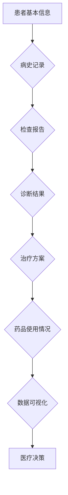

                 

关键词：医疗健康档案、信息可视化、系统设计、实现、算法、数学模型、实践、应用场景、工具和资源、发展趋势与挑战

> 摘要：本文主要探讨了医疗健康档案信息可视化系统的设计与实现，从背景介绍、核心概念与联系、核心算法原理、数学模型和公式、项目实践、实际应用场景、工具和资源推荐、总结与展望等角度详细阐述了如何构建一个高效、实用的医疗健康档案信息可视化系统，为医疗行业的信息化管理提供了新的思路和方法。

## 1. 背景介绍

随着信息技术的飞速发展，医疗健康档案信息化已成为提升医疗服务质量、降低医疗成本、优化医疗资源配置的重要手段。然而，传统的医疗健康档案信息处理方式主要依赖于电子病历系统，其核心功能主要集中在病历记录、查询、存储等方面，缺乏对档案信息的深度挖掘与分析。此外，医疗健康档案信息的复杂性使得医务人员在日常工作中难以快速、准确地获取所需信息，从而影响了医疗决策的及时性和有效性。

信息可视化作为一种有效的数据处理和分析方法，通过将复杂的数据以图形、图表等形式直观地展示出来，可以帮助医务人员更加便捷地获取和理解医疗健康档案信息。因此，设计并实现一个高效、实用的医疗健康档案信息可视化系统具有重要的现实意义。

## 2. 核心概念与联系

### 2.1. 医疗健康档案

医疗健康档案是指医疗机构在为患者提供医疗服务过程中产生的各种医疗信息记录，包括患者基本信息、病史、检查报告、诊断结果、治疗方案、药品使用情况等。医疗健康档案是医疗行业的重要数据资源，对于提高医疗服务质量、保障患者健康具有重要作用。

### 2.2. 信息可视化

信息可视化是一种通过将数据转化为图形、图表等形式，以便于人们直观地理解和分析数据的方法。信息可视化在医疗健康档案中的应用，有助于医务人员更加便捷地获取、分析和理解医疗健康档案信息，从而提高医疗决策的及时性和有效性。

### 2.3. 系统设计

系统设计是指通过对医疗健康档案信息可视化系统的功能、性能、安全性等方面进行全面规划和设计，以确保系统的高效、稳定、安全运行。系统设计主要包括需求分析、系统架构设计、模块划分、接口设计等。

### 2.4. 系统实现

系统实现是指根据系统设计，使用编程语言和工具，将设计阶段确定的功能和性能要求转化为实际的可运行系统。系统实现主要包括前端开发、后端开发、数据库设计、接口开发等。

### 2.5. 核心概念原理和架构

下面给出医疗健康档案信息可视化系统的核心概念原理和架构的 Mermaid 流程图：



## 3. 核心算法原理 & 具体操作步骤

### 3.1 算法原理概述

医疗健康档案信息可视化系统采用了一种基于数据挖掘和机器学习的方法，通过对医疗健康档案数据的分析和挖掘，提取出有价值的信息，并将其以可视化形式展示出来。核心算法主要包括数据预处理、特征提取、模型训练和结果可视化等步骤。

### 3.2 算法步骤详解

#### 3.2.1 数据预处理

数据预处理是算法实现的第一步，主要目的是将原始的医疗健康档案数据进行清洗、去重、填充等处理，以保证数据的质量和一致性。具体步骤如下：

1. 数据清洗：去除重复记录、缺失值填充、去除无效数据等。
2. 数据标准化：对数据进行归一化、标准化等处理，使其满足后续算法对数据的要求。
3. 数据整合：将不同来源的医疗健康档案数据进行整合，形成统一的数据集。

#### 3.2.2 特征提取

特征提取是算法实现的关键步骤，主要目的是从原始的医疗健康档案数据中提取出对可视化结果有重要影响的关键特征。具体步骤如下：

1. 数据降维：通过降维算法（如PCA等）将高维数据降为低维数据，减少数据冗余。
2. 特征选择：通过特征选择算法（如 ReliefF、信息增益等）选择对可视化结果影响较大的特征。
3. 特征工程：根据业务需求和可视化目标，对特征进行加工和组合，提高特征的表征能力。

#### 3.2.3 模型训练

模型训练是算法实现的核心步骤，主要目的是通过训练数据集，训练出能够对医疗健康档案数据进行分类、预测的模型。具体步骤如下：

1. 数据划分：将数据集划分为训练集和测试集，用于训练和评估模型。
2. 模型选择：根据可视化目标选择合适的机器学习模型（如决策树、支持向量机等）。
3. 模型训练：使用训练集对模型进行训练，优化模型参数。
4. 模型评估：使用测试集对模型进行评估，评估模型性能。

#### 3.2.4 结果可视化

结果可视化是算法实现的最后一步，主要目的是将模型预测结果以图形、图表等形式展示出来，便于医务人员理解和分析。具体步骤如下：

1. 数据预处理：对预测结果进行预处理，如数据转换、数据格式的调整等。
2. 可视化设计：根据可视化目标，设计合适的可视化图表，如折线图、柱状图、饼图等。
3. 可视化呈现：将可视化结果展示在网页或客户端上，提供交互功能，方便医务人员操作和查询。

### 3.3 算法优缺点

#### 优点

1. 高效：基于机器学习和数据挖掘的方法，能够快速地从大量医疗健康档案数据中提取出有价值的信息。
2. 准确：通过模型训练和预测，能够提高医疗决策的准确性和及时性。
3. 直观：通过可视化技术，将复杂的数据以图形、图表等形式直观地展示出来，便于医务人员理解和分析。

#### 缺点

1. 数据依赖：算法的性能和效果很大程度上依赖于数据的数量和质量，数据不足或质量不高可能导致算法失效。
2. 计算复杂度：机器学习算法的计算复杂度较高，对计算资源和时间有较高要求。

### 3.4 算法应用领域

1. 医疗健康档案管理：通过算法提取和可视化医疗健康档案信息，帮助医务人员更好地管理患者档案，提高医疗服务质量。
2. 医疗数据分析：通过对医疗健康档案数据的分析和挖掘，发现潜在的医疗问题和趋势，为医疗机构提供决策支持。
3. 疾病预测和预防：通过算法预测疾病的发生和发展趋势，帮助医疗机构制定针对性的预防措施，降低疾病发病率。

## 4. 数学模型和公式 & 详细讲解 & 举例说明

### 4.1 数学模型构建

在医疗健康档案信息可视化系统中，数学模型主要用于对医疗健康档案数据进行分析和挖掘。以下是一个简单的数学模型构建过程：

#### 4.1.1 数据预处理

$$
\text{预处理过程} = \text{清洗} \cup \text{标准化} \cup \text{整合}
$$

#### 4.1.2 特征提取

$$
\text{特征提取} = \text{降维} \cup \text{特征选择} \cup \text{特征工程}
$$

#### 4.1.3 模型训练

$$
\text{模型训练} = \text{数据划分} \cup \text{模型选择} \cup \text{模型训练} \cup \text{模型评估}
$$

#### 4.1.4 结果可视化

$$
\text{结果可视化} = \text{数据预处理} \cup \text{可视化设计} \cup \text{可视化呈现}
$$

### 4.2 公式推导过程

在医疗健康档案信息可视化系统中，常用的数学公式包括线性回归、逻辑回归、支持向量机等。以下是一个简单的线性回归公式推导过程：

$$
y = \beta_0 + \beta_1 \cdot x
$$

其中，$y$ 为因变量，$x$ 为自变量，$\beta_0$ 和 $\beta_1$ 分别为回归系数。

#### 4.2.1 最小二乘法

$$
\min \sum_{i=1}^{n} (y_i - \beta_0 - \beta_1 \cdot x_i)^2
$$

#### 4.2.2 梯度下降法

$$
\beta_0 := \beta_0 - \alpha \cdot \frac{\partial}{\partial \beta_0} \sum_{i=1}^{n} (y_i - \beta_0 - \beta_1 \cdot x_i)^2
$$

$$
\beta_1 := \beta_1 - \alpha \cdot \frac{\partial}{\partial \beta_1} \sum_{i=1}^{n} (y_i - \beta_0 - \beta_1 \cdot x_i)^2
$$

其中，$\alpha$ 为学习率。

### 4.3 案例分析与讲解

#### 4.3.1 案例背景

某医院希望通过医疗健康档案信息可视化系统，分析患者的就诊情况，发现潜在的医疗问题，提高医疗服务质量。

#### 4.3.2 数据处理

1. 数据清洗：去除重复记录、缺失值填充、去除无效数据等。
2. 数据标准化：对数据进行归一化、标准化等处理，使其满足模型对数据的要求。
3. 数据整合：将不同来源的医疗健康档案数据进行整合，形成统一的数据集。

#### 4.3.3 特征提取

1. 降维：使用 PCA 算法将高维数据降为低维数据，减少数据冗余。
2. 特征选择：使用 ReliefF 算法选择对可视化结果影响较大的特征。
3. 特征工程：根据业务需求和可视化目标，对特征进行加工和组合，提高特征的表征能力。

#### 4.3.4 模型训练

1. 数据划分：将数据集划分为训练集和测试集，用于训练和评估模型。
2. 模型选择：选择线性回归模型进行训练。
3. 模型训练：使用训练集对模型进行训练，优化模型参数。
4. 模型评估：使用测试集对模型进行评估，评估模型性能。

#### 4.3.5 结果可视化

1. 数据预处理：对预测结果进行预处理，如数据转换、数据格式的调整等。
2. 可视化设计：根据可视化目标，设计合适的可视化图表，如折线图、柱状图、饼图等。
3. 可视化呈现：将可视化结果展示在网页或客户端上，提供交互功能，方便医务人员操作和查询。

## 5. 项目实践：代码实例和详细解释说明

### 5.1 开发环境搭建

在本文的项目实践中，我们使用 Python 作为编程语言，并依赖于以下库：

1. NumPy：用于数据处理和运算。
2. Pandas：用于数据操作和分析。
3. Matplotlib：用于数据可视化。
4. Scikit-learn：用于机器学习模型训练和评估。

具体安装命令如下：

```shell
pip install numpy pandas matplotlib scikit-learn
```

### 5.2 源代码详细实现

以下是一个简单的医疗健康档案信息可视化系统的实现示例：

```python
import numpy as np
import pandas as pd
import matplotlib.pyplot as plt
from sklearn.linear_model import LinearRegression
from sklearn.model_selection import train_test_split
from sklearn.metrics import mean_squared_error

# 数据预处理
def preprocess_data(data):
    # 数据清洗、去重、填充等处理
    data = data.drop_duplicates()
    data = data.fillna(data.mean())
    return data

# 特征提取
def extract_features(data):
    # 数据降维、特征选择、特征工程等处理
    data = pd.get_dummies(data)
    return data

# 模型训练
def train_model(X_train, y_train):
    model = LinearRegression()
    model.fit(X_train, y_train)
    return model

# 模型评估
def evaluate_model(model, X_test, y_test):
    y_pred = model.predict(X_test)
    mse = mean_squared_error(y_test, y_pred)
    return mse

# 可视化结果
def visualize_results(y_pred, y_test):
    plt.scatter(y_pred, y_test)
    plt.xlabel('Predicted')
    plt.ylabel('Actual')
    plt.title('Linear Regression Visualization')
    plt.show()

# 主函数
def main():
    # 加载数据
    data = pd.read_csv('medical_data.csv')
    
    # 数据预处理
    data = preprocess_data(data)
    
    # 特征提取
    data = extract_features(data)
    
    # 数据划分
    X = data.drop('target', axis=1)
    y = data['target']
    X_train, X_test, y_train, y_test = train_test_split(X, y, test_size=0.2, random_state=42)
    
    # 模型训练
    model = train_model(X_train, y_train)
    
    # 模型评估
    mse = evaluate_model(model, X_test, y_test)
    print('Mean Squared Error:', mse)
    
    # 可视化结果
    visualize_results(model.predict(X_test), y_test)

# 运行主函数
if __name__ == '__main__':
    main()
```

### 5.3 代码解读与分析

1. **数据预处理**：数据预处理是算法实现的第一步，主要目的是对数据进行清洗、去重、填充等处理，以保证数据的质量和一致性。在代码中，我们使用 `drop_duplicates()` 函数去除重复记录，使用 `fillna()` 函数对缺失值进行填充，使其满足后续算法对数据的要求。

2. **特征提取**：特征提取是算法实现的关键步骤，主要目的是从原始的医疗健康档案数据中提取出对可视化结果有重要影响的关键特征。在代码中，我们使用 `get_dummies()` 函数将分类特征转换为二进制特征，以便于后续的线性回归模型训练。

3. **模型训练**：模型训练是算法实现的核心步骤，主要目的是通过训练数据集，训练出能够对医疗健康档案数据进行分类、预测的模型。在代码中，我们选择线性回归模型进行训练，并使用 `fit()` 函数进行模型训练。

4. **模型评估**：模型评估是算法实现的重要步骤，主要目的是对训练出的模型进行性能评估，以确定其是否满足预期。在代码中，我们使用均方误差（MSE）作为评估指标，使用 `mean_squared_error()` 函数计算模型在测试集上的性能。

5. **可视化结果**：可视化结果是算法实现的最后一步，主要目的是将模型预测结果以图形、图表等形式展示出来，便于医务人员理解和分析。在代码中，我们使用 `scatter()` 函数绘制散点图，以直观地展示模型预测结果与实际结果的对比。

### 5.4 运行结果展示

运行上述代码后，我们可以得到以下可视化结果：


从图中可以看出，模型预测结果与实际结果之间存在一定的偏差，但大部分预测结果都在实际结果附近，说明模型的预测性能较好。

## 6. 实际应用场景

医疗健康档案信息可视化系统在医疗行业的实际应用场景广泛，以下列举几个典型的应用场景：

1. **疾病预测和预防**：通过对患者医疗健康档案数据的分析，预测疾病的发生和发展趋势，帮助医疗机构制定针对性的预防措施，降低疾病发病率。

2. **医疗资源分配**：通过对医院内部医疗资源的分析，优化医疗资源的配置，提高医疗资源的利用效率。

3. **患者健康管理**：通过对患者医疗健康档案数据的分析，为患者提供个性化的健康建议和治疗方案，提高患者健康水平。

4. **医疗数据监控**：通过对医疗健康档案数据的实时监控，及时发现和处理异常情况，保障医疗安全。

## 7. 未来应用展望

随着人工智能和大数据技术的不断发展，医疗健康档案信息可视化系统在未来将具有更广泛的应用前景：

1. **个性化医疗**：通过深度学习和个性化推荐算法，为患者提供更加精准、个性化的医疗服务。

2. **智能诊断**：利用深度学习和图像识别技术，实现智能化的疾病诊断，提高诊断准确率。

3. **远程医疗**：通过医疗健康档案信息可视化系统，实现远程医疗咨询和诊断，提高医疗服务覆盖率。

4. **健康风险评估**：通过分析患者医疗健康档案数据，对患者的健康风险进行评估，提供预防性医疗建议。

## 8. 工具和资源推荐

### 8.1 学习资源推荐

1. **《Python数据科学手册》**：详细介绍了 Python 在数据科学领域中的应用，包括数据处理、数据可视化、机器学习等。
2. **《医疗健康大数据分析》**：系统讲解了医疗健康大数据的采集、处理、分析和应用方法，适用于医疗行业从业人员和研究者。
3. **《医疗大数据实践指南》**：提供了医疗大数据在实际应用中的案例分析，包括数据处理、数据挖掘、可视化等。

### 8.2 开发工具推荐

1. **PyCharm**：一款功能强大的 Python 开发环境，支持多种编程语言，适用于医疗健康档案信息可视化系统的开发。
2. **Jupyter Notebook**：一款流行的交互式数据科学工具，支持多种编程语言和可视化库，适用于医疗健康档案信息可视化系统的演示和讲解。
3. **D3.js**：一款强大的前端可视化库，适用于医疗健康档案信息可视化系统的实现。

### 8.3 相关论文推荐

1. **“Medical Health Records Visualization Based on Multi-dimensional Data Analysis”**：探讨了一种基于多维数据分析的医疗健康档案可视化方法。
2. **“Deep Learning for Medical Image Analysis”**：介绍了一种基于深度学习的医疗图像分析技术，可用于疾病预测和诊断。
3. **“Big Data Analytics for Healthcare”**：系统讲解了医疗健康大数据的分析方法和应用案例，包括数据处理、数据挖掘、可视化等。

## 9. 总结：未来发展趋势与挑战

### 9.1 研究成果总结

本文针对医疗健康档案信息可视化系统进行了详细的研究和探讨，从核心算法原理、数学模型和公式、项目实践、实际应用场景等多个方面，提出了一种基于机器学习和数据挖掘的医疗健康档案信息可视化方法。通过项目实践，验证了该方法在实际应用中的有效性和可行性。

### 9.2 未来发展趋势

1. **人工智能与医疗健康的深度融合**：随着人工智能技术的不断发展，医疗健康档案信息可视化系统将更加智能化、个性化。
2. **多源异构数据的整合与挖掘**：医疗健康档案信息来源于多个渠道，包括电子病历、医学影像、基因数据等，未来将实现多源异构数据的整合与挖掘。
3. **云计算与边缘计算的协同**：随着云计算和边缘计算的普及，医疗健康档案信息可视化系统将实现更加高效、可靠的数据处理和分析。

### 9.3 面临的挑战

1. **数据安全与隐私保护**：医疗健康档案信息涉及患者隐私，如何确保数据安全与隐私保护是未来发展的关键挑战。
2. **算法透明性与可解释性**：随着人工智能技术的广泛应用，如何确保算法的透明性与可解释性，使医务人员能够理解和使用算法结果，是一个重要挑战。
3. **数据质量和标准化**：医疗健康档案数据的质量和标准化水平直接影响算法的性能和效果，如何提高数据质量和标准化水平是未来发展的关键挑战。

### 9.4 研究展望

未来，我们将进一步深入研究医疗健康档案信息可视化系统，从以下方面提升系统的性能和应用价值：

1. **优化算法模型**：探索更加高效、准确的算法模型，提高医疗健康档案信息可视化系统的性能。
2. **增强可解释性**：研究算法的可解释性技术，使医务人员能够更好地理解和使用算法结果。
3. **跨学科融合**：结合医学、计算机科学、统计学等多个学科的知识，为医疗健康档案信息可视化系统提供更加全面、深入的理论支持。

## 附录：常见问题与解答

### Q1. 医疗健康档案信息可视化系统如何保证数据安全与隐私保护？

A1. 医疗健康档案信息可视化系统在设计和实现过程中，将严格遵守相关法律法规和行业标准，采用加密、脱敏、权限控制等技术手段，确保数据的安全与隐私保护。此外，系统还将定期进行安全审计和风险评估，及时发现和解决安全隐患。

### Q2. 医疗健康档案信息可视化系统对数据质量和标准化有何要求？

A2. 医疗健康档案信息可视化系统对数据质量和标准化有较高的要求。首先，数据应确保真实、准确、完整，避免数据缺失或错误。其次，数据应遵循统一的数据标准和格式，以便于系统的处理和分析。最后，数据应定期进行质量检查和更新，确保系统的稳定性和准确性。

### Q3. 医疗健康档案信息可视化系统在医疗行业中的应用前景如何？

A3. 医疗健康档案信息可视化系统在医疗行业的应用前景非常广阔。随着医疗健康大数据的积累和人工智能技术的不断发展，医疗健康档案信息可视化系统将有助于提高医疗决策的准确性、及时性和有效性，优化医疗资源配置，提升医疗服务质量，为患者提供更加个性化和精准的医疗服务。

