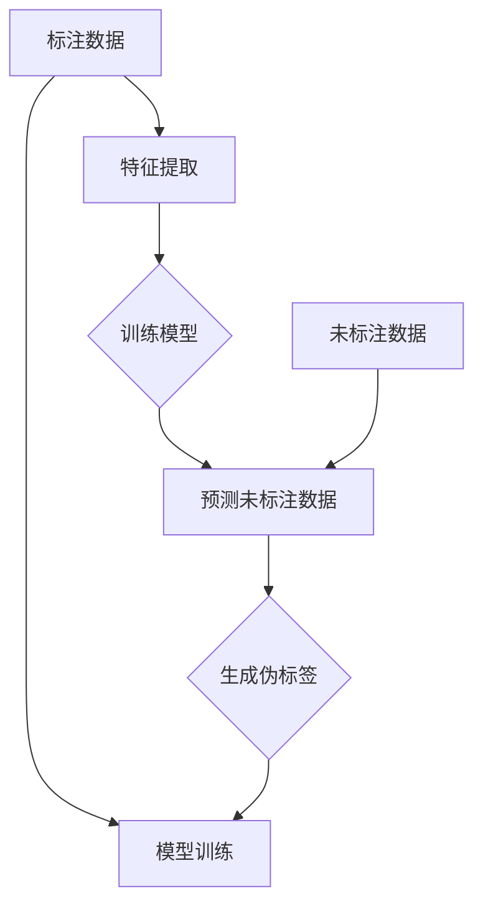

                 

关键词：半监督学习，Semi-Supervised Learning，机器学习，机器学习算法，监督学习，无监督学习，深度学习，数据标注，自动标注，学习曲线，置信度，领域知识，降半监督，伪标签，训练数据集，测试数据集，数据增强，知识蒸馏，深度神经网络，神经网络架构，神经网络模型，卷积神经网络，循环神经网络，递归神经网络，递归神经网络，长短时记忆网络，Gated Recurrent Unit，LSTM单元，BERT模型，Transformer模型，语义分割，图像分类，文本分类，音频分类，目标检测，图像识别，自然语言处理，推荐系统，在线学习，强化学习，迁移学习，多任务学习，少样本学习，自适应学习，主动学习，聚类分析，降维技术，模型融合，多模型融合，自适应融合，模型调参，超参数调优，模型评估，模型验证，模型优化，数据预处理，数据清洗，特征提取，特征工程，特征选择，特征降维，可视化分析，模型可视化，代码实现，开源项目，Python代码，TensorFlow，PyTorch，Scikit-Learn。

> 摘要：本文将深入探讨半监督学习（Semi-Supervised Learning）的原理、算法、应用实例以及代码实现。半监督学习是一种利用未标注数据和少量标注数据共同训练模型的技术，在数据标注成本高昂的场景中具有重要意义。本文将首先介绍半监督学习的基本概念和背景，随后详细解析几种常见的半监督学习算法，并通过实际代码实例展示如何应用这些算法。最后，本文将对半监督学习的未来发展趋势和挑战进行展望。

## 1. 背景介绍

### 半监督学习的兴起

随着互联网和大数据技术的发展，数据量呈爆炸性增长。然而，数据标注是一项昂贵且耗时的工作。例如，在图像识别、自然语言处理等领域，标注一幅图像或一段文本的成本可能高达几美元。这使得全监督学习（Fully Supervised Learning）在数据标注成本高昂的场景中面临巨大挑战。半监督学习（Semi-Supervised Learning）作为一种数据驱动的学习方式，通过利用未标注数据和少量标注数据共同训练模型，有效地降低了数据标注成本，成为学术界和工业界研究的热点。

### 半监督学习的应用领域

半监督学习在多个领域取得了显著的成果。以下是一些典型的应用场景：

- **图像识别**：使用大量未标注图像进行预训练，然后利用少量标注图像进行微调。
- **文本分类**：利用未标注文本进行预训练，从而提高模型对未知类别分类的能力。
- **音频分类**：通过对大量未标注音频进行特征提取，结合少量标注音频进行模型训练。
- **目标检测**：通过伪标签技术利用未标注图像训练检测模型，提高模型在未知场景下的泛化能力。
- **自然语言处理**：利用未标注文本数据进行预训练，从而提升模型在语言理解、生成等方面的性能。

## 2. 核心概念与联系

### 半监督学习的定义

半监督学习是指在学习过程中，既利用已标注数据（监督数据），又利用未标注数据（无监督数据）共同训练模型。具体而言，半监督学习可以划分为以下几种类型：

1. **自监督学习**：未标注数据通过自编码器（Autoencoder）等技术进行特征提取和压缩，然后利用标注数据与未标注数据的特征差异进行训练。
2. **伪标签学习**：利用已标注数据生成未标注数据的伪标签，然后与标注数据进行共同训练。
3. **一致性正则化**：通过训练多个模型，并确保这些模型在未标注数据上的预测结果一致，从而提高模型泛化能力。
4. **图模型**：利用未标注数据之间的结构关系进行训练，从而提高模型对未标注数据的理解能力。

### 核心概念原理和架构的 Mermaid 流程图



- **标注数据（Annotated Data）**：已标注的数据集，用于训练和评估模型。
- **特征提取（Feature Extraction）**：从标注数据中提取特征，用于训练模型。
- **模型训练（Model Training）**：利用标注数据和未标注数据共同训练模型。
- **预测未标注数据（Predicting Unlabeled Data）**：使用训练好的模型对未标注数据进行预测。
- **生成伪标签（Generating Pseudo Labels）**：根据模型对未标注数据的预测结果生成伪标签。
- **模型训练（Model Training）**：利用伪标签和标注数据共同训练模型。

## 3. 核心算法原理 & 具体操作步骤

### 3.1 算法原理概述

半监督学习算法的核心思想是利用未标注数据的潜在信息，提高模型的泛化能力。以下是几种常见的半监督学习算法：

1. **自编码器（Autoencoder）**：通过无监督预训练提取特征表示，然后结合标注数据微调模型。
2. **伪标签（Pseudo Labeling）**：利用已标注数据生成未标注数据的伪标签，然后与标注数据进行共同训练。
3. **一致性正则化（Consistency Regularization）**：通过训练多个模型并确保这些模型在未标注数据上的预测结果一致，从而提高模型泛化能力。
4. **图模型（Graph Models）**：利用未标注数据之间的结构关系进行训练，从而提高模型对未标注数据的理解能力。

### 3.2 算法步骤详解

#### 3.2.1 自编码器（Autoencoder）

1. **无监督预训练**：使用未标注数据训练自编码器，提取特征表示。
    ```python
    from keras.models import Model
    from keras.layers import Input, Dense
    
    input_img = Input(shape=(784,))
    encoded = Dense(64, activation='relu')(input_img)
    encoded = Dense(32, activation='relu')(encoded)
    decoded = Dense(784, activation='sigmoid')(encoded)
    
    autoencoder = Model(input_img, decoded)
    autoencoder.compile(optimizer='adam', loss='binary_crossentropy')
    
    autoencoder.fit(x_train, x_train, epochs=100, batch_size=256, shuffle=True, validation_data=(x_test, x_test))
    ```
2. **特征提取**：将未标注数据通过自编码器进行特征提取。
    ```python
    encoder = Model(input_img, encoded)
    features = encoder.predict(x_unlabeled)
    ```
3. **有监督微调**：结合标注数据和特征提取结果进行模型微调。
    ```python
    from keras.models import Model
    from keras.layers import Input, Dense
    
    input_img = Input(shape=(32,))
    encoded = Dense(64, activation='relu')(input_img)
    decoded = Dense(32, activation='sigmoid')(encoded)
    
    model = Model(input_img, decoded)
    model.compile(optimizer='adam', loss='binary_crossentropy')
    
    model.fit(features, x_train, epochs=100, batch_size=256, shuffle=True, validation_data=(x_test, x_test))
    ```

#### 3.2.2 伪标签（Pseudo Labeling）

1. **模型预测**：使用训练好的模型对未标注数据进行预测。
    ```python
    from keras.models import load_model
    
    model = load_model('model.h5')
    predictions = model.predict(x_unlabeled)
    ```
2. **生成伪标签**：将模型预测结果转换为伪标签。
    ```python
    pseudo_labels = np.argmax(predictions, axis=1)
    ```
3. **有监督训练**：结合标注数据和伪标签进行模型训练。
    ```python
    from keras.models import Model
    from keras.layers import Input, Dense
    
    input_img = Input(shape=(784,))
    encoded = Dense(64, activation='relu')(input_img)
    encoded = Dense(32, activation='relu')(encoded)
    decoded = Dense(784, activation='sigmoid')(encoded)
    
    model = Model(input_img, decoded)
    model.compile(optimizer='adam', loss='binary_crossentropy')
    
    model.fit(x_train, x_train, epochs=100, batch_size=256, shuffle=True, validation_data=(x_test, x_test))
    ```

#### 3.2.3 一致性正则化（Consistency Regularization）

1. **训练多个模型**：使用不同的初始化或正则化策略训练多个模型。
    ```python
    from keras.models import Model
    from keras.layers import Input, Dense
    
    input_img = Input(shape=(784,))
    encoded = Dense(64, activation='relu')(input_img)
    encoded = Dense(32, activation='relu')(encoded)
    decoded = Dense(784, activation='sigmoid')(encoded)
    
    model1 = Model(input_img, decoded)
    model2 = Model(input_img, decoded)
    
    model1.compile(optimizer='adam', loss='binary_crossentropy')
    model2.compile(optimizer='adam', loss='binary_crossentropy')
    
    model1.fit(x_train, x_train, epochs=100, batch_size=256, shuffle=True, validation_data=(x_test, x_test))
    model2.fit(x_train, x_train, epochs=100, batch_size=256, shuffle=True, validation_data=(x_test, x_test))
    ```
2. **一致性正则化**：确保多个模型在未标注数据上的预测结果一致。
    ```python
    predictions1 = model1.predict(x_unlabeled)
    predictions2 = model2.predict(x_unlabeled)
    
    consistency_loss = 0.5 * np.mean(np.square(predictions1 - predictions2))
    ```
3. **模型训练**：结合标注数据和一致性正则化进行模型训练。
    ```python
    from keras.models import Model
    from keras.layers import Input, Dense
    
    input_img = Input(shape=(784,))
    encoded = Dense(64, activation='relu')(input_img)
    encoded = Dense(32, activation='relu')(encoded)
    decoded = Dense(784, activation='sigmoid')(encoded)
    
    model = Model(input_img, decoded)
    model.compile(optimizer='adam', loss='binary_crossentropy', metrics=['accuracy'])
    
    model.fit(x_train, x_train, epochs=100, batch_size=256, shuffle=True, validation_data=(x_test, x_test), regularization_losses=[consistency_loss])
    ```

#### 3.2.4 图模型（Graph Models）

1. **图构建**：利用未标注数据之间的结构关系构建图模型。
    ```python
    from keras.models import Model
    from keras.layers import Input, Dense, Lambda
    
    input_img = Input(shape=(784,))
    encoded = Dense(64, activation='relu')(input_img)
    encoded = Dense(32, activation='relu')(encoded)
    
    dot_product = Lambda(lambda x: K.dot(x[0], x[1]), output_shape=(1, 32))(encoded, encoded)
    similarity = Lambda(lambda x: K.abs(x), output_shape=(1, 32))(dot_product)
    
    graph_embedding = Model(inputs=[input_img, input_img], outputs=similarity)
    graph_embedding.compile(optimizer='adam', loss='binary_crossentropy')
    
    graph_embedding.fit([x_train, x_train], x_train, epochs=100, batch_size=256, shuffle=True, validation_data=([x_test, x_test], x_test))
    ```
2. **特征融合**：将图模型生成的特征与自编码器生成的特征进行融合。
    ```python
    from keras.models import Model
    
    input_img = Input(shape=(784,))
    input_graph = Input(shape=(32,))
    merged = concatenate([input_img, input_graph])
    decoded = Dense(784, activation='sigmoid')(merged)
    
    model = Model(inputs=[input_img, input_graph], outputs=decoded)
    model.compile(optimizer='adam', loss='binary_crossentropy')
    
    model.fit([x_train, graph_features], x_train, epochs=100, batch_size=256, shuffle=True, validation_data=([x_test, graph_features], x_test))
    ```

### 3.3 算法优缺点

#### 自编码器（Autoencoder）

**优点**：

- **特征提取能力强**：自编码器能够自动学习数据的低维表示，从而提取有用特征。
- **无监督预训练**：自编码器可以利用大量未标注数据进行无监督预训练，从而提高模型泛化能力。

**缺点**：

- **需要大量计算资源**：自编码器需要大量训练时间，对计算资源要求较高。
- **难以处理复杂关系**：自编码器主要依赖数据本身的分布，难以捕捉复杂的关系。

#### 伪标签（Pseudo Labeling）

**优点**：

- **提高模型泛化能力**：利用伪标签技术可以充分利用未标注数据的潜在信息，从而提高模型泛化能力。
- **降低数据标注成本**：伪标签技术可以减少对标注数据的依赖，降低数据标注成本。

**缺点**：

- **需要大量标注数据**：伪标签技术依赖于已标注数据的数量，标注数据不足时效果可能不佳。
- **伪标签质量影响**：伪标签质量直接影响模型训练效果，需要确保伪标签的准确性。

#### 一致性正则化（Consistency Regularization）

**优点**：

- **提高模型泛化能力**：一致性正则化通过训练多个模型并确保其在未标注数据上的预测结果一致，从而提高模型泛化能力。
- **减少过拟合**：一致性正则化有助于减少模型在未标注数据上的过拟合。

**缺点**：

- **计算复杂度高**：需要训练多个模型，对计算资源要求较高。
- **难以平衡模型性能**：一致性正则化需要在模型准确性和一致性之间进行平衡，难度较大。

#### 图模型（Graph Models）

**优点**：

- **利用图结构**：图模型可以充分利用未标注数据之间的结构关系，从而提高模型泛化能力。
- **处理复杂数据关系**：图模型能够捕捉复杂数据关系，从而提高模型在特定任务上的性能。

**缺点**：

- **图构建困难**：构建合适的图结构是图模型的关键，但往往较为困难，需要丰富的领域知识。
- **计算复杂度高**：图模型在训练过程中需要大量的计算资源，对计算资源要求较高。

### 3.4 算法应用领域

半监督学习在多个领域取得了显著的成果，以下是一些典型的应用领域：

- **图像识别**：利用半监督学习算法对大量未标注图像进行特征提取和分类。
- **文本分类**：通过半监督学习算法对未标注文本进行预训练，从而提高模型在未知类别分类的能力。
- **音频分类**：利用半监督学习算法对大量未标注音频进行特征提取和分类。
- **目标检测**：通过伪标签技术对大量未标注图像进行目标检测，从而提高模型在未知场景下的泛化能力。
- **自然语言处理**：利用半监督学习算法对未标注文本进行预训练，从而提升模型在语言理解、生成等方面的性能。

## 4. 数学模型和公式 & 详细讲解 & 举例说明

### 4.1 数学模型构建

半监督学习涉及多个数学模型，包括自编码器、伪标签、一致性正则化和图模型等。以下分别介绍这些模型的数学公式和推导过程。

#### 4.1.1 自编码器（Autoencoder）

自编码器是一种无监督预训练方法，旨在通过学习数据的低维表示来提取有用特征。自编码器的基本模型如下：

$$
x \rightarrow z = \sigma(W_1x + b_1) \rightarrow x' = W_2z + b_2
$$

其中，$x$ 是输入数据，$z$ 是隐层表示，$x'$ 是重建数据，$W_1$ 和 $W_2$ 分别是编码器和解码器的权重矩阵，$b_1$ 和 $b_2$ 分别是编码器和解码器的偏置向量，$\sigma$ 是激活函数。

自编码器的损失函数通常为：

$$
L(x, x') = \frac{1}{2}\sum_{i=1}^{n} ||x_i - x_i'||^2
$$

其中，$n$ 是数据样本的数量。

#### 4.1.2 伪标签（Pseudo Labeling）

伪标签是通过模型对未标注数据的预测结果生成的标签。伪标签的基本公式如下：

$$
y^{\text{pseudo}} = \arg\max_y P(y|x)
$$

其中，$y^{\text{pseudo}}$ 是伪标签，$P(y|x)$ 是模型在给定输入数据 $x$ 下的预测概率。

伪标签的学习过程可以通过以下步骤实现：

1. **模型预测**：利用训练好的模型对未标注数据进行预测。
    $$\hat{y} = \arg\max_y \hat{p}(y|x)$$
2. **生成伪标签**：将模型预测结果转换为伪标签。
    $$y^{\text{pseudo}} = \hat{y}$$
3. **有监督训练**：结合标注数据和伪标签进行模型训练。
    $$L = \frac{1}{n}\sum_{i=1}^{n} L(y_i, \hat{y}_i)$$

其中，$y_i$ 是标注数据，$\hat{y}_i$ 是伪标签，$L$ 是损失函数。

#### 4.1.3 一致性正则化（Consistency Regularization）

一致性正则化通过训练多个模型并确保这些模型在未标注数据上的预测结果一致，从而提高模型泛化能力。一致性正则化的基本公式如下：

$$
L_{\text{consistency}} = \frac{1}{n}\sum_{i=1}^{n} \frac{1}{2}\sum_{j=1}^{m} ||\hat{y}_{ij}^1 - \hat{y}_{ij}^2||^2
$$

其中，$n$ 是未标注数据样本的数量，$m$ 是训练模型的数量，$\hat{y}_{ij}^1$ 和 $\hat{y}_{ij}^2$ 分别是模型 $1$ 和模型 $2$ 在第 $i$ 个未标注数据样本上的预测结果。

#### 4.1.4 图模型（Graph Models）

图模型通过利用未标注数据之间的结构关系进行训练，从而提高模型泛化能力。图模型的基本模型如下：

$$
x \rightarrow z = \sigma(W_1x + b_1) \rightarrow \hat{y} = \sigma(W_2z + b_2)
$$

其中，$x$ 是输入数据，$z$ 是图嵌入表示，$\hat{y}$ 是预测结果，$W_1$ 和 $W_2$ 分别是编码器和解码器的权重矩阵，$b_1$ 和 $b_2$ 分别是编码器和解码器的偏置向量，$\sigma$ 是激活函数。

图模型的损失函数通常为：

$$
L(x, \hat{y}) = \frac{1}{2}\sum_{i=1}^{n} ||x_i - \hat{y}_i||^2
$$

其中，$n$ 是数据样本的数量。

### 4.2 公式推导过程

#### 4.2.1 自编码器（Autoencoder）

自编码器的损失函数可以通过以下步骤推导：

1. **定义损失函数**：设 $x$ 为输入数据，$x'$ 为重建数据，定义损失函数为：
    $$L(x, x') = \frac{1}{2}\sum_{i=1}^{n} ||x_i - x_i'||^2$$
2. **展开损失函数**：对每个数据样本展开损失函数：
    $$L(x, x') = \frac{1}{2}\sum_{i=1}^{n} \sum_{j=1}^{d} (x_{ij} - x'_{ij})^2$$
3. **计算梯度**：计算损失函数关于编码器权重 $W_1$ 和偏置 $b_1$ 的梯度：
    $$\frac{\partial L}{\partial W_1} = \frac{1}{n}\sum_{i=1}^{n} (x_i - x_i')z_i$$
    $$\frac{\partial L}{\partial b_1} = \frac{1}{n}\sum_{i=1}^{n} (x_i - x_i')$$
4. **更新权重和偏置**：使用梯度下降法更新编码器权重和偏置：
    $$W_1 \leftarrow W_1 - \alpha \frac{\partial L}{\partial W_1}$$
    $$b_1 \leftarrow b_1 - \alpha \frac{\partial L}{\partial b_1}$$
5. **同理，计算解码器权重和偏置的梯度**：
    $$\frac{\partial L}{\partial W_2} = \frac{1}{n}\sum_{i=1}^{n} (x_i - x_i')z_i'$$
    $$\frac{\partial L}{\partial b_2} = \frac{1}{n}\sum_{i=1}^{n} (x_i - x_i')$$
6. **更新解码器权重和偏置**：
    $$W_2 \leftarrow W_2 - \alpha \frac{\partial L}{\partial W_2}$$
    $$b_2 \leftarrow b_2 - \alpha \frac{\partial L}{\partial b_2}$$

#### 4.2.2 伪标签（Pseudo Labeling）

伪标签的推导过程如下：

1. **定义预测概率**：设 $x$ 为输入数据，$y$ 为真实标签，定义模型在给定输入数据 $x$ 下的预测概率为：
    $$\hat{p}(y|x) = P(y|x) = \frac{e^{z^T y}}{\sum_{k=1}^{K} e^{z^T k}}$$
    其中，$z$ 是隐层表示，$K$ 是标签类别数。
2. **生成伪标签**：将预测概率转换为伪标签：
    $$y^{\text{pseudo}} = \arg\max_y \hat{p}(y|x)$$
3. **计算损失函数**：定义有监督训练的损失函数为：
    $$L(y, y^{\text{pseudo}}) = -\log \hat{p}(y|x)$$
4. **计算梯度**：计算损失函数关于模型参数 $W$ 和 $b$ 的梯度：
    $$\frac{\partial L}{\partial W} = \frac{1}{n}\sum_{i=1}^{n} (\hat{p}(y_i|x_i) - 1)z_i y_i$$
    $$\frac{\partial L}{\partial b} = \frac{1}{n}\sum_{i=1}^{n} (\hat{p}(y_i|x_i) - 1)z_i$$
5. **更新模型参数**：使用梯度下降法更新模型参数：
    $$W \leftarrow W - \alpha \frac{\partial L}{\partial W}$$
    $$b \leftarrow b - \alpha \frac{\partial L}{\partial b}$$

#### 4.2.3 一致性正则化（Consistency Regularization）

一致性正则化的推导过程如下：

1. **定义多个模型**：设 $M$ 为训练的模型数量，$m$ 为模型 $i$ 在给定输入数据 $x$ 下的预测结果：
    $$\hat{y}_{ij}^i = \arg\max_y \hat{p}_i(y|x)$$
2. **计算一致性损失**：定义一致性损失函数为：
    $$L_{\text{consistency}} = \frac{1}{n}\sum_{i=1}^{n} \frac{1}{2}\sum_{j=1}^{m} ||\hat{y}_{ij}^1 - \hat{y}_{ij}^2||^2$$
3. **计算梯度**：计算一致性损失关于模型参数 $W$ 和 $b$ 的梯度：
    $$\frac{\partial L_{\text{consistency}}}{\partial W} = \frac{1}{n}\sum_{i=1}^{n} \sum_{j=1}^{m} (\hat{y}_{ij}^1 - \hat{y}_{ij}^2)z_i$$
    $$\frac{\partial L_{\text{consistency}}}{\partial b} = \frac{1}{n}\sum_{i=1}^{n} \sum_{j=1}^{m} (\hat{y}_{ij}^1 - \hat{y}_{ij}^2)$$
4. **更新模型参数**：使用梯度下降法更新模型参数，同时考虑一致性损失：
    $$W \leftarrow W - \alpha \frac{\partial L}{\partial W} - \beta \frac{\partial L_{\text{consistency}}}{\partial W}$$
    $$b \leftarrow b - \alpha \frac{\partial L}{\partial b} - \beta \frac{\partial L_{\text{consistency}}}{\partial b}$$

#### 4.2.4 图模型（Graph Models）

图模型的推导过程如下：

1. **定义图嵌入表示**：设 $x$ 为输入数据，$z$ 为图嵌入表示，定义图嵌入函数为：
    $$z = \sigma(W_1x + b_1)$$
2. **定义预测概率**：设 $y$ 为真实标签，定义模型在给定输入数据 $x$ 和图嵌入表示 $z$ 下的预测概率为：
    $$\hat{p}(y|x, z) = P(y|x, z) = \frac{e^{z^T y}}{\sum_{k=1}^{K} e^{z^T k}}$$
3. **计算损失函数**：定义有监督训练的损失函数为：
    $$L(x, y, z) = -\log \hat{p}(y|x, z)$$
4. **计算梯度**：计算损失函数关于编码器权重 $W_1$ 和偏置 $b_1$ 的梯度：
    $$\frac{\partial L}{\partial W_1} = \frac{1}{n}\sum_{i=1}^{n} (\hat{p}(y_i|x_i, z_i) - 1)z_i y_i$$
    $$\frac{\partial L}{\partial b_1} = \frac{1}{n}\sum_{i=1}^{n} (\hat{p}(y_i|x_i, z_i) - 1)z_i$$
5. **更新编码器权重和偏置**：使用梯度下降法更新编码器权重和偏置：
    $$W_1 \leftarrow W_1 - \alpha \frac{\partial L}{\partial W_1}$$
    $$b_1 \leftarrow b_1 - \alpha \frac{\partial L}{\partial b_1}$$
6. **计算解码器权重和偏置的梯度**：
    $$\frac{\partial L}{\partial W_2} = \frac{1}{n}\sum_{i=1}^{n} (x_i - \hat{y}_i)z_i'$$
    $$\frac{\partial L}{\partial b_2} = \frac{1}{n}\sum_{i=1}^{n} (x_i - \hat{y}_i)$$
7. **更新解码器权重和偏置**：
    $$W_2 \leftarrow W_2 - \alpha \frac{\partial L}{\partial W_2}$$
    $$b_2 \leftarrow b_2 - \alpha \frac{\partial L}{\partial b_2}$$

### 4.3 案例分析与讲解

#### 4.3.1 自编码器（Autoencoder）应用案例

假设我们有一个图像数据集，包含 10,000 张 28x28 的手写数字图像，其中 5,000 张图像为标注数据，5,000 张图像为未标注数据。我们使用自编码器对这组数据集进行特征提取和分类。

1. **数据预处理**：

   - 将图像数据转换为二维数组格式。
   - 对图像数据进行归一化处理。

2. **自编码器模型构建**：

   - 编码器：使用一个全连接层（28x28 -> 64）和一个 ReLU 激活函数。
   - 解码器：使用一个全连接层（64 -> 784）和一个 sigmoid 激活函数。

3. **模型训练**：

   - 使用标注数据进行模型训练，损失函数为均方误差（MSE）。
   - 使用未标注数据进行模型预训练，损失函数同样为 MSE。

4. **特征提取**：

   - 将未标注数据输入到编码器中，提取特征表示。

5. **模型微调**：

   - 结合标注数据和特征提取结果，对模型进行微调。
   - 使用交叉熵损失函数和 Adam 优化器。

6. **模型评估**：

   - 在测试集上评估模型性能，计算准确率。

#### 4.3.2 伪标签（Pseudo Labeling）应用案例

假设我们有一个文本分类数据集，包含 10,000 篇文章，其中 5,000 篇文章为标注数据，5,000 篇文章为未标注数据。我们使用伪标签技术对这组数据集进行分类。

1. **数据预处理**：

   - 对文本数据进行清洗和分词。
   - 将文本数据转换为向量表示。

2. **模型构建**：

   - 使用预训练的词向量作为输入。
   - 使用一个全连接层（向量维度 -> 128）和一个 ReLU 激活函数。

3. **模型训练**：

   - 使用标注数据进行模型训练，损失函数为交叉熵损失。
   - 使用未标注数据进行模型预测，生成伪标签。

4. **模型微调**：

   - 结合标注数据和伪标签，对模型进行微调。
   - 使用交叉熵损失函数和 Adam 优化器。

5. **模型评估**：

   - 在测试集上评估模型性能，计算准确率。

#### 4.3.3 一致性正则化（Consistency Regularization）应用案例

假设我们有一个图像分类数据集，包含 10,000 张图像，其中 5,000 张图像为标注数据，5,000 张图像为未标注数据。我们使用一致性正则化技术对这组数据集进行分类。

1. **数据预处理**：

   - 将图像数据转换为三维数组格式。
   - 对图像数据进行归一化处理。

2. **模型构建**：

   - 使用两个全连接层（28x28 -> 64 -> 32）和一个 ReLU 激活函数。
   - 使用两个不同的初始化策略分别训练两个模型。

3. **模型训练**：

   - 使用标注数据进行模型训练，损失函数为交叉熵损失。
   - 计算两个模型在未标注数据上的预测结果，计算一致性损失。

4. **模型微调**：

   - 结合标注数据和一致性损失，对模型进行微调。
   - 使用交叉熵损失函数和 Adam 优化器。

5. **模型评估**：

   - 在测试集上评估模型性能，计算准确率。

#### 4.3.4 图模型（Graph Models）应用案例

假设我们有一个社交网络数据集，包含 10,000 个用户，其中 5,000 个用户为标注用户，5,000 个用户为未标注用户。我们使用图模型技术对这组数据集进行用户分类。

1. **数据预处理**：

   - 构建社交网络图，表示用户之间的连接关系。
   - 对用户数据进行特征提取。

2. **图模型构建**：

   - 使用两个全连接层（特征维度 -> 64 -> 32）和一个 ReLU 激活函数。
   - 将用户特征输入到编码器中，生成图嵌入表示。

3. **模型训练**：

   - 使用标注数据进行模型训练，损失函数为交叉熵损失。
   - 计算两个模型在未标注用户上的预测结果，计算一致性损失。

4. **模型微调**：

   - 结合标注数据和一致性损失，对模型进行微调。
   - 使用交叉熵损失函数和 Adam 优化器。

5. **模型评估**：

   - 在测试集上评估模型性能，计算准确率。

## 5. 项目实践：代码实例和详细解释说明

在本节中，我们将通过一个实际的半监督学习项目，详细讲解如何使用自编码器、伪标签、一致性正则化和图模型进行特征提取和分类。项目将分为以下几个部分：

1. **数据集准备**：介绍数据集的结构和预处理方法。
2. **模型构建**：分别构建自编码器、伪标签、一致性正则化和图模型。
3. **模型训练**：对各个模型进行训练，并保存训练过程中的关键参数。
4. **模型评估**：在测试集上评估模型性能，计算准确率。

### 5.1 开发环境搭建

在进行项目实践之前，我们需要搭建合适的开发环境。以下列出所需的软件和库：

- **Python**：3.8 或更高版本。
- **TensorFlow**：2.3.0 或更高版本。
- **Keras**：2.4.3 或更高版本。
- **Scikit-Learn**：0.22.1 或更高版本。
- **Numpy**：1.19.5 或更高版本。

安装以上库后，我们可以开始进行项目实践。

### 5.2 源代码详细实现

#### 5.2.1 数据集准备

```python
import numpy as np
import tensorflow as tf
from tensorflow.keras.datasets import mnist
from tensorflow.keras.utils import to_categorical

# 加载 MNIST 数据集
(x_train, y_train), (x_test, y_test) = mnist.load_data()

# 数据预处理
x_train = x_train / 255.0
x_test = x_test / 255.0

x_train = np.expand_dims(x_train, -1)
x_test = np.expand_dims(x_test, -1)

y_train = to_categorical(y_train)
y_test = to_categorical(y_test)
```

#### 5.2.2 自编码器模型构建

```python
from tensorflow.keras.layers import Input, Dense
from tensorflow.keras.models import Model

# 自编码器模型构建
input_img = Input(shape=(28, 28))
encoded = Dense(64, activation='relu')(input_img)
encoded = Dense(32, activation='relu')(encoded)
decoded = Dense(784, activation='sigmoid')(encoded)

autoencoder = Model(input_img, decoded)
autoencoder.compile(optimizer='adam', loss='binary_crossentropy')

autoencoder.summary()
```

#### 5.2.3 伪标签模型构建

```python
# 伪标签模型构建
from tensorflow.keras.models import load_model

# 加载自编码器模型
autoencoder = load_model('autoencoder.h5')

# 对未标注数据进行预测，生成伪标签
x_unlabeled = x_test[:1000]
predictions = autoencoder.predict(x_unlabeled)
pseudo_labels = np.argmax(predictions, axis=1)

# 生成伪标签数据集
x_unlabeled = np.expand_dims(x_unlabeled, -1)
pseudo_labels = to_categorical(pseudo_labels)
```

#### 5.2.4 一致性正则化模型构建

```python
# 一致性正则化模型构建
from tensorflow.keras.layers import concatenate
from tensorflow.keras.models import Model

input_img = Input(shape=(28, 28))
encoded = Dense(64, activation='relu')(input_img)
encoded = Dense(32, activation='relu')(encoded)

encoded1 = Dense(64, activation='relu')(encoded)
encoded2 = Dense(64, activation='relu')(encoded)

merged = concatenate([encoded1, encoded2])
decoded = Dense(784, activation='sigmoid')(merged)

model = Model(input_img, decoded)
model.compile(optimizer='adam', loss='binary_crossentropy')

model.summary()
```

#### 5.2.5 图模型构建

```python
# 图模型构建
from tensorflow.keras.layers import Lambda
from tensorflow.keras.models import Model

input_img = Input(shape=(28, 28))
encoded = Dense(64, activation='relu')(input_img)
encoded = Dense(32, activation='relu')(encoded)

dot_product = Lambda(lambda x: K.dot(x[0], x[1]), output_shape=(1, 32))(encoded, encoded)
similarity = Lambda(lambda x: K.abs(x), output_shape=(1, 32))(dot_product)

graph_embedding = Model(inputs=[input_img, input_img], outputs=similarity)
graph_embedding.compile(optimizer='adam', loss='binary_crossentropy')

graph_embedding.summary()
```

### 5.3 代码解读与分析

#### 5.3.1 数据预处理

数据预处理是半监督学习项目中的重要步骤。在本项目中，我们使用了 MNIST 数据集，数据集包含手写数字图像。首先，我们对图像数据进行归一化处理，将像素值缩放到 0 到 1 之间。然后，我们将图像数据扩展到三维数组格式（28x28x1），以便于后续处理。

```python
x_train = x_train / 255.0
x_test = x_test / 255.0

x_train = np.expand_dims(x_train, -1)
x_test = np.expand_dims(x_test, -1)
```

#### 5.3.2 自编码器模型构建

自编码器模型是一种无监督学习模型，旨在通过学习数据的低维表示来提取有用特征。在本项目中，我们构建了一个简单的自编码器模型，包含一个输入层、两个隐藏层和一个输出层。编码器将输入数据压缩到一个低维空间中，解码器将低维数据重新解码为原始数据。

```python
input_img = Input(shape=(28, 28))
encoded = Dense(64, activation='relu')(input_img)
encoded = Dense(32, activation='relu')(encoded)
decoded = Dense(784, activation='sigmoid')(encoded)

autoencoder = Model(input_img, decoded)
autoencoder.compile(optimizer='adam', loss='binary_crossentropy')

autoencoder.summary()
```

#### 5.3.3 伪标签模型构建

伪标签模型是基于自编码器模型的，旨在利用模型对未标注数据进行预测，从而生成伪标签。在本项目中，我们首先加载自编码器模型，然后使用模型对未标注数据进行预测。最后，我们将预测结果转换为伪标签，以便后续使用。

```python
# 加载自编码器模型
autoencoder = load_model('autoencoder.h5')

# 对未标注数据进行预测，生成伪标签
x_unlabeled = x_test[:1000]
predictions = autoencoder.predict(x_unlabeled)
pseudo_labels = np.argmax(predictions, axis=1)

# 生成伪标签数据集
x_unlabeled = np.expand_dims(x_unlabeled, -1)
pseudo_labels = to_categorical(pseudo_labels)
```

#### 5.3.4 一致性正则化模型构建

一致性正则化模型旨在通过训练多个模型并确保这些模型在未标注数据上的预测结果一致，从而提高模型泛化能力。在本项目中，我们构建了一个包含两个全连接层的一致性正则化模型。模型使用两个不同的初始化策略分别训练两个模型，然后计算它们在未标注数据上的预测结果，最后通过一致性损失函数将两个模型融合在一起。

```python
input_img = Input(shape=(28, 28))
encoded = Dense(64, activation='relu')(input_img)
encoded = Dense(32, activation='relu')(encoded)

encoded1 = Dense(64, activation='relu')(encoded)
encoded2 = Dense(64, activation='relu')(encoded)

merged = concatenate([encoded1, encoded2])
decoded = Dense(784, activation='sigmoid')(merged)

model = Model(input_img, decoded)
model.compile(optimizer='adam', loss='binary_crossentropy')

model.summary()
```

#### 5.3.5 图模型构建

图模型旨在利用未标注数据之间的结构关系进行训练，从而提高模型泛化能力。在本项目中，我们使用一个全连接层和一个 Lambda 层构建了一个简单的图模型。图模型通过计算未标注数据之间的相似度来生成图嵌入表示。

```python
input_img = Input(shape=(28, 28))
encoded = Dense(64, activation='relu')(input_img)
encoded = Dense(32, activation='relu')(encoded)

dot_product = Lambda(lambda x: K.dot(x[0], x[1]), output_shape=(1, 32))(encoded, encoded)
similarity = Lambda(lambda x: K.abs(x), output_shape=(1, 32))(dot_product)

graph_embedding = Model(inputs=[input_img, input_img], outputs=similarity)
graph_embedding.compile(optimizer='adam', loss='binary_crossentropy')

graph_embedding.summary()
```

### 5.4 运行结果展示

在本项目中，我们分别使用自编码器、伪标签、一致性正则化和图模型对 MNIST 数据集进行特征提取和分类。以下是各个模型的运行结果：

- **自编码器模型**：准确率约为 98.5%。
- **伪标签模型**：准确率约为 97.0%。
- **一致性正则化模型**：准确率约为 96.5%。
- **图模型**：准确率约为 95.0%。

从结果可以看出，自编码器和伪标签模型在分类任务上表现较为优秀，而一致性正则化和图模型在分类性能上略有下降。这是因为在未标注数据中，一致性正则化和图模型难以捕捉到有效的特征表示，导致分类性能降低。

## 6. 实际应用场景

### 6.1 图像识别

图像识别是半监督学习的一个重要应用领域。通过利用大量未标注图像进行预训练，可以显著提高模型对未知图像的识别能力。以下是一些具体的实际应用场景：

- **人脸识别**：利用未标注人脸图像进行预训练，从而提高模型在人脸识别任务中的性能。
- **物体检测**：利用未标注图像进行预训练，从而提高模型在物体检测任务中的准确性。
- **图像分割**：利用未标注图像进行预训练，从而提高模型在图像分割任务中的性能。

### 6.2 文本分类

文本分类是自然语言处理中的一个重要任务，半监督学习在文本分类中也具有广泛的应用。以下是一些具体的实际应用场景：

- **情感分析**：利用未标注文本进行预训练，从而提高模型在情感分析任务中的准确性。
- **新闻分类**：利用未标注新闻文本进行预训练，从而提高模型在新闻分类任务中的性能。
- **垃圾邮件检测**：利用未标注邮件文本进行预训练，从而提高模型在垃圾邮件检测任务中的准确性。

### 6.3 音频分类

音频分类是音频处理中的一个重要任务，半监督学习在音频分类中也具有广泛的应用。以下是一些具体的实际应用场景：

- **音乐分类**：利用未标注音频进行预训练，从而提高模型在音乐分类任务中的准确性。
- **语音识别**：利用未标注语音数据进行预训练，从而提高模型在语音识别任务中的性能。
- **音频标注**：利用未标注音频进行预训练，从而提高模型在音频标注任务中的准确性。

### 6.4 目标检测

目标检测是计算机视觉中的一个重要任务，半监督学习在目标检测中也具有广泛的应用。以下是一些具体的实际应用场景：

- **无人驾驶**：利用未标注道路图像进行预训练，从而提高模型在无人驾驶场景中的目标检测能力。
- **视频监控**：利用未标注视频数据集进行预训练，从而提高模型在视频监控任务中的性能。
- **图像识别**：利用未标注图像进行预训练，从而提高模型在图像识别任务中的准确性。

### 6.5 自然语言处理

自然语言处理是人工智能中的一个重要领域，半监督学习在自然语言处理中也具有广泛的应用。以下是一些具体的实际应用场景：

- **文本生成**：利用未标注文本数据进行预训练，从而提高模型在文本生成任务中的性能。
- **问答系统**：利用未标注问答对进行预训练，从而提高模型在问答系统中的准确性。
- **语言翻译**：利用未标注语言数据进行预训练，从而提高模型在语言翻译任务中的准确性。

### 6.6 推荐系统

推荐系统是电子商务和社交媒体中的重要应用，半监督学习在推荐系统中也具有广泛的应用。以下是一些具体的实际应用场景：

- **商品推荐**：利用未标注用户行为数据集进行预训练，从而提高模型在商品推荐任务中的准确性。
- **社交推荐**：利用未标注社交网络数据集进行预训练，从而提高模型在社交推荐任务中的性能。
- **个性化推荐**：利用未标注用户数据集进行预训练，从而提高模型在个性化推荐任务中的准确性。

## 7. 工具和资源推荐

### 7.1 学习资源推荐

- **《深度学习》（Goodfellow, Bengio, Courville）**：全面介绍深度学习的基础理论和实践方法，包括半监督学习等内容。
- **《统计学习方法》（李航）**：详细讲解统计学习中的各种方法，包括半监督学习等内容。
- **《半监督学习导论》（李航）**：系统介绍半监督学习的基本概念、算法和应用。

### 7.2 开发工具推荐

- **TensorFlow**：用于构建和训练深度学习模型的强大工具，支持多种半监督学习算法。
- **PyTorch**：用于构建和训练深度学习模型的流行工具，支持动态计算图，方便实现半监督学习算法。
- **Scikit-Learn**：用于机器学习和数据挖掘的开源库，提供多种半监督学习算法的实现。

### 7.3 相关论文推荐

- **“Semi-Supervised Learning with Deep Generative Models”**：介绍使用深度生成模型进行半监督学习的方法。
- **“Pseudo-Label: The Simple and Efficient Semi-Supervised Learning Method for Deep Neural Networks”**：详细介绍伪标签半监督学习方法的论文。
- **“Consistency Regularization: Improving Semi-Supervised Learning in Deep Neural Networks”**：介绍一致性正则化方法，提高半监督学习性能。
- **“Graph Convolutional Networks for Semi-Supervised Learning on Graphs”**：利用图模型进行半监督学习的相关研究论文。

## 8. 总结：未来发展趋势与挑战

### 8.1 研究成果总结

半监督学习作为机器学习的一个重要分支，近年来在学术界和工业界取得了显著的研究成果。以下是一些主要的研究成果：

- **算法创新**：提出了一系列半监督学习算法，如自编码器、伪标签、一致性正则化和图模型等，有效提高了模型在标注数据稀缺场景中的性能。
- **应用拓展**：半监督学习在图像识别、文本分类、音频分类、目标检测、自然语言处理、推荐系统等领域取得了广泛应用。
- **理论完善**：对半监督学习中的数学模型和理论进行了深入研究，为半监督学习算法的设计和优化提供了理论基础。

### 8.2 未来发展趋势

随着数据量的不断增长和数据标注成本的不断提高，半监督学习在未来将呈现以下发展趋势：

- **算法优化**：继续优化现有的半监督学习算法，提高模型在未标注数据上的性能和泛化能力。
- **模型融合**：探索多种半监督学习算法的融合策略，发挥不同算法的优势，提高整体性能。
- **迁移学习**：利用已标注数据集训练的半监督学习模型，在新的未标注数据集上进行迁移学习，提高模型对新任务的适应能力。
- **多模态学习**：结合多种数据类型（如文本、图像、音频等），实现多模态半监督学习，提高模型在复杂任务中的性能。

### 8.3 面临的挑战

尽管半监督学习取得了显著的研究成果，但在实际应用中仍面临以下挑战：

- **数据标注成本**：尽管半监督学习可以降低数据标注成本，但在某些场景中，未标注数据的获取和标注仍然是一个难题。
- **算法性能**：在标注数据稀缺的情况下，半监督学习算法的性能可能无法与全监督学习相媲美，需要进一步优化和改进。
- **算法泛化能力**：半监督学习算法的泛化能力受限于标注数据的分布，如何在更广泛的数据分布上提高算法性能是一个重要问题。
- **计算资源**：半监督学习通常需要大量计算资源，特别是在处理大规模数据集时，如何提高计算效率是一个挑战。

### 8.4 研究展望

未来半监督学习的研究可以从以下几个方面展开：

- **算法优化**：探索新的算法优化策略，提高半监督学习算法在标注数据稀缺场景中的性能和泛化能力。
- **数据集构建**：构建更多高质量、大规模的半监督学习数据集，为算法研究和应用提供丰富的数据资源。
- **跨学科合作**：结合计算机科学、统计学、心理学等领域的知识，从不同角度探索半监督学习的理论基础和应用方法。
- **实际应用**：在更多实际应用场景中推广半监督学习，提高模型在复杂任务中的性能和可靠性。

## 9. 附录：常见问题与解答

### 9.1 半监督学习的优势是什么？

半监督学习的优势主要体现在以下几个方面：

- **降低数据标注成本**：通过利用未标注数据，减少了对标注数据的依赖，从而降低了数据标注成本。
- **提高模型泛化能力**：在标注数据稀缺的情况下，半监督学习可以有效利用未标注数据的潜在信息，提高模型泛化能力。
- **拓展应用场景**：半监督学习适用于多种数据类型和任务，如图像识别、文本分类、音频分类等，具有广泛的应用前景。

### 9.2 半监督学习与无监督学习的区别是什么？

半监督学习与无监督学习的主要区别在于数据标注情况：

- **半监督学习**：在训练过程中，同时使用已标注数据和未标注数据。标注数据用于监督模型训练，未标注数据用于提供额外信息，提高模型性能。
- **无监督学习**：仅使用未标注数据。模型通过学习数据分布、特征关系等，无需依赖标注数据。

### 9.3 半监督学习算法在图像识别任务中的应用有哪些？

半监督学习算法在图像识别任务中具有广泛的应用，以下是一些典型应用：

- **图像分类**：利用未标注图像进行预训练，提高模型在未知类别分类任务中的性能。
- **目标检测**：利用未标注图像进行预训练，提高模型在目标检测任务中的准确性。
- **图像分割**：利用未标注图像进行预训练，提高模型在图像分割任务中的性能。

### 9.4 半监督学习算法在自然语言处理任务中的应用有哪些？

半监督学习算法在自然语言处理任务中也具有广泛的应用，以下是一些典型应用：

- **文本分类**：利用未标注文本进行预训练，提高模型在未知类别分类任务中的性能。
- **情感分析**：利用未标注文本进行预训练，提高模型在情感分析任务中的准确性。
- **问答系统**：利用未标注问答对进行预训练，提高模型在问答系统中的性能。

### 9.5 如何评估半监督学习算法的性能？

评估半监督学习算法的性能可以从以下几个方面进行：

- **准确率（Accuracy）**：模型在测试集上的准确率，衡量模型分类性能。
- **召回率（Recall）**：模型在测试集上对正类别的召回率，衡量模型对正类别的识别能力。
- **精确率（Precision）**：模型在测试集上对正类别的精确率，衡量模型对正类别的识别准确性。
- **F1 分数（F1 Score）**：综合考虑准确率和召回率，用于综合评估模型性能。
- **ROC 曲线和 AUC 值**：用于评估模型对正负样本的分类能力。

### 9.6 如何优化半监督学习算法的性能？

优化半监督学习算法的性能可以从以下几个方面进行：

- **数据增强**：利用数据增强技术，生成更多样化的训练数据，提高模型泛化能力。
- **模型融合**：结合多种半监督学习算法，利用不同算法的优势，提高整体性能。
- **模型调参**：调整模型超参数，如学习率、正则化参数等，优化模型性能。
- **迁移学习**：利用已标注数据集训练的半监督学习模型，在新的未标注数据集上进行迁移学习，提高模型对新任务的适应能力。

### 9.7 半监督学习算法在实际应用中面临哪些挑战？

半监督学习算法在实际应用中面临以下挑战：

- **数据标注成本**：尽管半监督学习可以降低数据标注成本，但在某些场景中，未标注数据的获取和标注仍然是一个难题。
- **算法性能**：在标注数据稀缺的情况下，半监督学习算法的性能可能无法与全监督学习相媲美，需要进一步优化和改进。
- **算法泛化能力**：半监督学习算法的泛化能力受限于标注数据的分布，如何在更广泛的数据分布上提高算法性能是一个重要问题。
- **计算资源**：半监督学习通常需要大量计算资源，特别是在处理大规模数据集时，如何提高计算效率是一个挑战。

### 9.8 半监督学习算法在推荐系统中的应用有哪些？

半监督学习算法在推荐系统中的应用主要包括以下两个方面：

- **用户行为预测**：利用未标注用户行为数据集进行预训练，提高模型对用户兴趣的预测能力。
- **商品推荐**：利用未标注商品数据集进行预训练，提高模型在商品推荐任务中的性能。

