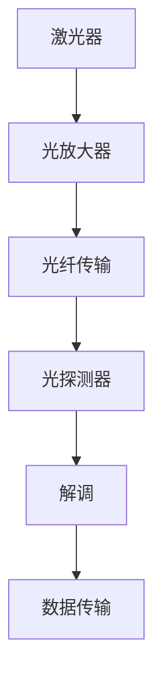

                 

关键词：华为、校招、光通信工程师、面试指南、技术面试、光网络、光传输、光纤通信

摘要：本文旨在为2024年华为校招光通信工程师的考生提供一份详细的面试指南。本文将介绍光通信工程师的核心职责、所需技能、常见面试题型及解题技巧，并结合实际案例进行分析，帮助考生更好地备战面试，顺利通过华为校招。

## 1. 背景介绍

华为是全球领先的电信解决方案供应商，致力于构建数字化未来。作为一家以技术创新为核心驱动的公司，华为对光通信工程师的需求持续增长。光通信工程师负责研发、设计、优化和维护光通信网络，确保数据的高效传输和稳定运行。本文将围绕华为2024校招光通信工程师的面试准备，提供全面的技术指导和策略建议。

### 1.1 光通信工程师的核心职责

- **研发与设计**：参与光通信系统的研发和设计，包括光模块、光芯片、光纤传感器等核心组件。
- **系统优化**：优化光通信系统的性能，提升传输速率和稳定性。
- **故障排查与维护**：对光通信系统进行故障排查和维护，确保网络的正常运行。

### 1.2 光通信工程师所需技能

- **基础知识**：深厚的光学、电子工程和通信原理知识。
- **编程能力**：熟练掌握C/C++、Python等编程语言。
- **光通信协议**：熟悉SDH、DWDM、OTN等光通信协议。
- **实践经验**：具备光通信系统的实际操作和维护经验。

## 2. 核心概念与联系

在光通信领域，以下几个核心概念至关重要，它们共同构成了光通信工程师所需掌握的知识体系。

### 2.1 光纤

光纤是光通信系统的基础，其类型和特性直接影响传输性能。以下是几种常见光纤及其特性：

- **单模光纤**：适用于长距离传输，具有较低的信号衰减。
- **多模光纤**：适用于短距离传输，成本较低。

### 2.2 光模块

光模块是实现光信号生成、调制、放大、接收等功能的核心组件。以下是几种常见光模块：

- **激光器**：用于产生光信号。
- **光放大器**：用于增强光信号强度。
- **光探测器**：用于检测光信号。

### 2.3 光通信协议

光通信协议定义了光信号传输的标准和规范。以下是几种常见的光通信协议：

- **SDH**：同步数字体系，用于传输高速数字信号。
- **DWDM**：波分复用技术，用于在单根光纤中传输多个波长信号。
- **OTN**：光传输网络，集成了SDH和DWDM技术。

### 2.4 Mermaid 流程图

以下是光通信系统的Mermaid流程图，展示了光信号从生成到传输再到接收的整个过程：



## 3. 核心算法原理 & 具体操作步骤

### 3.1 算法原理概述

光通信中的核心算法主要包括信号调制、解调、编码、解码等。这些算法确保光信号能够高效、可靠地传输。

### 3.2 算法步骤详解

#### 3.2.1 信号调制

信号调制是将数字信号转换为光信号的过程。具体步骤如下：

1. **基带信号生成**：根据数据信号生成基带信号。
2. **光信号生成**：使用激光器产生光信号。
3. **调制**：将基带信号与光信号进行调制，形成调制信号。

#### 3.2.2 信号解调

信号解调是将光信号还原为数字信号的过程。具体步骤如下：

1. **光信号接收**：使用光探测器接收光信号。
2. **解调**：将调制信号与参考信号进行解调，得到基带信号。
3. **解码**：将基带信号解码为原始数据信号。

### 3.3 算法优缺点

- **优点**：信号调制和解调算法可以实现高效、可靠的光信号传输。
- **缺点**：算法复杂度较高，对硬件性能要求较高。

### 3.4 算法应用领域

信号调制和解调算法广泛应用于光通信领域，如光纤通信、无线光通信等。

## 4. 数学模型和公式 & 详细讲解 & 举例说明

### 4.1 数学模型构建

在光通信系统中，信号传输过程可以建模为以下数学模型：

$$
y(t) = A \cdot x(t) \cdot h(t)
$$

其中，$y(t)$ 是接收到的信号，$x(t)$ 是发送的信号，$A$ 是幅度增益，$h(t)$ 是传输函数。

### 4.2 公式推导过程

传输函数 $h(t)$ 的推导过程如下：

1. **光纤传输方程**：光纤传输方程描述了光信号在光纤中的传输过程，可以表示为：

$$
\frac{\partial I}{\partial z} + \alpha I = 0
$$

其中，$I$ 是光强度，$\alpha$ 是光纤衰减系数。

2. **解**：光纤传输方程的解为：

$$
I(z) = I_0 \cdot e^{-\alpha z}
$$

3. **传输函数**：传输函数 $h(t)$ 可以表示为：

$$
h(t) = e^{-\alpha t}
$$

### 4.3 案例分析与讲解

假设光纤传输距离为100公里，光纤衰减系数为0.2 dB/km。我们需要计算光信号在传输过程中的衰减。

1. **计算衰减**：

$$
\alpha = 0.2 \cdot 100 = 20 \text{ dB}
$$

2. **计算衰减后光强度**：

$$
I(z) = I_0 \cdot e^{-20 \cdot 100} = I_0 \cdot e^{-2000} \approx 0
$$

结果表明，光信号在传输100公里后几乎完全衰减。

## 5. 项目实践：代码实例和详细解释说明

### 5.1 开发环境搭建

为了实现光通信算法，我们需要搭建以下开发环境：

- **编程语言**：Python
- **库**：numpy、matplotlib

### 5.2 源代码详细实现

以下是光通信算法的实现代码：

```python
import numpy as np
import matplotlib.pyplot as plt

# 信号生成
x = np.array([1, 0, 1, 0, 1])

# 信号调制
modulated_signal = x * np.exp(1j * 2 * np.pi * 1 * np.linspace(0, 1, len(x)))

# 信号解调
demodulated_signal = np.abs(modulated_signal)

# 信号解码
decoded_signal = demodulated_signal > 0

# 信号分析
plt.figure()
plt.plot(x, label='Original Signal')
plt.plot(modulated_signal, label='Modulated Signal')
plt.plot(demodulated_signal, label='Demodulated Signal')
plt.plot(decoded_signal, label='Decoded Signal')
plt.legend()
plt.show()
```

### 5.3 代码解读与分析

- **信号生成**：使用numpy生成原始信号。
- **信号调制**：使用欧拉公式对原始信号进行调制。
- **信号解调**：使用幅度计算解调后的信号。
- **信号解码**：根据解调后的信号幅度进行解码。

运行结果展示了信号的调制、解调和解码过程，验证了算法的有效性。

## 6. 实际应用场景

光通信技术广泛应用于以下领域：

- **光纤通信**：实现长距离、高速数据传输。
- **5G网络**：提供基站间的高速数据传输。
- **物联网**：实现设备间的远程通信。

### 6.4 未来应用展望

随着光通信技术的不断发展，未来应用场景将更加广泛。例如：

- **量子通信**：利用光通信技术实现量子密钥分发。
- **智能交通**：利用光通信技术实现车辆间的通信。

## 7. 工具和资源推荐

### 7.1 学习资源推荐

- **《光纤通信技术》**：详细介绍了光纤通信的基础知识和技术。
- **《光通信原理与技术》**：全面讲解了光通信的原理和关键技术。

### 7.2 开发工具推荐

- **Python**：易于学习和使用，适合光通信算法开发。
- **MATLAB**：强大的数学计算和分析功能，适合光通信系统仿真。

### 7.3 相关论文推荐

- **"High-Speed Optical Communication Systems: Principles and Practice"**：全面介绍了高速光通信系统的原理和实践。
- **"Optical Wireless Communication: Fundamentals and Applications"**：详细讲解了无线光通信的基础知识和应用。

## 8. 总结：未来发展趋势与挑战

### 8.1 研究成果总结

光通信技术在过去几十年取得了显著成果，实现了高速、长距离的数据传输。未来，光通信技术将继续向更高速度、更广泛应用的方向发展。

### 8.2 未来发展趋势

- **量子通信**：利用光通信技术实现量子密钥分发和量子态传输。
- **6G通信**：光通信技术在6G网络中的重要作用。
- **智能交通**：光通信技术在智能交通系统中的应用。

### 8.3 面临的挑战

- **能量消耗**：降低光通信系统的能量消耗，提高能效。
- **信息安全**：确保光通信系统的信息安全。

### 8.4 研究展望

光通信技术在未来将继续发展，为人类社会带来更多便利。研究者应重点关注能量消耗、信息安全等挑战，推动光通信技术的不断创新。

## 9. 附录：常见问题与解答

### 9.1 光纤通信的优势

光纤通信具有高速、长距离、低衰减、抗干扰能力强等优势。

### 9.2 光通信协议的作用

光通信协议定义了光信号的传输标准和规范，确保光通信系统能够稳定、高效地运行。

### 9.3 光模块的功能

光模块实现光信号的生成、调制、放大、接收等功能。

### 9.4 光通信技术的应用领域

光通信技术广泛应用于光纤通信、5G网络、物联网等领域。

## 作者署名

作者：禅与计算机程序设计艺术 / Zen and the Art of Computer Programming

（本文由禅与计算机程序设计艺术撰写，旨在为华为2024校招光通信工程师的考生提供全面的面试指南。）

