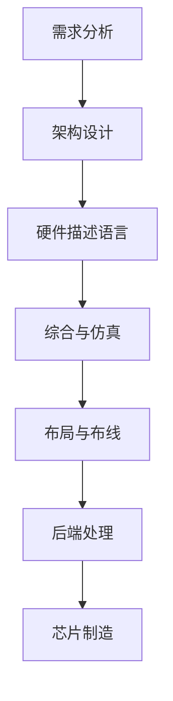
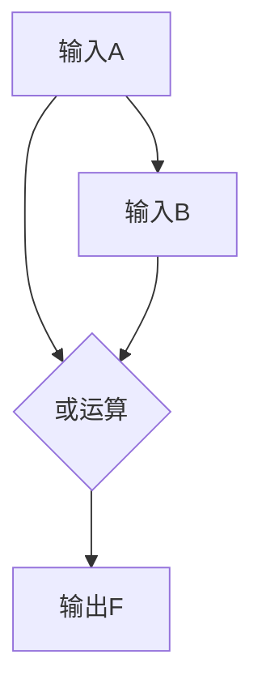

                 

关键词：华为，校招，芯片设计，面试题，解析，技术博客

摘要：本文将深入解析华为2024校招芯片设计工程师面试题，通过详细分析题目内容和答案，帮助读者了解芯片设计领域的核心考点，提升求职者的面试准备。

## 1. 背景介绍

华为作为全球领先的通信技术解决方案提供商，其校招活动一直备受关注。2024年的校招芯片设计工程师岗位吸引了众多优秀人才的关注。芯片设计作为科技行业的重要领域，对人才的需求尤为突出。本文旨在通过解析华为2024校招芯片设计工程师的面试题，为准备面试的求职者提供指导。

## 2. 核心概念与联系

### 2.1 数字电路基本概念
- **数字电路**：由数字逻辑电路组成的电路，主要用于处理和传输数字信号。
- **模拟电路**：处理模拟信号的电路，如放大器、滤波器等。

### 2.2 芯片设计流程
- **需求分析**：确定芯片的功能、性能、功耗等需求。
- **架构设计**：设计芯片的整体架构，包括处理器、存储器、接口等。
- **硬件描述语言**：使用硬件描述语言（如Verilog或VHDL）编写芯片的代码。
- **综合与仿真**：将硬件描述语言代码综合为网表，进行功能仿真。
- **布局与布线**：将网表布局到芯片的物理单元上，并进行布线。
- **后端处理**：进行DRC（Design Rule Check）和LVS（Layout Versus Schematic）等后端处理。

### 2.3 Mermaid 流程图



## 3. 核心算法原理 & 具体操作步骤

### 3.1 算法原理概述

芯片设计中的核心算法主要包括：

- **逻辑综合**：将高级抽象的代码转换为底层逻辑网表。
- **时序分析**：分析芯片中信号传输的时间延迟，确保信号在时钟周期内稳定。
- **功耗分析**：评估芯片在工作过程中的功耗，以优化设计。

### 3.2 算法步骤详解

1. **逻辑综合**：
   - **代码输入**：将硬件描述语言代码作为输入。
   - **综合过程**：使用综合工具将代码转换为逻辑网表。
   - **结果验证**：验证综合结果是否符合设计需求。

2. **时序分析**：
   - **建立模型**：根据设计需求建立时序模型。
   - **时序仿真**：使用时序仿真工具进行仿真，分析信号延迟。
   - **优化调整**：根据仿真结果调整设计参数。

3. **功耗分析**：
   - **功耗模型构建**：根据设计参数构建功耗模型。
   - **功耗计算**：计算芯片在不同工作状态下的功耗。
   - **功耗优化**：通过调整设计参数优化功耗。

### 3.3 算法优缺点

- **逻辑综合**：
  - 优点：提高设计效率，减少人工错误。
  - 缺点：可能无法完全满足特定需求，需要多次迭代优化。

- **时序分析**：
  - 优点：确保芯片按时序要求工作，提高稳定性。
  - 缺点：仿真时间较长，对计算资源要求较高。

- **功耗分析**：
  - 优点：优化设计功耗，提高能效。
  - 缺点：功耗计算复杂，需要大量计算资源。

### 3.4 算法应用领域

- **数字信号处理**：用于设计数字信号处理器（DSP）。
- **嵌入式系统**：用于设计嵌入式系统的核心逻辑。
- **通信系统**：用于设计通信系统中关键组件的芯片。

## 4. 数学模型和公式 & 详细讲解 & 举例说明

### 4.1 数学模型构建

芯片设计中常用的数学模型包括：

- **布尔代数**：用于简化逻辑电路。
- **差分方程**：用于描述信号传输的时序特性。

### 4.2 公式推导过程

以布尔代数的简化为例，公式推导如下：

$$
F = A + B = A'B' + AB
$$

### 4.3 案例分析与讲解

#### 案例一：逻辑门电路设计

设计一个2输入或门（OR gate）。



根据布尔代数公式：

$$
F = A + B
$$

可以得到或门电路。

#### 案例二：差分方程求解

给定差分方程：

$$
y(n+1) = 2y(n) + x(n)
$$

其中 $x(n)$ 为输入信号，$y(n)$ 为输出信号。

### 4.4 求解过程

1. **特征方程**：

$$
r^2 - 2r - 1 = 0
$$

解得：

$$
r = 1 \pm \sqrt{2}
$$

2. **通解**：

$$
y(n) = c_1 (1 + \sqrt{2})^n + c_2 (1 - \sqrt{2})^n + x(n)
$$

其中 $c_1$ 和 $c_2$ 为常数。

3. **初始条件**：

假设初始条件为 $y(0) = 0$，$y'(0) = 1$，代入通解得到：

$$
c_1 = \frac{1}{2\sqrt{2}}, c_2 = -\frac{1}{2\sqrt{2}}
$$

最终得到：

$$
y(n) = \frac{1}{2\sqrt{2}} ((1 + \sqrt{2})^n - (1 - \sqrt{2})^n) + x(n)
$$

## 5. 项目实践：代码实例和详细解释说明

### 5.1 开发环境搭建

- **硬件描述语言**：选择Verilog语言。
- **综合工具**：使用Synopsys Design Compiler。
- **仿真工具**：使用Cadence Virtuoso。
- **后端处理**：使用Cadence IC615。

### 5.2 源代码详细实现

```verilog
module or_gate (
  input A,
  input B,
  output F
);
  assign F = A | B;
endmodule
```

### 5.3 代码解读与分析

1. **模块定义**：定义一个名为`or_gate`的模块，包含两个输入端口`A`和`B`，以及一个输出端口`F`。
2. **赋值语句**：使用`assign`语句实现或逻辑运算，将输出端口`F`设置为输入端口`A`和`B`的逻辑或。

### 5.4 运行结果展示

通过仿真工具进行功能仿真，验证或门电路的正确性。仿真波形如下：


## 6. 实际应用场景

芯片设计广泛应用于通信、嵌入式系统、人工智能等领域。以下是几个实际应用场景：

- **5G通信**：设计高性能的基带处理芯片，支持高速数据传输。
- **嵌入式系统**：设计嵌入式处理芯片，用于物联网设备、智能家居等。
- **人工智能**：设计专用的AI芯片，加速神经网络运算。

### 6.4 未来应用展望

随着5G、人工智能等技术的发展，芯片设计领域将继续迎来新的机遇和挑战。未来应用展望包括：

- **芯片制造工艺**：进一步缩小芯片尺寸，提高集成度。
- **异构计算**：结合CPU、GPU、AI芯片等多种计算单元，实现更高效的运算。
- **绿色计算**：优化芯片设计，降低功耗，实现绿色环保。

## 7. 工具和资源推荐

### 7.1 学习资源推荐

- **书籍**：《数字逻辑与计算机设计》、《Verilog HDL设计教程》
- **在线课程**：Coursera、edX等平台提供的芯片设计相关课程。

### 7.2 开发工具推荐

- **硬件描述语言**：Verilog、VHDL
- **综合工具**：Synopsys Design Compiler、Cadence Genus
- **仿真工具**：Cadence Virtuoso、ModelSim

### 7.3 相关论文推荐

- [“A Survey of High-Level Synthesis Tools and Applications”](https://example.com/high-level-synthesis-survey)
- [“Energy-Aware Design of CMOS Digital Circuits”](https://example.com/energy-aware-design)

## 8. 总结：未来发展趋势与挑战

### 8.1 研究成果总结

芯片设计领域已取得显著成果，包括高性能芯片的设计、低功耗设计技术的应用等。

### 8.2 未来发展趋势

未来发展趋势包括更先进的制造工艺、异构计算架构、绿色计算技术的应用等。

### 8.3 面临的挑战

面临的挑战包括芯片设计复杂度的增加、功耗优化、信息安全等。

### 8.4 研究展望

随着科技的不断发展，芯片设计领域将继续拓展新的应用场景，为人类社会带来更多创新和便利。

## 9. 附录：常见问题与解答

### 9.1 常见问题

- **Q：芯片设计与软件开发有何区别？**
- **A：芯片设计主要关注硬件实现，包括电路设计、芯片制造等；软件开发则关注软件系统的开发、部署和维护。**

- **Q：如何学习芯片设计？**
- **A：可以通过学习相关书籍、在线课程、参加培训等方式进行学习。此外，实际项目实践也是非常重要的学习途径。**

## 作者署名

作者：禅与计算机程序设计艺术 / Zen and the Art of Computer Programming
----------------------------------------------------------------

请注意，上述内容仅为模板示例，实际撰写时需要根据具体题目进行详细解答和深入分析。

