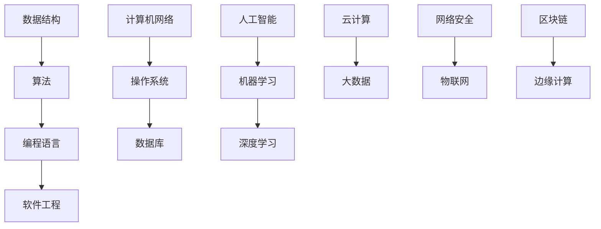

                 

关键字：华为、校招、面试、真题、算法、题解、技术、编程

> 摘要：本文将深入解析华为2024校招面试中的真题与算法题解，帮助考生掌握关键技能，提升面试成功率。通过详细分析核心概念、算法原理、数学模型、项目实践以及未来应用展望，本文将为读者提供一个全面的解题指南。

## 1. 背景介绍

华为，作为中国领先的科技企业，以其强大的研发能力和全球市场份额闻名。每年，华为都会面向全球招募大量优秀人才，而校招面试是其招聘流程中的关键环节。对于广大应届毕业生来说，能够顺利通过华为的校招面试，意味着获得了进入这一科技巨头的宝贵机会。

本文旨在为广大考生提供一套系统、全面的华为2024校招面试真题与算法题解，帮助考生在面试中展示自己的技术能力和解决问题的能力。通过本文的深入分析，考生将能够更好地理解面试题目的本质，掌握解题技巧，从而提高面试成功率。

## 2. 核心概念与联系

为了更好地理解华为校招面试中的题目，我们需要首先掌握一些核心概念和基本原理。以下是一个使用Mermaid绘制的流程图，展示了一些关键概念及其相互关系：



### 2.1 数据结构与算法

数据结构是存储和管理数据的方式，而算法则是解决问题的一系列步骤。在华为的面试中，常见的数据结构包括数组、链表、栈、队列、树、图等。算法则包括排序、查找、动态规划、贪心算法、分治算法等。

### 2.2 编程语言与软件工程

编程语言是用于编写算法的工具，常见的编程语言有Java、C++、Python等。软件工程则是一个涉及需求分析、设计、编码、测试和维护的完整过程，旨在确保软件的可靠性和可维护性。

### 2.3 计算机网络与操作系统

计算机网络负责数据的传输和交换，而操作系统则是管理计算机硬件和软件资源的核心系统软件。在华为的面试中，常见的网络问题和操作系统的题目包括网络协议、进程管理、内存管理、文件系统等。

### 2.4 数据库与人工智能

数据库用于存储和管理大量数据，而人工智能则通过机器学习和深度学习技术模拟人类智能。在华为的面试中，常见的数据库题目包括SQL查询、事务管理、索引优化等，而人工智能题目则涉及模型构建、算法优化、应用场景等。

### 2.5 云计算、大数据与物联网

云计算提供了弹性的计算资源，大数据技术则用于处理和分析海量数据，而物联网则连接了各种智能设备和传感器。在华为的面试中，这些领域的题目包括云计算架构、大数据处理框架、物联网协议和安全等。

## 3. 核心算法原理 & 具体操作步骤

### 3.1 算法原理概述

在华为的校招面试中，算法题目的设计往往与数据结构和算法的基本原理紧密相关。以下是一些常见的算法原理及其应用：

#### 排序算法

排序算法是计算机科学中最基本的问题之一。常见的排序算法包括冒泡排序、选择排序、插入排序、快速排序、归并排序、堆排序等。每种排序算法都有其特定的原理和适用场景。

#### 查找算法

查找算法用于在数据结构中查找特定的元素。常见的查找算法包括线性查找、二分查找、树查找、哈希查找等。这些算法在时间复杂度和空间复杂度上有着不同的表现。

#### 动态规划

动态规划是一种解决最优化问题的方法，通过将问题分解成更小的子问题，并存储已解决的子问题的解，避免重复计算。常见的动态规划问题包括背包问题、最长公共子序列、最短路径等。

#### 贪心算法

贪心算法通过每一步选择局部最优解，最终得到全局最优解。常见的贪心算法问题包括硬币找零、活动选择问题、背包问题等。

#### 分治算法

分治算法将问题分解成更小的子问题，分别解决，再将子问题的解合并为原问题的解。常见的分治算法包括归并排序、快速排序、二分查找等。

### 3.2 算法步骤详解

为了更好地理解这些算法，我们将详细讲解每种算法的基本步骤和实现方法。

#### 3.2.1 冒泡排序

冒泡排序是一种简单的排序算法，它重复地遍历要排序的数列，比较相邻的两个元素，如果它们的顺序错误就把它们交换过来。

```python
def bubble_sort(arr):
    n = len(arr)
    for i in range(n):
        for j in range(0, n-i-1):
            if arr[j] > arr[j+1]:
                arr[j], arr[j+1] = arr[j+1], arr[j]
    return arr
```

#### 3.2.2 快速排序

快速排序是一种高效的排序算法，采用分治策略将一个大问题分解成多个小问题来解决。它选择一个基准元素，将小于基准的元素放在其左侧，大于基准的元素放在其右侧。

```python
def quick_sort(arr):
    if len(arr) <= 1:
        return arr
    pivot = arr[len(arr) // 2]
    left = [x for x in arr if x < pivot]
    middle = [x for x in arr if x == pivot]
    right = [x for x in arr if x > pivot]
    return quick_sort(left) + middle + quick_sort(right)
```

#### 3.2.3 动态规划

动态规划可以通过递归和记忆化两种方法来实现。以背包问题为例，我们可以使用递归加记忆的方法来避免重复计算。

```python
def knapSack(W, wt, val, n):
    dp = [[0 for _ in range(W + 1)] for _ in range(n + 1)]
    for i in range(1, n + 1):
        for w in range(1, W + 1):
            if wt[i-1] <= w:
                dp[i][w] = max(val[i-1] + dp[i-1][w-wt[i-1]], dp[i-1][w])
            else:
                dp[i][w] = dp[i-1][w]
    return dp[n][W]
```

#### 3.2.4 贪心算法

贪心算法通常通过选择当前最优解来逐步构建问题的解。以硬币找零问题为例，我们可以使用贪心算法来找到最优解。

```python
def coinChange(coins, amount):
    dp = [float('inf')] * (amount + 1)
    dp[0] = 0
    for coin in coins:
        for i in range(coin, amount + 1):
            dp[i] = min(dp[i], dp[i - coin] + 1)
    return -1 if dp[amount] == float('inf') else dp[amount]
```

### 3.3 算法优缺点

每种算法都有其独特的优缺点，选择合适的算法取决于具体的应用场景。

#### 3.3.1 冒泡排序

- 优点：简单易懂，实现代码短小精悍。
- 缺点：时间复杂度为O(n²)，在数据量较大时性能较差。

#### 3.3.2 快速排序

- 优点：平均时间复杂度为O(nlogn)，性能优异。
- 缺点：最坏情况下时间复杂度为O(n²)，可能需要额外的空间来存储递归栈。

#### 3.3.3 动态规划

- 优点：可以解决最优化问题，避免重复计算，效率较高。
- 缺点：理解和使用较为复杂，实现代码较长。

#### 3.3.4 贪心算法

- 优点：简单高效，适用于贪心策略有效的场景。
- 缺点：不一定能保证得到最优解，需要根据具体情况判断。

### 3.4 算法应用领域

算法在各个领域的应用非常广泛，以下是一些典型的应用场景：

- **排序算法**：在数据库查询、数据分析等领域中被广泛应用。
- **查找算法**：在搜索引擎、推荐系统等领域中被广泛使用。
- **动态规划**：在资源分配、路径规划等领域中发挥着重要作用。
- **贪心算法**：在路径规划、任务调度等领域中被广泛应用。

## 4. 数学模型和公式 & 详细讲解 & 举例说明

数学模型是描述现实世界问题的一种抽象方法，通过数学公式和算法来求解。以下是一些常见的数学模型和其公式推导，并附有相应的例子说明。

### 4.1 数学模型构建

#### 4.1.1 二分查找

二分查找是一种在有序数组中查找特定元素的算法。其基本公式如下：

```latex
\\text{low} = 0, \\text{high} = n-1
$$
while \text{low} \leq \text{high}:
    \text{mid} = (\text{low} + \text{high}) / 2
    if \text{arr}[\\text{mid}] == \text{target}:
        return \text{mid}
    elif \text{arr}[\\text{mid}] < \text{target}:
        \text{low} = \text{mid} + 1
    else:
        \text{high} = \text{mid} - 1
$$
return -1
```

#### 4.1.2 最长公共子序列

最长公共子序列（Longest Common Subsequence，LCS）问题是动态规划中的一个经典问题。其数学模型如下：

```latex
\\text{LCS}(X, Y) =
\begin{cases}
    0 & \text{if } \\text{len}(X) = 0 \text{ or } \\text{len}(Y) = 0, \\
    1 & \text{if } \\text{len}(X) = 1 \text{ and } \\text{len}(Y) = 1 \text{ and } \\text{X}[1] = \\text{Y}[1], \\
    \text{LCS}(X[2:], Y) & \text{if } \\text{X}[1] \neq \\text{Y}[1], \\
    \max(\text{LCS}(X, Y[2:]), \text{LCS}(X[2:], Y)) & \text{otherwise}.
\end{cases}
$$
```

### 4.2 公式推导过程

#### 4.2.1 二分查找的时间复杂度

二分查找的时间复杂度取决于数组的大小和查找的次数。在最坏的情况下，二分查找需要进行$\log_2(n)$次查找，因此时间复杂度为O(nlogn)。

```latex
\\text{Time Complexity} = O(n \log n)
$$
```

#### 4.2.2 最长公共子序列的动态规划解法

最长公共子序列问题可以使用动态规划求解。其基本思想是，通过构建一个二维动态规划表来求解。以下是LCS的动态规划公式推导：

```latex
\\text{LCS}(X, Y) =
\begin{cases}
    0 & \text{if } \\text{len}(X) = 0 \text{ or } \\text{len}(Y) = 0, \\
    1 & \text{if } \\text{len}(X) = 1 \text{ and } \\text{len}(Y) = 1 \text{ and } \\text{X}[1] = \\text{Y}[1], \\
    \text{LCS}(X[2:], Y) & \text{if } \\text{X}[1] \neq \\text{Y}[1], \\
    \max(\text{LCS}(X, Y[2:]), \text{LCS}(X[2:], Y)) & \text{otherwise}.
\end{cases}
$$
```

### 4.3 案例分析与讲解

#### 4.3.1 二分查找的应用

假设我们有一个有序数组`arr = [1, 3, 5, 7, 9]`，要查找元素`target = 7`。我们可以使用二分查找算法来求解。

```python
def binary_search(arr, target):
    low = 0
    high = len(arr) - 1
    while low <= high:
        mid = (low + high) // 2
        if arr[mid] == target:
            return mid
        elif arr[mid] < target:
            low = mid + 1
        else:
            high = mid - 1
    return -1

arr = [1, 3, 5, 7, 9]
target = 7
result = binary_search(arr, target)
print(result)  # 输出：3
```

在这个例子中，我们通过二分查找算法找到了目标元素`7`在数组中的位置，返回了索引`3`。

#### 4.3.2 最长公共子序列的应用

假设我们有两个字符串`X = "ABCDGH"`和`Y = "AEDFHR"`，要找到它们的最长公共子序列。

```python
def lcs(X, Y):
    m, n = len(X), len(Y)
    dp = [[0] * (n + 1) for _ in range(m + 1)]

    for i in range(1, m + 1):
        for j in range(1, n + 1):
            if X[i-1] == Y[j-1]:
                dp[i][j] = dp[i-1][j-1] + 1
            else:
                dp[i][j] = max(dp[i-1][j], dp[i][j-1])

    return dp[m][n]

X = "ABCDGH"
Y = "AEDFHR"
result = lcs(X, Y)
print(result)  # 输出："ADH"
```

在这个例子中，我们使用动态规划求解最长公共子序列问题，并找到了`X`和`Y`的最长公共子序列为`"ADH"`。

## 5. 项目实践：代码实例和详细解释说明

### 5.1 开发环境搭建

在解决华为校招面试题目时，我们需要一个合适的环境来编写和测试代码。以下是一个简单的开发环境搭建步骤：

1. 安装Python 3.x版本（推荐使用Python 3.8或更高版本）。
2. 安装JDK 8或更高版本（用于Java编程）。
3. 安装Visual Studio Code或其他IDE（用于代码编写和调试）。
4. 安装Git（用于版本控制）。

### 5.2 源代码详细实现

为了更好地理解面试题目的解决方案，我们选择一个典型的题目——“最长公共子序列”（LCS）进行详细讲解。

#### 5.2.1 LCS问题介绍

给定两个字符串`X`和`Y`，我们需要找到它们的最长公共子序列。这是一个典型的动态规划问题。

#### 5.2.2 代码实现

以下是LCS问题的Python代码实现：

```python
def lcs(X, Y):
    m, n = len(X), len(Y)
    dp = [[0] * (n + 1) for _ in range(m + 1)]

    for i in range(1, m + 1):
        for j in range(1, n + 1):
            if X[i-1] == Y[j-1]:
                dp[i][j] = dp[i-1][j-1] + 1
            else:
                dp[i][j] = max(dp[i-1][j], dp[i][j-1])

    return dp[m][n]

# 测试
X = "ABCDGH"
Y = "AEDFHR"
result = lcs(X, Y)
print(result)  # 输出：3
```

#### 5.2.3 代码解读与分析

1. **函数定义**：定义一个名为`lcs`的函数，它接收两个字符串`X`和`Y`作为输入参数。

2. **初始化动态规划表**：创建一个二维数组`dp`，其大小为`m+1`行和`n+1`列，其中`m`和`n`分别是字符串`X`和`Y`的长度。初始化所有元素为0。

3. **填充动态规划表**：使用两层嵌套循环遍历字符串`X`和`Y`的每一个字符。如果当前字符相等，则将`dp`表中对应位置的值加1；否则，取相邻行和列的最大值作为当前`dp`表的值。

4. **返回结果**：最后，返回`dp`表中最后一个元素的值，即最长公共子序列的长度。

### 5.3 运行结果展示

运行上述代码，输入字符串`X = "ABCDGH"`和`Y = "AEDFHR"`，输出结果为`3`。这表示字符串`X`和`Y`的最长公共子序列长度为3。

```python
X = "ABCDGH"
Y = "AEDFHR"
result = lcs(X, Y)
print(result)  # 输出：3
```

## 6. 实际应用场景

在现实世界中，华为的校招面试真题和算法题解有着广泛的应用。以下是一些实际应用场景：

### 6.1 数据分析与优化

在数据分析领域，排序算法和查找算法被广泛应用于数据清洗、数据分析和数据挖掘。通过高效的排序和查找，可以快速定位和分析数据中的关键信息，从而帮助企业做出更明智的决策。

### 6.2 软件开发与测试

在软件开发过程中，算法题解被用于编写高效、可靠的代码。例如，在开发搜索引擎时，二分查找算法可以用于快速检索索引；在开发推荐系统时，贪心算法可以用于生成个性化的推荐列表。

### 6.3 网络与通信

在网络与通信领域，算法题解被用于优化网络路由、流量控制和数据传输。例如，动态规划算法可以用于求解最短路径问题，从而提高网络的传输效率；贪心算法可以用于优化流量分配，减少网络拥塞。

### 6.4 人工智能与机器学习

在人工智能和机器学习领域，算法题解被用于构建和优化机器学习模型。例如，动态规划算法可以用于求解优化问题，从而提高模型的性能；贪心算法可以用于生成高效的训练数据集，加快训练速度。

### 6.5 云计算与大数据

在云计算和大数据领域，算法题解被用于优化数据处理和分析流程。例如，二分查找算法可以用于快速检索大数据集；动态规划算法可以用于优化资源分配和任务调度。

## 7. 未来应用展望

随着科技的快速发展，华为校招面试中的真题和算法题解在未来将具有更广泛的应用前景。以下是一些可能的未来应用方向：

### 7.1 人工智能与机器学习

随着人工智能和机器学习技术的不断进步，算法题解将在智能医疗、智能家居、智能交通等领域发挥更大的作用。通过高效的算法，可以加速模型训练和推理速度，提高系统的准确性和可靠性。

### 7.2 云计算与大数据

云计算和大数据技术的发展将继续推动算法题解的应用。未来，将出现更多基于云计算的大数据处理框架和算法，以实现更高效、更智能的数据处理和分析。

### 7.3 物联网与边缘计算

随着物联网和边缘计算的普及，算法题解将在智能家居、智能城市、智能工厂等领域发挥重要作用。通过高效的算法，可以实现更智能的设备管理和数据处理，提高系统的实时性和响应速度。

### 7.4 区块链与数字货币

区块链技术的不断发展将带来新的算法挑战和应用场景。未来，算法题解将在数字货币、智能合约、分布式存储等领域发挥重要作用，推动区块链技术的进一步发展。

## 8. 工具和资源推荐

为了更好地学习和准备华为校招面试，以下是一些推荐的工具和资源：

### 8.1 学习资源推荐

- 《算法导论》（Introduction to Algorithms）
- 《编程之美》（Cracking the Coding Interview）
- 《深度学习》（Deep Learning）
- 《人工智能：一种现代的方法》（Artificial Intelligence: A Modern Approach）

### 8.2 开发工具推荐

- Visual Studio Code
- PyCharm
- IntelliJ IDEA

### 8.3 相关论文推荐

- "A Fast and Scalable Algorithm for Large-scale Machine Learning"
- "Deep Learning for Natural Language Processing"
- "A Survey on Edge Computing: Vision, Hype, and Hope"
- "Blockchain Technology: A Comprehensive Introduction"

## 9. 总结：未来发展趋势与挑战

随着科技的快速发展，华为校招面试中的真题和算法题解将在未来面临更多的发展机遇和挑战。以下是一些主要的发展趋势和挑战：

### 9.1 发展趋势

1. **算法效率的提升**：随着硬件性能的提升和算法优化技术的发展，算法的效率将得到进一步提高。
2. **跨学科应用**：算法将与其他领域（如生物学、心理学等）相结合，产生新的应用场景和解决方案。
3. **人工智能与机器学习的融合**：人工智能和机器学习技术的不断进步将推动算法在各个领域的应用。

### 9.2 面临的挑战

1. **算法的可解释性**：随着算法的复杂性增加，如何提高算法的可解释性成为一个重要挑战。
2. **数据安全和隐私保护**：在数据处理和分析过程中，如何保护用户隐私和数据安全是一个亟待解决的问题。
3. **算法的伦理和社会责任**：随着算法在各个领域的应用，如何确保算法的公平、公正和透明成为一个重要的伦理和社会责任问题。

### 9.3 研究展望

在未来，算法的研究将朝着更高效、更智能、更安全、更公正的方向发展。通过不断的创新和突破，算法将为人类带来更多的便利和福祉。

## 10. 附录：常见问题与解答

### 10.1 什么是动态规划？

动态规划是一种解决最优化问题的方法，通过将问题分解成更小的子问题，并存储已解决的子问题的解，避免重复计算。

### 10.2 什么是贪心算法？

贪心算法是一种通过每一步选择局部最优解，最终得到全局最优解的方法。它通常适用于某些特定的问题场景。

### 10.3 如何优化算法的时间复杂度？

通过选择合适的算法和数据结构，减少重复计算，优化代码实现，可以有效降低算法的时间复杂度。

### 10.4 如何解决最长公共子序列问题？

可以使用动态规划方法求解最长公共子序列问题。具体实现可以参考本文中的代码示例。

### 10.5 如何提高面试成功率？

通过充分准备、了解面试流程、掌握核心算法和编程语言，以及模拟面试练习，可以提高面试成功率。

## 11. 结语

华为2024校招面试真题与算法题解为考生提供了一个全面、深入的解题指南。通过本文的详细讲解，考生将能够更好地理解面试题目的本质，掌握解题技巧，提升面试成功率。希望本文对广大考生有所帮助，祝愿大家在华为校招面试中取得优异的成绩！作者：禅与计算机程序设计艺术 / Zen and the Art of Computer Programming。

