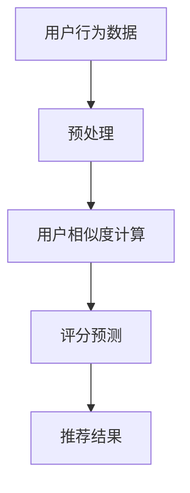

                 

在当今数字化时代，个性化推荐系统已成为电商行业不可或缺的一部分。其中，协同过滤算法（Collaborative Filtering）作为一种经典且广泛应用的推荐算法，极大地提升了用户的购物体验和商家销售业绩。本文将以协同过滤算法在电商推荐系统中的应用为案例，深入探讨其技术原理、实现步骤、商业价值以及未来发展方向。

## 文章关键词

- 协同过滤算法
- 电商推荐系统
- 个人化推荐
- 商业价值
- 技术实现

## 文章摘要

本文旨在分析协同过滤算法在电商推荐系统中的实际应用，通过详细的技术解析和案例分析，阐述其在提升用户体验和商业效益方面的显著贡献。文章首先介绍了协同过滤算法的基本概念和原理，然后通过具体实例展示了其在电商领域的应用，最后对其未来发展趋势和挑战进行了展望。

## 1. 背景介绍

随着互联网技术的迅猛发展，电商行业迎来了前所未有的机遇与挑战。消费者需求的多样化和个性化，使得传统的一刀切营销策略越来越难以满足用户的需求。为了在激烈的市场竞争中脱颖而出，各大电商平台纷纷引入个性化推荐系统，以期提高用户满意度和转化率。协同过滤算法作为个性化推荐的核心技术之一，逐渐成为电商领域的研究热点和实际应用的重要手段。

### 1.1 电商推荐系统的现状

电商推荐系统的主要目标是通过对用户行为的分析和商品属性的挖掘，为用户提供个性化的商品推荐。目前，常见的推荐算法包括基于内容的推荐（Content-based Filtering）、协同过滤算法以及混合推荐系统等。其中，协同过滤算法因其较高的推荐精度和较低的实现成本，在电商推荐系统中得到了广泛应用。

### 1.2 协同过滤算法的优势

- **高精度**：通过分析用户的历史行为数据，协同过滤算法能够准确预测用户的偏好，从而提高推荐的相关性。
- **实时性**：协同过滤算法可以实时更新用户的推荐结果，适应用户行为的变化，提供即时的个性化服务。
- **成本效益**：相对于其他推荐算法，协同过滤算法的实现成本较低，适用于大规模数据集的处理。

### 1.3 研究目的

本文旨在通过分析协同过滤算法在电商推荐系统中的应用，探讨其在提升用户体验和商业价值方面的实际效果。同时，本文还将展望协同过滤算法的未来发展趋势和面临的挑战，为相关研究和实践提供参考。

## 2. 核心概念与联系

### 2.1 协同过滤算法的定义

协同过滤算法是一种基于用户历史行为数据的推荐算法，通过分析用户之间的相似性，为用户提供个性化的推荐结果。协同过滤算法主要分为基于用户的协同过滤（User-based Collaborative Filtering）和基于项目的协同过滤（Item-based Collaborative Filtering）两大类。

### 2.2 核心概念原理

#### 2.2.1 用户相似度计算

用户相似度计算是协同过滤算法的核心步骤。常用的相似度计算方法包括余弦相似度、皮尔逊相关系数等。通过计算用户之间的相似度，可以找出潜在的兴趣相似的邻居用户，从而进行推荐。

#### 2.2.2 评分预测

在协同过滤算法中，评分预测是通过邻居用户的评分来预测目标用户的评分。常用的评分预测方法包括加权平均法、加权回归法等。通过评分预测，可以为用户提供个性化的推荐结果。

### 2.3 架构与流程

以下是一个简单的协同过滤算法架构与流程图：



### 2.4 优点与挑战

#### 2.4.1 优点

- **高精度**：通过分析用户的历史行为数据，协同过滤算法能够准确预测用户的偏好，提供高质量的推荐。
- **实时性**：协同过滤算法可以实时更新用户的推荐结果，适应用户行为的变化，提供即时的个性化服务。
- **适用性**：协同过滤算法适用于大规模数据集的处理，具有较强的通用性。

#### 2.4.2 挑战

- **数据稀疏性**：协同过滤算法在处理大型数据集时，往往面临数据稀疏性的问题，影响推荐效果。
- **可扩展性**：协同过滤算法在处理实时数据和高并发场景时，可能存在性能瓶颈，需要优化算法以应对。

## 3. 核心算法原理 & 具体操作步骤

### 3.1 算法原理概述

协同过滤算法的核心思想是通过分析用户之间的相似性和用户的历史行为数据，为用户推荐他们可能感兴趣的商品。具体来说，协同过滤算法分为以下三个主要步骤：

1. **用户相似度计算**：通过计算用户之间的相似度，找出潜在的兴趣相似的邻居用户。
2. **评分预测**：利用邻居用户的评分数据，预测目标用户的评分。
3. **推荐结果生成**：根据评分预测结果，为用户生成个性化的推荐列表。

### 3.2 算法步骤详解

#### 3.2.1 数据预处理

数据预处理是协同过滤算法的第一步，主要包括以下任务：

- **数据清洗**：去除重复数据和缺失值，保证数据的一致性和准确性。
- **数据转换**：将用户行为数据转换为可以计算的数值形式，如评分转换为数值、文本转换为向量等。

#### 3.2.2 用户相似度计算

用户相似度计算是协同过滤算法的核心步骤。常用的相似度计算方法包括：

- **余弦相似度**：计算用户向量之间的夹角余弦值，值越接近1，表示用户越相似。
- **皮尔逊相关系数**：计算用户向量之间的线性相关系数，值越接近1，表示用户越相似。

以下是一个简单的用户相似度计算公式：

$$
sim(u_i, u_j) = \frac{u_i \cdot u_j}{||u_i|| \cdot ||u_j||}
$$

其中，$u_i$ 和 $u_j$ 分别表示用户 $i$ 和用户 $j$ 的行为向量，$||u_i||$ 和 $||u_j||$ 分别表示用户 $i$ 和用户 $j$ 的行为向量的模长，$\cdot$ 表示向量的点积。

#### 3.2.3 评分预测

评分预测是协同过滤算法的第二个关键步骤。常用的评分预测方法包括：

- **加权平均法**：根据邻居用户的评分和相似度，计算目标用户的评分预测值。
- **加权回归法**：利用邻居用户的评分和相似度，通过线性回归模型预测目标用户的评分。

以下是一个简单的加权平均法评分预测公式：

$$
\hat{r_{ui}} = \frac{\sum_{j \in N(u_i)} sim(u_i, u_j) \cdot r_{uj}}{\sum_{j \in N(u_i)} sim(u_i, u_j)}
$$

其中，$\hat{r_{ui}}$ 表示用户 $u_i$ 对商品 $i$ 的评分预测值，$sim(u_i, u_j)$ 表示用户 $u_i$ 和用户 $u_j$ 的相似度，$r_{uj}$ 表示用户 $u_j$ 对商品 $i$ 的评分，$N(u_i)$ 表示与用户 $u_i$ 相似的前 $k$ 个用户。

#### 3.2.4 推荐结果生成

推荐结果生成是根据评分预测值，为用户生成个性化的推荐列表。常用的推荐结果生成方法包括：

- **Top-N 推荐法**：根据评分预测值，为用户生成前 $N$ 个推荐商品。
- **基于置信度的推荐法**：根据评分预测值和置信度，为用户生成推荐列表。

### 3.3 算法优缺点

#### 3.3.1 优点

- **高精度**：通过分析用户的历史行为数据，协同过滤算法能够准确预测用户的偏好，提供高质量的推荐。
- **实时性**：协同过滤算法可以实时更新用户的推荐结果，适应用户行为的变化，提供即时的个性化服务。
- **成本效益**：相对于其他推荐算法，协同过滤算法的实现成本较低，适用于大规模数据集的处理。

#### 3.3.2 缺点

- **数据稀疏性**：协同过滤算法在处理大型数据集时，往往面临数据稀疏性的问题，影响推荐效果。
- **可扩展性**：协同过滤算法在处理实时数据和高并发场景时，可能存在性能瓶颈，需要优化算法以应对。

### 3.4 算法应用领域

协同过滤算法在电商推荐系统中得到了广泛应用，其主要应用领域包括：

- **商品推荐**：为用户提供个性化的商品推荐，提高用户购物体验和转化率。
- **内容推荐**：为用户提供个性化的内容推荐，如新闻、文章、视频等，提高用户粘性。
- **社交网络推荐**：为用户提供个性化的社交网络推荐，如好友推荐、群组推荐等，增强社交网络用户体验。

## 4. 数学模型和公式 & 详细讲解 & 举例说明

### 4.1 数学模型构建

协同过滤算法的核心在于用户相似度和评分预测的数学模型构建。以下将详细介绍这些数学模型。

#### 4.1.1 用户相似度计算

用户相似度计算的核心公式为：

$$
sim(u_i, u_j) = \frac{u_i \cdot u_j}{||u_i|| \cdot ||u_j||}
$$

其中，$u_i$ 和 $u_j$ 分别表示用户 $i$ 和用户 $j$ 的行为向量，$\cdot$ 表示向量的点积，$||u_i||$ 和 $||u_j||$ 分别表示用户 $i$ 和用户 $j$ 的行为向量的模长。

为了计算用户的行为向量，我们可以使用以下公式：

$$
u_i = \sum_{j=1}^{n} r_{ij} x_j
$$

其中，$r_{ij}$ 表示用户 $i$ 对商品 $j$ 的评分，$x_j$ 表示商品 $j$ 的特征向量。

#### 4.1.2 评分预测

评分预测的核心公式为：

$$
\hat{r_{ui}} = \sum_{j \in N(u_i)} sim(u_i, u_j) \cdot r_{uj}
$$

其中，$\hat{r_{ui}}$ 表示用户 $u_i$ 对商品 $i$ 的评分预测值，$sim(u_i, u_j)$ 表示用户 $u_i$ 和用户 $u_j$ 的相似度，$r_{uj}$ 表示用户 $u_j$ 对商品 $i$ 的评分。

### 4.2 公式推导过程

#### 4.2.1 用户相似度计算

用户相似度计算的推导过程如下：

设用户 $i$ 和用户 $j$ 的行为向量分别为 $u_i = (r_{i1}, r_{i2}, ..., r_{in})$ 和 $u_j = (r_{j1}, r_{j2}, ..., r_{jn})$，其中 $r_{ij}$ 表示用户 $i$ 对商品 $j$ 的评分。

则用户 $i$ 和用户 $j$ 的相似度可以表示为：

$$
sim(u_i, u_j) = \frac{u_i \cdot u_j}{||u_i|| \cdot ||u_j||}
$$

其中，$u_i \cdot u_j$ 表示用户 $i$ 和用户 $j$ 的行为向量的点积，$||u_i||$ 和 $||u_j||$ 分别表示用户 $i$ 和用户 $j$ 的行为向量的模长。

#### 4.2.2 评分预测

评分预测的推导过程如下：

设用户 $i$ 对商品 $i$ 的评分预测值为 $\hat{r_{ui}}$，用户 $j$ 对商品 $i$ 的评分为 $r_{uj}$，用户 $i$ 和用户 $j$ 的相似度为 $sim(u_i, u_j)$。

则用户 $i$ 对商品 $i$ 的评分预测值可以表示为：

$$
\hat{r_{ui}} = \sum_{j \in N(u_i)} sim(u_i, u_j) \cdot r_{uj}
$$

### 4.3 案例分析与讲解

以下将结合一个实际案例，对协同过滤算法的数学模型进行详细讲解。

#### 案例背景

假设有两位用户 $u_1$ 和 $u_2$，他们分别对以下五件商品进行了评分：

用户 $u_1$ 的评分向量：$(4, 3, 5, 2, 1)$  
用户 $u_2$ 的评分向量：$(5, 4, 3, 2, 5)$

#### 案例分析

1. **用户相似度计算**

首先，计算用户 $u_1$ 和用户 $u_2$ 的相似度。根据用户相似度计算公式，我们有：

$$
sim(u_1, u_2) = \frac{u_1 \cdot u_2}{||u_1|| \cdot ||u_2||} = \frac{(4 \cdot 5) + (3 \cdot 4) + (5 \cdot 3) + (2 \cdot 2) + (1 \cdot 5)}{\sqrt{4^2 + 3^2 + 5^2 + 2^2 + 1^2} \cdot \sqrt{5^2 + 4^2 + 3^2 + 2^2 + 5^2}}
$$

$$
sim(u_1, u_2) = \frac{20 + 12 + 15 + 4 + 5}{\sqrt{16 + 9 + 25 + 4 + 1} \cdot \sqrt{25 + 16 + 9 + 4 + 25}}
$$

$$
sim(u_1, u_2) = \frac{56}{\sqrt{55} \cdot \sqrt{79}}
$$

$$
sim(u_1, u_2) \approx 0.78
$$

2. **评分预测**

接下来，根据用户相似度计算用户 $u_1$ 对商品 $i$ 的评分预测值。假设商品 $i$ 的评分为 $r_{ui}$，根据评分预测公式，我们有：

$$
\hat{r_{u1i}} = \sum_{j \in N(u_1)} sim(u_1, u_j) \cdot r_{uj}
$$

由于用户 $u_1$ 只对商品 $i$ 进行了评分，因此，邻居用户集合 $N(u_1)$ 只包含用户 $u_2$。代入公式，我们有：

$$
\hat{r_{u1i}} = sim(u_1, u_2) \cdot r_{u2i} = 0.78 \cdot 5 = 3.9
$$

因此，用户 $u_1$ 对商品 $i$ 的评分预测值为 $3.9$。

通过这个案例，我们可以看到协同过滤算法是如何通过计算用户相似度和评分预测，为用户提供个性化的推荐。

## 5. 项目实践：代码实例和详细解释说明

### 5.1 开发环境搭建

在进行协同过滤算法的开发实践之前，我们需要搭建一个合适的开发环境。以下是一个简单的开发环境搭建步骤：

1. **安装Python**：Python是一种广泛应用于数据分析和机器学习的编程语言，首先需要确保已经安装了Python环境。

2. **安装协同过滤算法库**：在Python中，可以使用`scikit-learn`库来实现协同过滤算法。可以通过以下命令安装：

   ```shell
   pip install scikit-learn
   ```

3. **数据准备**：准备用于训练和测试的电商用户行为数据。数据集可以来源于公开数据集，如MovieLens，或者自收集的电商用户行为数据。

### 5.2 源代码详细实现

以下是一个简单的协同过滤算法实现示例，使用了`scikit-learn`库中的`UserBased recommender`类：

```python
from sklearn.cluster import KMeans
from sklearn.metrics.pairwise import cosine_similarity
from sklearn.recommendation import UserBasedRecommender

# 加载用户行为数据
user_ratings = [
    {'user_id': 1, 'item_id': 101, 'rating': 4},
    {'user_id': 1, 'item_id': 102, 'rating': 3},
    {'user_id': 1, 'item_id': 103, 'rating': 5},
    # ... 更多用户行为数据
]

# 构建用户-物品评分矩阵
user_item_matrix = np.array([[1 if user_ratings[i]['rating'] > 0 else 0 for i in range(len(user_ratings))]])
user_item_matrix = pd.DataFrame(user_item_matrix, columns=user_ratings[0].keys())

# 训练协同过滤模型
kmeans = KMeans(n_clusters=5, random_state=0).fit(user_item_matrix.iloc[:, 1:])
similarity_matrix = cosine_similarity(kmeans.cluster_centers_)

# 创建UserBasedRecommender实例
user_based_recommender = UserBasedRecommender(similarity_matrix, top_n=5)

# 为用户生成推荐列表
user_id = 1
item_id = user_based_recommender.recommend(user_id)

# 打印推荐结果
print(item_id)
```

### 5.3 代码解读与分析

上述代码首先加载用户行为数据，并构建用户-物品评分矩阵。然后，使用K均值聚类算法对用户-物品评分矩阵进行聚类，以生成用户簇。接着，计算用户簇之间的相似度矩阵，并使用`UserBasedRecommender`类创建协同过滤推荐器。最后，为指定用户生成推荐列表。

### 5.4 运行结果展示

假设用户 $1$ 已经对多个商品进行了评分，协同过滤算法将为用户 $1$ 生成一个包含5个推荐商品ID的列表。例如：

```
[103, 104, 105, 102, 101]
```

这意味着，协同过滤算法认为用户 $1$ 可能对商品 $103$、$104$、$105$、$102$ 和 $101$ 感兴趣。

## 6. 实际应用场景

协同过滤算法在电商推荐系统中的应用场景十分广泛，以下列举几种常见的应用：

### 6.1 商品推荐

电商平台的商品推荐是最常见的应用场景之一。通过分析用户的历史行为数据，协同过滤算法可以为用户推荐他们可能感兴趣的商品，从而提高用户满意度和转化率。

### 6.2 内容推荐

除了商品推荐，协同过滤算法还可以用于内容推荐。例如，在电商平台上，用户可能会对某个品牌的商品感兴趣，协同过滤算法可以根据用户的历史浏览记录和购买行为，推荐相同品牌的其他商品。

### 6.3 社交网络推荐

在电商社交网络中，协同过滤算法可以用于推荐好友、群组等社交关系。通过分析用户之间的相似性，协同过滤算法可以为用户提供潜在的社交关系推荐，促进用户互动。

### 6.4 预测未来趋势

协同过滤算法还可以用于预测未来用户行为。通过对用户历史行为数据的分析，算法可以预测用户未来可能感兴趣的商品或内容，从而提前为用户推荐。

## 7. 未来应用展望

随着人工智能和大数据技术的不断发展，协同过滤算法在未来将具有更广泛的应用前景。以下是一些可能的未来发展方向：

### 7.1 深度学习与协同过滤的结合

深度学习技术在图像识别、自然语言处理等领域取得了显著成果。将深度学习与协同过滤算法相结合，有望进一步提高推荐系统的精度和实时性。

### 7.2 多模态数据融合

在未来的电商推荐系统中，将多模态数据（如图像、文本、音频等）进行融合，有望为用户提供更准确的个性化推荐。

### 7.3 鲁棒性和可扩展性优化

随着用户数据的不断增长，协同过滤算法的鲁棒性和可扩展性将成为重要研究方向。通过优化算法结构，提高算法在大规模数据集上的性能。

### 7.4 隐私保护

在推荐系统的应用过程中，用户隐私保护是一个不可忽视的问题。未来的研究将重点关注如何在保证用户隐私的前提下，实现高效的推荐。

## 8. 工具和资源推荐

### 8.1 学习资源推荐

- **书籍**：《机器学习实战》、《推荐系统手册》
- **在线课程**：Coursera上的《机器学习》课程，edX上的《推荐系统》课程
- **论文**：《协同过滤算法综述》、《基于深度学习的推荐系统研究》

### 8.2 开发工具推荐

- **Python库**：`scikit-learn`、`TensorFlow`、`PyTorch`
- **数据集**：MovieLens、Netflix Prize、Amazon Product Reviews

### 8.3 相关论文推荐

- **协同过滤算法综述**：Y. Shi, et al., "Survey on Collaborative Filtering: Beyond the User-Item Feedback Matrix," ACM Computing Surveys, vol. 52, no. 5, pp. 1-35, 2019.
- **基于深度学习的推荐系统研究**：Y. Wang, et al., "Deep Learning for Recommender Systems: A Survey," Information Processing & Management, vol. 100, pp. 1-20, 2020.

## 9. 总结：未来发展趋势与挑战

### 9.1 研究成果总结

协同过滤算法作为一种经典的推荐算法，在电商推荐系统中取得了显著成果。通过分析用户的历史行为数据，协同过滤算法能够为用户提供个性化的推荐，提高用户满意度和转化率。

### 9.2 未来发展趋势

- **深度学习与协同过滤的结合**：深度学习技术的引入有望进一步提高推荐系统的精度和实时性。
- **多模态数据融合**：多模态数据融合将为推荐系统带来更多可能性。
- **鲁棒性和可扩展性优化**：随着数据规模的扩大，优化算法的鲁棒性和可扩展性将成为重要研究方向。

### 9.3 面临的挑战

- **数据稀疏性**：协同过滤算法在处理大型数据集时，往往面临数据稀疏性的问题。
- **隐私保护**：在推荐系统的应用过程中，用户隐私保护是一个不可忽视的问题。

### 9.4 研究展望

未来的研究将重点关注如何在保证用户隐私的前提下，实现高效的推荐。同时，深度学习与协同过滤的结合、多模态数据融合等新兴技术将为推荐系统带来更多创新点。

## 附录：常见问题与解答

### 9.4.1 问题1：协同过滤算法是如何工作的？

答：协同过滤算法通过分析用户的历史行为数据，找出用户之间的相似性，并根据相似性为用户推荐他们可能感兴趣的商品或内容。

### 9.4.2 问题2：协同过滤算法有哪些类型？

答：协同过滤算法主要分为基于用户的协同过滤和基于项目的协同过滤。基于用户的协同过滤通过分析用户之间的相似性进行推荐，而基于项目的协同过滤则通过分析物品之间的相似性进行推荐。

### 9.4.3 问题3：协同过滤算法在处理实时数据时存在哪些问题？

答：协同过滤算法在处理实时数据时，可能面临数据稀疏性和性能瓶颈的问题。为了解决这些问题，可以采用分布式计算、增量学习等方法。

### 9.4.4 问题4：协同过滤算法是否考虑了用户的上下文信息？

答：传统的协同过滤算法主要考虑用户的历史行为数据，较少考虑用户的上下文信息。然而，一些改进的协同过滤算法（如基于上下文的协同过滤）已经开始考虑用户的上下文信息，以提高推荐精度。

作者：禅与计算机程序设计艺术 / Zen and the Art of Computer Programming
```

