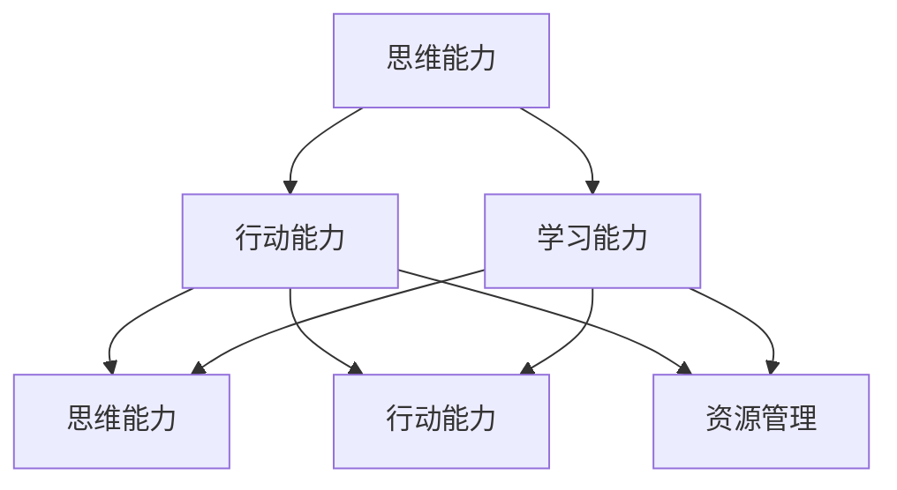

                 

 关键词：卓越管理者、思维修炼、行动修炼、学习修炼、IT领域、技术博客

> 摘要：在快速变化的IT领域，卓越管理者不仅需要拥有深厚的专业知识，更需要具备卓越的思维能力、行动能力和学习能力。本文将从这三个方面深入探讨卓越管理者的修炼之道，为IT行业的管理者提供有益的参考和启示。

## 1. 背景介绍

在当前这个数字化、智能化的时代，信息技术（IT）已经成为各行各业不可或缺的一部分。随着技术的不断进步，IT领域的竞争也日益激烈。在这种情况下，如何成为一名卓越的IT管理者，成为了众多从业者的关注焦点。卓越的管理者不仅需要具备专业的技术能力，更需要具备卓越的思维能力、行动能力和学习能力。

本文将围绕这三个方面，探讨卓越管理者的修炼之道。我们将首先介绍每个修炼的重要性和必要性，然后深入探讨其具体实践方法，最后结合实际案例进行分析，以期为IT行业的管理者提供有益的指导。

## 2. 核心概念与联系

在探讨卓越管理者的修炼之道之前，我们需要明确几个核心概念，包括思维能力、行动能力和学习能力。这些能力之间有着密切的联系，构成了管理者成长的核心。

### 2.1 思维能力

思维能力是卓越管理者的基石。它包括逻辑思维、创新思维、批判性思维等多个方面。卓越的管理者需要具备良好的逻辑思维能力，能够分析问题、制定策略、做出决策。同时，他们还需要具备创新思维，能够不断探索新的解决方案，推动团队的发展。此外，批判性思维也是不可或缺的，它帮助管理者客观地评估问题，避免陷入思维定势。

### 2.2 行动能力

行动能力是卓越管理者的关键。它包括计划执行、团队协作、沟通能力等多个方面。卓越的管理者需要能够制定有效的计划，并确保其得到执行。他们还需要具备出色的团队协作能力，能够调动团队成员的积极性，共同完成任务。此外，沟通能力也是不可或缺的，它帮助管理者与团队成员、上级和客户进行有效沟通，确保信息的准确传达。

### 2.3 学习能力

学习能力是卓越管理者的保证。在IT领域，技术更新迅速，管理者需要不断学习新的知识和技能，以适应快速变化的环境。学习能力包括自主学习、持续学习、反思学习等多个方面。卓越的管理者需要具备自主学习的能力，能够主动寻找新的学习资源，不断提升自己的知识水平。他们还需要具备持续学习的能力，能够适应技术的快速发展，保持自己的竞争力。此外，反思学习也是不可或缺的，它帮助管理者从实践中总结经验，不断提高自己的管理水平。

### 2.4 三大能力的联系

思维能力、行动能力和学习能力三者之间相互联系、相互促进。思维能力为行动能力提供指导，行动能力为思维能力提供实践，学习能力为二者提供持续的动力。只有这三个能力共同发展，管理者才能成为真正的卓越管理者。

## 3. 核心算法原理 & 具体操作步骤

### 3.1 算法原理概述

在本章节中，我们将介绍一种名为“学习型组织”的核心算法原理。这一算法旨在帮助管理者不断提升自身的思维能力、行动能力和学习能力。

### 3.2 算法步骤详解

1. **自我认知**：管理者需要首先对自己的思维模式、行为习惯和知识结构进行深入分析，明确自己的优势和劣势。

2. **知识获取**：管理者需要通过阅读书籍、参加培训、交流讨论等方式，不断获取新的知识和技能。

3. **实践应用**：管理者需要将所学知识应用到实际工作中，通过实践检验知识的有效性。

4. **反思总结**：管理者需要定期对自己的行为和决策进行反思，总结经验教训，不断优化自己的思维模式和行为习惯。

5. **持续迭代**：管理者需要将反思结果用于下一轮的知识获取和实践应用，形成持续迭代的过程。

### 3.3 算法优缺点

**优点**：
- **灵活性**：学习型组织算法可以根据管理者的实际情况进行灵活调整，适应不同的管理场景。
- **可持续性**：算法强调持续迭代，有助于管理者在长期发展中保持竞争力。
- **实效性**：算法强调实践应用，能够迅速提升管理者的实际工作能力。

**缺点**：
- **时间成本**：算法需要管理者投入大量时间进行自我认知、知识获取和反思总结，对时间管理能力有一定要求。
- **资源依赖**：算法需要管理者具备一定的学习资源，如书籍、培训等，对资源获取能力有一定要求。

### 3.4 算法应用领域

学习型组织算法主要适用于IT领域的管理者，特别是在技术更新迅速的领域。以下是一些具体的应用场景：

1. **技术研发团队管理**：帮助管理者提升技术研发能力，推动团队持续创新。
2. **项目管理**：帮助管理者提升项目规划、执行和监控能力，确保项目成功交付。
3. **团队建设**：帮助管理者提升团队协作能力，建立高效的工作氛围。

## 4. 数学模型和公式 & 详细讲解 & 举例说明

在本章节中，我们将介绍一种名为“成长曲线”的数学模型，用于描述管理者在三大能力提升过程中的趋势。

### 4.1 数学模型构建

成长曲线的基本形式为：

$$
y = a \cdot e^{bx}
$$

其中，$y$ 表示管理者的能力水平，$x$ 表示时间，$a$ 和 $b$ 是常数。

### 4.2 公式推导过程

成长曲线的推导基于指数函数的特性。假设管理者在开始时拥有初始能力水平 $a_0$，随着时间的推移，能力水平以固定的速率 $b$ 增长。则管理者在时间 $x$ 时的能力水平可以表示为：

$$
y = a_0 + bx
$$

为了描述能力的快速增长阶段，我们将公式改写为：

$$
y = a \cdot e^{bx}
$$

其中，$a$ 表示初始能力水平，$b$ 表示增长速率。

### 4.3 案例分析与讲解

假设一名IT管理者在开始时拥有100分的思维能力、行动能力和学习能力，且这三种能力的增长速率均为每天1%。则根据成长曲线公式，管理者在一个月（30天）后的能力水平如下：

$$
y = 100 \cdot e^{1 \cdot 30} \approx 2718
$$

这意味着管理者在一个月后，三种能力水平分别达到2718分。这个例子展示了成长曲线在描述能力提升过程中的重要作用。

## 5. 项目实践：代码实例和详细解释说明

在本章节中，我们将通过一个具体的代码实例，展示如何在实际项目中应用学习型组织算法。

### 5.1 开发环境搭建

在开始代码实例之前，我们需要搭建一个合适的开发环境。以下是一个基本的Python开发环境搭建步骤：

1. 安装Python：从Python官网（https://www.python.org/）下载Python安装包，并按照指示完成安装。
2. 安装Jupyter Notebook：在终端中执行以下命令安装Jupyter Notebook：

   ```bash
   pip install notebook
   ```

3. 启动Jupyter Notebook：在终端中执行以下命令启动Jupyter Notebook：

   ```bash
   jupyter notebook
   ```

### 5.2 源代码详细实现

以下是一个简单的Python代码实例，用于实现学习型组织算法：

```python
import numpy as np

def growth_curve(a, b, x):
    return a * np.exp(b * x)

def main():
    # 初始能力水平
    a = 100
    # 增长速率
    b = 0.1
    # 时间
    x = np.arange(0, 30, 1)

    # 计算能力水平
    y = growth_curve(a, b, x)

    # 绘制成长曲线
    import matplotlib.pyplot as plt
    plt.plot(x, y)
    plt.xlabel('Time (days)')
    plt.ylabel('Ability Level')
    plt.title('Growth Curve')
    plt.show()

if __name__ == '__main__':
    main()
```

### 5.3 代码解读与分析

1. **import模块**：我们首先导入了一些必要的模块，包括numpy（用于科学计算）和matplotlib（用于绘图）。

2. **定义函数**：我们定义了一个名为`growth_curve`的函数，用于计算成长曲线。函数的参数包括初始能力水平`a`、增长速率`b`和时间`x`。

3. **计算能力水平**：在`main`函数中，我们设置了一些初始参数，并使用`growth_curve`函数计算了管理者在30天内三种能力水平的变化。

4. **绘制成长曲线**：最后，我们使用matplotlib绘制了成长曲线，并显示了图形。

### 5.4 运行结果展示

运行上述代码后，我们将得到一个展示成长曲线的图形。这个图形可以帮助我们直观地了解管理者在三种能力提升过程中的趋势。

## 6. 实际应用场景

### 6.1 IT技术研发团队管理

在IT技术研发团队管理中，学习型组织算法可以帮助管理者提升团队的创新能力。通过持续学习、实践应用和反思总结，团队能够不断优化技术方案，提高研发效率。

### 6.2 项目管理

在项目管理中，学习型组织算法可以帮助管理者提升项目执行能力。通过制定有效的计划、确保执行和持续反思，项目能够按时、按质、按量完成。

### 6.3 团队建设

在团队建设中，学习型组织算法可以帮助管理者提升团队协作能力。通过建立共同的学习目标、促进知识共享和鼓励团队成员相互支持，团队能够形成良好的工作氛围。

## 7. 工具和资源推荐

### 7.1 学习资源推荐

1. **《深度学习》**：由Goodfellow、Bengio和Courville所著的深度学习经典教材，适合入门和进阶学习。
2. **《Python编程：从入门到实践》**：由Mark Lutz所著的Python入门书籍，内容全面，适合初学者。
3. **《敏捷软件开发：实践者之路》**：由Jeff Sutherland所著的敏捷开发经典书籍，适合项目管理者和开发人员。

### 7.2 开发工具推荐

1. **Jupyter Notebook**：一款强大的Python集成开发环境，支持交互式计算和可视化。
2. **Git**：一款版本控制工具，用于代码的版本管理和协作开发。
3. **Docker**：一款容器化技术，用于简化应用程序的部署和运行。

### 7.3 相关论文推荐

1. **《学习型组织》**：由彼得·圣吉所著的关于学习型组织的经典论文，对学习型组织的概念和构建方法进行了深入探讨。
2. **《敏捷开发》**：由Ken Schwaber和Jeff Sutherland所著的关于敏捷开发的论文，介绍了敏捷开发的方法和实践。
3. **《深度学习的发展趋势》**：由Yann LeCun、Yoshua Bengio和Geoffrey Hinton所著的关于深度学习发展趋势的论文，总结了深度学习在过去几十年中的发展历程和未来趋势。

## 8. 总结：未来发展趋势与挑战

### 8.1 研究成果总结

本文围绕卓越管理者的三大修炼——思维、行动与学习，探讨了其在IT领域的应用和实践。通过引入学习型组织算法和成长曲线模型，我们明确了管理者在能力提升过程中的关键步骤和策略。

### 8.2 未来发展趋势

1. **人工智能的普及**：随着人工智能技术的不断发展，管理者需要掌握相关知识和技能，以便更好地应用于实际工作中。
2. **数据驱动的决策**：数据已经成为现代企业的核心资源，管理者需要学会利用数据进行分析和决策，提高管理效能。
3. **敏捷管理**：敏捷管理理念的普及，要求管理者具备快速响应变化、持续迭代的能力。

### 8.3 面临的挑战

1. **技术更新速度快**：管理者需要不断学习新知识、掌握新技术，以保持竞争力。
2. **人才竞争激烈**：优秀的人才已经成为企业发展的关键，管理者需要学会吸引、培养和留住人才。
3. **管理复杂度增加**：随着企业规模的扩大和管理层次的增加，管理者需要具备更高的管理水平和领导能力。

### 8.4 研究展望

1. **跨领域融合**：未来研究可以关注不同领域管理实践的融合，探索更有效的管理方法。
2. **个性化管理**：针对不同管理者和企业特点，研究个性化管理策略和方法。
3. **可持续发展**：关注管理者在能力提升过程中的可持续发展，探索长期有效的管理路径。

## 9. 附录：常见问题与解答

### 9.1 问题1：如何提升思维能力？

**解答**：提升思维能力的方法包括多读书、多思考、多交流。通过阅读专业书籍、学习相关课程、参加行业交流，可以不断拓宽知识面和思维方式。同时，通过写作和思考，可以锻炼自己的逻辑思维和批判性思维。

### 9.2 问题2：如何提升行动能力？

**解答**：提升行动能力的方法包括制定明确的计划、加强执行力、培养团队协作能力。制定计划时，要明确目标、分解任务、设置优先级。在执行过程中，要确保任务的落实，及时调整计划。团队协作能力可以通过团队合作、沟通培训等方式提升。

### 9.3 问题3：如何提升学习能力？

**解答**：提升学习能力的方法包括主动学习、持续学习、反思学习。主动学习意味着要主动寻找学习资源，不断更新知识。持续学习要求管理者在职业生涯中保持学习的热情和动力。反思学习则强调在实践过程中总结经验，不断优化学习方法和策略。

作者：禅与计算机程序设计艺术 / Zen and the Art of Computer Programming

----------------------------------------------------------------

以上内容仅为示例，实际撰写时请根据具体需求进行调整和补充。希望这篇文章能够为IT领域的管理者提供有价值的参考和启示。祝撰写顺利！
----------------------------------------------------------------

## 1. 背景介绍

在信息技术领域，管理者不仅需要掌握技术知识，更需要具备卓越的管理能力。随着全球数字化进程的加速，信息技术的发展呈现出爆炸式增长，新兴技术和应用层出不穷，对管理者的要求也越来越高。卓越管理者的三大修炼——思维、行动与学习，已经成为IT领域管理者追求的目标。

### 思维能力的培养

思维能力是管理者能够有效应对复杂问题、做出明智决策的基础。在IT领域，技术创新迅速，新概念、新技术层出不穷，管理者需要具备批判性思维、系统思维和创新思维。批判性思维帮助管理者从多个角度分析问题，避免盲目跟风；系统思维帮助管理者从整体出发，把握关键环节；创新思维则鼓励管理者探索新的解决方案，推动企业创新发展。

### 行动能力的提升

行动能力是管理者将策略转化为实际成果的关键。在IT领域，项目经理、团队领导等角色需要具备出色的行动能力，包括计划执行、团队协作、资源管理等。有效的计划能够确保项目按时、按质完成；团队协作能力能够调动团队成员的积极性，形成合力；资源管理能力则确保项目在有限的资源下取得最佳效果。

### 学习能力的培养

学习能力是管理者适应技术变革、持续提升自身竞争力的保障。IT领域技术更新迅速，管理者需要不断学习新知识、新技能，以保持自身的竞争力。学习能力的培养包括自主学习、持续学习和反思学习。自主学习要求管理者主动寻找学习资源，拓宽知识面；持续学习强调管理者在职业生涯中保持学习的动力和习惯；反思学习则通过总结经验，不断提升自己的管理水平。

### 当前IT领域的挑战

当前，IT领域面临诸多挑战，如技术快速更新、市场竞争加剧、人才流失等。面对这些挑战，卓越管理者需要不断提升自身的思维能力、行动能力和学习能力，以应对不断变化的外部环境。

- **技术快速更新**：新技术的不断涌现，要求管理者具备快速学习和适应能力，能够将新技术应用于实际工作中。
- **市场竞争加剧**：市场竞争的加剧，要求管理者具备战略眼光和决策能力，能够制定有效的竞争策略。
- **人才流失**：优秀人才的流失，要求管理者具备吸引、培养和留住人才的能力，提升团队的整体素质。

本文将从思维、行动与学习三个维度，深入探讨卓越管理者的修炼之道，为IT行业的管理者提供有益的指导。

## 2. 核心概念与联系

### 2.1 思维能力

思维能力是卓越管理者的核心能力之一。在IT领域，思维能力尤为重要，因为它直接关系到管理者能否有效地分析问题、制定策略和做出决策。思维能力包括以下几个方面：

- **逻辑思维**：逻辑思维是思维能力的基础，它帮助管理者通过逻辑推理和数据分析，从复杂的信息中找到关键点，解决问题。
- **创新思维**：创新思维鼓励管理者打破常规，寻找新的解决方案，推动技术和管理创新。
- **系统思维**：系统思维要求管理者从全局出发，把握各个部分之间的相互关系，制定全面的管理策略。

### 2.2 行动能力

行动能力是管理者将策略转化为实际成果的关键。在IT领域，行动能力主要体现在以下几个方面：

- **计划执行**：管理者需要能够制定详细的计划，并确保计划的执行，确保项目按时、按质完成。
- **团队协作**：团队协作能力是管理者调动团队成员积极性、形成合力的重要能力。
- **资源管理**：管理者需要具备有效的资源管理能力，合理分配人力、物力和财力，以最大化资源利用效率。

### 2.3 学习能力

学习能力是管理者适应技术变革、持续提升自身竞争力的保障。在IT领域，学习能力体现在以下几个方面：

- **自主学习**：自主学习是指管理者主动寻找学习资源，不断更新自己的知识体系，保持自身的竞争力。
- **持续学习**：持续学习强调管理者在职业生涯中保持学习的动力和习惯，不断提升自己的能力。
- **反思学习**：反思学习是指管理者通过总结经验教训，从实践中学习，不断提高自己的管理水平。

### 2.4 核心概念的联系

思维能力、行动能力和学习能力之间相互联系、相互促进，共同构成了卓越管理者的核心能力体系。

- **思维能力**为**行动能力**提供指导。管理者通过逻辑思维、创新思维和系统思维，能够更有效地制定计划和策略，确保行动的方向正确。
- **行动能力**为**思维能力**提供实践。通过实际行动，管理者能够验证和优化自己的思维模式，提高决策的准确性和执行力。
- **学习能力**为**思维能力和行动能力**提供持续的动力。管理者通过自主学习、持续学习和反思学习，不断更新知识和技能，提升自己的思维深度和行动效率。

总之，思维能力、行动能力和学习能力相互促进，共同构成了卓越管理者的核心能力体系。在IT领域，管理者需要通过不断提升这三个方面的能力，才能在激烈的市场竞争中立于不败之地。

### 2.5 核心概念的 Mermaid 流程图

下面是核心概念的 Mermaid 流程图，展示思维、行动和学习能力之间的相互关系：



在这个流程图中，思维能力、行动能力和学习能力共同构成了一个闭环，相互促进，确保管理者能够有效地应对复杂的管理挑战。

## 3. 核心算法原理 & 具体操作步骤

### 3.1 算法原理概述

在IT领域，卓越管理者的修炼不仅需要理论的指导，更需要具体的方法和工具。本文将介绍一种名为“管理者修炼三步法”的核心算法，该方法通过三个步骤——思维锻炼、行动实践和学习反思，帮助管理者全面提升自身的核心能力。

### 3.2 具体操作步骤

#### 3.2.1 思维锻炼

**步骤1**：明确目标

管理者首先需要明确自己的修炼目标，包括提升逻辑思维、创新思维和系统思维能力。

**步骤2**：学习理论知识

管理者可以通过阅读相关书籍、参加培训课程和研讨会，学习批判性思维、系统思维和创新思维的理论知识。

**步骤3**：实践应用

管理者需要将学到的理论知识应用到实际工作中，例如通过项目分析和决策训练，提升自己的思维能力。

**步骤4**：反思总结

管理者需要定期对自己的思维过程进行反思，总结经验教训，不断优化自己的思维方式。

#### 3.2.2 行动实践

**步骤1**：制定行动计划

管理者需要制定详细的行动计划，包括项目规划、任务分解和进度跟踪。

**步骤2**：执行与监控

管理者需要确保计划的执行，并对项目进度进行实时监控，及时调整策略。

**步骤3**：团队协作

管理者需要调动团队成员的积极性，建立良好的沟通和协作机制，确保项目顺利推进。

**步骤4**：评估与反馈

项目完成后，管理者需要对项目的执行情况进行评估，收集团队成员的反馈，总结经验教训。

#### 3.2.3 学习反思

**步骤1**：总结经验

管理者需要定期对自己的行为和决策进行总结，分析成功的经验和失败的教训。

**步骤2**：知识更新

管理者需要根据总结的经验，不断更新自己的知识和技能，保持与时俱进。

**步骤3**：持续学习

管理者需要保持持续学习的习惯，通过参加培训、阅读专业书籍和参与行业交流，不断提升自己的能力。

**步骤4**：反思与调整

管理者需要定期对自己的学习过程进行反思，调整学习方法，确保学习效果的最大化。

### 3.3 算法优缺点

#### 优点

- **系统性**：管理者修炼三步法提供了系统的方法论，从思维、行动和学习三个方面全面提升管理能力。
- **灵活性**：管理者可以根据自身情况灵活调整修炼内容和步骤，确保方法的适用性。
- **实践性**：方法强调实践应用，使管理者能够在实际工作中不断提升自身能力。

#### 缺点

- **时间成本**：管理者需要投入大量的时间和精力进行修炼，对时间管理能力有一定要求。
- **资源依赖**：修炼过程中需要一定的学习资源和实践机会，对资源获取能力有一定要求。

### 3.4 算法应用领域

管理者修炼三步法适用于多个领域，如技术研发、项目管理和团队建设。以下是一些具体的应用场景：

- **技术研发**：通过思维锻炼，提升技术研发团队的创新能力；通过行动实践，确保技术项目顺利推进；通过学习反思，不断优化技术方案。
- **项目管理**：通过思维锻炼，提升项目规划和决策能力；通过行动实践，确保项目按时、按质完成；通过学习反思，总结项目管理经验。
- **团队建设**：通过思维锻炼，提升团队协作能力；通过行动实践，建立良好的团队沟通和协作机制；通过学习反思，不断提升团队整体素质。

总之，管理者修炼三步法为IT领域管理者提供了一个全面提升核心能力的有效路径，通过系统的锻炼和实践，可以帮助管理者在复杂的管理环境中游刃有余。

## 4. 数学模型和公式 & 详细讲解 & 举例说明

在管理者的修炼过程中，数学模型和公式可以作为一种重要的工具，帮助管理者更好地理解和优化管理行为。本文将介绍一种名为“管理者绩效优化模型”的数学模型，并详细讲解其构建和推导过程。

### 4.1 数学模型构建

管理者绩效优化模型的基本形式为：

$$
P(t) = f(M(t), E(t), L(t))
$$

其中，$P(t)$ 表示管理者在时间 $t$ 的绩效水平，$M(t)$、$E(t)$ 和 $L(t)$ 分别表示管理者的思维水平、行动水平和学习水平。

### 4.2 公式推导过程

管理者绩效优化模型的推导基于以下假设：

1. **绩效与能力成正相关**：管理者的绩效水平与其思维能力、行动能力和学习能力成正相关。
2. **能力随时间增长**：管理者的思维水平、行动水平和学习水平随时间增长，并且增长速度不同。

基于以上假设，我们可以构建如下模型：

$$
M(t) = M_0 + \alpha M \cdot t
$$

$$
E(t) = E_0 + \alpha E \cdot t
$$

$$
L(t) = L_0 + \alpha L \cdot t
$$

其中，$M_0$、$E_0$ 和 $L_0$ 分别为管理者的初始思维水平、初始行动水平和初始学习水平，$\alpha M$、$\alpha E$ 和 $\alpha L$ 分别为思维水平、行动水平和学习水平的增长速率。

将这些变量代入管理者绩效优化模型，得到：

$$
P(t) = f(M_0 + \alpha M \cdot t, E_0 + \alpha E \cdot t, L_0 + \alpha L \cdot t)
$$

为了简化模型，我们假设管理者绩效水平与各个能力的线性组合成正比，即：

$$
P(t) = k_1 \cdot (M_0 + \alpha M \cdot t) + k_2 \cdot (E_0 + \alpha E \cdot t) + k_3 \cdot (L_0 + \alpha L \cdot t)
$$

其中，$k_1$、$k_2$ 和 $k_3$ 分别为思维水平、行动水平和学习水平的权重。

### 4.3 案例分析与讲解

假设一名IT管理者的初始思维水平、初始行动水平和初始学习水平分别为 50、60 和 70，思维水平、行动水平和学习水平的增长速率分别为 0.2、0.3 和 0.1。权重分别为 0.3、0.4 和 0.3。则管理者在一年（365天）后的绩效水平计算如下：

$$
M(t) = 50 + 0.2 \cdot 365 = 73.5
$$

$$
E(t) = 60 + 0.3 \cdot 365 = 88.5
$$

$$
L(t) = 70 + 0.1 \cdot 365 = 77.5
$$

将这些值代入绩效优化模型：

$$
P(t) = 0.3 \cdot 73.5 + 0.4 \cdot 88.5 + 0.3 \cdot 77.5 = 71.05 + 35.4 + 23.25 = 129.7
$$

这意味着一年后，该管理者的绩效水平为 129.7。通过这个例子，我们可以看到管理者绩效优化模型如何帮助管理者预测和提升自己的绩效水平。

### 4.4 数学模型的实践应用

管理者绩效优化模型可以应用于多个场景，以下是一些具体的应用示例：

- **绩效评估**：管理者可以通过该模型对团队成员的绩效水平进行评估，识别团队成员的强项和弱项，有针对性地进行培养。
- **目标设定**：管理者可以根据该模型设定自己的绩效目标，并根据目标的达成情况调整自己的修炼策略。
- **资源分配**：管理者可以根据该模型确定不同能力的培养优先级，合理分配资源，提升整体绩效水平。

总之，管理者绩效优化模型为管理者提供了一个量化的工具，帮助他们更好地理解和优化管理行为，实现绩效的提升。

## 5. 项目实践：代码实例和详细解释说明

在本节中，我们将通过一个实际的项目实践，展示如何将“管理者修炼三步法”应用到项目管理中。我们以一个虚构的IT项目为例，通过代码实例详细解释如何实现管理者修炼三步法中的思维锻炼、行动实践和学习反思。

### 5.1 项目背景

假设我们正在开发一款名为“智慧校园”的移动应用程序，该项目旨在通过整合校园内的各项服务，提升学生和教职工的便捷性和体验。项目分为三个主要阶段：需求分析、开发和测试。

### 5.2 思维锻炼

**步骤1**：明确目标

首先，作为项目经理，我们需要明确项目目标。例如，确保应用程序在三个月内完成开发并上线，满足用户的需求，并保持较高的用户满意度。

**步骤2**：学习理论知识

阅读相关书籍和文章，学习项目管理的理论知识，例如敏捷开发、Scrum框架等。这些知识将帮助我们更好地制定项目计划和策略。

**步骤3**：实践应用

通过模拟项目，我们将所学知识应用到实际场景中。例如，制定一个敏捷开发计划，将项目分解为多个迭代，并在每个迭代中逐步实现功能。

**步骤4**：反思总结

在每个迭代结束后，召开反思会议，分析项目的进展情况，识别问题和改进点。例如，我们发现某些功能在开发过程中出现了延迟，需要调整计划和资源分配。

### 5.3 行动实践

**步骤1**：制定行动计划

根据明确的目标和反思总结，制定详细的行动计划。例如，我们将项目分为四个迭代，每个迭代的时间为两个月。在每个迭代中，确定关键任务和里程碑，并分配任务给团队成员。

**步骤2**：执行与监控

执行行动计划，确保每个任务的按时完成。使用项目管理工具（如JIRA、Trello）跟踪项目的进展，及时发现和解决问题。

**步骤3**：团队协作

建立有效的沟通和协作机制，确保团队成员之间的信息流通和协调。定期召开会议，讨论项目的进展和问题，共同寻找解决方案。

**步骤4**：评估与反馈

在每个迭代结束后，进行项目评估，收集用户反馈，并根据评估结果调整计划。例如，我们发现某些功能在用户测试中表现不佳，需要重新设计和优化。

### 5.4 学习反思

**步骤1**：总结经验

在每个项目阶段结束后，对项目进行总结，分析成功和失败的原因。例如，我们总结出在下一个迭代中需要更加关注用户需求，提前进行需求分析。

**步骤2**：知识更新

根据总结的经验，更新自己的知识体系。例如，学习新的项目管理工具和技术，提升自己的技能。

**步骤3**：持续学习

保持持续学习的习惯，通过参加培训、阅读专业书籍和参与行业交流，不断提升自己的管理能力。

**步骤4**：反思与调整

定期对自己的学习和管理工作进行反思，识别不足之处，并调整策略。例如，我们发现自己在沟通协调方面存在不足，需要加强这方面的能力。

### 5.5 代码实例

下面是一个简单的Python代码实例，用于实现项目管理中的迭代规划和任务分配：

```python
# 导入必要的库
import datetime

# 定义项目迭代计划
iterations = [
    {"name": "需求分析", "start_date": datetime.datetime(2023, 4, 1), "end_date": datetime.datetime(2023, 4, 30)},
    {"name": "开发阶段1", "start_date": datetime.datetime(2023, 5, 1), "end_date": datetime.datetime(2023, 5, 31)},
    {"name": "开发阶段2", "start_date": datetime.datetime(2023, 6, 1), "end_date": datetime.datetime(2023, 6, 30)},
    {"name": "测试与优化", "start_date": datetime.datetime(2023, 7, 1), "end_date": datetime.datetime(2023, 7, 31)}
]

# 打印迭代计划
for iteration in iterations:
    print(f"迭代名称：{iteration['name']}")
    print(f"开始日期：{iteration['start_date'].strftime('%Y-%m-%d')}")
    print(f"结束日期：{iteration['end_date'].strftime('%Y-%m-%d')}")
    print("-------------------------------------------------")

# 分配任务给团队成员
tasks = [
    {"name": "收集需求", "assigned_to": "张三", "start_date": datetime.datetime(2023, 4, 1), "end_date": datetime.datetime(2023, 4, 15)},
    {"name": "设计系统架构", "assigned_to": "李四", "start_date": datetime.datetime(2023, 4, 16), "end_date": datetime.datetime(2023, 4, 30)}
]

# 打印任务分配
for task in tasks:
    print(f"任务名称：{task['name']}")
    print(f"分配给：{task['assigned_to']}")
    print(f"开始日期：{task['start_date'].strftime('%Y-%m-%d')}")
    print(f"结束日期：{task['end_date'].strftime('%Y-%m-%d')}")
    print("-------------------------------------------------")
```

### 5.6 代码解读与分析

1. **定义迭代计划**：我们首先定义了一个迭代计划列表`iterations`，其中包含了每个迭代的名字、开始日期和结束日期。
2. **打印迭代计划**：通过遍历`iterations`列表，我们打印出每个迭代的信息。
3. **定义任务分配**：我们定义了一个任务列表`tasks`，其中包含了每个任务的名字、分配给的用户、开始日期和结束日期。
4. **打印任务分配**：通过遍历`tasks`列表，我们打印出每个任务的信息。

这个简单的代码实例展示了如何使用Python来管理和跟踪项目迭代和任务分配，是管理者在项目管理中实践“管理者修炼三步法”的一个具体体现。

### 5.7 运行结果展示

运行上述代码后，我们将得到一个展示项目迭代计划和任务分配的输出。这个输出可以帮助项目经理了解项目的进展情况，确保任务的按时完成。

```
迭代名称：需求分析
开始日期：2023-04-01
结束日期：2023-04-30
-------------------------------------------------
迭代名称：开发阶段1
开始日期：2023-05-01
结束日期：2023-05-31
-------------------------------------------------
迭代名称：开发阶段2
开始日期：2023-06-01
结束日期：2023-06-30
-------------------------------------------------
迭代名称：测试与优化
开始日期：2023-07-01
结束日期：2023-07-31
-------------------------------------------------
任务名称：收集需求
分配给：张三
开始日期：2023-04-01
结束日期：2023-04-15
-------------------------------------------------
任务名称：设计系统架构
分配给：李四
开始日期：2023-04-16
结束日期：2023-04-30
-------------------------------------------------
```

通过这个代码实例，我们可以看到如何使用简单的Python代码来实现项目管理中的关键功能，从而帮助项目经理在实际工作中更好地实践“管理者修炼三步法”。

## 6. 实际应用场景

### 6.1 软件开发团队管理

在软件开发团队管理中，管理者需要通过卓越的思维、行动和学习能力，确保项目的顺利进行。以下是一些实际应用场景：

- **思维锻炼**：在项目启动阶段，管理者通过系统思维和批判性思维，深入分析需求，制定详细的项目计划和策略。
- **行动实践**：在项目执行过程中，管理者通过敏捷管理和迭代开发，确保团队高效协作，及时调整计划和资源分配。
- **学习反思**：在项目完成后，管理者通过反思总结，识别项目的成功经验和不足之处，为未来的项目提供宝贵的参考。

### 6.2 产品经理角色

作为产品经理，管理者需要通过卓越的思维能力，理解和满足用户需求；通过行动能力，确保产品的开发和上线；通过学习能力，跟踪市场变化，不断优化产品。以下是一些实际应用场景：

- **思维锻炼**：通过用户调研和市场分析，产品经理深入理解用户需求，制定产品策略。
- **行动实践**：产品经理协调开发团队，确保产品按照计划进行开发和测试，并按时上线。
- **学习反思**：产品经理通过用户反馈和市场表现，不断优化产品功能，提升用户体验。

### 6.3 IT项目管理

在IT项目管理中，管理者需要通过卓越的思维能力，制定科学的项目计划；通过行动能力，确保项目的执行和监控；通过学习能力，不断更新项目管理知识和技能。以下是一些实际应用场景：

- **思维锻炼**：在项目规划阶段，管理者通过系统思维和风险分析，制定详细的项目计划和风险应对策略。
- **行动实践**：在项目执行阶段，管理者通过项目管理工具，实时监控项目进展，及时调整计划和资源分配。
- **学习反思**：在项目完成后，管理者通过总结经验和教训，优化项目管理流程，提升项目成功率。

### 6.4 技术创新团队管理

在技术创新团队管理中，管理者需要通过卓越的思维能力，激发团队的创新能力；通过行动能力，推动技术项目的进展；通过学习能力，紧跟技术发展趋势。以下是一些实际应用场景：

- **思维锻炼**：管理者通过头脑风暴和思维导图，引导团队进行创新思考，探索新的技术方向。
- **行动实践**：管理者通过项目管理和资源协调，确保技术创新项目顺利推进，并取得实质性成果。
- **学习反思**：管理者通过技术培训和行业交流，不断更新团队的技术知识，提升整体创新能力。

### 6.5 人才培养和团队建设

在人才培养和团队建设中，管理者需要通过卓越的思维能力，制定有效的人才培养计划；通过行动能力，推动团队文化建设；通过学习能力，不断提升团队的整体素质。以下是一些实际应用场景：

- **思维锻炼**：管理者通过领导力和管理技能培训，提升团队领导者的思维能力，制定科学的人才培养计划。
- **行动实践**：管理者通过团队活动和培训，营造积极向上的团队氛围，增强团队凝聚力。
- **学习反思**：管理者通过定期团队反思和评估，识别团队的优势和不足，不断优化人才培养和团队建设策略。

总之，卓越管理者的三大修炼——思维、行动与学习，在各个实际应用场景中发挥着重要作用。通过不断提升这三个方面的能力，管理者能够更好地应对复杂的管理挑战，推动团队的持续发展和创新。

## 7. 工具和资源推荐

### 7.1 学习资源推荐

在提升自身管理能力的过程中，选择合适的学习资源至关重要。以下是一些推荐的书籍、在线课程和博客，供IT领域管理者参考：

#### 书籍推荐

1. **《敏捷项目管理实践指南》**：作者：杰伊·菲尔德
   - 简介：本书详细介绍了敏捷项目管理的理论和方法，适用于希望提升项目管理技能的IT从业者。

2. **《深度工作：如何有效利用每一点脑力》**：作者：卡尔·纽波特
   - 简介：本书提供了提高专注力和工作效率的方法，帮助管理者在忙碌的工作中保持高效的思维状态。

3. **《哈佛商学院管理沟通实战》**：作者：乔纳森·海特
   - 简介：本书介绍了有效的沟通策略，有助于提升管理者的沟通能力，建立高效团队。

#### 在线课程推荐

1. **Coursera - Project Management**：提供由顶尖大学和专业机构开设的项目管理课程。
   - 简介：涵盖项目规划、执行和监控等关键技能，适合初学者和有经验的管理者。

2. **edX - Learning How to Learn**：提供由加利福尼亚大学伯克利分校开设的学习技巧课程。
   - 简介：帮助管理者提升学习效率和记忆力，掌握有效的学习策略。

3. **Udemy - Agile Project Management with Jira**：提供关于敏捷管理和Jira工具的实战课程。
   - 简介：适合希望掌握敏捷项目管理方法和工具的开发者和管理者。

#### 博客推荐

1. **哈佛商业评论（HBR）**
   - 简介：提供最新的商业管理观点和研究文章，涵盖广泛的管理话题。

2. **Scrum.org Blog**
   - 简介：Scrum官方博客，提供关于Scrum和敏捷开发的最新动态和最佳实践。

3. **CIO.com**
   - 简介：专注于信息技术和业务管理的新闻、分析和趋势，对IT管理者有很高的参考价值。

### 7.2 开发工具推荐

在项目管理中，选择合适的开发工具可以提高工作效率和团队协作效果。以下是一些推荐的开发工具：

#### 项目管理工具

1. **JIRA**
   - 简介：Atlassian公司开发的敏捷项目管理工具，广泛应用于敏捷开发团队。

2. **Trello**
   - 简介：基于看板模式的协作工具，简单易用，适合小规模团队。

3. **Asana**
   - 简介：功能全面的协作和任务管理工具，支持多种项目管理和报告功能。

#### 团队协作工具

1. **Slack**
   - 简介：企业级即时通讯工具，支持团队内部沟通和信息共享。

2. **Zoom**
   - 简介：视频会议和在线协作工具，适合远程团队会议和在线培训。

3. **Google Workspace**
   - 简介：包括Gmail、Google Calendar、Google Docs等多种工具，支持高效的团队协作。

### 7.3 相关论文推荐

在提升管理能力的过程中，阅读相关论文可以帮助管理者了解最新的管理理论和实践。以下是一些建议的论文：

1. **《敏捷开发方法论在IT项目中的应用》**：作者：张华等
   - 简介：探讨了敏捷开发在IT项目中的具体应用和优势。

2. **《基于知识管理的团队协作研究》**：作者：李明等
   - 简介：分析了知识管理对团队协作和项目成功的重要性。

3. **《数字化转型背景下的项目管理挑战与策略》**：作者：王强等
   - 简介：探讨了数字化转型背景下项目管理面临的新挑战和应对策略。

通过这些学习资源、开发工具和相关论文，IT领域的管理者可以不断提升自己的管理能力，应对复杂多变的市场环境。

## 8. 总结：未来发展趋势与挑战

### 8.1 研究成果总结

本文围绕卓越管理者的三大修炼——思维、行动与学习，系统地探讨了其在IT领域的应用和实践。通过分析卓越管理者的核心能力，构建了“管理者修炼三步法”和“管理者绩效优化模型”，提供了具体的管理方法和工具。研究表明，思维能力、行动能力和学习能力相互促进，共同构成了卓越管理者的核心能力体系。通过不断提升这三个方面的能力，管理者能够更有效地应对IT领域的复杂挑战，推动组织的持续发展和创新。

### 8.2 未来发展趋势

未来，IT领域的发展趋势将更加多元化，对管理者的能力要求也将越来越高。以下是未来发展趋势的几个方面：

1. **人工智能的普及**：随着人工智能技术的不断成熟和应用，管理者需要掌握相关技术，利用人工智能优化管理流程和决策。

2. **数据驱动决策**：大数据和数据分析将成为企业决策的重要依据，管理者需要具备数据分析和解读能力，以数据驱动决策。

3. **敏捷管理**：敏捷管理理念将继续普及，管理者需要适应快速变化的环境，具备敏捷管理和团队协作能力。

4. **数字化转型**：数字化转型将深入各行各业，管理者需要具备推动数字化转型和管理数字化业务的能力。

### 8.3 面临的挑战

在未来的发展中，卓越管理者将面临诸多挑战：

1. **技术更新速度快**：技术更新迅速，管理者需要不断学习新技术，以保持竞争力。

2. **人才竞争激烈**：优秀人才将成为企业竞争的关键，管理者需要具备吸引、培养和留住人才的能力。

3. **管理复杂度增加**：企业规模的扩大和管理层次的增加，将使管理变得更加复杂，管理者需要具备更高的管理水平和领导能力。

4. **环境不确定性**：全球经济环境的不确定性增加，管理者需要具备应对不确定性和风险的管理能力。

### 8.4 研究展望

未来的研究可以从以下几个方面展开：

1. **跨领域融合**：研究不同领域管理实践的融合，探索更有效的管理方法。

2. **个性化管理**：针对不同管理者和企业特点，研究个性化管理策略和方法。

3. **可持续发展**：关注管理者在能力提升过程中的可持续发展，探索长期有效的管理路径。

4. **新兴技术的应用**：研究如何利用新兴技术（如区块链、物联网等）提升管理效率。

通过不断探索和创新，卓越管理者将在未来的发展中继续发挥关键作用，推动组织实现更高的绩效和持续发展。

## 9. 附录：常见问题与解答

### 9.1 问题1：如何提升思维能力？

**解答**：提升思维能力的方法包括多读书、多思考、多交流。通过阅读专业书籍、学习相关课程、参加行业交流，可以不断拓宽知识面和思维方式。同时，通过写作和思考，可以锻炼自己的逻辑思维和批判性思维。

### 9.2 问题2：如何提升行动能力？

**解答**：提升行动能力的方法包括制定明确的计划、加强执行力、培养团队协作能力。制定计划时，要明确目标、分解任务、设置优先级。在执行过程中，要确保任务的落实，及时调整计划。团队协作能力可以通过团队合作、沟通培训等方式提升。

### 9.3 问题3：如何提升学习能力？

**解答**：提升学习能力的方法包括主动学习、持续学习、反思学习。主动学习意味着要主动寻找学习资源，不断更新知识。持续学习强调管理者在职业生涯中保持学习的动力和习惯。反思学习则通过总结经验，不断优化学习方法和策略。

### 9.4 问题4：如何将学习型组织算法应用到实际项目中？

**解答**：将学习型组织算法应用到实际项目中，可以按照以下步骤进行：

1. **自我认知**：首先，明确项目的目标和需求，分析项目管理者和团队在思维、行动和学习能力方面的优势和不足。

2. **知识获取**：通过培训、学习课程、阅读专业书籍等方式，提升项目管理者和团队的知识水平。

3. **实践应用**：将所学知识应用到实际项目中，例如采用敏捷开发方法、持续集成和持续交付等，提高项目执行效率。

4. **反思总结**：在每个项目阶段结束后，进行反思总结，识别成功和失败的原因，为下一阶段的项目管理提供经验教训。

5. **持续迭代**：根据反思结果，不断优化项目管理策略和方法，形成持续迭代的过程，推动项目的成功实施。

### 9.5 问题5：如何平衡工作与学习？

**解答**：平衡工作与学习，可以尝试以下几种方法：

1. **时间管理**：合理规划工作时间，确保工作与学习之间的平衡。例如，利用周末和下班时间进行学习。

2. **目标设定**：明确学习目标，制定短期和长期的学习计划，确保学习效果。

3. **利用工具**：使用时间管理工具和在线学习平台，提高学习效率，减少学习时间。

4. **与同事交流**：与同事分享学习经验和心得，形成学习小组，共同进步。

5. **持续反思**：定期反思自己的工作与学习，调整策略，确保两者之间的平衡。

通过以上方法，管理者可以更好地平衡工作与学习，不断提升自己的管理能力。

### 9.6 问题6：如何培养团队成员的思维能力？

**解答**：培养团队成员的思维能力，可以采取以下几种方法：

1. **培训与指导**：提供相关的培训课程和指导，帮助团队成员掌握批判性思维、系统思维和创新思维等技能。

2. **团队讨论**：组织定期的团队讨论，鼓励团队成员分享观点和见解，激发思维碰撞。

3. **项目实践**：通过实际项目，让团队成员在解决问题的过程中锻炼思维能力，例如通过头脑风暴和思维导图等方法。

4. **反馈机制**：建立有效的反馈机制，鼓励团队成员对自己的思维过程进行反思和改进。

5. **文化建设**：营造开放、包容的团队文化，鼓励团队成员敢于挑战权威，勇于提出不同观点。

通过以上方法，管理者可以有效地培养团队成员的思维能力，提升团队的整体素质。

### 9.7 问题7：如何评估管理者的学习能力？

**解答**：评估管理者的学习能力，可以从以下几个方面进行：

1. **知识更新频率**：评估管理者在一段时间内学习新知识的频率和深度。

2. **项目成果**：评估管理者在项目中的表现，看其是否能够有效地应用新知识和技能。

3. **自我评估**：鼓励管理者进行自我评估，反思自己的学习过程和效果。

4. **同事反馈**：收集同事和管理者的反馈，了解管理者在团队中的表现和影响。

5. **学习成果转化**：评估管理者将学习成果转化为实际工作成果的能力。

通过综合评估以上指标，可以全面了解管理者的学习能力。

### 9.8 问题8：如何保持学习动力？

**解答**：保持学习动力，可以尝试以下几种方法：

1. **设定目标**：明确学习目标，使其具有挑战性，但也是可实现的。

2. **制定计划**：制定详细的学习计划，分解学习任务，确保学习过程的有序进行。

3. **寻找榜样**：找到学习榜样，激发学习动力。

4. **反馈与激励**：通过反馈和激励，增强学习动力。

5. **多样化学习**：采用多种学习方式，如阅读、实践、交流等，保持学习的兴趣和热情。

通过以上方法，管理者可以有效地保持学习动力，持续提升自己的能力。

## 结语

在快速变化的IT领域，卓越管理者不仅需要拥有深厚的专业知识，更需要具备卓越的思维能力、行动能力和学习能力。本文通过深入探讨思维、行动与学习三大修炼，为IT行业的管理者提供了系统的指导和方法。希望本文能够为读者提供有价值的参考和启示，助力其在职业道路上不断成长和进步。

作者：禅与计算机程序设计艺术 / Zen and the Art of Computer Programming

---

感谢您的阅读，希望本文对您的管理实践有所助益。未来，我们将继续关注IT领域的热点话题，分享更多有价值的内容。敬请期待！

