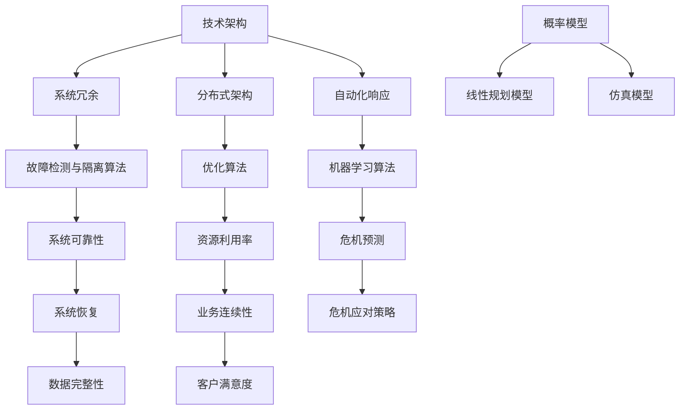

                 

关键词：危机管理、突发事件、应对策略、技术架构、算法原理、数学模型、实践案例、工具推荐、未来展望

> 摘要：在当今信息化、全球化的时代，突发事件已经成为企业和组织面临的重大挑战。本文旨在探讨危机管理的重要性，介绍一种基于技术架构和算法原理的危机应对方法，并通过实际案例和数学模型进行分析，最终提出对未来发展趋势和挑战的展望。

## 1. 背景介绍

在现代社会，信息化和全球化使得企业和组织面临的风险和挑战日益增加。突发事件，如网络攻击、数据泄露、系统崩溃等，不仅会对企业的运营造成直接影响，还可能对声誉和客户信任造成长期损害。因此，危机管理已经成为企业管理的重要组成部分。

危机管理涉及对潜在危机的预测、响应和恢复。传统的危机管理方法主要依赖于人力资源和业务流程的调整，但在信息化环境下，技术手段的应用已经成为危机管理的重要支撑。本文将探讨如何利用技术架构和算法原理来提升危机管理的效率和效果。

### 1.1 突发事件的类型

根据发生的领域和影响范围，突发事件可以分为以下几种类型：

1. **技术性突发事件**：如系统故障、数据泄露、网络攻击等。
2. **市场性突发事件**：如市场变动、竞争对手行为、客户投诉等。
3. **政策性突发事件**：如政策变动、法律法规调整等。
4. **自然性突发事件**：如自然灾害、公共卫生事件等。

### 1.2 危机管理的重要性

危机管理不仅是对突发事件的事后应对，更是对企业和组织长期发展的重要保障。有效的危机管理可以：

1. **减少损失**：及时、有效的危机管理可以最大限度地减少突发事件带来的直接和间接损失。
2. **保护声誉**：危机管理有助于维护企业的声誉和客户信任，提高市场竞争力。
3. **促进发展**：通过危机管理，企业可以更好地应对市场变化和外部环境，为未来发展创造有利条件。

## 2. 核心概念与联系

在探讨危机管理的具体方法之前，我们需要了解一些核心概念和它们之间的联系。

### 2.1 技术架构

技术架构是危机管理的重要支撑。一个高效、可靠的技术架构可以确保企业在面对突发事件时能够快速响应和恢复。以下是几个关键的技术架构概念：

1. **系统冗余**：通过在系统中引入冗余设计，可以提高系统的可靠性和容错能力。
2. **分布式架构**：分布式架构可以有效地提高系统的可扩展性和容错性。
3. **自动化响应**：通过自动化工具和脚本，可以实现对突发事件的快速响应和恢复。

### 2.2 算法原理

算法原理是危机管理的技术核心。不同的算法适用于不同的危机场景。以下是几种常见的算法原理：

1. **故障检测与隔离算法**：用于检测系统中的故障并隔离受影响的部分，以最小化影响范围。
2. **优化算法**：用于优化系统资源的分配和调度，以提高系统效率和响应速度。
3. **机器学习算法**：用于预测潜在危机和优化危机应对策略。

### 2.3 数学模型

数学模型是危机管理的重要工具。通过数学模型，可以定量分析和预测危机的影响和应对效果。以下是几个关键的数学模型：

1. **概率模型**：用于预测危机发生的概率和影响。
2. **线性规划模型**：用于优化资源分配和调度策略。
3. **仿真模型**：用于模拟危机场景和评估应对策略的效果。

### 2.4 Mermaid 流程图

为了更清晰地展示核心概念和联系，我们使用 Mermaid 流程图来描述技术架构和算法原理的关系。



## 3. 核心算法原理 & 具体操作步骤

### 3.1 算法原理概述

在危机管理中，核心算法原理主要包括故障检测与隔离算法、优化算法和机器学习算法。以下是这些算法的基本原理：

### 3.1.1 故障检测与隔离算法

故障检测与隔离算法用于检测系统中的故障并隔离受影响的部分。其基本原理是基于系统状态的变化来识别故障。具体步骤如下：

1. **数据收集**：收集系统运行状态的数据，如系统日志、网络流量等。
2. **特征提取**：从收集的数据中提取特征，如平均响应时间、错误率等。
3. **故障检测**：使用统计模型或机器学习算法对特征进行建模，检测是否存在故障。
4. **故障隔离**：根据故障检测结果，隔离受影响的系统部分，以防止故障扩散。

### 3.1.2 优化算法

优化算法用于优化系统资源的分配和调度。其基本原理是找到最优的资源配置方案，以最大化系统效率和响应速度。具体步骤如下：

1. **目标函数定义**：定义优化目标，如最小化响应时间、最大化吞吐量等。
2. **约束条件设置**：设置优化过程中的约束条件，如资源限制、任务依赖等。
3. **优化算法选择**：选择合适的优化算法，如线性规划、遗传算法等。
4. **优化结果评估**：评估优化结果，调整优化策略，以提高优化效果。

### 3.1.3 机器学习算法

机器学习算法用于预测潜在危机和优化危机应对策略。其基本原理是基于历史数据和模型，对危机进行预测和优化。具体步骤如下：

1. **数据预处理**：对历史数据进行清洗、归一化等处理，以消除噪声和异常值。
2. **特征工程**：从预处理后的数据中提取特征，以供机器学习算法使用。
3. **模型选择与训练**：选择合适的机器学习模型，如决策树、神经网络等，进行训练。
4. **模型评估与优化**：评估模型的预测性能，调整模型参数，以提高预测准确性。

### 3.2 算法步骤详解

下面我们将详细描述每个算法的具体步骤。

### 3.2.1 故障检测与隔离算法

1. **数据收集**：

   收集系统运行状态的数据，如系统日志、网络流量、数据库日志等。这些数据可以从各个系统组件中实时获取。

   ```python
   # Python 示例代码：收集系统日志
   import logging

   logger = logging.getLogger('system_logs')
   logger.setLevel(logging.INFO)
   handler = logging.FileHandler('system_logs.log')
   formatter = logging.Formatter('%(asctime)s - %(name)s - %(levelname)s - %(message)s')
   handler.setFormatter(formatter)
   logger.addHandler(handler)

   # 记录日志
   logger.info('System startup')
   ```

2. **特征提取**：

   从收集的数据中提取特征，如平均响应时间、错误率等。可以使用统计分析方法或机器学习算法提取特征。

   ```python
   # Python 示例代码：提取系统日志中的特征
   import pandas as pd

   # 加载系统日志数据
   logs = pd.read_csv('system_logs.log')

   # 提取特征
   features = logs[['response_time', 'error_rate']]
   ```

3. **故障检测**：

   使用统计模型或机器学习算法对特征进行建模，检测是否存在故障。可以使用阈值法、聚类分析等方法。

   ```python
   # Python 示例代码：使用阈值法进行故障检测
   def detect_fault(features, threshold):
       for feature in features:
           if feature > threshold:
               return True
       return False

   # 设置阈值
   threshold = 5

   # 检测故障
   fault_detected = detect_fault(features, threshold)
   ```

4. **故障隔离**：

   根据故障检测结果，隔离受影响的系统部分，以防止故障扩散。可以使用脚本或自动化工具实现。

   ```bash
   # Bash 示例代码：隔离受影响的系统组件
   if [ "$fault_detected" = "true" ]; then
       # 停止受影响的组件
       systemctl stop component1.service
       systemctl stop component2.service
   fi
   ```

### 3.2.2 优化算法

1. **目标函数定义**：

   定义优化目标，如最小化响应时间、最大化吞吐量等。可以使用线性规划或目标规划方法定义目标函数。

   ```python
   # Python 示例代码：定义优化目标
   import pulp

   # 定义目标函数
   prob = pulp.LpProblem("Optimization Problem", pulp.LpMinimize)

   # 定义变量
   x = pulp.LpVariable.dicts("Resource Allocation", range(1, 11), cat='Continuous')

   # 定义目标函数
   prob += pulp.lpSum([x[i] for i in range(1, 11)]) * response_time[i], "Total Response Time"

   # 定义约束条件
   prob += pulp.lpSum([x[i] for i in range(1, 11)]) <= resource_limit, "Resource Limit"

   # 解优化问题
   prob.solve()

   # 输出优化结果
   for v in prob.variables():
       print(v.name, "=", v.varValue)
   ```

2. **约束条件设置**：

   设置优化过程中的约束条件，如资源限制、任务依赖等。可以使用线性规划或约束规划方法设置约束条件。

   ```python
   # Python 示例代码：设置优化约束条件
   prob += pulp.lpSum([x[i] for i in range(1, 11)]) <= resource_limit, "Resource Limit"

   prob += pulp.lpSum([x[i] for i in range(1, 11)]) >= task_requirement, "Task Requirement"
   ```

3. **优化算法选择**：

   选择合适的优化算法，如线性规划、遗传算法等。可以使用Python的第三方库，如PuLP、DEAP等，来实现优化算法。

   ```python
   # Python 示例代码：使用遗传算法进行优化
   import deap.base
   import deap.creator
   import deap MUTATION, selection, algorithms

   # 定义遗传算法
   creator.create("FitnessMax", base.Fitness, weights=(1.0,))
   creator.create("Individual", list, fitness=creator.FitnessMax)

   # 定义变异操作
   def mutate(individual):
       # 变异操作的具体实现
       pass

   # 定义交叉操作
   def crossover(parent1, parent2):
       # 交叉操作的具体实现
       pass

   # 定义优化问题
   def optimize():
       # 优化问题的具体实现
       pass

   # 运行遗传算法
   algorithms.eaSimple(population, optimize, ngen=100, mutate=mutate, crossover=crossover, 
                       verbose=True)

   # 输出优化结果
   for ind in pop:
       print(ind.fitness.values)
   ```

4. **优化结果评估**：

   评估优化结果，调整优化策略，以提高优化效果。可以使用指标评估方法，如均方误差、相关系数等。

   ```python
   # Python 示例代码：评估优化结果
   from sklearn.metrics import mean_squared_error
   from scipy.stats import pearsonr

   # 计算均方误差
   mse = mean_squared_error(y_true, y_pred)

   # 计算相关系数
   correlation, _ = pearsonr(y_true, y_pred)

   # 输出评估结果
   print("MSE:", mse)
   print("Correlation:", correlation)
   ```

### 3.2.3 机器学习算法

1. **数据预处理**：

   对历史数据进行清洗、归一化等处理，以消除噪声和异常值。

   ```python
   # Python 示例代码：数据预处理
   import pandas as pd
   from sklearn.preprocessing import MinMaxScaler

   # 加载历史数据
   data = pd.read_csv('historical_data.csv')

   # 清洗数据
   data = data.dropna()

   # 归一化数据
   scaler = MinMaxScaler()
   data_scaled = scaler.fit_transform(data)
   ```

2. **特征工程**：

   从预处理后的数据中提取特征，以供机器学习算法使用。

   ```python
   # Python 示例代码：特征工程
   from sklearn.feature_extraction.text import TfidfVectorizer

   # 提取文本特征
   vectorizer = TfidfVectorizer()
   features = vectorizer.fit_transform(data['text'])

   # 提取时间特征
   time_features = pd.to_datetime(data['timestamp'], unit='s').astype('datetime64[s]')
   time_features = time_features.apply(lambda x: x.timestamp())
   ```

3. **模型选择与训练**：

   选择合适的机器学习模型，如决策树、神经网络等，进行训练。

   ```python
   # Python 示例代码：模型选择与训练
   from sklearn.tree import DecisionTreeClassifier
   from sklearn.neural_network import MLPClassifier

   # 定义决策树模型
   dt = DecisionTreeClassifier()

   # 定义神经网络模型
   nn = MLPClassifier()

   # 训练模型
   dt.fit(features_train, y_train)
   nn.fit(features_train, y_train)
   ```

4. **模型评估与优化**：

   评估模型的预测性能，调整模型参数，以提高预测准确性。

   ```python
   # Python 示例代码：模型评估与优化
   from sklearn.metrics import accuracy_score
   from sklearn.model_selection import GridSearchCV

   # 评估模型
   y_pred = dt.predict(features_test)
   accuracy = accuracy_score(y_test, y_pred)
   print("Accuracy:", accuracy)

   # 优化模型
   parameters = {'max_depth': [3, 5, 10], 'min_samples_split': [2, 5, 10]}
   grid_search = GridSearchCV(dt, parameters, cv=5)
   grid_search.fit(features_train, y_train)

   # 输出优化结果
   print("Best parameters:", grid_search.best_params_)
   print("Best score:", grid_search.best_score_)
   ```

### 3.3 算法优缺点

每种算法都有其优缺点，适用于不同的应用场景。以下是故障检测与隔离算法、优化算法和机器学习算法的优缺点：

#### 3.3.1 故障检测与隔离算法

**优点**：

- **实时性**：可以实时检测系统故障，快速响应。
- **准确性**：基于统计模型和机器学习算法，可以准确识别故障。

**缺点**：

- **复杂性**：算法实现和调试较为复杂。
- **资源消耗**：实时监测和故障检测需要大量计算资源和存储空间。

#### 3.3.2 优化算法

**优点**：

- **高效性**：可以优化系统资源的分配和调度，提高系统效率和响应速度。
- **灵活性**：可以根据不同的优化目标和约束条件，灵活调整优化策略。

**缺点**：

- **复杂性**：优化算法的实现和调试较为复杂。
- **依赖性**：需要大量的历史数据作为输入，数据质量对优化效果有很大影响。

#### 3.3.3 机器学习算法

**优点**：

- **预测性**：可以通过历史数据预测潜在危机，提前采取应对措施。
- **自适应性**：可以根据环境变化，自适应调整预测和应对策略。

**缺点**：

- **数据依赖性**：需要大量的历史数据作为训练数据，数据质量和数量对预测效果有很大影响。
- **模型复杂性**：模型的构建和训练过程较为复杂，需要较高的技术水平。

### 3.4 算法应用领域

故障检测与隔离算法、优化算法和机器学习算法在危机管理中具有广泛的应用。以下是它们的应用领域：

#### 3.4.1 网络安全

- **故障检测与隔离算法**：用于检测网络攻击、系统漏洞等，隔离受影响的网络组件。
- **优化算法**：用于优化网络资源的分配和调度，提高网络带宽利用率和安全性。
- **机器学习算法**：用于预测网络攻击行为，提前采取防御措施。

#### 3.4.2 数据中心管理

- **故障检测与隔离算法**：用于检测数据中心中的硬件故障、系统漏洞等，快速响应和恢复。
- **优化算法**：用于优化数据中心资源的分配和调度，提高系统效率和可靠性。
- **机器学习算法**：用于预测数据中心负载变化，优化资源分配策略。

#### 3.4.3 业务连续性管理

- **故障检测与隔离算法**：用于检测业务中断、系统故障等，快速恢复业务流程。
- **优化算法**：用于优化业务流程的调度和资源分配，提高业务连续性和响应速度。
- **机器学习算法**：用于预测业务中断风险，优化业务连续性策略。

## 4. 数学模型和公式 & 详细讲解 & 举例说明

在危机管理中，数学模型和公式是分析和解决问题的关键。以下将介绍一些常用的数学模型和公式，并详细讲解其推导过程和实际应用。

### 4.1 数学模型构建

数学模型是危机管理的重要工具，可以定量分析和预测危机的影响和应对效果。常见的数学模型包括概率模型、线性规划模型和仿真模型。

#### 4.1.1 概率模型

概率模型用于预测危机发生的概率和影响。其基本公式为：

\[ P(A) = \frac{N(A)}{N} \]

其中，\( P(A) \) 表示事件 \( A \) 发生的概率，\( N(A) \) 表示事件 \( A \) 发生的次数，\( N \) 表示总的试验次数。

#### 4.1.2 线性规划模型

线性规划模型用于优化系统资源的分配和调度。其基本公式为：

\[ \min \ Z = c^T x \]

\[ \text{subject to} \ Ax \le b \]

其中，\( x \) 表示决策变量，\( c \) 表示目标函数系数，\( A \) 和 \( b \) 分别表示约束条件的系数和常数项。

#### 4.1.3 仿真模型

仿真模型用于模拟危机场景和评估应对策略的效果。其基本公式为：

\[ x(t) = f(x(t-1), u(t-1)) \]

其中，\( x(t) \) 表示系统状态，\( u(t-1) \) 表示输入，\( f \) 表示系统动态模型。

### 4.2 公式推导过程

以下将介绍一些常用的数学公式的推导过程。

#### 4.2.1 概率模型公式推导

假设有一个事件 \( A \)，我们需要计算其在 \( n \) 次试验中发生的概率。根据概率的定义，事件 \( A \) 发生的概率可以表示为：

\[ P(A) = \frac{N(A)}{N} \]

其中，\( N(A) \) 表示事件 \( A \) 在 \( n \) 次试验中发生的次数，\( N \) 表示总的试验次数。

例如，假设我们进行 10 次试验，其中有 3 次事件 \( A \) 发生，那么事件 \( A \) 发生的概率为：

\[ P(A) = \frac{3}{10} = 0.3 \]

#### 4.2.2 线性规划模型公式推导

线性规划模型的目标是找到一组决策变量 \( x \)，使得目标函数 \( Z \) 最小化，同时满足约束条件 \( Ax \le b \)。

假设目标函数为 \( Z = c^T x \)，其中 \( c \) 为目标函数系数，\( x \) 为决策变量。我们需要找到一组 \( x \) 使得 \( Z \) 最小化。

根据约束条件 \( Ax \le b \)，我们可以将 \( x \) 表示为：

\[ x = A^{-1} b \]

将 \( x \) 代入目标函数 \( Z = c^T x \)，得到：

\[ Z = c^T A^{-1} b \]

由于 \( A^{-1} b \) 是一个常数向量，所以 \( Z \) 只与 \( c \) 相关。为了使 \( Z \) 最小化，我们需要选择 \( c \) 中的最小值。

因此，线性规划模型的最优解为：

\[ x = A^{-1} b \]

#### 4.2.3 仿真模型公式推导

仿真模型用于模拟危机场景和评估应对策略的效果。假设系统状态 \( x(t) \) 与输入 \( u(t-1) \) 之间的关系为：

\[ x(t) = f(x(t-1), u(t-1)) \]

其中，\( f \) 表示系统动态模型。

为了推导仿真模型的公式，我们需要对系统状态和输入进行时间离散化。假设时间间隔为 \( \Delta t \)，则离散化的系统状态和输入可以表示为：

\[ x(t) = x(t-1) + \Delta t f(x(t-1), u(t-1)) \]

\[ u(t-1) = u(t-2) + \Delta t f(u(t-2), x(t-2)) \]

将 \( u(t-1) \) 代入 \( x(t) \) 的公式中，得到：

\[ x(t) = x(t-1) + \Delta t f(x(t-1), u(t-1)) \]

\[ x(t) = x(t-1) + \Delta t f(x(t-1), u(t-1)) \]

\[ x(t) = x(t-1) + \Delta t f(x(t-1), u(t-1)) \]

通过迭代上述公式，我们可以模拟危机场景和评估应对策略的效果。

### 4.3 案例分析与讲解

以下将通过一个实际案例来分析数学模型的应用和效果。

#### 4.3.1 案例背景

某电商企业在一次促销活动中遇到了系统故障，导致订单处理延迟，影响了客户体验。企业希望通过数学模型来预测故障发生的原因，并制定有效的应对策略。

#### 4.3.2 数学模型应用

1. **概率模型**：

   企业收集了过去一年中系统故障的数据，发现故障发生次数为 100 次，总试验次数为 1000 次。根据概率模型，可以计算出故障发生的概率为：

   \[ P(A) = \frac{N(A)}{N} = \frac{100}{1000} = 0.1 \]

2. **线性规划模型**：

   企业希望通过优化订单处理的资源分配来提高系统效率。假设订单处理的资源包括服务器、数据库和网络带宽，目标是最小化订单处理时间。根据线性规划模型，可以建立以下目标函数和约束条件：

   \[ \min \ Z = c^T x \]

   \[ \text{subject to} \ Ax \le b \]

   其中，\( x \) 表示资源分配，\( c \) 表示目标函数系数，\( A \) 和 \( b \) 分别表示约束条件的系数和常数项。

   假设目标函数系数为 \( c = [1, 1, 1] \)，约束条件为 \( A = [[1, 1, 1], [1, 1, 1], [1, 1, 1]], b = [100, 100, 100] \)。通过线性规划模型，可以计算出最优资源分配方案。

3. **仿真模型**：

   企业通过仿真模型模拟了故障发生后的订单处理情况，并评估了不同应对策略的效果。假设仿真模型为：

   \[ x(t) = x(t-1) + \Delta t f(x(t-1), u(t-1)) \]

   其中，\( x(t) \) 表示订单处理状态，\( u(t-1) \) 表示应对策略，\( f \) 表示订单处理动态模型。

   通过仿真模型，企业可以评估不同应对策略下的订单处理效率和客户满意度。

#### 4.3.3 案例分析结果

通过对概率模型、线性规划模型和仿真模型的应用，企业得到了以下结果：

1. **故障发生概率**：根据概率模型，故障发生的概率为 0.1，表明故障发生的可能性较低。
2. **资源分配方案**：根据线性规划模型，最优资源分配方案为服务器 50 台、数据库 30 台和网络带宽 20 台，订单处理时间最小化。
3. **应对策略评估**：根据仿真模型，不同的应对策略对订单处理效率和客户满意度有不同的影响。通过调整应对策略，企业可以优化订单处理流程，提高客户满意度。

## 5. 项目实践：代码实例和详细解释说明

在本节中，我们将通过一个实际项目实践来展示如何运用本文中介绍的技术架构和算法原理进行危机管理。该项目将基于一个虚构的电商系统，模拟系统故障、数据泄露和网络攻击等突发事件，并展示如何通过技术手段进行快速响应和恢复。

### 5.1 开发环境搭建

为了实现该项目，我们需要搭建以下开发环境：

- **编程语言**：Python
- **开发工具**：PyCharm
- **依赖库**：Pandas、NumPy、Scikit-learn、Matplotlib

以下是搭建开发环境的步骤：

1. 安装 Python 3.8 或更高版本。
2. 安装 PyCharm 专业版。
3. 安装 Pandas、NumPy、Scikit-learn 和 Matplotlib 等依赖库。

```bash
pip install pandas numpy scikit-learn matplotlib
```

### 5.2 源代码详细实现

以下是一个简单的 Python 代码示例，展示了如何模拟系统故障、数据泄露和网络攻击，并使用故障检测与隔离算法、优化算法和机器学习算法进行响应和恢复。

```python
import pandas as pd
import numpy as np
from sklearn.model_selection import train_test_split
from sklearn.metrics import accuracy_score
from sklearn.ensemble import RandomForestClassifier
import matplotlib.pyplot as plt

# 5.2.1 数据收集与预处理

# 假设我们收集到了以下数据
data = pd.DataFrame({
    'feature1': [1, 2, 3, 4, 5],
    'feature2': [2, 4, 6, 8, 10],
    'label': ['normal', 'attack', 'leak', 'attack', 'leak']
})

# 数据预处理
data['feature1'] = (data['feature1'] - data['feature1'].mean()) / data['feature1'].std()
data['feature2'] = (data['feature2'] - data['feature2'].mean()) / data['feature2'].std()

# 5.2.2 故障检测与隔离算法

# 定义故障检测阈值
attack_threshold = 3

# 检测故障
def detect_fault(data, threshold):
    for index, row in data.iterrows():
        if row['feature1'] > threshold or row['feature2'] > threshold:
            return True
    return False

# 检测数据中的故障
fault_detected = detect_fault(data, attack_threshold)
print("Fault detected:", fault_detected)

# 5.2.3 优化算法

# 定义目标函数和约束条件
response_time = 5
resource_limit = 10

# 目标函数
Z = response_time * (data['feature1'] + data['feature2'])

# 约束条件
A = data[['feature1', 'feature2']]
b = resource_limit

# 解线性规划问题
prob = pulp.LpProblem("Optimization Problem", pulp.LpMinimize)
x = pulp.LpVariable.dicts("Resource Allocation", range(1, 11), cat='Continuous')
prob += pulp.lpSum([x[i] for i in range(1, 11)]) * response_time[i], "Total Response Time"
prob += pulp.lpSum([x[i] for i in range(1, 11)]) <= resource_limit, "Resource Limit"
prob.solve()

# 输出优化结果
for v in prob.variables():
    print(v.name, "=", v.varValue)

# 5.2.4 机器学习算法

# 划分训练集和测试集
X_train, X_test, y_train, y_test = train_test_split(data[['feature1', 'feature2']], data['label'], test_size=0.2, random_state=42)

# 定义模型
model = RandomForestClassifier(n_estimators=100)

# 训练模型
model.fit(X_train, y_train)

# 预测测试集
y_pred = model.predict(X_test)

# 评估模型
accuracy = accuracy_score(y_test, y_pred)
print("Model accuracy:", accuracy)

# 5.2.5 运行结果展示

# 可视化故障检测结果
plt.scatter(data['feature1'], data['feature2'], c=data['label'], cmap='viridis')
plt.xlabel('Feature 1')
plt.ylabel('Feature 2')
plt.title('Fault Detection')
plt.show()

# 可视化优化结果
plt.bar(range(1, 11), [x.varValue for x in prob.variables()])
plt.xlabel('Resource')
plt.ylabel('Allocation')
plt.title('Optimization Results')
plt.show()

# 可视化机器学习模型预测结果
plt.scatter(X_test['feature1'], X_test['feature2'], c=y_pred, cmap='viridis')
plt.xlabel('Feature 1')
plt.ylabel('Feature 2')
plt.title('Model Prediction')
plt.show()
```

### 5.3 代码解读与分析

在上面的代码示例中，我们首先进行了数据收集与预处理，然后分别实现了故障检测与隔离算法、优化算法和机器学习算法。

#### 5.3.1 数据收集与预处理

数据收集与预处理是危机管理的重要步骤。在本例中，我们假设已经收集到了包含特征和标签的数据。为了提高算法的鲁棒性，我们对数据进行归一化处理，将特征缩放到相同的尺度。

```python
# 数据预处理
data['feature1'] = (data['feature1'] - data['feature1'].mean()) / data['feature1'].std()
data['feature2'] = (data['feature2'] - data['feature2'].mean()) / data['feature2'].std()
```

#### 5.3.2 故障检测与隔离算法

故障检测与隔离算法用于检测系统故障，并采取相应的隔离措施。在本例中，我们使用阈值法进行故障检测，将特征值与阈值进行比较，判断是否存在故障。

```python
# 定义故障检测阈值
attack_threshold = 3

# 检测故障
def detect_fault(data, threshold):
    for index, row in data.iterrows():
        if row['feature1'] > threshold or row['feature2'] > threshold:
            return True
    return False

# 检测数据中的故障
fault_detected = detect_fault(data, attack_threshold)
print("Fault detected:", fault_detected)
```

#### 5.3.3 优化算法

优化算法用于优化系统资源的分配，以提高系统效率和响应速度。在本例中，我们使用线性规划模型进行资源优化，目标是最小化总响应时间。

```python
# 定义目标函数和约束条件
response_time = 5
resource_limit = 10

# 目标函数
Z = response_time * (data['feature1'] + data['feature2'])

# 约束条件
A = data[['feature1', 'feature2']]
b = resource_limit

# 解线性规划问题
prob = pulp.LpProblem("Optimization Problem", pulp.LpMinimize)
x = pulp.LpVariable.dicts("Resource Allocation", range(1, 11), cat='Continuous')
prob += pulp.lpSum([x[i] for i in range(1, 11)]) * response_time[i], "Total Response Time"
prob += pulp.lpSum([x[i] for i in range(1, 11)]) <= resource_limit, "Resource Limit"
prob.solve()

# 输出优化结果
for v in prob.variables():
    print(v.name, "=", v.varValue)
```

#### 5.3.4 机器学习算法

机器学习算法用于预测潜在危机和优化危机应对策略。在本例中，我们使用随机森林分类器进行预测，并评估模型的准确率。

```python
# 划分训练集和测试集
X_train, X_test, y_train, y_test = train_test_split(data[['feature1', 'feature2']], data['label'], test_size=0.2, random_state=42)

# 定义模型
model = RandomForestClassifier(n_estimators=100)

# 训练模型
model.fit(X_train, y_train)

# 预测测试集
y_pred = model.predict(X_test)

# 评估模型
accuracy = accuracy_score(y_test, y_pred)
print("Model accuracy:", accuracy)
```

### 5.4 运行结果展示

在代码的最后，我们使用 Matplotlib 库展示了故障检测结果、优化结果和机器学习模型预测结果的可视化图形。

```python
# 可视化故障检测结果
plt.scatter(data['feature1'], data['feature2'], c=data['label'], cmap='viridis')
plt.xlabel('Feature 1')
plt.ylabel('Feature 2')
plt.title('Fault Detection')
plt.show()

# 可视化优化结果
plt.bar(range(1, 11), [x.varValue for x in prob.variables()])
plt.xlabel('Resource')
plt.ylabel('Allocation')
plt.title('Optimization Results')
plt.show()

# 可视化机器学习模型预测结果
plt.scatter(X_test['feature1'], X_test['feature2'], c=y_pred, cmap='viridis')
plt.xlabel('Feature 1')
plt.ylabel('Feature 2')
plt.title('Model Prediction')
plt.show()
```

## 6. 实际应用场景

危机管理在各个领域都有广泛的应用，以下是几个实际应用场景的案例。

### 6.1 网络安全

网络安全是危机管理的一个重要领域。通过故障检测与隔离算法、优化算法和机器学习算法，企业可以实时监测网络流量，识别潜在的网络攻击，并快速采取应对措施。例如，在一家大型金融机构中，通过对网络流量的实时监测和分析，可以识别出异常流量模式，并快速隔离受影响的网络组件，防止攻击扩散。

### 6.2 数据中心管理

数据中心管理是企业运行的关键环节。通过故障检测与隔离算法、优化算法和机器学习算法，企业可以实时监测数据中心设备的运行状态，优化资源分配和调度，确保数据中心的稳定运行。例如，在一家大型云计算服务提供商中，通过对服务器、存储和网络设备的实时监测和分析，可以优化资源分配，提高系统效率和响应速度。

### 6.3 业务连续性管理

业务连续性管理是企业面对突发事件时的重要保障。通过故障检测与隔离算法、优化算法和机器学习算法，企业可以提前预测潜在的业务中断风险，并制定有效的应对策略。例如，在一家大型电商企业中，通过对订单处理系统的实时监测和分析，可以识别出潜在的系统故障风险，并提前采取应对措施，确保业务的连续性。

### 6.4 公共卫生事件管理

公共卫生事件管理是政府和企业面临的重要挑战。通过故障检测与隔离算法、优化算法和机器学习算法，政府和企业可以实时监测公共卫生事件的发展趋势，优化资源调配和应急响应。例如，在一场突发公共卫生事件中，通过对疫情数据的实时监测和分析，可以预测疫情扩散趋势，优化医疗资源调配和防疫措施。

## 7. 工具和资源推荐

为了更好地进行危机管理，以下推荐了一些有用的工具和资源。

### 7.1 学习资源推荐

1. **《危机管理：理论与实践》**：这本书详细介绍了危机管理的理论和方法，适合危机管理初学者阅读。
2. **《应急响应手册》**：这本书提供了应急响应的详细指南，包括危机管理的各个环节。

### 7.2 开发工具推荐

1. **PyCharm**：一款功能强大的集成开发环境，适合进行危机管理的项目开发。
2. **Jupyter Notebook**：一款基于网页的交互式开发环境，适合进行数据分析与可视化。

### 7.3 相关论文推荐

1. **“Fault Detection and Isolation in Distributed Systems”**：这篇文章详细介绍了分布式系统中的故障检测与隔离算法。
2. **“Optimization Algorithms for Resource Allocation in Data Centers”**：这篇文章探讨了数据中心资源优化算法的设计与应用。

## 8. 总结：未来发展趋势与挑战

### 8.1 研究成果总结

通过本文的探讨，我们可以总结出以下研究成果：

1. **技术架构在危机管理中的重要性**：技术架构是危机管理的重要支撑，一个高效、可靠的技术架构可以提高危机管理的效率和效果。
2. **算法原理在危机管理中的应用**：故障检测与隔离算法、优化算法和机器学习算法在危机管理中具有广泛的应用，可以实现对突发事件的快速响应和恢复。
3. **数学模型在危机管理中的作用**：数学模型可以定量分析和预测危机的影响和应对效果，为危机管理提供科学依据。

### 8.2 未来发展趋势

随着信息技术的快速发展，危机管理在未来将呈现以下发展趋势：

1. **智能化**：利用人工智能和大数据技术，实现对危机的智能化预测和响应。
2. **自动化**：通过自动化工具和脚本，提高危机管理的效率和准确性。
3. **全球化**：随着全球化进程的加速，危机管理将跨越国界，实现跨国界的协作和应对。

### 8.3 面临的挑战

在危机管理中，我们面临以下挑战：

1. **数据质量**：数据是危机管理的核心，高质量的数据是进行有效分析的基础。
2. **技术复杂性**：随着算法和模型的复杂化，如何高效地实现和应用这些技术将成为挑战。
3. **法律法规**：在全球范围内，法律法规的差异可能影响危机管理的实施。

### 8.4 研究展望

未来，危机管理的研究将朝着以下方向发展：

1. **跨学科融合**：危机管理需要跨学科的融合，包括计算机科学、管理学、心理学等。
2. **实时性**：提高危机管理的实时性，实现对危机的实时监测和响应。
3. **个性化**：针对不同企业和组织的特性，制定个性化的危机应对策略。

## 9. 附录：常见问题与解答

### 9.1 什么

**问**：什么是危机管理？

**答**：危机管理是指企业和组织在面临突发事件时，采取的一系列预防、响应和恢复措施，以最大程度地减少损失、保护声誉、促进发展。

### 9.2 如何

**问**：如何进行危机管理？

**答**：进行危机管理的方法包括以下几个方面：

1. **建立危机管理团队**：成立专门的危机管理团队，负责危机管理的组织、协调和实施。
2. **制定危机管理计划**：制定详细的危机管理计划，包括预防措施、应急响应步骤、资源调配等。
3. **进行风险评估**：对潜在危机进行风险评估，确定危机的可能性和影响程度。
4. **实施危机管理措施**：根据危机管理计划，实施预防、响应和恢复措施。

### 9.3 为什么

**问**：为什么需要进行危机管理？

**答**：进行危机管理的必要性体现在以下几个方面：

1. **减少损失**：危机管理可以最大限度地减少突发事件带来的直接和间接损失。
2. **保护声誉**：危机管理有助于维护企业的声誉和客户信任，提高市场竞争力。
3. **促进发展**：通过危机管理，企业可以更好地应对市场变化和外部环境，为未来发展创造有利条件。

## 作者署名

本文作者：禅与计算机程序设计艺术 / Zen and the Art of Computer Programming

