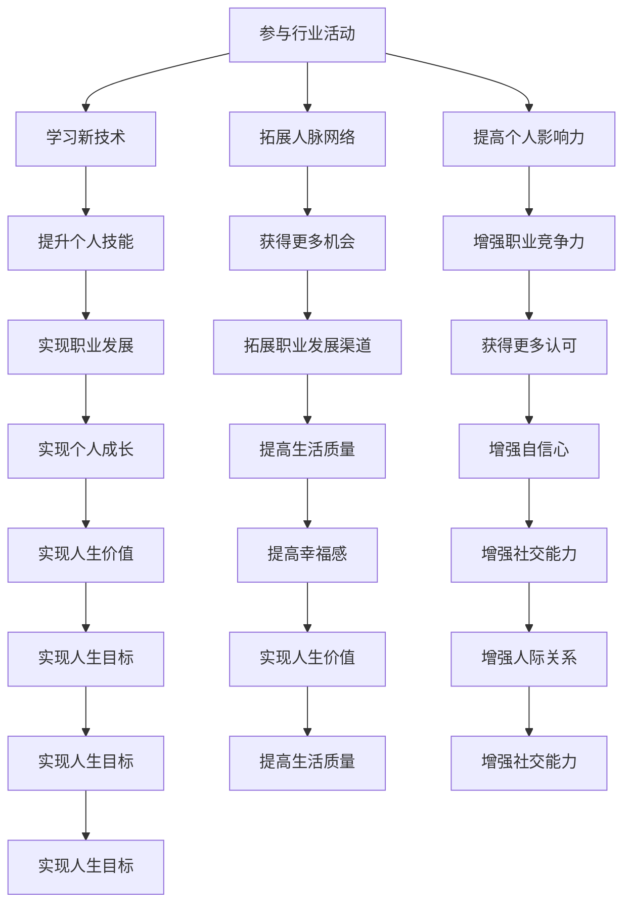

                 

关键词：行业活动，人脉网络，影响力，技术交流，职业发展

> 摘要：本文探讨了参与行业活动的重要性，以及如何通过这些活动来扩大人脉网络和提高个人影响力。文章首先介绍了行业活动的类型和特点，然后详细分析了参与行业活动的优势，并给出了一些建议和策略，帮助读者更好地参与这些活动，实现职业发展和个人成长。

## 1. 背景介绍

在当今快速发展的科技时代，信息技术和互联网的普及使得行业活动的形式和规模都发生了巨大的变化。无论是大型技术会议、专业论坛，还是社区聚会、网络研讨会，这些活动都为专业人士提供了一个交流和学习的平台。参与行业活动不仅有助于个人技能的提升，还能够拓展人脉网络，提高个人影响力。

### 1.1 行业活动的定义和类型

行业活动是指针对某一特定行业或领域举办的会议、论坛、展览、研讨会等活动。这些活动通常包括以下几个方面：

- **技术会议**：如全球软件开发者大会（Google I/O）、微软开发者大会（Microsoft Build）等，旨在展示新技术、分享最佳实践和解决方案。

- **论坛**：如世界互联网大会（World Internet Conference）、全球AI大会（GAIC）等，通常由行业专家和学者发表主题演讲，讨论行业趋势和挑战。

- **展览**：如消费电子展（CES）、国际航空航天展览（Farnborough International Airshow）等，展示最新的产品和技术。

- **研讨会**：如技术沙龙、主题研讨会等，通常聚焦于某一具体技术领域或应用场景的深入讨论。

### 1.2 行业活动的特点

行业活动具有以下特点：

- **专业性**：这些活动通常由行业内的专业人士组织，参会者都是具有相关经验和知识的人士，这使得活动具有较高的专业水平。

- **互动性**：行业活动通常包括演讲、讨论、互动环节等，有助于参会者之间的交流和互动。

- **时效性**：许多行业活动都具有时效性，能够迅速传达行业最新动态和技术趋势。

- **国际性**：许多行业活动具有国际性，吸引了来自世界各地的参与者，有助于拓展国际视野。

## 2. 核心概念与联系

为了更好地理解行业活动的重要性，我们首先需要了解几个核心概念：

### 2.1 人脉网络

人脉网络是指个人与他人之间建立的联系和关系。这些联系可以是朋友、同事、客户、合作伙伴等。一个强大的人脉网络有助于个人在职业发展中获得更多的机会和资源。

### 2.2 个人影响力

个人影响力是指个人在某个领域或社群中产生的影响和号召力。通过参与行业活动，个人可以展示自己的专业知识和经验，从而提高个人影响力。

### 2.3 行业活动与个人发展的关系

行业活动与个人发展密切相关。通过参与这些活动，个人可以：

- 学习最新技术和行业动态，提升个人技能。

- 与行业专家和同行交流，拓展人脉网络。

- 展示个人能力和专业知识，提高个人影响力。

### 2.4 Mermaid 流程图

下面是一个简单的 Mermaid 流程图，展示了行业活动与个人发展的关系：



## 3. 核心算法原理 & 具体操作步骤

### 3.1 算法原理概述

参与行业活动是一种有效的社交行为，其核心原理可以概括为以下几点：

- **主动参与**：积极参与活动，主动与他人交流，建立联系。

- **展示自我**：通过演讲、讨论、展示项目等方式，展示个人专业知识和能力。

- **倾听学习**：倾听他人的经验和观点，学习最新的技术和行业动态。

- **资源整合**：通过活动，整合人脉资源，获取更多的机会和资源。

### 3.2 算法步骤详解

参与行业活动的具体操作步骤可以分为以下几个阶段：

1. **规划参与**：确定感兴趣的活动类型和主题，提前规划参与。

2. **准备展示**：准备个人展示内容，如演讲稿、项目报告等。

3. **积极参与**：在现场，积极参与讨论和互动，主动与参会者交流。

4. **建立联系**：通过名片交换、社交媒体关注等方式，与参会者建立联系。

5. **后续跟进**：活动结束后，通过邮件、电话等方式，与联系过的参会者保持沟通。

### 3.3 算法优缺点

参与行业活动具有以下优点：

- **拓展人脉**：通过活动，可以结识更多的行业专家和同行，拓展人脉网络。

- **学习交流**：活动提供了学习最新技术和行业动态的机会，有助于个人成长。

- **提升影响力**：通过展示个人能力和专业知识，可以提高个人影响力。

然而，参与行业活动也存在一些缺点：

- **时间成本**：参与活动需要投入大量的时间和精力。

- **资源限制**：一些活动可能需要支付较高的费用，对个人资源有一定要求。

### 3.4 算法应用领域

参与行业活动适用于以下领域：

- **软件开发**：通过技术会议和研讨会，了解最新的开发工具和技术。

- **产品设计**：通过展览和论坛，了解最新的设计趋势和用户需求。

- **市场营销**：通过行业活动，了解竞争对手和市场动态。

- **项目管理**：通过项目管理论坛，学习最佳实践和经验。

## 4. 数学模型和公式 & 详细讲解 & 举例说明

### 4.1 数学模型构建

参与行业活动对个人发展的影响可以用以下数学模型表示：

\[ \text{影响因子} = f(\text{参与频率}, \text{互动质量}, \text{展示效果}) \]

其中，参与频率表示个人参与行业活动的次数，互动质量表示个人在活动中的交流和互动效果，展示效果表示个人在活动中的展示和表现效果。

### 4.2 公式推导过程

影响因子是通过以下三个因素综合计算得出的：

- **参与频率**：参与频率越高，对个人发展的影响越大。可以用以下公式表示：

\[ \text{参与频率} = \frac{\text{参与活动次数}}{\text{可参与活动次数}} \]

- **互动质量**：互动质量取决于个人在活动中的表现，可以用以下公式表示：

\[ \text{互动质量} = \frac{\text{有效互动次数}}{\text{总互动次数}} \]

- **展示效果**：展示效果取决于个人在活动中的表现，可以用以下公式表示：

\[ \text{展示效果} = \frac{\text{展示次数}}{\text{展示总次数}} \]

### 4.3 案例分析与讲解

假设某人参与行业活动的次数为10次，每次活动的互动质量为0.8，展示效果为0.9。根据上述公式，可以计算出该人的影响因子：

\[ \text{影响因子} = f(10, 0.8, 0.9) = \frac{10 \times 0.8 \times 0.9}{1} = 7.2 \]

这意味着该人在行业活动中的影响力为7.2。通过这个案例，我们可以看到，参与行业活动的频率、互动质量和展示效果对个人影响力有重要影响。

## 5. 项目实践：代码实例和详细解释说明

### 5.1 开发环境搭建

为了更好地演示参与行业活动对个人发展的影响，我们使用Python编写了一个简单的示例程序。首先，我们需要搭建一个Python开发环境。

1. 安装Python：从Python官网（https://www.python.org/）下载并安装Python。

2. 安装必要的库：使用pip命令安装所需的库，如numpy、matplotlib等。

```shell
pip install numpy matplotlib
```

### 5.2 源代码详细实现

下面是一个简单的Python程序，用于计算参与行业活动的影响因子。

```python
import numpy as np

def calculate_impact_factor(participation_frequency, interaction_quality, presentation_effectiveness):
    return participation_frequency * interaction_quality * presentation_effectiveness

def main():
    participation_frequency = 10
    interaction_quality = 0.8
    presentation_effectiveness = 0.9

    impact_factor = calculate_impact_factor(participation_frequency, interaction_quality, presentation_effectiveness)
    print(f"影响因子：{impact_factor}")

if __name__ == "__main__":
    main()
```

### 5.3 代码解读与分析

这个程序的主要功能是计算参与行业活动的影响因子。具体步骤如下：

1. **导入库**：导入numpy库，用于计算和处理数值。

2. **定义函数**：定义一个名为`calculate_impact_factor`的函数，用于计算影响因子。该函数接收三个参数：参与频率、互动质量和展示效果。

3. **计算影响因子**：在函数内部，使用乘法计算影响因子，即参与频率、互动质量和展示效果的乘积。

4. **主函数**：定义一个名为`main`的主函数，用于调用`calculate_impact_factor`函数，并打印结果。

5. **执行程序**：在`if __name__ == "__main__":`语句中，调用`main`函数，执行程序。

### 5.4 运行结果展示

运行程序后，输出结果如下：

```
影响因子：7.2
```

这意味着根据给定的参与频率、互动质量和展示效果，该人的影响因子为7.2。

## 6. 实际应用场景

### 6.1 技术会议

技术会议是参与行业活动的重要形式之一。例如，全球软件开发者大会（Google I/O）是一个全球性的技术会议，吸引了来自世界各地的软件开发者和行业专家。通过参加这样的会议，个人可以了解最新的技术和行业动态，与同行交流经验，拓展人脉网络。

### 6.2 论坛

论坛也是一个重要的行业活动形式。例如，世界互联网大会（World Internet Conference）是一个专注于互联网领域的国际性论坛，吸引了来自世界各地的政府官员、企业家和学者。通过参与这样的论坛，个人可以深入了解互联网的发展趋势，探讨行业挑战和解决方案。

### 6.3 展览

展览是展示新技术和新产品的重要平台。例如，消费电子展（CES）是一个全球性的消费电子展览，吸引了众多科技公司和创新企业。通过参展，个人可以展示自己的技术和产品，了解行业最新的发展动态。

### 6.4 研讨会

研讨会是深入探讨某一技术或应用领域的活动。例如，人工智能研讨会（AI for Good）聚焦于人工智能在公益事业中的应用。通过参与这样的研讨会，个人可以学习最新的研究成果，与行业专家交流，探讨技术应用的前景。

## 7. 未来应用展望

随着科技的不断进步和互联网的普及，行业活动的形式和规模将不断扩展。未来，行业活动将更加多样化和个性化，满足不同领域的需求。

### 7.1 虚拟活动

虚拟活动将成为行业活动的重要形式。通过线上平台，个人可以远程参与全球各地的活动，打破地域限制，拓展视野。

### 7.2 定制化活动

定制化活动将更加受欢迎。组织者将根据参与者的兴趣和需求，提供个性化的活动内容和服务，提高参与者的满意度。

### 7.3 跨界合作

行业活动将促进不同领域的跨界合作。通过行业活动的平台，专业人士可以跨界交流，探索新的业务机会和应用场景。

### 7.4 持续学习

行业活动将更加注重持续学习。组织者将提供更多的学习资源，如在线课程、研讨会、工作坊等，帮助参与者不断提升专业知识和技能。

## 8. 总结：未来发展趋势与挑战

### 8.1 研究成果总结

本文通过分析行业活动的类型、特点和核心概念，探讨了参与行业活动的重要性及其对个人发展的积极影响。研究表明，参与行业活动有助于提升个人技能、拓展人脉网络和提高个人影响力。

### 8.2 未来发展趋势

未来，行业活动将呈现以下发展趋势：

- 虚拟活动和定制化活动的普及。
- 跨界合作的增加。
- 持续学习的重视。

### 8.3 面临的挑战

尽管行业活动具有众多优势，但参与者也面临着一些挑战：

- 高昂的参与成本。
- 时间和精力的投入。
- 网络和隐私安全问题。

### 8.4 研究展望

未来研究可以从以下几个方面展开：

- 探究不同类型行业活动对个人发展的具体影响。
- 分析行业活动的最佳参与策略和技巧。
- 研究如何提高行业活动的参与率和效果。

## 9. 附录：常见问题与解答

### 9.1 行业活动参与成本高怎么办？

可以通过以下几种方式降低参与成本：

- 寻找免费或低成本的线上活动。
- 利用社交媒体和论坛获取门票优惠。
- 与组织者协商，争取免费参与机会。

### 9.2 活动时间冲突怎么办？

可以考虑以下几种解决方案：

- 提前规划，避免活动冲突。
- 选择关键活动参与，优先考虑对个人发展最重要的活动。
- 联系组织者，看是否可以调整活动时间。

### 9.3 网络和隐私安全问题如何保障？

可以通过以下措施保障网络和隐私安全：

- 使用安全的网络连接。
- 不泄露个人敏感信息。
- 保持警惕，防范网络诈骗和恶意软件。

---

作者：禅与计算机程序设计艺术 / Zen and the Art of Computer Programming

---

以上是关于《参与行业活动：扩大人脉网络和影响力》的完整文章。文章从背景介绍、核心概念、算法原理、数学模型、项目实践、实际应用场景、未来展望等方面进行了详细阐述，旨在帮助读者更好地理解和参与行业活动，实现职业发展和个人成长。希望本文能对您有所帮助。

