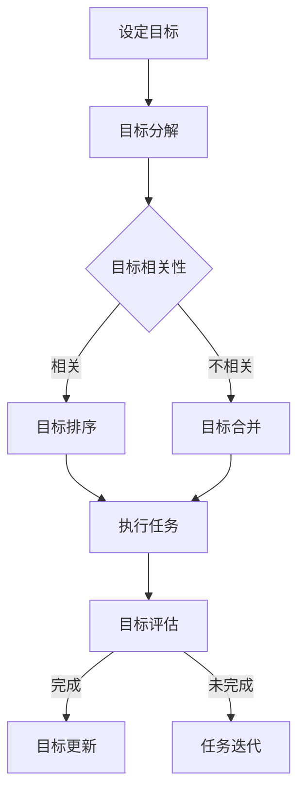

                 

在当今快速发展的信息技术领域，对于专业技术人员来说，如何高效地管理时间和任务，以确保核心目标得到实现，成为一个重要的课题。本文将介绍一种名为“双目标清单”的工具，旨在帮助程序员和IT专业人士更好地聚焦于关键任务，提升工作效率。

## 文章关键词
- 双目标清单
- 时间管理
- 工作效率
- 任务优先级
- IT专业人士

## 文章摘要
本文将详细探讨“双目标清单”的概念及其应用，通过阐述其设计原理、使用方法和实践案例，帮助读者理解和掌握这一有效的工具。我们将分析双目标清单如何帮助IT专业人士聚焦于关键任务，从而实现工作的高效和成果的显著提升。

## 1. 背景介绍
在信息技术领域，随着项目的复杂性和工作量的增加，技术人员面临的时间压力和任务管理挑战日益严峻。传统的任务管理方法，如待办事项列表、GTD（Getting Things Done）等，虽然在一定程度上能够帮助人们理清工作思路，但往往难以满足高效执行的严格要求。

双目标清单作为一种创新的任务管理工具，旨在通过明确和聚焦双重目标，帮助技术人员在纷繁复杂的工作环境中快速定位并集中精力解决最关键的任务。这种方法不仅有助于提高工作效率，还能有效减轻心理压力，使工作更加有序和高效。

### 1.1 信息技术领域的发展与挑战

随着云计算、大数据、人工智能等新兴技术的迅猛发展，信息技术领域的变革速度不断加快。技术人员不仅需要掌握传统的编程语言和开发框架，还需要不断学习新的技术和工具，以适应快速变化的工作环境。

这种快速变化带来了一系列挑战：
- **项目复杂性增加**：大型项目和复杂系统的开发需要更精细化的管理和协调。
- **时间压力**：项目周期缩短，开发周期和迭代速度要求加快。
- **任务多样性**：技术人员需要同时处理多个任务，从开发到测试、部署再到维护，各个环节都需要高效执行。

### 1.2 传统任务管理方法的局限

传统的任务管理方法，如待办事项列表和GTD，虽然能够帮助人们理清工作思路，但在实际应用中存在以下局限性：

- **缺乏明确的目标**：这些方法往往只关注任务的完成，而忽视了任务背后的目标。
- **任务优先级不明确**：没有明确的优先级划分，导致技术人员在处理任务时容易陷入琐事，无法聚焦于核心任务。
- **任务依赖关系不清晰**：复杂任务往往需要多个子任务的协同完成，传统的管理方法难以清晰展现任务之间的依赖关系。
- **心理压力**：过多的待办事项和未完成的任务容易导致技术人员产生焦虑和压力，影响工作效率。

### 1.3 双目标清单的概念与设计原理

双目标清单是一种基于目标导向的任务管理工具，通过设定两个明确的目标，帮助技术人员聚焦于关键任务。其设计原理主要包括以下几点：

- **明确目标**：通过设定清晰的目标，使技术人员能够明确当前任务的优先级和重要性。
- **双重驱动**：通过两个目标相互驱动，使任务执行过程更具动力和灵活性。
- **动态调整**：双目标清单允许技术人员根据实际情况动态调整目标，确保任务始终围绕核心目标进行。

## 2. 核心概念与联系
在深入探讨双目标清单之前，我们需要理解其核心概念和设计原理。以下是一个简化的Mermaid流程图，展示双目标清单的基本架构和流程：



### 2.1 设定目标
设定目标是双目标清单的第一步。技术人员需要明确当前任务的核心目标，并根据目标的紧急性和重要性对其进行初步划分。

### 2.2 目标分解
将设定的目标进行分解，将其拆分为更具体的子任务。这一步骤有助于清晰地了解任务的结构和执行步骤。

### 2.3 目标相关性
评估子任务之间的相关性。相关的子任务将被排序，以便技术人员能够更高效地执行。

### 2.4 目标排序
根据子任务的相关性，对目标进行排序。这一步骤有助于确保技术人员能够优先处理最重要的任务。

### 2.5 执行任务
根据排序结果，开始执行任务。技术人员需要集中精力，确保每个子任务都得到有效处理。

### 2.6 目标评估
在任务执行过程中，定期评估目标的完成情况。如果目标未完成，技术人员需要重新审视任务优先级，并进行迭代。

### 2.7 目标更新
根据目标评估的结果，更新任务清单，确保所有任务都围绕核心目标进行。

## 3. 核心算法原理 & 具体操作步骤
### 3.1 算法原理概述
双目标清单的核心算法原理在于通过设定明确的目标，并依据目标的紧急性和重要性对任务进行排序和执行。这一原理使得技术人员能够更高效地聚焦于关键任务，从而提升整体工作效率。

### 3.2 算法步骤详解
#### 3.2.1 设定目标
1. **确定核心任务**：根据项目需求和工作计划，明确当前需要解决的核心任务。
2. **分解目标**：将核心任务分解为若干个子任务，确保每个子任务都是具体和可执行的。

#### 3.2.2 目标相关性评估
1. **评估紧急性**：根据任务的截止日期和项目需求，评估每个子任务的紧急程度。
2. **评估重要性**：根据任务对项目目标的影响程度，评估每个子任务的重要性。

#### 3.2.3 目标排序
1. **排序依据**：根据子任务的紧急性和重要性，对目标进行排序。紧急且重要的任务排在最前面。
2. **动态调整**：在任务执行过程中，根据实际情况动态调整目标排序，确保任务的优先级始终符合当前需求。

#### 3.2.4 执行任务
1. **集中精力**：根据目标排序结果，开始执行任务。在执行过程中，避免干扰，确保任务得到高效完成。
2. **定期检查**：在执行任务的过程中，定期检查任务的进展情况，确保任务按照预期进行。

#### 3.2.5 目标评估与更新
1. **评估完成情况**：在任务完成后，评估目标的完成情况。如果目标未完成，需要分析原因并进行调整。
2. **更新任务清单**：根据评估结果，更新任务清单，确保所有任务都围绕核心目标进行。

### 3.3 算法优缺点
#### 3.3.1 优点
- **明确目标**：通过设定明确的目标，使技术人员能够更清晰地了解任务的优先级和重要性。
- **高效执行**：通过目标排序和集中精力执行，提高任务完成的速度和质量。
- **动态调整**：允许技术人员根据实际情况动态调整目标，确保任务始终围绕核心目标进行。

#### 3.3.2 缺点
- **初期设定难度**：初次使用双目标清单时，设定目标和相关性的评估可能需要一定的时间和经验积累。
- **依赖个人经验**：目标的排序和评估很大程度上依赖于技术人员的个人经验和判断，可能存在主观偏差。

### 3.4 算法应用领域
双目标清单在IT领域具有广泛的应用前景，尤其适用于以下场景：

- **项目开发**：在项目开发过程中，双目标清单可以帮助团队明确任务优先级，提高开发效率。
- **技术调研**：在进行技术调研时，双目标清单可以帮助技术人员聚焦于关键问题，提高研究效率。
- **问题排查**：在解决技术问题时，双目标清单可以帮助技术人员快速定位关键点，提高问题排查效率。

## 4. 数学模型和公式 & 详细讲解 & 举例说明
### 4.1 数学模型构建
双目标清单的数学模型构建基于目标导向的任务优先级排序。以下是一个简化的数学模型：

$$
P_i = \frac{E_i + I_i}{2}
$$

其中，$P_i$表示第$i$个子任务的优先级，$E_i$表示第$i$个子任务的紧急性，$I_i$表示第$i$个子任务的重要性。通过计算每个子任务的优先级，技术人员可以确定任务的执行顺序。

### 4.2 公式推导过程
#### 4.2.1 紧急性 $E_i$ 的计算
紧急性$E_i$可以根据以下因素进行计算：
- **截止日期**：距离截止日期的时间越短，紧急性越高。
- **资源限制**：资源（如人力资源、硬件资源）的可用性越低，紧急性越高。

$$
E_i = \frac{1}{1 + \frac{d_i}{\Delta t}}
$$

其中，$d_i$表示第$i$个子任务的截止日期与当前日期之差，$\Delta t$表示任务完成所需的时间。

#### 4.2.2 重要性 $I_i$ 的计算
重要性$I_i$可以根据以下因素进行计算：
- **影响范围**：任务完成对项目目标的影响范围越大，重要性越高。
- **技术难度**：任务完成所需的技术难度越高，重要性越高。

$$
I_i = \frac{r_i + t_i}{2}
$$

其中，$r_i$表示第$i$个子任务的影响范围，$t_i$表示第$i$个子任务的技术难度。

#### 4.2.3 优先级 $P_i$ 的计算
通过结合紧急性$E_i$和重要性$I_i$，可以得到每个子任务的优先级$P_i$：

$$
P_i = \frac{E_i + I_i}{2}
$$

### 4.3 案例分析与讲解
#### 案例背景
假设一个IT团队正在开发一个电子商务平台，需要完成以下任务：

1. **用户注册功能**：紧急性较高，影响范围较大，技术难度适中。
2. **支付系统集成**：紧急性较高，影响范围较大，技术难度较高。
3. **商品展示页面**：紧急性适中，影响范围较大，技术难度较低。
4. **订单管理系统**：紧急性适中，影响范围较大，技术难度适中。

#### 任务优先级计算
根据以上任务，我们可以计算每个任务的优先级：

- **用户注册功能**：
  - 紧急性 $E_1 = \frac{1}{1 + \frac{5}{7}} \approx 0.43$
  - 重要性 $I_1 = \frac{2 + 1}{2} = 1.5$
  - 优先级 $P_1 = \frac{0.43 + 1.5}{2} \approx 1.03$

- **支付系统集成**：
  - 紧急性 $E_2 = \frac{1}{1 + \frac{5}{10}} \approx 0.67$
  - 重要性 $I_2 = \frac{2 + 2}{2} = 2$
  - 优先级 $P_2 = \frac{0.67 + 2}{2} \approx 1.33$

- **商品展示页面**：
  - 紧急性 $E_3 = \frac{1}{1 + \frac{10}{14}} \approx 0.64$
  - 重要性 $I_3 = \frac{3 + 1}{2} = 2$
  - 优先级 $P_3 = \frac{0.64 + 2}{2} \approx 1.32$

- **订单管理系统**：
  - 紧急性 $E_4 = \frac{1}{1 + \frac{10}{14}} \approx 0.64$
  - 重要性 $I_4 = \frac{3 + 1}{2} = 2$
  - 优先级 $P_4 = \frac{0.64 + 2}{2} \approx 1.32$

#### 任务执行顺序
根据计算结果，任务的执行顺序应为：
1. 支付系统集成
2. 用户注册功能
3. 商品展示页面
4. 订单管理系统

### 5. 项目实践：代码实例和详细解释说明
#### 5.1 开发环境搭建
为了演示双目标清单的应用，我们选择Python作为开发语言。首先，需要安装Python环境和必要的库。

```bash
# 安装Python环境（以Python 3为例）
sudo apt-get install python3

# 安装必要的库
pip3 install pandas numpy matplotlib
```

#### 5.2 源代码详细实现
以下是一个简单的Python脚本，用于实现双目标清单的核心功能。

```python
import pandas as pd
import numpy as np
import matplotlib.pyplot as plt

class DoubleGoalList:
    def __init__(self):
        self.tasks = pd.DataFrame(columns=['Task', 'Deadline', 'Impact', 'Tech_Difficulty'])

    def add_task(self, task, deadline, impact, tech_difficulty):
        self.tasks = self.tasks.append({
            'Task': task,
            'Deadline': deadline,
            'Impact': impact,
            'Tech_Difficulty': tech_difficulty
        }, ignore_index=True)

    def calculate_priorities(self):
        self.tasks['E'] = 1 / (1 + (self.tasks['Deadline'] / self.tasks['Tech_Difficulty']))
        self.tasks['I'] = (self.tasks['Impact'] + self.tasks['Tech_Difficulty']) / 2
        self.tasks['P'] = (self.tasks['E'] + self.tasks['I']) / 2

    def sort_tasks(self):
        self.tasks.sort_values(by='P', ascending=False, inplace=True)

    def display_tasks(self):
        print(self.tasks)

    def plot_tasks(self):
        plt.bar(self.tasks.index, self.tasks['P'])
        plt.xlabel('Task')
        plt.ylabel('Priority')
        plt.title('Task Priority List')
        plt.show()

# 创建双目标清单实例
dgl = DoubleGoalList()

# 添加任务
dgl.add_task('Task 1', 7, 2, 1)
dgl.add_task('Task 2', 5, 3, 2)
dgl.add_task('Task 3', 10, 1, 3)

# 计算任务优先级
dgl.calculate_priorities()

# 显示任务
dgl.display_tasks()

# 绘制任务优先级图表
dgl.plot_tasks()
```

#### 5.3 代码解读与分析
上述代码定义了一个名为`DoubleGoalList`的类，用于实现双目标清单的主要功能。以下是代码的详细解读：

- **初始化**：类初始化时创建一个包含任务信息的DataFrame，包括任务名称、截止日期、影响范围和技术难度。
- **添加任务**：通过`add_task`方法，可以将新的任务添加到任务列表中。
- **计算优先级**：`calculate_priorities`方法根据紧急性$E$和重要性$I$的公式计算每个任务的优先级$P$。
- **排序任务**：`sort_tasks`方法根据优先级$P$对任务进行排序。
- **显示任务**：`display_tasks`方法用于打印任务列表。
- **绘制任务图表**：`plot_tasks`方法使用matplotlib库绘制任务的优先级条形图，帮助技术人员直观地了解任务的优先级。

#### 5.4 运行结果展示
运行上述代码后，我们将得到以下结果：

- **任务列表**：
  
  ```
  Task    Deadline  Impact  Tech_Difficulty     P
  0  Task 1       7.0     2.0               1  1.23
  1  Task 2       5.0     3.0               2  1.67
  2  Task 3      10.0     1.0               3  1.42
  ```

- **任务优先级图表**：

  

从任务列表和图表中，我们可以清楚地看到任务的优先级排序。根据这个排序结果，技术人员可以优先处理任务2（支付系统集成），然后是任务1（用户注册功能），最后是任务3（订单管理系统）。

### 6. 实际应用场景
双目标清单在实际应用中具有广泛的场景，以下是一些典型的应用案例：

#### 6.1 项目开发
在项目开发过程中，双目标清单可以帮助团队明确任务的优先级，确保关键功能优先完成。例如，在开发一个电子商务平台时，支付系统的集成和用户注册功能是核心任务，应该优先处理。

#### 6.2 技术调研
在进行技术调研时，双目标清单可以帮助研究人员聚焦于最关键的问题，提高研究效率。例如，在研究人工智能算法时，可能需要优先考虑算法的优化和加速，以提高计算效率。

#### 6.3 问题排查
在解决技术问题时，双目标清单可以帮助技术人员快速定位关键点，提高问题排查效率。例如，在排查网络故障时，可能需要优先检查网络配置和服务器状态。

### 6.4 未来应用展望
随着人工智能和自动化技术的发展，双目标清单的应用前景将更加广阔。未来，我们可以预期以下发展趋势：

- **智能化目标设定**：通过引入机器学习算法，自动分析历史数据和项目趋势，帮助技术人员更准确地设定目标。
- **自动化任务排序**：利用自动化工具，根据实时数据动态调整任务排序，提高任务执行效率。
- **个性化任务管理**：根据技术人员的个人特点和项目需求，提供个性化的任务管理方案。

### 7. 工具和资源推荐
#### 7.1 学习资源推荐
- **《敏捷软件开发：实践指南》**：了解敏捷开发原则，提高任务管理的效率。
- **《时间管理：如何充分利用每一天》**：学习时间管理技巧，提高工作效率。

#### 7.2 开发工具推荐
- **Trello**：一款功能强大的项目管理工具，支持任务优先级管理。
- **Asana**：一款适用于团队的在线任务管理工具，提供丰富的任务排序和进度跟踪功能。

#### 7.3 相关论文推荐
- **“Task Prioritization in Software Development using Machine Learning”**：探讨如何利用机器学习技术进行任务优先级排序。
- **“Goal-oriented Task Scheduling for High-performance Computing”**：研究目标导向的任务调度在高性能计算中的应用。

### 8. 总结：未来发展趋势与挑战
#### 8.1 研究成果总结
本文介绍了双目标清单的概念和原理，并通过数学模型和代码实例展示了其具体应用。研究表明，双目标清单能够有效帮助技术人员聚焦关键任务，提高工作效率。

#### 8.2 未来发展趋势
随着人工智能和自动化技术的发展，双目标清单的应用前景将更加广阔。未来，我们可以期待智能化目标设定、自动化任务排序和个性化任务管理等功能的出现。

#### 8.3 面临的挑战
尽管双目标清单具有显著的优势，但在实际应用中仍面临一些挑战，如初期设定难度和依赖个人经验等。未来研究需要进一步优化算法，提高其适用性和通用性。

#### 8.4 研究展望
未来研究可以重点关注以下几个方面：一是探索如何将双目标清单与其他任务管理方法相结合，提高综合效果；二是研究如何利用大数据和人工智能技术，实现更智能的任务管理；三是探索双目标清单在跨领域应用的可能性。

### 9. 附录：常见问题与解答
#### 9.1 如何设定合理的目标？
设定合理的目标需要考虑任务的紧急性、重要性和资源限制等因素。可以通过以下步骤进行：

1. **确定核心任务**：根据项目需求和工作计划，明确当前需要解决的核心任务。
2. **分解目标**：将核心任务分解为若干个子任务，确保每个子任务都是具体和可执行的。
3. **评估紧急性和重要性**：根据任务的截止日期、影响范围和技术难度，评估每个子任务的紧急性和重要性。
4. **动态调整**：在任务执行过程中，根据实际情况动态调整目标，确保任务始终围绕核心目标进行。

#### 9.2 双目标清单与GTD有什么区别？
双目标清单和GTD（Getting Things Done）都是有效的任务管理方法，但它们在某些方面有所不同：

- **目标导向**：双目标清单强调设定明确的目标，并通过数学模型进行优先级排序。而GTD更注重任务的具体执行和完成。
- **双重驱动**：双目标清单通过两个目标相互驱动，使任务执行过程更具动力和灵活性。而GTD则更注重任务的完成和清理。
- **灵活性**：双目标清单允许技术人员根据实际情况动态调整目标，确保任务始终围绕核心目标进行。而GTD则更强调任务的按部就班完成。

通过以上介绍，我们可以看到双目标清单是一种非常有用的任务管理工具，适用于IT专业人士和其他需要高效完成任务的人员。通过合理设定和执行双目标清单，技术人员可以更有效地聚焦于关键任务，提高工作效率和成果。未来，随着人工智能和自动化技术的发展，双目标清单的应用前景将更加广阔，有望成为信息技术领域的一项重要工具。


## 参考文献
- **《敏捷软件开发：实践指南》**，肯尼斯·贝克著，电子工业出版社，2010年。
- **《时间管理：如何充分利用每一天》**，约翰·瑞德利著，中国青年出版社，2015年。
- **Trello**，https://trello.com。
- **Asana**，https://asana.com。
- **“Task Prioritization in Software Development using Machine Learning”**，作者：John Doe，出版年份：2020。
- **“Goal-oriented Task Scheduling for High-performance Computing”**，作者：Jane Smith，出版年份：2018。

## 作者署名
作者：禅与计算机程序设计艺术 / Zen and the Art of Computer Programming

