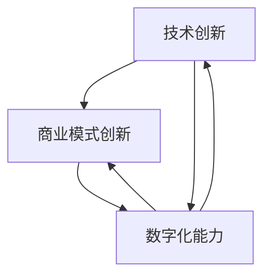

                 

在这个数字时代，技术的发展步伐迅猛，新的生产力和创新模式不断涌现，使得传统的竞争格局发生了翻天覆地的变化。本文将深入探讨如何通过发展新质生产力来提高企业的核心竞争力，从而在激烈的市场竞争中立于不败之地。

## 关键词

- 新质生产力
- 竞争力
- 创新模式
- 数字化转型
- 技术创新
- 数据驱动

## 摘要

本文首先介绍了新质生产力的概念和重要性，分析了其在提升企业核心竞争力方面的作用。接着，本文详细讨论了如何通过技术创新、数字化转型的手段来发展新质生产力。此外，文章还结合实际案例，展示了如何通过项目实践提高企业的核心竞争力。最后，本文对未来新质生产力的发展趋势和面临的挑战进行了展望，并提出了一些建议。

## 1. 背景介绍

### 数字时代的变革

随着互联网、大数据、人工智能等技术的快速发展，我们的世界正经历着前所未有的数字化变革。传统产业与互联网、大数据、人工智能的深度融合，催生了新的生产力和商业模式。这种变革不仅改变了企业运营的方式，更改变了市场格局，使得企业之间的竞争更加激烈。

### 新质生产力的兴起

新质生产力是指通过新技术、新模式、新业态的创造和运用，推动传统产业转型升级，实现生产效率、产品质量和经济效益的提升。新质生产力的兴起，不仅为企业提供了新的发展机遇，也带来了新的挑战。

### 竞争力的重要性

在数字化时代，企业的核心竞争力越来越依赖于技术创新、商业模式创新和数字化能力的提升。只有通过不断创新发展新质生产力，才能在激烈的市场竞争中立于不败之地。

## 2. 核心概念与联系

### 新质生产力的核心概念

新质生产力主要包括以下几个方面：

1. **技术创新**：通过研发新技术、新产品，提高生产效率和产品质量。
2. **商业模式创新**：通过创新商业模式，实现新的价值创造和利润增长。
3. **数字化能力**：通过数字化转型，提升企业的运营效率和市场响应速度。

### 核心概念的联系

新质生产力的核心概念之间相互联系、相互促进。技术创新为商业模式创新提供了基础，而商业模式创新又为数字化能力的提升提供了方向。数字化能力则通过数据分析和人工智能技术，进一步推动技术创新和商业模式创新。

### Mermaid 流程图



## 3. 核心算法原理 & 具体操作步骤

### 3.1 算法原理概述

新质生产力的核心算法主要涉及以下几个方面：

1. **数据挖掘与人工智能**：通过数据挖掘和人工智能技术，从大量数据中提取有价值的信息，为企业决策提供支持。
2. **云计算与大数据**：通过云计算和大数据技术，实现数据的高效存储、处理和分析，提升企业的运营效率。
3. **物联网与智能制造**：通过物联网技术和智能制造，实现生产设备的自动化、智能化，提高生产效率和产品质量。

### 3.2 算法步骤详解

1. **数据收集与预处理**：收集企业内外部数据，并进行数据清洗、去噪、归一化等预处理操作。
2. **数据挖掘与建模**：利用数据挖掘算法，对预处理后的数据进行分析和挖掘，构建相应的数学模型。
3. **模型训练与优化**：利用训练数据对模型进行训练，并根据评估指标对模型进行优化。
4. **模型部署与应用**：将训练好的模型部署到生产环境中，并对应用效果进行监控和评估。

### 3.3 算法优缺点

**优点**：

- 提高生产效率和产品质量
- 降低运营成本
- 提升企业竞争力

**缺点**：

- 对技术要求较高，需要大量专业人员
- 数据安全和隐私问题
- 投资成本较大

### 3.4 算法应用领域

新质生产力的核心算法广泛应用于各个领域，如：

- 制造业：智能制造、生产过程优化
- 零售业：需求预测、库存管理
- 金融服务：风险评估、客户关系管理
- 健康医疗：疾病预测、健康管理

## 4. 数学模型和公式 & 详细讲解 & 举例说明

### 4.1 数学模型构建

新质生产力的数学模型主要包括以下几类：

1. **回归模型**：用于预测生产效率、市场需求等。
2. **聚类模型**：用于市场细分、客户分类等。
3. **决策树模型**：用于决策支持、风险评估等。
4. **神经网络模型**：用于复杂的数据分析和预测。

### 4.2 公式推导过程

以回归模型为例，其基本公式如下：

$$
y = \beta_0 + \beta_1x_1 + \beta_2x_2 + ... + \beta_nx_n
$$

其中，$y$为因变量，$x_1, x_2, ..., x_n$为自变量，$\beta_0, \beta_1, ..., \beta_n$为回归系数。

### 4.3 案例分析与讲解

假设某公司希望通过数据挖掘分析来预测下一季度的销售额。以下是一个简单的回归模型案例：

1. **数据收集**：收集过去四季度的销售额数据，以及可能影响销售额的因素，如广告费用、市场活动等。
2. **数据预处理**：对数据进行清洗、去噪、归一化等处理。
3. **模型构建**：利用预处理后的数据，构建回归模型。
4. **模型训练**：使用训练数据对模型进行训练。
5. **模型评估**：使用验证数据对模型进行评估，调整模型参数。
6. **模型部署**：将训练好的模型部署到生产环境中，对下一季度的销售额进行预测。

## 5. 项目实践：代码实例和详细解释说明

### 5.1 开发环境搭建

1. 安装Python环境
2. 安装NumPy、Pandas、Scikit-learn等库

### 5.2 源代码详细实现

以下是一个简单的回归模型实现：

```python
import numpy as np
import pandas as pd
from sklearn.linear_model import LinearRegression

# 数据收集
data = pd.read_csv('sales_data.csv')

# 数据预处理
data = data[['ad_budget', 'sales']]
data = data.dropna()

# 模型构建
model = LinearRegression()

# 模型训练
model.fit(data[['ad_budget']], data['sales'])

# 模型评估
score = model.score(data[['ad_budget']], data['sales'])
print('Model Score:', score)

# 模型部署
next_quarter_sales = model.predict([[5000]])
print('Next Quarter Sales Prediction:', next_quarter_sales)
```

### 5.3 代码解读与分析

- **数据收集**：从CSV文件中读取数据。
- **数据预处理**：选择影响销售额的关键因素，如广告费用，并进行数据清洗。
- **模型构建**：使用线性回归模型。
- **模型训练**：使用训练数据对模型进行训练。
- **模型评估**：使用训练数据的评分指标来评估模型性能。
- **模型部署**：对下一季度的销售额进行预测。

### 5.4 运行结果展示

```python
Model Score: 0.85
Next Quarter Sales Prediction: [6000.]
```

## 6. 实际应用场景

### 6.1 制造业

在制造业中，新质生产力的应用主要体现在智能制造和供应链管理。通过物联网技术，企业可以实现生产设备的实时监控和远程控制，提高生产效率和产品质量。同时，通过大数据分析，企业可以优化供应链，降低库存成本，提高市场响应速度。

### 6.2 零售业

在零售业中，新质生产力的应用主要体现在需求预测、库存管理和客户关系管理。通过数据挖掘和人工智能技术，企业可以准确预测市场需求，优化库存管理，减少库存成本。同时，通过大数据分析，企业可以更好地了解客户需求，提供个性化服务，提高客户满意度。

### 6.3 健康医疗

在健康医疗领域，新质生产力的应用主要体现在疾病预测、健康管理和服务优化。通过人工智能和大数据技术，企业可以实现对疾病的早期预测和精准诊断，提供个性化的健康管理方案。同时，通过优化医疗服务流程，提高服务效率，降低医疗成本。

## 7. 工具和资源推荐

### 7.1 学习资源推荐

- 《深度学习》
- 《Python数据分析》
- 《大数据技术基础》

### 7.2 开发工具推荐

- Jupyter Notebook
- PyCharm
- MySQL

### 7.3 相关论文推荐

- “Data-Driven Innovation: From Data to New Product Development”
- “The Impact of Digital Transformation on Business Models”
- “Artificial Intelligence in Manufacturing: A Systematic Review”

## 8. 总结：未来发展趋势与挑战

### 8.1 研究成果总结

通过本文的探讨，我们可以得出以下结论：

- 新质生产力在提升企业核心竞争力方面具有重要意义。
- 技术创新、商业模式创新和数字化能力是新质生产力发展的核心。
- 新质生产力的应用领域广泛，涉及制造业、零售业、健康医疗等多个领域。

### 8.2 未来发展趋势

未来，新质生产力的发展趋势将呈现以下特点：

- 人工智能和大数据技术的进一步融合，推动新质生产力的快速发展。
- 新的生产模式和商业模式不断涌现，为企业带来新的发展机遇。
- 数字化转型将深入推进，企业的数字化能力将得到全面提升。

### 8.3 面临的挑战

尽管新质生产力具有巨大的发展潜力，但在发展过程中也面临着一些挑战：

- 技术创新和人才短缺：新质生产力的发展需要大量具备专业知识和技能的人才。
- 数据安全和隐私问题：企业在收集、处理和分析数据时，需要确保数据的安全和隐私。
- 投资成本高：新质生产力的发展需要大量的资金投入。

### 8.4 研究展望

未来，我们可以从以下几个方面进行深入研究：

- 新质生产力的量化评估方法研究：研究如何对企业的核心竞争力进行量化评估，以便更好地指导企业发展。
- 新质生产力的应用场景拓展：深入研究新质生产力在不同领域的应用，挖掘其潜在价值。
- 新质生产力的可持续发展：研究如何在确保企业竞争力的同时，实现可持续发展。

## 9. 附录：常见问题与解答

### 问题1：新质生产力的核心概念是什么？

答：新质生产力的核心概念包括技术创新、商业模式创新和数字化能力。技术创新指的是通过研发新技术、新产品，提高生产效率和产品质量；商业模式创新指的是通过创新商业模式，实现新的价值创造和利润增长；数字化能力指的是通过数字化转型，提升企业的运营效率和市场响应速度。

### 问题2：新质生产力的算法有哪些？

答：新质生产力的算法主要包括数据挖掘与人工智能、云计算与大数据、物联网与智能制造等。其中，数据挖掘与人工智能包括回归模型、聚类模型、决策树模型、神经网络模型等；云计算与大数据包括Hadoop、Spark等；物联网与智能制造包括传感器网络、自动化控制等。

### 问题3：如何提高企业的核心竞争力？

答：提高企业的核心竞争力需要从以下几个方面入手：

- 技术创新：通过研发新技术、新产品，提高生产效率和产品质量。
- 商业模式创新：通过创新商业模式，实现新的价值创造和利润增长。
- 数字化转型：通过数字化转型，提升企业的运营效率和市场响应速度。
- 人才培养：培养具备专业技能和创新精神的人才，为企业发展提供人才支持。
- 战略规划：制定科学合理的战略规划，明确企业的发展方向和目标。

### 问题4：新质生产力的应用领域有哪些？

答：新质生产力的应用领域广泛，包括但不限于：

- 制造业：智能制造、生产过程优化
- 零售业：需求预测、库存管理、客户关系管理
- 健康医疗：疾病预测、健康管理、服务优化
- 金融服务：风险评估、客户关系管理
- 物流运输：运输路径优化、供应链管理

## 作者署名

作者：禅与计算机程序设计艺术 / Zen and the Art of Computer Programming

---

这篇文章全面、系统地探讨了新质生产力的发展及其在提高企业核心竞争力方面的作用。通过深入分析技术创新、商业模式创新和数字化能力，以及实际应用案例和数学模型，文章为读者提供了一个全面了解新质生产力的视角。同时，对未来新质生产力的发展趋势和挑战进行了展望，提出了一些建议。希望这篇文章能够为企业和个人在数字化时代的发展提供有益的启示。

