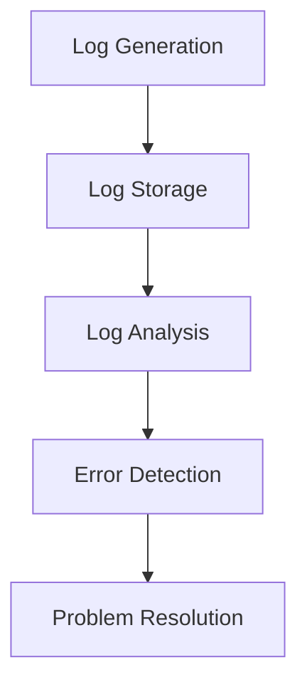
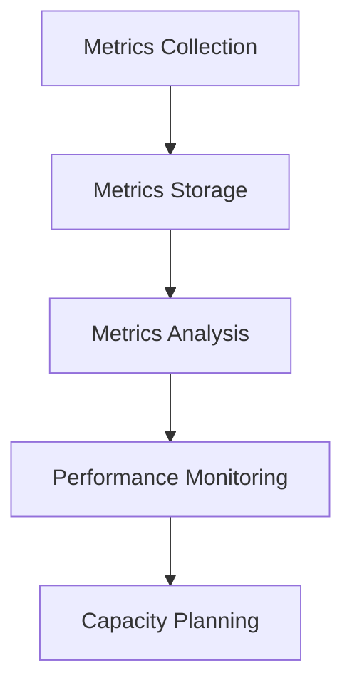
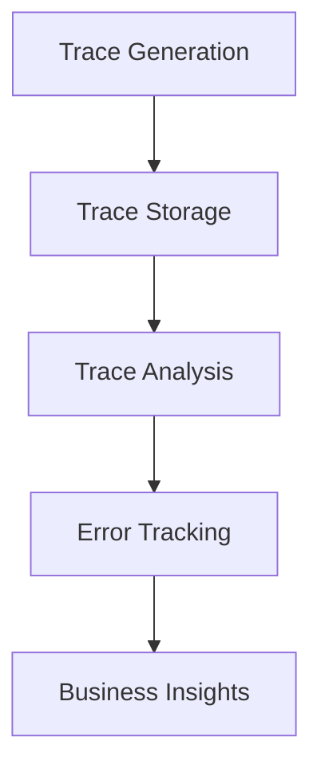
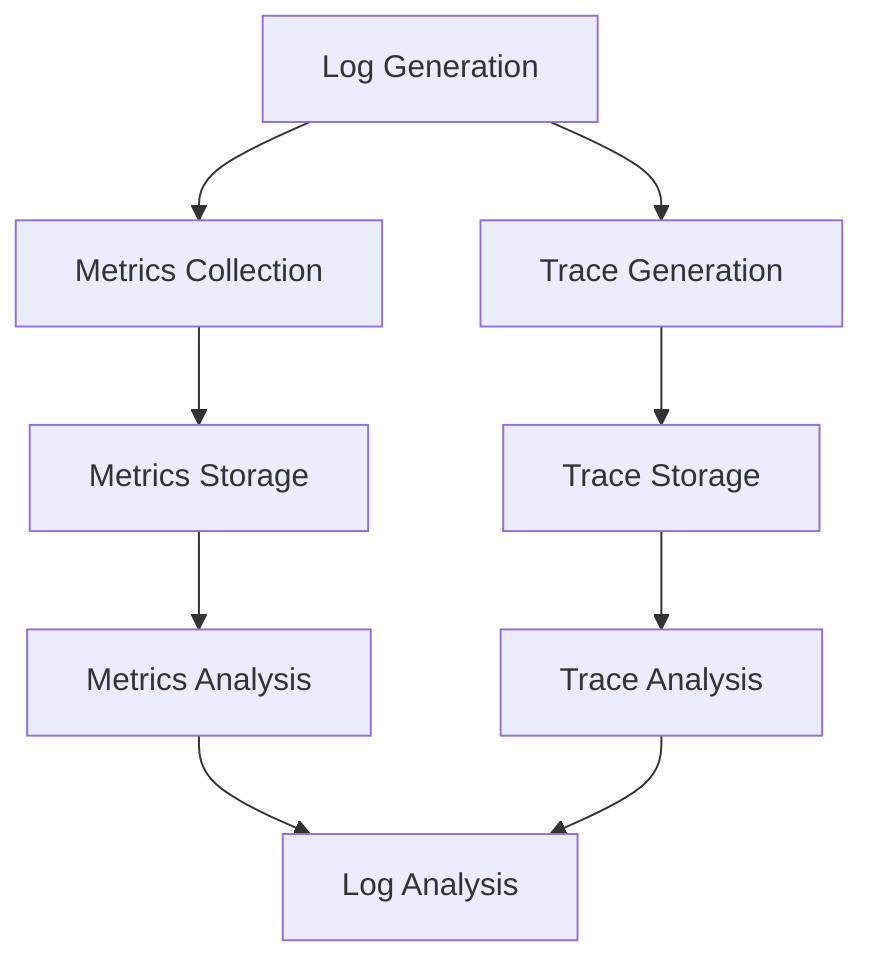
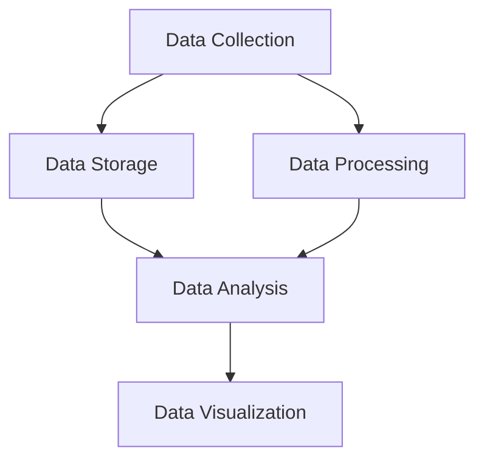

                 

 可观测性是现代软件系统设计中的一个关键概念，它指的是系统能够提供足够的内部信息，使得开发人员、运维人员以及相关利益相关者能够轻松地了解系统的运行状态、性能以及潜在问题。为了实现这一目标，常用的工具链包括日志、指标和追踪。这些工具各有其独特的功能，但共同构成了一个强大而全面的监控体系。本文将深入探讨这些工具链的核心概念、原理、应用和实践，帮助读者更好地理解和利用可观测性工具链。

## 关键词

- 可观测性
- 日志
- 指标
- 追踪
- 软件监控
- 性能优化
- 故障排查

## 摘要

本文旨在介绍可观测性工具链中的日志、指标和追踪，并探讨其核心概念、应用场景和实践方法。日志记录了系统的操作记录和事件流，是故障排查和问题定位的重要依据。指标则是通过量化数据来反映系统性能和健康状态，是监控和优化的重要工具。追踪则提供了细粒度的数据处理，使得复杂的系统交互能够被清晰地理解和分析。通过结合这些工具，开发者和运维团队能够构建一个全面而高效的监控体系，从而提升系统的可靠性和性能。

## 1. 背景介绍

在当今复杂而庞大的软件系统中，可观测性成为了确保系统稳定运行和快速响应的关键。传统的软件监控系统通常依赖于单一的监控工具，如性能计数器或日志文件。然而，随着系统规模的扩大和复杂性增加，这种单一的监控方法已经无法满足需求。可观测性工具链提供了一种更加综合和细粒度的监控方法，通过日志、指标和追踪等多维度数据，使得系统能够被全面监控和理解。

### 1.1 日志

日志是记录系统运行过程中的各种事件和信息的重要工具。它们通常包含时间戳、事件类型、执行结果以及相关上下文信息。日志的主要用途包括：

- **故障排查**：通过分析日志，开发人员可以了解系统在发生错误时的具体操作和状态，从而定位问题的根本原因。
- **性能分析**：日志可以帮助分析系统在运行过程中的性能瓶颈，优化系统性能。
- **审计**：日志记录了系统的操作历史，可用于审计和合规性检查。

### 1.2 指标

指标是通过量化数据来反映系统性能和健康状态的关键指标。常见的指标包括：

- **响应时间**：反映系统处理请求的速度。
- **错误率**：反映系统发生错误的频率。
- **吞吐量**：反映系统在一定时间内处理请求的数量。
- **资源利用率**：反映系统资源（如CPU、内存等）的利用情况。

指标的主要用途包括：

- **实时监控**：通过实时指标，可以快速发现系统异常并进行响应。
- **性能优化**：通过分析指标，可以识别系统性能瓶颈并进行优化。
- **容量规划**：通过预测指标趋势，可以规划系统的扩展和升级。

### 1.3 追踪

追踪是通过记录系统内部各个模块之间的交互和数据处理过程，提供细粒度监控和性能分析的工具。追踪的主要用途包括：

- **事务追踪**：记录系统内部各个事务的执行过程，帮助分析系统性能和优化。
- **错误追踪**：记录系统发生的错误和异常，帮助快速定位和解决问题。
- **业务分析**：通过追踪数据，可以深入了解业务流程和用户行为，支持业务决策。

通过结合日志、指标和追踪，开发者和运维团队能够构建一个全面的监控体系，从不同维度对系统进行监控和分析，确保系统的稳定运行和高效性能。

### 1.4 可观测性的重要性

在当今快速发展的软件行业中，可观测性成为了系统开发和运维的关键因素。以下是可观测性的一些重要原因：

- **故障快速响应**：通过可观测性工具，开发者和运维团队能够快速发现和响应系统故障，减少故障对业务的影响。
- **性能持续优化**：通过监控和分析系统性能指标，可以不断优化系统性能，提高用户体验。
- **合规性保障**：日志和指标数据可以用于审计和合规性检查，确保系统符合相关法规和标准。
- **业务洞察**：通过追踪业务流程和用户行为，可以深入了解业务情况，支持业务增长和优化。

总之，可观测性工具链是现代软件系统开发和运维的基石，为系统稳定运行和高效性能提供了有力支持。在接下来的章节中，我们将深入探讨这些工具链的核心概念、原理和应用实践。

## 2. 核心概念与联系

可观测性工具链中的日志、指标和追踪各自有其独特的功能和应用场景，但它们之间也存在紧密的联系和互相补充的关系。为了更好地理解这些工具链的核心概念和架构，我们通过一个Mermaid流程图来展示它们之间的交互和关联。

### 2.1 日志

日志是记录系统运行过程中的各种事件和信息的文件或数据库。日志的主要目的是为了在系统发生问题时提供详细的操作记录，以便进行故障排查。日志记录的格式通常包括时间戳、事件类型、执行结果和上下文信息。例如：



### 2.2 指标

指标是通过量化数据来反映系统性能和健康状态的关键参数。指标可以是简单的计数，如请求次数，也可以是复杂的计算，如平均值、最大值、最小值等。指标数据通常存储在监控系统或时间序列数据库中，以便进行实时监控和分析。



### 2.3 追踪

追踪是一种细粒度的监控技术，用于记录系统内部各个模块之间的交互和数据处理过程。追踪可以提供事务级别的详细信息，如请求处理时间、数据处理路径等，有助于深入了解系统性能和潜在问题。



### 2.4 日志、指标和追踪之间的联系

日志、指标和追踪之间存在着密切的关联。日志数据可以作为指标和追踪数据的来源，为指标计算提供详细的事件记录，而指标和追踪数据又可以用于日志分析，提供更全面的监控视图。



通过这种关联，开发者和运维团队能够构建一个完整而高效的监控体系，从不同维度对系统进行监控和分析，确保系统的稳定运行和高效性能。

### 2.5 综合监控架构

综合监控架构通常包括以下关键组件：

- **数据采集**：负责从系统各个部分采集日志、指标和追踪数据。
- **数据存储**：负责存储采集到的数据，以便后续分析和查询。
- **数据处理**：负责对数据进行处理、转换和聚合，以生成可用的监控指标和追踪信息。
- **数据展示**：负责将处理后的数据以图表、表格等形式展示给用户，便于分析和决策。



通过这种综合监控架构，开发者和运维团队能够实现对系统的全面监控和实时分析，从而快速识别和解决问题，提升系统的可靠性和性能。

### 2.6 结论

通过上述Mermaid流程图和综合监控架构的展示，我们可以清晰地看到日志、指标和追踪在可观测性工具链中的核心地位和相互关系。这些工具不仅各自具有独特的功能，还能通过数据关联和综合监控架构，实现系统的全面监控和分析。在接下来的章节中，我们将深入探讨这些工具的具体应用和实践方法。

## 3. 核心算法原理 & 具体操作步骤

### 3.1 算法原理概述

可观测性工具链中的日志、指标和追踪各自有其核心算法原理和实现方式，这些算法在系统中扮演着重要的角色，为系统的监控和分析提供数据支持。以下分别介绍这三个工具链的核心算法原理。

### 3.2 日志记录算法

日志记录算法主要关注如何高效地记录和存储系统运行过程中的各种事件和信息。常见的日志记录算法包括：

- **事件驱动日志记录**：这种算法基于事件的发生来记录日志，例如在系统接收到请求时记录请求的相关信息。事件驱动日志记录可以保证日志记录的及时性和完整性。
- **定期轮询日志记录**：这种算法通过定期轮询系统状态来记录日志，例如每隔一段时间记录系统内存使用情况。定期轮询日志记录可以提供系统的持续监控数据。

### 3.3 指标收集算法

指标收集算法主要关注如何从系统中收集性能和健康状态相关的数据，并生成指标。常见的指标收集算法包括：

- **抽样收集**：这种算法通过抽样方式从系统中收集数据，例如每隔一段时间收集一次CPU使用率。抽样收集可以减少系统负担，同时保证数据代表性。
- **全量收集**：这种算法对系统中的所有数据进行收集，例如实时监控所有进程的内存使用情况。全量收集可以提供详细的数据，但会带来较高的系统负担。

### 3.4 追踪算法

追踪算法主要关注如何记录系统内部各个模块之间的交互和数据处理过程。常见的追踪算法包括：

- **分布式追踪**：这种算法用于记录分布式系统中的数据处理流程，例如跟踪一个请求从发起到响应的全过程。分布式追踪可以提供详细的系统交互信息。
- **链路追踪**：这种算法用于记录系统内部各个模块之间的链路关系，例如跟踪数据在数据库和缓存之间的传输。链路追踪可以提供系统的数据处理路径。

### 3.5 具体操作步骤

以下是使用日志、指标和追踪算法的具体操作步骤：

#### 3.5.1 日志记录操作步骤

1. **定义日志格式**：确定日志记录的格式，包括时间戳、事件类型、执行结果和上下文信息等。
2. **日志生成**：根据系统事件生成日志，记录事件的相关信息。
3. **日志存储**：将生成的日志存储在日志文件或数据库中，以便后续分析。
4. **日志分析**：分析日志数据，识别系统中的异常和问题。

#### 3.5.2 指标收集操作步骤

1. **确定指标类型**：根据系统需求确定需要收集的指标类型，如响应时间、错误率、吞吐量等。
2. **数据抽样或全量收集**：根据系统负担和需求选择抽样或全量收集方式。
3. **数据存储**：将收集到的指标数据存储在时间序列数据库或监控系统中。
4. **数据可视化**：通过图表和报表将指标数据可视化，便于分析和监控。

#### 3.5.3 追踪操作步骤

1. **定义追踪规则**：确定追踪的范围和规则，例如选择哪些模块和数据处理过程进行追踪。
2. **数据采集**：从系统内部采集追踪数据，记录各个模块之间的交互和数据处理过程。
3. **数据存储**：将追踪数据存储在追踪数据库中，以便后续分析和查询。
4. **数据分析**：分析追踪数据，识别系统中的性能瓶颈和潜在问题。

通过以上具体操作步骤，开发者和运维团队能够有效地记录、收集和分析系统的运行数据，从而实现对系统的全面监控和优化。

### 3.6 算法优缺点

每种算法都有其优缺点，适用于不同的应用场景。以下分别介绍日志、指标和追踪算法的优缺点。

#### 日志记录算法

- **优点**：日志记录算法能够提供详细的系统操作记录，有助于故障排查和审计。日志数据通常易于理解和处理，可以支持多种分析工具。
- **缺点**：日志数据量通常较大，存储和处理成本较高。此外，日志记录可能会增加系统负担，影响系统性能。

#### 指标收集算法

- **优点**：指标收集算法能够提供系统性能和健康状态的量化数据，便于实时监控和性能优化。指标数据通常便于存储和处理，支持自动化分析。
- **缺点**：指标收集可能会增加系统负担，影响系统性能。此外，某些指标可能无法全面反映系统状态，需要结合其他数据进行综合分析。

#### 追踪算法

- **优点**：追踪算法能够提供细粒度的系统交互信息，有助于深入分析和优化系统性能。追踪数据通常详细且准确，可以用于多种场景。
- **缺点**：追踪算法可能增加系统负担，影响系统性能。此外，追踪数据量通常较大，存储和处理成本较高。

### 3.7 算法应用领域

日志、指标和追踪算法在多个领域都有广泛应用，以下分别介绍它们的主要应用领域。

#### 日志记录算法

- **故障排查**：日志记录算法在故障排查中起到关键作用，通过分析日志数据，开发人员可以快速定位和解决问题。
- **性能优化**：通过分析日志数据，可以识别系统中的性能瓶颈和优化方向，提升系统性能。
- **审计**：日志记录算法可用于审计和合规性检查，确保系统符合相关法规和标准。

#### 指标收集算法

- **实时监控**：指标收集算法在实时监控中应用广泛，通过实时收集和展示指标数据，可以及时发现和响应系统异常。
- **性能优化**：通过分析指标数据，可以识别系统性能瓶颈和优化方向，提升系统性能。
- **容量规划**：通过预测指标趋势，可以规划系统的扩展和升级，确保系统容量满足业务需求。

#### 追踪算法

- **事务追踪**：追踪算法在分布式系统中用于事务追踪，通过记录事务处理过程，可以优化系统性能和可靠性。
- **错误追踪**：通过追踪算法，可以记录系统中的错误和异常，快速定位和解决问题。
- **业务分析**：通过追踪数据，可以深入了解业务流程和用户行为，支持业务决策和优化。

通过以上介绍，我们可以看到日志、指标和追踪算法在可观测性工具链中的核心地位和广泛应用。在接下来的章节中，我们将进一步探讨这些算法的数学模型、公式和实际应用案例。

## 4. 数学模型和公式 & 详细讲解 & 举例说明

在可观测性工具链中，数学模型和公式用于量化系统的性能指标、分析系统行为以及预测系统状态。以下是几个常用的数学模型和公式，我们将对这些模型和公式进行详细讲解，并通过具体例子来说明如何应用这些公式。

### 4.1 数学模型构建

#### 平均响应时间（Average Response Time）

平均响应时间（ART）是衡量系统处理请求性能的重要指标，其计算公式如下：

\[ \text{ART} = \frac{\sum (\text{响应时间})}{\text{请求次数}} \]

#### 错误率（Error Rate）

错误率（ER）反映了系统发生错误的频率，其计算公式如下：

\[ \text{ER} = \frac{\text{错误次数}}{\text{请求次数}} \]

#### 吞吐量（Throughput）

吞吐量（TP）表示系统在单位时间内处理请求的数量，其计算公式如下：

\[ \text{TP} = \frac{\text{处理完成的请求次数}}{\text{时间}} \]

#### 资源利用率（Resource Utilization）

资源利用率（RU）反映了系统资源的利用情况，其计算公式如下：

\[ \text{RU} = \frac{\text{实际使用资源}}{\text{总资源}} \]

### 4.2 公式推导过程

#### 平均响应时间（ART）

平均响应时间的推导过程如下：

1. **定义响应时间**：每个请求的响应时间 \( T_i \) 是指从请求到达系统到请求完成的时间。
2. **计算总响应时间**：总响应时间 \( T_{\text{total}} \) 是所有请求响应时间的总和。
3. **计算请求次数**：请求次数 \( N \) 是系统中处理的请求总数。
4. **求平均响应时间**：将总响应时间除以请求次数，得到平均响应时间。

公式表达如下：

\[ \text{ART} = \frac{T_{\text{total}}}{N} \]

#### 错误率（ER）

错误率的推导过程如下：

1. **定义错误次数**：错误次数 \( E \) 是系统中发生的错误总数。
2. **计算请求次数**：请求次数 \( N \) 是系统中处理的请求总数。
3. **求错误率**：将错误次数除以请求次数，得到错误率。

公式表达如下：

\[ \text{ER} = \frac{E}{N} \]

#### 吞吐量（TP）

吞吐量的推导过程如下：

1. **定义处理完成的请求次数**：处理完成的请求次数 \( C \) 是在给定时间内系统成功处理的请求总数。
2. **定义时间**：时间 \( T \) 是计算吞吐量的时间段。
3. **求吞吐量**：将处理完成的请求次数除以时间，得到吞吐量。

公式表达如下：

\[ \text{TP} = \frac{C}{T} \]

#### 资源利用率（RU）

资源利用率的推导过程如下：

1. **定义实际使用资源**：实际使用资源 \( U \) 是在特定时间段内系统实际使用的资源总量。
2. **定义总资源**：总资源 \( R \) 是系统可用的总资源量。
3. **求资源利用率**：将实际使用资源除以总资源，得到资源利用率。

公式表达如下：

\[ \text{RU} = \frac{U}{R} \]

### 4.3 案例分析与讲解

以下通过具体例子来说明如何使用这些数学模型和公式。

#### 例子：平均响应时间计算

假设一个系统在一天内处理了100个请求，每个请求的响应时间如下（单位：秒）：

\[ T_1 = 2, T_2 = 3, T_3 = 5, \ldots, T_{100} = 10 \]

1. **计算总响应时间**：

\[ T_{\text{total}} = T_1 + T_2 + T_3 + \ldots + T_{100} \]

2. **计算平均响应时间**：

\[ \text{ART} = \frac{T_{\text{total}}}{100} \]

\[ \text{ART} = \frac{2 + 3 + 5 + \ldots + 10}{100} \]

\[ \text{ART} = \frac{565}{100} = 5.65 \text{秒} \]

#### 例子：错误率计算

假设系统在一天内处理了1000个请求，其中发生了30个错误。

1. **计算错误率**：

\[ \text{ER} = \frac{30}{1000} = 0.03 \]

\[ \text{ER} = 3\% \]

#### 例子：吞吐量计算

假设系统在1小时内成功处理了500个请求。

1. **计算吞吐量**：

\[ \text{TP} = \frac{500}{3600} \approx 0.1389 \text{请求/秒} \]

#### 例子：资源利用率计算

假设系统总共有8个CPU核心，每小时实际使用了6个CPU核心。

1. **计算资源利用率**：

\[ \text{RU} = \frac{6}{8} = 0.75 \]

\[ \text{RU} = 75\% \]

通过上述例子，我们可以看到如何使用数学模型和公式来计算系统的平均响应时间、错误率、吞吐量和资源利用率。这些指标对于评估系统性能、定位问题和优化系统具有重要作用。在接下来的章节中，我们将通过实际代码实例进一步展示这些数学模型的应用。

## 5. 项目实践：代码实例和详细解释说明

为了更好地理解日志、指标和追踪的应用，我们将在本节中通过一个实际项目实例，展示如何在实际开发中实现这些工具链。本实例将使用一个简单的Web服务，通过收集日志、指标和追踪数据来监控其性能。

### 5.1 开发环境搭建

为了进行本实例的开发，我们需要搭建一个简单的Web服务环境。以下是所需的工具和步骤：

1. **工具准备**：
   - Python 3.x
   - Flask（Python Web框架）
   - Prometheus（开源监控系统）
   - Grafana（开源可视化工具）

2. **环境搭建**：
   - 安装Python 3.x：确保系统中安装了Python 3.x版本。
   - 安装Flask：使用pip命令安装Flask框架。

     ```shell
     pip install Flask
     ```

   - 安装Prometheus：从Prometheus官方网站下载并解压。

     ```shell
     wget https://github.com/prometheus/prometheus/releases/download/v2.36.0/prometheus-2.36.0.linux-amd64.tar.gz
     tar xvfz prometheus-2.36.0.linux-amd64.tar.gz
     ```

   - 安装Grafana：从Grafana官方网站下载并安装。

     ```shell
     wget https://s3-us-west-1.amazonaws.com/grafana-releases/release/grafana-8.5.3.linux-amd64.tar.gz
     tar xvfz grafana-8.5.3.linux-amd64.tar.gz
     ```

### 5.2 源代码详细实现

以下是一个简单的Flask Web服务，用于展示如何收集日志、指标和追踪数据。

```python
from flask import Flask, jsonify
from prometheus_flask_exporter import PrometheusMetrics
import random

app = Flask(__name__)
metrics = PrometheusMetrics(app)

# 定义一个简单的指标
requests_total = metrics.counter('requests_total', 'Total number of requests')

# 定义日志记录函数
def log_event(event_type, message):
    with open('app.log', 'a') as f:
        f.write(f"{event_type}: {message}\n")

# 定义请求处理函数
@app.route('/process', methods=['GET'])
def process_request():
    requests_total.inc()
    response_time = random.randint(1, 10)
    log_event('request', f"Request processed in {response_time} seconds")
    return jsonify({"status": "success", "response_time": response_time})

if __name__ == '__main__':
    app.run(host='0.0.0.0', port=5000)
```

### 5.3 代码解读与分析

1. **导入模块**：

   ```python
   from flask import Flask, jsonify
   from prometheus_flask_exporter import PrometheusMetrics
   import random
   ```

   导入所需的Python模块，包括Flask框架、PrometheusFlaskExporter和random模块。

2. **创建Flask应用**：

   ```python
   app = Flask(__name__)
   ```

   创建一个Flask应用对象。

3. **初始化Prometheus指标**：

   ```python
   metrics = PrometheusMetrics(app)
   ```

   初始化Prometheus指标，用于收集Web服务的性能数据。

4. **定义日志记录函数**：

   ```python
   def log_event(event_type, message):
       with open('app.log', 'a') as f:
           f.write(f"{event_type}: {message}\n")
   ```

   定义一个日志记录函数，用于记录Web服务的事件和操作。

5. **定义请求处理函数**：

   ```python
   @app.route('/process', methods=['GET'])
   def process_request():
       requests_total.inc()
       response_time = random.randint(1, 10)
       log_event('request', f"Request processed in {response_time} seconds")
       return jsonify({"status": "success", "response_time": response_time})
   ```

   定义一个处理请求的函数，用于响应GET请求。该函数会记录请求次数并生成一个随机响应时间。

6. **运行Web服务**：

   ```python
   if __name__ == '__main__':
       app.run(host='0.0.0.0', port=5000)
   ```

   运行Web服务，监听0.0.0.0地址和5000端口。

### 5.4 运行结果展示

1. **运行Web服务**：

   ```shell
   python app.py
   ```

   启动Web服务。

2. **访问Web服务**：

   使用浏览器或curl命令访问Web服务。

   ```shell
   curl http://localhost:5000/process
   ```

   每次访问都会在`app.log`文件中记录日志，并在Prometheus中增加请求次数。

3. **监控数据展示**：

   通过Prometheus和Grafana进行监控数据展示。

   - **Prometheus监控**：打开Prometheus Web界面（默认地址：http://localhost:9090/），可以看到`requests_total`指标的变化。

   - **Grafana监控**：将Prometheus数据源添加到Grafana，创建一个监控面板，选择`requests_total`指标，即可看到实时监控数据。

通过上述实例，我们可以看到如何使用Python Flask框架结合Prometheus和日志记录，实现Web服务的性能监控。这为实际开发中的可观测性工具链提供了一个实用的参考案例。

## 6. 实际应用场景

可观测性工具链在现代软件系统中的应用场景非常广泛，涵盖了从Web服务到微服务架构，再到复杂的分布式系统的各个层面。以下是几个典型的应用场景，展示了日志、指标和追踪如何在实际中发挥作用。

### 6.1 Web服务监控

在Web服务中，日志、指标和追踪用于监控请求处理性能、响应时间、错误率等关键指标。例如，通过Prometheus监控HTTP服务器的请求次数、响应时间和错误率，开发人员可以及时发现和解决性能瓶颈和错误。

### 6.2 微服务架构

微服务架构中的每个微服务都可能是一个独立的系统，通过日志、指标和追踪，可以实现对每个微服务的详细监控和性能分析。例如，使用ELK（Elasticsearch、Logstash、Kibana）堆栈对日志进行收集和分析，使用Prometheus和Grafana监控微服务的性能指标，使用Jaeger进行分布式追踪，帮助开发人员深入了解微服务之间的交互和数据处理过程。

### 6.3 分布式系统

在分布式系统中，日志、指标和追踪尤为重要，因为系统中的各个组件分布在不同节点上，需要更细粒度的监控和追踪能力。例如，使用Zipkin进行分布式追踪，可以记录请求在系统中的处理路径和性能数据，使用InfluxDB存储和查询性能指标数据，使用Kibana进行可视化分析。

### 6.4 云原生应用

云原生应用通常在容器化环境中运行，如Kubernetes集群。在这种环境中，日志、指标和追踪工具可以帮助监控和管理容器化应用。例如，使用Fluentd收集容器日志，使用Prometheus和Grafana监控容器性能指标，使用Linkerd进行服务网格追踪，确保应用在容器化环境中的稳定运行。

### 6.5 实际案例

#### 案例1：电子商务平台

一个电子商务平台可以使用日志、指标和追踪工具链来监控用户流量、订单处理、支付系统等关键环节。日志用于记录用户行为和系统事件，指标用于监控订单处理时间和支付成功率，追踪用于分析订单处理路径和性能瓶颈。

#### 案例2：金融交易系统

金融交易系统需要高度可靠的性能和安全性，日志、指标和追踪在这里用于监控交易处理速度、延迟和错误率，确保交易的准确性和及时性。日志记录交易事件，指标监控交易性能，追踪分析交易路径和数据处理流程。

#### 案例3：物联网平台

物联网平台中的设备数量庞大，日志、指标和追踪工具用于监控设备状态、数据传输效率和设备故障。日志记录设备运行事件，指标监控设备通信性能，追踪分析数据传输路径和设备交互。

通过这些实际应用场景，我们可以看到日志、指标和追踪在保障系统稳定性、性能和安全性方面的重要性。在接下来的章节中，我们将探讨这些工具链的未来发展趋势与面临的挑战。

## 7. 工具和资源推荐

为了更好地理解和应用日志、指标和追踪工具链，以下是几个推荐的工具和资源，涵盖了学习资源、开发工具和相关论文，旨在为读者提供全面的参考资料。

### 7.1 学习资源推荐

1. **《SRE：谷歌如何运行大规模分布式系统》**：这本书详细介绍了谷歌如何通过SRE（Site Reliability Engineering）方法运行大规模分布式系统，包括日志、指标和追踪的使用。

2. **《监控之道》**：这本书提供了全面的监控理念和实践方法，包括日志、指标和追踪工具的应用，是了解监控系统的经典读物。

3. **《Prometheus 实战》**：这本书深入讲解了Prometheus的使用方法，包括如何配置、监控和可视化指标数据，是学习Prometheus的绝佳资源。

### 7.2 开发工具推荐

1. **Prometheus**：开源的监控解决方案，可以收集、存储和查询时间序列数据，广泛用于日志、指标和追踪。

2. **Grafana**：开源的数据可视化和监控工具，可以与Prometheus等数据源集成，提供强大的可视化功能。

3. **ELK堆栈（Elasticsearch、Logstash、Kibana）**：用于日志收集、存储和可视化，是大数据日志分析的首选工具。

4. **Zipkin**：开源的分布式追踪系统，用于记录和分析分布式系统的请求处理路径。

5. **Jaeger**：开源的分布式追踪工具，提供了强大的追踪数据可视化和分析功能。

### 7.3 相关论文推荐

1. **"Prometheus: A Monitoring System for Dynamic Environments"**：这是Prometheus官方论文，详细介绍了其设计理念和实现原理。

2. **"Building a Real-Time Infrastructure for a Large-Scale Ad Platform"**：这篇文章介绍了如何使用Prometheus和Grafana构建实时监控平台，适用于广告平台等大规模应用场景。

3. **"Distributed Tracing: A Philosophy for Distributed Systems"**：这篇文章探讨了分布式追踪的概念和重要性，提供了对分布式系统监控的深入理解。

4. **"Site Reliability Engineering: How Google Runs Production Systems"**：这本书是SRE领域的经典论文，详细介绍了谷歌的监控、日志和追踪实践。

通过这些学习资源和工具，读者可以系统地了解日志、指标和追踪工具链，掌握其在实际开发中的应用技巧，从而提升系统的可观测性和可靠性。

## 8. 总结：未来发展趋势与挑战

在过去的几十年中，日志、指标和追踪工具链在软件系统监控中扮演了至关重要的角色。随着技术的不断进步和软件系统复杂度的增加，这些工具链也面临着新的发展趋势和挑战。

### 8.1 研究成果总结

1. **日志优化**：为了解决日志数据量大、存储和处理成本高的问题，研究人员提出了基于压缩、索引和并行处理的日志优化方法，提高了日志处理效率。

2. **智能监控**：通过机器学习和大数据分析，智能监控系统能够自动识别异常、预测性能瓶颈，并自动触发相应的优化措施。

3. **分布式追踪**：分布式追踪技术的快速发展，使得分布式系统的监控和分析变得更加高效和准确，为大规模系统提供了强有力的支持。

4. **云原生监控**：随着云原生应用的普及，云原生监控工具如Kubernetes监控、容器性能监控等得到了广泛应用，为容器化环境提供了全面的监控解决方案。

### 8.2 未来发展趋势

1. **自动化监控**：随着人工智能和自动化技术的发展，未来的监控系统将更加自动化，能够自动发现、分析和响应系统异常，减少人工干预。

2. **实时分析**：实时监控和分析将成为主流，通过低延迟的数据处理和实时可视化，开发者和运维团队能够更快速地识别和解决问题。

3. **跨平台集成**：未来的监控系统将支持跨平台集成，不仅涵盖传统的Web服务和微服务，还将涵盖物联网、边缘计算等新兴领域。

4. **无服务器架构**：随着无服务器架构的兴起，监控工具将更加适应无服务器环境，提供自动化的部署和管理功能。

### 8.3 面临的挑战

1. **数据隐私和安全**：随着数据隐私和安全问题的日益突出，如何确保监控数据的隐私和安全，避免数据泄露和滥用，将是一个重要的挑战。

2. **系统复杂性**：随着系统规模的不断扩大和复杂度增加，如何有效地管理和监控分布式系统，将成为一个巨大的挑战。

3. **资源消耗**：监控工具本身也会消耗系统资源，如何在保证监控效果的同时，尽量减少对系统性能的影响，是一个需要解决的问题。

4. **智能监控的可靠性**：虽然智能监控系统具有自动识别和响应异常的功能，但其可靠性和准确性仍然是一个挑战，特别是在面对复杂和未知情况时。

### 8.4 研究展望

1. **混合监控方法**：未来的研究可能会探索混合监控方法，结合日志、指标和追踪的优势，提供更加全面和高效的监控解决方案。

2. **自适应监控**：自适应监控技术将能够根据系统负载和性能变化，自动调整监控策略和资源配置，实现最优的监控效果。

3. **隐私保护监控**：研究隐私保护监控技术，确保监控数据在采集、存储和分析过程中的隐私和安全。

4. **跨领域协同**：不同领域的监控技术和方法可以相互借鉴和融合，形成跨领域的协同监控体系，为不同类型的系统提供统一的监控解决方案。

通过不断的技术创新和优化，日志、指标和追踪工具链将继续在软件系统监控中发挥重要作用，为开发者和运维团队提供更加全面、高效和智能的监控解决方案。

## 9. 附录：常见问题与解答

### 问题1：日志、指标和追踪的主要区别是什么？

**解答**：日志、指标和追踪都是可观测性工具链中的重要组成部分，但它们的主要区别在于数据的粒度和用途：

- **日志**：记录系统的操作记录和事件流，主要用于故障排查和审计。
- **指标**：通过量化数据反映系统性能和健康状态，用于实时监控和性能优化。
- **追踪**：记录系统内部各个模块之间的交互和数据处理过程，提供细粒度的监控和性能分析。

### 问题2：如何选择合适的日志、指标和追踪工具？

**解答**：选择合适的工具需要考虑以下几个方面：

- **需求**：根据具体的监控需求，选择能够满足需求的工具。
- **性能**：工具的性能必须能够适应系统的规模和负载。
- **易用性**：工具的配置和使用应该简单易懂。
- **生态系统**：工具应该具有良好的社区支持和生态系统，便于集成和扩展。

### 问题3：如何确保日志、指标和追踪的数据隐私和安全？

**解答**：确保数据隐私和安全需要采取以下措施：

- **加密存储**：对日志、指标和追踪数据进行加密存储，防止未授权访问。
- **访问控制**：设置严格的访问控制策略，确保只有授权人员能够访问敏感数据。
- **数据脱敏**：对包含个人或敏感信息的日志和指标进行脱敏处理。
- **安全审计**：定期进行安全审计，确保监控数据的完整性和安全性。

### 问题4：日志、指标和追踪在云原生环境中的应用有何特点？

**解答**：在云原生环境中，日志、指标和追踪的应用具有以下特点：

- **容器集成**：工具需要能够与容器管理平台（如Kubernetes）集成，方便自动化部署和管理。
- **动态伸缩**：工具需要支持动态伸缩，以适应容器数量和资源的变化。
- **无服务器架构**：工具需要适应无服务器架构，提供自动化的部署和管理功能。
- **监控效率**：工具需要高效地处理大量的日志和指标数据，确保监控的实时性和准确性。

通过这些常见问题的解答，可以帮助开发者和运维团队更好地理解日志、指标和追踪工具链，并在实际应用中充分发挥其作用。

