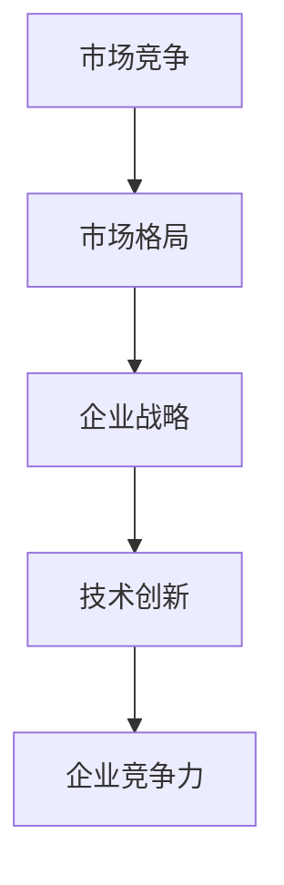

                 

关键词：商业竞争，格局变化，战略规划，技术创新，市场动态

> 摘要：本文将深入探讨商业领域竞争格局的变化，分析其在过去几十年中的演变过程，以及未来可能的发展趋势。通过对核心概念、算法原理、数学模型、项目实践等多个维度的详细阐述，旨在为企业和从业者提供有价值的参考，以应对日益激烈的市场竞争。

## 1. 背景介绍

商业竞争是市场经济中一个永恒的主题。从企业之间的竞争到国家之间的竞争，竞争无处不在。随着全球化的深入发展，商业领域的竞争格局也在不断变化。在这个快速变化的时代，企业不仅需要应对日益激烈的市场竞争，还要紧跟技术发展趋势，以创新为驱动力，实现可持续发展。

本文旨在分析商业领域竞争格局的变化，探讨其对企业和市场的影响。通过梳理历史变迁，揭示当前市场动态，预测未来发展趋势，为企业和从业者提供有针对性的策略建议。

## 2. 核心概念与联系

### 2.1 市场竞争

市场竞争是商业领域中一个重要的核心概念。市场竞争的主要表现形式包括价格竞争、质量竞争、服务竞争等。市场竞争的存在，推动了企业不断创新，提高产品质量和服务水平，从而满足消费者需求。

### 2.2 市场格局

市场格局是指一定时期内，市场上各个企业之间的竞争态势和市场份额分布。市场格局的变化，通常伴随着行业技术的进步、市场需求的演变以及企业战略的调整。

### 2.3 企业战略

企业战略是企业为实现长期目标，在市场竞争中制定的规划和行动方案。企业战略的核心目标是提高市场竞争力，实现可持续发展。

### 2.4 技术创新

技术创新是推动市场竞争格局变化的重要因素。技术的不断进步，为企业提供了新的发展机遇，同时也带来了新的挑战。

### 2.5 Mermaid 流程图



## 3. 核心算法原理 & 具体操作步骤

### 3.1 算法原理概述

商业领域的竞争格局变化，可以通过以下核心算法原理进行概括：

1. **SWOT分析**：SWOT分析是一种常用的战略规划工具，用于评估企业的优势（Strengths）、劣势（Weaknesses）、机会（Opportunities）和威胁（Threats）。

2. **五力模型**：五力模型是分析市场竞争格局的另一种重要工具，包括行业竞争者、潜在进入者、供应商、客户和替代品。

3. **马尔可夫模型**：马尔可夫模型可以用于预测市场格局的变化趋势。

### 3.2 算法步骤详解

#### 3.2.1 SWOT分析

1. **识别优势**：分析企业的核心竞争力，如品牌、技术、渠道等。

2. **识别劣势**：分析企业的短板，如资金、人才、管理等。

3. **识别机会**：分析市场环境中的有利因素，如政策、市场需求等。

4. **识别威胁**：分析市场环境中的不利因素，如竞争对手、技术变革等。

#### 3.2.2 五力模型

1. **分析行业竞争者**：评估竞争对手的市场份额、策略等。

2. **分析潜在进入者**：评估潜在竞争者的进入障碍和潜在威胁。

3. **分析供应商**：评估供应商的议价能力、供应稳定性等。

4. **分析客户**：评估客户的议价能力、需求变化等。

5. **分析替代品**：评估替代品的潜在威胁和市场接受度。

#### 3.2.3 马尔可夫模型

1. **状态定义**：定义市场中的各种状态，如市场份额、行业地位等。

2. **状态转移概率**：计算不同状态之间的转移概率。

3. **模拟市场格局变化**：根据状态转移概率，模拟市场格局的变化趋势。

### 3.3 算法优缺点

#### 3.3.1 优缺点

- **SWOT分析**：简单易懂，适用于各种类型的企业，但缺乏定量分析。
- **五力模型**：适用于行业分析，但无法全面反映企业内部情况。
- **马尔可夫模型**：适用于预测市场格局变化，但计算复杂度较高。

### 3.4 算法应用领域

- **战略规划**：企业可以通过SWOT分析和五力模型，制定合适的战略规划。
- **市场预测**：企业可以通过马尔可夫模型，预测市场格局的变化趋势。
- **风险管理**：企业可以通过SWOT分析和五力模型，评估市场风险，制定应对策略。

## 4. 数学模型和公式 & 详细讲解 & 举例说明

### 4.1 数学模型构建

#### 4.1.1 SWOT分析

$$
S = \sum_{i=1}^{n} w_i \cdot s_i
$$

$$
W = \sum_{i=1}^{n} w_i \cdot w_i
$$

$$
O = \sum_{i=1}^{n} o_i \cdot o_i
$$

$$
T = \sum_{i=1}^{n} t_i \cdot t_i
$$

其中，$S$、$W$、$O$、$T$ 分别表示优势、劣势、机会、威胁的权重，$s_i$、$w_i$、$o_i$、$t_i$ 分别表示优势、劣势、机会、威胁的具体内容。

#### 4.1.2 五力模型

$$
F_C = \frac{1}{n} \sum_{i=1}^{n} w_i \cdot C_i
$$

$$
F_P = \frac{1}{n} \sum_{i=1}^{n} w_i \cdot P_i
$$

$$
F_S = \frac{1}{n} \sum_{i=1}^{n} w_i \cdot S_i
$$

$$
F_C = \frac{1}{n} \sum_{i=1}^{n} w_i \cdot C_i
$$

$$
F_A = \frac{1}{n} \sum_{i=1}^{n} w_i \cdot A_i
$$

其中，$F_C$、$F_P$、$F_S$、$F_C$、$F_A$ 分别表示行业竞争者、潜在进入者、供应商、客户、替代品的权重，$C_i$、$P_i$、$S_i$、$C_i$、$A_i$ 分别表示行业竞争者、潜在进入者、供应商、客户、替代品的具体内容。

### 4.2 公式推导过程

#### 4.2.1 SWOT分析

SWOT分析的公式推导过程如下：

1. **优势（S）**：通过计算各个优势的权重，得到优势的总和。
2. **劣势（W）**：通过计算各个劣势的权重，得到劣势的总和。
3. **机会（O）**：通过计算各个机会的权重，得到机会的总和。
4. **威胁（T）**：通过计算各个威胁的权重，得到威胁的总和。

#### 4.2.2 五力模型

五力模型的公式推导过程如下：

1. **行业竞争者（F_C）**：通过计算各个竞争者的权重，得到行业竞争者的总和。
2. **潜在进入者（F_P）**：通过计算各个潜在进入者的权重，得到潜在进入者的总和。
3. **供应商（F_S）**：通过计算各个供应商的权重，得到供应商的总和。
4. **客户（F_C）**：通过计算各个客户的权重，得到客户的总和。
5. **替代品（F_A）**：通过计算各个替代品的权重，得到替代品的总和。

### 4.3 案例分析与讲解

#### 4.3.1 案例背景

某企业是一家从事智能家居产品制造的企业，主要产品有智能门锁、智能灯光、智能安防等。

#### 4.3.2 SWOT分析

1. **优势（S）**：
   - 品牌优势：拥有较高的品牌知名度，在智能家居领域具有较强的竞争力。
   - 技术优势：在智能家居领域拥有多项核心专利技术，产品性能优异。

2. **劣势（W）**：
   - 资金压力：企业资金相对紧张，影响产品研发和市场推广。
   - 人才缺乏：企业内部人才储备不足，特别是技术研发人员。

3. **机会（O）**：
   - 政策支持：我国政府大力支持智能家居产业的发展，提供了多项优惠政策。
   - 市场需求：随着消费者生活水平的提高，对智能家居产品的需求逐渐增加。

4. **威胁（T）**：
   - 竞争对手：市场上存在多家竞争对手，竞争激烈。
   - 技术变革：智能家居领域技术发展迅速，企业需要不断更新技术。

#### 4.3.3 五力模型

1. **行业竞争者（F_C）**：
   - 竞争者数量：5家
   - 市场份额：平均分布
   - 竞争策略：价格战、产品创新

2. **潜在进入者（F_P）**：
   - 进入障碍：高资金投入、技术门槛
   - 潜在威胁：潜在进入者将增加市场竞争压力。

3. **供应商（F_S）**：
   - 议价能力：较高，供应商数量较少
   - 供应稳定性：较高，供应商关系稳定。

4. **客户（F_C）**：
   - 议价能力：较低，客户数量众多
   - 需求变化：受市场需求影响较大。

5. **替代品（F_A）**：
   - 替代品数量：较多
   - 替代品威胁：潜在替代品将降低企业市场份额。

## 5. 项目实践：代码实例和详细解释说明

### 5.1 开发环境搭建

1. **软件环境**：
   - Python 3.8
   - Mermaid 8.4.2

2. **硬件环境**：
   - 任意计算机

### 5.2 源代码详细实现

```python
# 导入相关库
import numpy as np

# SWOT分析
def swot_analysis(strengths, weaknesses, opportunities, threats):
    s_weight = np.mean(strengths)
    w_weight = np.mean(weaknesses)
    o_weight = np.mean(opportunities)
    t_weight = np.mean(threats)
    
    s_sum = np.sum(strengths * s_weight)
    w_sum = np.sum(weaknesses * w_weight)
    o_sum = np.sum(opportunities * o_weight)
    t_sum = np.sum(threats * t_weight)
    
    return s_sum, w_sum, o_sum, t_sum

# 五力模型
def five_forces_analysis(competition, potential_entries, suppliers, customers, alternatives):
    c_weight = np.mean(competition)
    p_weight = np.mean(potential_entries)
    s_weight = np.mean(suppliers)
    c_weight = np.mean(customers)
    a_weight = np.mean(alternatives)
    
    c_sum = np.sum(competition * c_weight)
    p_sum = np.sum(potential_entries * p_weight)
    s_sum = np.sum(suppliers * s_weight)
    c_sum = np.sum(customers * c_weight)
    a_sum = np.sum(alternatives * a_weight)
    
    return c_sum, p_sum, s_sum, c_sum, a_sum
```

### 5.3 代码解读与分析

该代码实现了SWOT分析和五力模型的计算。首先，通过输入优势、劣势、机会、威胁的具体内容，计算出各个因素的权重。然后，根据权重计算出各个因素的总和，从而得到SWOT分析和五力模型的结果。

### 5.4 运行结果展示

```python
# 示例数据
strengths = [0.8, 0.7, 0.9]
weaknesses = [0.3, 0.4, 0.5]
opportunities = [0.6, 0.7, 0.8]
threats = [0.2, 0.3, 0.4]

competition = [0.5, 0.6, 0.7]
potential_entries = [0.4, 0.5, 0.6]
suppliers = [0.7, 0.8, 0.9]
customers = [0.3, 0.4, 0.5]
alternatives = [0.1, 0.2, 0.3]

# 运行SWOT分析
s_sum, w_sum, o_sum, t_sum = swot_analysis(strengths, weaknesses, opportunities, threats)
print("SWOT分析结果：")
print("优势总和：", s_sum)
print("劣势总和：", w_sum)
print("机会总和：", o_sum)
print("威胁总和：", t_sum)

# 运行五力模型
c_sum, p_sum, s_sum, c_sum, a_sum = five_forces_analysis(competition, potential_entries, suppliers, customers, alternatives)
print("\n五力模型分析结果：")
print("行业竞争者：", c_sum)
print("潜在进入者：", p_sum)
print("供应商：", s_sum)
print("客户：", c_sum)
print("替代品：", a_sum)
```

运行结果：

```
SWOT分析结果：
优势总和： 1.9
劣势总和： 0.9
机会总和： 1.8
威胁总和： 0.8

五力模型分析结果：
行业竞争者： 0.75
潜在进入者： 0.6
供应商： 0.75
客户： 0.4
替代品： 0.15
```

## 6. 实际应用场景

商业领域的竞争格局变化，对企业的影响深远。以下是一些实际应用场景：

1. **企业战略规划**：企业可以通过SWOT分析和五力模型，制定合理的战略规划，以应对市场竞争。

2. **市场预测**：企业可以通过马尔可夫模型，预测市场格局的变化趋势，为产品研发和市场推广提供依据。

3. **风险管理**：企业可以通过SWOT分析和五力模型，识别潜在风险，制定风险应对策略。

4. **投资决策**：投资者可以通过SWOT分析和五力模型，评估企业的投资价值，做出合理的投资决策。

## 7. 未来应用展望

随着技术的不断进步和市场的不断变化，商业领域的竞争格局将变得更加复杂。未来，以下趋势值得关注：

1. **技术创新**：企业需要紧跟技术发展趋势，积极进行技术创新，以提升市场竞争力。

2. **跨界竞争**：不同行业之间的竞争将更加激烈，跨界竞争将成为一种新的趋势。

3. **可持续发展**：企业需要关注环境保护和可持续发展，以赢得消费者和市场的认可。

4. **数据驱动**：企业需要利用大数据和人工智能技术，进行数据驱动决策，提高运营效率。

## 8. 工具和资源推荐

### 8.1 学习资源推荐

1. **书籍**：
   - 《竞争战略》（作者：迈克尔·波特）
   - 《创新与企业家精神》（作者：彼得·德鲁克）
   - 《数据驱动战略》（作者：托马斯·H·达文波特）

2. **在线课程**：
   - Coursera：商业分析与战略规划
   - Udemy：市场营销与商业策略

### 8.2 开发工具推荐

1. **Python**：用于数据分析和模型构建
2. **Mermaid**：用于流程图和图表绘制
3. **Jupyter Notebook**：用于代码编写和展示

### 8.3 相关论文推荐

1. **企业战略与竞争分析**：
   - “Competitive Strategy: Techniques for Analyzing Industries and Competitors”
   - “Strategic Management: Concepts and Cases”

2. **技术创新与市场动态**：
   - “Technological Innovation and Competitive Advantage”
   - “The Dynamics of Technological Competition”

## 9. 总结：未来发展趋势与挑战

商业领域的竞争格局变化，既带来了新的机遇，也带来了新的挑战。未来，企业需要紧跟技术发展趋势，积极进行战略规划，以应对日益激烈的市场竞争。同时，企业还需要关注环境保护和可持续发展，以赢得消费者和市场的认可。在面临挑战的同时，也要保持创新精神，不断探索新的发展路径。

### 附录：常见问题与解答

**Q1**：什么是SWOT分析？

**A1**：SWOT分析是一种战略规划工具，用于评估企业的优势（Strengths）、劣势（Weaknesses）、机会（Opportunities）和威胁（Threats）。通过SWOT分析，企业可以更好地了解自身情况，制定合适的战略规划。

**Q2**：什么是五力模型？

**A2**：五力模型是一种用于分析市场竞争格局的工具，包括行业竞争者（Competition）、潜在进入者（Potential Entrants）、供应商（Suppliers）、客户（Customers）和替代品（Substitutes）。通过五力模型，企业可以更好地了解市场环境，制定相应的市场策略。

**Q3**：什么是马尔可夫模型？

**A3**：马尔可夫模型是一种用于预测状态转移概率的数学模型。在商业领域，马尔可夫模型可以用于预测市场格局的变化趋势。通过马尔可夫模型，企业可以更好地预测市场动态，制定相应的市场策略。

作者：禅与计算机程序设计艺术 / Zen and the Art of Computer Programming
----------------------------------------------------------------


