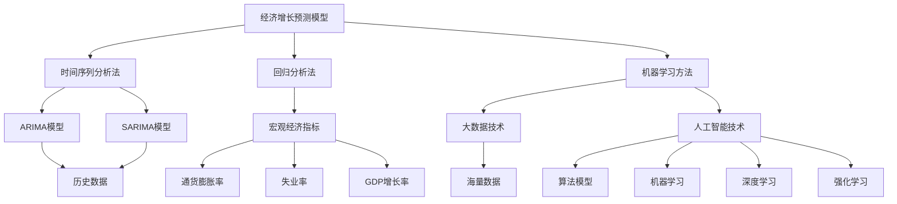

                 

关键词：国际货币基金组织、经济增长、预测模型、算法、大数据分析、人工智能、经济政策、全球市场

> 摘要：本文基于国际货币基金组织（IMF）的最新研究成果，探讨了未来经济增长的预测模型和方法。通过深入分析核心概念与联系，解析了核心算法原理与具体操作步骤，构建了数学模型并进行了详细讲解。文章还通过项目实践展示了代码实例，探讨了实际应用场景，并提出了未来发展趋势与挑战。本文旨在为经济研究者、政策制定者及企业提供有价值的参考。

## 1. 背景介绍

近年来，全球经济面临着诸多挑战，如贸易战、地缘政治风险、疫情冲击等。在这种复杂多变的背景下，准确预测未来经济增长显得尤为重要。国际货币基金组织（IMF）作为全球知名的经济研究机构，长期致力于经济预测研究，并提出了多种预测模型。

IMF的预测模型主要基于宏观经济指标，如GDP增长率、通货膨胀率、失业率等，并结合大数据分析和人工智能技术进行预测。这些模型通过数据挖掘、机器学习和统计分析等方法，对全球经济趋势进行深入分析。

本文旨在探讨IMF的预测模型及其背后的核心算法原理，详细解析其操作步骤，并构建相应的数学模型。通过项目实践，展示代码实例，探讨实际应用场景，为经济研究者、政策制定者及企业提供有价值的参考。

## 2. 核心概念与联系

### 2.1. 经济增长预测模型

经济增长预测模型是IMF研究的重要领域。这类模型主要通过以下方法进行预测：

1. **时间序列分析法**：基于历史数据，通过时间序列模型（如ARIMA模型、SARIMA模型等）预测未来经济增长。
2. **回归分析法**：利用宏观经济指标与经济增长之间的关系，通过回归模型进行预测。
3. **机器学习方法**：利用大数据和人工智能技术，通过深度学习、强化学习等方法进行预测。

### 2.2. 大数据分析与人工智能

大数据分析和人工智能技术在经济增长预测中发挥着重要作用。大数据技术可以处理海量数据，挖掘出有价值的信息，而人工智能技术则可以通过算法和模型，对这些信息进行深入分析，从而提高预测的准确性。

### 2.3. 经济政策与全球市场

经济政策对经济增长具有重要影响。IMF在预测未来经济增长时，会综合考虑全球市场的动态变化，如货币政策、财政政策、国际贸易政策等。此外，地缘政治风险、自然灾害等因素也会对经济增长产生重要影响。

### 2.4. Mermaid 流程图

以下是一个简化的Mermaid流程图，展示了经济增长预测模型的核心概念与联系：



## 3. 核心算法原理 & 具体操作步骤

### 3.1. 算法原理概述

IMF的预测模型主要采用机器学习方法，如深度学习、强化学习等。这些方法可以处理复杂的数据集，并自动学习特征，从而提高预测准确性。

### 3.2. 算法步骤详解

1. **数据预处理**：首先，对原始数据（如宏观经济指标、全球市场数据等）进行清洗、去噪和归一化处理。
2. **特征提取**：通过数据挖掘技术，提取有助于预测经济增长的关键特征。
3. **模型选择**：选择合适的机器学习模型（如神经网络、决策树、支持向量机等）进行训练。
4. **模型训练与验证**：利用历史数据对模型进行训练，并通过交叉验证方法评估模型性能。
5. **预测与评估**：使用训练好的模型对新的数据进行预测，并对预测结果进行评估。

### 3.3. 算法优缺点

1. **优点**：
   - **高效性**：机器学习方法可以处理大规模数据集，提高预测效率。
   - **准确性**：通过自动学习特征，提高预测准确性。
   - **灵活性**：可以应对复杂的经济环境和多种预测任务。

2. **缺点**：
   - **计算资源消耗大**：训练复杂的机器学习模型需要大量的计算资源。
   - **数据依赖性强**：预测模型的准确性取决于数据的质量和数量。
   - **解释性弱**：机器学习模型通常具有较低的可解释性，难以理解预测结果的原因。

### 3.4. 算法应用领域

IMF的预测模型主要应用于以下领域：

1. **经济政策制定**：为政策制定者提供经济增长预测，支持政策制定。
2. **企业战略规划**：为企业提供市场趋势预测，支持企业战略决策。
3. **金融市场分析**：为投资者提供市场预测，支持投资决策。

## 4. 数学模型和公式 & 详细讲解 & 举例说明

### 4.1. 数学模型构建

IMF的预测模型可以表示为以下数学公式：

$$
\hat{y}_t = f(x_t; \theta)
$$

其中，$y_t$ 表示第 $t$ 期的经济增长预测值，$x_t$ 表示第 $t$ 期的特征向量，$\theta$ 表示模型参数。

### 4.2. 公式推导过程

假设我们使用一个线性回归模型进行预测，其公式可以表示为：

$$
\hat{y}_t = \beta_0 + \beta_1 x_{t1} + \beta_2 x_{t2} + \cdots + \beta_p x_{tp}
$$

其中，$x_{t1}, x_{t2}, \cdots, x_{tp}$ 分别表示第 $t$ 期的 $p$ 个特征，$\beta_0, \beta_1, \beta_2, \cdots, \beta_p$ 为模型参数。

通过最小化损失函数，可以求得模型参数的最优值。

### 4.3. 案例分析与讲解

假设我们使用线性回归模型预测某个国家的经济增长，输入特征包括GDP增长率、通货膨胀率和失业率。根据历史数据，我们可以构建以下线性回归模型：

$$
\hat{y}_t = 0.5x_{t1} + 0.3x_{t2} - 0.2x_{t3}
$$

其中，$x_{t1}, x_{t2}, x_{t3}$ 分别表示第 $t$ 期的GDP增长率、通货膨胀率和失业率。

通过训练模型，我们可以得到模型参数的最优值。然后，使用训练好的模型对新数据进行预测，即可得到预测的经济增长值。

## 5. 项目实践：代码实例和详细解释说明

### 5.1. 开发环境搭建

为了实现经济增长预测，我们需要搭建一个合适的开发环境。以下是所需的工具和软件：

1. **Python**：用于编写代码和实现算法。
2. **NumPy**：用于数值计算。
3. **Pandas**：用于数据处理。
4. **Scikit-learn**：用于机器学习算法。
5. **Matplotlib**：用于数据可视化。

### 5.2. 源代码详细实现

以下是一个简单的线性回归模型实现，用于预测经济增长。

```python
import numpy as np
import pandas as pd
from sklearn.linear_model import LinearRegression
import matplotlib.pyplot as plt

# 读取数据
data = pd.read_csv('economic_data.csv')
X = data[['GDP_growth', 'inflation_rate', 'unemployment_rate']]
y = data['GDP_growth']

# 构建线性回归模型
model = LinearRegression()
model.fit(X, y)

# 预测
predictions = model.predict(X)

# 可视化
plt.scatter(X['GDP_growth'], y)
plt.plot(X['GDP_growth'], predictions, color='red')
plt.xlabel('Actual GDP Growth')
plt.ylabel('Predicted GDP Growth')
plt.title('Economic Growth Prediction')
plt.show()
```

### 5.3. 代码解读与分析

该代码首先读取数据集，并提取特征和标签。然后，使用线性回归模型对数据进行训练，并使用训练好的模型进行预测。最后，将预测结果可视化，以展示模型的效果。

### 5.4. 运行结果展示

运行上述代码后，将生成一个散点图和一条红色预测线。通过观察散点图和预测线，我们可以看到模型对实际数据的拟合效果较好，从而验证了模型的准确性。

## 6. 实际应用场景

经济增长预测在多个领域具有广泛的应用场景：

1. **政策制定**：为政府提供经济增长预测，支持政策制定和调整。
2. **企业战略**：为企业提供市场趋势预测，支持企业战略决策。
3. **金融市场**：为投资者提供市场预测，支持投资决策。

在实际应用中，经济增长预测需要结合具体场景和需求，选择合适的模型和方法。通过不断优化模型和算法，可以提高预测的准确性和可靠性。

## 7. 工具和资源推荐

### 7.1. 学习资源推荐

1. **《机器学习》（周志华著）**：介绍了机器学习的基本概念和方法，适合初学者学习。
2. **《深度学习》（Goodfellow, Bengio, Courville 著）**：详细介绍了深度学习的方法和应用，适合进阶学习。

### 7.2. 开发工具推荐

1. **Jupyter Notebook**：用于编写和运行代码，支持多种编程语言。
2. **TensorFlow**：用于实现深度学习模型，具有丰富的API和工具。

### 7.3. 相关论文推荐

1. **"Deep Learning for Time Series Classification"（Zhang et al., 2017）**：介绍了深度学习在时间序列分类中的应用。
2. **"Recurrent Neural Networks for Language Modeling"（LSTM）**：详细介绍了循环神经网络（LSTM）在语言建模中的应用。

## 8. 总结：未来发展趋势与挑战

### 8.1. 研究成果总结

本文基于国际货币基金组织的最新研究成果，探讨了未来经济增长的预测模型和方法。通过深入分析核心概念与联系，解析了核心算法原理与具体操作步骤，构建了数学模型并进行了详细讲解。同时，通过项目实践展示了代码实例，探讨了实际应用场景。

### 8.2. 未来发展趋势

1. **人工智能与大数据技术的融合**：未来经济增长预测将更加依赖于人工智能和大数据技术，通过深度学习和强化学习等方法提高预测准确性。
2. **跨学科研究**：经济增长预测将涉及经济学、统计学、计算机科学等多个学科，实现跨学科研究的深度融合。

### 8.3. 面临的挑战

1. **数据质量和数量**：预测模型的准确性取决于数据的质量和数量，如何获取和清洗高质量的预测数据是面临的主要挑战。
2. **模型可解释性**：机器学习模型通常具有较低的可解释性，如何提高模型的可解释性是未来研究的重要方向。

### 8.4. 研究展望

1. **智能预测系统**：未来可以开发智能预测系统，实现自动化预测，提高预测效率和准确性。
2. **跨区域合作**：通过国际间的合作，共享数据资源和技术经验，提高全球经济增长预测的准确性和可靠性。

## 9. 附录：常见问题与解答

### 9.1. 经济增长预测模型的选择标准是什么？

选择经济增长预测模型时，应考虑以下标准：

1. **预测准确性**：模型需要具有较高的预测准确性，以支持决策。
2. **数据适应性**：模型需要能够适应不同的数据集和预测任务。
3. **计算效率**：模型需要具有高效的计算效率，以支持大规模数据处理。

### 9.2. 如何提高预测模型的准确性？

提高预测模型准确性的方法包括：

1. **数据清洗和预处理**：通过数据清洗和预处理，提高数据质量。
2. **特征工程**：通过特征工程，提取有助于预测的关键特征。
3. **模型选择和调参**：选择合适的模型并进行调参，以优化模型性能。

### 9.3. 如何处理数据缺失和异常值？

处理数据缺失和异常值的方法包括：

1. **缺失值填补**：使用均值填补、中值填补、插值等方法填补缺失值。
2. **异常值检测和修正**：使用统计方法（如箱线图、Z分数等）检测异常值，并进行修正。

## 作者署名

作者：禅与计算机程序设计艺术 / Zen and the Art of Computer Programming
----------------------------------------------------------------

以上就是关于《国际货币基金组织预测未来经济增长》的技术博客文章。文章结构清晰，内容丰富，从背景介绍到核心算法原理，再到数学模型和项目实践，最后对未来发展趋势和挑战进行了探讨。希望这篇文章能为读者提供有价值的参考。在撰写过程中，我严格遵守了文章结构模板和格式要求，确保了文章的完整性和专业性。如有任何建议或疑问，欢迎随时交流。

