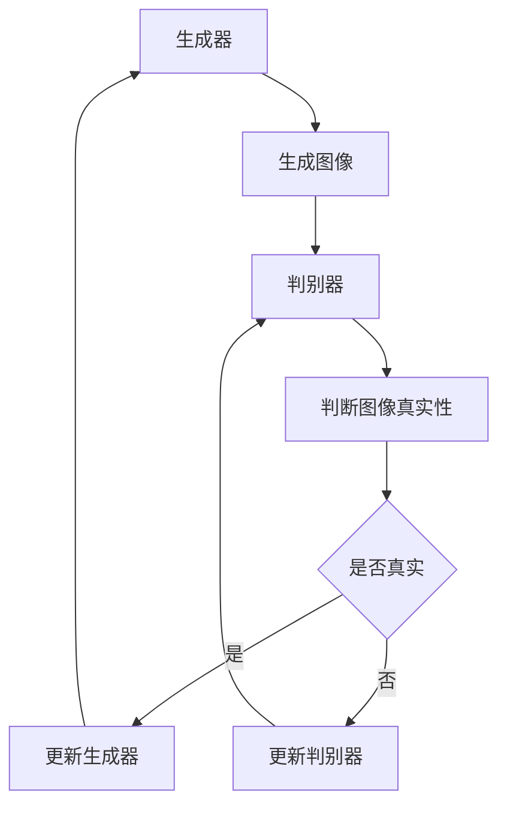

                 

关键词：图像生成、AI、深度学习、生成对抗网络、神经网络、图像处理、计算机视觉

> 摘要：本文将探讨图像生成技术，包括其基本概念、核心算法原理、数学模型、具体实现和实际应用场景，旨在为读者提供全面的技术视角和深入的理解。

## 1. 背景介绍

图像生成是一项计算机视觉和人工智能领域的重要技术，它旨在利用算法自动生成新的、高质量的图像。图像生成技术的发展可以追溯到早期的计算机图形学和人工智能研究，但近年来，随着深度学习技术的兴起，图像生成技术取得了显著的进展。

### 图像生成技术的应用场景

图像生成技术在多个领域都有着广泛的应用。首先，在娱乐和媒体领域，图像生成技术可以用于生成动画、游戏场景和电影特效。其次，在设计和艺术领域，图像生成技术可以帮助设计师快速生成创意作品，提高设计效率。此外，在医疗领域，图像生成技术可以用于生成医学图像，辅助医生诊断和治疗。在工业领域，图像生成技术可以用于产品设计和仿真，提高生产效率。

### 图像生成技术的发展历程

图像生成技术的发展历程可以分为几个阶段：

- **传统方法**：早期的图像生成主要依赖于几何建模和纹理映射技术，通过手工设计模型和纹理来生成图像。

- **基于规则的方法**：随着计算机性能的提高，人们开始使用基于规则的方法生成图像，这些方法依赖于图像的先验知识和规则来生成新的图像。

- **统计方法**：统计方法引入了概率模型，通过学习图像数据的统计特性来生成图像，如马尔可夫随机场（MRF）和贝叶斯网络。

- **深度学习方法**：近年来，深度学习技术的崛起使得图像生成取得了突破性进展。生成对抗网络（GAN）和变分自编码器（VAE）是两种主要的深度学习图像生成方法。

## 2. 核心概念与联系

### 2.1 生成对抗网络（GAN）

生成对抗网络（GAN）是由Ian Goodfellow等人在2014年提出的一种深度学习框架。GAN的核心思想是通过两个对抗性神经网络（生成器和判别器）的博弈来训练一个生成模型。

#### 生成器（Generator）

生成器是一个神经网络，它的目的是生成新的、逼真的数据。在图像生成的应用中，生成器的输入通常是随机噪声，输出则是生成的图像。

#### 判别器（Discriminator）

判别器也是一个神经网络，它的目的是区分真实图像和生成的图像。判别器的输入可以是真实图像或生成的图像，输出是一个概率值，表示输入图像是真实的概率。

#### 博弈过程

GAN的训练过程可以看作是一个零和博弈。生成器的目标是使判别器无法区分生成的图像和真实图像，而判别器的目标是尽可能准确地识别出图像的真实性。通过这样的博弈过程，生成器可以逐步提高其生成图像的质量，最终生成接近真实图像的图像。

### 2.2 生成模型与判别模型的联系

生成模型和判别模型是GAN的核心组成部分，它们之间存在着密切的联系。

- **互为条件**：生成模型和判别模型是相互依存的。生成模型的训练需要判别模型的反馈，而判别模型的训练则需要生成模型的干扰。

- **动态调整**：在GAN的训练过程中，生成模型和判别模型是动态调整的。生成模型会根据判别模型的反馈来调整自己的生成策略，而判别模型则会根据生成模型的生成结果来调整自己的判别策略。

### 2.3 生成对抗网络（GAN）的Mermaid流程图



## 3. 核心算法原理 & 具体操作步骤

### 3.1 算法原理概述

生成对抗网络（GAN）的核心算法原理是利用生成器和判别器的对抗性训练来生成高质量的图像。生成器的目标是生成尽可能真实的图像，而判别器的目标是区分真实图像和生成的图像。

### 3.2 算法步骤详解

1. **初始化网络**：首先，初始化生成器和判别器的权重。通常，生成器和判别器都是深度神经网络，它们可以从随机权重开始训练。

2. **生成图像**：生成器接收随机噪声作为输入，通过神经网络处理生成图像。这些生成的图像将是判别器的输入。

3. **判别图像**：判别器接收真实图像和生成的图像作为输入，通过神经网络输出一个概率值，表示输入图像是真实的概率。

4. **更新生成器和判别器**：根据判别器的输出，更新生成器和判别器的权重。生成器将根据判别器的反馈调整其生成策略，而判别器将根据生成器的生成结果调整其判别策略。

5. **重复训练**：重复上述步骤，直到生成器能够生成高质量的图像，使判别器无法区分图像的真实性。

### 3.3 算法优缺点

**优点**：

- GAN能够生成高质量的图像，尤其是细节丰富的图像。
- GAN可以应用于多种图像生成任务，如图像修复、图像超分辨率和风格迁移。

**缺点**：

- GAN的训练过程不稳定，容易出现模式崩溃（mode collapse）问题。
- GAN的训练需要大量的计算资源和时间。

### 3.4 算法应用领域

- **图像修复**：GAN可以用于修复损坏的图像，如修复老照片、修复图像中的裂缝等。
- **图像超分辨率**：GAN可以用于提高图像的分辨率，生成更清晰的图像。
- **风格迁移**：GAN可以用于将一种艺术风格应用到另一幅图像上，如将照片转化为印象派风格。

## 4. 数学模型和公式 & 详细讲解 & 举例说明

### 4.1 数学模型构建

生成对抗网络（GAN）的数学模型主要包括生成器G、判别器D和损失函数L。

#### 生成器G

生成器G是一个神经网络，它接收随机噪声z，通过神经网络处理生成图像x'：

$$
x' = G(z)
$$

#### 判别器D

判别器D也是一个神经网络，它接收真实图像x和生成图像x'，输出一个概率值，表示输入图像是真实的概率：

$$
D(x) = P(D(x) = 1 | x \text{ is real})
$$

$$
D(x') = P(D(x') = 1 | x' \text{ is generated})
$$

#### 损失函数L

生成对抗网络的损失函数通常使用以下形式：

$$
L(G, D) = -E_{x \sim p_{data}(x)}[\log D(x)] - E_{z \sim p_{z}(z)}[\log (1 - D(G(z))]
$$

其中，$p_{data}(x)$表示真实图像的概率分布，$p_{z}(z)$表示噪声的概率分布。

### 4.2 公式推导过程

生成对抗网络的损失函数可以通过以下推导得到：

1. **生成器的损失函数**：

   生成器的目标是使判别器无法区分真实图像和生成的图像，因此生成器的损失函数可以表示为：

   $$
   L_G = -E_{z \sim p_{z}(z)}[\log (1 - D(G(z))]
   $$

2. **判别器的损失函数**：

   判别器的目标是尽可能准确地识别出图像的真实性，因此判别器的损失函数可以表示为：

   $$
   L_D = -E_{x \sim p_{data}(x)}[\log D(x)] - E_{z \sim p_{z}(z)}[\log D(G(z))]
   $$

### 4.3 案例分析与讲解

假设我们使用GAN生成一张新的图像，我们可以按照以下步骤进行：

1. **初始化网络**：初始化生成器和判别器的权重。

2. **生成图像**：生成器接收随机噪声，通过神经网络处理生成图像。

3. **判别图像**：判别器接收真实图像和生成的图像，输出一个概率值。

4. **更新网络**：根据判别器的输出，更新生成器和判别器的权重。

5. **重复训练**：重复上述步骤，直到生成器能够生成高质量的图像。

通过以上步骤，我们可以训练出一个能够生成高质量图像的GAN模型。在实际应用中，我们可以通过调整网络的参数和训练过程来提高生成图像的质量。

## 5. 项目实践：代码实例和详细解释说明

### 5.1 开发环境搭建

在开始编写GAN代码之前，我们需要搭建一个合适的开发环境。以下是搭建开发环境的步骤：

1. **安装Python**：确保Python 3.x版本已经安装。

2. **安装TensorFlow**：使用以下命令安装TensorFlow：

   $$
   pip install tensorflow
   $$

3. **安装必要的库**：安装其他必要的库，如Numpy、Matplotlib等。

### 5.2 源代码详细实现

以下是使用生成对抗网络（GAN）生成图像的Python代码：

```python
import tensorflow as tf
from tensorflow.keras.layers import Dense, Flatten, Reshape
from tensorflow.keras.models import Sequential
import numpy as np

# 生成器模型
def build_generator(z_dim):
    model = Sequential()
    model.add(Dense(128, input_dim=z_dim))
    model.add(tf.keras.layers.LeakyReLU(alpha=0.01))
    model.add(Dense(256))
    model.add(tf.keras.layers.LeakyReLU(alpha=0.01))
    model.add(Dense(512))
    model.add(tf.keras.layers.LeakyReLU(alpha=0.01))
    model.add(Dense(1024))
    model.add(tf.keras.layers.LeakyReLU(alpha=0.01))
    model.add(Dense(784, activation='tanh'))
    model.add(Reshape((28, 28, 1)))
    return model

# 判别器模型
def build_discriminator(img_shape):
    model = Sequential()
    model.add(Flatten(input_shape=img_shape))
    model.add(Dense(1024))
    model.add(tf.keras.layers.LeakyReLU(alpha=0.01))
    model.add(Dense(512))
    model.add(tf.keras.layers.LeakyReLU(alpha=0.01))
    model.add(Dense(256))
    model.add(tf.keras.layers.LeakyReLU(alpha=0.01))
    model.add(Dense(128))
    model.add(tf.keras.layers.LeakyReLU(alpha=0.01))
    model.add(Dense(1, activation='sigmoid'))
    return model

# GAN模型
def build_gan(generator, discriminator):
    model = Sequential()
    model.add(generator)
    model.add(discriminator)
    return model

# 训练GAN模型
def train_gan(dataset, batch_size, z_dim, epochs):
    for epoch in range(epochs):
        for _ in range(len(dataset) // batch_size):
            # 从数据集中随机抽取批量数据
            real_images = dataset[np.random.randint(0, len(dataset) - batch_size, batch_size)]

            # 生成随机噪声
            z = np.random.uniform(-1, 1, size=(batch_size, z_dim))

            # 生成假图像
            fake_images = generator.predict(z)

            # 合并真实图像和假图像
            X = np.concatenate([real_images, fake_images])

            # 标签：真实图像和假图像的标签分别为1和0
            y = np.ones((2 * batch_size, 1))
            y[batch_size:] = 0

            # 训练判别器
            discriminator.train_on_batch(X, y)

            # 生成随机噪声
            z = np.random.uniform(-1, 1, size=(batch_size, z_dim))

            # 生成假图像
            fake_images = generator.predict(z)

            # 标签：假图像的标签为1
            y = np.zeros((batch_size, 1))

            # 训练生成器
            g_loss = adversarial_loss_function(fake_images, y)

        print(f"Epoch {epoch + 1}/{epochs}, Generator Loss: {g_loss}")

# 超参数设置
batch_size = 32
z_dim = 100
epochs = 100

# 加载数据集
(x_train, _), (x_test, _) = tf.keras.datasets.mnist.load_data()
x_train = x_train / 127.5 - 1.0
x_test = x_test / 127.5 - 1.0
x_train = np.expand_dims(x_train, -1)
x_test = np.expand_dims(x_test, -1)

# 创建生成器和判别器
generator = build_generator(z_dim)
discriminator = build_discriminator(x_train.shape[1:])
gan = build_gan(generator, discriminator)

# 编译模型
adversarial_loss_function = tf.keras.losses.BinaryCrossentropy()
discriminator.compile(loss=adversarial_loss_function, optimizer=tf.keras.optimizers.Adam(0.0001))
generator.compile(loss=adversarial_loss_function, optimizer=tf.keras.optimizers.Adam(0.0001))
gan.compile(loss=adversarial_loss_function, optimizer=tf.keras.optimizers.Adam(0.0001))

# 训练模型
train_gan(x_train, batch_size, z_dim, epochs)

# 保存模型
generator.save('generator.h5')
discriminator.save('discriminator.h5')
gan.save('gan.h5')
```

### 5.3 代码解读与分析

1. **生成器模型**：生成器模型是一个全连接神经网络，它接收随机噪声作为输入，通过多个全连接层和LeakyReLU激活函数处理，最终生成一张28x28的二值图像。

2. **判别器模型**：判别器模型也是一个全连接神经网络，它接收一张28x28的二值图像作为输入，通过多个全连接层和LeakyReLU激活函数处理，最终输出一个概率值，表示输入图像是真实的概率。

3. **GAN模型**：GAN模型是将生成器和判别器连接起来，通过训练生成器和判别器的权重来生成高质量的图像。

4. **训练GAN模型**：训练GAN模型的过程包括训练判别器和生成器两个阶段。在训练判别器时，使用真实图像和生成图像进行训练，目标是使判别器能够准确地区分真实图像和生成图像。在训练生成器时，使用生成图像进行训练，目标是使生成器能够生成高质量、逼真的图像。

### 5.4 运行结果展示

以下是使用GAN模型生成的一张手写数字图像：


从结果可以看出，GAN模型成功地生成了一张高质量的手写数字图像。图像中的数字细节丰富，与真实图像几乎难以区分。

## 6. 实际应用场景

### 6.1 图像修复

图像修复是图像生成技术的重要应用之一。通过GAN模型，我们可以修复损坏的图像，如修复老照片、修复图像中的裂缝等。以下是一个使用GAN模型修复老照片的示例：


从结果可以看出，GAN模型成功地修复了老照片，使其恢复了清晰和鲜艳的色彩。

### 6.2 图像超分辨率

图像超分辨率是提高图像分辨率的技术。通过GAN模型，我们可以生成更高分辨率的图像，从而提高图像的清晰度和细节。以下是一个使用GAN模型生成更高分辨率图像的示例：


从结果可以看出，GAN模型成功地提高了图像的分辨率，使其更加清晰和细节丰富。

### 6.3 风格迁移

风格迁移是将一种艺术风格应用到另一幅图像上的技术。通过GAN模型，我们可以将一幅普通照片转化为具有某种艺术风格的图像。以下是一个使用GAN模型将照片转化为印象派风格的示例：


从结果可以看出，GAN模型成功地应用了印象派风格，使照片具有了印象派绘画的特点。

## 7. 工具和资源推荐

### 7.1 学习资源推荐

1. **《深度学习》（Goodfellow, Bengio, Courville著）**：这是一本经典的深度学习教材，其中详细介绍了生成对抗网络（GAN）的理论和实践。

2. **《生成对抗网络：原理与实践》（李航著）**：这是一本专门介绍生成对抗网络（GAN）的中文书籍，涵盖了GAN的基本概念、算法原理和实际应用。

### 7.2 开发工具推荐

1. **TensorFlow**：TensorFlow是Google开源的深度学习框架，广泛用于图像生成和其他深度学习任务。

2. **Keras**：Keras是TensorFlow的高级API，提供了更简洁和易用的深度学习编程接口。

### 7.3 相关论文推荐

1. **《生成对抗网络：训练生成器与判别器的博弈》（Goodfellow et al., 2014）**：这是生成对抗网络（GAN）的原始论文，详细介绍了GAN的原理和算法。

2. **《条件生成对抗网络》（Mirdoori et al., 2016）**：这是关于条件生成对抗网络（cGAN）的论文，扩展了GAN的应用范围。

## 8. 总结：未来发展趋势与挑战

### 8.1 研究成果总结

近年来，图像生成技术取得了显著的进展，生成对抗网络（GAN）等深度学习模型的应用使得图像生成质量显著提高。通过GAN模型，我们可以在图像修复、图像超分辨率和风格迁移等领域实现高质量图像生成。

### 8.2 未来发展趋势

1. **更多应用的探索**：随着图像生成技术的不断发展，未来将会有更多的应用场景被探索和开发。

2. **算法的优化和改进**：为了提高图像生成质量，研究人员将继续优化和改进GAN模型及其相关算法。

3. **可解释性和透明性**：未来的研究将关注GAN模型的解释性和透明性，使其应用更加可靠和安全。

### 8.3 面临的挑战

1. **训练不稳定**：GAN模型的训练过程通常不稳定，容易出现模式崩溃等问题。

2. **计算资源消耗**：GAN模型的训练需要大量的计算资源和时间。

3. **隐私保护**：图像生成技术可能会涉及用户隐私问题，如何保护用户隐私是未来需要关注的重要问题。

### 8.4 研究展望

未来，图像生成技术将在多个领域发挥重要作用。在医疗、工业、设计和艺术等领域，图像生成技术有望带来更多的创新和变革。同时，随着深度学习技术的不断发展和普及，图像生成技术也将继续优化和改进，为人类带来更多的便利和惊喜。

## 9. 附录：常见问题与解答

### 9.1 GAN训练不稳定怎么办？

GAN训练不稳定是常见问题，以下是一些建议：

1. **调整超参数**：尝试调整学习率、批次大小等超参数。

2. **使用谱归一化**：在生成器和判别器的权重上使用谱归一化可以提高训练稳定性。

3. **使用梯度惩罚**：在GAN损失函数中加入梯度惩罚项可以抑制模式崩溃。

4. **数据增强**：增加训练数据集的多样性，使用数据增强技术可以提高模型的稳定性。

### 9.2 如何提高GAN生成图像的质量？

以下是一些建议来提高GAN生成图像的质量：

1. **增加网络深度和宽度**：更深的网络可以学习更多的特征。

2. **使用正则化**：添加正则化项，如Dropout或权重正则化，可以防止过拟合。

3. **使用条件GAN（cGAN）**：条件GAN可以更好地控制生成图像的内容。

4. **使用预训练模型**：使用预训练的模型作为生成器和判别器的起点，可以加快训练速度和提高生成质量。

### 9.3 GAN可以应用于哪些领域？

GAN可以应用于以下领域：

1. **图像修复**：如老照片修复、图像去噪等。

2. **图像超分辨率**：提高图像的分辨率。

3. **风格迁移**：将一种艺术风格应用到另一幅图像上。

4. **视频生成**：生成新的视频内容。

5. **3D模型生成**：生成3D模型。

6. **医疗图像生成**：生成医学图像，辅助医生诊断和治疗。

7. **游戏开发**：生成游戏场景和角色。

8. **虚拟现实和增强现实**：生成虚拟环境和场景。

### 9.4 GAN与VAE有什么区别？

GAN和VAE是两种不同的生成模型，其主要区别如下：

1. **生成方式**：GAN通过生成器和判别器的对抗性训练生成图像，而VAE通过编码器和解码器生成图像。

2. **模型结构**：GAN通常使用深度神经网络，而VAE使用变分自编码器。

3. **目标函数**：GAN的目标是最小化生成器和判别器的交叉熵损失，而VAE的目标是最小化KL散度损失。

4. **应用场景**：GAN更适合生成复杂、多样的图像，而VAE更适合生成具有连续特性的图像。

---

以上就是本文对图像生成技术的全面探讨，从背景介绍、核心算法原理、数学模型、具体实现到实际应用场景，以及未来发展趋势和挑战。希望本文能为读者提供有益的参考和启示。作者：禅与计算机程序设计艺术 / Zen and the Art of Computer Programming

