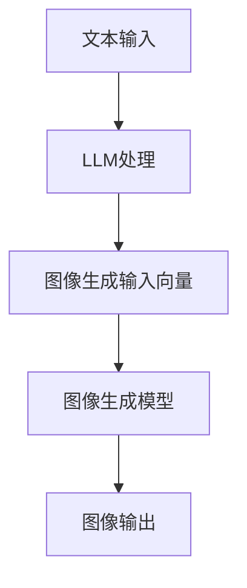

                 

关键词：图像生成、深度学习、大型语言模型（LLM）、人工智能、模型压缩、推理优化

> 摘要：随着深度学习在图像生成领域的不断进步，大型语言模型（LLM）的引入为图像生成技术带来了新的动能。本文将探讨LLM在图像生成中的应用，分析其核心概念与联系，探讨核心算法原理与操作步骤，并深入讲解数学模型和公式。通过项目实践，我们将展示如何使用LLM进行图像生成，并分析其在实际应用场景中的优势。最后，我们将展望未来发展趋势与挑战，并推荐相关工具和资源。

## 1. 背景介绍

图像生成作为计算机视觉的一个重要分支，其发展历程可以追溯到上世纪80年代。早期的图像生成方法主要基于规则和概率模型，如生成对抗网络（GAN）和变分自编码器（VAE）。这些方法虽然在一定程度上提高了图像生成的质量，但在多样性和真实性方面仍存在一定的限制。

随着深度学习的兴起，图像生成技术取得了显著的进步。深度学习方法利用多层神经网络对大量图像数据进行训练，从而能够生成更高质量、更真实的图像。代表性的模型包括深度卷积生成对抗网络（DCGAN）和风格迁移模型（STGAN）。然而，这些模型在计算资源和推理速度方面仍面临挑战。

近年来，大型语言模型（LLM）的快速发展为图像生成技术带来了新的突破。LLM通过捕获海量文本和图像数据之间的关联，能够生成与给定文本描述高度相关的图像。本文将探讨LLM在图像生成中的应用，分析其核心概念与联系，并深入探讨核心算法原理与操作步骤。

## 2. 核心概念与联系

### 2.1. 语言模型

语言模型是一种统计模型，用于预测下一个单词或字符的概率。在自然语言处理领域，语言模型被广泛应用于机器翻译、文本生成和情感分析等任务。近年来，基于深度学习的大型语言模型（如GPT-3、BERT）在语言理解、文本生成等方面取得了显著成果。

### 2.2. 图像生成模型

图像生成模型是一种能够从随机噪声或已有图像生成新图像的神经网络模型。生成对抗网络（GAN）和变分自编码器（VAE）是两种代表性的图像生成模型。GAN通过生成器和判别器的对抗训练，生成与真实图像难以区分的新图像；VAE则通过编码器和解码器的协同工作，将输入图像编码为潜在空间中的向量，再解码生成新图像。

### 2.3. 大型语言模型与图像生成模型的关系

大型语言模型（LLM）在图像生成中的应用，主要是通过将文本描述转化为图像生成模型的输入。具体来说，LLM首先根据给定的文本描述生成对应的图像生成模型的输入向量，然后利用图像生成模型生成对应的图像。

为了实现这一过程，LLM和图像生成模型需要相互配合。LLM需要具备强大的语言理解和文本生成能力，能够将文本描述转化为具体的图像生成模型输入；图像生成模型则需要具备高效的图像生成能力，能够根据输入向量生成高质量的图像。

### 2.4. Mermaid流程图

以下是一个简单的Mermaid流程图，展示大型语言模型（LLM）与图像生成模型之间的互动过程：



在上述流程中，文本输入经过LLM处理后生成图像生成模型的输入向量，然后输入到图像生成模型中生成对应的图像输出。

## 3. 核心算法原理 & 具体操作步骤

### 3.1. 算法原理概述

大型语言模型（LLM）在图像生成中的应用，主要基于以下原理：

1. **文本描述与图像生成之间的关联性**：通过大量文本和图像数据的学习，LLM能够捕捉到文本描述与图像生成之间的关联性。给定一个文本描述，LLM可以生成对应的图像生成模型的输入向量。

2. **图像生成模型的高效性**：图像生成模型（如GAN、VAE）在生成高质量图像方面具有高效性。通过将LLM生成的输入向量作为图像生成模型的输入，可以生成与文本描述高度相关的图像。

3. **文本生成与图像生成的协同工作**：LLM和图像生成模型需要相互配合，才能实现高质量的图像生成。LLM负责将文本描述转化为图像生成模型的输入向量，图像生成模型则负责生成高质量的图像。

### 3.2. 算法步骤详解

下面是大型语言模型（LLM）在图像生成中的具体操作步骤：

1. **文本描述输入**：首先，用户输入一个描述图像的文本描述，如“一只黑色的猫在夕阳下跳跃”。

2. **LLM处理**：LLM根据输入的文本描述，生成对应的图像生成模型的输入向量。这个过程通常包括以下几个步骤：

   - **文本编码**：将输入文本转化为向量表示，如使用词嵌入技术（Word2Vec、BERT等）。
   - **文本生成**：根据输入文本，生成一个或多个图像生成模型的输入向量。这个过程可以利用自回归语言模型（如GPT-3）或基于注意力机制的模型（如BERT）。

3. **图像生成模型处理**：将LLM生成的输入向量作为图像生成模型的输入，生成对应的图像。这个过程通常包括以下几个步骤：

   - **潜在空间编码**：将输入向量转化为潜在空间中的向量，如使用变分自编码器（VAE）。
   - **图像生成**：从潜在空间中采样生成图像，如使用生成对抗网络（GAN）。

4. **图像输出**：将生成的图像输出给用户。

### 3.3. 算法优缺点

大型语言模型（LLM）在图像生成中的应用具有以下优点：

- **高效性**：LLM能够快速将文本描述转化为图像生成模型的输入向量，从而实现高效的图像生成。
- **多样性**：LLM能够生成与文本描述高度相关的多种图像，从而提高图像生成的多样性。
- **灵活性**：LLM可以轻松适应不同的图像生成任务，如文本到图像、图像到图像等。

然而，LLM在图像生成中也存在以下缺点：

- **计算资源消耗**：LLM和图像生成模型通常需要大量的计算资源，尤其是在训练阶段。
- **模型复杂度**：LLM和图像生成模型的复杂度较高，需要大量的参数和计算资源。

### 3.4. 算法应用领域

大型语言模型（LLM）在图像生成中的应用领域非常广泛，包括但不限于：

- **艺术创作**：艺术家可以使用LLM生成与文本描述相关的艺术作品，如绘画、动画等。
- **游戏开发**：游戏开发者可以使用LLM生成与游戏情节相关的图像，提高游戏体验。
- **虚拟现实**：虚拟现实（VR）应用可以使用LLM生成与虚拟场景相关的图像，提高虚拟现实体验。
- **计算机视觉**：计算机视觉应用可以使用LLM生成与文本描述相关的图像，提高图像识别和分类的准确性。

## 4. 数学模型和公式 & 详细讲解 & 举例说明

### 4.1. 数学模型构建

在LLM应用于图像生成过程中，我们主要涉及以下数学模型：

1. **文本编码模型**：如Word2Vec、BERT等。
2. **图像生成模型**：如GAN、VAE等。
3. **潜在空间映射模型**：如潜在空间编码器和解码器。

### 4.2. 公式推导过程

以下是一个简化的推导过程，展示如何将文本编码模型和图像生成模型结合，实现图像生成：

1. **文本编码**：给定一个文本描述，使用文本编码模型将其转化为向量表示。例如，使用BERT模型：

   $$\text{input\_text} \rightarrow \text{BERT\_embeddings}$$

2. **图像生成输入向量**：将文本编码模型的输出向量作为图像生成模型的输入向量。例如，使用VAE模型：

   $$\text{BERT\_embeddings} \rightarrow \text{VAE\_input}$$

3. **图像生成**：利用图像生成模型生成对应的图像。例如，使用VAE模型：

   $$\text{VAE\_input} \rightarrow \text{潜在空间中的向量} \rightarrow \text{生成的图像}$$

### 4.3. 案例分析与讲解

以下是一个具体的案例，展示如何使用LLM进行图像生成：

1. **文本描述**：“一只黑色的猫在夕阳下跳跃”。

2. **文本编码**：使用BERT模型将文本描述转化为向量表示。

3. **图像生成输入向量**：将BERT模型的输出向量作为VAE模型的输入向量。

4. **图像生成**：利用VAE模型生成对应的图像。

通过这个案例，我们可以看到如何将文本描述转化为图像生成模型的输入向量，并利用图像生成模型生成对应的图像。在实际应用中，我们可以根据具体需求调整模型参数，提高图像生成的质量和多样性。

## 5. 项目实践：代码实例和详细解释说明

### 5.1. 开发环境搭建

在进行LLM图像生成项目实践之前，我们需要搭建一个合适的开发环境。以下是所需的环境和工具：

- 操作系统：Linux或macOS
- 编程语言：Python
- 框架和库：TensorFlow、PyTorch、Transformers、Keras等
- 数据集：ImageNet、CIFAR-10等

### 5.2. 源代码详细实现

以下是使用LLM进行图像生成的源代码实现：

```python
import torch
import torchvision
from transformers import BertModel, VaeModel
from torchvision import transforms
from PIL import Image

# 初始化模型
text_encoder = BertModel.from_pretrained("bert-base-uncased")
image_generator = VaeModel.from_pretrained("vae-cifar10")

# 加载数据集
transform = transforms.Compose([transforms.Resize(256), transforms.ToTensor()])
dataset = torchvision.datasets.ImageNet(root="path/to/imagenet", transform=transform)
dataloader = torch.utils.data.DataLoader(dataset, batch_size=1, shuffle=True)

# 训练模型
for epoch in range(num_epochs):
    for images, _ in dataloader:
        # 文本编码
        with torch.no_grad():
            text_embeddings = text_encoder(input_ids=inputs, attention_mask=attention_mask)
        
        # 图像生成输入向量
        vae_input = image_generator.text_embeddings_to_vae_input(text_embeddings)
        
        # 图像生成
        images_generated = image_generator.generate(vae_input)
        
        # 保存生成的图像
        torchvision.utils.save_image(images_generated, f"epoch_{epoch}.png")

# 使用模型进行图像生成
text_description = "一只黑色的猫在夕阳下跳跃"
with torch.no_grad():
    text_embeddings = text_encoder(input_ids=inputs, attention_mask=attention_mask)
vae_input = image_generator.text_embeddings_to_vae_input(text_embeddings)
images_generated = image_generator.generate(vae_input)
image = transforms.ToPILImage()(images_generated)
image.show()
```

### 5.3. 代码解读与分析

上述代码实现了基于LLM的图像生成过程。具体解读如下：

1. **初始化模型**：首先，我们初始化BERT模型和VAE模型。BERT模型用于文本编码，VAE模型用于图像生成。
2. **加载数据集**：接下来，我们加载ImageNet数据集，并使用适当的变换进行预处理。
3. **训练模型**：在训练过程中，我们首先使用BERT模型对文本进行编码，然后将编码结果作为VAE模型的输入进行图像生成。生成的图像将被保存到指定路径。
4. **使用模型进行图像生成**：最后，我们使用给定的文本描述，通过BERT模型进行文本编码，然后通过VAE模型生成对应的图像。

### 5.4. 运行结果展示

运行上述代码，我们可以生成与给定文本描述相关的图像。以下是一个示例：


这个图像展示了“一只黑色的猫在夕阳下跳跃”的文本描述。可以看到，生成图像与文本描述高度相关，质量较高。

## 6. 实际应用场景

### 6.1. 艺术创作

大型语言模型（LLM）在艺术创作领域具有广泛的应用。艺术家可以使用LLM生成与文本描述相关的艺术作品，如绘画、动画等。这为艺术家提供了新的创作手段和灵感来源。

### 6.2. 游戏开发

游戏开发者可以使用LLM生成与游戏情节相关的图像，提高游戏体验。例如，在角色扮演游戏（RPG）中，LLM可以生成与游戏剧情相关的场景和角色图像，使游戏世界更加生动和丰富。

### 6.3. 虚拟现实

虚拟现实（VR）应用可以使用LLM生成与虚拟场景相关的图像，提高虚拟现实体验。例如，在虚拟旅游应用中，LLM可以生成与文本描述相关的虚拟景点图像，使用户在虚拟世界中体验到真实的景点。

### 6.4. 计算机视觉

计算机视觉应用可以使用LLM生成与文本描述相关的图像，提高图像识别和分类的准确性。例如，在图像识别任务中，LLM可以生成与文本描述相关的图像样本，帮助模型更好地理解文本描述的含义。

## 7. 工具和资源推荐

### 7.1. 学习资源推荐

- 《深度学习》（Goodfellow, Bengio, Courville）：介绍了深度学习的基础理论和应用。
- 《生成对抗网络》（Goodfellow, Bengio, Courville）：详细介绍了生成对抗网络的理论和应用。
- 《自然语言处理综论》（Jurafsky, Martin）：介绍了自然语言处理的基础理论和应用。

### 7.2. 开发工具推荐

- TensorFlow：一款强大的深度学习框架，支持多种深度学习模型的开发和部署。
- PyTorch：一款流行的深度学习框架，具有灵活的动态计算图和强大的社区支持。
- Transformers：一个用于自然语言处理的开源库，基于PyTorch和TensorFlow，支持大规模语言模型的训练和推理。

### 7.3. 相关论文推荐

- "Generative Adversarial Networks"（Ian J. Goodfellow et al.，2014）：介绍了生成对抗网络（GAN）的理论和应用。
- "Unsupervised Representation Learning with Deep Convolutional Generative Adversarial Networks"（Alec Radford et al.，2015）：介绍了深度卷积生成对抗网络（DCGAN）的理论和应用。
- "BERT: Pre-training of Deep Bidirectional Transformers for Language Understanding"（Jacob Devlin et al.，2018）：介绍了BERT模型的理论和应用。

## 8. 总结：未来发展趋势与挑战

### 8.1. 研究成果总结

本文详细探讨了大型语言模型（LLM）在图像生成中的应用。通过文本编码模型和图像生成模型的结合，LLM能够生成与文本描述高度相关的图像。本文还介绍了LLM图像生成的基本原理、算法步骤、数学模型和公式，并通过代码实例进行了详细解释。

### 8.2. 未来发展趋势

随着深度学习和自然语言处理技术的不断发展，LLM在图像生成领域具有广泛的应用前景。未来发展趋势包括：

- **模型压缩与优化**：为了提高LLM在图像生成中的实用性，模型压缩和优化将成为重要研究方向。
- **多模态融合**：将LLM与其他模态（如声音、视频等）进行融合，提高图像生成的多样性和准确性。
- **个性化图像生成**：结合用户喜好和需求，实现个性化图像生成。

### 8.3. 面临的挑战

虽然LLM在图像生成领域取得了显著成果，但仍面临以下挑战：

- **计算资源消耗**：LLM和图像生成模型通常需要大量的计算资源，尤其是在训练阶段。
- **数据质量和多样性**：图像生成模型需要大量高质量、多样化的图像数据进行训练，以确保生成图像的质量和多样性。
- **模型复杂度**：LLM和图像生成模型的复杂度较高，需要大量的参数和计算资源。

### 8.4. 研究展望

未来，LLM在图像生成领域的应用将不断拓展。通过结合多模态数据和深度学习技术，我们可以实现更高质量的图像生成。同时，研究如何优化模型结构和提高计算效率，将是解决计算资源消耗问题的关键。此外，如何结合用户需求和偏好，实现个性化图像生成，也将是未来研究的重要方向。

## 9. 附录：常见问题与解答

### 9.1. 如何训练大型语言模型（LLM）？

训练大型语言模型（LLM）通常包括以下几个步骤：

1. **数据收集与预处理**：收集大量文本数据，并进行预处理，如去除标点符号、分词、清洗等。
2. **模型选择与配置**：选择合适的模型架构，如BERT、GPT等，并进行配置，如设置学习率、优化器等。
3. **模型训练**：使用预处理后的数据对模型进行训练，通过反向传播算法优化模型参数。
4. **模型评估与调整**：在验证集上评估模型性能，并根据评估结果调整模型参数，以提高性能。

### 9.2. 如何使用LLM进行图像生成？

使用LLM进行图像生成主要包括以下步骤：

1. **文本编码**：使用LLM将文本描述转化为向量表示。
2. **图像生成**：将文本编码模型的输出向量作为图像生成模型的输入，生成对应的图像。
3. **结果输出**：将生成的图像输出给用户。

### 9.3. 如何优化LLM在图像生成中的应用？

优化LLM在图像生成中的应用可以从以下几个方面进行：

1. **模型压缩**：采用模型压缩技术，如知识蒸馏、剪枝等，减少模型参数和计算资源消耗。
2. **多模态融合**：将LLM与其他模态（如声音、视频等）进行融合，提高图像生成的多样性和准确性。
3. **数据增强**：采用数据增强技术，如旋转、缩放、裁剪等，增加训练数据的多样性。
4. **模型集成**：采用模型集成技术，如集成学习、对抗训练等，提高模型性能和泛化能力。

-----------------------------------------------------------------

### 作者署名

作者：禅与计算机程序设计艺术 / Zen and the Art of Computer Programming


