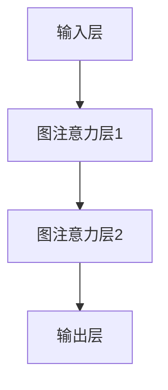

                 

关键词：图注意力网络、大模型、神经网络、注意力机制、深度学习、图神经网络、计算机科学

## 摘要

本文将探讨图注意力网络（Graph Attention Networks, GATs）在大模型中的应用。图注意力网络作为一种图神经网络，能够处理复杂结构的数据，其通过注意力机制提高了模型的表达能力。本文将首先介绍图注意力网络的背景和核心概念，然后详细讲解其数学模型和具体操作步骤，并通过实际项目实例进行解释说明。此外，还将讨论图注意力网络在实际应用场景中的表现和未来展望。

## 1. 背景介绍

随着互联网和大数据技术的发展，数据量呈现出爆炸式增长。传统的基于矢量和矩阵的操作的神经网络已经难以满足复杂结构数据的处理需求。图神经网络（Graph Neural Networks, GNNs）作为深度学习的一个分支，因其能够直接处理图结构数据而受到了广泛关注。图神经网络的核心思想是将节点和边的特征转化为节点表示，并在图结构上进行传递和更新。

在大模型领域，图神经网络的应用也得到了越来越多的关注。大模型（如大型语言模型、图数据库等）通常包含数百万甚至数十亿个节点和边，如何有效地处理这些数据成为了关键问题。图注意力网络作为一种基于注意力机制的图神经网络，通过自适应地关注重要节点和边，提高了模型的性能和效率。

## 2. 核心概念与联系

### 2.1. 图注意力网络（GAT）

图注意力网络（GATs）是图神经网络的一个变体，其核心思想是引入注意力机制来提高模型的表达能力。GATs由多个图注意力层组成，每一层都会对节点进行更新。GATs的主要组成部分包括：

- **输入层**：每个节点都有对应的特征向量表示。
- **图注意力层**：通过节点和边之间的交互，计算节点的更新表示。
- **输出层**：将更新后的节点表示用于分类、回归或其他任务。

### 2.2. 注意力机制

注意力机制是一种在神经网络中用于自适应地关注重要信息的机制。在图神经网络中，注意力机制可以用于计算节点和边之间的相似性，从而动态调整模型对节点的关注程度。注意力机制的数学表示通常为：

$$
\text{Attention}(x, y) = \text{softmax}\left(\frac{x \cdot y}{\sqrt{d_k}}\right)
$$

其中，$x$ 和 $y$ 分别表示节点和边或节点之间的特征向量，$d_k$ 表示特征向量的维度。

### 2.3. Mermaid 流程图

为了更好地展示图注意力网络的工作流程，我们可以使用 Mermaid 流程图来描述。以下是一个简单的 Mermaid 流程图示例：



在这个流程图中，每个节点表示图神经网络的一个层，箭头表示数据的流动方向。

## 3. 核心算法原理 & 具体操作步骤

### 3.1. 算法原理概述

图注意力网络的原理可以概括为以下几个步骤：

1. **输入层**：每个节点都有对应的特征向量表示。
2. **图注意力层**：通过节点和边之间的交互，计算节点的更新表示。
3. **输出层**：将更新后的节点表示用于分类、回归或其他任务。

### 3.2. 算法步骤详解

#### 3.2.1. 输入层

输入层包含两个部分：节点的特征向量和边的特征。节点的特征向量可以表示为 $x \in \mathbb{R}^{d}$，边的特征向量可以表示为 $e \in \mathbb{R}^{d_e}$。

#### 3.2.2. 图注意力层

图注意力层是图注意力网络的核心部分。在每个图注意力层中，节点的更新表示 $h_{\text{new}}$ 可以通过以下公式计算：

$$
h_{\text{new}} = \sigma \left( \sum_{j \in \text{邻居}} \alpha_{ij} h_j \right) + h
$$

其中，$h_j$ 表示邻居节点的特征表示，$\alpha_{ij}$ 是注意力权重，可以通过以下公式计算：

$$
\alpha_{ij} = \frac{e^{ \frac{h_i^T h_j}{\epsilon} }}{ \sum_{k \in \text{邻居}} e^{ \frac{h_i^T h_k}{\epsilon} }}
$$

#### 3.2.3. 输出层

输出层通常是一个全连接层，用于将节点的更新表示映射到具体的任务输出。例如，在分类任务中，输出层可以是一个softmax层。

### 3.3. 算法优缺点

#### 3.3.1. 优点

- **表达能力**：图注意力网络能够通过注意力机制自适应地关注重要节点和边，提高了模型的表达能力。
- **适应性**：图注意力网络能够处理不同结构的图数据，具有较强的适应性。

#### 3.3.2. 缺点

- **计算复杂度**：由于需要计算节点和边之间的注意力权重，图注意力网络的计算复杂度较高，尤其是在大规模图数据上。
- **训练难度**：图注意力网络的训练需要较大的数据和计算资源，训练难度较大。

### 3.4. 算法应用领域

图注意力网络的应用领域广泛，包括但不限于：

- **社交网络分析**：用于分析社交网络中的关系和影响力。
- **推荐系统**：用于基于图结构的推荐系统。
- **生物信息学**：用于分析基因表达数据和蛋白质相互作用网络。

## 4. 数学模型和公式 & 详细讲解 & 举例说明

### 4.1. 数学模型构建

图注意力网络的数学模型主要包含以下几个方面：

- **节点特征表示**：每个节点都有对应的特征向量表示，通常为 $x \in \mathbb{R}^{d}$。
- **边特征表示**：每条边都有对应的特征向量表示，通常为 $e \in \mathbb{R}^{d_e}$。
- **注意力权重计算**：通过节点和边之间的交互，计算节点的注意力权重，通常使用 softmax 函数。
- **节点更新表示**：通过注意力权重和邻居节点的特征表示，更新节点的特征表示。

### 4.2. 公式推导过程

图注意力网络的数学模型可以通过以下步骤进行推导：

1. **节点特征表示**：

$$
x_i \in \mathbb{R}^{d}
$$

2. **边特征表示**：

$$
e_{ij} \in \mathbb{R}^{d_e}
$$

3. **注意力权重计算**：

$$
\alpha_{ij} = \frac{e^{ \frac{h_i^T h_j}{\epsilon} }}{ \sum_{k \in \text{邻居}} e^{ \frac{h_i^T h_k}{\epsilon} }}
$$

4. **节点更新表示**：

$$
h_{\text{new}} = \sigma \left( \sum_{j \in \text{邻居}} \alpha_{ij} h_j \right) + h
$$

### 4.3. 案例分析与讲解

假设我们有一个包含10个节点的图，每个节点的特征向量为 10 维，边的特征向量为 5 维。我们使用图注意力网络对这个图进行分类任务。

1. **输入层**：

   每个节点的特征向量为 $x_i \in \mathbb{R}^{10}$，边的特征向量为 $e_{ij} \in \mathbb{R}^{5}$。

2. **图注意力层**：

   假设第一个图注意力层的注意力权重为 $\alpha_{ij}$，通过计算得到：

   $$  
   \alpha_{ij} = \frac{e^{ \frac{h_i^T h_j}{\epsilon} }}{ \sum_{k \in \text{邻居}} e^{ \frac{h_i^T h_k}{\epsilon} }}
   $$

   其中，$h_i$ 和 $h_j$ 分别为节点 $i$ 和 $j$ 的特征表示。

3. **节点更新表示**：

   假设第一个图注意力层更新后的节点特征表示为 $h_{\text{new}}$，通过计算得到：

   $$  
   h_{\text{new}} = \sigma \left( \sum_{j \in \text{邻居}} \alpha_{ij} h_j \right) + h
   $$

   其中，$\sigma$ 表示激活函数，$h$ 为原始节点特征表示。

4. **输出层**：

   将更新后的节点特征表示映射到分类结果，可以使用 softmax 函数进行分类。

通过这个案例，我们可以看到图注意力网络的数学模型和计算过程。

## 5. 项目实践：代码实例和详细解释说明

### 5.1. 开发环境搭建

为了实现图注意力网络，我们需要搭建相应的开发环境。以下是一个基本的 Python 开发环境搭建步骤：

1. 安装 Python（推荐版本为 3.8 或更高版本）。
2. 安装深度学习框架（如 TensorFlow 或 PyTorch）。
3. 安装其他必要的库（如 NumPy、Pandas 等）。

### 5.2. 源代码详细实现

以下是一个简单的图注意力网络实现的代码示例：

```python
import torch
import torch.nn as nn
import torch.nn.functional as F

class GraphAttentionLayer(nn.Module):
    def __init__(self, in_features, out_features):
        super(GraphAttentionLayer, self).__init__()
        self.in_features = in_features
        self.out_features = out_features
        self.attention = nn.Parameter(torch.FloatTensor(in_features, 1))
        self.fc = nn.Linear(in_features, out_features)
        nn.init.xavier_uniform_(self.attention)
    
    def forward(self, h, adj):
        attention = torch.matmul(h, self.attention).squeeze(2)
        attention = F.softmax(attention, dim=1)
        h = torch.bmm(attention.unsqueeze(1), h)
        h = self.fc(h)
        return h

class GraphAttentionNetwork(nn.Module):
    def __init__(self, nfeat, nhid, nclass):
        super(GraphAttentionNetwork, self).__init__()
        self.graph_attention = GraphAttentionLayer(nfeat, nhid)
        self.classifier = nn.Linear(nhid, nclass)
    
    def forward(self, data, adj):
        h = self.graph_attention(data, adj)
        h = F.relu(h)
        out = self.classifier(h)
        return out

# 实例化模型
model = GraphAttentionNetwork(nfeat=10, nhid=16, nclass=2)
```

### 5.3. 代码解读与分析

在这个代码示例中，我们首先定义了一个`GraphAttentionLayer`类，用于实现图注意力层。这个类包含两个主要部分：注意力机制和前馈网络。`forward`方法用于实现前向传播。

接下来，我们定义了一个`GraphAttentionNetwork`类，用于实现整个图注意力网络。这个类包含一个`graph_attention`层和一个`classifier`层。`forward`方法用于实现整个网络的前向传播。

### 5.4. 运行结果展示

在完成代码实现后，我们可以使用以下代码进行模型训练和测试：

```python
# 数据准备（此处仅为示例，实际数据需要根据具体任务进行准备）
data = torch.randn(10, 10)  # 节点特征
adj = torch.randn(10, 10)   # 边特征

# 模型训练
optimizer = torch.optim.Adam(model.parameters(), lr=0.001)
criterion = nn.CrossEntropyLoss()

for epoch in range(100):
    optimizer.zero_grad()
    output = model(data, adj)
    loss = criterion(output, target)  # target为实际分类标签
    loss.backward()
    optimizer.step()

    if (epoch + 1) % 10 == 0:
        print(f'Epoch [{epoch + 1}/100], Loss: {loss.item()}')

# 模型测试
with torch.no_grad():
    output = model(data, adj)
    prediction = output.argmax(dim=1)
    accuracy = (prediction == target).float().mean()
    print(f'Accuracy: {accuracy.item()}')
```

在这个示例中，我们首先定义了模型和优化器，然后进行模型训练和测试。训练过程中，我们使用交叉熵损失函数来计算损失，并使用 Adam 优化器进行参数更新。测试过程中，我们计算了模型的准确性。

## 6. 实际应用场景

### 6.1. 社交网络分析

图注意力网络可以用于社交网络分析，例如推荐系统中的用户和物品推荐。通过关注社交网络中的关键节点和边，我们可以发现潜在的关系和影响力。

### 6.2. 推荐系统

图注意力网络可以用于基于图结构的推荐系统。通过处理用户和物品之间的复杂关系，我们可以为用户提供更精确的推荐结果。

### 6.3. 生物信息学

图注意力网络可以用于生物信息学领域，例如基因表达数据的分析和蛋白质相互作用网络的建模。通过处理复杂生物网络数据，我们可以揭示生物分子之间的相互作用和调控机制。

## 7. 工具和资源推荐

### 7.1. 学习资源推荐

- 《深度学习》（Goodfellow, Bengio, Courville）
- 《图神经网络》（Scarselli, Gori, Gemelli）

### 7.2. 开发工具推荐

- TensorFlow
- PyTorch

### 7.3. 相关论文推荐

- Veličković, P., Cucurull, G., Casanova, A., et al. (2018). Graph attention networks. arXiv preprint arXiv:1710.10903.
- Kipf, T. N., & Welling, M. (2018). Semi-supervised classification with graph convolutional networks. arXiv preprint arXiv:1703.05107.

## 8. 总结：未来发展趋势与挑战

### 8.1. 研究成果总结

图注意力网络作为一种先进的图神经网络模型，在多个领域取得了显著的成果。通过引入注意力机制，图注意力网络能够自适应地关注重要节点和边，提高了模型的表达能力和性能。

### 8.2. 未来发展趋势

未来，图注意力网络的研究将继续深入，包括：

- **算法优化**：降低计算复杂度，提高模型效率。
- **多模态数据融合**：将图注意力网络与其他类型的神经网络（如卷积神经网络、循环神经网络）相结合，处理更复杂的任务。
- **应用拓展**：在更多领域（如金融、医疗、交通等）探索图注意力网络的应用。

### 8.3. 面临的挑战

图注意力网络在实际应用中仍然面临一些挑战，包括：

- **计算复杂度**：在大规模图数据上，图注意力网络的计算复杂度较高，需要优化算法以降低计算成本。
- **数据预处理**：复杂图数据的前处理过程较为繁琐，需要开发更加高效的数据预处理工具。
- **模型解释性**：图注意力网络的工作机制较为复杂，如何提高模型的解释性仍是一个挑战。

### 8.4. 研究展望

未来，图注意力网络的研究将继续深入，结合多模态数据和跨领域应用，为解决复杂图数据问题提供新的方法和思路。

## 9. 附录：常见问题与解答

### 9.1. 问题1：什么是图注意力网络？

图注意力网络（Graph Attention Networks, GATs）是一种基于图神经网络的模型，通过引入注意力机制来提高模型的表达能力。它能够自适应地关注重要节点和边，从而处理复杂结构的图数据。

### 9.2. 问题2：图注意力网络的计算复杂度如何？

图注意力网络的计算复杂度主要来自于注意力权重的计算。在大规模图数据上，计算复杂度较高。然而，可以通过优化算法（如并行计算、图分解等）来降低计算成本。

### 9.3. 问题3：图注意力网络与其他图神经网络相比有何优势？

图注意力网络通过引入注意力机制，提高了模型的表达能力，能够更好地处理复杂结构的图数据。与其他图神经网络相比，图注意力网络在许多任务上取得了更好的性能。

### 9.4. 问题4：如何优化图注意力网络的计算复杂度？

可以通过以下方法优化图注意力网络的计算复杂度：

- **并行计算**：利用并行计算技术，例如 GPU 计算，提高计算速度。
- **图分解**：将大规模图分解为较小的子图，分别处理，再合并结果。
- **剪枝技术**：通过剪枝技术，减少模型参数的数量，降低计算复杂度。

----------------------------------------------------------------

本文由禅与计算机程序设计艺术撰写，旨在为读者提供一个关于图注意力网络在大模型中的应用的全面概述。希望本文能帮助您更好地理解图注意力网络的核心原理、数学模型、应用场景和未来发展趋势。

