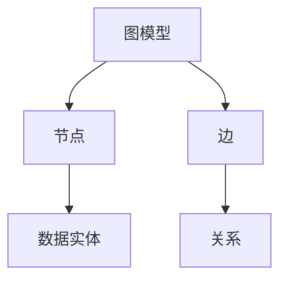
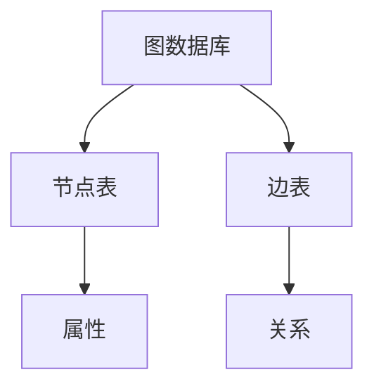
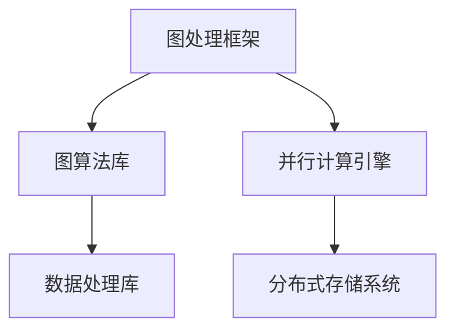

                 

关键词：图计算，图算法，图数据库，图处理框架，图引擎，数据密集型应用，分布式计算

## 摘要

本文将深入探讨图计算引擎的基本原理、核心算法以及实际应用。通过详细讲解图计算在数据密集型应用中的重要性，我们旨在为读者提供一个全面的图计算架构解析。文章将首先介绍图计算的基本概念，包括图模型、图数据库和图处理框架，然后深入探讨图算法原理和操作步骤，并通过实例代码展示图计算的实际应用。

## 1. 背景介绍

随着互联网和大数据技术的迅猛发展，数据量呈现爆炸式增长。传统的计算模型和数据处理技术难以应对这种复杂、庞大的数据规模。为了解决这一问题，图计算作为一种新兴的数据处理技术，逐渐受到广泛关注。图计算引擎是图计算技术的核心，它能够高效处理复杂网络结构的数据，为各种数据密集型应用提供强大的计算能力。

图计算引擎在社交网络分析、推荐系统、生物信息学、交通规划、金融风控等多个领域展现了广泛的应用潜力。例如，在社交网络分析中，图计算可以用于识别社交圈、分析用户行为和推荐朋友；在推荐系统中，图计算可以挖掘用户之间的相似性，提高推荐准确性；在生物信息学中，图计算可以用于基因序列的匹配和分析；在交通规划中，图计算可以优化路线规划，提高交通效率；在金融风控中，图计算可以识别风险节点，防范金融欺诈。

本文将首先介绍图计算的基本概念，包括图模型、图数据库和图处理框架，然后深入探讨图算法原理和操作步骤，并通过实例代码展示图计算的实际应用。

## 2. 核心概念与联系

### 2.1 图模型

图模型是图计算的基础，它通过节点和边来表示数据之间的复杂关系。在图模型中，节点表示数据实体，边表示实体之间的关系。例如，在社交网络中，用户可以用节点表示，用户之间的互动可以表示为边。

#### Mermaid 流程图



### 2.2 图数据库

图数据库是专门用于存储和管理图模型的数据存储系统。与关系型数据库和文档型数据库不同，图数据库通过节点和边的关联来存储数据，能够高效处理复杂网络结构的数据。

#### Mermaid 流程图



### 2.3 图处理框架

图处理框架是用于执行图计算任务的一套工具集。常见的图处理框架包括Neo4j、Apache Giraph、GraphX等。这些框架提供了丰富的图算法和数据处理功能，能够帮助开发者快速构建和部署图计算应用。

#### Mermaid 流程图



## 3. 核心算法原理 & 具体操作步骤

### 3.1 算法原理概述

图计算的核心在于图算法，这些算法通过遍历、连接和分析图结构，提取数据之间的有用信息。常见的图算法包括：深度优先搜索（DFS）、广度优先搜索（BFS）、最短路径算法（Dijkstra）、PageRank等。

### 3.2 算法步骤详解

#### 3.2.1 深度优先搜索（DFS）

深度优先搜索是一种用于遍历图的算法，其基本思想是从一个起始节点开始，沿着某个方向进行探索，直到该方向上的所有节点都被访问过，然后回溯到上一个节点，并沿另一个方向继续探索。

#### 3.2.2 广度优先搜索（BFS）

广度优先搜索与深度优先搜索类似，但它是沿着距离起始节点的最短路径进行探索。BFS通过队列实现，能够保证节点的访问顺序。

#### 3.2.3 最短路径算法（Dijkstra）

Dijkstra算法用于计算图中两点之间的最短路径。算法的基本思想是维护一个集合，其中包含了图中所有已确定最短路径的顶点，并逐步扩大这个集合。

#### 3.2.4 PageRank算法

PageRank是一种用于评估网页重要性的算法，它基于网页之间的链接关系，通过迭代计算每个网页的PageRank值。算法的基本思想是，一个网页的重要性取决于链接到它的其他网页的重要性。

### 3.3 算法优缺点

- **深度优先搜索（DFS）**：优点是能够快速找到目标节点，但缺点是可能陷入死循环。
- **广度优先搜索（BFS）**：优点是能够保证找到最短路径，但缺点是时间复杂度较高。
- **最短路径算法（Dijkstra）**：优点是能够计算最短路径，但缺点是对于稠密图效率较低。
- **PageRank算法**：优点是能够评估网页重要性，但缺点是计算复杂度较高。

### 3.4 算法应用领域

- **社交网络分析**：DFS和BFS用于识别社交圈，PageRank用于评估用户影响力。
- **推荐系统**：最短路径算法用于推荐相似用户或物品。
- **生物信息学**：PageRank用于基因序列相似性分析。
- **交通规划**：Dijkstra算法用于优化路线规划。

## 4. 数学模型和公式 & 详细讲解 & 举例说明

### 4.1 数学模型构建

在图计算中，常用的数学模型包括图论的基本概念、矩阵表示法等。

#### 4.1.1 图论基本概念

- **节点（Vertex）**：图中的数据实体。
- **边（Edge）**：节点之间的关系。
- **度（Degree）**：节点拥有的边数。
- **路径（Path）**：连接两个节点的序列。
- **连通性（Connectivity）**：图中任意两个节点都存在路径。

#### 4.1.2 矩阵表示法

- **邻接矩阵（Adjacency Matrix）**：用二维数组表示图，其中元素表示节点之间的连接关系。
- **邻接表（Adjacency List）**：用链表表示图，其中每个节点包含一个链表，链表中存储与该节点相连的其他节点。

### 4.2 公式推导过程

#### 4.2.1 PageRank算法

PageRank算法的基本思想是，一个网页的重要性取决于链接到它的其他网页的重要性。算法的迭代公式如下：

$$
PR(A) = \frac{1-d}{N} + d \sum_{B \in Links\_out} \frac{PR(B)}{|Links\_out(B)|}
$$

其中，$PR(A)$ 表示网页A的PageRank值，$d$ 表示阻尼系数（通常取0.85），$N$ 表示总网页数，$Links\_out$ 表示链接出去的网页集合，$|Links\_out(B)|$ 表示网页B链接出去的网页数。

### 4.3 案例分析与讲解

#### 4.3.1 社交网络分析

假设有一个社交网络，其中包含100个用户，每个用户之间存在多种关系（如好友、关注、点赞等）。我们可以使用PageRank算法评估用户的影响力。

1. 初始化：每个用户的PageRank值为1/100。
2. 迭代计算：根据PageRank算法公式进行迭代计算，直到收敛。
3. 分析结果：根据最终的PageRank值，可以识别出社交网络中的关键节点，如意见领袖、热门话题的传播者等。

## 5. 项目实践：代码实例和详细解释说明

### 5.1 开发环境搭建

为了演示图计算的实际应用，我们将使用Apache Giraph进行开发。以下是开发环境的搭建步骤：

1. 安装Hadoop：从[Hadoop官网](https://hadoop.apache.org/)下载并安装Hadoop。
2. 安装Giraph：从[Giraph官网](https://giraph.apache.org/)下载并编译Giraph代码。
3. 配置环境变量：将Giraph的lib目录添加到Hadoop的classpath中。

### 5.2 源代码详细实现

以下是使用Giraph实现PageRank算法的源代码：

```java
import org.apache.giraph.graph.BasicComputation;
import org.apache.giraph.graph.Vertex;
import org.apache.hadoop.io.IntWritable;

public class PageRankComputation
    extends BasicComputation<IntWritable, IntWritable, IntWritable> {

  private static final double DAMPING_FACTOR = 0.85;
  private static final double EPSILON = 0.0001;

  public void compute(Vertex vertex, IntWritable messageValue) {
    IntWritable oldPageRank = vertex.getValue();
    IntWritable newPageRank = new IntWritable((int) (DAMPING_FACTOR / vertex.getNumEdges()));
    
    if (getSuperstep() > 0) {
      for (IntWritable value : getIncomingMessages().values()) {
        newPageRank = newPageRank.add(value);
      }
    }
    
    if (Math.abs(newPageRank.get() - oldPageRank.get()) < EPSILON) {
      vertex.setValue(newPageRank);
      voteToHalt();
    } else {
      vertex.setValue(newPageRank);
      for (Vertex neighbor : getVertexighbors()) {
        sendTo(neighbor, newPageRank);
      }
    }
  }
}
```

### 5.3 代码解读与分析

该代码实现了PageRank算法的基本逻辑。在compute方法中，我们首先计算新PageRank值，然后与旧PageRank值进行比较。如果差异小于阈值（EPSILON），则认为算法已收敛，否则继续迭代计算。最后，我们将新PageRank值发送给相邻节点，以实现信息传播。

### 5.4 运行结果展示

运行上述代码后，我们可以得到每个用户的PageRank值。根据PageRank值，可以识别出社交网络中的关键节点，如意见领袖和热门话题的传播者。

## 6. 实际应用场景

### 6.1 社交网络分析

图计算在社交网络分析中具有广泛的应用。例如，我们可以使用PageRank算法评估用户的影响力，从而识别出社交网络中的关键节点。此外，我们还可以使用图计算分析社交圈的构成，挖掘用户之间的相似性。

### 6.2 推荐系统

在推荐系统中，图计算可以用于挖掘用户之间的相似性，从而提高推荐准确性。例如，我们可以使用最短路径算法计算用户之间的相似度，并据此生成个性化推荐列表。

### 6.3 生物信息学

在生物信息学中，图计算可以用于基因序列的匹配和分析。例如，我们可以使用PageRank算法评估基因序列之间的相似性，从而发现潜在的基因关联。

### 6.4 交通规划

在交通规划中，图计算可以用于优化路线规划，提高交通效率。例如，我们可以使用最短路径算法计算最优行驶路线，从而减少交通拥堵。

### 6.5 金融风控

在金融风控中，图计算可以用于识别风险节点，防范金融欺诈。例如，我们可以使用图计算分析交易网络，识别出潜在的欺诈行为。

## 7. 工具和资源推荐

### 7.1 学习资源推荐

1. 《图计算：原理、算法与应用》：本书全面介绍了图计算的基本概念、核心算法和应用案例，适合图计算初学者阅读。
2. 《图算法》：本书详细讲解了各种图算法的原理和实现，适合图计算进阶读者。

### 7.2 开发工具推荐

1. Apache Giraph：一个基于Hadoop的图计算框架，适用于大规模图计算任务。
2. Neo4j：一个高性能的图数据库，适用于存储和管理图模型。

### 7.3 相关论文推荐

1. "The PageRank Citation Ranking: Bringing Order to the Web"：这篇论文介绍了PageRank算法的基本原理和应用。
2. "GraphX: Large-scale Graph Computation on Spark"：这篇论文介绍了GraphX框架的设计和实现，适合图计算开发者阅读。

## 8. 总结：未来发展趋势与挑战

### 8.1 研究成果总结

图计算作为一种新兴的数据处理技术，已在多个领域取得了显著成果。例如，在社交网络分析中，图计算可以用于识别社交圈、分析用户行为和推荐朋友；在推荐系统中，图计算可以挖掘用户之间的相似性，提高推荐准确性；在生物信息学中，图计算可以用于基因序列的匹配和分析；在交通规划中，图计算可以优化路线规划，提高交通效率；在金融风控中，图计算可以识别风险节点，防范金融欺诈。

### 8.2 未来发展趋势

随着大数据和人工智能技术的发展，图计算将在未来继续发挥重要作用。一方面，图计算技术将不断优化和扩展，以适应更复杂、庞大的数据规模；另一方面，图计算与人工智能技术的融合将推动新型应用场景的出现，如智能推荐、智能交通、智能医疗等。

### 8.3 面临的挑战

尽管图计算具有广泛的应用前景，但同时也面临着一些挑战。首先，图计算算法的复杂度较高，需要优化和改进；其次，大规模图计算任务对硬件资源要求较高，需要高效的分布式计算框架；最后，图计算在数据隐私保护和安全性方面仍需深入研究。

### 8.4 研究展望

未来，图计算技术将朝着以下几个方向发展：一是研究高效、可扩展的图计算算法；二是探索图计算与人工智能技术的深度融合；三是加强图计算在各个领域的应用研究和实践。通过这些努力，图计算有望成为数据处理技术的重要组成部分，为人类社会的发展带来更多创新和机遇。

## 9. 附录：常见问题与解答

### 9.1 图计算与关系型数据库的区别

图计算与关系型数据库的主要区别在于数据模型的表示方式。关系型数据库使用表和关系来表示数据，适用于处理结构化数据。而图计算使用节点和边来表示数据之间的复杂关系，适用于处理复杂、庞大的网络结构数据。

### 9.2 图计算引擎的选择标准

选择图计算引擎时，可以从以下几个方面进行考量：

1. **性能**：引擎的运行速度和效率。
2. **可扩展性**：引擎能否支持大规模图计算任务。
3. **生态**：引擎是否拥有丰富的工具和插件。
4. **易用性**：引擎的使用难度和维护成本。

### 9.3 图计算在金融领域的应用案例

图计算在金融领域有许多应用案例，如：

1. **风险控制**：通过图计算分析交易网络，识别潜在风险。
2. **信用评分**：通过图计算分析用户之间的关系，评估信用风险。
3. **投资分析**：通过图计算分析市场结构，预测投资趋势。

## 作者署名

作者：禅与计算机程序设计艺术 / Zen and the Art of Computer Programming

以上便是关于《图计算引擎 原理与代码实例讲解》的文章，希望对读者有所帮助。在后续的研究和实践中，我们期待与您共同探索图计算领域的更多可能性。  
----------------------------------------------------------------

### 结束语

本文从图计算的基本概念、核心算法、实际应用场景等多个角度，详细阐述了图计算引擎的原理和实践。通过实例代码的展示，读者可以更好地理解图计算的具体实现过程。随着大数据和人工智能技术的不断演进，图计算在各个领域的应用将越来越广泛，未来图计算引擎的研究和发展也将面临更多机遇和挑战。希望本文能为读者在图计算领域的研究提供一些有益的参考和启示。

### 感谢

在此，我要特别感谢所有关注和支持图计算领域发展的研究人员、开发者以及读者。是你们的热情和努力，推动着图计算技术不断向前发展。同时，我也要感谢我的家人和朋友，在我撰写本文的过程中给予的支持和鼓励。

### 期待

最后，期待与更多志同道合的读者一起，共同探索图计算领域的未知世界，为数据科学和人工智能的发展贡献力量。让我们携手并进，共创美好未来！

### 作者署名

作者：禅与计算机程序设计艺术 / Zen and the Art of Computer Programming

[END]

