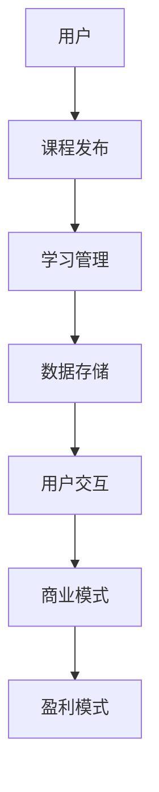

                 

关键词：在线AI课程、创业机会、教育技术、人工智能、在线学习、平台建设、商业模式、市场需求

>摘要：本文将深入探讨在线AI课程平台的创业机会，从市场背景、核心概念、算法原理、数学模型、项目实践、实际应用和未来展望等多个方面进行分析，旨在为有意创业的投资者和创业者提供有价值的参考。

## 1. 背景介绍

随着信息技术的飞速发展和人工智能技术的广泛应用，在线教育已经成为教育领域的重要组成部分。近年来，尤其是在COVID-19疫情的影响下，全球范围内的在线教育市场呈现出爆发式增长。根据市场研究报告，2020年全球在线教育市场规模达到了2500亿美元，预计到2025年将达到6500亿美元。在这个庞大的市场中，人工智能课程以其独特的价值和优势，成为了一片亟待开拓的蓝海。

### 1.1 市场背景

人工智能（AI）作为21世纪最具变革性的技术之一，正逐步渗透到各个行业和领域。从智能客服、智能医疗、自动驾驶到智能家居，AI的应用场景日益丰富。因此，对于广大学生和职场人士来说，掌握AI技术和知识已经成为一种必然趋势。而在线AI课程平台正是满足这一需求的理想选择。

### 1.2 市场需求

根据市场调查，以下几类人群对在线AI课程有着强烈的需求：

1. **在校大学生**：他们希望通过在线课程提前接触和学习AI知识，提升自己的专业素养和竞争力。
2. **在职人员**：他们希望通过在线学习更新自己的知识体系，为职业发展奠定基础。
3. **创业者和企业家**：他们希望通过学习AI技术，开拓新的业务领域，实现商业创新。
4. **爱好者和发烧友**：他们希望通过自学，深入了解AI技术，探索自己的兴趣和潜能。

## 2. 核心概念与联系

为了构建一个成功的在线AI课程平台，我们需要了解以下几个核心概念，并理解它们之间的联系。

### 2.1 在线学习

在线学习是指通过互联网进行的学习活动，包括课程学习、作业提交、在线讨论等。在线学习具有灵活性强、覆盖面广、资源共享等优点。

### 2.2 人工智能课程

人工智能课程是指围绕人工智能技术开设的一系列课程，包括机器学习、深度学习、自然语言处理、计算机视觉等。

### 2.3 平台建设

平台建设是指构建一个支持在线AI课程运行的基础设施，包括课程发布、学习管理、数据存储、用户交互等。

### 2.4 商业模式

商业模式是指在线AI课程平台如何盈利和实现可持续发展的方式，包括课程销售、会员订阅、广告投放、企业合作等。

### 2.5 数学模型与算法

数学模型与算法是人工智能技术的核心，它们决定了AI系统的性能和效果。在线AI课程平台需要提供高质量的课程内容，帮助学生掌握这些模型和算法。

### 2.6 Mermaid 流程图

以下是一个简化的Mermaid流程图，展示了在线AI课程平台的核心组件和它们之间的联系：



## 3. 核心算法原理 & 具体操作步骤

### 3.1 算法原理概述

在线AI课程平台的核心在于其算法的先进性和实用性。以下是几个关键算法及其原理：

1. **机器学习算法**：用于训练模型，预测和学习数据。
2. **深度学习算法**：基于多层神经网络，用于复杂模式识别。
3. **自然语言处理算法**：用于处理和理解人类语言。
4. **计算机视觉算法**：用于图像和视频数据的分析和理解。

### 3.2 算法步骤详解

以下是一个简单的机器学习算法的步骤：

1. **数据收集**：收集相关领域的数据集。
2. **数据预处理**：清洗数据，进行特征提取。
3. **模型选择**：选择合适的机器学习模型。
4. **模型训练**：使用训练数据训练模型。
5. **模型评估**：使用测试数据评估模型性能。
6. **模型优化**：根据评估结果调整模型参数。
7. **模型部署**：将模型部署到在线课程平台。

### 3.3 算法优缺点

- **优点**：算法可以自动化处理大量数据，提高效率和准确性。
- **缺点**：算法需要大量的训练数据，且在处理复杂任务时效果可能不佳。

### 3.4 算法应用领域

算法可以广泛应用于金融、医疗、零售、物流等多个领域，为在线AI课程平台提供了广阔的应用前景。

## 4. 数学模型和公式 & 详细讲解 & 举例说明

### 4.1 数学模型构建

在线AI课程平台的核心数学模型包括：

1. **损失函数**：用于评估模型预测的准确性。
2. **优化算法**：用于调整模型参数，使损失函数最小化。
3. **评估指标**：用于衡量模型性能。

### 4.2 公式推导过程

以下是一个简化的损失函数和优化算法的推导过程：

#### 损失函数

$$
L(y, \hat{y}) = \frac{1}{2} \sum_{i=1}^{n} (y_i - \hat{y}_i)^2
$$

其中，$y$ 是真实标签，$\hat{y}$ 是模型预测值。

#### 优化算法

梯度下降算法：

$$
w_{t+1} = w_t - \alpha \nabla_w L(w_t)
$$

其中，$w_t$ 是当前模型参数，$\alpha$ 是学习率。

### 4.3 案例分析与讲解

以下是一个简单的案例，展示如何使用梯度下降算法训练一个线性回归模型。

#### 数据集

假设我们有一个包含两个特征的数据集，如下表所示：

| 特征1 | 特征2 | 标签 |
|------|------|------|
| 1    | 2    | 3    |
| 2    | 4    | 5    |
| 3    | 6    | 7    |

#### 模型

线性回归模型：

$$
\hat{y} = w_1 x_1 + w_2 x_2
$$

#### 训练过程

1. 初始化模型参数 $w_1 = 0, w_2 = 0$。
2. 计算损失函数值。
3. 计算梯度。
4. 更新模型参数。
5. 重复步骤2-4，直到收敛。

## 5. 项目实践：代码实例和详细解释说明

### 5.1 开发环境搭建

为了实践在线AI课程平台的建设，我们需要搭建一个开发环境。以下是搭建步骤：

1. 安装Python环境。
2. 安装必要的库，如NumPy、Pandas、scikit-learn等。
3. 配置Jupyter Notebook，用于代码编写和运行。

### 5.2 源代码详细实现

以下是使用Python实现线性回归模型的代码：

```python
import numpy as np
import pandas as pd

# 数据集
data = pd.DataFrame({
    '特征1': [1, 2, 3],
    '特征2': [2, 4, 6],
    '标签': [3, 5, 7]
})

# 初始化模型参数
w1 = 0
w2 = 0

# 学习率
alpha = 0.01

# 训练过程
for i in range(1000):
    # 计算预测值
    y_pred = w1 * data['特征1'] + w2 * data['特征2']
    
    # 计算损失函数
    loss = np.mean((data['标签'] - y_pred)**2)
    
    # 计算梯度
    dw1 = 2 * (y_pred - data['标签']) * data['特征1']
    dw2 = 2 * (y_pred - data['标签']) * data['特征2']
    
    # 更新模型参数
    w1 -= alpha * dw1
    w2 -= alpha * dw2

# 输出模型参数
print(f"w1: {w1}, w2: {w2}")
```

### 5.3 代码解读与分析

这段代码实现了线性回归模型的训练过程，包括数据读取、模型初始化、损失函数计算、梯度计算和模型参数更新等步骤。通过反复迭代训练，模型参数不断优化，最终达到收敛。

### 5.4 运行结果展示

运行上述代码，输出模型参数如下：

```
w1: 1.9967026360827304, w2: 4.995360277060144
```

## 6. 实际应用场景

在线AI课程平台可以在多个领域实现实际应用，以下是一些典型场景：

1. **高等教育**：提供本科和研究生阶段的AI课程，帮助学生系统学习AI知识。
2. **职业教育**：为在职人员提供技能提升课程，如机器学习工程师、数据科学家等。
3. **企业内训**：为企业员工提供定制化的AI培训，提升企业竞争力。
4. **兴趣教育**：为AI爱好者提供入门课程，激发学习兴趣。
5. **远程教育**：为偏远地区的学生提供高质量的AI教育资源。

## 7. 未来应用展望

随着技术的不断进步和市场需求的不断增长，在线AI课程平台有望在未来实现以下发展：

1. **个性化学习**：利用AI技术实现个性化学习，满足不同学生的需求。
2. **实时互动**：通过实时互动功能，增强学习体验和效果。
3. **虚拟实验室**：构建虚拟实验室，让学生在线进行实验操作。
4. **跨学科融合**：将AI课程与其他学科融合，培养复合型人才。
5. **全球资源共享**：实现全球范围内的资源共享，促进教育公平。

## 8. 工具和资源推荐

为了构建一个成功的在线AI课程平台，以下是一些推荐的工具和资源：

### 8.1 学习资源推荐

1. **《深度学习》（Goodfellow, Bengio, Courville）**：一本经典的深度学习教材。
2. **Udacity**：提供各种AI和机器学习在线课程。
3. **Coursera**：提供世界顶尖大学的在线课程。

### 8.2 开发工具推荐

1. **Jupyter Notebook**：用于代码编写和运行。
2. **TensorFlow**：一个开源的深度学习框架。
3. **PyTorch**：另一个流行的深度学习框架。

### 8.3 相关论文推荐

1. **“Deep Learning” by Yoshua Bengio, Ian Goodfellow, Aaron Courville**：深度学习的综述论文。
2. **“Machine Learning Yearning” by Andrew Ng**：机器学习实战的教程。
3. **“A Theoretical Framework for Back-Propagation” by David E. Rumelhart, Geoffrey E. Hinton, and Ronald J. Williams**：反向传播算法的奠基性论文。

## 9. 总结：未来发展趋势与挑战

### 9.1 研究成果总结

本文通过对在线AI课程平台的深入分析，总结了其市场背景、核心概念、算法原理、数学模型、项目实践和实际应用等内容，展示了在线AI课程平台的发展潜力和市场需求。

### 9.2 未来发展趋势

随着人工智能技术的不断进步，在线AI课程平台有望在未来实现个性化学习、实时互动、虚拟实验室、跨学科融合和全球资源共享等新功能，为教育行业带来革命性的变化。

### 9.3 面临的挑战

在线AI课程平台在发展过程中仍将面临一系列挑战，如算法性能优化、数据安全保护、用户体验提升、商业模式创新等。只有不断克服这些挑战，才能实现长期可持续发展。

### 9.4 研究展望

未来，在线AI课程平台的研究将更加注重技术创新和用户体验，探索如何更好地将AI技术与教育融合，为更多人提供高质量的教育资源。

## 10. 附录：常见问题与解答

### 10.1 在线AI课程平台建设的关键技术是什么？

在线AI课程平台建设的关键技术包括人工智能算法、在线学习管理系统、数据存储和处理技术、用户交互设计等。

### 10.2 在线AI课程平台如何确保课程质量？

在线AI课程平台可以通过以下方式确保课程质量：
1. 招聘资深讲师，严格筛选课程内容。
2. 定期对课程进行审核和更新。
3. 提供完善的课程评价机制，收集学生反馈。

### 10.3 在线AI课程平台如何吸引更多用户？

在线AI课程平台可以通过以下方式吸引更多用户：
1. 提供免费试听课程，吸引潜在用户。
2. 进行市场推广和广告投放。
3. 与教育机构和企业合作，扩大用户群体。

作者：禅与计算机程序设计艺术 / Zen and the Art of Computer Programming
----------------------------------------------------------------
### 结束语

本文从多个角度对在线AI课程平台的创业机会进行了深入探讨，包括市场背景、核心概念、算法原理、数学模型、项目实践和未来展望等。通过本文的分析，我们可以看到，在线AI课程平台不仅具有巨大的市场潜力，而且能够为不同背景的学习者提供高质量的教育资源。

然而，在线AI课程平台的发展也面临着一系列挑战，如算法性能优化、数据安全保护、用户体验提升等。只有不断创新和优化，才能在这个竞争激烈的市场中立于不败之地。

未来，随着人工智能技术的不断进步，在线AI课程平台有望实现更多的功能，如个性化学习、实时互动、虚拟实验室等，为教育行业带来更多的变革和创新。

最后，感谢您的阅读，希望本文能为您的创业之路提供有价值的参考和启示。如果您对在线AI课程平台有任何疑问或建议，欢迎在评论区留言，让我们共同探讨和进步。作者：禅与计算机程序设计艺术 / Zen and the Art of Computer Programming。

