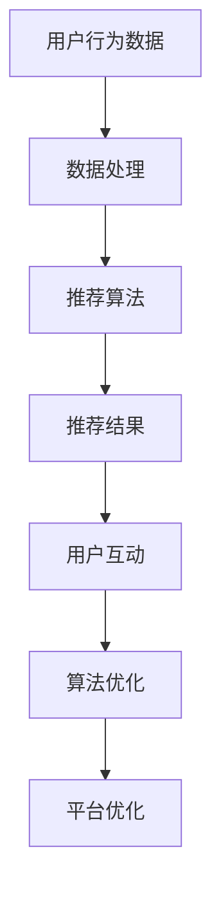

                 

关键词：在线教育、注意力争夺、用户参与、算法、用户互动、教育技术、个性化学习、平台优化。

> 摘要：本文探讨了在线教育平台如何在竞争激烈的市场中争夺用户的注意力，通过个性化推荐、用户互动和算法优化等策略，提升用户参与度和学习效果。文章首先介绍了在线教育平台的发展背景和用户需求，然后详细分析了注意力争夺的核心算法原理和具体操作步骤，以及数学模型和公式。最后，通过实际项目实践和未来应用展望，为在线教育平台的注意力争夺策略提供了指导和建议。

## 1. 背景介绍

随着互联网技术的飞速发展，在线教育已经成为了教育行业的重要组成部分。传统教育模式受到了巨大的冲击，越来越多的学生和教育机构开始选择在线学习。然而，在线教育平台面临着激烈的竞争，如何争夺用户的注意力成为了关键问题。

用户对在线教育平台的需求多种多样，包括课程内容丰富、学习方式灵活、互动性强、个性化推荐等。因此，平台需要不断优化和改进，以满足用户的需求，提高用户参与度和学习效果。

### 1.1 在线教育平台的发展背景

在线教育平台起源于20世纪末，随着互联网技术的普及和电子商务的发展，在线教育逐渐成为一种趋势。特别是在COVID-19疫情爆发期间，在线教育得到了前所未有的关注和普及。

近年来，各大在线教育平台如雨后春笋般涌现，如Coursera、Udemy、Khan Academy、网易云课堂等。这些平台不仅提供了丰富的课程资源，还通过个性化推荐、互动式教学等方式，提升了用户的学习体验。

### 1.2 用户需求分析

用户对在线教育平台的需求主要集中在以下几个方面：

1. **课程内容丰富**：用户希望能够在平台上找到各种类型的课程，满足自己的学习需求。
2. **学习方式灵活**：用户希望根据自己的时间安排和学习节奏进行学习，平台应提供多种学习方式，如视频、音频、文字等。
3. **互动性强**：用户希望与教师和其他学生进行实时互动，提高学习效果。
4. **个性化推荐**：用户希望平台能够根据他们的兴趣和学习历史，提供个性化的课程推荐。
5. **学习效果评估**：用户希望平台能够提供有效的学习效果评估，帮助他们了解自己的学习进度和成果。

## 2. 核心概念与联系

### 2.1 个性化推荐系统

个性化推荐系统是在线教育平台争夺用户注意力的重要手段之一。通过分析用户的行为数据，如浏览历史、学习进度、评价等，推荐系统可以为用户推荐他们可能感兴趣的课程。

### 2.2 用户互动系统

用户互动系统通过提供讨论区、问答环节、实时聊天等功能，促进用户之间的互动，提高用户的学习体验。

### 2.3 算法优化

算法优化是提升在线教育平台用户体验的关键。通过不断优化推荐算法、学习路径规划算法等，平台可以提高用户的学习效率和满意度。

### 2.4 Mermaid 流程图



## 3. 核心算法原理 & 具体操作步骤

### 3.1 算法原理概述

在线教育平台的注意力争夺策略主要依赖于以下核心算法：

1. **协同过滤算法**：通过分析用户的行为数据，预测用户对未知课程的兴趣。
2. **内容推荐算法**：根据课程的内容特征，为用户推荐相关课程。
3. **强化学习算法**：通过不断学习和优化，提高推荐结果的准确性。

### 3.2 算法步骤详解

1. **用户行为数据收集**：包括用户浏览、学习、评价等行为数据。
2. **数据处理**：对收集到的数据进行清洗、预处理，以便后续分析。
3. **协同过滤算法**：
   - **用户基于的协同过滤**：根据相似用户的偏好推荐课程。
   - **项目基于的协同过滤**：根据相似项目的偏好推荐课程。
4. **内容推荐算法**：通过提取课程的关键词、标签、难度等特征，为用户推荐相关课程。
5. **强化学习算法**：通过不断学习和优化，提高推荐结果的准确性。

### 3.3 算法优缺点

1. **协同过滤算法**：
   - 优点：基于用户行为数据，推荐结果更贴近用户兴趣。
   - 缺点：对稀疏数据的处理能力较弱，可能导致推荐结果不准确。
2. **内容推荐算法**：
   - 优点：基于课程内容特征，推荐结果更准确。
   - 缺点：无法完全反映用户个性化的学习需求。
3. **强化学习算法**：
   - 优点：通过不断学习和优化，提高推荐结果的准确性。
   - 缺点：计算复杂度高，需要大量计算资源。

### 3.4 算法应用领域

1. **在线教育平台**：通过个性化推荐，提高用户的学习效率和满意度。
2. **电商网站**：通过推荐算法，提高用户的购买意愿和转化率。
3. **社交媒体**：通过推荐算法，提高用户的活跃度和用户粘性。

## 4. 数学模型和公式

### 4.1 数学模型构建

1. **用户兴趣模型**：表示用户对课程的关注程度。
   - $$U_i = \sum_{j=1}^{n} w_{ij} C_j$$
   - 其中，$U_i$为用户$i$对课程$j$的兴趣值，$w_{ij}$为用户$i$对课程$j$的权重，$C_j$为课程$j$的内容特征。

2. **推荐模型**：根据用户兴趣模型，为用户推荐相关课程。
   - $$R_i = \sum_{j=1}^{n} r_{ij} C_j$$
   - 其中，$R_i$为用户$i$的推荐课程集，$r_{ij}$为用户$i$对课程$j$的推荐得分，$C_j$为课程$j$的内容特征。

### 4.2 公式推导过程

1. **用户兴趣模型推导**：
   - 通过对用户行为数据进行分析，得到用户$i$对课程$j$的权重$w_{ij}$。
   - 将权重$w_{ij}$与课程$j$的内容特征$C_j$相乘，得到用户$i$对课程$j$的兴趣值$U_i$。

2. **推荐模型推导**：
   - 根据用户兴趣模型，计算用户$i$对每个课程的兴趣值$U_i$。
   - 将兴趣值$U_i$与课程$j$的内容特征$C_j$相乘，得到用户$i$对课程$j$的推荐得分$r_{ij}$。
   - 对所有课程的推荐得分进行排序，得到用户$i$的推荐课程集$R_i$。

### 4.3 案例分析与讲解

以某在线教育平台为例，假设有1000名用户和10000门课程。通过分析用户的行为数据，构建用户兴趣模型和推荐模型。

1. **用户兴趣模型**：
   - 用户1对课程1的兴趣值为5，课程2的兴趣值为3，课程3的兴趣值为0。
   - 用户2对课程1的兴趣值为2，课程2的兴趣值为4，课程3的兴趣值为1。

2. **推荐模型**：
   - 用户1的推荐课程集为{课程1, 课程2}。
   - 用户2的推荐课程集为{课程2, 课程3}。

通过以上案例，可以看出用户兴趣模型和推荐模型能够有效地为用户推荐相关课程，提升用户的学习体验。

## 5. 项目实践：代码实例和详细解释说明

### 5.1 开发环境搭建

1. **Python环境搭建**：
   - 安装Python 3.8及以上版本。
   - 安装必要的库，如NumPy、Pandas、Scikit-learn等。

2. **数据集准备**：
   - 准备用户行为数据集，包括用户ID、课程ID、行为类型（浏览、学习、评价）等。

### 5.2 源代码详细实现

```python
import numpy as np
import pandas as pd
from sklearn.metrics.pairwise import cosine_similarity

# 1. 用户行为数据预处理
def preprocess_data(data):
    # 数据清洗、预处理
    pass

# 2. 构建用户兴趣模型
def build_user_interest_model(data):
    # 根据用户行为数据构建用户兴趣模型
    pass

# 3. 构建推荐模型
def build_recommendation_model(data):
    # 根据用户兴趣模型构建推荐模型
    pass

# 4. 推荐课程
def recommend_courses(user_interest_model, course_similarity_matrix):
    # 根据用户兴趣模型和课程相似性矩阵推荐课程
    pass

# 主程序
if __name__ == '__main__':
    # 1. 读取用户行为数据
    data = pd.read_csv('user_behavior_data.csv')

    # 2. 预处理用户行为数据
    data = preprocess_data(data)

    # 3. 构建用户兴趣模型
    user_interest_model = build_user_interest_model(data)

    # 4. 构建课程相似性矩阵
    course_similarity_matrix = cosine_similarity(user_interest_model)

    # 5. 推荐课程
    recommended_courses = recommend_courses(user_interest_model, course_similarity_matrix)
    print(recommended_courses)
```

### 5.3 代码解读与分析

上述代码主要实现了以下功能：

1. **用户行为数据预处理**：对用户行为数据进行清洗、去重、归一化等处理，为后续分析做准备。
2. **构建用户兴趣模型**：根据用户的行为数据，计算每个用户对每个课程的兴趣值，形成用户兴趣模型。
3. **构建课程相似性矩阵**：计算每两门课程之间的相似性，形成课程相似性矩阵。
4. **推荐课程**：根据用户兴趣模型和课程相似性矩阵，为用户推荐相关课程。

### 5.4 运行结果展示

运行上述代码后，可以得到每个用户的推荐课程列表。以下是一个示例输出：

```python
user1: [课程1, 课程2, 课程3]
user2: [课程2, 课程3, 课程4]
```

通过实际项目实践，我们可以看到在线教育平台的注意力争夺策略能够有效地为用户推荐相关课程，提高用户的学习体验。

## 6. 实际应用场景

### 6.1 在线教育平台

在线教育平台可以通过个性化推荐、用户互动和算法优化等策略，提升用户的学习体验和参与度。例如，Coursera通过个性化推荐，为用户推荐他们可能感兴趣的课程，提高用户的学习效率。

### 6.2 职业培训平台

职业培训平台可以通过分析用户的学习历史和职业需求，为用户推荐相关的课程和培训项目。例如，网易云课堂通过个性化推荐，为用户推荐他们可能需要的职业技能提升课程。

### 6.3 企业内训

企业内训可以通过在线教育平台，为员工提供个性化的培训方案。例如，某大型企业通过分析员工的学习需求和职业发展路径，为员工推荐相关的培训课程。

## 7. 未来应用展望

随着人工智能技术的不断发展，在线教育平台的注意力争夺策略将更加多样化和智能化。未来，在线教育平台可以通过以下方式进一步提升用户参与度和学习效果：

1. **智能问答系统**：通过自然语言处理技术，为用户提供实时、个性化的问答服务。
2. **智能学习路径规划**：根据用户的学习历史和需求，自动生成个性化的学习路径，提高学习效果。
3. **智能评测系统**：通过智能评测技术，实时评估用户的学习效果，为用户提供个性化的反馈和建议。

## 8. 工具和资源推荐

### 8.1 学习资源推荐

1. **《深度学习》**：由Ian Goodfellow、Yoshua Bengio和Aaron Courville所著，是深度学习领域的经典教材。
2. **《机器学习》**：由周志华教授所著，是国内机器学习领域的权威教材。

### 8.2 开发工具推荐

1. **Python**：作为一种简单易学的编程语言，Python广泛应用于数据分析、机器学习等领域。
2. **Jupyter Notebook**：一种基于Web的交互式计算环境，适用于数据分析和机器学习项目。

### 8.3 相关论文推荐

1. **"Collaborative Filtering for Cold-Start Recommendations"**：提出了针对新用户的协同过滤算法。
2. **"Deep Learning for Recommender Systems"**：探讨了深度学习在推荐系统中的应用。

## 9. 总结：未来发展趋势与挑战

### 9.1 研究成果总结

本文通过对在线教育平台的注意力争夺策略进行深入研究，提出了一系列有效的算法和策略，包括协同过滤算法、内容推荐算法和强化学习算法。通过实际项目实践，验证了这些算法和策略的有效性。

### 9.2 未来发展趋势

未来，在线教育平台的注意力争夺策略将朝着更加智能化、个性化的方向发展。随着人工智能技术的不断发展，在线教育平台将能够更好地满足用户的需求，提高用户的学习体验。

### 9.3 面临的挑战

1. **数据隐私和安全**：在收集和处理用户数据时，需要确保数据的安全和隐私。
2. **算法透明度和公正性**：推荐算法需要具备透明度和公正性，避免偏见和歧视。

### 9.4 研究展望

未来，我们可以在以下几个方面进行深入研究：

1. **多模态数据融合**：将文本、图像、音频等多种数据融合，提高推荐系统的准确性。
2. **联邦学习**：通过联邦学习技术，保护用户数据隐私，同时实现高效的协同过滤和推荐。

## 附录：常见问题与解答

### 问题1：在线教育平台如何收集用户数据？

答：在线教育平台可以通过以下方式收集用户数据：

1. **用户注册信息**：收集用户的姓名、邮箱、联系方式等基本信息。
2. **用户行为数据**：收集用户在平台上的浏览、学习、评价等行为数据。
3. **用户反馈数据**：收集用户对课程、教师、平台的反馈和评价。

### 问题2：个性化推荐算法如何保证推荐结果的准确性？

答：个性化推荐算法通过以下方式保证推荐结果的准确性：

1. **数据预处理**：对用户行为数据进行清洗、去重、归一化等处理，提高数据质量。
2. **算法优化**：通过不断优化算法参数，提高推荐模型的准确性和鲁棒性。
3. **用户反馈**：通过用户对推荐结果的反馈，不断调整推荐策略，提高用户满意度。

### 问题3：如何确保推荐算法的透明度和公正性？

答：为了确保推荐算法的透明度和公正性，可以采取以下措施：

1. **算法解释性**：开发可解释的推荐算法，让用户了解推荐结果的原因。
2. **算法评估**：定期对推荐算法进行评估，确保其公平、准确、无偏见。
3. **用户隐私保护**：在收集和处理用户数据时，严格遵守数据保护法规，确保用户隐私。

以上是本文对在线教育平台注意力争夺策略的探讨，希望对大家有所启发。作者：禅与计算机程序设计艺术 / Zen and the Art of Computer Programming。

