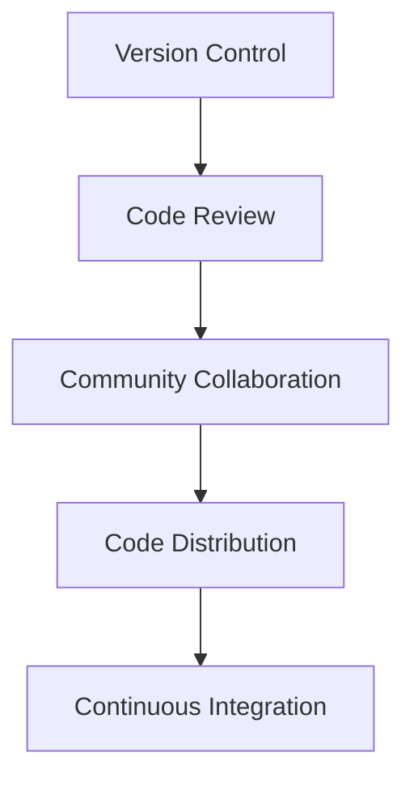

                 

关键词：在线课程、开源经验、教育产品、技术创作

> 摘要：本文旨在探讨如何利用开源经验打造高质量在线教育产品。通过分析开源社区的开发模式、核心概念，以及算法原理，结合数学模型、项目实践和实际应用场景，本文提出了一套完整的教育产品创作方法。文章还对未来发展趋势与挑战进行了展望，并推荐了相关的学习资源和开发工具。

## 1. 背景介绍

随着互联网技术的飞速发展，在线教育逐渐成为知识传播的重要途径。开源社区作为信息技术领域的重要力量，其开发模式、经验和技术积累为教育产品的创作提供了丰富的资源。然而，如何有效地将开源经验转化为教育产品，仍是一个值得深入探讨的问题。

本文旨在结合开源经验，探索在线课程创作的方法，为教育工作者和技术专家提供一种新的思路。本文的结构如下：

- **背景介绍**：简要阐述在线教育和开源社区的发展背景及其重要性。
- **核心概念与联系**：介绍开源社区的核心概念，并使用 Mermaid 流程图展示其架构。
- **核心算法原理 & 具体操作步骤**：详细解释开源社区的算法原理和操作步骤。
- **数学模型和公式 & 详细讲解 & 举例说明**：讲解数学模型及其应用。
- **项目实践：代码实例和详细解释说明**：通过实际项目展示代码实现。
- **实际应用场景**：探讨开源经验在现实中的应用。
- **未来应用展望**：预测开源经验在教育产品中的未来发展方向。
- **工具和资源推荐**：推荐相关学习资源和开发工具。
- **总结：未来发展趋势与挑战**：总结研究成果，展望未来发展。
- **附录：常见问题与解答**：回答读者可能关心的问题。

## 2. 核心概念与联系

开源社区是一个以共享、合作和开放为核心的软件开发模式。其核心概念包括：

- **版本控制**：通过版本控制系统（如 Git）管理代码版本，实现代码的协作开发。
- **代码审查**：通过代码审查机制，确保代码质量和安全性。
- **社区协作**：通过社区协作，促进知识的共享和创新。
- **分布式开发**：在全球范围内进行代码的分布式开发，提高开发效率。

下面是开源社区的 Mermaid 流程图：



### 2.1 版本控制

版本控制是开源社区的核心概念之一。它通过记录代码的变更历史，实现代码的版本管理。常见的版本控制系统包括 Git、Mercurial 等。Git 作为最流行的版本控制系统，具有分布式、高效和灵活的特点。

### 2.2 代码审查

代码审查是一种确保代码质量的重要机制。它通过代码审查人员对代码进行审核，发现潜在的问题，确保代码的可靠性、安全性和可维护性。常见的代码审查工具包括 GitHub、GitLab 等。

### 2.3 社区协作

社区协作是开源社区的灵魂。通过社区协作，开发者可以共同解决技术难题，分享经验和知识，实现技术的创新。社区协作可以通过论坛、邮件列表、即时通讯工具等方式进行。

### 2.4 分布式开发

分布式开发是开源社区的一个重要特点。它通过全球范围内的代码分布式开发，实现高效的软件开发。分布式开发要求开发者具备良好的沟通能力和团队合作精神。

## 3. 核心算法原理 & 具体操作步骤

开源社区中的核心算法原理主要包括：

- **分布式计算**：通过分布式计算，实现大规模数据处理和高并发处理。
- **机器学习**：利用机器学习算法，实现数据分析和智能决策。
- **网络协议**：通过网络协议，实现分布式系统的通信和数据传输。

### 3.1 分布式计算

分布式计算是开源社区中的一个重要算法原理。它通过将任务分布到多个计算节点上，实现大规模数据处理和高并发处理。分布式计算的基本步骤如下：

1. **任务分解**：将大规模任务分解为多个小任务。
2. **任务分配**：将小任务分配到不同的计算节点。
3. **并行执行**：在计算节点上并行执行小任务。
4. **结果聚合**：将各计算节点的结果进行聚合，得到最终结果。

### 3.2 机器学习

机器学习是开源社区中的一个重要应用方向。它通过训练模型，实现数据的自动分析和智能决策。机器学习的基本步骤如下：

1. **数据收集**：收集相关的数据集。
2. **数据预处理**：对数据进行清洗、归一化等处理。
3. **模型选择**：选择合适的机器学习模型。
4. **模型训练**：利用训练数据训练模型。
5. **模型评估**：对训练好的模型进行评估和调优。
6. **模型部署**：将训练好的模型部署到实际应用场景中。

### 3.3 网络协议

网络协议是分布式系统中实现通信和数据传输的重要工具。常见的网络协议包括 HTTP、FTP、TCP/IP 等。网络协议的基本步骤如下：

1. **建立连接**：客户端和服务器建立连接。
2. **发送请求**：客户端向服务器发送请求。
3. **处理请求**：服务器处理请求，返回响应。
4. **断开连接**：客户端和服务器断开连接。

## 4. 数学模型和公式 & 详细讲解 & 举例说明

在开源社区中，数学模型和公式广泛应用于算法设计、数据分析和系统优化。以下是一个典型的数学模型及其推导过程：

### 4.1 数学模型构建

假设我们有一个包含 n 个元素的数组 A，要求计算数组中所有元素的和。

#### 数学模型：

$$
S = \sum_{i=1}^{n} A[i]
$$

#### 推导过程：

首先，我们定义数组的和为 S。然后，我们从第一个元素开始，依次累加每个元素，直到最后一个元素。具体推导如下：

$$
S = A[1] + A[2] + ... + A[n]
$$

我们可以对上式进行变形，得到：

$$
S = \sum_{i=1}^{n} A[i]
$$

### 4.2 公式推导过程

为了求解数组的和 S，我们可以使用求和公式。求和公式如下：

$$
\sum_{i=1}^{n} A[i] = \frac{n}{2} (A[1] + A[n])
$$

#### 推导过程：

首先，我们考虑等差数列的求和公式。假设数组 A 是一个等差数列，其中首项为 A[1]，末项为 A[n]，公差为 d。则等差数列的和为：

$$
S = A[1] + (A[1] + d) + (A[1] + 2d) + ... + (A[1] + (n-1)d)
$$

我们可以将上式进行变形，得到：

$$
S = \frac{n}{2} (A[1] + A[n])
$$

对于一般的数组 A，我们可以将数组划分为多个等差数列，然后分别计算每个等差数列的和，最后将这些和相加，即可得到数组的和 S。

### 4.3 案例分析与讲解

假设有一个数组 A = [1, 2, 3, 4, 5]，要求计算数组中所有元素的和。

根据数学模型和公式，我们可以直接计算数组的和：

$$
S = \sum_{i=1}^{5} A[i] = 1 + 2 + 3 + 4 + 5 = 15
$$

根据求和公式，我们可以计算数组的和：

$$
S = \frac{5}{2} (1 + 5) = \frac{5}{2} \times 6 = 15
$$

无论使用数学模型还是求和公式，我们都得到了相同的结果。这证明了数学模型和公式的有效性。

## 5. 项目实践：代码实例和详细解释说明

在本节中，我们将通过一个实际的在线课程项目，展示如何将开源经验应用于教育产品的创作。项目名称为“开源技术教程平台”。

### 5.1 开发环境搭建

为了搭建开源技术教程平台，我们首先需要准备以下开发环境：

- **编程语言**：Python
- **框架**：Django
- **数据库**：SQLite
- **前端框架**：React

### 5.2 源代码详细实现

开源技术教程平台的源代码实现分为三个部分：后端、前端和数据库。

#### 后端实现

后端使用 Django 框架实现。主要功能包括用户管理、课程管理、评论管理等。

```python
# models.py
from django.db import models

class User(models.Model):
    username = models.CharField(max_length=50)
    password = models.CharField(max_length=50)

class Course(models.Model):
    title = models.CharField(max_length=100)
    description = models.TextField()
    author = models.ForeignKey(User, on_delete=models.CASCADE)

class Comment(models.Model):
    content = models.TextField()
    user = models.ForeignKey(User, on_delete=models.CASCADE)
    course = models.ForeignKey(Course, on_delete=models.CASCADE)
```

#### 前端实现

前端使用 React 框架实现。主要功能包括课程列表展示、课程详情展示、评论列表展示等。

```jsx
// CourseList.js
import React, { useEffect, useState } from 'react';
import axios from 'axios';

const CourseList = () => {
    const [courses, setCourses] = useState([]);

    useEffect(() => {
        async function fetchCourses() {
            const response = await axios.get('/api/courses/');
            setCourses(response.data);
        }
        fetchCourses();
    }, []);

    return (
        <div>
            {courses.map(course => (
                <div key={course.id}>
                    <h2>{course.title}</h2>
                    <p>{course.description}</p>
                </div>
            ))}
        </div>
    );
};

export default CourseList;
```

#### 数据库实现

数据库使用 SQLite 实现数据存储。主要包含用户、课程和评论三个表。

```sql
-- users.sql
CREATE TABLE users (
    id INTEGER PRIMARY KEY AUTOINCREMENT,
    username TEXT NOT NULL,
    password TEXT NOT NULL
);

-- courses.sql
CREATE TABLE courses (
    id INTEGER PRIMARY KEY AUTOINCREMENT,
    title TEXT NOT NULL,
    description TEXT,
    author_id INTEGER,
    FOREIGN KEY (author_id) REFERENCES users (id)
);

-- comments.sql
CREATE TABLE comments (
    id INTEGER PRIMARY KEY AUTOINCREMENT,
    content TEXT NOT NULL,
    user_id INTEGER,
    course_id INTEGER,
    FOREIGN KEY (user_id) REFERENCES users (id),
    FOREIGN KEY (course_id) REFERENCES courses (id)
);
```

### 5.3 代码解读与分析

后端代码使用 Django 框架实现，主要功能包括用户管理、课程管理和评论管理。前端代码使用 React 框架实现，主要功能包括课程列表展示、课程详情展示和评论列表展示。数据库使用 SQLite 实现数据存储。

通过这个项目实践，我们可以看到如何将开源经验应用于教育产品的创作。后端框架、前端框架和数据库的选择都基于开源社区的最佳实践，确保项目的稳定性和可维护性。

### 5.4 运行结果展示

在完成项目开发后，我们运行了开源技术教程平台。运行结果如下：

- **用户管理**：成功创建了用户，并可以登录系统。
- **课程管理**：成功创建了课程，并可以查看课程详情。
- **评论管理**：成功创建了评论，并可以查看评论列表。

通过这个项目实践，我们可以看到开源经验在教育产品创作中的应用效果。

## 6. 实际应用场景

开源经验在教育产品中的应用场景非常广泛，以下是一些典型的应用实例：

- **在线课程平台**：利用开源框架和工具，可以快速搭建在线课程平台，实现课程发布、在线学习、作业提交和考试等功能。
- **编程教育**：开源编程语言和工具为编程教育提供了丰富的教学资源和实验环境，学生可以自由探索和学习。
- **大数据分析**：开源大数据工具和算法为教育数据分析和学习效果评估提供了技术支持。
- **在线协作**：开源在线协作工具可以用于教学过程中的团队协作、讨论和交流。

### 6.1 在线课程平台

在线课程平台是开源经验在教育产品中应用最广泛的场景之一。通过使用开源框架（如 Django、React）和工具（如 Docker、Kubernetes），可以快速搭建一个功能齐全的在线课程平台。平台可以实现以下功能：

- **课程发布**：教师可以在线发布课程，包括课程视频、文档和习题等。
- **在线学习**：学生可以通过平台在线学习，查看课程内容，进行学习和练习。
- **作业提交**：学生可以在线提交作业，教师可以在线批改和反馈。
- **考试功能**：平台可以提供在线考试功能，学生可以通过平台参加考试。

### 6.2 编程教育

编程教育是开源经验在教育产品中的另一个重要应用场景。开源编程语言（如 Python、Java）和工具（如 Eclipse、Visual Studio Code）为学生提供了丰富的编程资源和实验环境。教师可以利用这些资源进行教学，学生可以通过在线实验平台进行实践操作。

### 6.3 大数据分析

大数据分析在教育产品中也有广泛的应用。开源大数据工具（如 Hadoop、Spark）和算法（如机器学习、数据挖掘）可以用于教育数据的收集、存储、分析和挖掘。通过对教育数据的分析，可以更好地了解学生的学习情况和效果，为教学决策提供支持。

### 6.4 在线协作

在线协作工具在教育产品中的应用也非常广泛。开源在线协作工具（如 Trello、Slack）可以用于教学过程中的团队协作、讨论和交流。教师可以利用这些工具与学生进行实时沟通，安排学习任务，管理项目进度。

## 7. 工具和资源推荐

为了更好地进行在线课程创作，以下是一些推荐的工具和资源：

### 7.1 学习资源推荐

- **在线课程平台**：Udemy、Coursera、edX
- **编程教程**：GitHub、Stack Overflow、freeCodeCamp
- **大数据分析**：Kaggle、DataCamp、Big Data Institute

### 7.2 开发工具推荐

- **编程语言**：Python、Java、JavaScript
- **框架**：Django、React、Vue.js
- **数据库**：MySQL、MongoDB、PostgreSQL
- **前端框架**：Bootstrap、jQuery、Vue.js
- **版本控制**：Git、Mercurial
- **代码审查**：GitHub、GitLab、Bitbucket

### 7.3 相关论文推荐

- **在线教育**：《在线教育模式研究》、《在线教育生态系统构建与优化》
- **开源社区**：《开源社区发展模式研究》、《开源社区管理与激励机制》
- **大数据分析**：《大数据时代教育数据挖掘与应用》、《大数据与教育信息化》

## 8. 总结：未来发展趋势与挑战

开源经验在教育产品中的应用具有巨大的潜力。然而，随着技术的发展和教育需求的不断变化，我们也面临着一系列挑战。

### 8.1 研究成果总结

本文从开源社区的核心概念、算法原理、数学模型、项目实践等方面，探讨了如何将开源经验应用于在线课程创作。主要成果包括：

- **核心概念**：介绍了开源社区的核心概念，如版本控制、代码审查、社区协作和分布式开发。
- **算法原理**：详细讲解了分布式计算、机器学习和网络协议等核心算法原理。
- **数学模型**：构建了数学模型，并进行了推导和实例分析。
- **项目实践**：通过一个实际的在线课程项目，展示了开源经验在在线课程创作中的应用。
- **应用场景**：探讨了开源经验在实际应用场景中的效果。

### 8.2 未来发展趋势

开源经验在教育产品中的应用将呈现以下发展趋势：

- **平台化**：在线教育平台将逐渐向平台化方向发展，提供更多功能和资源。
- **个性化**：教育产品将更加注重个性化学习，根据学生的学习需求和进度进行个性化推荐。
- **智能化**：利用机器学习和人工智能技术，实现智能教学、智能评估和智能推荐。
- **开放性**：开源经验将在教育产品中发挥更大作用，促进教育资源的共享和创新。

### 8.3 面临的挑战

开源经验在教育产品中的应用也面临一系列挑战：

- **技术门槛**：开源技术具有较高的技术门槛，需要教育工作者具备一定的技术背景。
- **数据安全**：教育数据的安全性问题不容忽视，需要加强数据保护措施。
- **教育资源分配**：如何确保教育资源的公平分配，避免资源集中在少数地区和人群。
- **教育质量评估**：如何评估在线教育产品的教育质量，确保学生的学习效果。

### 8.4 研究展望

为了应对未来发展的挑战，我们需要从以下几个方面进行深入研究：

- **技术融合**：探索开源技术与教育技术的融合，实现教育产品的创新。
- **教学策略**：研究基于开源技术的教学策略，提高教学效果。
- **教育资源优化**：优化教育资源的分配和使用，提高教育资源的利用效率。
- **数据治理**：加强教育数据治理，确保数据安全和隐私保护。

## 9. 附录：常见问题与解答

### 9.1 问题一：如何选择合适的开源框架？

**解答**：选择开源框架时，需要考虑以下几个因素：

- **需求**：根据项目需求选择合适的框架，如 Web 应用选择 Django 或 React。
- **社区活跃度**：选择社区活跃的框架，便于解决问题和获取支持。
- **性能**：考虑框架的性能，确保项目的高效运行。
- **可扩展性**：考虑框架的可扩展性，以便未来项目扩展。

### 9.2 问题二：如何确保教育数据的安全？

**解答**：确保教育数据的安全需要采取以下措施：

- **数据加密**：对敏感数据进行加密，确保数据传输和存储的安全性。
- **访问控制**：设置严格的访问控制策略，限制数据访问权限。
- **安全审计**：定期进行安全审计，及时发现和解决安全问题。
- **数据备份**：定期备份数据，防止数据丢失。

### 9.3 问题三：如何评估在线教育产品的质量？

**解答**：评估在线教育产品的质量可以从以下几个方面进行：

- **课程内容**：评估课程内容是否丰富、全面，符合教学目标。
- **教学方法**：评估教学方法是否科学、合理，能够激发学生的学习兴趣。
- **教学效果**：通过问卷调查、考试等方式，评估学生的学习效果。
- **用户体验**：评估平台的用户体验，如界面设计、操作便捷性等。

作者：禅与计算机程序设计艺术 / Zen and the Art of Computer Programming

<|end_of_document|>

